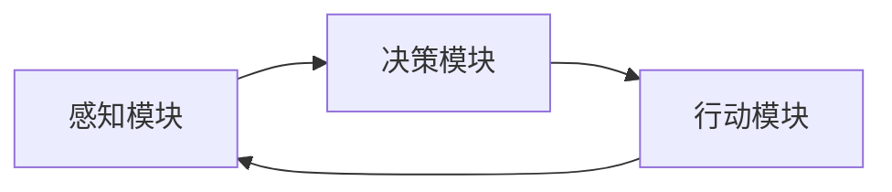

# 性能优化：提高AI Agent的响应速度

> 关键词：性能优化、AI Agent、响应速度、算法优化、硬件加速

> 摘要：本文围绕提高AI Agent响应速度这一核心主题展开深入探讨。详细阐述了AI Agent的核心概念、相关算法原理，通过数学模型和公式进行理论分析，并结合实际案例展示如何在项目中进行性能优化。同时，介绍了AI Agent在不同领域的实际应用场景，推荐了学习资源、开发工具框架以及相关论文著作。最后，对AI Agent性能优化的未来发展趋势与挑战进行总结，并提供常见问题解答和扩展阅读参考资料，旨在为读者提供全面且深入的关于提高AI Agent响应速度的知识体系。

## 1. 背景介绍 
### 1.1 目的和范围
随着人工智能技术的飞速发展，AI Agent在各个领域得到了广泛应用，如智能客服、自动驾驶、智能家居等。然而，AI Agent的响应速度成为了制约其进一步发展和应用的关键因素之一。本文的目的在于深入研究如何提高AI Agent的响应速度，涵盖从算法优化、硬件加速到实际项目中的性能调优等多个方面，旨在为开发者和研究人员提供全面的性能优化方案。

### 1.2 预期读者
本文的预期读者包括人工智能领域的开发者、研究人员、软件工程师以及对AI Agent性能优化感兴趣的技术爱好者。无论您是初学者还是有一定经验的专业人士，都能从本文中获取有价值的信息和技术指导。

### 1.3 文档结构概述
本文将按照以下结构进行组织：首先介绍AI Agent的核心概念与联系，包括其原理和架构；接着详细讲解核心算法原理及具体操作步骤，并使用Python代码进行阐述；然后通过数学模型和公式对性能优化进行理论分析，并举例说明；随后结合实际项目，展示代码案例并进行详细解释；再介绍AI Agent的实际应用场景；接着推荐相关的学习资源、开发工具框架和论文著作；最后总结未来发展趋势与挑战，提供常见问题解答和扩展阅读参考资料。

### 1.4 术语表
#### 1.4.1 核心术语定义
- **AI Agent**：人工智能代理，是一种能够感知环境、进行决策并采取行动以实现特定目标的软件实体。
- **响应速度**：指AI Agent从接收到输入信息到输出响应结果所花费的时间。
- **性能优化**：通过对系统的算法、架构、硬件等方面进行改进，提高系统的性能指标，如响应速度、吞吐量等。

#### 1.4.2 相关概念解释
- **算法复杂度**：衡量算法执行效率的指标，通常用时间复杂度和空间复杂度来表示。
- **硬件加速**：利用专门的硬件设备，如GPU、FPGA等，来加速计算过程，提高系统的性能。
- **并行计算**：将一个计算任务分解为多个子任务，同时在多个处理器或计算单元上进行计算，以提高计算效率。

#### 1.4.3 缩略词列表
- **CPU**：中央处理器（Central Processing Unit）
- **GPU**：图形处理器（Graphics Processing Unit）
- **FPGA**：现场可编程门阵列（Field-Programmable Gate Array）
- **CNN**：卷积神经网络（Convolutional Neural Network）
- **RNN**：循环神经网络（Recurrent Neural Network）

## 2. 核心概念与联系 
### 2.1 AI Agent的基本原理
AI Agent的基本原理是基于感知、决策和行动的循环过程。AI Agent通过传感器感知环境信息，然后根据内置的算法和模型进行决策，最后通过执行器采取相应的行动。这个过程不断循环，使AI Agent能够适应环境的变化并实现特定的目标。

### 2.2 AI Agent的架构
AI Agent的架构可以分为三个主要部分：感知模块、决策模块和行动模块。感知模块负责收集环境信息，决策模块根据感知到的信息进行推理和决策，行动模块根据决策结果执行相应的操作。以下是AI Agent架构的文本示意图：

```plaintext
+-----------------+
|   感知模块      |
| （传感器输入）  |
+-----------------+
        |
        v
+-----------------+
|   决策模块      |
| （算法和模型）  |
+-----------------+
        |
        v
+-----------------+
|   行动模块      |
| （执行器输出）  |
+-----------------+
```

### 2.3 Mermaid流程图


## 3. 核心算法原理 & 具体操作步骤 
### 3.1 算法选择与优化
在提高AI Agent响应速度的过程中，选择合适的算法至关重要。不同的算法具有不同的时间复杂度和空间复杂度，对响应速度的影响也不同。以下是几种常见的AI算法及其优化方法：

#### 3.1.1 卷积神经网络（CNN）
CNN是一种广泛应用于图像识别、目标检测等领域的深度学习算法。为了提高CNN的响应速度，可以采用以下优化方法：
- **模型剪枝**：去除CNN模型中不重要的参数和连接，减少模型的计算量。
- **量化**：将模型中的浮点数参数转换为整数或低精度浮点数，减少内存占用和计算量。
- **硬件加速**：利用GPU或FPGA等硬件设备加速CNN的计算过程。

以下是一个使用PyTorch实现的简单CNN模型示例：
```python
import torch
import torch.nn as nn

class SimpleCNN(nn.Module):
    def __init__(self):
        super(SimpleCNN, self).__init__()
        self.conv1 = nn.Conv2d(3, 16, kernel_size=3, padding=1)
        self.relu1 = nn.ReLU()
        self.pool1 = nn.MaxPool2d(kernel_size=2, stride=2)
        self.conv2 = nn.Conv2d(16, 32, kernel_size=3, padding=1)
        self.relu2 = nn.ReLU()
        self.pool2 = nn.MaxPool2d(kernel_size=2, stride=2)
        self.fc1 = nn.Linear(32 * 8 * 8, 128)
        self.relu3 = nn.ReLU()
        self.fc2 = nn.Linear(128, 10)

    def forward(self, x):
        x = self.pool1(self.relu1(self.conv1(x)))
        x = self.pool2(self.relu2(self.conv2(x)))
        x = x.view(-1, 32 * 8 * 8)
        x = self.relu3(self.fc1(x))
        x = self.fc2(x)
        return x

# 创建模型实例
model = SimpleCNN()

# 定义输入数据
input_data = torch.randn(1, 3, 32, 32)

# 前向传播
output = model(input_data)
print(output)
```

#### 3.1.2 循环神经网络（RNN）
RNN是一种适用于处理序列数据的深度学习算法，如自然语言处理、语音识别等。为了提高RNN的响应速度，可以采用以下优化方法：
- **长短时记忆网络（LSTM）或门控循环单元（GRU）**：LSTM和GRU是RNN的改进版本，能够有效解决长序列数据的梯度消失和梯度爆炸问题，提高模型的训练效率和响应速度。
- **并行计算**：将RNN的计算过程并行化，利用多核CPU或GPU进行加速。

以下是一个使用PyTorch实现的简单LSTM模型示例：
```python
import torch
import torch.nn as nn

class SimpleLSTM(nn.Module):
    def __init__(self, input_size, hidden_size, num_layers, output_size):
        super(SimpleLSTM, self).__init__()
        self.hidden_size = hidden_size
        self.num_layers = num_layers
        self.lstm = nn.LSTM(input_size, hidden_size, num_layers, batch_first=True)
        self.fc = nn.Linear(hidden_size, output_size)

    def forward(self, x):
        h0 = torch.zeros(self.num_layers, x.size(0), self.hidden_size).to(x.device)
        c0 = torch.zeros(self.num_layers, x.size(0), self.hidden_size).to(x.device)
        out, _ = self.lstm(x, (h0, c0))
        out = self.fc(out[:, -1, :])
        return out

# 定义模型参数
input_size = 10
hidden_size = 20
num_layers = 2
output_size = 1

# 创建模型实例
model = SimpleLSTM(input_size, hidden_size, num_layers, output_size)

# 定义输入数据
input_data = torch.randn(1, 5, input_size)

# 前向传播
output = model(input_data)
print(output)
```

### 3.2 具体操作步骤
提高AI Agent响应速度的具体操作步骤如下：
1. **分析现有系统**：对现有的AI Agent系统进行全面分析，包括算法复杂度、内存使用情况、计算瓶颈等。
2. **选择优化方法**：根据分析结果，选择合适的优化方法，如算法优化、硬件加速、并行计算等。
3. **实施优化措施**：按照选择的优化方法，对AI Agent系统进行优化。
4. **测试和评估**：对优化后的系统进行测试和评估，比较优化前后的响应速度和性能指标。
5. **持续优化**：根据测试和评估结果，不断调整和优化系统，直到达到满意的性能指标。

## 4. 数学模型和公式 & 详细讲解 & 举例说明 
### 4.1 时间复杂度分析
时间复杂度是衡量算法执行效率的重要指标，通常用大O表示法来表示。以下是几种常见算法的时间复杂度分析：

#### 4.1.1 线性搜索算法
线性搜索算法是一种简单的搜索算法，其基本思想是从数组的第一个元素开始，依次比较每个元素，直到找到目标元素或遍历完整个数组。线性搜索算法的时间复杂度为 $O(n)$，其中 $n$ 是数组的长度。

以下是线性搜索算法的Python代码实现：
```python
def linear_search(arr, target):
    for i in range(len(arr)):
        if arr[i] == target:
            return i
    return -1

# 测试代码
arr = [1, 3, 5, 7, 9]
target = 5
result = linear_search(arr, target)
print(result)
```

#### 4.1.2 二分搜索算法
二分搜索算法是一种高效的搜索算法，其基本思想是将数组分成两部分，然后根据目标元素与中间元素的大小关系，决定在左半部分还是右半部分继续搜索。二分搜索算法的时间复杂度为 $O(log n)$，其中 $n$ 是数组的长度。

以下是二分搜索算法的Python代码实现：
```python
def binary_search(arr, target):
    left, right = 0, len(arr) - 1
    while left <= right:
        mid = (left + right) // 2
        if arr[mid] == target:
            return mid
        elif arr[mid] < target:
            left = mid + 1
        else:
            right = mid - 1
    return -1

# 测试代码
arr = [1, 3, 5, 7, 9]
target = 5
result = binary_search(arr, target)
print(result)
```

### 4.2 空间复杂度分析
空间复杂度是衡量算法在执行过程中所占用的存储空间的指标，通常用大O表示法来表示。以下是几种常见算法的空间复杂度分析：

#### 4.2.1 递归算法
递归算法是一种通过调用自身来解决问题的算法。递归算法的空间复杂度主要取决于递归调用的深度，通常为 $O(n)$，其中 $n$ 是递归调用的深度。

以下是一个简单的递归算法示例：
```python
def factorial(n):
    if n == 0 or n == 1:
        return 1
    else:
        return n * factorial(n - 1)

# 测试代码
n = 5
result = factorial(n)
print(result)
```

#### 4.2.2 迭代算法
迭代算法是一种通过循环来解决问题的算法。迭代算法的空间复杂度通常为 $O(1)$，因为它只需要常数级的额外存储空间。

以下是一个简单的迭代算法示例：
```python
def factorial(n):
    result = 1
    for i in range(1, n + 1):
        result *= i
    return result

# 测试代码
n = 5
result = factorial(n)
print(result)
```

### 4.3 举例说明
假设我们有一个AI Agent需要对一个包含 $1000$ 个元素的数组进行搜索。如果使用线性搜索算法，其时间复杂度为 $O(n)$，则最坏情况下需要进行 $1000$ 次比较；如果使用二分搜索算法，其时间复杂度为 $O(log n)$，则最坏情况下只需要进行 $log_2 1000 \approx 10$ 次比较。可以看出，二分搜索算法的响应速度明显优于线性搜索算法。

## 5. 项目实战：代码实际案例和详细解释说明 
### 5.1  开发环境搭建
在进行项目实战之前，需要搭建相应的开发环境。以下是搭建开发环境的步骤：

#### 5.1.1 安装Python
Python是一种广泛使用的编程语言，许多人工智能框架和库都支持Python。可以从Python官方网站（https://www.python.org/downloads/）下载并安装Python。

#### 5.1.2 安装深度学习框架
常用的深度学习框架有TensorFlow、PyTorch等。可以使用pip命令来安装这些框架：
```bash
pip install tensorflow
pip install torch torchvision
```

#### 5.1.3 安装其他必要的库
根据项目的需求，可能还需要安装其他必要的库，如NumPy、Pandas等。可以使用pip命令来安装这些库：
```bash
pip install numpy pandas
```

### 5.2  源代码详细实现和代码解读
以下是一个使用PyTorch实现的简单图像分类项目的源代码示例：

```python
import torch
import torch.nn as nn
import torch.optim as optim
from torchvision import datasets, transforms
from torch.utils.data import DataLoader

# 定义数据预处理
transform = transforms.Compose([
    transforms.ToTensor(),
    transforms.Normalize((0.5,), (0.5,))
])

# 加载训练集和测试集
train_dataset = datasets.MNIST(root='./data', train=True,
                               download=True, transform=transform)
test_dataset = datasets.MNIST(root='./data', train=False,
                              download=True, transform=transform)

# 创建数据加载器
train_loader = DataLoader(train_dataset, batch_size=64, shuffle=True)
test_loader = DataLoader(test_dataset, batch_size=64, shuffle=False)

# 定义简单的神经网络模型
class SimpleNet(nn.Module):
    def __init__(self):
        super(SimpleNet, self).__init__()
        self.fc1 = nn.Linear(28 * 28, 128)
        self.relu = nn.ReLU()
        self.fc2 = nn.Linear(128, 10)

    def forward(self, x):
        x = x.view(-1, 28 * 28)
        x = self.relu(self.fc1(x))
        x = self.fc2(x)
        return x

# 创建模型实例
model = SimpleNet()

# 定义损失函数和优化器
criterion = nn.CrossEntropyLoss()
optimizer = optim.SGD(model.parameters(), lr=0.01, momentum=0.5)

# 训练模型
def train(model, train_loader, criterion, optimizer, epochs):
    model.train()
    for epoch in range(epochs):
        running_loss = 0.0
        for i, (images, labels) in enumerate(train_loader):
            optimizer.zero_grad()
            outputs = model(images)
            loss = criterion(outputs, labels)
            loss.backward()
            optimizer.step()
            running_loss += loss.item()
        print(f'Epoch {epoch + 1}, Loss: {running_loss / len(train_loader)}')

# 测试模型
def test(model, test_loader):
    model.eval()
    correct = 0
    total = 0
    with torch.no_grad():
        for images, labels in test_loader:
            outputs = model(images)
            _, predicted = torch.max(outputs.data, 1)
            total += labels.size(0)
            correct += (predicted == labels).sum().item()
    print(f'Accuracy: {100 * correct / total}%')

# 训练和测试模型
train(model, train_loader, criterion, optimizer, epochs=5)
test(model, test_loader)
```

### 5.3  代码解读与分析
#### 5.3.1 数据预处理
使用`transforms.Compose`函数定义了数据预处理的步骤，包括将图像转换为张量和归一化处理。

#### 5.3.2 数据加载
使用`datasets.MNIST`加载MNIST数据集，并使用`DataLoader`创建数据加载器，方便批量加载数据。

#### 5.3.3 模型定义
定义了一个简单的神经网络模型`SimpleNet`，包含两个全连接层和一个ReLU激活函数。

#### 5.3.4 损失函数和优化器
使用交叉熵损失函数`nn.CrossEntropyLoss`和随机梯度下降优化器`optim.SGD`。

#### 5.3.5 训练和测试
定义了`train`和`test`函数，分别用于训练和测试模型。在训练过程中，使用反向传播算法更新模型的参数；在测试过程中，计算模型的准确率。

## 6. 实际应用场景 
### 6.1 智能客服
在智能客服系统中，AI Agent需要快速响应用户的问题，提供准确的答案和解决方案。通过提高AI Agent的响应速度，可以提高用户满意度和系统的服务效率。

### 6.2 自动驾驶
在自动驾驶领域，AI Agent需要实时感知周围环境，做出决策并控制车辆的行驶。响应速度的快慢直接影响到自动驾驶的安全性和可靠性。

### 6.3 智能家居
在智能家居系统中，AI Agent需要根据用户的指令和环境变化，快速控制各种智能设备的开关和调节。提高AI Agent的响应速度可以提升用户的使用体验。

## 7. 工具和资源推荐
### 7.1 学习资源推荐
#### 7.1.1 书籍推荐
- 《深度学习》（Deep Learning），作者：Ian Goodfellow、Yoshua Bengio和Aaron Courville
- 《Python深度学习》（Deep Learning with Python），作者：Francois Chollet
- 《人工智能：一种现代的方法》（Artificial Intelligence: A Modern Approach），作者：Stuart Russell和Peter Norvig

#### 7.1.2 在线课程
- Coursera上的“深度学习专项课程”（Deep Learning Specialization），由Andrew Ng教授授课
- edX上的“人工智能导论”（Introduction to Artificial Intelligence），由麻省理工学院（MIT）提供
- 网易云课堂上的“Python人工智能实战”（Python Artificial Intelligence Practice）

#### 7.1.3 技术博客和网站
- Medium上的人工智能相关博客
- arXiv.org上的最新研究论文
- TensorFlow官方博客和PyTorch官方博客

### 7.2 开发工具框架推荐
#### 7.2.1 IDE和编辑器
- PyCharm：一款专门为Python开发设计的集成开发环境（IDE）
- Jupyter Notebook：一种交互式的开发环境，适合进行数据分析和模型实验
- Visual Studio Code：一款轻量级的代码编辑器，支持多种编程语言和插件

#### 7.2.2 调试和性能分析工具
- TensorBoard：TensorFlow提供的可视化工具，用于监控模型的训练过程和性能指标
- PyTorch Profiler：PyTorch提供的性能分析工具，用于分析模型的计算瓶颈和内存使用情况
- cProfile：Python标准库中的性能分析模块，用于分析Python代码的执行时间和调用关系

#### 7.2.3 相关框架和库
- TensorFlow：一个开源的深度学习框架，广泛应用于各种人工智能任务
- PyTorch：一个基于Python的深度学习框架，具有动态图和易于使用的特点
- NumPy：一个用于科学计算的Python库，提供了高效的多维数组和数学函数
- Pandas：一个用于数据处理和分析的Python库，提供了灵活的数据结构和数据操作方法

### 7.3 相关论文著作推荐
#### 7.3.1 经典论文
- “ImageNet Classification with Deep Convolutional Neural Networks”，作者：Alex Krizhevsky、Ilya Sutskever和Geoffrey E. Hinton
- “Long Short-Term Memory”，作者：Sepp Hochreiter和Jürgen Schmidhuber
- “Attention Is All You Need”，作者：Ashish Vaswani等人

#### 7.3.2 最新研究成果
- arXiv.org上的最新人工智能研究论文
- 顶级学术会议如NeurIPS、ICML、CVPR等上的研究成果

#### 7.3.3 应用案例分析
- 各大科技公司的技术博客和开源项目，如Google AI Blog、Facebook AI Research等
- 相关领域的学术期刊和会议论文，如Journal of Artificial Intelligence Research（JAIR）、ACM Transactions on Intelligent Systems and Technology（TIST）等

## 8. 总结：未来发展趋势与挑战
### 8.1 未来发展趋势
- **硬件技术的不断进步**：随着GPU、FPGA等硬件技术的不断发展，AI Agent的计算能力将得到进一步提升，响应速度也将更快。
- **算法的不断优化**：研究人员将不断探索新的算法和优化方法，以提高AI Agent的性能和效率。
- **多模态融合**：未来的AI Agent将融合多种感知方式，如视觉、听觉、触觉等，以提供更加全面和准确的服务。

### 8.2 挑战
- **数据隐私和安全问题**：随着AI Agent的广泛应用，数据隐私和安全问题将变得更加突出，需要采取有效的措施来保护用户的数据安全。
- **模型可解释性问题**：深度学习模型通常是黑盒模型，难以解释其决策过程和结果，这在一些关键领域如医疗、金融等可能会带来风险。
- **资源消耗问题**：提高AI Agent的响应速度通常需要大量的计算资源和能源消耗，如何在保证性能的前提下降低资源消耗是一个亟待解决的问题。

## 9. 附录：常见问题与解答
### 9.1 如何选择合适的算法来提高AI Agent的响应速度？
选择合适的算法需要考虑多个因素，如问题的类型、数据的特点、计算资源等。一般来说，可以根据算法的时间复杂度和空间复杂度来评估其性能，选择复杂度较低的算法。同时，还可以参考相关的研究论文和开源项目，了解最新的算法和优化方法。

### 9.2 硬件加速对提高AI Agent响应速度有多大作用？
硬件加速可以显著提高AI Agent的响应速度。GPU和FPGA等硬件设备具有并行计算的能力，能够同时处理多个计算任务，从而大大缩短计算时间。在深度学习领域，使用GPU进行训练和推理已经成为主流。

### 9.3 如何进行模型的量化和剪枝？
模型的量化和剪枝是两种常用的模型压缩方法。量化是将模型中的浮点数参数转换为整数或低精度浮点数，减少内存占用和计算量；剪枝是去除模型中不重要的参数和连接，减少模型的复杂度。可以使用深度学习框架提供的工具和方法来进行模型的量化和剪枝，如TensorFlow的TensorRT和PyTorch的torch.nn.utils.prune。

## 10. 扩展阅读 & 参考资料
### 10.1 扩展阅读
- 《机器学习》（Machine Learning），作者：Tom M. Mitchell
- 《强化学习：原理与Python实现》（Reinforcement Learning: An Introduction），作者：Richard S. Sutton和Andrew G. Barto
- 《计算机视觉：算法与应用》（Computer Vision: Algorithms and Applications），作者：Richard Szeliski

### 10.2 参考资料
- TensorFlow官方文档（https://www.tensorflow.org/）
- PyTorch官方文档（https://pytorch.org/）
- arXiv.org（https://arxiv.org/）
- ACM Digital Library（https://dl.acm.org/）

作者：AI天才研究院/AI Genius Institute & 禅与计算机程序设计艺术 /Zen And The Art of Computer Programming