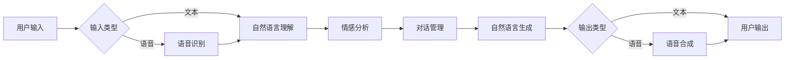

# 情感智能对话系统AI Agent：LLM驱动的深度交互

> 关键词：情感智能对话系统、AI Agent、大语言模型（LLM）、深度交互、自然语言处理

> 摘要：本文围绕情感智能对话系统AI Agent展开，探讨其在大语言模型（LLM）驱动下实现深度交互的相关技术。详细介绍了该系统的核心概念、算法原理、数学模型，通过项目实战案例展示代码实现与分析，阐述了其实际应用场景，推荐了相关学习资源、开发工具和论文著作，最后总结了未来发展趋势与挑战，并提供常见问题解答和扩展阅读参考资料。旨在帮助读者全面了解情感智能对话系统AI Agent及其在LLM驱动下的深度交互技术。

## 1. 背景介绍 
### 1.1 目的和范围
随着人工智能技术的飞速发展，自然语言处理领域取得了显著的成果。情感智能对话系统AI Agent作为其中的重要应用方向，旨在实现更加自然、智能且具有情感感知的人机对话。本文章的目的是深入探讨在大语言模型（LLM）驱动下，情感智能对话系统AI Agent如何实现深度交互。范围涵盖了系统的核心概念、算法原理、数学模型、项目实战、实际应用场景等多个方面，为读者提供全面而深入的技术解读。

### 1.2 预期读者
本文预期读者包括对人工智能、自然语言处理、情感计算等领域感兴趣的技术爱好者、研究人员、开发人员。同时，也适合相关专业的学生作为学习参考资料，帮助他们了解情感智能对话系统AI Agent的前沿技术和发展趋势。

### 1.3 文档结构概述
本文将按照以下结构进行阐述：首先介绍核心概念与联系，包括情感智能对话系统AI Agent和LLM的基本原理和架构；接着讲解核心算法原理及具体操作步骤，并使用Python源代码进行详细阐述；然后介绍数学模型和公式，并结合具体例子进行说明；之后通过项目实战展示代码实际案例和详细解释；再探讨实际应用场景；随后推荐相关的工具和资源；最后总结未来发展趋势与挑战，提供常见问题解答和扩展阅读参考资料。

### 1.4 术语表
#### 1.4.1 核心术语定义
- **情感智能对话系统AI Agent**：一种能够理解用户情感、意图，并以具有情感色彩的方式进行回应的智能对话实体，它可以根据用户的输入进行情感分析和处理，提供更加个性化、人性化的交互体验。
- **大语言模型（LLM）**：基于大量文本数据进行训练的深度学习模型，具有强大的语言理解和生成能力，能够处理自然语言任务，如文本生成、问答系统等。
- **深度交互**：指在对话过程中，系统不仅能够理解用户的字面意思，还能感知用户的情感、意图、上下文等信息，实现更加自然、流畅、富有情感的对话交流。

#### 1.4.2 相关概念解释
- **自然语言处理（NLP）**：是人工智能的一个重要分支，主要研究如何让计算机理解、处理和生成自然语言。情感智能对话系统AI Agent是NLP的一个具体应用，涉及到自然语言理解、自然语言生成等多个方面的技术。
- **情感分析**：是指通过对文本、语音等数据进行分析，识别其中蕴含的情感倾向，如积极、消极、中性等。在情感智能对话系统中，情感分析可以帮助系统更好地理解用户的情感状态，从而提供更加合适的回应。

#### 1.4.3 缩略词列表
- **AI**：Artificial Intelligence，人工智能
- **LLM**：Large Language Model，大语言模型
- **NLP**：Natural Language Processing，自然语言处理

## 2. 核心概念与联系 

### 核心概念原理
#### 情感智能对话系统AI Agent
情感智能对话系统AI Agent的核心原理是通过对用户输入的文本或语音进行处理，识别其中的语义、情感和意图，然后根据这些信息生成合适的回应。系统通常包括多个模块，如自然语言理解模块、情感分析模块、对话管理模块和自然语言生成模块。

自然语言理解模块负责解析用户输入的文本，提取其中的关键信息，如实体、关系、意图等。情感分析模块则对用户输入的文本进行情感识别，判断用户的情感状态是积极、消极还是中性。对话管理模块根据用户的意图和上下文信息，决定系统的回应策略。自然语言生成模块则根据对话管理模块的决策，生成自然流畅的文本回应。

#### 大语言模型（LLM）
大语言模型（LLM）是基于深度学习技术构建的语言模型，通常采用Transformer架构。它通过在大规模文本数据上进行无监督学习，学习到语言的统计规律和语义信息，从而能够生成高质量的文本。LLM具有强大的语言理解和生成能力，可以处理各种自然语言任务，如文本生成、问答系统、机器翻译等。

在情感智能对话系统AI Agent中，LLM可以作为核心的语言处理引擎，用于自然语言理解和自然语言生成。它可以帮助系统更好地理解用户的输入，并生成更加自然、流畅的回应。

### 架构的文本示意图
情感智能对话系统AI Agent在LLM驱动下的架构可以描述如下：

用户输入（文本或语音） -> 语音识别模块（如果是语音输入） -> 自然语言理解模块（基于LLM） -> 情感分析模块 -> 对话管理模块 -> 自然语言生成模块（基于LLM） -> 语音合成模块（如果需要语音输出） -> 用户输出（文本或语音）

### Mermaid流程图


## 3. 核心算法原理 & 具体操作步骤 

### 核心算法原理
#### 自然语言理解
在自然语言理解中，我们可以使用预训练的LLM，如GPT系列模型，来对用户输入的文本进行编码。具体来说，我们将用户输入的文本输入到LLM中，LLM会输出每个词的嵌入向量，这些向量包含了词的语义信息。然后，我们可以使用这些嵌入向量进行进一步的处理，如实体识别、意图分类等。

#### 情感分析
情感分析可以使用基于机器学习或深度学习的方法。一种常见的方法是使用预训练的情感分类模型，如BERT情感分类模型。我们将用户输入的文本输入到情感分类模型中，模型会输出文本的情感倾向，如积极、消极或中性。

#### 对话管理
对话管理的核心是根据用户的意图和上下文信息，决定系统的回应策略。一种简单的方法是使用规则引擎，根据预设的规则来生成回应。另一种方法是使用强化学习，通过与用户的交互不断学习最优的回应策略。

#### 自然语言生成
自然语言生成可以使用LLM来实现。我们将对话管理模块生成的回应策略作为输入，输入到LLM中，LLM会生成自然流畅的文本回应。

### 具体操作步骤
#### 步骤1：数据预处理
首先，我们需要对用户输入的文本进行预处理，包括分词、去除停用词、词干提取等操作。以下是一个使用Python和NLTK库进行数据预处理的示例代码：

```python
import nltk
from nltk.corpus import stopwords
from nltk.stem import PorterStemmer
from nltk.tokenize import word_tokenize

nltk.download('punkt')
nltk.download('stopwords')

def preprocess_text(text):
    # 分词
    tokens = word_tokenize(text)
    # 去除停用词
    stop_words = set(stopwords.words('english'))
    filtered_tokens = [token for token in tokens if token.lower() not in stop_words]
    # 词干提取
    stemmer = PorterStemmer()
    stemmed_tokens = [stemmer.stem(token) for token in filtered_tokens]
    return " ".join(stemmed_tokens)

text = "This is a sample sentence for preprocessing."
preprocessed_text = preprocess_text(text)
print(preprocessed_text)
```

#### 步骤2：自然语言理解
使用预训练的LLM进行自然语言理解。以下是一个使用Hugging Face的Transformers库加载GPT模型进行文本编码的示例代码：

```python
from transformers import GPT2Tokenizer, GPT2Model

tokenizer = GPT2Tokenizer.from_pretrained('gpt2')
model = GPT2Model.from_pretrained('gpt2')

text = "This is a sample sentence."
input_ids = tokenizer.encode(text, return_tensors='pt')
outputs = model(input_ids)
last_hidden_states = outputs.last_hidden_state
print(last_hidden_states.shape)
```

#### 步骤3：情感分析
使用预训练的情感分类模型进行情感分析。以下是一个使用Hugging Face的Transformers库加载BERT情感分类模型进行情感分析的示例代码：

```python
from transformers import AutoTokenizer, AutoModelForSequenceClassification
import torch

tokenizer = AutoTokenizer.from_pretrained('distilbert-base-uncased-finetuned-sst-2-english')
model = AutoModelForSequenceClassification.from_pretrained('distilbert-base-uncased-finetuned-sst-2-english')

text = "This is a great movie!"
inputs = tokenizer(text, return_tensors='pt')
outputs = model(**inputs)
logits = outputs.logits
predicted_class_id = logits.argmax().item()
label = model.config.id2label[predicted_class_id]
print(label)
```

#### 步骤4：对话管理
使用规则引擎进行对话管理。以下是一个简单的规则引擎示例代码：

```python
rules = {
    "问候": ["你好！", "您好！"],
    "询问天气": ["今天天气不错。", "不太清楚天气情况呢。"]
}

def dialogue_management(user_intent):
    if user_intent in rules:
        responses = rules[user_intent]
        import random
        return random.choice(responses)
    else:
        return "我不太明白你的意思。"

user_intent = "问候"
response = dialogue_management(user_intent)
print(response)
```

#### 步骤5：自然语言生成
使用LLM进行自然语言生成。以下是一个使用Hugging Face的Transformers库加载GPT模型进行文本生成的示例代码：

```python
from transformers import GPT2LMHeadModel, GPT2Tokenizer

tokenizer = GPT2Tokenizer.from_pretrained('gpt2')
model = GPT2LMHeadModel.from_pretrained('gpt2')

input_text = "Once upon a time"
input_ids = tokenizer.encode(input_text, return_tensors='pt')
output = model.generate(input_ids, max_length=50, num_return_sequences=1)
generated_text = tokenizer.decode(output[0], skip_special_tokens=True)
print(generated_text)
```

## 4. 数学模型和公式 & 详细讲解 & 举例说明 

### 自然语言理解中的词嵌入模型
在自然语言理解中，我们通常使用词嵌入模型将文本中的词转换为向量表示。常见的词嵌入模型有Word2Vec、GloVe和BERT等。这里以Word2Vec为例进行介绍。

#### Word2Vec原理
Word2Vec是一种基于神经网络的词嵌入模型，它的目标是学习词的分布式表示，使得语义相近的词在向量空间中距离较近。Word2Vec有两种主要的训练方式：连续词袋模型（CBOW）和跳字模型（Skip-gram）。

##### 连续词袋模型（CBOW）
CBOW模型的目标是根据上下文词预测中心词。假设我们有一个长度为 $T$ 的文本序列 $w_1, w_2, \cdots, w_T$，我们选择一个窗口大小 $C$，对于每个中心词 $w_t$，其上下文词为 $w_{t - C}, \cdots, w_{t - 1}, w_{t + 1}, \cdots, w_{t + C}$。CBOW模型的输入是上下文词的词向量之和，输出是中心词的预测概率分布。

数学公式如下：
输入层到隐藏层的计算：
$$
h = \frac{1}{2C} \sum_{i = -C, i \neq 0}^{C} W_{in} v(w_{t + i})
$$
其中，$W_{in}$ 是输入层到隐藏层的权重矩阵，$v(w_{t + i})$ 是上下文词 $w_{t + i}$ 的词向量。

隐藏层到输出层的计算：
$$
u_j = W_{out}^T h
$$
其中，$W_{out}$ 是隐藏层到输出层的权重矩阵，$u_j$ 是输出层第 $j$ 个神经元的输入。

输出层的概率分布：
$$
y_j = \frac{\exp(u_j)}{\sum_{k = 1}^{V} \exp(u_k)}
$$
其中，$V$ 是词汇表的大小，$y_j$ 是预测中心词为第 $j$ 个词的概率。

##### 跳字模型（Skip-gram）
Skip-gram模型的目标是根据中心词预测上下文词。输入是中心词的词向量，输出是上下文词的预测概率分布。

数学公式如下：
输入层到隐藏层的计算：
$$
h = W_{in} v(w_t)
$$
其中，$W_{in}$ 是输入层到隐藏层的权重矩阵，$v(w_t)$ 是中心词 $w_t$ 的词向量。

隐藏层到输出层的计算：
$$
u_j = W_{out}^T h
$$
其中，$W_{out}$ 是隐藏层到输出层的权重矩阵，$u_j$ 是输出层第 $j$ 个神经元的输入。

输出层的概率分布：
$$
y_j = \frac{\exp(u_j)}{\sum_{k = 1}^{V} \exp(u_k)}
$$
其中，$V$ 是词汇表的大小，$y_j$ 是预测上下文词为第 $j$ 个词的概率。

#### 举例说明
假设我们有一个文本序列 "The quick brown fox jumps over the lazy dog"，窗口大小 $C = 2$。对于中心词 "fox"，其上下文词为 "quick", "brown", "jumps", "over"。在CBOW模型中，我们将这四个上下文词的词向量相加并求平均，作为输入到隐藏层的向量 $h$。然后通过隐藏层到输出层的计算，得到预测中心词 "fox" 的概率分布。在Skip-gram模型中，我们将中心词 "fox" 的词向量作为输入，通过隐藏层到输出层的计算，得到预测上下文词 "quick", "brown", "jumps", "over" 的概率分布。

### 情感分析中的逻辑回归模型
在情感分析中，我们可以使用逻辑回归模型进行情感分类。逻辑回归是一种二分类模型，它的目标是根据输入特征预测样本属于正类或负类的概率。

#### 逻辑回归原理
假设我们有一个输入特征向量 $x = [x_1, x_2, \cdots, x_n]$，逻辑回归模型的输出是样本属于正类的概率 $P(y = 1|x)$，其计算公式如下：
$$
P(y = 1|x) = \frac{1}{1 + \exp(-z)}
$$
其中，$z = w_0 + w_1 x_1 + w_2 x_2 + \cdots + w_n x_n$，$w_0, w_1, \cdots, w_n$ 是模型的权重参数。

为了训练逻辑回归模型，我们通常使用最大似然估计法，目标是最大化训练数据的似然函数。似然函数可以表示为：
$$
L(w) = \prod_{i = 1}^{m} P(y^{(i)} = 1|x^{(i)})^{y^{(i)}} (1 - P(y^{(i)} = 1|x^{(i)}))^{1 - y^{(i)}}
$$
其中，$m$ 是训练样本的数量，$x^{(i)}$ 和 $y^{(i)}$ 分别是第 $i$ 个训练样本的输入特征向量和标签。

为了方便计算，我们通常对似然函数取对数，得到对数似然函数：
$$
\ell(w) = \log L(w) = \sum_{i = 1}^{m} [y^{(i)} \log P(y^{(i)} = 1|x^{(i)}) + (1 - y^{(i)}) \log (1 - P(y^{(i)} = 1|x^{(i)}))]
$$
我们的目标是最大化对数似然函数 $\ell(w)$，可以使用梯度上升法来求解最优的权重参数 $w$。

#### 举例说明
假设我们有一个情感分析任务，输入特征是文本的词频向量，标签是情感类别（积极或消极）。我们使用逻辑回归模型进行训练，首先将训练数据的文本转换为词频向量，然后使用梯度上升法更新模型的权重参数，使得对数似然函数最大化。训练完成后，对于一个新的文本，我们将其转换为词频向量，输入到逻辑回归模型中，得到该文本属于积极类的概率。如果概率大于0.5，则预测该文本为积极情感；否则，预测为消极情感。

## 5. 项目实战：代码实际案例和详细解释说明 

### 5.1  开发环境搭建
#### 操作系统
建议使用Linux或Windows操作系统，推荐使用Ubuntu 20.04或Windows 10。

#### Python环境
安装Python 3.7及以上版本。可以从Python官方网站（https://www.python.org/downloads/）下载并安装。

#### 安装必要的库
使用pip安装以下必要的库：
```sh
pip install transformers nltk torch
```
同时，下载NLTK所需的数据：
```python
import nltk
nltk.download('punkt')
nltk.download('stopwords')
```

### 5.2  源代码详细实现和代码解读
以下是一个简单的情感智能对话系统AI Agent的实现代码：

```python
import nltk
from nltk.corpus import stopwords
from nltk.stem import PorterStemmer
from nltk.tokenize import word_tokenize
from transformers import AutoTokenizer, AutoModelForSequenceClassification
import torch

# 数据预处理函数
def preprocess_text(text):
    # 分词
    tokens = word_tokenize(text)
    # 去除停用词
    stop_words = set(stopwords.words('english'))
    filtered_tokens = [token for token in tokens if token.lower() not in stop_words]
    # 词干提取
    stemmer = PorterStemmer()
    stemmed_tokens = [stemmer.stem(token) for token in filtered_tokens]
    return " ".join(stemmed_tokens)

# 情感分析函数
def sentiment_analysis(text):
    tokenizer = AutoTokenizer.from_pretrained('distilbert-base-uncased-finetuned-sst-2-english')
    model = AutoModelForSequenceClassification.from_pretrained('distilbert-base-uncased-finetuned-sst-2-english')
    inputs = tokenizer(text, return_tensors='pt')
    outputs = model(**inputs)
    logits = outputs.logits
    predicted_class_id = logits.argmax().item()
    label = model.config.id2label[predicted_class_id]
    return label

# 对话管理规则
rules = {
    "问候": ["你好！", "您好！"],
    "询问天气": ["今天天气不错。", "不太清楚天气情况呢。"]
}

# 对话管理函数
def dialogue_management(user_intent):
    if user_intent in rules:
        responses = rules[user_intent]
        import random
        return random.choice(responses)
    else:
        return "我不太明白你的意思。"

# 主函数
def main():
    while True:
        user_input = input("请输入你的问题：")
        if user_input.lower() == '退出':
            break
        # 数据预处理
        preprocessed_input = preprocess_text(user_input)
        # 情感分析
        sentiment = sentiment_analysis(preprocessed_input)
        print(f"情感分析结果：{sentiment}")
        # 简单的意图识别（这里只是示例，实际应用中需要更复杂的方法）
        if "你好" in user_input:
            user_intent = "问候"
        elif "天气" in user_input:
            user_intent = "询问天气"
        else:
            user_intent = "未知意图"
        # 对话管理
        response = dialogue_management(user_intent)
        print(f"系统回复：{response}")

if __name__ == "__main__":
    main()
```

### 5.3  代码解读与分析
#### 数据预处理部分
`preprocess_text` 函数负责对用户输入的文本进行预处理，包括分词、去除停用词和词干提取。这些操作可以减少文本的噪声，提高后续处理的准确性。

#### 情感分析部分
`sentiment_analysis` 函数使用预训练的BERT情感分类模型对用户输入的文本进行情感分析。它将文本输入到模型中，得到模型的输出，然后根据输出的logits值预测文本的情感类别。

#### 对话管理部分
`dialogue_management` 函数根据用户的意图选择合适的回应。这里使用了一个简单的规则引擎，根据预设的规则生成回应。

#### 主函数部分
`main` 函数是程序的入口，它不断循环等待用户输入。对于用户输入的文本，先进行数据预处理和情感分析，然后进行简单的意图识别，最后根据意图调用对话管理函数生成回应。

## 6. 实际应用场景 
### 客户服务
情感智能对话系统AI Agent可以应用于客户服务领域，为客户提供更加个性化、人性化的服务。当客户咨询问题时，系统可以感知客户的情感状态，如愤怒、不满、满意等，并根据情感状态调整回应策略。例如，如果客户表现出愤怒情绪，系统可以先进行安抚，然后再解决问题；如果客户表现出满意情绪，系统可以进一步询问客户的需求，提供更多的服务。

### 教育领域
在教育领域，情感智能对话系统AI Agent可以作为智能学习伙伴，与学生进行互动交流。系统可以根据学生的情感状态和学习进度，提供个性化的学习建议和辅导。例如，当学生遇到困难时，系统可以感知到学生的沮丧情绪，给予鼓励和指导；当学生取得进步时，系统可以感知到学生的兴奋情绪，给予表扬和奖励。

### 心理健康领域
情感智能对话系统AI Agent可以用于心理健康咨询和辅导。系统可以通过与用户的对话，感知用户的情感状态和心理问题，并提供相应的建议和支持。例如，当用户感到焦虑、抑郁时，系统可以提供一些放松技巧和心理疏导方法，帮助用户缓解情绪。

### 智能客服机器人
在智能客服机器人中，情感智能对话系统AI Agent可以提高客服机器人的智能水平和服务质量。系统可以理解用户的意图和情感，提供更加准确、有效的回应。例如，在电商平台的客服机器人中，系统可以根据用户的评价和反馈，感知用户的情感状态，及时处理用户的投诉和问题，提高用户的满意度。

## 7. 工具和资源推荐
### 7.1 学习资源推荐
#### 7.1.1 书籍推荐
- 《自然语言处理入门》：作者何晗，本书全面介绍了自然语言处理的基础知识和常用技术，适合初学者入门。
- 《深度学习》：作者Ian Goodfellow、Yoshua Bengio和Aaron Courville，本书是深度学习领域的经典教材，对大语言模型等深度学习技术有深入的讲解。
- 《情感计算》：作者罗军舟、杨明等，本书系统介绍了情感计算的基本概念、理论和方法，以及情感计算在各个领域的应用。

#### 7.1.2 在线课程
- Coursera上的“Natural Language Processing Specialization”：由斯坦福大学教授授课，全面介绍了自然语言处理的各个方面，包括词嵌入、序列模型、机器翻译等。
- edX上的“Deep Learning Specialization”：由Andrew Ng教授授课，深入讲解了深度学习的原理和应用，对理解大语言模型有很大帮助。
- 网易云课堂上的“情感计算与人工智能”：介绍了情感计算的基本理论和方法，以及情感计算在人工智能领域的应用。

#### 7.1.3 技术博客和网站
- Hugging Face Blog：提供了关于大语言模型和自然语言处理的最新技术和研究成果。
- Towards Data Science：是一个数据科学和人工智能领域的博客平台，有很多关于自然语言处理和情感计算的优质文章。
- 机器之心：专注于人工智能领域的资讯和技术解读，提供了丰富的自然语言处理和情感智能对话系统的相关内容。

### 7.2 开发工具框架推荐
#### 7.2.1 IDE和编辑器
- PyCharm：是一款专业的Python集成开发环境，提供了丰富的代码编辑、调试、测试等功能，适合Python开发。
- Visual Studio Code：是一款轻量级的代码编辑器，支持多种编程语言，有丰富的插件扩展，适合快速开发和调试。

#### 7.2.2 调试和性能分析工具
- Py-Spy：是一个Python性能分析工具，可以帮助开发者找出Python代码中的性能瓶颈。
- TensorBoard：是TensorFlow的可视化工具，可以用于可视化深度学习模型的训练过程和性能指标。

#### 7.2.3 相关框架和库
- Transformers：是Hugging Face开发的一个用于自然语言处理的开源库，提供了多种预训练的大语言模型，如GPT、BERT等，方便开发者进行自然语言处理任务的开发。
- NLTK：是一个Python自然语言处理工具包，提供了丰富的语料库和工具，如分词、词性标注、命名实体识别等，适合自然语言处理的初学者。
- Scikit-learn：是一个Python机器学习库，提供了多种机器学习算法和工具，如逻辑回归、决策树、支持向量机等，可用于情感分析等机器学习任务。

### 7.3 相关论文著作推荐
#### 7.3.1 经典论文
- “Attention Is All You Need”：提出了Transformer架构，是大语言模型的基础。
- “BERT: Pre-training of Deep Bidirectional Transformers for Language Understanding”：介绍了BERT模型，开启了预训练语言模型的新时代。
- “Sentiment Analysis: Mining Opinions, Sentiments, and Emotions”：是情感分析领域的经典综述论文，对情感分析的方法和应用进行了全面的介绍。

#### 7.3.2 最新研究成果
- 在ACL（Association for Computational Linguistics）、EMNLP（Conference on Empirical Methods in Natural Language Processing）等自然语言处理领域的顶级会议上，有很多关于情感智能对话系统和大语言模型的最新研究成果。
- ArXiv是一个开放获取的预印本平台，上面有很多关于人工智能和自然语言处理的最新研究论文。

#### 7.3.3 应用案例分析
- 一些知名科技公司的官方博客会分享他们在情感智能对话系统和大语言模型方面的应用案例，如Google、Microsoft、OpenAI等。
- 行业报告和白皮书也会对情感智能对话系统的应用案例进行分析和总结，可以在相关的咨询公司网站上查找。

## 8. 总结：未来发展趋势与挑战
### 未来发展趋势
#### 更加个性化的交互
未来的情感智能对话系统AI Agent将能够更好地理解用户的个性化需求和偏好，提供更加个性化的交互体验。系统可以根据用户的历史对话记录、情感状态、兴趣爱好等信息，生成更加符合用户需求的回应。

#### 多模态交互
除了文本和语音交互，未来的情感智能对话系统AI Agent将支持多模态交互，如视觉、触觉等。系统可以通过摄像头、传感器等设备获取用户的面部表情、肢体语言等信息，更加准确地感知用户的情感状态，提供更加自然、流畅的交互体验。

#### 与其他技术的融合
情感智能对话系统AI Agent将与其他技术，如物联网、虚拟现实、增强现实等进行融合，拓展应用场景。例如，在智能家居中，系统可以与智能设备进行交互，根据用户的情感状态调整家居环境；在虚拟现实和增强现实场景中，系统可以提供更加逼真、沉浸式的交互体验。

### 挑战
#### 情感理解的准确性
目前，情感分析技术虽然取得了一定的进展，但在情感理解的准确性方面仍然存在挑战。不同的文化、语言、语境等因素会影响情感的表达和理解，如何提高情感理解的准确性是未来需要解决的问题。

#### 数据隐私和安全
情感智能对话系统AI Agent需要收集和处理用户的大量数据，包括文本、语音、图像等，这涉及到数据隐私和安全问题。如何保护用户的数据隐私和安全，防止数据泄露和滥用，是未来需要重视的问题。

#### 模型的可解释性
大语言模型通常是黑盒模型，其决策过程难以解释。在情感智能对话系统中，如何提高模型的可解释性，让用户理解系统的决策依据，是未来需要解决的问题。

## 9. 附录：常见问题与解答
### 问题1：情感智能对话系统AI Agent和普通对话系统有什么区别？
解答：情感智能对话系统AI Agent能够感知用户的情感状态，并根据情感状态调整回应策略，提供更加个性化、人性化的交互体验。而普通对话系统通常只关注用户的语义信息，不考虑用户的情感因素。

### 问题2：如何提高情感分析的准确性？
解答：可以从以下几个方面提高情感分析的准确性：
- 使用更多、更丰富的训练数据，包括不同领域、不同情感类型的数据。
- 采用更先进的情感分析模型，如深度学习模型。
- 考虑上下文信息和语境因素，结合语义分析和情感分析。

### 问题3：情感智能对话系统AI Agent可以应用于哪些行业？
解答：情感智能对话系统AI Agent可以应用于多个行业，如客户服务、教育、心理健康、智能客服机器人等。在客户服务领域，系统可以提高客户满意度；在教育领域，系统可以提供个性化的学习辅导；在心理健康领域，系统可以提供心理疏导和支持。

### 问题4：如何选择适合的大语言模型？
解答：选择适合的大语言模型需要考虑以下因素：
- 任务需求：不同的任务对模型的要求不同，如文本生成、问答系统、情感分析等，需要选择适合的模型。
- 模型性能：包括模型的准确率、召回率、F1值等指标，选择性能较好的模型。
- 计算资源：大语言模型通常需要较大的计算资源，需要根据自己的计算资源选择合适的模型。

## 10. 扩展阅读 & 参考资料
### 扩展阅读
- 《人工智能：现代方法》：全面介绍了人工智能的各个领域，包括自然语言处理、机器学习、计算机视觉等。
- 《自然语言处理实战：基于Python和深度学习》：通过实际案例介绍了自然语言处理的各种技术和方法。
- 《情感人工智能：如何创造具有人类情感的机器》：探讨了情感人工智能的发展趋势和应用前景。

### 参考资料
- Hugging Face官方文档：https://huggingface.co/docs
- NLTK官方文档：https://www.nltk.org/
- Scikit-learn官方文档：https://scikit-learn.org/

作者：AI天才研究院/AI Genius Institute & 禅与计算机程序设计艺术 /Zen And The Art of Computer Programming