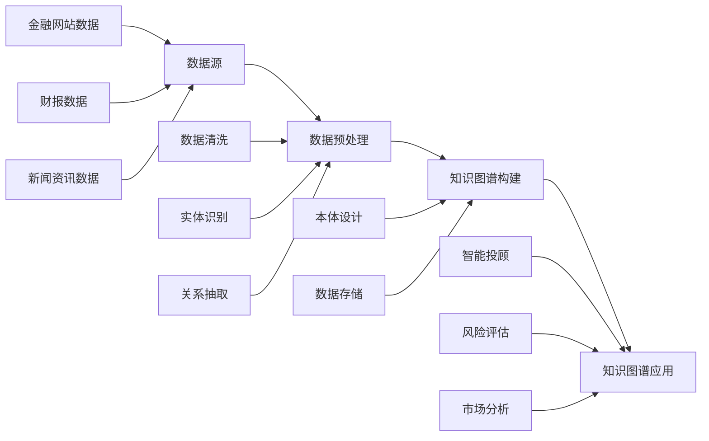

# 打造全面的投资理财知识图谱：方法与工具

> 关键词：投资理财、知识图谱、构建方法、相关工具、应用场景

> 摘要：本文聚焦于打造全面的投资理财知识图谱，详细介绍了其构建的方法与所需工具。首先阐述了投资理财知识图谱的背景，包括目的、预期读者等内容；接着深入讲解核心概念、算法原理、数学模型；通过项目实战展示具体的代码实现和解读；分析了投资理财知识图谱在实际中的应用场景；推荐了相关的学习资源、开发工具和论文著作；最后总结了未来发展趋势与挑战，并对常见问题进行解答，为构建投资理财知识图谱提供了全面且深入的指导。

## 1. 背景介绍 
### 1.1 目的和范围
随着金融市场的不断发展和复杂化，投资理财领域的知识呈现出海量且碎片化的特点。投资者面临着信息过载的问题，难以快速准确地获取和整合有用的知识。打造全面的投资理财知识图谱的目的在于将投资理财领域的各种知识进行结构化组织和关联，形成一个有机的整体，从而帮助投资者更好地理解市场、产品和投资策略，做出更明智的投资决策。

本文章的范围涵盖了投资理财知识图谱的构建方法、核心算法、数学模型、实际应用场景，以及相关的工具和资源推荐等方面。旨在为读者提供一个全面、系统的关于投资理财知识图谱的知识体系，帮助读者了解如何从理论到实践打造这样一个知识图谱。

### 1.2 预期读者
本文的预期读者包括以下几类人群：
- **投资者**：希望通过知识图谱更深入地了解投资理财知识，提高投资决策的准确性和效率。
- **金融从业者**：如银行理财经理、证券分析师等，借助知识图谱更好地服务客户，提升专业能力。
- **数据科学家和工程师**：对知识图谱技术感兴趣，希望将其应用于投资理财领域的专业人士。
- **科研人员**：从事金融信息处理、知识工程等相关领域研究的科研工作者。

### 1.3 文档结构概述
本文将按照以下结构进行组织：
- **核心概念与联系**：介绍投资理财知识图谱的核心概念、原理和架构，并通过文本示意图和 Mermaid 流程图进行展示。
- **核心算法原理 & 具体操作步骤**：详细讲解构建知识图谱所涉及的核心算法，并使用 Python 源代码进行阐述。
- **数学模型和公式 & 详细讲解 & 举例说明**：介绍相关的数学模型和公式，并结合具体例子进行详细讲解。
- **项目实战：代码实际案例和详细解释说明**：通过实际项目案例，展示如何搭建开发环境、实现源代码，并对代码进行解读和分析。
- **实际应用场景**：分析投资理财知识图谱在实际中的应用场景。
- **工具和资源推荐**：推荐相关的学习资源、开发工具和论文著作。
- **总结：未来发展趋势与挑战**：总结投资理财知识图谱的未来发展趋势和面临的挑战。
- **附录：常见问题与解答**：对常见问题进行解答。
- **扩展阅读 & 参考资料**：提供扩展阅读的建议和参考资料。

### 1.4 术语表
#### 1.4.1 核心术语定义
- **知识图谱**：一种基于图的数据结构，由节点（实体）和边（关系）组成，用于表示实体之间的语义关系，将各种知识进行结构化组织和关联。
- **投资理财**：投资者通过合理安排资金，运用储蓄、银行理财产品、债券、基金、股票、期货、外汇、房地产等投资工具，对个人、家庭和企事业单位资产进行管理和分配，达到保值增值的目的。
- **实体**：知识图谱中的节点，表示现实世界中的具体事物，如股票、基金、投资者等。
- **关系**：知识图谱中的边，表示实体之间的联系，如“持有”“投资于”等。

#### 1.4.2 相关概念解释
- **语义网络**：一种早期的知识表示方法，与知识图谱有相似之处，但知识图谱更加注重数据的结构化和标准化，以及实体之间的语义关系的明确表达。
- **本体**：对特定领域中概念和概念之间关系的一种形式化描述，是构建知识图谱的重要基础，为知识图谱提供了统一的词汇和语义规范。

#### 1.4.3 缩略词列表
- **RDF**：Resource Description Framework，资源描述框架，是一种用于表示和交换元数据的标准数据模型，常用于知识图谱的表示。
- **OWL**：Web Ontology Language，网络本体语言，用于描述 Web 上的信息和知识的本体，为知识图谱提供了更丰富的语义表达能力。

## 2. 核心概念与联系 
### 2.1 投资理财知识图谱的概念
投资理财知识图谱是一种专门针对投资理财领域构建的知识图谱。它将投资理财领域的各种实体（如金融产品、投资者、市场指标等）及其之间的关系（如产品归属关系、投资关系等）进行整合和表示，形成一个可视化的、结构化的知识网络。通过这个知识网络，用户可以快速准确地获取和理解投资理财领域的各种知识，发现知识之间的潜在联系。

### 2.2 核心原理
投资理财知识图谱的核心原理基于知识表示和知识推理。知识表示是将投资理财领域的知识以一种计算机能够理解和处理的方式进行表示，常用的表示方法包括 RDF 和 OWL。知识推理则是根据已有的知识，通过一定的推理规则推导出新的知识。例如，根据投资者持有的股票和股票所属的行业，可以推导出投资者在该行业的投资情况。

### 2.3 架构示意图
以下是投资理财知识图谱的架构文本示意图：

```plaintext
|----------------------|
| 数据源               |
| - 金融网站数据       |
| - 财报数据           |
| - 新闻资讯数据       |
|----------------------|
           |
           v
|----------------------|
| 数据预处理           |
| - 数据清洗           |
| - 实体识别           |
| - 关系抽取           |
|----------------------|
           |
           v
|----------------------|
| 知识图谱构建         |
| - 本体设计           |
| - 数据存储           |
|----------------------|
           |
           v
|----------------------|
| 知识图谱应用         |
| - 智能投顾           |
| - 风险评估           |
| - 市场分析           |
|----------------------|
```

### 2.4 Mermaid 流程图


## 3. 核心算法原理 & 具体操作步骤 
### 3.1 实体识别算法
实体识别是指从文本中识别出投资理财领域的实体，如股票名称、基金名称、投资者姓名等。常用的实体识别算法有基于规则的方法和基于机器学习的方法。

#### 基于规则的方法
基于规则的方法通过手工编写规则来识别实体。例如，定义规则“以‘股票’结尾的词语为股票实体”，然后在文本中查找符合该规则的词语。以下是一个简单的 Python 代码示例：

```python
import re

def rule_based_entity_recognition(text):
    pattern = r'\w+股票'
    entities = re.findall(pattern, text)
    return entities

text = "我持有贵州茅台股票和五粮液股票。"
entities = rule_based_entity_recognition(text)
print(entities)
```

#### 基于机器学习的方法
基于机器学习的方法通常使用序列标注模型，如条件随机场（CRF）、长短期记忆网络（LSTM）等。以下是一个使用 Python 和`sklearn-crfsuite`库实现的简单 CRF 实体识别示例：

```python
import sklearn_crfsuite
from sklearn_crfsuite import metrics

# 定义特征函数
def word2features(sent, i):
    word = sent[i][0]
    features = {
        'bias': 1.0,
        'word.lower()': word.lower(),
        'word.isupper()': word.isupper(),
        'word.istitle()': word.istitle(),
        'word.isdigit()': word.isdigit()
    }
    if i > 0:
        word1 = sent[i-1][0]
        features.update({
            '-1:word.lower()': word1.lower(),
            '-1:word.istitle()': word1.istitle(),
            '-1:word.isupper()': word1.isupper()
        })
    else:
        features['BOS'] = True
    if i < len(sent)-1:
        word1 = sent[i+1][0]
        features.update({
            '+1:word.lower()': word1.lower(),
            '+1:word.istitle()': word1.istitle(),
            '+1:word.isupper()': word1.isupper()
        })
    else:
        features['EOS'] = True
    return features

def sent2features(sent):
    return [word2features(sent, i) for i in range(len(sent))]

def sent2labels(sent):
    return [label for token, label in sent]

# 示例数据
train_sents = [
    [('我', 'O'), ('持有', 'O'), ('贵州茅台', 'Stock'), ('股票', 'Stock')],
    [('他', 'O'), ('投资', 'O'), ('了', 'O'), ('华夏基金', 'Fund')]
]

X_train = [sent2features(s) for s in train_sents]
y_train = [sent2labels(s) for s in train_sents]

# 训练模型
crf = sklearn_crfsuite.CRF(
    algorithm='lbfgs',
    c1=0.1,
    c2=0.1,
    max_iterations=100,
    all_possible_transitions=True
)
crf.fit(X_train, y_train)

# 测试数据
test_sents = [
    [('她', 'O'), ('购买', 'O'), ('了', 'O'), ('招商银行', 'Stock'), ('股票', 'Stock')]
]
X_test = [sent2features(s) for s in test_sents]
y_pred = crf.predict(X_test)

print(y_pred)
```

### 3.2 关系抽取算法
关系抽取是指从文本中识别出实体之间的关系。常用的关系抽取算法有基于规则的方法、基于机器学习的方法和基于深度学习的方法。

#### 基于规则的方法
基于规则的方法通过手工编写规则来抽取关系。例如，定义规则“如果文本中出现‘持有’，则前面的实体和后面的实体之间存在‘持有’关系”。以下是一个简单的 Python 代码示例：

```python
import re

def rule_based_relation_extraction(text):
    pattern = r'(\w+)\s*持有\s*(\w+)'
    matches = re.findall(pattern, text)
    relations = []
    for match in matches:
        entity1 = match[0]
        entity2 = match[1]
        relation = ('持有', entity1, entity2)
        relations.append(relation)
    return relations

text = "我持有贵州茅台股票。"
relations = rule_based_relation_extraction(text)
print(relations)
```

#### 基于机器学习的方法
基于机器学习的方法通常使用分类模型，如支持向量机（SVM）、决策树等。以下是一个使用 Python 和`sklearn`库实现的简单 SVM 关系抽取示例：

```python
from sklearn.feature_extraction.text import TfidfVectorizer
from sklearn.svm import SVC

# 示例数据
train_texts = [
    "我持有贵州茅台股票。",
    "他投资了华夏基金。"
]
train_labels = [('持有', '我', '贵州茅台股票'), ('投资', '他', '华夏基金')]

vectorizer = TfidfVectorizer()
X_train = vectorizer.fit_transform(train_texts)

model = SVC()
model.fit(X_train, train_labels)

# 测试数据
test_text = "她购买了招商银行股票。"
X_test = vectorizer.transform([test_text])
predicted_relation = model.predict(X_test)
print(predicted_relation)
```

#### 基于深度学习的方法
基于深度学习的方法通常使用卷积神经网络（CNN）、循环神经网络（RNN）等。以下是一个使用 Python 和`Keras`库实现的简单 CNN 关系抽取示例：

```python
from keras.preprocessing.text import Tokenizer
from keras.preprocessing.sequence import pad_sequences
from keras.models import Sequential
from keras.layers import Embedding, Conv1D, GlobalMaxPooling1D, Dense
import numpy as np

# 示例数据
train_texts = [
    "我持有贵州茅台股票。",
    "他投资了华夏基金。"
]
train_labels = [0, 1]

tokenizer = Tokenizer()
tokenizer.fit_on_texts(train_texts)
sequences = tokenizer.texts_to_sequences(train_texts)
max_length = max([len(seq) for seq in sequences])
X_train = pad_sequences(sequences, maxlen=max_length)

model = Sequential()
model.add(Embedding(input_dim=len(tokenizer.word_index)+1, output_dim=100, input_length=max_length))
model.add(Conv1D(128, 5, activation='relu'))
model.add(GlobalMaxPooling1D())
model.add(Dense(1, activation='sigmoid'))

model.compile(optimizer='adam', loss='binary_crossentropy', metrics=['accuracy'])
model.fit(X_train, np.array(train_labels), epochs=10, batch_size=1)

# 测试数据
test_text = "她购买了招商银行股票。"
test_sequence = tokenizer.texts_to_sequences([test_text])
X_test = pad_sequences(test_sequence, maxlen=max_length)
predicted_label = model.predict(X_test)
print(predicted_label)
```

### 3.3 具体操作步骤
1. **数据收集**：从金融网站、财报、新闻资讯等数据源收集投资理财领域的文本数据。
2. **数据预处理**：对收集到的数据进行清洗，去除噪声和无用信息；使用实体识别算法识别文本中的实体；使用关系抽取算法抽取实体之间的关系。
3. **本体设计**：根据投资理财领域的知识体系，设计知识图谱的本体，定义实体类型、关系类型和属性。
4. **数据存储**：将处理后的数据存储到图数据库中，如 Neo4j、JanusGraph 等。
5. **知识图谱应用开发**：根据实际需求，开发知识图谱的应用，如智能投顾、风险评估、市场分析等。

## 4. 数学模型和公式 & 详细讲解 & 举例说明 
### 4.1 向量空间模型
向量空间模型（Vector Space Model，VSM）是一种常用的文本表示模型，将文本表示为向量的形式，便于计算文本之间的相似度。在投资理财知识图谱中，可以使用向量空间模型来计算实体之间的语义相似度。

#### 原理
在向量空间模型中，每个文本被表示为一个向量，向量的每个维度对应一个词，向量的值表示该词在文本中的权重。常用的权重计算方法有词频 - 逆文档频率（TF - IDF）。

#### 公式
- **词频（TF）**：指某个词在文本中出现的频率。计算公式为：
$$TF_{t,d}=\frac{f_{t,d}}{\max_{t'\in d}f_{t',d}}$$
其中，$TF_{t,d}$ 表示词 $t$ 在文档 $d$ 中的词频，$f_{t,d}$ 表示词 $t$ 在文档 $d$ 中出现的次数，$\max_{t'\in d}f_{t',d}$ 表示文档 $d$ 中出现次数最多的词的出现次数。

- **逆文档频率（IDF）**：指包含某个词的文档数占总文档数的比例的倒数的对数。计算公式为：
$$IDF_{t}=\log\frac{N}{df_{t}}$$
其中，$IDF_{t}$ 表示词 $t$ 的逆文档频率，$N$ 表示总文档数，$df_{t}$ 表示包含词 $t$ 的文档数。

- **TF - IDF**：将词频和逆文档频率相乘得到。计算公式为：
$$TF - IDF_{t,d}=TF_{t,d}\times IDF_{t}$$

#### 举例说明
假设有三个文档：
- $d_1$: "我持有贵州茅台股票。"
- $d_2$: "他投资了华夏基金。"
- $d_3$: "她购买了招商银行股票。"

计算词“股票”在文档 $d_1$ 中的 TF - IDF 值。

首先，计算词“股票”在文档 $d_1$ 中的词频：
$f_{股票,d_1}=1$，$\max_{t'\in d_1}f_{t',d_1}=1$，则 $TF_{股票,d_1}=\frac{1}{1}=1$。

然后，计算词“股票”的逆文档频率：
$N = 3$，$df_{股票}=2$，则 $IDF_{股票}=\log\frac{3}{2}\approx0.176$。

最后，计算词“股票”在文档 $d_1$ 中的 TF - IDF 值：
$TF - IDF_{股票,d_1}=TF_{股票,d_1}\times IDF_{股票}=1\times0.176 = 0.176$。

### 4.2 PageRank 算法
PageRank 算法是一种用于计算网页重要性的算法，在投资理财知识图谱中，可以使用 PageRank 算法来计算实体的重要性。

#### 原理
PageRank 算法基于这样一个假设：一个网页的重要性取决于指向它的其他网页的数量和质量。在知识图谱中，实体的重要性取决于指向它的其他实体的数量和重要性。

#### 公式
PageRank 值的计算公式为：
$$PR(p_i)=(1 - d)+d\times\sum_{p_j\in M(p_i)}\frac{PR(p_j)}{L(p_j)}$$
其中，$PR(p_i)$ 表示网页 $p_i$ 的 PageRank 值，$d$ 是阻尼系数，通常取值为 0.85，$M(p_i)$ 表示指向网页 $p_i$ 的网页集合，$L(p_j)$ 表示网页 $p_j$ 指向其他网页的链接数。

#### 举例说明
假设有一个简单的知识图谱，包含三个实体 $A$、$B$、$C$，实体之间的关系如下：
- $A$ 指向 $B$
- $B$ 指向 $C$
- $C$ 指向 $A$

初始时，每个实体的 PageRank 值都设为 1。

第一次迭代：
- $PR(A)=(1 - 0.85)+0.85\times\frac{PR(C)}{1}=0.15 + 0.85\times1 = 1$
- $PR(B)=(1 - 0.85)+0.85\times\frac{PR(A)}{1}=0.15 + 0.85\times1 = 1$
- $PR(C)=(1 - 0.85)+0.85\times\frac{PR(B)}{1}=0.15 + 0.85\times1 = 1$

经过多次迭代后，PageRank 值会收敛到一个稳定的值。

## 5. 项目实战：代码实际案例和详细解释说明 
### 5.1  开发环境搭建
#### 安装 Python
首先，需要安装 Python 环境。可以从 Python 官方网站（https://www.python.org/downloads/）下载适合自己操作系统的 Python 版本，并按照安装向导进行安装。

#### 安装必要的库
使用`pip`命令安装必要的库，如`sklearn`、`sklearn-crfsuite`、`keras`、`neo4j-driver`等。
```sh
pip install sklearn sklearn-crfsuite keras neo4j-driver
```

#### 安装图数据库
可以选择安装 Neo4j 图数据库。从 Neo4j 官方网站（https://neo4j.com/download/）下载适合自己操作系统的 Neo4j 版本，并按照安装向导进行安装。安装完成后，启动 Neo4j 服务。

### 5.2  源代码详细实现和代码解读
以下是一个完整的项目实战代码示例，包括实体识别、关系抽取和知识图谱存储。

```python
import re
import sklearn_crfsuite
from sklearn_crfsuite import metrics
from neo4j import GraphDatabase

# 实体识别
def word2features(sent, i):
    word = sent[i][0]
    features = {
        'bias': 1.0,
        'word.lower()': word.lower(),
        'word.isupper()': word.isupper(),
        'word.istitle()': word.istitle(),
        'word.isdigit()': word.isdigit()
    }
    if i > 0:
        word1 = sent[i-1][0]
        features.update({
            '-1:word.lower()': word1.lower(),
            '-1:word.istitle()': word1.istitle(),
            '-1:word.isupper()': word1.isupper()
        })
    else:
        features['BOS'] = True
    if i < len(sent)-1:
        word1 = sent[i+1][0]
        features.update({
            '+1:word.lower()': word1.lower(),
            '+1:word.istitle()': word1.istitle(),
            '+1:word.isupper()': word1.isupper()
        })
    else:
        features['EOS'] = True
    return features

def sent2features(sent):
    return [word2features(sent, i) for i in range(len(sent))]

def sent2labels(sent):
    return [label for token, label in sent]

# 示例数据
train_sents = [
    [('我', 'O'), ('持有', 'O'), ('贵州茅台', 'Stock'), ('股票', 'Stock')],
    [('他', 'O'), ('投资', 'O'), ('了', 'O'), ('华夏基金', 'Fund')]
]

X_train = [sent2features(s) for s in train_sents]
y_train = [sent2labels(s) for s in train_sents]

# 训练实体识别模型
crf = sklearn_crfsuite.CRF(
    algorithm='lbfgs',
    c1=0.1,
    c2=0.1,
    max_iterations=100,
    all_possible_transitions=True
)
crf.fit(X_train, y_train)

# 关系抽取
def rule_based_relation_extraction(text):
    pattern = r'(\w+)\s*(持有|投资)\s*(\w+)'
    matches = re.findall(pattern, text)
    relations = []
    for match in matches:
        entity1 = match[0]
        relation_type = match[1]
        entity2 = match[2]
        relation = (relation_type, entity1, entity2)
        relations.append(relation)
    return relations

# 知识图谱存储
uri = "bolt://localhost:7687"
driver = GraphDatabase.driver(uri, auth=("neo4j", "password"))

def create_entity(tx, entity_name, entity_type):
    tx.run("MERGE (n:{0} {{name: $name}})".format(entity_type), name=entity_name)

def create_relation(tx, entity1_name, entity2_name, relation_type):
    tx.run("MATCH (a),(b) WHERE a.name = $entity1_name AND b.name = $entity2_name "
           "MERGE (a)-[r:{0}]->(b)".format(relation_type),
           entity1_name=entity1_name, entity2_name=entity2_name)

# 测试数据
test_text = "我持有贵州茅台股票。"
test_sent = [(word, 'O') for word in re.findall(r'\w+', test_text)]
X_test = [sent2features(test_sent)]
y_pred = crf.predict(X_test)

entities = []
for i in range(len(test_sent)):
    if y_pred[0][i]!= 'O':
        entities.append(test_sent[i][0])

relations = rule_based_relation_extraction(test_text)

with driver.session() as session:
    for entity in entities:
        entity_type = 'Stock' if '股票' in entity else 'Person'
        session.write_transaction(create_entity, entity, entity_type)
    for relation in relations:
        relation_type = relation[0]
        entity1_name = relation[1]
        entity2_name = relation[2]
        session.write_transaction(create_relation, entity1_name, entity2_name, relation_type)

driver.close()
```

### 5.3  代码解读与分析
- **实体识别部分**：使用 CRF 模型进行实体识别。首先定义了特征函数`word2features`，用于提取文本的特征；然后将训练数据转换为特征向量和标签，训练 CRF 模型；最后对测试数据进行预测，得到实体标签。
- **关系抽取部分**：使用基于规则的方法进行关系抽取。定义了规则模式`r'(\w+)\s*(持有|投资)\s*(\w+)'`，用于匹配文本中的关系。
- **知识图谱存储部分**：使用 Neo4j 图数据库存储知识图谱。定义了`create_entity`和`create_relation`函数，分别用于创建实体和关系。最后将识别出的实体和关系存储到 Neo4j 中。

## 6. 实际应用场景 
### 6.1 智能投顾
智能投顾是投资理财知识图谱的一个重要应用场景。通过知识图谱，智能投顾系统可以了解投资者的风险偏好、投资目标、资产状况等信息，同时结合市场情况和金融产品信息，为投资者提供个性化的投资建议。例如，根据投资者的风险偏好和投资目标，知识图谱可以推荐适合的股票、基金等金融产品。

### 6.2 风险评估
知识图谱可以帮助金融机构进行风险评估。通过分析知识图谱中实体之间的关系，如企业之间的关联关系、投资者与金融产品之间的关系等，可以识别潜在的风险因素。例如，如果一个企业与多个高风险企业存在关联关系，那么该企业的风险也可能较高。

### 6.3 市场分析
知识图谱可以为市场分析提供支持。通过整合市场数据、新闻资讯等信息，知识图谱可以发现市场趋势和热点。例如，通过分析知识图谱中股票与行业、政策等实体之间的关系，可以预测股票的走势。

### 6.4 客户服务
在客户服务方面，知识图谱可以帮助客服人员快速准确地回答客户的问题。客服人员可以通过知识图谱查询相关的知识，为客户提供专业的解答。例如，当客户询问某只股票的情况时，客服人员可以通过知识图谱了解该股票的基本信息、市场表现等。

## 7. 工具和资源推荐
### 7.1 学习资源推荐
#### 7.1.1 书籍推荐
- 《知识图谱：方法、实践与应用》：本书全面介绍了知识图谱的理论、方法和应用，涵盖了知识图谱的构建、存储、推理等方面的内容，是学习知识图谱的经典书籍。
- 《Python 自然语言处理实战：核心技术与算法》：本书介绍了 Python 在自然语言处理领域的应用，包括实体识别、关系抽取等知识图谱构建所需的技术。
- 《金融数据分析与挖掘》：本书介绍了金融数据的分析和挖掘方法，对于理解投资理财领域的数据处理和分析有很大帮助。

#### 7.1.2 在线课程
- Coursera 上的“Knowledge Graphs”课程：该课程由美国南加州大学的教授授课，介绍了知识图谱的基本概念、构建方法和应用场景。
- 网易云课堂上的“Python 自然语言处理入门与实战”课程：该课程详细介绍了 Python 在自然语言处理中的应用，包括实体识别、关系抽取等知识图谱构建的关键技术。

#### 7.1.3 技术博客和网站
- 开源中国（https://www.oschina.net/）：提供了丰富的开源项目和技术文章，其中不乏知识图谱相关的内容。
- 掘金（https://juejin.cn/）：是一个面向开发者的技术社区，有很多关于知识图谱、自然语言处理等领域的优质文章。
- 机器之心（https://www.alpaca.ai/）：专注于人工智能领域的资讯和技术解读，提供了很多关于知识图谱的最新研究成果和应用案例。

### 7.2 开发工具框架推荐
#### 7.2.1 IDE和编辑器
- PyCharm：是一款专业的 Python 集成开发环境，提供了代码编辑、调试、版本控制等功能，适合 Python 开发。
- Visual Studio Code：是一款轻量级的代码编辑器，支持多种编程语言，有丰富的插件可以扩展功能，非常适合快速开发和调试。

#### 7.2.2 调试和性能分析工具
- Py-Spy：是一个用于分析 Python 程序性能的工具，可以实时查看 Python 程序的 CPU 使用率、函数调用栈等信息。
-pdb：是 Python 自带的调试器，可以在代码中设置断点，逐步执行代码，方便调试程序。

#### 7.2.3 相关框架和库
-`sklearn`：是一个常用的机器学习库，提供了各种机器学习算法的实现，如分类、回归、聚类等，可用于实体识别和关系抽取。
-`sklearn-crfsuite`：是一个用于实现条件随机场（CRF）模型的库，常用于序列标注任务，如实体识别。
-`neo4j-driver`：是 Neo4j 图数据库的官方 Python 驱动，用于连接和操作 Neo4j 数据库。

### 7.3 相关论文著作推荐
#### 7.3.1 经典论文
- “Building a Knowledge Graph for Financial News”：该论文介绍了如何构建金融新闻领域的知识图谱，包括数据收集、实体识别、关系抽取等方面的内容。
- “Knowledge Graph Embedding: A Survey of Approaches and Applications”：该论文对知识图谱嵌入技术进行了全面的综述，介绍了各种知识图谱嵌入方法和应用场景。

#### 7.3.2 最新研究成果
- 在 AAAI、IJCAI、KDD 等人工智能和数据挖掘领域的顶级会议上，经常会有关于知识图谱的最新研究成果发表，可以关注这些会议的论文。
- 在《Journal of Artificial Intelligence Research》《ACM Transactions on Knowledge Discovery from Data》等学术期刊上，也有很多关于知识图谱的高质量研究论文。

#### 7.3.3 应用案例分析
- 《金融知识图谱应用案例集》：该书籍收集了多个金融领域知识图谱的应用案例，包括智能投顾、风险评估等方面的案例，对实际应用有很大的参考价值。

## 8. 总结：未来发展趋势与挑战
### 8.1 未来发展趋势
- **与人工智能技术的深度融合**：投资理财知识图谱将与自然语言处理、机器学习、深度学习等人工智能技术深度融合，实现更智能的知识推理和应用。例如，通过深度学习模型对知识图谱进行训练，提高实体识别和关系抽取的准确性。
- **跨领域知识图谱的构建**：未来的投资理财知识图谱将不仅仅局限于金融领域，还将与其他领域的知识图谱进行融合，如宏观经济、行业动态等，为投资者提供更全面的信息。
- **个性化服务的提升**：随着知识图谱技术的发展，投资理财知识图谱将能够更好地理解投资者的个性化需求，提供更加个性化的投资建议和服务。

### 8.2 挑战
- **数据质量和一致性问题**：投资理财领域的数据来源广泛，数据质量参差不齐，存在数据缺失、错误等问题。同时，不同数据源的数据格式和定义可能不一致，给知识图谱的构建带来了挑战。
- **知识图谱的更新和维护**：金融市场变化迅速，投资理财知识图谱需要及时更新和维护，以保证知识的准确性和时效性。然而，知识图谱的更新和维护需要耗费大量的人力和物力。
- **隐私和安全问题**：投资理财知识图谱涉及到大量的个人和企业敏感信息，如投资者的资产状况、企业的财务数据等。如何保障这些信息的隐私和安全是一个重要的挑战。

## 9. 附录：常见问题与解答
### 9.1 知识图谱构建需要多少数据？
知识图谱构建所需的数据量取决于具体的应用场景和需求。一般来说，数据量越大，知识图谱的质量和完整性就越高。但并不是数据量越大就越好，还需要保证数据的质量和一致性。

### 9.2 如何选择合适的图数据库？
选择合适的图数据库需要考虑以下因素：
- **功能需求**：不同的图数据库提供的功能不同，如查询语言、事务处理、数据存储容量等。需要根据自己的功能需求选择合适的图数据库。
- **性能**：图数据库的性能也是一个重要的考虑因素，包括查询速度、写入速度、并发处理能力等。
- **成本**：图数据库的成本包括软件许可证费用、硬件成本、维护成本等。需要根据自己的预算选择合适的图数据库。

### 9.3 知识图谱的推理能力如何提升？
提升知识图谱的推理能力可以从以下几个方面入手：
- **丰富知识图谱的内容**：增加知识图谱中的实体和关系，为推理提供更多的依据。
- **采用更复杂的推理算法**：如基于规则的推理算法、基于机器学习的推理算法等。
- **结合外部知识源**：将知识图谱与外部知识源进行融合，如百科知识、行业报告等，提高推理的准确性。

## 10. 扩展阅读 & 参考资料
### 扩展阅读
- 《大数据时代》：本书介绍了大数据的概念、技术和应用，对于理解投资理财知识图谱的数据来源和处理有很大帮助。
- 《人工智能简史》：了解人工智能的发展历程和主要技术，有助于更好地理解投资理财知识图谱与人工智能技术的融合。

### 参考资料
- 《知识图谱：概念与技术》
- 《Python 数据分析实战》
- 各金融机构和研究机构发布的投资理财相关报告

作者：AI天才研究院/AI Genius Institute & 禅与计算机程序设计艺术 /Zen And The Art of Computer Programming