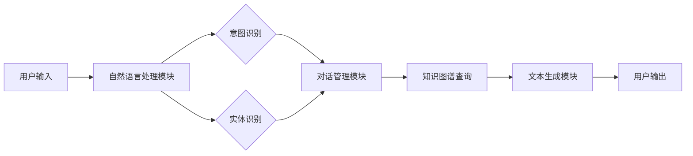

# 打造智能化金融咨询聊天机器人

> 关键词：智能化金融咨询、聊天机器人、自然语言处理、机器学习、深度学习

> 摘要：本文围绕打造智能化金融咨询聊天机器人展开，深入探讨了其核心概念、算法原理、数学模型等方面。详细阐述了开发过程中的具体操作步骤，通过实际案例展示了如何搭建开发环境、实现源代码并进行解读分析。同时介绍了该聊天机器人在实际金融场景中的应用，推荐了相关的学习资源、开发工具框架以及论文著作。最后对其未来发展趋势与挑战进行总结，并提供了常见问题的解答和扩展阅读参考资料，旨在为开发者和相关从业者提供全面且深入的指导。

## 1. 背景介绍 
### 1.1 目的和范围
随着金融市场的不断发展和复杂化，投资者和客户对于金融信息的需求日益增长。传统的金融咨询服务存在时间和空间的限制，难以满足客户随时随地获取准确信息的需求。智能化金融咨询聊天机器人的出现，旨在利用先进的自然语言处理和机器学习技术，为客户提供实时、高效、个性化的金融咨询服务。

本文的范围涵盖了智能化金融咨询聊天机器人从概念设计到实际开发的全过程，包括核心概念的解释、算法原理的分析、数学模型的建立、项目实战的案例展示以及实际应用场景的探讨等方面。

### 1.2 预期读者
本文预期读者包括对金融科技领域感兴趣的开发者、软件架构师、人工智能研究人员、金融行业从业者以及相关专业的学生。无论是希望深入了解智能化金融咨询聊天机器人技术原理的专业人士，还是想要涉足该领域的初学者，都能从本文中获得有价值的信息。

### 1.3 文档结构概述
本文共分为十个部分，具体结构如下：
1. 背景介绍：阐述了打造智能化金融咨询聊天机器人的目的和范围，明确了预期读者，并对文档结构进行了概述。
2. 核心概念与联系：介绍了智能化金融咨询聊天机器人涉及的核心概念，如自然语言处理、机器学习、深度学习等，并展示了它们之间的联系。
3. 核心算法原理 & 具体操作步骤：详细讲解了实现聊天机器人的核心算法原理，并给出了具体的操作步骤，同时使用 Python 源代码进行了阐述。
4. 数学模型和公式 & 详细讲解 & 举例说明：建立了相关的数学模型，给出了具体的公式，并通过举例进行了详细讲解。
5. 项目实战：代码实际案例和详细解释说明：通过一个实际案例，展示了如何搭建开发环境、实现源代码并进行解读分析。
6. 实际应用场景：介绍了智能化金融咨询聊天机器人在金融领域的实际应用场景。
7. 工具和资源推荐：推荐了相关的学习资源、开发工具框架以及论文著作。
8. 总结：未来发展趋势与挑战：对智能化金融咨询聊天机器人的未来发展趋势进行了总结，并分析了面临的挑战。
9. 附录：常见问题与解答：提供了常见问题的解答，帮助读者解决在学习和开发过程中遇到的问题。
10. 扩展阅读 & 参考资料：列出了扩展阅读的相关资料，为读者提供了进一步学习的方向。

### 1.4 术语表
#### 1.4.1 核心术语定义
- **自然语言处理（Natural Language Processing，NLP）**：是计算机科学、人工智能和语言学的交叉领域，旨在让计算机能够理解、处理和生成人类语言。
- **机器学习（Machine Learning，ML）**：是一门多领域交叉学科，涉及概率论、统计学、逼近论、凸分析、算法复杂度理论等多门学科。它专门研究计算机怎样模拟或实现人类的学习行为，以获取新的知识或技能，重新组织已有的知识结构使之不断改善自身的性能。
- **深度学习（Deep Learning，DL）**：是机器学习的一个分支领域，它是一种基于对数据进行表征学习的方法。深度学习通过构建具有很多层的神经网络模型，自动从大量数据中学习复杂的模式和特征。
- **对话管理（Dialogue Management）**：是聊天机器人的重要组成部分，负责管理对话的流程和状态，根据用户的输入和历史对话信息，生成合适的回复。
- **知识图谱（Knowledge Graph）**：是一种基于图的数据结构，由节点（实体）和边（关系）组成，用于表示实体之间的语义关系。在金融咨询聊天机器人中，知识图谱可以用于存储和管理金融领域的知识。

#### 1.4.2 相关概念解释
- **意图识别**：是自然语言处理中的一个重要任务，旨在确定用户输入的文本所表达的意图。在金融咨询聊天机器人中，意图识别可以帮助机器人理解用户的需求，从而提供相应的服务。
- **实体识别**：是指从文本中识别出具有特定意义的实体，如人名、地名、组织机构名、金融产品名等。在金融咨询聊天机器人中，实体识别可以帮助机器人更好地理解用户的问题，并提供更准确的答案。
- **文本生成**：是指根据给定的输入信息，生成自然语言文本的过程。在金融咨询聊天机器人中，文本生成可以用于生成机器人的回复。

#### 1.4.3 缩略词列表
- **NLP**：Natural Language Processing（自然语言处理）
- **ML**：Machine Learning（机器学习）
- **DL**：Deep Learning（深度学习）
- **API**：Application Programming Interface（应用程序编程接口）
- **RNN**：Recurrent Neural Network（循环神经网络）
- **LSTM**：Long Short-Term Memory（长短期记忆网络）
- **GRU**：Gated Recurrent Unit（门控循环单元）

## 2. 核心概念与联系 
智能化金融咨询聊天机器人涉及多个核心概念，主要包括自然语言处理、机器学习、深度学习、对话管理和知识图谱等。这些概念之间相互关联，共同构成了聊天机器人的技术基础。

### 核心概念原理
#### 自然语言处理
自然语言处理的主要任务包括文本分类、情感分析、意图识别、实体识别、文本生成等。它通过对人类语言的分析和处理，让计算机能够理解和生成自然语言。例如，在金融咨询聊天机器人中，自然语言处理可以用于分析用户的问题，提取关键信息，然后生成合适的回复。

#### 机器学习
机器学习是让计算机通过数据学习模式和规律的方法。常见的机器学习算法包括决策树、支持向量机、朴素贝叶斯、神经网络等。在金融咨询聊天机器人中，机器学习可以用于意图识别、文本分类等任务，通过对大量的训练数据进行学习，提高机器人的性能。

#### 深度学习
深度学习是机器学习的一个分支，它通过构建深度神经网络模型，自动从大量数据中学习复杂的模式和特征。常见的深度学习模型包括卷积神经网络（CNN）、循环神经网络（RNN）、长短期记忆网络（LSTM）、门控循环单元（GRU）等。在金融咨询聊天机器人中，深度学习可以用于处理序列数据，如文本、语音等，提高机器人的语言理解和生成能力。

#### 对话管理
对话管理负责管理对话的流程和状态，根据用户的输入和历史对话信息，生成合适的回复。它可以通过有限状态机、基于规则的方法、强化学习等技术实现。在金融咨询聊天机器人中，对话管理可以确保对话的连贯性和逻辑性，提高用户体验。

#### 知识图谱
知识图谱是一种基于图的数据结构，用于表示实体之间的语义关系。在金融咨询聊天机器人中，知识图谱可以用于存储和管理金融领域的知识，如金融产品信息、市场行情、财经新闻等。通过知识图谱，机器人可以更好地理解用户的问题，并提供更准确的答案。

### 架构的文本示意图
```plaintext
用户输入 --> 自然语言处理模块（意图识别、实体识别）
            |
            v
对话管理模块（根据意图和历史对话生成回复策略）
            |
            v
知识图谱查询（获取相关金融知识）
            |
            v
文本生成模块（生成自然语言回复） --> 用户输出
```

### Mermaid 流程图


## 3. 核心算法原理 & 具体操作步骤 
### 意图识别算法原理
意图识别是金融咨询聊天机器人的重要任务之一，它的目的是确定用户输入的文本所表达的意图。常见的意图识别算法包括基于规则的方法、基于机器学习的方法和基于深度学习的方法。

#### 基于规则的方法
基于规则的方法是通过手工编写规则来判断用户的意图。例如，当用户输入“查询股票行情”时，根据预先定义的规则，判断用户的意图是查询股票行情。这种方法的优点是简单易懂，实现成本低，但缺点是规则的覆盖范围有限，难以处理复杂的自然语言。

#### 基于机器学习的方法
基于机器学习的方法是通过对大量的训练数据进行学习，构建意图识别模型。常见的机器学习算法包括决策树、支持向量机、朴素贝叶斯等。以朴素贝叶斯算法为例，其原理是基于贝叶斯定理，通过计算每个意图的概率，选择概率最大的意图作为预测结果。

以下是使用 Python 和 Scikit-learn 库实现朴素贝叶斯意图识别的示例代码：
```python
from sklearn.feature_extraction.text import CountVectorizer
from sklearn.naive_bayes import MultinomialNB
from sklearn.pipeline import Pipeline

# 训练数据
X_train = ["查询股票行情", "了解基金信息", "咨询理财产品"]
y_train = ["查询股票", "了解基金", "咨询理财"]

# 创建管道
text_clf = Pipeline([
    ('vect', CountVectorizer()),
    ('clf', MultinomialNB()),
])

# 训练模型
text_clf.fit(X_train, y_train)

# 测试数据
X_test = ["查询股票价格"]

# 预测意图
predicted = text_clf.predict(X_test)
print("预测意图:", predicted[0])
```
#### 基于深度学习的方法
基于深度学习的方法是通过构建深度神经网络模型，自动从大量数据中学习复杂的模式和特征。常见的深度学习模型包括卷积神经网络（CNN）、循环神经网络（RNN）、长短期记忆网络（LSTM）、门控循环单元（GRU）等。以 LSTM 为例，它可以处理序列数据，能够捕捉文本中的上下文信息，提高意图识别的准确率。

以下是使用 Python 和 Keras 库实现 LSTM 意图识别的示例代码：
```python
from keras.preprocessing.text import Tokenizer
from keras.preprocessing.sequence import pad_sequences
from keras.models import Sequential
from keras.layers import Embedding, LSTM, Dense
import numpy as np

# 训练数据
X_train = ["查询股票行情", "了解基金信息", "咨询理财产品"]
y_train = [0, 1, 2]

# 分词
tokenizer = Tokenizer()
tokenizer.fit_on_texts(X_train)
X_train_seq = tokenizer.texts_to_sequences(X_train)

# 填充序列
max_length = max([len(seq) for seq in X_train_seq])
X_train_pad = pad_sequences(X_train_seq, maxlen=max_length)

# 构建模型
model = Sequential()
model.add(Embedding(input_dim=len(tokenizer.word_index) + 1, output_dim=100, input_length=max_length))
model.add(LSTM(100))
model.add(Dense(3, activation='softmax'))

# 编译模型
model.compile(optimizer='adam', loss='sparse_categorical_crossentropy', metrics=['accuracy'])

# 训练模型
model.fit(X_train_pad, np.array(y_train), epochs=10, batch_size=1)

# 测试数据
X_test = ["查询股票价格"]
X_test_seq = tokenizer.texts_to_sequences(X_test)
X_test_pad = pad_sequences(X_test_seq, maxlen=max_length)

# 预测意图
predicted = model.predict(X_test_pad)
predicted_label = np.argmax(predicted, axis=1)
print("预测意图:", predicted_label[0])
```
### 具体操作步骤
1. **数据收集与预处理**：收集大量的金融咨询对话数据，并进行清洗、标注等预处理操作。标注数据时，需要明确每个对话的意图和实体信息。
2. **特征提取**：根据选择的算法，提取文本的特征。例如，对于基于机器学习的方法，可以使用词袋模型、TF-IDF 等方法提取特征；对于基于深度学习的方法，可以使用词嵌入技术将文本转换为向量表示。
3. **模型训练**：使用预处理后的数据对选择的模型进行训练。在训练过程中，需要调整模型的参数，以提高模型的性能。
4. **模型评估**：使用测试数据对训练好的模型进行评估，计算模型的准确率、召回率、F1 值等指标，评估模型的性能。
5. **模型部署**：将训练好的模型部署到生产环境中，与对话管理模块、知识图谱等进行集成，实现智能化金融咨询聊天机器人的功能。

## 4. 数学模型和公式 & 详细讲解 & 举例说明 
### 朴素贝叶斯算法的数学模型和公式
朴素贝叶斯算法基于贝叶斯定理，其核心公式为：
$$P(c|x)=\frac{P(x|c)P(c)}{P(x)}$$
其中，$P(c|x)$ 表示在给定特征 $x$ 的情况下，属于类别 $c$ 的概率；$P(x|c)$ 表示在类别 $c$ 下，特征 $x$ 出现的概率；$P(c)$ 表示类别 $c$ 出现的先验概率；$P(x)$ 表示特征 $x$ 出现的概率。

在意图识别中，我们的目标是找到使得 $P(c|x)$ 最大的类别 $c$，即：
$$\hat{c}=\arg\max_{c\in C}P(c|x)=\arg\max_{c\in C}\frac{P(x|c)P(c)}{P(x)}$$
由于 $P(x)$ 对于所有类别 $c$ 都是相同的，因此可以忽略不计，得到：
$$\hat{c}=\arg\max_{c\in C}P(x|c)P(c)$$
假设特征 $x$ 由多个独立的特征分量 $x_1,x_2,\cdots,x_n$ 组成，根据朴素贝叶斯的独立性假设，有：
$$P(x|c)=P(x_1,x_2,\cdots,x_n|c)=\prod_{i=1}^{n}P(x_i|c)$$
因此，最终的预测公式为：
$$\hat{c}=\arg\max_{c\in C}P(c)\prod_{i=1}^{n}P(x_i|c)$$

### 举例说明
假设有三个意图类别：查询股票、了解基金、咨询理财，训练数据如下：
| 文本 | 意图 |
| ---- | ---- |
| 查询股票行情 | 查询股票 |
| 了解基金信息 | 了解基金 |
| 咨询理财产品 | 咨询理财 |

我们要预测“查询股票价格”的意图。

首先，计算先验概率 $P(c)$：
- $P(查询股票)=\frac{1}{3}$
- $P(了解基金)=\frac{1}{3}$
- $P(咨询理财)=\frac{1}{3}$

然后，计算条件概率 $P(x_i|c)$。假设我们使用词袋模型，“查询股票价格” 可以拆分为 “查询”、“股票”、“价格” 三个词。以 “查询股票” 类别为例，计算每个词在该类别下出现的概率：
- $P(查询|查询股票)=1$
- $P(股票|查询股票)=1$
- $P(价格|查询股票)=0$

同理，计算其他类别下的条件概率。

最后，根据预测公式计算每个类别的概率：
- $P(查询股票|查询股票价格)=P(查询股票)\times P(查询|查询股票)\times P(股票|查询股票)\times P(价格|查询股票)=\frac{1}{3}\times1\times1\times0 = 0$
- 计算其他类别的概率，选择概率最大的类别作为预测结果。

### 深度学习模型的数学模型和公式
以 LSTM 为例，LSTM 是一种特殊的 RNN，它通过引入门控机制来解决长序列训练中的梯度消失问题。LSTM 单元的结构包括输入门 $i_t$、遗忘门 $f_t$、输出门 $o_t$ 和细胞状态 $C_t$。

输入门 $i_t$ 的计算公式为：
$$i_t=\sigma(W_{ii}x_t + W_{hi}h_{t-1}+b_i)$$
遗忘门 $f_t$ 的计算公式为：
$$f_t=\sigma(W_{if}x_t + W_{hf}h_{t-1}+b_f)$$
细胞状态的更新公式为：
$$\tilde{C}_t=\tanh(W_{ic}x_t + W_{hc}h_{t-1}+b_c)$$
$$C_t=f_t\odot C_{t-1}+i_t\odot\tilde{C}_t$$
输出门 $o_t$ 的计算公式为：
$$o_t=\sigma(W_{io}x_t + W_{ho}h_{t-1}+b_o)$$
隐藏状态的更新公式为：
$$h_t=o_t\odot\tanh(C_t)$$
其中，$x_t$ 是当前时刻的输入，$h_{t-1}$ 是上一时刻的隐藏状态，$W$ 是权重矩阵，$b$ 是偏置向量，$\sigma$ 是 sigmoid 函数，$\tanh$ 是双曲正切函数，$\odot$ 表示逐元素相乘。

在意图识别中，我们将输入的文本序列通过 LSTM 模型进行处理，最后将最后一个时刻的隐藏状态输入到全连接层，通过 softmax 函数输出每个意图类别的概率，选择概率最大的类别作为预测结果。

## 5. 项目实战：代码实际案例和详细解释说明 
### 5.1  开发环境搭建
#### 安装 Python
首先，需要安装 Python 环境。建议使用 Python 3.6 及以上版本。可以从 Python 官方网站（https://www.python.org/downloads/） 下载并安装 Python。

#### 安装必要的库
使用 pip 安装以下必要的库：
```sh
pip install numpy pandas scikit-learn keras tensorflow
```
- `numpy`：用于数值计算。
- `pandas`：用于数据处理和分析。
- `scikit-learn`：提供了各种机器学习算法和工具。
- `keras`：用于构建和训练深度学习模型。
- `tensorflow`：Keras 的后端引擎。

### 5.2  源代码详细实现和代码解读
以下是一个简单的智能化金融咨询聊天机器人的实现代码：
```python
import numpy as np
from sklearn.feature_extraction.text import CountVectorizer
from sklearn.naive_bayes import MultinomialNB

# 训练数据
X_train = ["查询股票行情", "了解基金信息", "咨询理财产品", "查询债券价格"]
y_train = ["查询股票", "了解基金", "咨询理财", "查询债券"]

# 创建词袋模型
vectorizer = CountVectorizer()
X_train_vec = vectorizer.fit_transform(X_train)

# 创建朴素贝叶斯分类器
clf = MultinomialNB()
clf.fit(X_train_vec, y_train)

# 定义聊天函数
def chat():
    while True:
        user_input = input("请输入您的问题（输入 '退出' 结束对话）：")
        if user_input == "退出":
            break
        # 将用户输入转换为向量
        user_input_vec = vectorizer.transform([user_input])
        # 预测意图
        predicted_intent = clf.predict(user_input_vec)[0]
        # 根据意图生成回复
        if predicted_intent == "查询股票":
            response = "正在为您查询股票行情，请稍等..."
        elif predicted_intent == "了解基金":
            response = "为您提供一些基金的相关信息..."
        elif predicted_intent == "咨询理财":
            response = "专业理财顾问为您服务，请稍等..."
        elif predicted_intent == "查询债券":
            response = "正在查询债券价格，请耐心等待..."
        else:
            response = "抱歉，我不理解您的问题，请重新输入。"
        print("机器人回复:", response)

# 启动聊天
chat()
```
### 代码解读与分析
1. **数据准备**：定义了训练数据 `X_train` 和对应的意图标签 `y_train`，用于训练意图识别模型。
2. **特征提取**：使用 `CountVectorizer` 创建词袋模型，将文本数据转换为向量表示。
3. **模型训练**：使用 `MultinomialNB` 创建朴素贝叶斯分类器，并使用训练数据进行训练。
4. **聊天函数**：定义了 `chat` 函数，用于实现与用户的交互。在函数中，不断获取用户输入，将其转换为向量，使用训练好的模型预测意图，并根据意图生成相应的回复。
5. **主程序**：调用 `chat` 函数启动聊天。

这个示例代码只是一个简单的实现，实际的智能化金融咨询聊天机器人需要更复杂的模型和功能，如知识图谱查询、对话管理等。

## 6. 实际应用场景 
### 金融产品咨询
用户可以通过聊天机器人咨询各种金融产品的信息，如股票、基金、债券、理财产品等。聊天机器人可以提供产品的基本信息、风险评级、收益情况等，并根据用户的需求和风险偏好，推荐合适的金融产品。

### 市场行情查询
用户可以查询股票、基金、债券等金融产品的实时行情，包括价格、涨跌幅、成交量等信息。聊天机器人可以及时更新行情数据，并提供相关的分析和预测。

### 投资建议
根据用户的资产状况、投资目标和风险偏好，聊天机器人可以提供个性化的投资建议。例如，建议用户如何进行资产配置、选择哪些金融产品进行投资等。

### 财经新闻解读
聊天机器人可以实时获取财经新闻，并对新闻进行解读和分析。用户可以通过聊天机器人了解最新的财经动态，以及这些动态对金融市场的影响。

### 客户服务
在金融机构的客户服务中，聊天机器人可以自动回答客户的常见问题，如账户查询、业务办理流程等。同时，聊天机器人还可以将复杂的问题转接给人工客服，提高客户服务的效率和质量。

## 7. 工具和资源推荐
### 7.1 学习资源推荐
#### 7.1.1 书籍推荐
- 《Python 自然语言处理实战》：本书详细介绍了使用 Python 进行自然语言处理的各种技术和方法，包括文本分类、情感分析、命名实体识别等。
- 《深度学习》：由深度学习领域的三位先驱 Ian Goodfellow、Yoshua Bengio 和 Aaron Courville 撰写，是深度学习领域的经典教材。
- 《机器学习》：周志华教授的著作，系统地介绍了机器学习的基本概念、算法和应用。

#### 7.1.2 在线课程
- Coursera 上的 “机器学习” 课程：由 Andrew Ng 教授授课，是机器学习领域的经典课程。
- edX 上的 “深度学习基础” 课程：由 deeplearning.ai 提供，介绍了深度学习的基本概念和技术。
- 网易云课堂上的 “自然语言处理实战” 课程：结合实际案例，介绍了自然语言处理的各种技术和应用。

#### 7.1.3 技术博客和网站
- 机器之心：提供人工智能领域的最新技术、研究成果和应用案例。
- 开源中国：涵盖了各种开源技术和项目，包括自然语言处理、机器学习等领域。
- 知乎：有很多关于人工智能和自然语言处理的讨论和分享，可以从中获取很多有价值的信息。

### 7.2 开发工具框架推荐
#### 7.2.1 IDE和编辑器
- PyCharm：是一款专门为 Python 开发设计的集成开发环境，具有代码编辑、调试、版本控制等功能。
- Jupyter Notebook：是一个交互式的开发环境，适合进行数据分析和模型训练。
- Visual Studio Code：是一款轻量级的代码编辑器，支持多种编程语言，具有丰富的插件扩展功能。

#### 7.2.2 调试和性能分析工具
- TensorBoard：是 TensorFlow 提供的可视化工具，可以用于监控模型的训练过程、查看模型的结构和性能指标等。
- Py-Spy：是一个用于 Python 代码性能分析的工具，可以实时查看 Python 程序的 CPU 使用率和函数调用情况。
- cProfile：是 Python 标准库中的性能分析工具，可以统计程序中各个函数的调用次数和执行时间。

#### 7.2.3 相关框架和库
- TensorFlow：是一个开源的深度学习框架，由 Google 开发，支持多种深度学习模型的构建和训练。
- PyTorch：是另一个流行的深度学习框架，由 Facebook 开发，具有动态图和易于使用的特点。
- NLTK：是一个用于自然语言处理的 Python 库，提供了丰富的工具和数据集，包括分词、词性标注、命名实体识别等功能。
- SpaCy：是一个快速、高效的自然语言处理库，支持多种语言，提供了预训练的模型和丰富的语言处理功能。

### 7.3 相关论文著作推荐
#### 7.3.1 经典论文
- 《Attention Is All You Need》：提出了 Transformer 模型，是自然语言处理领域的重要突破。
- 《Long Short-Term Memory》：介绍了 LSTM 模型，解决了 RNN 中的梯度消失问题。
- 《Convolutional Neural Networks for Sentence Classification》：将卷积神经网络应用于文本分类任务，取得了很好的效果。

#### 7.3.2 最新研究成果
可以关注 ACL（Association for Computational Linguistics）、EMNLP（Conference on Empirical Methods in Natural Language Processing）等自然语言处理领域的顶级会议，获取最新的研究成果。

#### 7.3.3 应用案例分析
可以参考一些金融科技公司的官方博客和研究报告，了解智能化金融咨询聊天机器人在实际应用中的案例和经验。

## 8. 总结：未来发展趋势与挑战
### 未来发展趋势
#### 多模态交互
未来的智能化金融咨询聊天机器人将不仅仅支持文本交互，还将支持语音、图像、视频等多模态交互方式。用户可以通过语音指令查询金融信息，或者上传相关的图像文件进行识别和分析。

#### 个性化服务
随着大数据和人工智能技术的发展，聊天机器人将能够更好地了解用户的需求和偏好，提供更加个性化的金融咨询服务。例如，根据用户的投资历史、风险承受能力等因素，为用户推荐最合适的金融产品和投资策略。

#### 与金融科技的深度融合
智能化金融咨询聊天机器人将与其他金融科技技术，如区块链、云计算、大数据等深度融合，为金融行业带来更多的创新和变革。例如，利用区块链技术保证金融数据的安全性和可信度，利用云计算技术提高聊天机器人的处理能力和响应速度。

#### 跨领域应用
聊天机器人将不仅仅应用于金融咨询领域，还将拓展到其他领域，如医疗、教育、交通等。通过与不同领域的知识和数据相结合，聊天机器人可以提供更加全面和专业的服务。

### 挑战
#### 数据质量和隐私保护
智能化金融咨询聊天机器人需要大量的高质量数据进行训练，但是金融数据往往涉及用户的隐私和敏感信息，如何保证数据的质量和隐私安全是一个重要的挑战。

#### 自然语言理解的准确性
虽然自然语言处理技术取得了很大的进展，但是在处理复杂的自然语言时，仍然存在一定的误差。如何提高聊天机器人对自然语言的理解准确性，是一个需要解决的问题。

#### 模型的可解释性
深度学习模型往往是黑盒模型，难以解释其决策过程和结果。在金融领域，模型的可解释性非常重要，因为用户需要了解为什么会得到某个推荐或建议。

#### 法律法规和监管要求
金融行业受到严格的法律法规和监管要求的约束，智能化金融咨询聊天机器人的开发和应用需要遵守相关的规定。如何确保聊天机器人的合规性，是一个需要面对的挑战。

## 9. 附录：常见问题与解答
### 问题 1：如何提高意图识别的准确率？
解答：可以从以下几个方面提高意图识别的准确率：
- 增加训练数据的数量和质量，确保数据的多样性和代表性。
- 选择合适的特征提取方法和模型，根据数据的特点和任务的需求进行选择。
- 进行模型调优，调整模型的参数，如学习率、正则化系数等。
- 使用集成学习的方法，将多个模型的结果进行融合。

### 问题 2：如何处理用户的模糊输入？
解答：可以采用以下方法处理用户的模糊输入：
- 进行意图分类时，增加一个 “其他” 类别，将无法准确分类的输入归为该类别。
- 与用户进行交互，通过追问的方式获取更多的信息，明确用户的意图。
- 使用上下文信息，结合历史对话内容，推测用户的意图。

### 问题 3：如何保证聊天机器人的安全性？
解答：可以从以下几个方面保证聊天机器人的安全性：
- 对数据进行加密处理，确保数据在传输和存储过程中的安全性。
- 对用户的身份进行验证，防止非法用户访问聊天机器人。
- 定期对聊天机器人进行安全漏洞扫描和修复，及时发现和解决安全问题。
- 遵守相关的法律法规和监管要求，确保聊天机器人的合规性。

### 问题 4：如何实现聊天机器人的多语言支持？
解答：可以采用以下方法实现聊天机器人的多语言支持：
- 使用多语言的语料库进行训练，确保模型能够处理不同语言的输入。
- 对不同语言的文本进行预处理，如分词、词性标注等，使用适合该语言的方法和工具。
- 在文本生成阶段，根据用户输入的语言，生成相应语言的回复。

## 10. 扩展阅读 & 参考资料
### 扩展阅读
- 《人工智能：现代方法》：全面介绍了人工智能的各个领域，包括自然语言处理、机器学习、知识表示等。
- 《Python 数据分析实战》：介绍了使用 Python 进行数据分析的各种技术和方法，对于处理金融数据和训练模型有很大的帮助。
- 《智能时代》：探讨了人工智能对社会和经济的影响，以及未来的发展趋势。

### 参考资料
- 《自然语言处理入门》：https://nlp.hankcs.com/book/
- 《TensorFlow 官方文档》：https://www.tensorflow.org/
- 《PyTorch 官方文档》：https://pytorch.org/

作者：AI天才研究院/AI Genius Institute & 禅与计算机程序设计艺术 /Zen And The Art of Computer Programming