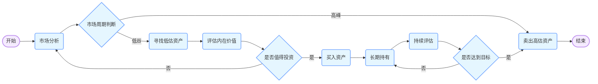

# 托马斯·卡普兰的创新型价值投资方法

> 关键词：托马斯·卡普兰、创新型价值投资、资源投资、市场周期、风险控制

> 摘要：本文聚焦于托马斯·卡普兰的创新型价值投资方法，深入剖析其核心概念、算法原理、数学模型，并结合实际案例进行详细解读。托马斯·卡普兰在资源投资领域独树一帜，其方法融合了对市场周期的精准把握、对资产内在价值的深度挖掘以及有效的风险控制策略。通过对相关原理和案例的分析，旨在为投资者提供全面且深入的理解，同时探讨该方法在不同实际场景中的应用，以及未来发展可能面临的趋势与挑战。

## 1. 背景介绍 
### 1.1 目的和范围
本文的目的在于全面深入地研究托马斯·卡普兰的创新型价值投资方法。通过对其投资理念、策略、操作步骤等方面的详细分析，为投资者、金融从业者以及对投资领域感兴趣的人士提供有价值的参考。研究范围涵盖了托马斯·卡普兰投资方法的核心概念、算法原理、数学模型，以及在实际项目中的应用案例等多个维度。

### 1.2 预期读者
预期读者包括但不限于专业投资者、金融分析师、投资机构从业者、高校金融专业学生以及对价值投资方法有深入研究需求的个人。这些读者希望通过本文的内容，了解托马斯·卡普兰独特的投资视角和方法，从中汲取经验，提升自身的投资能力和决策水平。

### 1.3 文档结构概述
本文将按照以下结构展开：首先介绍核心概念与联系，阐述托马斯·卡普兰创新型价值投资方法的基本原理和架构；接着详细讲解核心算法原理及具体操作步骤，并给出相应的 Python 源代码；然后探讨数学模型和公式，结合具体例子进行说明；之后通过项目实战，展示该投资方法在实际中的应用和代码实现；再分析实际应用场景；推荐相关的工具和资源；最后总结未来发展趋势与挑战，解答常见问题，并提供扩展阅读和参考资料。

### 1.4 术语表
#### 1.4.1 核心术语定义
- **创新型价值投资**：托马斯·卡普兰所倡导的一种投资方法，强调通过独特的视角和深入的研究，挖掘被市场低估的资产，并在长期持有中实现价值增长。这种方法不仅关注资产的财务指标，还注重其所处行业的发展趋势、资源稀缺性等因素。
- **资源投资**：聚焦于自然资源领域的投资，如矿产、能源等。托马斯·卡普兰在资源投资方面有着丰富的经验，他认为资源的稀缺性和不可再生性使其具有长期的投资价值。
- **市场周期**：市场价格和经济活动随时间呈现出的周期性波动。托马斯·卡普兰善于把握市场周期的变化，在市场低谷时买入资产，在市场高峰时卖出，以获取最大的投资回报。

#### 1.4.2 相关概念解释
- **内在价值**：资产本身所具有的真实价值，不依赖于市场价格。托马斯·卡普兰通过对资产的基本面分析、行业前景评估等方法，确定资产的内在价值，以此作为投资决策的重要依据。
- **风险控制**：在投资过程中，采取一系列措施来降低投资风险。托马斯·卡普兰注重风险控制，通过分散投资、设置止损点等方式，确保投资组合的稳定性。

#### 1.4.3 缩略词列表
- **NPV**：Net Present Value，净现值，用于评估投资项目的盈利能力。
- **IRR**：Internal Rate of Return，内部收益率，反映投资项目的实际收益率。

## 2. 核心概念与联系 

### 核心概念原理
托马斯·卡普兰的创新型价值投资方法基于对市场规律和资产价值的深刻理解。其核心原理在于发现被市场低估的资产，并通过长期持有来实现资产价值的回归和增长。在资源投资领域，他尤其关注资源的稀缺性和不可再生性，认为这些因素决定了资源的长期价值。

他的投资方法强调对市场周期的把握。市场总是在繁荣和衰退之间循环，在市场低谷时，许多资产的价格会被低估，此时是买入的良机；而在市场高峰时，资产价格往往高估，应适时卖出。通过这种逆向投资策略，能够获得更高的投资回报。

此外，托马斯·卡普兰注重对资产内在价值的挖掘。他不仅仅关注资产的财务报表，还深入研究资产所处的行业环境、技术发展趋势、政策因素等，以全面评估资产的价值。

### 架构的文本示意图
```plaintext
托马斯·卡普兰创新型价值投资方法
|
|-- 核心原理
|   |-- 发现低估资产
|   |-- 把握市场周期
|   |-- 挖掘内在价值
|
|-- 投资策略
|   |-- 资源投资
|   |-- 长期持有
|   |-- 逆向投资
|
|-- 风险控制
|   |-- 分散投资
|   |-- 设置止损点
```

### Mermaid 流程图


## 3. 核心算法原理 & 具体操作步骤 

### 核心算法原理
托马斯·卡普兰的投资方法虽然没有严格意义上的固定算法，但可以通过一些量化指标来辅助决策。其中，净现值（NPV）和内部收益率（IRR）是常用的评估指标。

净现值（NPV）是指投资项目在未来各期现金流量的现值之和减去初始投资成本。其计算公式为：

$$NPV = \sum_{t=0}^{n} \frac{CF_t}{(1 + r)^t} - C_0$$

其中，$CF_t$ 表示第 $t$ 期的现金流量，$r$ 表示折现率，$C_0$ 表示初始投资成本，$n$ 表示投资项目的期限。

内部收益率（IRR）是指使投资项目的净现值等于零的折现率。即满足以下方程的 $r$ 值：

$$\sum_{t=0}^{n} \frac{CF_t}{(1 + IRR)^t} - C_0 = 0$$

通过计算 NPV 和 IRR，可以评估投资项目的盈利能力和可行性。当 NPV 大于零且 IRR 大于投资者要求的最低收益率时，投资项目通常被认为是可行的。

### 具体操作步骤
1. **市场分析**：收集和分析宏观经济数据、行业动态、政策法规等信息，判断市场所处的周期阶段。
2. **寻找低估资产**：在市场低谷时，筛选出价格低于内在价值的资产。可以通过财务报表分析、行业比较等方法进行筛选。
3. **评估内在价值**：运用基本面分析、现金流折现模型等方法，计算资产的内在价值。在计算过程中，需要考虑资产的未来现金流量、增长潜力、风险因素等。
4. **决策投资**：根据 NPV 和 IRR 等指标，判断投资项目是否值得投资。如果 NPV 大于零且 IRR 大于最低收益率，则可以考虑买入资产。
5. **长期持有**：买入资产后，长期持有，等待资产价值的回归和增长。在持有过程中，持续关注资产的基本面变化和市场动态。
6. **适时卖出**：当市场进入高峰阶段，资产价格高估时，适时卖出资产，实现投资回报。

### Python 源代码实现
```python
import numpy as np
from scipy.optimize import fsolve

def calculate_npv(cash_flows, discount_rate):
    """
    计算净现值
    :param cash_flows: 现金流量列表，第一个元素为初始投资（负数）
    :param discount_rate: 折现率
    :return: 净现值
    """
    periods = len(cash_flows)
    npv = 0
    for t in range(periods):
        npv += cash_flows[t] / ((1 + discount_rate) ** t)
    return npv

def calculate_irr(cash_flows):
    """
    计算内部收益率
    :param cash_flows: 现金流量列表，第一个元素为初始投资（负数）
    :return: 内部收益率
    """
    def irr_equation(r):
        return calculate_npv(cash_flows, r)
    initial_guess = 0.1
    irr = fsolve(irr_equation, initial_guess)
    return irr[0]

# 示例数据
cash_flows = [-1000, 200, 300, 400, 500]  # 初始投资 1000，后续各期现金流量
discount_rate = 0.1

# 计算净现值
npv = calculate_npv(cash_flows, discount_rate)
print(f"净现值 (NPV): {npv}")

# 计算内部收益率
irr = calculate_irr(cash_flows)
print(f"内部收益率 (IRR): {irr * 100:.2f}%")
```

在上述代码中，`calculate_npv` 函数用于计算净现值，`calculate_irr` 函数用于计算内部收益率。通过输入现金流量列表和折现率，可以得到相应的 NPV 和 IRR 值。

## 4. 数学模型和公式 & 详细讲解 & 举例说明 

### 净现值（NPV）模型
净现值模型是评估投资项目盈利能力的重要工具。其公式为：

$$NPV = \sum_{t=0}^{n} \frac{CF_t}{(1 + r)^t} - C_0$$

其中，$CF_t$ 表示第 $t$ 期的现金流量，$r$ 表示折现率，$C_0$ 表示初始投资成本，$n$ 表示投资项目的期限。

### 详细讲解
净现值的计算原理是将未来各期的现金流量按照一定的折现率折现到当前时刻，然后减去初始投资成本。折现率 $r$ 反映了资金的时间价值和投资风险。如果 $NPV$ 大于零，说明投资项目的预期收益超过了资金成本，项目具有盈利能力；如果 $NPV$ 小于零，则项目不具有盈利能力；如果 $NPV$ 等于零，则项目的预期收益刚好等于资金成本。

### 举例说明
假设一个投资项目的初始投资成本为 $C_0 = 1000$ 万元，预计未来 3 年的现金流量分别为 $CF_1 = 300$ 万元，$CF_2 = 400$ 万元，$CF_3 = 500$ 万元，折现率 $r = 0.1$。

则该项目的净现值为：

$$
\begin{align*}
NPV &= \frac{300}{(1 + 0.1)^1} + \frac{400}{(1 + 0.1)^2} + \frac{500}{(1 + 0.1)^3} - 1000 \\
&= \frac{300}{1.1} + \frac{400}{1.21} + \frac{500}{1.331} - 1000 \\
&\approx 272.73 + 330.58 + 375.66 - 1000 \\
&= -21.03
\end{align*}
$$

由于 $NPV$ 小于零，说明该投资项目在当前折现率下不具有盈利能力。

### 内部收益率（IRR）模型
内部收益率是指使投资项目的净现值等于零的折现率。即满足以下方程的 $r$ 值：

$$\sum_{t=0}^{n} \frac{CF_t}{(1 + IRR)^t} - C_0 = 0$$

### 详细讲解
内部收益率反映了投资项目的实际收益率。如果 $IRR$ 大于投资者要求的最低收益率，则投资项目是可行的；如果 $IRR$ 小于最低收益率，则项目不可行。

### 举例说明
仍以上述投资项目为例，我们需要求解方程：

$$\frac{300}{(1 + IRR)^1} + \frac{400}{(1 + IRR)^2} + \frac{500}{(1 + IRR)^3} - 1000 = 0$$

使用数值方法（如牛顿迭代法）可以求解得到 $IRR \approx 0.085$，即 $8.5\%$。

如果投资者要求的最低收益率为 $10\%$，由于 $IRR$ 小于最低收益率，该投资项目不可行。

## 5. 项目实战：代码实际案例和详细解释说明 

### 5.1  开发环境搭建
- **Python 安装**：首先需要安装 Python 环境，建议使用 Python 3.7 及以上版本。可以从 Python 官方网站（https://www.python.org/downloads/）下载并安装。
- **开发工具**：推荐使用 PyCharm 作为开发工具，它是一款功能强大的 Python IDE，提供了代码编辑、调试、版本控制等丰富的功能。可以从 JetBrains 官方网站（https://www.jetbrains.com/pycharm/download/）下载并安装。
- **依赖库安装**：在项目中需要使用 `numpy` 和 `scipy` 库，用于数值计算和优化求解。可以使用以下命令进行安装：

```sh
pip install numpy scipy
```

### 5.2  源代码详细实现和代码解读
```python
import numpy as np
from scipy.optimize import fsolve

def calculate_npv(cash_flows, discount_rate):
    """
    计算净现值
    :param cash_flows: 现金流量列表，第一个元素为初始投资（负数）
    :param discount_rate: 折现率
    :return: 净现值
    """
    periods = len(cash_flows)
    npv = 0
    for t in range(periods):
        npv += cash_flows[t] / ((1 + discount_rate) ** t)
    return npv

def calculate_irr(cash_flows):
    """
    计算内部收益率
    :param cash_flows: 现金流量列表，第一个元素为初始投资（负数）
    :return: 内部收益率
    """
    def irr_equation(r):
        return calculate_npv(cash_flows, r)
    initial_guess = 0.1
    irr = fsolve(irr_equation, initial_guess)
    return irr[0]

# 示例数据
cash_flows = [-2000, 500, 600, 700, 800]  # 初始投资 2000，后续各期现金流量
discount_rate = 0.12

# 计算净现值
npv = calculate_npv(cash_flows, discount_rate)
print(f"净现值 (NPV): {npv}")

# 计算内部收益率
irr = calculate_irr(cash_flows)
print(f"内部收益率 (IRR): {irr * 100:.2f}%")
```

### 代码解读与分析
- **`calculate_npv` 函数**：该函数接受现金流量列表和折现率作为输入，通过循环计算各期现金流量的现值，并将其累加得到净现值。
- **`calculate_irr` 函数**：该函数通过定义一个内部函数 `irr_equation`，将净现值计算函数封装在其中。使用 `fsolve` 函数求解使净现值等于零的折现率，即内部收益率。
- **示例数据**：定义了一个现金流量列表 `cash_flows` 和折现率 `discount_rate`，调用 `calculate_npv` 和 `calculate_irr` 函数分别计算净现值和内部收益率，并将结果打印输出。

通过计算净现值和内部收益率，可以评估投资项目的盈利能力和可行性。如果净现值大于零且内部收益率大于投资者要求的最低收益率，则该投资项目是可行的。

## 6. 实际应用场景 
### 资源投资领域
托马斯·卡普兰在资源投资领域有着丰富的实践经验。他通过对矿产、能源等资源的深入研究，发现被市场低估的资源项目。例如，在某些地区的矿产资源开发项目中，由于市场对该地区的地质条件、开采难度等因素存在误解，导致项目的估值偏低。托马斯·卡普兰通过专业的地质勘探和技术分析，准确评估项目的内在价值，在市场低谷时买入相关股权或资产，等待市场对资源价值的重新认识，从而获得丰厚的投资回报。

### 新兴产业投资
在新兴产业领域，托马斯·卡普兰的创新型价值投资方法也具有一定的应用价值。新兴产业往往具有高增长潜力，但同时也伴随着高风险和不确定性。他通过对新兴产业的技术发展趋势、市场需求、竞争格局等方面的研究，寻找具有核心竞争力和长期发展潜力的企业。例如，在新能源汽车、人工智能等领域，他关注那些掌握关键技术、具有良好商业模式和市场前景的企业，在企业发展初期进行投资，分享企业成长带来的收益。

### 困境企业投资
当一些企业面临短期困境，如财务危机、市场竞争压力等，导致股价下跌时，托马斯·卡普兰会运用其价值投资方法进行分析。他会深入研究企业的基本面，评估企业的核心资产、品牌价值、技术实力等是否依然存在。如果企业的内在价值仍然较高，只是由于短期因素导致市场低估，他会适时买入企业的股票或债券。通过参与企业的重组、战略调整等，帮助企业摆脱困境，实现价值回归。

## 7. 工具和资源推荐
### 7.1 学习资源推荐
#### 7.1.1 书籍推荐
- 《聪明的投资者》（The Intelligent Investor）：本杰明·格雷厄姆（Benjamin Graham）著，被誉为价值投资的圣经。书中介绍了价值投资的基本理念和方法，对投资者的思维方式和投资决策具有重要的指导意义。
- 《证券分析》（Security Analysis）：同样是本杰明·格雷厄姆的经典著作，详细阐述了证券分析的理论和方法，包括财务报表分析、估值模型等内容，是投资者深入学习价值投资的重要参考书籍。
- 《穷查理宝典》（Poor Charlie's Almanack）：收录了查理·芒格（Charlie Munger）的演讲和文章，介绍了他的多元思维模型和投资哲学。芒格与巴菲特长期合作，其投资理念和方法对投资者具有很大的启发。

#### 7.1.2 在线课程
- Coursera 平台上的“投资学原理”（Principles of Investment）课程：由知名高校的教授授课，系统介绍了投资学的基本概念、理论和方法，包括资产定价、投资组合管理等内容。
- edX 平台上的“价值投资：从入门到精通”（Value Investing: From Beginner to Pro）课程：专注于价值投资的实践应用，通过案例分析和实际操作，帮助学员掌握价值投资的技巧。

#### 7.1.3 技术博客和网站
- Seeking Alpha（https://seekingalpha.com/）：一个专业的投资研究平台，提供了大量的股票分析、投资策略、市场评论等内容。投资者可以在这里获取不同观点的研究报告和分析文章。
- GuruFocus（https://www.gurufocus.com/）：专注于价值投资领域，提供了知名投资者的持仓变化、股票估值分析、财务指标等数据和工具。投资者可以通过该网站了解价值投资大师们的投资动态和选股思路。

### 7.2 开发工具框架推荐
#### 7.2.1 IDE和编辑器
- PyCharm：功能强大的 Python IDE，提供了代码编辑、调试、版本控制等丰富的功能，适合专业的 Python 开发者。
- Jupyter Notebook：一种交互式的开发环境，支持多种编程语言，尤其适合数据科学和机器学习领域的开发。可以方便地进行代码编写、数据可视化和结果展示。

#### 7.2.2 调试和性能分析工具
- PDB：Python 自带的调试工具，可以在代码中设置断点，逐行执行代码，查看变量的值和程序的执行流程，帮助开发者快速定位和解决问题。
- cProfile：Python 标准库中的性能分析工具，可以统计程序中各个函数的执行时间和调用次数，帮助开发者找出程序的性能瓶颈。

#### 7.2.3 相关框架和库
- Pandas：用于数据处理和分析的 Python 库，提供了高效的数据结构和数据操作方法，如数据读取、清洗、转换等功能，在金融数据分析中广泛应用。
- NumPy：Python 的数值计算库，提供了多维数组对象和各种数学函数，是许多科学计算和数据分析库的基础。
- Matplotlib：用于数据可视化的 Python 库，可以绘制各种类型的图表，如折线图、柱状图、散点图等，帮助投资者直观地展示数据和分析结果。

### 7.3 相关论文著作推荐
#### 7.3.1 经典论文
- “The Theory of Investment Value”（投资价值理论）：由约翰·伯尔·威廉姆斯（John Burr Williams）撰写，提出了现金流折现模型，为价值投资提供了重要的理论基础。
- “Efficient Capital Markets: A Review of Theory and Empirical Work”（有效资本市场：理论与实证研究综述）：由尤金·法玛（Eugene F. Fama）发表，探讨了有效市场假说，对投资领域的理论和实践产生了深远影响。

#### 7.3.2 最新研究成果
- 关注《Journal of Finance》（金融期刊）、《Review of Financial Studies》（金融研究评论）等顶级金融学术期刊，这些期刊会发表关于投资理论、资产定价、市场效率等方面的最新研究成果。
- 参加金融学术会议，如美国金融协会（American Finance Association）年会等，了解学术界的最新研究动态和前沿观点。

#### 7.3.3 应用案例分析
- 可以参考一些专业的金融研究机构发布的投资案例分析报告，如麦肯锡（McKinsey）、波士顿咨询集团（BCG）等。这些报告通常会对实际的投资项目进行深入分析，包括投资策略、风险评估、收益情况等方面，为投资者提供实际操作的参考。

## 8. 总结：未来发展趋势与挑战
### 未来发展趋势
- **数字化与智能化**：随着科技的不断发展，投资领域也将越来越数字化和智能化。利用大数据、人工智能等技术，可以更高效地收集和分析市场信息，挖掘投资机会。例如，通过机器学习算法对海量的财务数据和市场数据进行分析，预测资产价格的走势；利用自然语言处理技术对新闻、社交媒体等文本信息进行情感分析，了解市场情绪。
- **可持续投资**：越来越多的投资者开始关注企业的社会责任和环境影响，可持续投资将成为未来的发展趋势。托马斯·卡普兰的创新型价值投资方法也可以与可持续投资理念相结合，寻找那些在环境保护、社会责任等方面表现良好的企业进行投资。例如，投资于可再生能源、环保技术等领域的企业，既能实现投资回报，又能为社会和环境做出贡献。
- **全球化投资**：随着全球经济一体化的加深，投资者将有更多的机会参与全球市场的投资。托马斯·卡普兰的投资方法可以在不同国家和地区的市场中寻找低估资产，实现投资组合的多元化。例如，关注新兴市场国家的经济发展和资源潜力，投资于这些国家的优质企业和项目。

### 挑战
- **市场不确定性增加**：全球政治、经济环境的不确定性不断增加，如贸易摩擦、地缘政治冲突、宏观经济政策调整等，都会对市场产生影响。这些不确定性增加了投资决策的难度，需要投资者具备更强的风险意识和应对能力。
- **技术变革带来的挑战**：虽然数字化和智能化技术为投资带来了便利，但也带来了新的挑战。例如，算法交易的普及可能导致市场波动加剧，数据安全和隐私问题也需要得到重视。投资者需要不断学习和掌握新的技术知识，以适应技术变革带来的挑战。
- **竞争加剧**：随着价值投资理念的普及，越来越多的投资者开始采用类似的投资方法，市场竞争将更加激烈。在寻找低估资产的过程中，投资者需要具备更敏锐的洞察力和独特的分析视角，才能发现别人尚未发现的投资机会。

## 9. 附录：常见问题与解答
### 问题 1：托马斯·卡普兰的投资方法适用于所有投资者吗？
解答：托马斯·卡普兰的投资方法强调对市场周期的把握和对资产内在价值的挖掘，需要投资者具备一定的专业知识和分析能力。对于缺乏投资经验和专业知识的投资者来说，可能难以准确运用该方法。此外，该方法通常需要长期持有资产，对投资者的资金流动性和耐心也有一定要求。因此，该方法并不适用于所有投资者，投资者应根据自身的情况选择适合自己的投资方法。

### 问题 2：如何准确评估资产的内在价值？
解答：评估资产的内在价值是一个复杂的过程，需要综合考虑多个因素。可以采用基本面分析的方法，包括分析企业的财务报表、行业前景、竞争优势等；也可以运用现金流折现模型等估值方法，预测资产未来的现金流量，并将其折现到当前时刻。此外，还需要考虑宏观经济环境、政策法规等因素对资产价值的影响。在实际操作中，投资者可以参考专业的研究报告和分析数据，但最终的评估结果仍需要结合自己的判断和分析。

### 问题 3：在市场波动较大的情况下，如何运用托马斯·卡普兰的投资方法？
解答：在市场波动较大的情况下，首先要保持冷静，避免盲目跟风操作。根据托马斯·卡普兰的方法，市场波动可能会带来更多的投资机会。在市场下跌时，应更加关注被低估的资产，但要注意对资产的基本面进行深入分析，确保其内在价值不受市场短期波动的影响。同时，要合理控制投资组合的风险，通过分散投资等方式降低单一资产的风险。在市场上涨时，要适时评估资产的价格是否已经高估，如果高估则应考虑卖出部分资产，锁定收益。

## 10. 扩展阅读 & 参考资料
### 扩展阅读
- 《投资最重要的事》（The Most Important Thing Illuminated）：霍华德·马克斯（Howard Marks）著，书中分享了他在投资领域的经验和见解，强调了在投资中把握关键因素的重要性。
- 《金融炼金术》（The Alchemy of Finance）：乔治·索罗斯（George Soros）著，介绍了他的反身性理论和投资实践，对投资者理解市场的运行机制和投资决策具有一定的启发。

### 参考资料
- 托马斯·卡普兰相关的采访报道和公开演讲资料，可通过财经媒体、行业论坛等渠道获取。
- 金融学术数据库，如 EBSCOhost、JSTOR 等，可查找关于价值投资、资源投资等方面的学术论文和研究报告。

作者：AI天才研究院/AI Genius Institute & 禅与计算机程序设计艺术 /Zen And The Art of Computer Programming