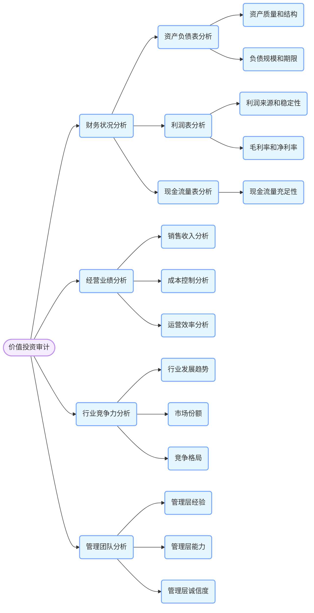

# 托马斯·罗尼的价值投资审计：全面评估公司价值

> 关键词：托马斯·罗尼、价值投资审计、公司价值评估、财务分析、投资决策

> 摘要：本文围绕托马斯·罗尼的价值投资审计方法展开，旨在深入探讨如何全面评估公司价值。详细介绍了价值投资审计的背景知识，包括目的、预期读者等内容。阐述了核心概念及联系，通过算法原理和数学模型的讲解，让读者理解价值评估的底层逻辑。结合项目实战案例，展示了如何运用这些方法进行实际操作。同时，分析了该方法在不同场景下的应用，推荐了相关的学习资源、开发工具和研究论文。最后，总结了未来价值投资审计的发展趋势与挑战，并提供常见问题解答和扩展阅读资料，为投资者和相关专业人士提供了全面且深入的参考。

## 1. 背景介绍 
### 1.1 目的和范围
价值投资作为一种重要的投资策略，强调通过对公司内在价值的评估来做出投资决策。托马斯·罗尼的价值投资审计方法为投资者提供了一套系统、全面的评估框架。本文的目的在于详细剖析这一方法，帮助读者理解如何运用该方法对公司价值进行准确评估。范围涵盖了从核心概念的解释到实际应用案例的分析，以及相关工具和资源的推荐，旨在为读者提供一个完整的学习和实践指南。

### 1.2 预期读者
本文预期读者主要包括对价值投资感兴趣的个人投资者，他们希望通过学习专业的评估方法来提高投资决策的准确性；金融分析师，需要掌握系统的公司价值评估方法以提供专业的分析报告；以及相关专业的学生和研究人员，通过本文深入了解价值投资审计的理论和实践。

### 1.3 文档结构概述
本文首先介绍价值投资审计的背景知识，包括目的、读者和文档结构。接着阐述核心概念与联系，通过文本示意图和 Mermaid 流程图展示其架构。然后详细讲解核心算法原理和具体操作步骤，并用 Python 代码进行说明。随后介绍数学模型和公式，并举例说明。通过项目实战案例，展示如何在实际中运用这些方法。分析该方法在不同场景下的应用，推荐相关的学习资源、开发工具和研究论文。最后总结未来发展趋势与挑战，提供常见问题解答和扩展阅读资料。

### 1.4 术语表
#### 1.4.1 核心术语定义
- **价值投资审计**：是托马斯·罗尼提出的一种全面评估公司价值的方法，综合考虑公司的财务状况、经营业绩、行业竞争力等多个因素，以确定公司的内在价值。
- **内在价值**：指公司在未来持续经营过程中所能产生的现金流量的现值，是价值投资的核心概念。
- **财务比率**：用于衡量公司财务状况和经营业绩的指标，如市盈率、市净率、净资产收益率等。

#### 1.4.2 相关概念解释
- **基本面分析**：通过研究公司的财务报表、行业前景、管理团队等基本面因素来评估公司价值的方法，是价值投资审计的重要组成部分。
- **现金流折现模型**：一种基于未来现金流量预测来计算公司内在价值的模型，是价值投资中常用的估值方法。

#### 1.4.3 缩略词列表
- **PE**：市盈率（Price-to-Earnings Ratio），反映公司股票价格与每股盈利之间的比率。
- **PB**：市净率（Price-to-Book Ratio），衡量公司股票价格与每股净资产之间的关系。
- **ROE**：净资产收益率（Return on Equity），反映公司运用自有资本的效率。

## 2. 核心概念与联系 
### 核心概念原理
托马斯·罗尼的价值投资审计核心在于通过多维度的分析来评估公司的内在价值。主要从财务状况、经营业绩、行业竞争力和管理团队等方面进行考量。

财务状况分析关注公司的资产负债表、利润表和现金流量表。通过分析资产的质量和结构、负债的规模和期限、利润的来源和稳定性以及现金流量的充足性，评估公司的财务健康程度。

经营业绩分析考察公司的销售收入、毛利率、净利率等指标，了解公司在市场中的盈利能力和竞争地位。同时，关注公司的成本控制能力和运营效率。

行业竞争力分析研究公司所处行业的发展趋势、市场份额、竞争格局等因素。评估公司在行业中的优势和劣势，以及应对竞争的能力。

管理团队分析则关注管理层的经验、能力和诚信度。优秀的管理团队能够带领公司实现持续的增长和发展。

### 架构的文本示意图
```
价值投资审计
|-- 财务状况分析
|   |-- 资产负债表分析
|   |   |-- 资产质量和结构
|   |   |-- 负债规模和期限
|   |-- 利润表分析
|   |   |-- 利润来源和稳定性
|   |   |-- 毛利率和净利率
|   |-- 现金流量表分析
|   |   |-- 现金流量充足性
|-- 经营业绩分析
|   |-- 销售收入分析
|   |-- 成本控制分析
|   |-- 运营效率分析
|-- 行业竞争力分析
|   |-- 行业发展趋势
|   |-- 市场份额
|   |-- 竞争格局
|-- 管理团队分析
|   |-- 管理层经验
|   |-- 管理层能力
|   |-- 管理层诚信度
```

### Mermaid 流程图


## 3. 核心算法原理 & 具体操作步骤 
### 核心算法原理
在价值投资审计中，常用的算法原理之一是现金流折现模型（DCF）。该模型基于未来现金流量的预测，将其折现到当前时点，以计算公司的内在价值。

现金流折现模型的基本公式为：
$$V = \sum_{t=1}^{n} \frac{CF_t}{(1 + r)^t} + \frac{TV}{(1 + r)^n}$$
其中，$V$ 表示公司的内在价值，$CF_t$ 表示第 $t$ 期的现金流量，$r$ 表示折现率，$n$ 表示预测期数，$TV$ 表示终值。

### 具体操作步骤
1. **预测未来现金流量**：分析公司的历史财务数据和行业发展趋势，预测未来各期的现金流量。可以采用线性回归、时间序列分析等方法进行预测。
2. **确定折现率**：折现率反映了投资者对投资风险的要求。通常可以采用资本资产定价模型（CAPM）来确定折现率：
$$r = R_f + \beta (R_m - R_f)$$
其中，$R_f$ 表示无风险利率，$\beta$ 表示公司股票的贝塔系数，$R_m$ 表示市场收益率。
3. **计算终值**：在预测期结束后，假设公司进入稳定增长阶段，可以采用永续增长模型计算终值：
$$TV = \frac{CF_{n+1}}{r - g}$$
其中，$CF_{n+1}$ 表示预测期结束后下一期的现金流量，$g$ 表示稳定增长率。
4. **计算内在价值**：将各期现金流量和终值按照折现率折现到当前时点，求和得到公司的内在价值。

### Python 源代码实现
```python
import numpy as np

def dcf_valuation(cash_flows, discount_rate, growth_rate, n_years):
    """
    现金流折现模型计算公司内在价值
    :param cash_flows: 预测的未来现金流量列表
    :param discount_rate: 折现率
    :param growth_rate: 稳定增长率
    :param n_years: 预测期数
    :return: 公司内在价值
    """
    # 计算各期现金流量的现值
    present_values = []
    for i in range(n_years):
        present_value = cash_flows[i] / ((1 + discount_rate) ** (i + 1))
        present_values.append(present_value)
    
    # 计算终值
    last_cash_flow = cash_flows[-1]
    terminal_value = (last_cash_flow * (1 + growth_rate)) / (discount_rate - growth_rate)
    terminal_present_value = terminal_value / ((1 + discount_rate) ** n_years)
    
    # 计算内在价值
    intrinsic_value = sum(present_values) + terminal_present_value
    
    return intrinsic_value

# 示例数据
cash_flows = [100, 120, 140, 160, 180]
discount_rate = 0.1
growth_rate = 0.03
n_years = len(cash_flows)

# 计算内在价值
intrinsic_value = dcf_valuation(cash_flows, discount_rate, growth_rate, n_years)
print(f"公司内在价值: {intrinsic_value}")
```

## 4. 数学模型和公式 & 详细讲解 & 举例说明 
### 现金流折现模型（DCF）
#### 公式
$$V = \sum_{t=1}^{n} \frac{CF_t}{(1 + r)^t} + \frac{TV}{(1 + r)^n}$$

#### 详细讲解
- $\sum_{t=1}^{n} \frac{CF_t}{(1 + r)^t}$：这部分表示预测期内各期现金流量的现值之和。$CF_t$ 是第 $t$ 期的现金流量，$r$ 是折现率，$(1 + r)^t$ 是折现因子，将未来的现金流量折现到当前时点。
- $\frac{TV}{(1 + r)^n}$：这部分表示终值的现值。$TV$ 是终值，即在预测期结束后公司的价值，通过永续增长模型计算得到。

#### 举例说明
假设一家公司未来 5 年的现金流量分别为 100 万元、120 万元、140 万元、160 万元和 180 万元，折现率为 10%，稳定增长率为 3%。

1. 计算各期现金流量的现值：
    - 第 1 年：$PV_1 = \frac{100}{(1 + 0.1)^1} = 90.91$ 万元
    - 第 2 年：$PV_2 = \frac{120}{(1 + 0.1)^2} = 99.17$ 万元
    - 第 3 年：$PV_3 = \frac{140}{(1 + 0.1)^3} = 105.18$ 万元
    - 第 4 年：$PV_4 = \frac{160}{(1 + 0.1)^4} = 109.29$ 万元
    - 第 5 年：$PV_5 = \frac{180}{(1 + 0.1)^5} = 111.72$ 万元
2. 计算终值：
    - 第 6 年的现金流量：$CF_6 = 180 \times (1 + 0.03) = 185.4$ 万元
    - 终值：$TV = \frac{185.4}{0.1 - 0.03} = 2648.57$ 万元
3. 计算终值的现值：
    - $PV_{TV} = \frac{2648.57}{(1 + 0.1)^5} = 1643.33$ 万元
4. 计算公司内在价值：
    - $V = 90.91 + 99.17 + 105.18 + 109.29 + 111.72 + 1643.33 = 2159.59$ 万元

### 资本资产定价模型（CAPM）
#### 公式
$$r = R_f + \beta (R_m - R_f)$$

#### 详细讲解
- $R_f$：无风险利率，通常可以用国债收益率来表示。它反映了投资者在没有风险的情况下所能获得的收益率。
- $\beta$：贝塔系数，衡量公司股票相对于市场的波动性。$\beta > 1$ 表示股票的波动性大于市场，$\beta < 1$ 表示股票的波动性小于市场。
- $R_m$：市场收益率，即整个市场的平均收益率。
- $(R_m - R_f)$：市场风险溢价，反映了投资者承担市场风险所要求的额外收益率。

#### 举例说明
假设无风险利率 $R_f = 3\%$，市场收益率 $R_m = 10\%$，公司股票的贝塔系数 $\beta = 1.2$。

则折现率 $r = 3\% + 1.2 \times (10\% - 3\%) = 11.4\%$

## 5. 项目实战：代码实际案例和详细解释说明 
### 5.1  开发环境搭建
为了实现价值投资审计的代码，我们需要搭建一个 Python 开发环境。以下是具体步骤：

1. **安装 Python**：从 Python 官方网站（https://www.python.org/downloads/）下载并安装 Python 3.x 版本。
2. **安装开发工具**：推荐使用 PyCharm 或 Jupyter Notebook 作为开发工具。可以从官方网站下载并安装。
3. **安装必要的库**：使用以下命令安装所需的库：
```bash
pip install numpy pandas matplotlib
```

### 5.2  源代码详细实现和代码解读
以下是一个完整的价值投资审计代码示例，包括数据获取、财务比率计算和内在价值评估：

```python
import numpy as np
import pandas as pd
import matplotlib.pyplot as plt

# 模拟公司财务数据
data = {
    'Year': [2018, 2019, 2020, 2021, 2022],
    'Revenue': [1000, 1200, 1400, 1600, 1800],
    'Net Income': [100, 120, 140, 160, 180],
    'Total Assets': [500, 600, 700, 800, 900],
    'Total Liabilities': [200, 220, 240, 260, 280]
}

df = pd.DataFrame(data)

# 计算财务比率
df['ROE'] = df['Net Income'] / (df['Total Assets'] - df['Total Liabilities'])
df['PE'] = df['Revenue'] / df['Net Income']
df['PB'] = df['Revenue'] / (df['Total Assets'] - df['Total Liabilities'])

# 可视化财务比率
plt.figure(figsize=(12, 6))
plt.subplot(1, 3, 1)
plt.plot(df['Year'], df['ROE'])
plt.title('Return on Equity')
plt.xlabel('Year')
plt.ylabel('ROE')

plt.subplot(1, 3, 2)
plt.plot(df['Year'], df['PE'])
plt.title('Price-to-Earnings Ratio')
plt.xlabel('Year')
plt.ylabel('PE')

plt.subplot(1, 3, 3)
plt.plot(df['Year'], df['PB'])
plt.title('Price-to-Book Ratio')
plt.xlabel('Year')
plt.ylabel('PB')

plt.tight_layout()
plt.show()

# 现金流折现模型计算内在价值
cash_flows = df['Net Income'].values
discount_rate = 0.1
growth_rate = 0.03
n_years = len(cash_flows)

def dcf_valuation(cash_flows, discount_rate, growth_rate, n_years):
    present_values = []
    for i in range(n_years):
        present_value = cash_flows[i] / ((1 + discount_rate) ** (i + 1))
        present_values.append(present_value)
    
    last_cash_flow = cash_flows[-1]
    terminal_value = (last_cash_flow * (1 + growth_rate)) / (discount_rate - growth_rate)
    terminal_present_value = terminal_value / ((1 + discount_rate) ** n_years)
    
    intrinsic_value = sum(present_values) + terminal_present_value
    
    return intrinsic_value

intrinsic_value = dcf_valuation(cash_flows, discount_rate, growth_rate, n_years)
print(f"公司内在价值: {intrinsic_value}")
```

### 代码解读与分析
1. **数据模拟**：使用字典 `data` 模拟公司的财务数据，包括年份、收入、净利润、总资产和总负债。然后将其转换为 Pandas 数据框 `df`。
2. **财务比率计算**：计算净资产收益率（ROE）、市盈率（PE）和市净率（PB）。这些比率可以帮助我们评估公司的盈利能力、估值水平和资产质量。
3. **可视化财务比率**：使用 Matplotlib 库绘制财务比率的折线图，直观展示公司的财务状况随时间的变化。
4. **现金流折现模型计算内在价值**：定义 `dcf_valuation` 函数，根据前面介绍的现金流折现模型计算公司的内在价值。最后打印出计算结果。

## 6. 实际应用场景 
### 个人投资者
个人投资者可以运用托马斯·罗尼的价值投资审计方法来筛选投资标的。通过对公司的全面评估，确定公司的内在价值，与市场价格进行比较，判断是否具有投资价值。例如，当公司的内在价值高于市场价格时，可能是一个买入的机会；反之，则可能需要谨慎投资或卖出。

### 金融机构
金融机构如银行、基金公司等在进行投资决策和风险管理时，也可以采用价值投资审计方法。银行在对企业进行贷款评估时，可以通过评估企业的价值来判断其还款能力和信用风险。基金公司在构建投资组合时，可以运用该方法筛选优质的股票，提高投资组合的收益。

### 企业并购
在企业并购过程中，收购方需要对目标企业进行价值评估。价值投资审计方法可以帮助收购方全面了解目标企业的财务状况、经营业绩和行业竞争力，确定合理的收购价格。同时，也可以评估并购后的协同效应和整合风险。

## 7. 工具和资源推荐
### 7.1 学习资源推荐
#### 7.1.1 书籍推荐
- 《聪明的投资者》（The Intelligent Investor）：本杰明·格雷厄姆著，价值投资领域的经典之作，介绍了价值投资的基本理念和方法。
- 《巴菲特致股东的信：股份公司教程》（Letters to Shareholders of Berkshire Hathaway）：沃伦·巴菲特著，通过巴菲特致股东的信，学习他的投资思想和决策方法。
- 《财务报表分析与证券定价》（Financial Statement Analysis and Security Valuation）：斯蒂芬·佩因曼著，详细讲解了如何通过财务报表分析来评估公司价值。

#### 7.1.2 在线课程
- Coursera 上的“投资学原理”（Principles of Investing）：由哥伦比亚大学教授授课，介绍了投资的基本原理和方法。
- edX 上的“财务报表分析”（Financial Statement Analysis）：帮助学习者掌握财务报表分析的技巧和方法。

#### 7.1.3 技术博客和网站
- Seeking Alpha：提供专业的金融分析和投资建议，有很多关于价值投资的文章和研究报告。
- Morningstar：提供基金、股票等金融产品的评级和分析，以及市场研究和投资策略。

### 7.2 开发工具框架推荐
#### 7.2.1 IDE和编辑器
- PyCharm：功能强大的 Python 集成开发环境，提供代码编辑、调试、版本控制等功能。
- Jupyter Notebook：交互式的开发环境，适合进行数据分析和可视化。

#### 7.2.2 调试和性能分析工具
- PDB：Python 内置的调试器，可以帮助开发者定位代码中的问题。
- cProfile：Python 标准库中的性能分析工具，用于分析代码的运行时间和性能瓶颈。

#### 7.2.3 相关框架和库
- Pandas：用于数据处理和分析的 Python 库，提供了丰富的数据结构和数据操作方法。
- NumPy：用于科学计算的 Python 库，提供了高效的数组和矩阵运算功能。
- Matplotlib：用于数据可视化的 Python 库，可以绘制各种类型的图表。

### 7.3 相关论文著作推荐
#### 7.3.1 经典论文
- “The Capital Asset Pricing Model: Theory and Evidence”：由 Eugene F. Fama 和 Kenneth R. French 撰写，对资本资产定价模型进行了深入的研究和实证分析。
- “Security Analysis: Principles and Technique”：本杰明·格雷厄姆和戴维·多德的经典论文，奠定了价值投资的理论基础。

#### 7.3.2 最新研究成果
- 关注《Journal of Financial Economics》、《The Review of Financial Studies》等金融领域的顶级期刊，了解价值投资领域的最新研究成果。

#### 7.3.3 应用案例分析
- 一些知名投资机构的研究报告和案例分析，如巴菲特的伯克希尔·哈撒韦公司的年报，提供了实际应用价值投资方法的案例。

## 8. 总结：未来发展趋势与挑战
### 未来发展趋势
- **数字化和智能化**：随着信息技术的发展，价值投资审计将越来越多地借助大数据、人工智能等技术手段。通过对海量数据的分析和挖掘，提高价值评估的准确性和效率。
- **全球化**：全球经济一体化的趋势使得投资者的视野更加开阔，价值投资审计将更加注重对全球市场和跨国公司的评估。
- **社会责任投资**：投资者越来越关注企业的社会责任和可持续发展，未来价值投资审计将纳入更多的非财务指标，如环境、社会和治理（ESG）因素。

### 挑战
- **数据质量和可靠性**：价值投资审计依赖于准确、可靠的财务数据和市场信息。然而，数据的质量和可靠性可能受到多种因素的影响，如财务造假、信息披露不完整等。
- **模型的局限性**：现有的价值评估模型如现金流折现模型等存在一定的局限性，对未来现金流量和折现率的预测存在不确定性，可能导致评估结果的偏差。
- **市场的不确定性**：金融市场受到宏观经济、政策法规、突发事件等多种因素的影响，市场的不确定性增加了价值投资审计的难度。

## 9. 附录：常见问题与解答
### 如何确定未来现金流量？
确定未来现金流量需要综合考虑公司的历史财务数据、行业发展趋势、市场竞争状况等因素。可以采用趋势分析、行业对标、专家预测等方法进行预测。同时，要考虑到不确定性因素的影响，进行敏感性分析。

### 折现率的选择对评估结果有多大影响？
折现率的选择对评估结果有较大影响。折现率越高，未来现金流量的现值越低，公司的内在价值也就越低；反之，折现率越低，公司的内在价值越高。因此，在选择折现率时，需要谨慎考虑市场利率、公司风险等因素。

### 价值投资审计是否适用于所有行业？
价值投资审计的基本原理适用于大多数行业，但不同行业的特点和影响因素可能不同。在进行价值评估时，需要根据行业的特点进行调整和优化。例如，对于高科技行业，可能需要更多地关注研发投入和创新能力；对于周期性行业，需要考虑行业周期的影响。

## 10. 扩展阅读 & 参考资料
### 扩展阅读
- 《投资最重要的事》（The Most Important Thing Illuminated）：霍华德·马克斯著，分享了投资中的重要理念和经验。
- 《穷查理宝典：查理·芒格的智慧箴言录》（Poor Charlie's Almanack: The Wit and Wisdom of Charles T. Munger）：查理·芒格的思想和智慧的集合，对价值投资有深刻的见解。

### 参考资料
- 托马斯·罗尼的相关著作和研究报告。
- 金融领域的学术期刊和研究论文。
- 各大金融机构的研究报告和市场分析。

作者：AI天才研究院/AI Genius Institute & 禅与计算机程序设计艺术 /Zen And The Art of Computer Programming