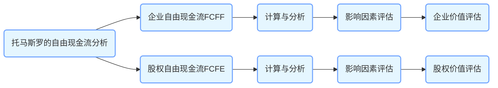

# 托马斯罗的自由现金流分析

> 关键词：托马斯罗、自由现金流分析、财务评估、企业价值、现金流模型

> 摘要：本文围绕托马斯罗的自由现金流分析展开，深入探讨其核心概念、算法原理、数学模型等内容。首先介绍背景信息，包括目的范围、预期读者等。接着阐述自由现金流分析的核心概念与联系，给出原理和架构的示意图及流程图。详细讲解核心算法原理并结合 Python 代码说明，通过数学公式进一步剖析。以实际项目案例展示代码实现和解读。探讨自由现金流分析在不同场景的实际应用，推荐相关学习资源、开发工具和论文著作。最后总结未来发展趋势与挑战，解答常见问题并提供扩展阅读和参考资料，旨在为读者全面深入理解托马斯罗的自由现金流分析提供清晰且专业的指导。

## 1. 背景介绍 
### 1.1 目的和范围
自由现金流分析是评估企业财务健康状况和内在价值的重要方法。托马斯罗的自由现金流分析为这一领域提供了独特且有效的视角。本文的目的在于深入剖析托马斯罗自由现金流分析的原理、方法和应用，详细阐述其背后的核心概念、算法以及数学模型。通过实际案例展示如何运用该分析方法进行企业价值评估和投资决策。范围涵盖从基础理论知识到实际操作的各个方面，旨在帮助读者全面掌握这一分析方法并能够将其应用于实际的财务分析和投资实践中。

### 1.2 预期读者
本文预期读者包括财务分析师、投资经理、企业管理者、金融专业学生以及对企业财务分析和投资决策感兴趣的人士。对于财务分析师和投资经理，本文提供了深入的理论和实践指导，有助于他们提升分析能力和决策水平；企业管理者可以通过了解自由现金流分析，更好地评估企业的经营状况和价值，为战略决策提供依据；金融专业学生能够通过本文系统学习相关知识，加深对财务分析的理解；而对投资感兴趣的普通人士也可以从中获取实用的分析方法和投资思路。

### 1.3 文档结构概述
本文结构清晰，按照从理论到实践的顺序逐步展开。首先在背景介绍部分明确目的、范围、预期读者和文档结构，并给出相关术语的定义和解释。接着详细阐述核心概念与联系，通过文本示意图和 Mermaid 流程图直观展示自由现金流分析的原理和架构。然后讲解核心算法原理，结合 Python 代码进行具体操作步骤的说明。通过数学模型和公式进一步深入分析，并举实际例子帮助理解。在项目实战部分，从开发环境搭建开始，详细介绍源代码实现和解读。探讨自由现金流分析在不同场景的实际应用。推荐相关的学习资源、开发工具和论文著作。最后总结未来发展趋势与挑战，解答常见问题并提供扩展阅读和参考资料。

### 1.4 术语表
#### 1.4.1 核心术语定义
- **自由现金流（Free Cash Flow，FCF）**：指企业在满足了营运资本投资和资本性支出需求之后，可以自由分配给企业资本供应者（包括债权人和股东）的现金流量。它反映了企业实际可用于各种用途的现金数量。
- **托马斯罗的自由现金流分析**：是一种基于自由现金流概念，结合特定的分析方法和模型，对企业财务状况和价值进行评估的分析体系，注重从现金流的角度深入理解企业的经营和财务状况。
- **营运资本（Working Capital）**：是指流动资产减去流动负债后的余额，反映了企业短期经营活动的资金需求和流动性状况。
- **资本性支出（Capital Expenditure，CapEx）**：是指企业为了获取长期资产（如固定资产、无形资产等）而发生的支出，通常用于维持或扩大企业的生产经营规模。

#### 1.4.2 相关概念解释
- **现金流折现模型（Discounted Cash Flow Model，DCF）**：是一种常用的企业估值方法，其基本原理是将企业未来各期的自由现金流按照一定的折现率折现到当前时刻，从而得到企业的内在价值。托马斯罗的自由现金流分析常常与现金流折现模型相结合，用于评估企业的投资价值。
- **企业价值（Enterprise Value，EV）**：是指企业的整体价值，包括股权价值和债权价值。在自由现金流分析中，通过对企业未来自由现金流的预测和折现，可以计算出企业的企业价值。
- **可持续增长率（Sustainable Growth Rate，SGR）**：是指企业在不依靠外部股权融资，仅依靠内部留存收益和合理的债务融资的情况下，能够实现的最大增长率。在自由现金流分析中，可持续增长率是预测企业未来自由现金流的重要参数之一。

#### 1.4.3 缩略词列表
- FCF：Free Cash Flow（自由现金流）
- CapEx：Capital Expenditure（资本性支出）
- DCF：Discounted Cash Flow Model（现金流折现模型）
- EV：Enterprise Value（企业价值）
- SGR：Sustainable Growth Rate（可持续增长率）

## 2. 核心概念与联系 

### 核心概念原理
托马斯罗的自由现金流分析基于自由现金流这一核心概念。自由现金流反映了企业在经营活动中实际产生的、可供自由支配的现金流量。其原理在于，企业的价值最终取决于其未来能够产生的现金流量，而不是会计利润。会计利润可能受到会计政策、折旧方法等因素的影响，而自由现金流则更能真实地反映企业的经营能力和财务状况。

自由现金流可以分为两种常见的类型：企业自由现金流（FCFF）和股权自由现金流（FCFE）。企业自由现金流是指企业在满足了所有经营成本、营运资本投资和资本性支出之后，可供所有资本提供者（包括债权人和股东）分配的现金流量。其计算公式为：

$$FCFF = EBIT(1 - T) + Depreciation - CapEx - \Delta WC$$

其中，$EBIT$ 是息税前利润，$T$ 是企业所得税税率，$Depreciation$ 是折旧和摊销，$CapEx$ 是资本性支出，$\Delta WC$ 是营运资本的变化。

股权自由现金流是指企业在满足了所有经营成本、营运资本投资、资本性支出和债务偿还之后，可供股东分配的现金流量。其计算公式为：

$$FCFE = FCFF - Interest(1 - T) + Net Borrowing$$

其中，$Interest$ 是企业的利息支出，$Net Borrowing$ 是净借款（借款增加额减去借款偿还额）。

### 架构的文本示意图
```plaintext
            托马斯罗的自由现金流分析
                  |
      -------------------------
      |                       |
  企业自由现金流(FCFF)     股权自由现金流(FCFE)
      |                       |
  计算与分析                计算与分析
      |                       |
  影响因素评估              影响因素评估
      |                       |
  企业价值评估              股权价值评估
```

### Mermaid 流程图


## 3. 核心算法原理 & 具体操作步骤 

### 核心算法原理
托马斯罗的自由现金流分析的核心算法主要围绕自由现金流的计算和企业价值的评估。其基本思路是通过对企业的财务报表进行分析，计算出企业的自由现金流，然后根据一定的折现率将未来的自由现金流折现到当前时刻，从而得到企业的内在价值。

### 具体操作步骤
1. **数据收集**：收集企业的财务报表，包括利润表、资产负债表和现金流量表。从这些报表中提取所需的数据，如息税前利润、折旧和摊销、资本性支出、营运资本等。
2. **计算自由现金流**：根据前面给出的公式计算企业自由现金流（FCFF）和股权自由现金流（FCFE）。
3. **预测未来自由现金流**：根据企业的历史数据、行业发展趋势和宏观经济环境等因素，对企业未来的自由现金流进行预测。可以采用线性增长模型、固定增长率模型或多阶段增长模型等方法进行预测。
4. **确定折现率**：折现率反映了投资者对投资风险的要求。对于企业自由现金流，通常使用加权平均资本成本（WACC）作为折现率；对于股权自由现金流，使用股权资本成本作为折现率。
5. **计算企业价值**：将预测的未来自由现金流按照折现率折现到当前时刻，然后将各期折现后的自由现金流相加，得到企业的内在价值。

### Python 代码实现
```python
import numpy as np

def calculate_fcff(ebit, tax_rate, depreciation, capex, delta_wc):
    """
    计算企业自由现金流（FCFF）
    :param ebit: 息税前利润
    :param tax_rate: 企业所得税税率
    :param depreciation: 折旧和摊销
    :param capex: 资本性支出
    :param delta_wc: 营运资本的变化
    :return: 企业自由现金流
    """
    return ebit * (1 - tax_rate) + depreciation - capex - delta_wc

def calculate_fcfe(fcff, interest, tax_rate, net_borrowing):
    """
    计算股权自由现金流（FCFE）
    :param fcff: 企业自由现金流
    :param interest: 利息支出
    :param tax_rate: 企业所得税税率
    :param net_borrowing: 净借款
    :return: 股权自由现金流
    """
    return fcff - interest * (1 - tax_rate) + net_borrowing

def discount_fcf(fcf, discount_rate, years):
    """
    对折现自由现金流进行折现计算
    :param fcf: 自由现金流列表
    :param discount_rate: 折现率
    :param years: 预测年份列表
    :return: 折现后的自由现金流列表
    """
    discounted_fcf = []
    for i in range(len(fcf)):
        discounted_fcf.append(fcf[i] / ((1 + discount_rate) ** years[i]))
    return discounted_fcf

# 示例数据
ebit = 1000
tax_rate = 0.25
depreciation = 200
capex = 300
delta_wc = 100
interest = 100
net_borrowing = 50
discount_rate = 0.1
years = [1, 2, 3, 4, 5]
fcf_forecast = [1200, 1300, 1400, 1500, 1600]

# 计算 FCFF 和 FCFE
fcff = calculate_fcff(ebit, tax_rate, depreciation, capex, delta_wc)
fcfe = calculate_fcfe(fcff, interest, tax_rate, net_borrowing)

# 对折现自由现金流进行折现计算
discounted_fcf = discount_fcf(fcf_forecast, discount_rate, years)

print("企业自由现金流（FCFF）:", fcff)
print("股权自由现金流（FCFE）:", fcfe)
print("折现后的自由现金流:", discounted_fcf)
```

## 4. 数学模型和公式 & 详细讲解 & 举例说明 

### 数学模型和公式
#### 企业自由现金流（FCFF）公式
$$FCFF = EBIT(1 - T) + Depreciation - CapEx - \Delta WC$$

详细讲解：
- $EBIT(1 - T)$：表示企业在扣除所得税后的经营利润。$EBIT$ 是息税前利润，反映了企业的经营盈利能力；$T$ 是企业所得税税率，扣除所得税后得到企业实际可用于分配的经营利润。
- $Depreciation$：折旧和摊销是一种非现金支出，虽然在会计上会减少利润，但实际上并没有现金流出企业。因此，在计算自由现金流时需要将其加回。
- $CapEx$：资本性支出是企业为了维持或扩大生产经营规模而进行的长期投资，这部分支出会导致现金流出企业，所以需要从经营利润中扣除。
- $\Delta WC$：营运资本的变化反映了企业短期经营活动的资金需求变化。如果营运资本增加，意味着企业需要投入更多的资金用于运营，会导致现金流出；反之，如果营运资本减少，则会有现金流入。

#### 股权自由现金流（FCFE）公式
$$FCFE = FCFF - Interest(1 - T) + Net Borrowing$$

详细讲解：
- $FCFF$：是企业自由现金流，是可供所有资本提供者分配的现金流量。
- $Interest(1 - T)$：利息支出是企业向债权人支付的费用，扣除所得税后得到实际的利息支出。从企业自由现金流中减去这部分支出，得到可供股东分配的现金流量。
- $Net Borrowing$：净借款是企业借款增加额减去借款偿还额。如果净借款为正，意味着企业获得了额外的资金，会增加可供股东分配的现金流量；反之，如果净借款为负，则会减少可供股东分配的现金流量。

#### 现金流折现模型（DCF）公式
$$EV = \sum_{t = 1}^{n} \frac{FCFF_t}{(1 + WACC)^t} + \frac{TV}{(1 + WACC)^n}$$

其中，$EV$ 是企业价值，$FCFF_t$ 是第 $t$ 期的企业自由现金流，$WACC$ 是加权平均资本成本，$TV$ 是终值，$n$ 是预测期数。

详细讲解：
- $\sum_{t = 1}^{n} \frac{FCFF_t}{(1 + WACC)^t}$：表示预测期内各期企业自由现金流的折现值之和。将未来各期的自由现金流按照加权平均资本成本折现到当前时刻，考虑了资金的时间价值。
- $\frac{TV}{(1 + WACC)^n}$：终值是指预测期结束后企业的持续价值。通常采用永续增长模型计算终值，公式为 $TV=\frac{FCFF_{n + 1}}{WACC - g}$，其中 $FCFF_{n + 1}$ 是预测期结束后下一期的企业自由现金流，$g$ 是永续增长率。

### 举例说明
假设一家企业的息税前利润（$EBIT$）为 1000 万元，企业所得税税率（$T$）为 25%，折旧和摊销（$Depreciation$）为 200 万元，资本性支出（$CapEx$）为 300 万元，营运资本的变化（$\Delta WC$）为 100 万元。

1. **计算企业自由现金流（FCFF）**
根据公式 $FCFF = EBIT(1 - T) + Depreciation - CapEx - \Delta WC$，可得：
$$FCFF = 1000\times(1 - 0.25)+ 200 - 300 - 100$$
$$FCFF = 750 + 200 - 300 - 100 = 550$$（万元）

2. **假设该企业的利息支出（$Interest$）为 100 万元，净借款（$Net Borrowing$）为 50 万元，计算股权自由现金流（FCFE）**
根据公式 $FCFE = FCFF - Interest(1 - T) + Net Borrowing$，可得：
$$FCFE = 550 - 100\times(1 - 0.25)+ 50$$
$$FCFE = 550 - 75 + 50 = 525$$（万元）

3. **假设预测该企业未来 5 年的企业自由现金流分别为 600 万元、650 万元、700 万元、750 万元、800 万元，加权平均资本成本（$WACC$）为 10%，永续增长率（$g$）为 3%，计算企业价值（$EV$）**
首先计算终值 $TV$：
假设第 6 年的企业自由现金流 $FCFF_6 = 800\times(1 + 0.03)=824$（万元）
$$TV=\frac{FCFF_6}{WACC - g}=\frac{824}{0.1 - 0.03}=\frac{824}{0.07}\approx11771.43$$（万元）

然后计算预测期内各期自由现金流的折现值之和：
$$PV_{FCFF}=\frac{600}{(1 + 0.1)^1}+\frac{650}{(1 + 0.1)^2}+\frac{700}{(1 + 0.1)^3}+\frac{750}{(1 + 0.1)^4}+\frac{800}{(1 + 0.1)^5}$$
$$PV_{FCFF}\approx545.45 + 537.19 + 525.92 + 512.27 + 496.74 = 2617.57$$（万元）

最后计算企业价值 $EV$：
$$EV = PV_{FCFF}+\frac{TV}{(1 + 0.1)^5}$$
$$EV = 2617.57+\frac{11771.43}{(1 + 0.1)^5}$$
$$EV = 2617.57 + 7303.77 = 9921.34$$（万元）

## 5. 项目实战：代码实际案例和详细解释说明 

### 5.1  开发环境搭建
为了实现托马斯罗的自由现金流分析的代码案例，我们可以使用 Python 作为开发语言。以下是搭建开发环境的步骤：

1. **安装 Python**：从 Python 官方网站（https://www.python.org/downloads/）下载并安装适合你操作系统的 Python 版本。建议安装 Python 3.7 及以上版本。
2. **安装开发工具**：可以选择使用 PyCharm、Jupyter Notebook 或 VS Code 等开发工具。这里以 PyCharm 为例，从 JetBrains 官方网站（https://www.jetbrains.com/pycharm/download/）下载并安装 PyCharm 社区版。
3. **创建虚拟环境**：为了避免不同项目之间的依赖冲突，建议创建一个虚拟环境。在命令行中使用以下命令创建虚拟环境：
```sh
python -m venv free_cash_flow_env
```
4. **激活虚拟环境**：在命令行中使用以下命令激活虚拟环境：
- Windows：
```sh
free_cash_flow_env\Scripts\activate
```
- Linux/Mac：
```sh
source free_cash_flow_env/bin/activate
```
5. **安装必要的库**：在虚拟环境中安装所需的库，如 numpy 等。使用以下命令安装：
```sh
pip install numpy
```

### 5.2  源代码详细实现和代码解读
```python
import numpy as np

# 定义计算企业自由现金流（FCFF）的函数
def calculate_fcff(ebit, tax_rate, depreciation, capex, delta_wc):
    """
    计算企业自由现金流（FCFF）
    :param ebit: 息税前利润
    :param tax_rate: 企业所得税税率
    :param depreciation: 折旧和摊销
    :param capex: 资本性支出
    :param delta_wc: 营运资本的变化
    :return: 企业自由现金流
    """
    return ebit * (1 - tax_rate) + depreciation - capex - delta_wc

# 定义计算股权自由现金流（FCFE）的函数
def calculate_fcfe(fcff, interest, tax_rate, net_borrowing):
    """
    计算股权自由现金流（FCFE）
    :param fcff: 企业自由现金流
    :param interest: 利息支出
    :param tax_rate: 企业所得税税率
    :param net_borrowing: 净借款
    :return: 股权自由现金流
    """
    return fcff - interest * (1 - tax_rate) + net_borrowing

# 定义对折现自由现金流进行折现计算的函数
def discount_fcf(fcf, discount_rate, years):
    """
    对折现自由现金流进行折现计算
    :param fcf: 自由现金流列表
    :param discount_rate: 折现率
    :param years: 预测年份列表
    :return: 折现后的自由现金流列表
    """
    discounted_fcf = []
    for i in range(len(fcf)):
        discounted_fcf.append(fcf[i] / ((1 + discount_rate) ** years[i]))
    return discounted_fcf

# 示例数据
ebit = 1000
tax_rate = 0.25
depreciation = 200
capex = 300
delta_wc = 100
interest = 100
net_borrowing = 50
discount_rate = 0.1
years = [1, 2, 3, 4, 5]
fcf_forecast = [1200, 1300, 1400, 1500, 1600]

# 计算 FCFF 和 FCFE
fcff = calculate_fcff(ebit, tax_rate, depreciation, capex, delta_wc)
fcfe = calculate_fcfe(fcff, interest, tax_rate, net_borrowing)

# 对折现自由现金流进行折现计算
discounted_fcf = discount_fcf(fcf_forecast, discount_rate, years)

print("企业自由现金流（FCFF）:", fcff)
print("股权自由现金流（FCFE）:", fcfe)
print("折现后的自由现金流:", discounted_fcf)
```

### 代码解读与分析
1. **函数定义部分**：
    - `calculate_fcff` 函数：根据企业自由现金流的计算公式，接收息税前利润、企业所得税税率、折旧和摊销、资本性支出和营运资本的变化作为参数，返回企业自由现金流。
    - `calculate_fcfe` 函数：根据股权自由现金流的计算公式，接收企业自由现金流、利息支出、企业所得税税率和净借款作为参数，返回股权自由现金流。
    - `discount_fcf` 函数：根据现金流折现模型，接收自由现金流列表、折现率和预测年份列表作为参数，返回折现后的自由现金流列表。
2. **示例数据部分**：定义了一系列示例数据，包括息税前利润、企业所得税税率、折旧和摊销、资本性支出、营运资本的变化、利息支出、净借款、折现率、预测年份列表和自由现金流预测列表。
3. **计算部分**：调用 `calculate_fcff` 函数计算企业自由现金流，调用 `calculate_fcfe` 函数计算股权自由现金流，调用 `discount_fcf` 函数对折现自由现金流进行折现计算。
4. **输出部分**：打印计算得到的企业自由现金流、股权自由现金流和折现后的自由现金流。

通过这个代码案例，我们可以看到如何使用 Python 实现托马斯罗的自由现金流分析的基本计算过程。在实际应用中，可以根据具体情况修改示例数据，或者将代码集成到更复杂的财务分析系统中。

## 6. 实际应用场景 
### 企业价值评估
托马斯罗的自由现金流分析在企业价值评估中具有重要应用。投资者和分析师可以通过计算企业的自由现金流，并使用现金流折现模型将未来的自由现金流折现到当前时刻，从而得到企业的内在价值。与传统的基于会计利润的估值方法相比，自由现金流分析更能反映企业的真实经营状况和现金创造能力，有助于更准确地评估企业的价值。例如，在进行并购交易时，收购方可以使用自由现金流分析评估目标企业的价值，从而确定合理的收购价格。

### 投资决策
在投资决策中，自由现金流分析可以帮助投资者判断企业的投资价值和风险。投资者可以比较不同企业的自由现金流状况，选择自由现金流稳定、增长潜力大的企业进行投资。同时，通过分析企业的自由现金流与债务水平的关系，投资者可以评估企业的偿债能力和财务风险。例如，一家企业的自由现金流持续为负，且债务水平较高，那么该企业可能面临较大的财务风险，投资者需要谨慎考虑是否投资。

### 企业战略规划
企业管理者可以使用自由现金流分析来制定企业的战略规划。通过对企业自由现金流的分析，管理者可以了解企业的现金创造能力和资金需求状况，从而合理安排资金的使用和投资项目的选择。例如，如果企业的自由现金流充足，管理者可以考虑进行扩张性投资，如新建工厂、研发新产品等；如果自由现金流紧张，管理者则需要优化运营流程，减少资本性支出，提高资金使用效率。

### 财务风险管理
自由现金流分析有助于企业进行财务风险管理。通过监测企业的自由现金流状况，企业可以及时发现潜在的财务风险，并采取相应的措施进行防范。例如，如果企业的自由现金流突然下降，可能意味着企业的经营出现了问题，如销售下滑、成本上升等。企业管理者可以及时调整经营策略，降低成本，提高销售，以保证企业的自由现金流稳定。

## 7. 工具和资源推荐
### 7.1 学习资源推荐
#### 7.1.1 书籍推荐
- 《自由现金流与企业价值评估》：本书详细介绍了自由现金流的概念、计算方法和应用，以及如何使用自由现金流进行企业价值评估。书中包含了大量的案例分析和实际操作指南，适合财务分析师、投资经理和企业管理者阅读。
- 《财务报表分析与证券定价》：该书从财务报表分析的角度出发，深入探讨了如何通过分析企业的财务报表来评估企业的价值和投资风险。其中涉及到自由现金流分析的相关内容，对于理解自由现金流在财务分析中的应用具有重要意义。
- 《价值评估：公司价值的衡量与管理》：本书是企业价值评估领域的经典著作，系统介绍了各种企业价值评估方法，包括现金流折现模型等。书中对自由现金流的分析和应用进行了全面的阐述，适合专业人士和学者深入学习。

#### 7.1.2 在线课程
- Coursera 上的“财务分析与决策”课程：该课程由知名大学的教授授课，涵盖了财务报表分析、财务比率分析、自由现金流分析等内容。通过视频讲解、案例分析和在线作业等方式，帮助学员系统学习财务分析的方法和技巧。
- edX 上的“企业估值与投资决策”课程：课程围绕企业估值的核心问题展开，详细介绍了自由现金流分析在企业估值中的应用。课程内容丰富，包括理论讲解、模型构建和实际案例分析等，适合有一定财务基础的学员学习。
- 中国大学 MOOC 上的“财务管理”课程：该课程由国内高校的教师授课，内容涵盖了财务管理的各个方面，其中包括自由现金流分析和企业价值评估的相关知识。课程讲解深入浅出，适合初学者学习。

#### 7.1.3 技术博客和网站
- Seeking Alpha：这是一个知名的金融投资博客网站，提供了大量关于企业财务分析、自由现金流分析和投资决策的文章和评论。网站上的文章来自专业的分析师和投资者，具有较高的参考价值。
- Bloomberg：彭博社是全球著名的财经媒体，其网站提供了丰富的金融数据和分析报告。在 Bloomberg 上可以获取到企业的财务报表、自由现金流数据等信息，有助于进行自由现金流分析和企业价值评估。
- 雪球财经：国内知名的财经社区，聚集了大量的投资者和分析师。在雪球上可以看到关于自由现金流分析和企业价值评估的讨论和分享，与其他投资者交流经验和观点。

### 7.2 开发工具框架推荐
#### 7.2.1 IDE和编辑器
- PyCharm：是一款专业的 Python 集成开发环境，具有强大的代码编辑、调试和自动完成等功能。适合用于开发和调试自由现金流分析的 Python 代码。
- Jupyter Notebook：是一个基于网页的交互式计算环境，可以将代码、文本、图表等内容集成在一个文档中。非常适合进行数据探索和分析，对于自由现金流分析的代码实现和结果展示非常方便。
- VS Code：是一款轻量级的代码编辑器，支持多种编程语言。通过安装相关的插件，可以实现 Python 代码的编辑、调试和运行。VS Code 具有简洁的界面和丰富的扩展功能，是很多开发者喜欢的工具之一。

#### 7.2.2 调试和性能分析工具
- PDB：是 Python 自带的调试工具，可以在代码中设置断点，逐步执行代码，查看变量的值和程序的执行流程。对于调试自由现金流分析的 Python 代码非常有用。
- Py-Spy：是一个用于分析 Python 程序性能的工具，可以实时监测 Python 程序的 CPU 使用率和函数调用情况。通过使用 Py-Spy，可以找出代码中的性能瓶颈，优化代码性能。
- cProfile：是 Python 标准库中的一个性能分析模块，可以统计 Python 程序中各个函数的执行时间和调用次数。通过分析 cProfile 的输出结果，可以找出代码中耗时较长的部分，进行针对性的优化。

#### 7.2.3 相关框架和库
- NumPy：是 Python 中用于科学计算的基础库，提供了高效的数组操作和数学函数。在自由现金流分析中，可以使用 NumPy 进行数据处理和计算。
- Pandas：是一个用于数据处理和分析的 Python 库，提供了灵活的数据结构和数据操作方法。在自由现金流分析中，可以使用 Pandas 读取和处理企业的财务报表数据。
- Matplotlib：是一个用于绘制图表和可视化数据的 Python 库。在自由现金流分析中，可以使用 Matplotlib 绘制自由现金流的趋势图、折现后的自由现金流分布图等，直观展示分析结果。

### 7.3 相关论文著作推荐
#### 7.3.1 经典论文
- "Valuation Using Free Cash Flow and Earnings: An Empirical Comparison"：该论文比较了使用自由现金流和会计利润进行企业估值的方法，通过实证研究分析了两种方法的优缺点和适用场景。
- "The Free Cash Flow Hypothesis: A Critical Review"：对自由现金流假说进行了批判性的回顾和分析，探讨了自由现金流与企业代理问题、投资决策等方面的关系。
- "Discounted Cash Flow Valuation: A Reality Check"：对现金流折现模型在企业估值中的应用进行了现实检验，分析了模型的假设条件和局限性，并提出了一些改进建议。

#### 7.3.2 最新研究成果
- 近年来，一些研究关注了自由现金流分析在新兴行业和特殊企业中的应用，如科技企业、初创企业等。这些研究探讨了如何调整自由现金流的计算方法和折现率的确定方法，以适应不同行业和企业的特点。
- 还有一些研究结合了机器学习和人工智能技术，对自由现金流进行预测和分析。通过构建机器学习模型，可以更准确地预测企业未来的自由现金流，提高企业价值评估的准确性。

#### 7.3.3 应用案例分析
- 一些知名企业的并购案例和投资案例中，常常涉及到自由现金流分析的应用。例如，巴菲特在投资企业时，非常注重企业的自由现金流状况。通过分析这些实际案例，可以学习到如何在实际操作中运用自由现金流分析进行企业价值评估和投资决策。

## 8. 总结：未来发展趋势与挑战
### 未来发展趋势
#### 与新兴技术融合
随着人工智能、机器学习和大数据技术的不断发展，自由现金流分析将与这些新兴技术深度融合。通过使用机器学习算法，可以更准确地预测企业未来的自由现金流，提高企业价值评估的准确性。例如，利用深度学习模型对企业的历史财务数据、市场数据和行业数据进行分析，挖掘潜在的规律和趋势，从而更精准地预测自由现金流的变化。

#### 拓展应用领域
自由现金流分析的应用领域将不断拓展。除了传统的企业价值评估、投资决策和财务风险管理等领域，自由现金流分析还将应用于绿色金融、社会责任投资等新兴领域。例如，在评估企业的可持续发展能力时，可以考虑企业的环境、社会和治理（ESG）因素对自由现金流的影响，从而为投资者提供更全面的投资建议。

#### 国际化和全球化
随着经济全球化的发展，企业的经营活动越来越国际化。自由现金流分析也将更加注重国际化和全球化的视角。分析师需要考虑不同国家和地区的会计准则、税收政策、市场环境等因素对自由现金流的影响，以更准确地评估跨国企业的价值和风险。

### 挑战
#### 数据质量和可靠性
自由现金流分析依赖于准确和可靠的财务数据。然而，在实际应用中，企业的财务数据可能存在质量问题，如数据造假、会计政策调整等。这些问题会影响自由现金流的计算和分析结果的准确性。因此，如何确保数据的质量和可靠性是自由现金流分析面临的一个重要挑战。

#### 预测的不确定性
未来自由现金流的预测是自由现金流分析的关键环节，但预测过程中存在很大的不确定性。企业的经营环境受到多种因素的影响，如市场竞争、技术变革、宏观经济波动等，这些因素都会导致未来自由现金流的变化难以准确预测。如何降低预测的不确定性，提高预测的准确性是自由现金流分析需要解决的另一个挑战。

#### 模型假设的局限性
现金流折现模型等自由现金流分析模型都基于一定的假设条件，如折现率的稳定性、企业的持续经营等。然而，在实际情况中，这些假设条件可能并不成立。例如，市场利率的波动会导致折现率发生变化，企业可能面临破产或重组等情况，从而影响模型的适用性和分析结果的可靠性。如何合理处理模型假设的局限性，提高模型的灵活性和适应性是自由现金流分析面临的又一个挑战。

## 9. 附录：常见问题与解答
### 问题 1：自由现金流和净利润有什么区别？
解答：自由现金流和净利润是两个不同的概念。净利润是按照会计准则计算的企业在一定时期内的盈利情况，它受到会计政策、折旧方法、非现金项目等因素的影响。而自由现金流是企业在满足了营运资本投资和资本性支出需求之后，可以自由分配给企业资本供应者的现金流量，更能反映企业实际可用于各种用途的现金数量。例如，一家企业可能净利润很高，但由于大量的资本性支出和营运资本增加，导致自由现金流为负。

### 问题 2：如何确定折现率？
解答：折现率反映了投资者对投资风险的要求。对于企业自由现金流，通常使用加权平均资本成本（WACC）作为折现率。WACC 的计算公式为：

$$WACC = w_d\times r_d\times(1 - T)+ w_e\times r_e$$

其中，$w_d$ 是债务资本的权重，$r_d$ 是债务资本成本，$T$ 是企业所得税税率，$w_e$ 是股权资本的权重，$r_e$ 是股权资本成本。

债务资本成本可以通过企业的债务利率来确定，股权资本成本可以使用资本资产定价模型（CAPM）来计算，公式为：

$$r_e = R_f+\beta\times(R_m - R_f)$$

其中，$R_f$ 是无风险利率，$\beta$ 是企业股票的贝塔系数，$R_m$ 是市场收益率。

### 问题 3：自由现金流分析适用于所有企业吗？
解答：自由现金流分析适用于大多数企业，但在某些情况下可能存在一定的局限性。对于处于快速成长阶段的企业，由于其需要大量的资本性支出用于扩张，可能会导致自由现金流为负，但这并不一定意味着企业的价值低。此外，对于一些新兴行业或特殊企业，如科技初创企业，其未来的现金流具有很大的不确定性，自由现金流分析的准确性可能会受到影响。在使用自由现金流分析时，需要结合企业的具体情况进行综合考虑。

### 问题 4：如何处理预测期后的终值？
解答：预测期后的终值通常采用永续增长模型来计算，公式为 $TV=\frac{FCFF_{n + 1}}{WACC - g}$，其中 $FCFF_{n + 1}$ 是预测期结束后下一期的企业自由现金流，$WACC$ 是加权平均资本成本，$g$ 是永续增长率。永续增长率的确定需要综合考虑企业的行业特点、市场竞争状况和宏观经济环境等因素。一般来说，永续增长率不宜过高，通常在 2% - 3% 左右。

## 10. 扩展阅读 & 参考资料
### 扩展阅读
- 《投资中最简单的事》：这本书从投资的角度出发，介绍了一些简单而实用的投资方法和理念，其中涉及到对企业基本面分析的内容，包括自由现金流分析等方面的知识。
- 《聪明的投资者》：被誉为投资界的圣经，书中强调了价值投资的重要性，详细介绍了如何通过分析企业的财务状况和内在价值来进行投资决策。自由现金流分析是其中的重要内容之一。
- 《财务智慧》：以通俗易懂的语言介绍了财务分析的基本概念和方法，帮助读者理解企业的财务报表和财务指标。对于初学者来说，是一本很好的入门读物。

### 参考资料
- 企业财务报表：企业的年度报告、季度报告等财务报表是进行自由现金流分析的重要数据来源。可以从企业的官方网站、证券交易所网站等渠道获取。
- 财经数据库：如 Bloomberg、Wind 等财经数据库提供了丰富的企业财务数据和市场数据，方便进行自由现金流分析和企业价值评估。
- 学术期刊：《金融研究》、《会计研究》等学术期刊上发表了许多关于财务分析和企业价值评估的研究论文，可以为深入学习自由现金流分析提供理论支持。

作者：AI天才研究院/AI Genius Institute & 禅与计算机程序设计艺术 /Zen And The Art of Computer Programming