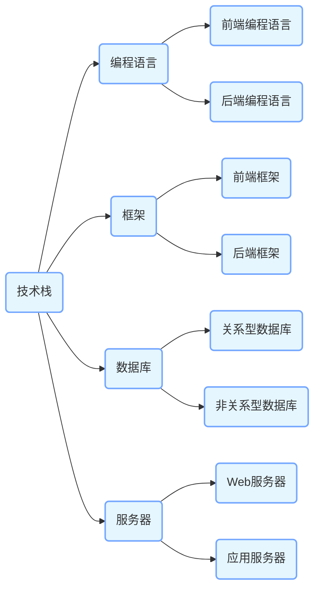

# 技术栈选择与评估

> 关键词：技术栈选择、技术栈评估、软件开发、编程语言、框架

> 摘要：本文围绕技术栈的选择与评估展开深入探讨。详细阐述了技术栈的背景知识，包括其目的、预期读者、文档结构等。对核心概念进行了清晰解释，并给出相应的文本示意图和 Mermaid 流程图。深入剖析核心算法原理，用 Python 代码进行具体说明，同时讲解相关数学模型和公式。通过项目实战案例，展示技术栈在实际开发中的应用，包括开发环境搭建、源代码实现与解读。介绍了技术栈在不同领域的实际应用场景，推荐了学习资源、开发工具框架以及相关论文著作。最后总结了技术栈未来的发展趋势与挑战，并提供常见问题解答和扩展阅读参考资料，旨在为开发者和相关决策者在技术栈的选择与评估方面提供全面、专业的指导。

## 1. 背景介绍 
### 1.1 目的和范围
在软件开发领域，技术栈的选择与评估是至关重要的决策环节。合理的技术栈选择能够提高开发效率、降低维护成本、增强系统的可扩展性和性能。本文的目的在于为开发者、技术管理者以及对软件开发技术栈感兴趣的人员提供一套全面、科学的技术栈选择与评估方法。

本文的范围涵盖了常见的软件开发技术栈，包括编程语言、框架、数据库、服务器等方面。不仅会讨论单一技术的特性和适用场景，还会关注技术之间的组合与协同工作。同时，会结合实际项目案例，分析不同技术栈在实际应用中的表现和优缺点。

### 1.2 预期读者
本文的预期读者主要包括以下几类人群：
- **软件开发人员**：希望通过了解不同技术栈的特点，为自己的项目选择最合适的技术，提升开发效率和代码质量。
- **技术管理者**：需要对团队的技术方向进行决策，通过评估不同技术栈的优劣，制定合理的技术战略。
- **创业公司创始人**：在项目初期需要快速搭建技术架构，选择合适的技术栈能够降低成本，提高项目的成功率。
- **技术爱好者**：对软件开发技术有浓厚兴趣，希望了解行业内最新的技术动态和技术栈组合。

### 1.3 文档结构概述
本文将按照以下结构进行组织：
- **核心概念与联系**：介绍技术栈的基本概念，包括编程语言、框架、数据库等核心要素，以及它们之间的相互关系，并通过文本示意图和 Mermaid 流程图进行直观展示。
- **核心算法原理 & 具体操作步骤**：讲解在技术栈选择与评估过程中可能涉及的算法原理，如层次分析法等，并使用 Python 代码实现具体的操作步骤。
- **数学模型和公式 & 详细讲解 & 举例说明**：引入相关的数学模型和公式，如成本效益分析模型等，详细解释其原理，并通过实际例子进行说明。
- **项目实战：代码实际案例和详细解释说明**：通过一个具体的项目案例，展示如何进行技术栈的选择与评估，包括开发环境搭建、源代码实现和代码解读。
- **实际应用场景**：介绍技术栈在不同领域的实际应用，如 Web 开发、移动开发、大数据处理等。
- **工具和资源推荐**：推荐一些学习技术栈相关知识的资源，包括书籍、在线课程、技术博客等，以及开发工具框架和相关论文著作。
- **总结：未来发展趋势与挑战**：对技术栈的未来发展趋势进行展望，分析可能面临的挑战。
- **附录：常见问题与解答**：解答读者在技术栈选择与评估过程中可能遇到的常见问题。
- **扩展阅读 & 参考资料**：提供一些扩展阅读的资料和参考文献，方便读者进一步深入学习。

### 1.4 术语表
#### 1.4.1 核心术语定义
- **技术栈（Technology Stack）**：指的是用于开发一个软件系统所使用的一系列技术和工具的组合，通常包括编程语言、框架、数据库、服务器等。
- **编程语言（Programming Language）**：用于编写计算机程序的语言，如 Python、Java、JavaScript 等。
- **框架（Framework）**：是一种为了实现某个软件系统而提供的基础结构，它提供了一系列的类库、工具和规范，开发者可以在其基础上进行快速开发。
- **数据库（Database）**：是按照数据结构来组织、存储和管理数据的仓库，常见的数据库有 MySQL、Oracle、MongoDB 等。
- **服务器（Server）**：是提供计算服务的设备，在网络环境中，服务器可以为客户端提供各种服务，如 Web 服务、数据库服务等。

#### 1.4.2 相关概念解释
- **前端技术栈**：主要用于开发网页或应用程序的用户界面，包括 HTML、CSS、JavaScript 等编程语言，以及 React、Vue.js、Angular 等前端框架。
- **后端技术栈**：负责处理业务逻辑和数据存储，常见的后端编程语言有 Python、Java、Node.js 等，后端框架有 Django、Spring Boot、Express.js 等。
- **全栈开发**：指的是开发者具备同时开发前端和后端的能力，能够独立完成一个完整的软件系统的开发。

#### 1.4.3 缩略词列表
- **MVC**：Model-View-Controller，一种软件设计模式，将应用程序分为模型、视图和控制器三个部分。
- **RESTful**：Representational State Transfer，一种基于 HTTP 协议的网络应用程序设计风格。
- **ORM**：Object Relational Mapping，对象关系映射，用于将面向对象的编程语言与关系型数据库进行交互。

## 2. 核心概念与联系 
### 核心概念原理
技术栈是一个综合性的概念，它由多个核心要素组成，这些要素相互协作，共同完成软件系统的开发。下面分别介绍各个核心要素的原理：

#### 编程语言
编程语言是开发软件的基础工具，不同的编程语言具有不同的特点和适用场景。例如，Python 以其简洁易读的语法和丰富的库而闻名，适用于数据科学、机器学习、Web 开发等领域；Java 具有跨平台性和强大的企业级开发能力，常用于大型企业应用的开发；JavaScript 是前端开发的主流语言，同时也可以用于后端开发（Node.js）。

#### 框架
框架是在编程语言的基础上提供的一种更高层次的抽象，它封装了一些常用的功能和开发模式，帮助开发者更高效地开发软件。例如，Django 是一个基于 Python 的 Web 框架，它提供了数据库管理、用户认证、模板引擎等功能，开发者可以快速搭建一个完整的 Web 应用；React 是一个用于构建用户界面的 JavaScript 库，它采用虚拟 DOM 技术，提高了页面的渲染效率。

#### 数据库
数据库用于存储和管理软件系统中的数据，不同类型的数据库适用于不同的应用场景。关系型数据库（如 MySQL、Oracle）采用表格的形式存储数据，适合处理结构化数据，具有严格的数据一致性和完整性；非关系型数据库（如 MongoDB、Redis）则更适合处理非结构化或半结构化数据，具有高可扩展性和灵活性。

#### 服务器
服务器是软件系统的运行环境，它负责接收客户端的请求并处理相应的业务逻辑。常见的服务器有 Web 服务器（如 Apache、Nginx）和应用服务器（如 Tomcat、Jetty）。Web 服务器主要用于处理静态资源的请求，而应用服务器则用于处理动态请求，如执行服务器端脚本。

### 架构的文本示意图
```plaintext
+----------------------+
|       技术栈         |
+----------------------+
| 编程语言  | 框架      |
| 数据库    | 服务器    |
+----------------------+
|        前端技术栈     |
|        后端技术栈     |
+----------------------+
```

### Mermaid 流程图


从这个流程图可以看出，技术栈是一个多层次的结构，各个核心要素之间相互关联。编程语言分为前端和后端编程语言，分别与对应的前端和后端框架配合使用；数据库分为关系型和非关系型数据库，根据不同的需求进行选择；服务器则包括 Web 服务器和应用服务器，共同为软件系统提供运行环境。

## 3. 核心算法原理 & 具体操作步骤 
### 层次分析法在技术栈选择中的应用
在技术栈选择过程中，需要考虑多个因素，如性能、可维护性、成本等。层次分析法（Analytic Hierarchy Process，AHP）是一种常用的多准则决策方法，可以帮助我们对不同的技术栈进行评估和排序。

#### 算法原理
层次分析法的基本思想是将一个复杂的决策问题分解为多个层次，包括目标层、准则层和方案层。通过对各层次之间的元素进行两两比较，确定它们的相对重要性，从而得出各方案的综合得分。

具体步骤如下：
1. **建立层次结构模型**：确定目标层（选择最合适的技术栈）、准则层（如性能、可维护性、成本等）和方案层（不同的技术栈方案）。
2. **构造判断矩阵**：对准则层的各个元素进行两两比较，根据它们的相对重要性给出判断矩阵。判断矩阵的元素 $a_{ij}$ 表示元素 $i$ 相对于元素 $j$ 的重要性，通常采用 1 - 9 标度法，具体含义如下：
    - 1：表示两个元素同等重要；
    - 3：表示一个元素比另一个元素稍微重要；
    - 5：表示一个元素比另一个元素明显重要；
    - 7：表示一个元素比另一个元素强烈重要；
    - 9：表示一个元素比另一个元素极端重要；
    - 2、4、6、8：表示上述相邻判断的中间值。
3. **计算权重向量**：通过求解判断矩阵的特征值和特征向量，得到准则层各元素的权重向量。
4. **对方案层进行评估**：针对每个准则，对方案层的各个元素进行两两比较，构造判断矩阵，并计算权重向量。
5. **计算综合得分**：根据准则层的权重向量和方案层在各个准则下的权重向量，计算各方案的综合得分。

#### Python 代码实现
```python
import numpy as np

def calculate_weights(matrix):
    """
    计算判断矩阵的权重向量
    :param matrix: 判断矩阵
    :return: 权重向量
    """
    eigenvalues, eigenvectors = np.linalg.eig(matrix)
    max_eigenvalue_index = np.argmax(eigenvalues)
    max_eigenvector = eigenvectors[:, max_eigenvalue_index]
    weights = max_eigenvector / np.sum(max_eigenvector)
    return weights.real

def ahp_evaluation(criteria_matrix, alternatives_matrices):
    """
    层次分析法评估
    :param criteria_matrix: 准则层判断矩阵
    :param alternatives_matrices: 方案层在各个准则下的判断矩阵列表
    :return: 各方案的综合得分
    """
    # 计算准则层的权重向量
    criteria_weights = calculate_weights(criteria_matrix)
    num_alternatives = len(alternatives_matrices[0])
    alternative_scores = np.zeros(num_alternatives)
    for i, matrix in enumerate(alternatives_matrices):
        # 计算方案层在每个准则下的权重向量
        alternative_weights = calculate_weights(matrix)
        # 累加各方案在该准则下的得分
        alternative_scores += criteria_weights[i] * alternative_weights
    return alternative_scores

# 示例数据
# 准则层判断矩阵（性能、可维护性、成本）
criteria_matrix = np.array([
    [1, 3, 5],
    [1/3, 1, 3],
    [1/5, 1/3, 1]
])

# 方案层在各个准则下的判断矩阵
# 假设有三个技术栈方案
alternatives_matrices = [
    # 性能准则下的判断矩阵
    np.array([
        [1, 2, 3],
        [1/2, 1, 2],
        [1/3, 1/2, 1]
    ]),
    # 可维护性准则下的判断矩阵
    np.array([
        [1, 1/2, 1/3],
        [2, 1, 1/2],
        [3, 2, 1]
    ]),
    # 成本准则下的判断矩阵
    np.array([
        [1, 3, 2],
        [1/3, 1, 1/2],
        [1/2, 2, 1]
    ])
]

# 进行评估
scores = ahp_evaluation(criteria_matrix, alternatives_matrices)
print("各技术栈方案的综合得分:", scores)
```

### 具体操作步骤
1. **确定评估准则**：根据项目的需求和特点，确定影响技术栈选择的主要准则，如性能、可维护性、成本、开发效率等。
2. **构造判断矩阵**：对准则层和方案层的元素进行两两比较，构造判断矩阵。在比较过程中，要充分考虑各元素之间的相对重要性。
3. **计算权重向量**：使用上述 Python 代码中的 `calculate_weights` 函数计算准则层和方案层的权重向量。
4. **计算综合得分**：使用 `ahp_evaluation` 函数计算各技术栈方案的综合得分。
5. **选择最优方案**：根据综合得分，选择得分最高的技术栈方案作为最优方案。

## 4. 数学模型和公式 & 详细讲解 & 举例说明 
### 成本效益分析模型
在技术栈选择过程中，成本效益分析是一个重要的考虑因素。成本效益分析模型可以帮助我们评估不同技术栈方案的成本和效益，从而做出更合理的决策。

#### 数学模型和公式
设 $C_i$ 表示第 $i$ 个技术栈方案的总成本，$B_i$ 表示第 $i$ 个技术栈方案的总效益，$n$ 表示技术栈方案的数量。则第 $i$ 个技术栈方案的效益成本比 $R_i$ 可以表示为：

$$R_i = \frac{B_i}{C_i}$$

总成本 $C_i$ 可以分解为多个成本组成部分，如开发成本 $C_{i1}$、维护成本 $C_{i2}$、硬件成本 $C_{i3}$ 等，即：

$$C_i = C_{i1} + C_{i2} + C_{i3} + \cdots$$

总效益 $B_i$ 也可以分解为多个效益组成部分，如提高的生产效率 $B_{i1}$、增加的用户满意度 $B_{i2}$、降低的运营成本 $B_{i3}$ 等，即：

$$B_i = B_{i1} + B_{i2} + B_{i3} + \cdots$$

#### 详细讲解
成本效益分析的核心思想是通过比较不同技术栈方案的效益成本比，选择效益成本比最高的方案。在计算成本和效益时，需要考虑多个因素，并尽可能量化这些因素。

开发成本主要包括人力成本、时间成本等，维护成本包括后续的代码维护、系统升级等费用，硬件成本包括服务器、存储设备等的购置费用。效益方面，提高的生产效率可以通过减少开发时间、提高代码质量等方式来体现；增加的用户满意度可以通过用户反馈、用户留存率等指标来衡量；降低的运营成本可以通过减少服务器资源消耗、降低能源成本等方式来体现。

#### 举例说明
假设我们要在两个技术栈方案 A 和 B 之间进行选择，以下是它们的成本和效益组成部分的估计值：

| 方案 | 开发成本（万元） | 维护成本（万元/年） | 硬件成本（万元） | 提高的生产效率（万元/年） | 增加的用户满意度（万元/年） | 降低的运营成本（万元/年） |
|------|------------------|---------------------|------------------|----------------------------|------------------------------|------------------------------|
| A    | 50               | 10                  | 20               | 30                         | 20                           | 10                           |
| B    | 60               | 8                   | 25               | 35                         | 25                           | 12                           |

假设项目的生命周期为 3 年，我们可以计算出两个方案的总成本和总效益：

方案 A：
- 总成本 $C_A = 50 + 10 \times 3 + 20 = 100$（万元）
- 总效益 $B_A = (30 + 20 + 10) \times 3 = 180$（万元）
- 效益成本比 $R_A = \frac{B_A}{C_A} = \frac{180}{100} = 1.8$

方案 B：
- 总成本 $C_B = 60 + 8 \times 3 + 25 = 109$（万元）
- 总效益 $B_B = (35 + 25 + 12) \times 3 = 216$（万元）
- 效益成本比 $R_B = \frac{B_B}{C_B} = \frac{216}{109} \approx 1.98$

由于 $R_B > R_A$，从成本效益分析的角度来看，方案 B 更优。

## 5. 项目实战：代码实际案例和详细解释说明 
### 5.1  开发环境搭建
假设我们要开发一个简单的 Web 应用，用于展示用户信息。我们选择 Python + Django 作为后端技术栈，React 作为前端技术栈，MySQL 作为数据库。以下是开发环境的搭建步骤：

#### 后端环境搭建
1. **安装 Python**：从 Python 官方网站（https://www.python.org/downloads/）下载并安装 Python 3.x 版本。
2. **创建虚拟环境**：打开命令行工具，进入项目目录，执行以下命令创建虚拟环境：
```sh
python -m venv myenv
```
3. **激活虚拟环境**：在 Windows 系统上，执行以下命令激活虚拟环境：
```sh
myenv\Scripts\activate
```
在 Linux 或 macOS 系统上，执行以下命令激活虚拟环境：
```sh
source myenv/bin/activate
```
4. **安装 Django**：在激活的虚拟环境中，执行以下命令安装 Django：
```sh
pip install django
```
5. **安装 MySQL 驱动**：执行以下命令安装 MySQL 驱动：
```sh
pip install mysqlclient
```

#### 前端环境搭建
1. **安装 Node.js**：从 Node.js 官方网站（https://nodejs.org/en/download/）下载并安装 Node.js。
2. **创建 React 项目**：打开命令行工具，进入项目目录，执行以下命令创建 React 项目：
```sh
npx create-react-app frontend
```
3. **安装依赖**：进入 `frontend` 目录，执行以下命令安装项目所需的依赖：
```sh
cd frontend
npm install
```

#### 数据库环境搭建
1. **安装 MySQL**：从 MySQL 官方网站（https://dev.mysql.com/downloads/installer/）下载并安装 MySQL。
2. **创建数据库**：打开 MySQL 命令行工具，执行以下命令创建数据库：
```sql
CREATE DATABASE user_info_db;
```

### 5.2  源代码详细实现和代码解读
#### 后端代码实现
1. **创建 Django 项目和应用**：在激活的虚拟环境中，执行以下命令创建 Django 项目和应用：
```sh
django-admin startproject backend
cd backend
python manage.py startapp user_info
```
2. **配置数据库**：打开 `backend/settings.py` 文件，配置数据库连接信息：
```python
DATABASES = {
    'default': {
        'ENGINE': 'django.db.backends.mysql',
        'NAME': 'user_info_db',
        'USER': 'your_username',
        'PASSWORD': 'your_password',
        'HOST': 'localhost',
        'PORT': '3306',
    }
}
```
3. **定义模型**：打开 `user_info/models.py` 文件，定义用户信息模型：
```python
from django.db import models

class User(models.Model):
    name = models.CharField(max_length=100)
    age = models.IntegerField()
    email = models.EmailField()

    def __str__(self):
        return self.name
```
4. **创建数据库表**：执行以下命令创建数据库表：
```sh
python manage.py makemigrations
python manage.py migrate
```
5. **创建视图和路由**：打开 `user_info/views.py` 文件，创建视图函数：
```python
from django.http import JsonResponse
from.models import User

def get_users(request):
    users = User.objects.all()
    user_list = []
    for user in users:
        user_dict = {
            'name': user.name,
            'age': user.age,
            'email': user.email
        }
        user_list.append(user_dict)
    return JsonResponse(user_list, safe=False)
```
打开 `user_info/urls.py` 文件，创建路由：
```python
from django.urls import path
from.views import get_users

urlpatterns = [
    path('users/', get_users, name='get_users'),
]
```
打开 `backend/urls.py` 文件，包含 `user_info` 应用的路由：
```python
from django.contrib import admin
from django.urls import path, include

urlpatterns = [
    path('admin/', admin.site.urls),
    path('api/', include('user_info.urls')),
]
```

#### 前端代码实现
1. **修改 `frontend/src/App.js` 文件**：
```jsx
import React, { useEffect, useState } from 'react';
import './App.css';

function App() {
    const [users, setUsers] = useState([]);

    useEffect(() => {
        const fetchUsers = async () => {
            try {
                const response = await fetch('http://localhost:8000/api/users/');
                const data = await response.json();
                setUsers(data);
            } catch (error) {
                console.error('Error fetching users:', error);
            }
        };

        fetchUsers();
    }, []);

    return (
        <div className="App">
            <h1>User Information</h1>
            <ul>
                {users.map((user, index) => (
                    <li key={index}>
                        Name: {user.name}, Age: {user.age}, Email: {user.email}
                    </li>
                ))}
            </ul>
        </div>
    );
}

export default App;
```

### 5.3  代码解读与分析
#### 后端代码解读
- **模型定义**：在 `user_info/models.py` 文件中，我们定义了一个 `User` 模型，它包含三个字段：`name`、`age` 和 `email`。Django 会根据这个模型自动生成数据库表。
- **视图函数**：`user_info/views.py` 文件中的 `get_users` 视图函数用于获取所有用户信息，并将其转换为 JSON 格式返回。
- **路由配置**：`user_info/urls.py` 和 `backend/urls.py` 文件用于配置路由，将 URL 请求映射到相应的视图函数。

#### 前端代码解读
- **状态管理**：在 `frontend/src/App.js` 文件中，我们使用 `useState` 钩子来管理用户信息的状态。
- **数据获取**：使用 `useEffect` 钩子在组件挂载时发送 HTTP 请求，获取后端提供的用户信息。
- **界面渲染**：根据获取到的用户信息，使用 JSX 语法渲染用户列表。

通过这个项目实战案例，我们展示了如何使用 Python + Django + React + MySQL 技术栈开发一个简单的 Web 应用。在实际项目中，我们可以根据具体需求对技术栈进行调整和优化。

## 6. 实际应用场景 
### Web 开发
在 Web 开发领域，技术栈的选择非常关键。不同的业务需求和项目规模需要不同的技术栈来支持。

#### 小型 Web 应用
对于小型 Web 应用，如个人博客、简单的企业官网等，可以选择轻量级的技术栈。例如，前端使用 HTML、CSS、JavaScript 原生技术，后端使用 Python + Flask 框架，数据库使用 SQLite。这种技术栈组合开发成本低、部署简单，适合快速迭代开发。

#### 大型 Web 应用
对于大型 Web 应用，如电商平台、社交网络等，需要选择更强大、更稳定的技术栈。前端可以使用 React、Vue.js 或 Angular 等前端框架，提高用户界面的交互性和性能；后端可以使用 Java + Spring Boot 或 Python + Django 等框架，处理复杂的业务逻辑；数据库可以选择 MySQL、Oracle 等关系型数据库，保证数据的一致性和完整性。

### 移动开发
移动开发包括 iOS 和 Android 应用开发，不同的平台有不同的技术栈选择。

#### iOS 开发
在 iOS 开发中，主要使用 Swift 或 Objective-C 作为编程语言，结合 Apple 提供的开发框架（如 UIKit、Core Data 等）进行开发。同时，可以使用 React Native、Flutter 等跨平台开发框架，实现一次开发多平台部署。

#### Android 开发
在 Android 开发中，主要使用 Java 或 Kotlin 作为编程语言，结合 Android SDK 进行开发。同样，也可以使用跨平台开发框架来提高开发效率。

### 大数据处理
大数据处理涉及到数据的采集、存储、处理和分析等多个环节，需要选择适合的技术栈。

#### 数据采集
数据采集可以使用 Apache NiFi、Flume 等工具，从各种数据源（如日志文件、传感器、数据库等）采集数据。

#### 数据存储
数据存储可以使用 Hadoop Distributed File System（HDFS）、Amazon S3 等分布式文件系统，以及 HBase、Cassandra 等 NoSQL 数据库。

#### 数据处理
数据处理可以使用 Apache Spark、Hadoop MapReduce 等分布式计算框架，对大规模数据进行处理和分析。

#### 数据分析
数据分析可以使用 Python 的数据分析库（如 Pandas、NumPy、Scikit-learn 等），进行数据挖掘、机器学习等任务。

### 人工智能和机器学习
在人工智能和机器学习领域，技术栈的选择主要取决于具体的应用场景和任务。

#### 深度学习
深度学习通常使用 Python 的深度学习框架，如 TensorFlow、PyTorch 等。这些框架提供了丰富的神经网络模型和工具，方便开发者进行模型训练和部署。

#### 自然语言处理
自然语言处理可以使用 Python 的自然语言处理库，如 NLTK、SpaCy 等，进行文本分类、情感分析、机器翻译等任务。

#### 计算机视觉
计算机视觉可以使用 OpenCV、Scikit-Image 等库，进行图像识别、目标检测、图像分割等任务。

## 7. 工具和资源推荐
### 7.1 学习资源推荐
#### 7.1.1 书籍推荐
- 《Python 编程：从入门到实践》：适合初学者学习 Python 编程语言，通过实际项目案例帮助读者掌握 Python 的基本语法和应用。
- 《JavaScript 高级程序设计》：全面介绍 JavaScript 语言的高级特性和应用，是学习前端开发的经典书籍。
- 《Java 核心技术》：详细讲解 Java 编程语言的核心概念和技术，适合 Java 开发者深入学习。
- 《数据库系统概念》：系统介绍数据库的基本概念、原理和设计方法，是学习数据库的权威书籍。

#### 7.1.2 在线课程
- Coursera：提供了丰富的计算机科学和软件开发相关的在线课程，如 Python 编程、机器学习、Web 开发等。
- Udemy：有大量的技术课程可供选择，课程质量较高，价格相对较为亲民。
- edX：与全球知名高校和机构合作，提供高质量的在线课程，部分课程还提供证书。

#### 7.1.3 技术博客和网站
- Medium：是一个知名的技术博客平台，许多开发者和技术专家会在上面分享自己的经验和见解。
- Stack Overflow：是一个技术问答社区，开发者可以在上面提问、解答问题，获取技术帮助。
- GitHub：是全球最大的代码托管平台，上面有许多开源项目和代码示例，可以学习和参考。

### 7.2 开发工具框架推荐
#### 7.2.1 IDE和编辑器
- PyCharm：是一款专门为 Python 开发设计的集成开发环境，提供了丰富的代码编辑、调试、版本控制等功能。
- Visual Studio Code：是一款轻量级的代码编辑器，支持多种编程语言和插件扩展，具有强大的代码编辑和调试功能。
- IntelliJ IDEA：是一款功能强大的 Java 集成开发环境，提供了智能代码提示、代码重构、单元测试等功能。

#### 7.2.2 调试和性能分析工具
- Chrome DevTools：是 Chrome 浏览器自带的调试工具，可用于调试前端代码、分析性能、查看网络请求等。
- Py-Spy：是一个用于 Python 程序性能分析的工具，可以实时查看 Python 程序的 CPU 使用率和函数调用情况。
- VisualVM：是一个 Java 性能分析工具，可以监控 Java 应用程序的内存使用、线程状态等。

#### 7.2.3 相关框架和库
- React：是一个用于构建用户界面的 JavaScript 库，具有高效、灵活的特点，广泛应用于前端开发。
- Django：是一个基于 Python 的 Web 框架，提供了丰富的功能和工具，适合快速开发 Web 应用。
- TensorFlow：是一个开源的深度学习框架，提供了丰富的神经网络模型和工具，用于机器学习和深度学习任务。

### 7.3 相关论文著作推荐
#### 7.3.1 经典论文
- 《MapReduce: Simplified Data Processing on Large Clusters》：介绍了 MapReduce 分布式计算模型，是大数据处理领域的经典论文。
- 《Attention Is All You Need》：提出了 Transformer 模型，为自然语言处理和深度学习领域带来了重大突破。
- 《A Mathematical Theory of Communication》：奠定了信息论的基础，对计算机科学和通信领域产生了深远影响。

#### 7.3.2 最新研究成果
- 可以关注顶级学术会议（如 ACM SIGKDD、NeurIPS、ICML 等）和学术期刊（如 Journal of Artificial Intelligence Research、ACM Transactions on Database Systems 等）上的最新研究成果。

#### 7.3.3 应用案例分析
- 《Lean Startup》：介绍了创业公司如何采用精益创业的方法进行产品开发和市场验证，其中包含了许多技术栈选择和应用的案例。
- 《The Phoenix Project》：通过一个虚构的故事，介绍了企业如何进行数字化转型和 IT 服务管理，涉及到技术栈的升级和优化。

## 8. 总结：未来发展趋势与挑战
### 未来发展趋势
#### 跨平台和全栈开发
随着移动互联网和云计算的发展，跨平台和全栈开发将成为未来的主流趋势。开发者需要掌握多种技术，能够同时开发前端和后端，实现一次开发多平台部署，提高开发效率和产品的兼容性。

#### 人工智能和机器学习的融合
人工智能和机器学习技术将越来越广泛地应用于软件开发领域。未来的技术栈将更加注重与人工智能和机器学习的融合，例如在 Web 应用中加入智能推荐、图像识别等功能，提高用户体验和产品竞争力。

#### 微服务架构
微服务架构将继续发展，越来越多的企业将采用微服务架构来构建复杂的软件系统。微服务架构可以提高系统的可扩展性、可维护性和灵活性，降低开发和维护成本。

#### 低代码和无代码开发
低代码和无代码开发平台将逐渐普及，使得非专业开发者也能够参与到软件开发中来。这些平台提供了可视化的开发界面和丰富的组件库，通过简单的拖拽和配置就可以实现应用程序的开发，大大缩短了开发周期。

### 挑战
#### 技术更新换代快
软件开发技术发展迅速，新的编程语言、框架和工具不断涌现。开发者需要不断学习和掌握新的技术，跟上技术发展的步伐，否则就会面临被淘汰的风险。

#### 安全问题
随着软件系统的复杂性不断增加，安全问题也日益突出。技术栈的选择需要充分考虑安全因素，确保系统能够抵御各种安全威胁，如数据泄露、网络攻击等。

#### 团队协作和沟通
在采用复杂的技术栈进行开发时，团队成员之间的协作和沟通变得尤为重要。不同技术背景的成员需要相互配合，共同完成项目的开发。因此，如何提高团队协作效率和沟通效果是一个亟待解决的问题。

#### 成本控制
在选择技术栈时，需要考虑成本因素，包括开发成本、维护成本、硬件成本等。如何在保证系统性能和功能的前提下，控制成本是企业面临的一个挑战。

## 9. 附录：常见问题与解答
### 如何确定适合项目的技术栈？
确定适合项目的技术栈需要考虑多个因素，如项目的规模、复杂度、性能要求、开发周期、预算等。可以通过以下步骤来确定：
1. **明确项目需求**：详细了解项目的功能需求、性能需求、用户体验需求等。
2. **评估团队技术能力**：考虑团队成员的技术背景和经验，选择团队熟悉的技术栈可以提高开发效率。
3. **研究市场趋势**：了解当前市场上流行的技术栈和发展趋势，选择具有发展前景的技术栈。
4. **进行技术评估**：对不同的技术栈进行评估，包括性能、可维护性、成本等方面，选择最适合项目的技术栈。

### 技术栈选择后是否可以更改？
技术栈选择后可以更改，但需要谨慎考虑。更改技术栈可能会带来以下问题：
1. **开发成本增加**：需要重新学习和掌握新的技术，开发周期可能会延长。
2. **兼容性问题**：新的技术栈可能与原有的系统不兼容，需要进行大量的修改和调整。
3. **团队协作问题**：团队成员需要适应新的技术栈，可能会影响团队的协作效率。

因此，在更改技术栈之前，需要充分评估其带来的影响，并制定合理的迁移计划。

### 如何评估技术栈的性能？
评估技术栈的性能可以从以下几个方面入手：
1. **响应时间**：测量系统对用户请求的响应时间，响应时间越短，性能越好。
2. **吞吐量**：测量系统在单位时间内能够处理的请求数量，吞吐量越大，性能越好。
3. **资源利用率**：测量系统在运行过程中对 CPU、内存、磁盘等资源的利用率，资源利用率越低，性能越好。
4. **并发处理能力**：测量系统在高并发情况下的处理能力，并发处理能力越强，性能越好。

可以使用性能测试工具（如 Apache JMeter、Gatling 等）对技术栈进行性能测试，获取详细的性能指标。

### 技术栈中的各个组件之间如何协同工作？
技术栈中的各个组件之间通过接口和协议进行协同工作。例如，前端和后端之间通过 HTTP 协议进行通信，前端发送请求到后端，后端处理请求并返回响应；后端和数据库之间通过数据库驱动进行交互，后端发送 SQL 语句到数据库，数据库执行相应的操作并返回结果。

在选择技术栈时，需要确保各个组件之间具有良好的兼容性和协同工作能力。同时，需要遵循一定的开发规范和设计模式，提高代码的可维护性和可扩展性。

## 10. 扩展阅读 & 参考资料
### 扩展阅读
- 《Clean Code: A Handbook of Agile Software Craftsmanship》：介绍了编写高质量代码的原则和方法，有助于提高代码的可读性和可维护性。
- 《Design Patterns: Elements of Reusable Object-Oriented Software》：经典的设计模式书籍，介绍了 23 种常见的设计模式，可用于解决软件开发中的各种问题。
- 《The Pragmatic Programmer: From Journeyman to Master》：提供了实用的编程技巧和经验，帮助开发者提高编程水平和解决问题的能力。

### 参考资料
- 各编程语言、框架和工具的官方文档，如 Python 官方文档、Django 官方文档、React 官方文档等。
- 学术数据库（如 IEEE Xplore、ACM Digital Library 等）上的相关研究论文。
- 技术论坛和社区（如 Stack Overflow、Reddit 等）上的讨论和经验分享。

作者：AI天才研究院/AI Genius Institute & 禅与计算机程序设计艺术 /Zen And The Art of Computer Programming