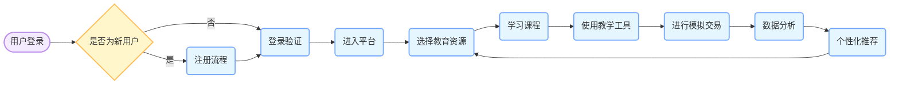

# 投资理财教育平台的集成

> 关键词：投资理财教育平台、平台集成、教育资源整合、技术架构、用户体验

> 摘要：本文围绕投资理财教育平台的集成展开，深入探讨了其背景、核心概念、算法原理、数学模型、实战案例、应用场景、工具资源等方面。旨在帮助开发者和从业者全面了解投资理财教育平台集成的相关知识和技术，通过对平台集成过程的详细分析，为构建高效、优质的投资理财教育平台提供技术指导和实践参考，同时也为投资者提供更好的学习和交流环境。

## 1. 背景介绍 
### 1.1 目的和范围
随着金融市场的不断发展和人们对投资理财需求的日益增长，投资理财教育变得愈发重要。投资理财教育平台的集成旨在将各种优质的教育资源、教学工具和服务进行整合，为投资者提供一站式的学习和交流平台。本文章的范围涵盖了投资理财教育平台集成的各个方面，包括核心概念、技术原理、开发实践、应用场景等，旨在为相关领域的从业者和投资者提供全面的知识和技术支持。

### 1.2 预期读者
本文的预期读者包括投资理财教育平台的开发者、软件架构师、技术管理人员、金融从业者以及对投资理财教育感兴趣的投资者。对于开发者和架构师，本文将提供详细的技术实现方案和最佳实践；对于金融从业者，本文将帮助他们了解如何利用技术手段提升投资理财教育的效果；对于投资者，本文将让他们了解投资理财教育平台的功能和优势，从而更好地选择适合自己的学习平台。

### 1.3 文档结构概述
本文将按照以下结构进行组织：首先介绍投资理财教育平台集成的背景和相关概念；接着详细阐述核心算法原理和具体操作步骤，并用Python代码进行说明；然后介绍数学模型和公式，并举例说明其应用；之后通过项目实战展示代码实际案例和详细解释；再探讨投资理财教育平台的实际应用场景；推荐相关的工具和资源；最后总结未来发展趋势与挑战，并提供常见问题解答和扩展阅读参考资料。

### 1.4 术语表
#### 1.4.1 核心术语定义
- **投资理财教育平台**：是一个集投资理财知识教学、案例分析、模拟交易、社区交流等功能于一体的在线平台，旨在帮助投资者提升投资理财能力。
- **平台集成**：将不同的软件系统、教育资源、服务等进行整合，使其能够协同工作，为用户提供统一的服务接口和体验。
- **教育资源整合**：将各种形式的投资理财教育资源，如视频课程、文档资料、在线讲座等进行收集、整理和分类，以便用户能够方便地获取和使用。

#### 1.4.2 相关概念解释
- **微服务架构**：一种将应用程序拆分成多个小型、自治的服务的架构风格，每个服务都可以独立开发、部署和扩展，通过轻量级的通信机制进行交互。在投资理财教育平台集成中，微服务架构可以提高系统的灵活性和可维护性。
- **数据湖**：一个存储原始数据的大型仓库，这些数据可以是结构化的、半结构化的或非结构化的。在投资理财教育平台中，数据湖可以存储用户的学习记录、交易数据、市场信息等，为数据分析和挖掘提供基础。

#### 1.4.3 缩略词列表
- **API**：Application Programming Interface，应用程序编程接口，用于不同软件系统之间的交互和通信。
- **SDK**：Software Development Kit，软件开发工具包，提供了一系列的工具和库，方便开发者进行软件开发。
- **AI**：Artificial Intelligence，人工智能，在投资理财教育平台中可以用于智能推荐、风险评估等功能。

## 2. 核心概念与联系 
### 核心概念原理
投资理财教育平台的集成涉及多个核心概念，主要包括教育资源管理、用户管理、教学工具集成和数据分析。

- **教育资源管理**：是平台的基础，它负责收集、存储和组织各种投资理财教育资源。这些资源可以来自不同的渠道，如专业的金融机构、教育培训机构、行业专家等。通过对资源的分类、标注和索引，用户可以方便地查找和获取所需的学习资料。
- **用户管理**：主要处理用户的注册、登录、权限管理等功能。根据用户的身份和需求，为其提供个性化的服务和学习推荐。例如，对于新手投资者，可以推荐基础的投资理财课程；对于有一定经验的投资者，可以提供高级的投资策略分析和案例研究。
- **教学工具集成**：将各种教学工具，如在线视频播放器、模拟交易系统、在线测试等集成到平台中，为用户提供多样化的学习方式。通过模拟交易系统，用户可以在不投入实际资金的情况下，体验真实的投资过程，提高投资技能。
- **数据分析**：通过对用户的学习行为、交易记录等数据进行分析，了解用户的需求和偏好，为平台的优化和个性化服务提供支持。例如，根据用户的学习进度和成绩，为其推荐合适的后续课程；根据用户的交易习惯和风险偏好，提供个性化的投资建议。

### 架构的文本示意图
```plaintext
投资理财教育平台集成架构

|-------------------|
|  用户界面层       |
|  （Web/移动应用） |
|-------------------|
|  应用服务层       |
|  - 教育资源管理服务 |
|  - 用户管理服务    |
|  - 教学工具服务    |
|  - 数据分析服务    |
|-------------------|
|  数据存储层       |
|  - 数据库（关系型/非关系型） |
|  - 数据湖         |
|-------------------|
|  基础设施层       |
|  - 服务器         |
|  - 网络           |
|  - 存储设备       |
|-------------------|
```

### Mermaid 流程图


## 3. 核心算法原理 & 具体操作步骤 
### 核心算法原理
在投资理财教育平台集成中，有几个核心算法起着重要作用，下面分别介绍。

#### 智能推荐算法
智能推荐算法的目的是根据用户的历史行为和偏好，为其推荐合适的教育资源和投资策略。常用的推荐算法有基于内容的推荐算法和协同过滤算法。

基于内容的推荐算法通过分析教育资源的内容特征和用户的历史学习记录，找出与用户兴趣相关的资源。例如，对于一篇关于股票投资的文章，提取其中的关键词，如“股票分析”、“基本面分析”、“技术分析”等，然后根据用户的历史学习记录中对这些关键词的关注程度，为用户推荐相关的文章。

协同过滤算法则通过分析用户之间的相似性，为用户推荐其他相似用户喜欢的资源。例如，如果用户A和用户B在历史学习记录中有很多相同的课程，那么当用户A学习了一门新的课程时，可以将这门课程推荐给用户B。

#### 风险评估算法
风险评估算法用于评估用户的投资风险承受能力。通过收集用户的个人信息、财务状况、投资经验等数据，建立风险评估模型。常用的风险评估模型有基于问卷调查的模型和基于机器学习的模型。

基于问卷调查的模型通过让用户填写一份关于风险偏好的问卷，根据问卷的答案计算用户的风险承受能力得分。例如，问卷中可能会询问用户对投资损失的容忍程度、投资期限等问题，根据用户的回答给出相应的得分。

基于机器学习的模型则通过对大量的用户数据进行训练，建立风险评估模型。例如，使用逻辑回归、决策树等算法，根据用户的个人信息、财务状况、投资经验等数据预测用户的风险承受能力。

### 具体操作步骤及Python源代码
#### 基于内容的推荐算法实现
```python
import pandas as pd
from sklearn.feature_extraction.text import TfidfVectorizer
from sklearn.metrics.pairwise import cosine_similarity

# 假设有一个教育资源数据集，包含资源ID和资源内容
resources = [
    {"id": 1, "content": "股票投资的基本面分析方法"},
    {"id": 2, "content": "基金投资的风险控制策略"},
    {"id": 3, "content": "债券投资的收益计算方法"},
    {"id": 4, "content": "股票投资的技术分析指标"}
]

# 将数据集转换为DataFrame
df = pd.DataFrame(resources)

# 使用TF-IDF向量器对资源内容进行特征提取
vectorizer = TfidfVectorizer()
tfidf_matrix = vectorizer.fit_transform(df['content'])

# 假设用户的历史学习记录为“股票投资的基本面分析”
user_history = "股票投资的基本面分析"
user_vector = vectorizer.transform([user_history])

# 计算用户历史记录与所有资源的余弦相似度
similarities = cosine_similarity(user_vector, tfidf_matrix)

# 获取相似度最高的资源ID
top_resource_index = similarities.argmax()
top_resource_id = df.iloc[top_resource_index]['id']

print(f"推荐的资源ID为: {top_resource_id}")
```

#### 基于问卷调查的风险评估算法实现
```python
# 假设有一个风险评估问卷，包含问题和对应的得分
questionnaire = [
    {"question": "您对投资损失的容忍程度是？", "options": ["很低", "低", "中等", "高", "很高"], "scores": [1, 2, 3, 4, 5]},
    {"question": "您的投资期限是？", "options": ["1年以内", "1 - 3年", "3 - 5年", "5年以上"], "scores": [1, 2, 3, 4]}
]

# 模拟用户的回答
user_answers = ["中等", "3 - 5年"]

# 计算用户的风险承受能力得分
total_score = 0
for i, answer in enumerate(user_answers):
    option_index = questionnaire[i]['options'].index(answer)
    score = questionnaire[i]['scores'][option_index]
    total_score += score

print(f"用户的风险承受能力得分为: {total_score}")
```

## 4. 数学模型和公式 & 详细讲解 & 举例说明 
### 智能推荐算法的数学模型和公式
#### TF-IDF（词频 - 逆文档频率）
TF-IDF是一种用于信息检索与文本挖掘的常用加权技术。TF-IDF值由词频（TF）和逆文档频率（IDF）相乘得到。

词频（TF）表示某个词在文档中出现的频率，计算公式为：
$$TF_{t,d}=\frac{f_{t,d}}{\sum_{t' \in d} f_{t',d}}$$
其中，$f_{t,d}$ 表示词 $t$ 在文档 $d$ 中出现的次数，$\sum_{t' \in d} f_{t',d}$ 表示文档 $d$ 中所有词的出现次数之和。

逆文档频率（IDF）表示某个词在整个文档集合中的普遍重要性，计算公式为：
$$IDF_{t}=\log\frac{N}{n_{t}+1}$$
其中，$N$ 表示文档集合中的文档总数，$n_{t}$ 表示包含词 $t$ 的文档数。

TF-IDF值的计算公式为：
$$TF - IDF_{t,d}=TF_{t,d} \times IDF_{t}$$

举例说明：假设有一个文档集合包含3篇文档，分别为 $d_1$、$d_2$、$d_3$，词 $t$ 在 $d_1$ 中出现了2次，$d_1$ 中总共有10个词；在整个文档集合中，包含词 $t$ 的文档有2篇。则词 $t$ 在 $d_1$ 中的TF-IDF值计算如下：
- 词频（TF）：$TF_{t,d_1}=\frac{2}{10}=0.2$
- 逆文档频率（IDF）：$IDF_{t}=\log\frac{3}{2 + 1}=\log1 = 0$
- TF-IDF值：$TF - IDF_{t,d_1}=0.2 \times 0 = 0$

#### 余弦相似度
余弦相似度用于衡量两个向量之间的相似程度，计算公式为：
$$\cos(\theta)=\frac{\mathbf{A} \cdot \mathbf{B}}{\|\mathbf{A}\| \|\mathbf{B}\|}$$
其中，$\mathbf{A}$ 和 $\mathbf{B}$ 是两个向量，$\mathbf{A} \cdot \mathbf{B}$ 是它们的点积，$\|\mathbf{A}\|$ 和 $\|\mathbf{B}\|$ 分别是它们的模。

举例说明：假设有两个向量 $\mathbf{A}=(1, 2, 3)$ 和 $\mathbf{B}=(2, 4, 6)$，则它们的余弦相似度计算如下：
- 点积：$\mathbf{A} \cdot \mathbf{B}=1\times2 + 2\times4 + 3\times6 = 2 + 8 + 18 = 28$
- 模：$\|\mathbf{A}\|=\sqrt{1^2 + 2^2 + 3^2}=\sqrt{1 + 4 + 9}=\sqrt{14}$，$\|\mathbf{B}\|=\sqrt{2^2 + 4^2 + 6^2}=\sqrt{4 + 16 + 36}=\sqrt{56}=2\sqrt{14}$
- 余弦相似度：$\cos(\theta)=\frac{28}{\sqrt{14} \times 2\sqrt{14}}=\frac{28}{2\times14}=1$

### 风险评估算法的数学模型和公式
#### 线性加权模型
在基于问卷调查的风险评估算法中，通常使用线性加权模型来计算用户的风险承受能力得分。假设问卷中有 $n$ 个问题，每个问题的得分分别为 $s_1, s_2, \cdots, s_n$，对应的权重分别为 $w_1, w_2, \cdots, w_n$，则用户的风险承受能力得分 $S$ 计算公式为：
$$S=\sum_{i = 1}^{n} w_i s_i$$
其中，$\sum_{i = 1}^{n} w_i = 1$。

举例说明：假设问卷中有3个问题，权重分别为 $w_1 = 0.3$，$w_2 = 0.4$，$w_3 = 0.3$，用户在这3个问题上的得分分别为 $s_1 = 2$，$s_2 = 3$，$s_3 = 4$，则用户的风险承受能力得分计算如下：
$$S = 0.3\times2 + 0.4\times3 + 0.3\times4 = 0.6 + 1.2 + 1.2 = 3$$

## 5. 项目实战：代码实际案例和详细解释说明 
### 5.1  开发环境搭建
#### 后端开发环境
- **编程语言**：Python 3.8 及以上版本
- **Web框架**：Django 或 Flask，这里以 Flask 为例
- **数据库**：MySQL 或 PostgreSQL，这里以 MySQL 为例
- **开发工具**：PyCharm 或 VS Code

#### 前端开发环境
- **编程语言**：HTML、CSS、JavaScript
- **前端框架**：Vue.js 或 React.js，这里以 Vue.js 为例
- **构建工具**：Vue CLI

#### 环境搭建步骤
1. **安装 Python**：从 Python 官方网站下载并安装 Python 3.8 及以上版本。
2. **安装 Flask**：使用 pip 命令安装 Flask：`pip install flask`
3. **安装 MySQL**：从 MySQL 官方网站下载并安装 MySQL 数据库。
4. **安装 MySQL 驱动**：使用 pip 命令安装 MySQL 驱动：`pip install mysql-connector-python`
5. **安装 Vue CLI**：使用 npm 命令安装 Vue CLI：`npm install -g @vue/cli`

### 5.2  源代码详细实现和代码解读
#### 后端代码实现（Flask）
```python
from flask import Flask, jsonify, request
import mysql.connector

app = Flask(__name__)

# 数据库连接配置
db_config = {
    'user': 'root',
    'password': 'password',
    'host': 'localhost',
    'database': 'investment_education'
}

# 连接数据库
def get_db_connection():
    return mysql.connector.connect(**db_config)

# 获取所有教育资源
@app.route('/resources', methods=['GET'])
def get_resources():
    conn = get_db_connection()
    cursor = conn.cursor(dictionary=True)
    cursor.execute('SELECT * FROM resources')
    resources = cursor.fetchall()
    cursor.close()
    conn.close()
    return jsonify(resources)

# 添加新的教育资源
@app.route('/resources', methods=['POST'])
def add_resource():
    data = request.get_json()
    title = data.get('title')
    content = data.get('content')
    conn = get_db_connection()
    cursor = conn.cursor()
    cursor.execute('INSERT INTO resources (title, content) VALUES (%s, %s)', (title, content))
    conn.commit()
    cursor.close()
    conn.close()
    return jsonify({'message': 'Resource added successfully'})

if __name__ == '__main__':
    app.run(debug=True)
```
代码解读：
- `get_db_connection` 函数用于建立与 MySQL 数据库的连接。
- `get_resources` 路由用于获取所有教育资源，通过执行 SQL 查询语句从数据库中获取资源信息，并以 JSON 格式返回。
- `add_resource` 路由用于添加新的教育资源，通过获取前端传递的 JSON 数据，将资源信息插入到数据库中。

#### 前端代码实现（Vue.js）
```vue
<template>
  <div>
    <h1>投资理财教育资源</h1>
    <button @click="addResource">添加资源</button>
    <ul>
      <li v-for="resource in resources" :key="resource.id">
        {{ resource.title }}
      </li>
    </ul>
    <div v-if="showAddForm">
      <input v-model="newResourceTitle" placeholder="标题">
      <input v-model="newResourceContent" placeholder="内容">
      <button @click="saveResource">保存</button>
      <button @click="cancelAdd">取消</button>
    </div>
  </div>
</template>

<script>
export default {
  data() {
    return {
      resources: [],
      showAddForm: false,
      newResourceTitle: '',
      newResourceContent: ''
    };
  },
  mounted() {
    this.fetchResources();
  },
  methods: {
    fetchResources() {
      fetch('/resources')
       .then(response => response.json())
       .then(data => {
          this.resources = data;
        });
    },
    addResource() {
      this.showAddForm = true;
    },
    saveResource() {
      const data = {
        title: this.newResourceTitle,
        content: this.newResourceContent
      };
      fetch('/resources', {
        method: 'POST',
        headers: {
          'Content-Type': 'application/json'
        },
        body: JSON.stringify(data)
      })
     .then(response => response.json())
     .then(result => {
        console.log(result);
        this.showAddForm = false;
        this.newResourceTitle = '';
        this.newResourceContent = '';
        this.fetchResources();
      });
    },
    cancelAdd() {
      this.showAddForm = false;
      this.newResourceTitle = '';
      this.newResourceContent = '';
    }
  }
};
</script>
```
代码解读：
- `fetchResources` 方法用于从后端获取所有教育资源，并将其存储在 `resources` 数组中。
- `addResource` 方法用于显示添加资源的表单。
- `saveResource` 方法用于将新资源信息发送到后端，并在保存成功后更新资源列表。
- `cancelAdd` 方法用于取消添加资源的操作。

### 5.3  代码解读与分析
#### 后端代码分析
- **数据库连接管理**：通过 `get_db_connection` 函数封装数据库连接操作，提高代码的可维护性和复用性。
- **路由设计**：使用 Flask 的路由机制，将不同的 HTTP 请求映射到相应的处理函数，实现资源的增删改查操作。
- **错误处理**：在实际项目中，需要添加错误处理机制，如捕获数据库连接异常、SQL 执行异常等，以提高系统的健壮性。

#### 前端代码分析
- **数据绑定**：使用 Vue.js 的数据绑定特性，将表单输入框的值与 `data` 中的变量进行绑定，方便数据的获取和更新。
- **生命周期钩子**：在 `mounted` 钩子中调用 `fetchResources` 方法，确保页面加载时自动获取资源信息。
- **异步请求**：使用 `fetch` API 发送异步请求，与后端进行数据交互，避免页面刷新，提高用户体验。

## 6. 实际应用场景 
### 投资者教育
投资理财教育平台可以为广大投资者提供系统的投资理财知识培训，帮助他们了解投资市场的基本规则、投资产品的特点和风险、投资策略的制定等方面的知识。通过在线视频课程、文档资料、案例分析等多种形式，投资者可以随时随地进行学习，提高自己的投资能力和风险意识。

### 金融机构员工培训
金融机构可以利用投资理财教育平台对员工进行培训，提升员工的专业素质和服务水平。例如，银行可以为客户经理提供投资理财知识培训，使其能够更好地为客户提供投资建议；证券公司可以为投资顾问提供投资分析和研究方法的培训，提高其投资咨询服务的质量。

### 高校金融专业教学
高校的金融专业可以将投资理财教育平台作为教学辅助工具，丰富教学内容和形式。教师可以在平台上发布教学资料、布置作业、组织在线讨论等，学生可以通过平台进行自主学习、模拟交易和实践操作，提高学习效果和实践能力。

### 金融科技企业创新服务
金融科技企业可以基于投资理财教育平台开发创新的金融服务产品。例如，通过智能推荐算法为用户提供个性化的投资组合建议；利用数据分析技术为用户提供投资风险评估和预警服务等。

## 7. 工具和资源推荐
### 7.1 学习资源推荐
#### 7.1.1 书籍推荐
- 《聪明的投资者》：本杰明·格雷厄姆著，被誉为投资界的圣经，介绍了价值投资的理念和方法。
- 《金融炼金术》：乔治·索罗斯著，深入探讨了金融市场的运行规律和投资策略。
- 《小狗钱钱》：博多·舍费尔著，是一本适合初学者的投资理财启蒙书籍，以故事的形式介绍了投资理财的基本知识。

#### 7.1.2 在线课程
- Coursera 上的“投资学原理”：由知名高校的教授授课，系统介绍了投资学的基本理论和方法。
- 网易云课堂上的“投资理财实战课程”：结合实际案例，讲解了股票、基金、债券等投资产品的投资技巧。
- 中国大学 MOOC 上的“金融市场与金融机构”：帮助学习者了解金融市场的结构和运行机制。

#### 7.1.3 技术博客和网站
- InfoQ：提供了丰富的技术文章和行业资讯，涵盖了软件开发、大数据、人工智能等多个领域。
- 开源中国：关注开源技术和开源项目，为开发者提供了交流和学习的平台。
- 知乎：有很多关于投资理财和技术开发的优质问答和文章，可以拓宽知识面。

### 7.2 开发工具框架推荐
#### 7.2.1 IDE和编辑器
- PyCharm：是一款专门为 Python 开发设计的集成开发环境，具有代码自动补全、调试、版本控制等功能。
- Visual Studio Code：是一款轻量级的代码编辑器，支持多种编程语言，拥有丰富的插件生态系统。
- WebStorm：是一款专业的前端开发工具，对 HTML、CSS、JavaScript 等前端技术有很好的支持。

#### 7.2.2 调试和性能分析工具
- Chrome DevTools：是 Chrome 浏览器自带的调试工具，可用于调试前端代码、分析页面性能等。
- Py-Spy：是一个用于分析 Python 程序性能的工具，可以找出程序中的性能瓶颈。
- MySQL Workbench：是 MySQL 官方提供的数据库管理和开发工具，可用于数据库的设计、开发和调试。

#### 7.2.3 相关框架和库
- Flask：是一个轻量级的 Python Web 框架，适合快速开发小型 Web 应用。
- Django：是一个功能强大的 Python Web 框架，提供了丰富的插件和工具，适合开发大型 Web 应用。
- Vue.js：是一个渐进式的 JavaScript 前端框架，易于学习和使用，可用于构建用户界面。

### 7.3 相关论文著作推荐
#### 7.3.1 经典论文
- 《资本资产定价模型：市场均衡的理论》：威廉·夏普著，提出了资本资产定价模型（CAPM），对现代金融理论的发展产生了深远影响。
- 《有效资本市场：理论与实证研究回顾》：尤金·法玛著，阐述了有效市场假说，是金融市场研究的重要理论基础。

#### 7.3.2 最新研究成果
- 《人工智能在金融风险管理中的应用研究》：探讨了人工智能技术在金融风险管理中的应用前景和挑战。
- 《区块链技术在金融领域的应用与发展》：分析了区块链技术在金融领域的应用场景和发展趋势。

#### 7.3.3 应用案例分析
- 《国外投资理财教育平台的发展模式与启示》：介绍了国外一些成功的投资理财教育平台的发展模式和经验教训。
- 《某金融机构利用大数据提升投资理财服务质量的案例分析》：分析了某金融机构如何利用大数据技术提升投资理财服务的质量和效率。

## 8. 总结：未来发展趋势与挑战
### 未来发展趋势
#### 智能化发展
随着人工智能技术的不断发展，投资理财教育平台将越来越智能化。智能推荐算法将更加精准地为用户推荐适合的教育资源和投资策略；智能客服将能够实时解答用户的问题，提供个性化的服务；智能投顾将为用户提供更加专业和个性化的投资组合建议。

#### 移动化普及
移动互联网的普及使得人们越来越倾向于通过移动设备进行学习和投资。未来，投资理财教育平台将更加注重移动端的开发和优化，提供更加便捷、流畅的移动学习和投资体验。

#### 多元化服务
投资理财教育平台将不再局限于单纯的知识教学，而是会提供更加多元化的服务。例如，增加社交功能，让用户可以与其他投资者交流经验和心得；提供投资咨询服务，为用户解决投资过程中遇到的问题；开展线上线下相结合的培训活动，提高用户的学习效果。

#### 国际化合作
随着金融市场的全球化发展，投资理财教育平台将加强国际合作。引进国外优质的教育资源和先进的投资理念，为用户提供更加国际化的学习和投资环境；与国外的金融机构和教育机构开展合作，共同开发课程和服务，提升平台的国际影响力。

### 挑战
#### 数据安全和隐私保护
投资理财教育平台涉及大量用户的个人信息和投资数据，数据安全和隐私保护是至关重要的。平台需要采取有效的技术手段和管理措施，确保用户数据的安全和隐私，防止数据泄露和滥用。

#### 技术更新换代快
信息技术的发展日新月异，投资理财教育平台需要不断跟进技术的更新换代，采用新的技术和框架来提升平台的性能和用户体验。这对平台的开发和维护团队提出了更高的要求，需要不断学习和掌握新的技术知识。

#### 教育质量参差不齐
市场上的投资理财教育资源质量参差不齐，平台需要对教育资源进行严格的筛选和审核，确保提供给用户的是高质量、专业的教育内容。同时，需要建立有效的评价机制，对教育资源和教师的教学质量进行评估和反馈，不断提高教育质量。

#### 法律法规监管
投资理财教育涉及金融领域，需要遵守相关的法律法规和监管要求。平台需要了解和掌握相关的法律法规，确保平台的运营和服务符合规定，避免法律风险。

## 9. 附录：常见问题与解答
### 1. 投资理财教育平台集成需要具备哪些技术能力？
投资理财教育平台集成需要具备多种技术能力，包括前端开发技术（如 HTML、CSS、JavaScript、前端框架）、后端开发技术（如 Python、Java、Web 框架）、数据库管理技术（如 MySQL、PostgreSQL）、数据分析技术（如 Python 数据分析库）、人工智能技术（如机器学习算法）等。

### 2. 如何确保投资理财教育平台的安全性？
确保投资理财教育平台的安全性可以从以下几个方面入手：
- **数据加密**：对用户的敏感信息（如密码、身份证号等）进行加密存储和传输，防止数据泄露。
- **访问控制**：设置不同的用户权限，对不同的功能和数据进行访问控制，防止非法访问。
- **安全审计**：记录用户的操作日志，定期进行安全审计，及时发现和处理安全隐患。
- **网络安全防护**：部署防火墙、入侵检测系统等网络安全设备，防止网络攻击。

### 3. 投资理财教育平台的盈利模式有哪些？
投资理财教育平台的盈利模式主要有以下几种：
- **课程收费**：对优质的课程收取费用，用户需要付费才能学习。
- **会员服务**：提供会员制度，会员可以享受更多的服务和特权，如专属课程、投资咨询等，收取会员费用。
- **广告收入**：在平台上展示广告，根据广告的展示次数或点击次数收取广告费用。
- **合作分成**：与金融机构合作，为其推荐客户，根据客户的投资金额或交易手续费收取合作分成。

### 4. 如何提高投资理财教育平台的用户体验？
提高投资理财教育平台的用户体验可以从以下几个方面入手：
- **界面设计**：设计简洁、美观、易用的界面，方便用户操作和查找信息。
- **个性化服务**：根据用户的兴趣和需求，为其提供个性化的课程推荐、投资建议等服务。
- **学习体验优化**：提供丰富的学习资源和多样化的学习方式，如视频课程、在线测试、模拟交易等，提高学习效果。
- **客户服务**：建立完善的客户服务体系，及时解答用户的问题和处理用户的投诉，提高用户满意度。

## 10. 扩展阅读 & 参考资料
### 扩展阅读
- 《金融科技前沿：技术驱动的金融创新》：深入探讨了金融科技的发展趋势和应用场景，为投资理财教育平台的创新发展提供了思路。
- 《数字化转型：企业的机遇与挑战》：介绍了企业数字化转型的方法和策略，对投资理财教育平台的数字化建设有一定的借鉴意义。

### 参考资料
- 《Python 数据分析实战》：提供了 Python 数据分析的详细教程和案例，对投资理财教育平台的数据分析功能开发有帮助。
- 《Flask Web 开发实战》：介绍了 Flask 框架的使用方法和开发技巧，是开发投资理财教育平台后端的重要参考资料。
- 《Vue.js 权威指南》：全面介绍了 Vue.js 框架的原理和应用，对开发投资理财教育平台的前端界面有指导作用。

作者：AI天才研究院/AI Genius Institute & 禅与计算机程序设计艺术 /Zen And The Art of Computer Programming