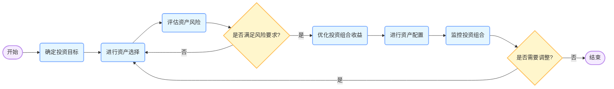

# 投资组合管理

> 关键词：投资组合管理、资产配置、风险评估、收益优化、多元化投资

> 摘要：本文深入探讨了投资组合管理的相关知识。从背景介绍出发，阐述了投资组合管理的目的、适用读者群体等内容。详细讲解了核心概念、算法原理、数学模型等理论知识，并通过Python代码进行了算法实现的阐述。结合实际项目案例，对开发环境搭建、代码实现与解读进行了说明。分析了投资组合管理在不同场景下的实际应用，推荐了相关的学习资源、开发工具和论文著作。最后对投资组合管理的未来发展趋势与挑战进行了总结，并提供了常见问题解答和扩展阅读参考资料，旨在为投资者和相关从业者提供全面、深入的投资组合管理知识体系。

## 1. 背景介绍 
### 1.1 目的和范围
投资组合管理的主要目的是在风险和收益之间找到平衡，通过合理配置资产，实现投资者的财务目标。它涵盖了多种资产类别，如股票、债券、基金、大宗商品等，通过对这些资产的选择和组合，降低单一资产的风险，提高整体投资的稳定性和收益水平。其范围不仅包括个人投资者的资产配置，还涉及机构投资者（如养老基金、保险公司等）的大规模资金管理。

### 1.2 预期读者
本文预期读者包括个人投资者，他们希望通过合理的投资组合管理实现资产的增值和风险控制；金融从业者，如投资顾问、基金经理等，可借助本文进一步深化对投资组合管理的理解和应用；以及金融专业的学生，作为学习投资组合管理理论和实践的参考资料。

### 1.3 文档结构概述
本文首先介绍投资组合管理的背景信息，包括目的、读者群体和文档结构等。接着阐述核心概念及其联系，展示相关的文本示意图和Mermaid流程图。然后讲解核心算法原理和具体操作步骤，通过Python代码进行详细说明。之后介绍数学模型和公式，并举例说明其应用。通过项目实战，展示代码实际案例并进行详细解释。分析投资组合管理的实际应用场景，推荐相关的工具和资源。最后总结未来发展趋势与挑战，提供常见问题解答和扩展阅读参考资料。

### 1.4 术语表
#### 1.4.1 核心术语定义
- **投资组合**：由多种资产组成的集合，投资者通过持有不同的资产来分散风险和实现收益目标。
- **资产配置**：将资金分配到不同资产类别（如股票、债券、现金等）的过程，以达到风险和收益的平衡。
- **风险评估**：对投资组合可能面临的风险进行分析和度量，常用的指标包括标准差、贝塔系数等。
- **收益优化**：通过调整投资组合中资产的权重，使投资组合在给定风险水平下实现最大收益。
- **多元化投资**：投资于多种不同类型的资产，以降低单一资产波动对投资组合的影响。

#### 1.4.2 相关概念解释
- **有效前沿**：在风险和收益坐标系中，由所有有效投资组合构成的曲线。有效投资组合是指在给定风险水平下具有最高预期收益，或在给定预期收益下具有最低风险的投资组合。
- **夏普比率**：衡量投资组合每承担一单位总风险，会产生多少的超额报酬。其计算公式为：$夏普比率 = \frac{投资组合预期收益率 - 无风险收益率}{投资组合收益率的标准差}$。
- **资本资产定价模型（CAPM）**：描述了资产的预期收益率与市场风险之间的关系，公式为：$E(R_i) = R_f+\beta_i\times[E(R_m)-R_f]$，其中$E(R_i)$是资产$i$的预期收益率，$R_f$是无风险收益率，$\beta_i$是资产$i$的贝塔系数，$E(R_m)$是市场组合的预期收益率。

#### 1.4.3 缩略词列表
- **CAPM**：Capital Asset Pricing Model，资本资产定价模型
- **ETF**：Exchange-Traded Fund，交易型开放式指数基金
- **VAR**：Value at Risk，风险价值

## 2. 核心概念与联系 
### 核心概念原理
投资组合管理的核心原理基于现代投资组合理论（Modern Portfolio Theory，MPT），该理论由哈里·马科维茨（Harry Markowitz）于1952年提出。其核心思想是通过多元化投资降低非系统性风险，即通过投资多种不同的资产，使得个别资产的波动相互抵消，从而降低整个投资组合的风险。

投资者在进行投资决策时，不仅要考虑资产的预期收益，还要考虑资产之间的相关性。资产之间的相关性越低，通过多元化投资降低风险的效果就越好。例如，当股票市场下跌时，如果投资组合中包含一些与股票市场相关性较低的资产（如债券），那么债券的表现可能相对稳定，从而缓冲股票市场下跌对投资组合的影响。

### 架构的文本示意图
```plaintext
投资组合管理
|-- 资产选择
|   |-- 股票
|   |-- 债券
|   |-- 基金
|   |-- 大宗商品
|-- 风险评估
|   |-- 标准差
|   |-- 贝塔系数
|   |-- 风险价值（VAR）
|-- 收益优化
|   |-- 有效前沿
|   |-- 夏普比率
|-- 资产配置
|   |-- 战略资产配置
|   |-- 战术资产配置
```

### Mermaid流程图


## 3. 核心算法原理 & 具体操作步骤 
### 核心算法原理
#### 均值 - 方差模型
均值 - 方差模型是现代投资组合理论的核心算法，其目标是在给定预期收益下最小化投资组合的风险（方差），或在给定风险水平下最大化投资组合的预期收益。

设投资组合中包含$n$种资产，资产$i$的预期收益率为$E(R_i)$，投资组合中资产$i$的权重为$w_i$，且$\sum_{i = 1}^{n}w_i = 1$。投资组合的预期收益率$E(R_p)$为：

$$E(R_p)=\sum_{i = 1}^{n}w_i\times E(R_i)$$

投资组合的方差$\sigma_p^2$为：

$$\sigma_p^2=\sum_{i = 1}^{n}\sum_{j = 1}^{n}w_i\times w_j\times\sigma_{ij}$$

其中$\sigma_{ij}$是资产$i$和资产$j$的协方差。

### 具体操作步骤
1. **数据收集**：收集每种资产的历史收益率数据，用于计算预期收益率和协方差矩阵。
2. **计算预期收益率和协方差矩阵**：根据历史收益率数据，计算每种资产的预期收益率和资产之间的协方差矩阵。
3. **设定目标**：确定投资组合的目标，如最大化预期收益或最小化风险。
4. **优化求解**：使用优化算法（如二次规划）求解投资组合中各资产的最优权重。

### Python源代码实现
```python
import numpy as np
from scipy.optimize import minimize

# 示例数据：假设有3种资产
expected_returns = np.array([0.1, 0.15, 0.2])  # 预期收益率
cov_matrix = np.array([[0.04, 0.02, 0.01],
                       [0.02, 0.09, 0.03],
                       [0.01, 0.03, 0.16]])  # 协方差矩阵

# 定义目标函数：最小化投资组合的方差
def portfolio_variance(weights, cov_matrix):
    return np.dot(weights.T, np.dot(cov_matrix, weights))

# 定义约束条件：权重之和为1
constraints = ({'type': 'eq', 'fun': lambda x: np.sum(x) - 1})

# 定义边界条件：权重范围在0到1之间
bounds = [(0, 1) for _ in range(len(expected_returns))]

# 初始权重猜测
initial_weights = np.ones(len(expected_returns)) / len(expected_returns)

# 求解最优权重
result = minimize(portfolio_variance, initial_weights, args=(cov_matrix,),
                  method='SLSQP', bounds=bounds, constraints=constraints)

optimal_weights = result.x
print("最优权重:", optimal_weights)
```

## 4. 数学模型和公式 & 详细讲解 & 举例说明 
### 均值 - 方差模型详细讲解
均值 - 方差模型通过同时考虑投资组合的预期收益和风险（方差），帮助投资者找到最优的资产配置方案。其核心思想是在风险和收益之间进行权衡，使得投资者在可接受的风险水平下获得最大的预期收益。

在上述公式中，投资组合的预期收益率$E(R_p)$是各资产预期收益率的加权平均值，权重为各资产在投资组合中的占比。投资组合的方差$\sigma_p^2$则考虑了资产之间的协方差，反映了资产之间的相互关系对投资组合风险的影响。

### 举例说明
假设有两种资产$A$和$B$，资产$A$的预期收益率为$E(R_A)=0.1$，标准差为$\sigma_A = 0.2$；资产$B$的预期收益率为$E(R_B)=0.15$，标准差为$\sigma_B = 0.3$。两种资产的相关系数为$\rho_{AB}=0.5$。

首先计算协方差：

$$\sigma_{AB}=\rho_{AB}\times\sigma_A\times\sigma_B = 0.5\times0.2\times0.3 = 0.03$$

设投资组合中资产$A$的权重为$w_A$，资产$B$的权重为$w_B = 1 - w_A$。

投资组合的预期收益率为：

$$E(R_p)=w_A\times E(R_A)+w_B\times E(R_B)=w_A\times0.1+(1 - w_A)\times0.15 = 0.15 - 0.05w_A$$

投资组合的方差为：

$$\sigma_p^2=w_A^2\times\sigma_A^2+w_B^2\times\sigma_B^2+2\times w_A\times w_B\times\sigma_{AB}$$

$$=w_A^2\times0.04+(1 - w_A)^2\times0.09+2\times w_A\times(1 - w_A)\times0.03$$

假设我们希望在预期收益率为$0.12$的情况下最小化投资组合的风险。则有：

$$0.12 = 0.15 - 0.05w_A$$

解得$w_A = 0.6$，$w_B = 0.4$。

将$w_A = 0.6$，$w_B = 0.4$代入方差公式，可得：

$$\sigma_p^2=0.6^2\times0.04+0.4^2\times0.09+2\times0.6\times0.4\times0.03 = 0.036$$


## 5. 项目实战：代码实际案例和详细解释说明 
### 5.1  开发环境搭建
#### 安装Python
首先需要安装Python环境，建议使用Python 3.7及以上版本。可以从Python官方网站（https://www.python.org/downloads/）下载并安装适合自己操作系统的Python版本。

#### 安装必要的库
在命令行中使用以下命令安装必要的库：
```sh
pip install numpy pandas scipy matplotlib yfinance
```
- `numpy`：用于数值计算。
- `pandas`：用于数据处理和分析。
- `scipy`：用于优化求解。
- `matplotlib`：用于数据可视化。
- `yfinance`：用于获取金融数据。

### 5.2  源代码详细实现和代码解读
```python
import yfinance as yf
import numpy as np
import pandas as pd
from scipy.optimize import minimize
import matplotlib.pyplot as plt

# 定义要分析的股票代码
tickers = ['AAPL', 'MSFT', 'GOOG', 'AMZN']

# 获取股票数据
data = yf.download(tickers, start='2020-01-01', end='2023-01-01')['AdjClose']

# 计算每日收益率
returns = data.pct_change().dropna()

# 计算预期收益率和协方差矩阵
expected_returns = returns.mean() * 252  # 年化预期收益率
cov_matrix = returns.cov() * 252  # 年化协方差矩阵

# 定义目标函数：最小化投资组合的方差
def portfolio_variance(weights, cov_matrix):
    return np.dot(weights.T, np.dot(cov_matrix, weights))

# 定义约束条件：权重之和为1
constraints = ({'type': 'eq', 'fun': lambda x: np.sum(x) - 1})

# 定义边界条件：权重范围在0到1之间
bounds = [(0, 1) for _ in range(len(expected_returns))]

# 初始权重猜测
initial_weights = np.ones(len(expected_returns)) / len(expected_returns)

# 求解最优权重
result = minimize(portfolio_variance, initial_weights, args=(cov_matrix,),
                  method='SLSQP', bounds=bounds, constraints=constraints)

optimal_weights = result.x

# 计算最优投资组合的预期收益率和标准差
optimal_return = np.dot(optimal_weights, expected_returns)
optimal_std = np.sqrt(portfolio_variance(optimal_weights, cov_matrix))

print("最优权重:", optimal_weights)
print("最优投资组合预期收益率:", optimal_return)
print("最优投资组合标准差:", optimal_std)

# 可视化有效前沿
num_portfolios = 10000
all_weights = np.zeros((num_portfolios, len(expected_returns)))
ret_arr = np.zeros(num_portfolios)
std_arr = np.zeros(num_portfolios)

for i in range(num_portfolios):
    weights = np.random.random(len(expected_returns))
    weights = weights / np.sum(weights)
    all_weights[i, :] = weights
    ret_arr[i] = np.dot(weights, expected_returns)
    std_arr[i] = np.sqrt(portfolio_variance(weights, cov_matrix))

plt.figure(figsize=(12, 8))
plt.scatter(std_arr, ret_arr, c=ret_arr / std_arr, cmap='viridis')
plt.colorbar(label='夏普比率')
plt.scatter(optimal_std, optimal_return, c='red', s=50, edgecolors='k')
plt.xlabel('标准差')
plt.ylabel('预期收益率')
plt.title('有效前沿')
plt.show()
```

### 5.3  代码解读与分析
1. **数据获取**：使用`yfinance`库从雅虎财经获取指定股票的历史调整收盘价数据，并计算每日收益率。
2. **参数计算**：根据每日收益率计算年化预期收益率和年化协方差矩阵。
3. **目标函数定义**：定义目标函数`portfolio_variance`，用于计算投资组合的方差。
4. **约束条件和边界条件**：设置权重之和为1的约束条件，以及权重范围在0到1之间的边界条件。
5. **优化求解**：使用`scipy.optimize.minimize`函数求解最优权重。
6. **结果计算**：计算最优投资组合的预期收益率和标准差。
7. **可视化**：通过随机生成大量投资组合，绘制有效前沿，并标记出最优投资组合的位置。

## 6. 实际应用场景 
### 个人投资者
个人投资者可以使用投资组合管理方法来规划自己的资产配置。例如，一位年轻的投资者可能有较长的投资期限和较高的风险承受能力，他可以将大部分资金投资于股票市场，以追求较高的长期收益。同时，为了降低风险，他可以适当配置一些债券或其他固定收益类资产。随着年龄的增长，投资者的风险承受能力可能会下降，此时可以逐渐增加债券等低风险资产的比例。

### 机构投资者
- **养老基金**：养老基金需要确保资金的长期稳定增值，以满足未来养老金支付的需求。通过投资组合管理，养老基金可以将资金分散投资于股票、债券、房地产等多种资产，根据市场情况和基金的风险偏好进行动态调整。
- **保险公司**：保险公司需要平衡资产的安全性和收益性。在投资组合管理中，保险公司通常会将大部分资金投资于债券等固定收益类资产，以确保资金的安全性和流动性。同时，为了提高收益，也会适当配置一些股票和其他权益类资产。

### 基金管理公司
基金管理公司通过构建不同类型的投资组合来满足不同投资者的需求。例如，股票型基金主要投资于股票市场，以追求较高的收益；债券型基金则主要投资于债券市场，以提供较为稳定的收益。基金经理需要根据市场情况和基金的投资目标，不断调整投资组合中资产的权重，以实现基金的业绩目标。

## 7. 工具和资源推荐
### 7.1 学习资源推荐
#### 7.1.1 书籍推荐
- 《投资学》（Investments），作者：滋维·博迪（Zvi Bodie）等。本书是投资学领域的经典教材，系统介绍了投资组合理论、资产定价模型、风险管理等内容。
- 《聪明的投资者》（The Intelligent Investor），作者：本杰明·格雷厄姆（Benjamin Graham）。这本书被誉为投资界的圣经，强调了价值投资的理念和方法。
- 《漫步华尔街》（A Random Walk Down Wall Street），作者：伯顿·马尔基尔（Burton Malkiel）。本书以通俗易懂的语言介绍了投资的基本原理和方法，对有效市场假说等理论进行了深入探讨。

#### 7.1.2 在线课程
- Coursera上的“投资学原理”（Principles of Investments）课程，由知名大学的教授授课，涵盖了投资组合管理的基本理论和方法。
- edX上的“金融市场”（Financial Markets）课程，由耶鲁大学的罗伯特·席勒（Robert Shiller）教授主讲，对金融市场和投资组合管理有深入的讲解。

#### 7.1.3 技术博客和网站
- 雪球（https://xueqiu.com/）：国内知名的投资社区，提供股票、基金等投资产品的分析和讨论。
- Seeking Alpha（https://seekingalpha.com/）：国外的投资研究网站，提供大量的金融分析文章和投资策略。

### 7.2 开发工具框架推荐
#### 7.2.1 IDE和编辑器
- PyCharm：功能强大的Python集成开发环境，提供代码编辑、调试、版本控制等功能。
- Jupyter Notebook：交互式笔记本，适合进行数据探索和分析，方便代码的展示和分享。

#### 7.2.2 调试和性能分析工具
- `pdb`：Python自带的调试器，可以帮助开发者定位代码中的问题。
- `cProfile`：Python的性能分析工具，可以分析代码的运行时间和函数调用情况。

#### 7.2.3 相关框架和库
- `pandas-datareader`：用于获取金融数据的Python库，支持多种数据源。
- `PyPortfolioOpt`：专门用于投资组合优化的Python库，提供了多种优化算法和工具。

### 7.3 相关论文著作推荐
#### 7.3.1 经典论文
- Markowitz, H. M. (1952). Portfolio Selection. The Journal of Finance, 7(1), 77-91. 这篇论文提出了现代投资组合理论的均值 - 方差模型，奠定了投资组合管理的理论基础。
- Sharpe, W. F. (1964). Capital Asset Prices: A Theory of Market Equilibrium Under Conditions of Risk. The Journal of Finance, 19(3), 425-442. 该论文提出了资本资产定价模型（CAPM），用于描述资产的预期收益率与市场风险之间的关系。

#### 7.3.2 最新研究成果
- 在SSRN（https://papers.ssrn.com/sol3/default.cfm）等学术平台上，可以搜索到关于投资组合管理的最新研究论文，涉及到机器学习在投资组合管理中的应用、多因子模型的改进等前沿领域。

#### 7.3.3 应用案例分析
- 《机构投资者的资产配置与投资组合管理》等书籍中包含了大量的实际应用案例，分析了不同机构投资者在不同市场环境下的投资组合管理策略。

## 8. 总结：未来发展趋势与挑战
### 未来发展趋势
- **智能化投资**：随着人工智能和机器学习技术的发展，智能化投资将成为未来投资组合管理的重要趋势。通过机器学习算法，可以对大量的金融数据进行分析和挖掘，预测市场走势，优化投资组合。
- **可持续投资**：投资者越来越关注环境、社会和治理（ESG）因素，可持续投资将成为未来投资的重要方向。投资组合管理需要考虑ESG因素对资产价格和风险的影响，将可持续发展理念融入到投资决策中。
- **全球化投资**：随着全球经济一体化的发展，投资者将更加注重全球化投资。投资组合管理需要考虑不同国家和地区的市场差异、汇率风险等因素，实现全球资产的优化配置。

### 挑战
- **数据质量和隐私问题**：智能化投资需要大量的金融数据支持，但数据质量和隐私问题是面临的重要挑战。如何确保数据的准确性、完整性和安全性，是投资组合管理需要解决的问题。
- **市场不确定性**：金融市场充满了不确定性，如宏观经济波动、政策变化、突发事件等。这些不确定性增加了投资组合管理的难度，需要投资者不断调整投资策略，以应对市场变化。
- **模型风险**：投资组合管理中使用的各种模型（如均值 - 方差模型、CAPM等）都有一定的假设条件和局限性。在实际应用中，模型可能无法准确反映市场的真实情况，导致投资决策失误。

## 9. 附录：常见问题与解答
### 问题1：投资组合管理是否适用于所有投资者？
答：投资组合管理适用于大多数投资者，但不同投资者的需求和风险承受能力不同，需要根据自身情况进行调整。例如，对于风险承受能力较低的投资者，可能更倾向于保守型的投资组合；而对于风险承受能力较高的投资者，可以适当增加股票等风险资产的比例。

### 问题2：如何确定投资组合中各资产的权重？
答：可以使用均值 - 方差模型等优化算法来确定投资组合中各资产的最优权重。在实际应用中，还需要考虑投资者的风险偏好、投资目标等因素。例如，如果投资者更注重风险控制，可以在优化过程中增加风险约束条件。

### 问题3：投资组合管理需要多长时间进行一次调整？
答：投资组合的调整频率取决于市场情况和投资者的投资策略。一般来说，短期投资者可能会更频繁地调整投资组合，以捕捉市场的短期波动；而长期投资者则可以根据市场的长期趋势，适当进行调整，如每年或每半年进行一次调整。

### 问题4：智能化投资是否会完全取代人工投资？
答：虽然智能化投资具有很多优势，但目前还无法完全取代人工投资。智能化投资主要基于历史数据和模型进行分析和决策，而金融市场充满了不确定性和复杂性，人工投资可以结合投资者的经验、直觉和对市场的理解，做出更灵活的决策。因此，未来智能化投资和人工投资可能会相互结合，共同为投资者提供更好的服务。

## 10. 扩展阅读 & 参考资料
### 扩展阅读
- 《金融炼金术》（The Alchemy of Finance），作者：乔治·索罗斯（George Soros）。本书介绍了索罗斯的投资哲学和操作方法，对投资者的思维方式有很大的启发。
- 《黑天鹅》（The Black Swan），作者：纳西姆·尼古拉斯·塔勒布（Nassim Nicholas Taleb）。本书探讨了不可预测的重大事件对金融市场的影响，提醒投资者要关注极端风险。

### 参考资料
- Bodie, Z., Kane, A., & Marcus, A. J. (2018). Investments. McGraw-Hill Education.
- Graham, B. (2003). The Intelligent Investor. HarperBusiness.
- Malkiel, B. G. (2019). A Random Walk Down Wall Street. W. W. Norton & Company.

作者：AI天才研究院/AI Genius Institute & 禅与计算机程序设计艺术 /Zen And The Art of Computer Programming