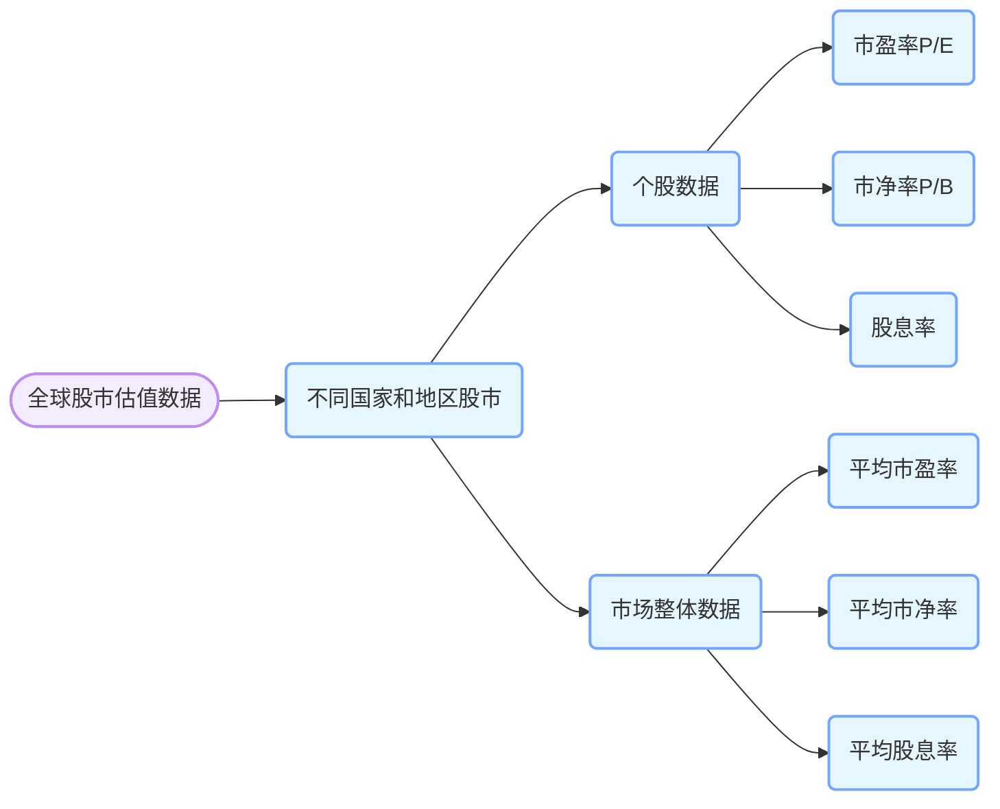

# 投资者如何利用全球股市估值数据

> 关键词：全球股市估值数据、投资者、估值指标、投资决策、风险控制

> 摘要：本文旨在深入探讨投资者如何有效利用全球股市估值数据。首先介绍了全球股市估值数据相关的背景信息，包括目的范围、预期读者等。接着阐述了核心概念及联系，详细讲解了常见的核心算法原理和具体操作步骤，并结合数学模型和公式进行分析。通过项目实战案例，展示了如何在实际中运用这些数据进行投资操作。同时列举了全球股市估值数据的实际应用场景，推荐了学习、开发等方面的工具和资源。最后总结了未来发展趋势与挑战，还提供了常见问题解答和扩展阅读参考资料，帮助投资者更好地理解和运用全球股市估值数据来做出更明智的投资决策。

## 1. 背景介绍 
### 1.1 目的和范围
随着全球经济一体化的不断推进，全球股市之间的联系日益紧密。投资者面临着更为广阔但也更为复杂的投资选择。全球股市估值数据能够反映不同国家和地区股市的相对价值，帮助投资者判断市场的高估或低估状态。本文章的目的就是指导投资者如何充分利用这些数据，在全球范围内寻找更有潜力的投资机会，优化投资组合，降低投资风险，提高投资回报率。范围涵盖了全球主要股票市场，如美国、欧洲、亚洲等地区的股市估值数据及其应用。

### 1.2 预期读者
本文预期读者主要包括各类投资者，无论是个人投资者，还是机构投资者，如基金经理、投资顾问等。对于那些希望拓展投资视野，将投资范围从单一市场扩展到全球市场的投资者，以及想要更科学地进行投资决策、提高投资收益的人群都具有重要的参考价值。同时，也适合对金融市场和投资领域感兴趣的研究人员和学生阅读。

### 1.3 文档结构概述
本文将按照以下结构展开：首先介绍核心概念与联系，让读者了解全球股市估值数据的基本概念和它们之间的相互关系；接着阐述核心算法原理和具体操作步骤，通过 Python 代码详细展示如何计算相关估值指标；然后介绍数学模型和公式，帮助读者深入理解估值的理论基础；再通过项目实战，展示如何在实际中获取和运用这些数据；之后列举实际应用场景，说明这些数据在投资决策中的具体用途；接着推荐相关的工具和资源，方便读者进一步学习和实践；最后进行总结，分析未来发展趋势与挑战，并提供常见问题解答和扩展阅读参考资料。

### 1.4 术语表
#### 1.4.1 核心术语定义
- **股市估值**：指对股票市场整体或个别股票的价值进行评估，以判断其价格是否合理。常见的估值方法有市盈率、市净率等。
- **市盈率（P/E）**：是指股票价格除以每股收益（EPS）的比率，反映了投资者为获取公司每一元盈利所愿意支付的价格。
- **市净率（P/B）**：是指股票价格与每股净资产的比率，用于衡量股票价格相对于每股净资产的高低。
- **股息率**：是指股息与股票价格之间的比率，反映了股票的分红收益情况。

#### 1.4.2 相关概念解释
- **相对估值**：通过与其他类似股票或市场的估值指标进行比较，来判断目标股票或市场的估值水平。例如，将某一国家股市的市盈率与全球平均市盈率进行对比。
- **绝对估值**：基于公司的基本面数据，如现金流、盈利等，运用一定的模型计算出股票的内在价值。常见的绝对估值模型有现金流折现模型（DCF）。

#### 1.4.3 缩略词列表
- **P/E**：市盈率（Price-to-Earnings Ratio）
- **P/B**：市净率（Price-to-Book Ratio）
- **DCF**：现金流折现模型（Discounted Cash Flow Model）

## 2. 核心概念与联系 

### 核心概念原理
全球股市估值数据涉及多个核心概念，这些概念从不同角度反映了股市的价值和投资价值。

#### 市盈率（P/E）
市盈率是最常用的估值指标之一。其原理是将股票价格与公司的每股收益联系起来。如果一家公司的市盈率较高，可能意味着市场对该公司的未来盈利增长预期较高，或者当前股价被高估；反之，如果市盈率较低，则可能表示市场对该公司的盈利预期较低，或者股价被低估。

#### 市净率（P/B）
市净率反映了股票价格与公司每股净资产的关系。净资产是公司的资产减去负债后的余额，代表了公司的账面价值。市净率小于 1 可能表示股票价格低于公司的账面价值，具有一定的投资价值；而市净率较高则可能意味着市场对公司的无形资产、品牌价值等给予了较高的溢价。

#### 股息率
股息率衡量了股票的分红收益。对于追求稳定收益的投资者来说，股息率是一个重要的参考指标。较高的股息率可能表示公司具有较强的盈利能力和稳定的分红政策。

### 架构的文本示意图
全球股市估值数据的架构可以用以下方式表示：

全球股市估值数据
|-- 不同国家和地区股市
    |-- 个股数据
        |-- 市盈率（P/E）
        |-- 市净率（P/B）
        |-- 股息率
    |-- 市场整体数据
        |-- 平均市盈率
        |-- 平均市净率
        |-- 平均股息率

### Mermaid 流程图


## 3. 核心算法原理 & 具体操作步骤 

### 市盈率（P/E）的计算
市盈率的计算公式为：
\[ P/E = \frac{股价}{每股收益} \]

以下是使用 Python 代码计算市盈率的示例：
```python
# 定义股价和每股收益
stock_price = 50
earnings_per_share = 5

# 计算市盈率
pe_ratio = stock_price / earnings_per_share

print(f"市盈率为: {pe_ratio}")
```
在这个示例中，我们首先定义了股票的价格和每股收益，然后根据公式计算出市盈率，并将结果打印输出。

### 市净率（P/B）的计算
市净率的计算公式为：
\[ P/B = \frac{股价}{每股净资产} \]

以下是使用 Python 代码计算市净率的示例：
```python
# 定义股价和每股净资产
stock_price = 50
book_value_per_share = 10

# 计算市净率
pb_ratio = stock_price / book_value_per_share

print(f"市净率为: {pb_ratio}")
```
在这个示例中，我们定义了股票价格和每股净资产，然后根据公式计算市净率并输出结果。

### 股息率的计算
股息率的计算公式为：
\[ 股息率 = \frac{每股股息}{股价} \times 100\% \]

以下是使用 Python 代码计算股息率的示例：
```python
# 定义每股股息和股价
dividend_per_share = 2
stock_price = 50

# 计算股息率
dividend_yield = (dividend_per_share / stock_price) * 100

print(f"股息率为: {dividend_yield}%")
```
在这个示例中，我们定义了每股股息和股价，然后根据公式计算股息率并将结果以百分比形式输出。

## 4. 数学模型和公式 & 详细讲解 & 举例说明 

### 市盈率（P/E）模型
#### 公式
\[ P/E = \frac{股价}{每股收益} \]

#### 详细讲解
市盈率反映了投资者为获取公司每一元盈利所愿意支付的价格。从理论上讲，如果一个公司的盈利保持稳定增长，那么市盈率可以作为衡量其投资价值的重要指标。例如，一家成熟行业的公司，其市盈率通常在一个相对稳定的范围内波动。如果该公司的市盈率突然大幅上升，可能意味着市场对其未来盈利增长预期过高，存在股价泡沫的风险；反之，如果市盈率大幅下降，可能表示市场对该公司的前景悲观，或者公司面临着一些经营问题。

#### 举例说明
假设公司 A 的股价为 100 元，每股收益为 10 元，则其市盈率为：
\[ P/E = \frac{100}{10} = 10 \]
这意味着投资者为了获取公司 A 每一元的盈利，愿意支付 10 元的价格。如果同行业其他公司的平均市盈率为 15，那么公司 A 的市盈率相对较低，可能被认为具有一定的投资价值。

### 市净率（P/B）模型
#### 公式
\[ P/B = \frac{股价}{每股净资产} \]

#### 详细讲解
市净率衡量了股票价格相对于每股净资产的高低。每股净资产是公司的净资产除以总股本，反映了公司的账面价值。市净率小于 1 表示股票价格低于公司的账面价值，可能存在低估的情况；市净率大于 1 则表示股票价格高于公司的账面价值，可能是市场对公司的未来发展前景给予了较高的预期。

#### 举例说明
假设公司 B 的股价为 20 元，每股净资产为 25 元，则其市净率为：
\[ P/B = \frac{20}{25} = 0.8 \]
这表明公司 B 的股票价格低于其账面价值，可能具有一定的投资安全边际。

### 股息率模型
#### 公式
\[ 股息率 = \frac{每股股息}{股价} \times 100\% \]

#### 详细讲解
股息率反映了股票的分红收益情况。对于追求稳定收益的投资者来说，股息率是一个重要的参考指标。较高的股息率意味着投资者可以获得相对较高的现金分红回报。同时，股息率也可以反映公司的盈利能力和财务状况。如果一家公司能够持续稳定地支付较高的股息，说明其具有较强的盈利能力和稳定的现金流。

#### 举例说明
假设公司 C 的每股股息为 1 元，股价为 20 元，则其股息率为：
\[ 股息率 = \frac{1}{20} \times 100\% = 5\% \]
这意味着投资者持有公司 C 的股票，每年可以获得 5% 的现金分红回报。

## 5. 项目实战：代码实际案例和详细解释说明 

### 5.1  开发环境搭建
#### 安装 Python
首先，需要安装 Python 编程语言。可以从 Python 官方网站（https://www.python.org/downloads/）下载适合自己操作系统的 Python 版本，并按照安装向导进行安装。

#### 安装必要的库
为了获取和处理全球股市估值数据，需要安装一些必要的 Python 库，如 `pandas`、`yfinance` 等。可以使用以下命令进行安装：
```sh
pip install pandas yfinance
```

### 5.2  源代码详细实现和代码解读
以下是一个使用 `yfinance` 库获取全球部分股市指数估值数据，并计算市盈率、市净率和股息率的示例代码：
```python
import yfinance as yf
import pandas as pd

# 定义要获取数据的股市指数
tickers = ['^GSPC', '^FTSE', '^N225']  # 分别代表标普500、富时100、日经225

# 创建一个空的 DataFrame 用于存储数据
data = pd.DataFrame()

# 循环获取每个指数的数据
for ticker in tickers:
    # 获取指数数据
    stock = yf.Ticker(ticker)
    info = stock.info
    
    # 提取所需数据
    symbol = info['symbol']
    pe_ratio = info.get('trailingPE', None)
    pb_ratio = info.get('priceToBook', None)
    dividend_yield = info.get('dividendYield', None)
    
    # 将数据添加到 DataFrame 中
    data = data.append({
        'Symbol': symbol,
        'P/E Ratio': pe_ratio,
        'P/B Ratio': pb_ratio,
        'Dividend Yield': dividend_yield
    }, ignore_index=True)

# 打印结果
print(data)
```
#### 代码解读
1. **导入必要的库**：导入 `yfinance` 库用于获取股市数据，`pandas` 库用于数据处理和存储。
2. **定义要获取数据的股市指数**：使用 `tickers` 列表定义了要获取数据的三个全球主要股市指数，分别是标普 500、富时 100 和日经 225。
3. **创建空的 DataFrame**：使用 `pd.DataFrame()` 创建一个空的 DataFrame 用于存储获取到的估值数据。
4. **循环获取每个指数的数据**：使用 `for` 循环遍历 `tickers` 列表，对于每个指数，使用 `yf.Ticker()` 获取其数据，并使用 `info` 属性提取所需的信息，如市盈率、市净率和股息率。
5. **将数据添加到 DataFrame 中**：使用 `data.append()` 方法将每个指数的估值数据添加到 DataFrame 中。
6. **打印结果**：最后使用 `print()` 函数打印出存储估值数据的 DataFrame。

### 5.3  代码解读与分析
通过上述代码，我们可以方便地获取全球部分股市指数的估值数据。从代码运行结果中，我们可以直观地比较不同股市指数的市盈率、市净率和股息率。例如，如果某个指数的市盈率明显高于其他指数，可能表示该市场被高估；而股息率较高的指数可能更适合追求稳定收益的投资者。

同时，需要注意的是，`yfinance` 库获取的数据可能存在一定的延迟和误差，在实际应用中，建议结合其他数据源进行综合分析。

## 6. 实际应用场景 
### 资产配置
投资者可以根据全球股市估值数据进行资产配置。例如，如果发现某个国家或地区的股市估值相对较低，而其经济基本面良好，具有较高的增长潜力，那么可以适当增加对该市场的投资比例。相反，如果某个市场的估值过高，存在泡沫风险，则可以减少对该市场的投资。

### 投资组合优化
通过比较不同股票或市场的估值指标，投资者可以优化投资组合。例如，选择市盈率较低、股息率较高的股票纳入投资组合，以提高组合的收益风险比。同时，分散投资于不同国家和地区的股市，降低单一市场波动对投资组合的影响。

### 市场趋势判断
全球股市估值数据可以帮助投资者判断市场的整体趋势。当大多数市场的估值指标都处于较高水平时，可能预示着市场存在过热风险，投资者应谨慎操作；而当估值指标普遍较低时，可能是市场底部的信号，投资者可以考虑增加投资。

### 行业轮动
不同行业的估值水平在不同时期会有所变化。投资者可以根据全球股市估值数据，进行行业轮动投资。例如，当某个行业的估值较低，而行业前景看好时，可以增加对该行业的投资；当行业估值过高时，及时获利了结。

## 7. 工具和资源推荐
### 7.1 学习资源推荐
#### 7.1.1 书籍推荐
- 《聪明的投资者》（The Intelligent Investor）：作者本杰明·格雷厄姆（Benjamin Graham），被誉为投资界的圣经，详细介绍了价值投资的理念和方法，包括如何利用估值数据进行投资决策。
- 《金融市场与金融机构》（Financial Markets and Institutions）：全面介绍了金融市场的各种概念和运作机制，包括股市估值的相关内容，适合初学者系统学习金融知识。
- 《估值：难点、解决方案及相关案例》（Valuation: Measuring and Managing the Value of Companies）：深入探讨了企业估值的各种方法和模型，对于理解股市估值的原理和应用有很大帮助。

#### 7.1.2 在线课程
- Coursera 上的“投资学原理”（Principles of Investing）课程：由知名高校教授授课，系统讲解了投资的基本原理和方法，包括股市估值的应用。
- edX 上的“金融市场”（Financial Markets）课程：涵盖了金融市场的各个方面，包括股市估值、资产定价等内容，课程内容丰富，讲解深入。

#### 7.1.3 技术博客和网站
- Seeking Alpha（https://seekingalpha.com/）：提供全球股市的分析和评论，包括估值数据的解读和投资建议，是投资者获取市场信息和观点的重要平台。
- Bloomberg（https://www.bloomberg.com/）：全球知名的金融信息服务提供商，提供实时的股市数据和估值指标，以及专业的市场分析和研究报告。

### 7.2 开发工具框架推荐
#### 7.2.1 IDE和编辑器
- PyCharm：是一款专门为 Python 开发设计的集成开发环境（IDE），具有强大的代码编辑、调试和分析功能，适合开发与股市估值数据处理相关的 Python 程序。
- Jupyter Notebook：是一个交互式的开发环境，支持 Python 等多种编程语言，方便进行数据探索、分析和可视化，非常适合进行股市估值数据的研究和实验。

#### 7.2.2 调试和性能分析工具
- PDB：Python 自带的调试器，可以帮助开发者在代码运行过程中进行调试，查找和解决问题。
- cProfile：Python 标准库中的性能分析工具，可以分析代码的运行时间和函数调用情况，帮助优化代码性能。

#### 7.2.3 相关框架和库
- Pandas：是 Python 中用于数据处理和分析的强大库，提供了丰富的数据结构和函数，方便进行股市估值数据的清洗、整理和分析。
- Matplotlib：是 Python 中常用的绘图库，可以用于绘制各种类型的图表，如折线图、柱状图等，帮助可视化股市估值数据。

### 7.3 相关论文著作推荐
#### 7.3.1 经典论文
- Fama, E. F., & French, K. R. (1992). The cross-section of expected stock returns. The Journal of Finance, 47(2), 427-465. 该论文提出了著名的 Fama-French 三因子模型，对股票收益的影响因素进行了深入研究，其中包括估值指标对股票收益的影响。
- Campbell, J. Y., & Shiller, R. J. (1988). Stock prices, earnings, and expected dividends. The Journal of Finance, 43(3), 661-676. 该论文研究了股票价格、盈利和股息之间的关系，提出了基于市盈率的股票估值方法。

#### 7.3.2 最新研究成果
可以关注《Journal of Financial Economics》、《Review of Financial Studies》等金融领域的顶级学术期刊，获取关于股市估值的最新研究成果。

#### 7.3.3 应用案例分析
- 可以参考一些知名投资机构的研究报告，如高盛、摩根士丹利等，了解他们如何运用全球股市估值数据进行投资决策和资产配置。
- 一些财经媒体也会发布关于股市估值应用案例的分析文章，可以通过阅读这些文章，学习实际应用中的经验和方法。

## 8. 总结：未来发展趋势与挑战
### 未来发展趋势
#### 数据的多元化和精细化
随着信息技术的不断发展，全球股市估值数据将变得更加多元化和精细化。除了传统的市盈率、市净率等指标外，还将出现更多基于大数据和人工智能技术的新型估值指标，如基于社交媒体情绪分析的市场情绪指标等。这些指标将为投资者提供更全面、更准确的市场信息。

#### 跨市场和跨资产的综合分析
未来投资者将更加注重跨市场和跨资产的综合分析。随着全球金融市场的一体化程度不断提高，不同国家和地区的股市、债券市场、商品市场等之间的关联性越来越强。投资者需要综合考虑全球范围内不同市场和资产的估值情况，进行更合理的资产配置和投资决策。

#### 人工智能和机器学习的应用
人工智能和机器学习技术将在全球股市估值数据的分析和应用中发挥越来越重要的作用。这些技术可以帮助投资者更快速、更准确地处理和分析海量的估值数据，挖掘数据背后的潜在规律和投资机会。例如，使用机器学习算法构建股市估值预测模型，提高投资决策的准确性。

### 挑战
#### 数据质量和可靠性
全球股市估值数据的质量和可靠性是投资者面临的一个重要挑战。不同数据源提供的数据可能存在差异，而且数据的准确性和及时性也可能受到影响。投资者需要仔细甄别数据的来源和质量，确保使用的数据能够真实反映市场情况。

#### 市场的不确定性和复杂性
全球股市受到众多因素的影响，如宏观经济环境、政治局势、自然灾害等，市场的不确定性和复杂性不断增加。即使投资者能够准确获取和分析估值数据，也难以完全预测市场的走势。因此，投资者需要具备较强的风险意识和应对能力。

#### 技术和专业知识的要求
随着全球股市估值数据的分析和应用越来越依赖于先进的技术和复杂的模型，投资者需要具备一定的技术和专业知识。例如，掌握 Python 编程、数据分析和机器学习等技能，了解金融市场的基本理论和估值方法。对于普通投资者来说，这可能是一个较大的挑战。

## 9. 附录：常见问题与解答
### 问题 1：全球股市估值数据多久更新一次？
不同数据源的更新频率可能不同。一些实时金融数据平台，如 Bloomberg、Reuters 等，可以提供实时的股市估值数据；而一些免费的数据源，如雅虎财经，可能会有一定的延迟，更新频率可能为每天或每小时。投资者在使用数据时，需要注意数据的更新时间和来源。

### 问题 2：市盈率和市净率哪个指标更重要？
市盈率和市净率都有其重要性，不能简单地说哪个指标更重要。市盈率主要反映了市场对公司未来盈利增长的预期，适用于评估盈利稳定增长的公司；市净率则更关注公司的账面价值，适用于评估资产密集型行业的公司。在实际应用中，投资者通常会结合使用这两个指标，以及其他估值指标，进行综合分析。

### 问题 3：如何判断一个市场的估值是高估还是低估？
判断一个市场的估值是高估还是低估需要综合考虑多个因素。可以将该市场的估值指标与历史数据进行比较，如果当前估值明显高于历史平均水平，则可能存在高估风险；也可以与其他类似市场的估值进行比较，如果该市场的估值明显高于其他市场，则可能被高估。此外，还需要结合宏观经济环境、行业发展前景等因素进行综合判断。

### 问题 4：全球股市估值数据可以完全预测市场走势吗？
全球股市估值数据不能完全预测市场走势。股市受到众多因素的影响，估值数据只是其中的一个方面。虽然估值数据可以反映市场的相对价值，但市场的走势还受到宏观经济政策、公司业绩变化、突发事件等多种因素的影响。因此，投资者在使用估值数据进行投资决策时，需要结合其他信息进行综合分析，不能仅仅依赖估值数据。

## 10. 扩展阅读 & 参考资料
### 扩展阅读
- 《漫步华尔街》（A Random Walk Down Wall Street）：作者伯顿·马尔基尔（Burton G. Malkiel），介绍了随机漫步理论和有效市场假说，对于理解股市的运行机制和投资策略有很大帮助。
- 《金融炼金术》（The Alchemy of Finance）：作者乔治·索罗斯（George Soros），分享了他的投资理念和实践经验，探讨了金融市场的反身性原理。

### 参考资料
- 雅虎财经（https://finance.yahoo.com/）：提供全球股市的实时数据和相关信息。
- 晨星（https://www.morningstar.com/）：是一家知名的金融研究机构，提供股市估值分析和投资研究报告。
- 世界银行（https://www.worldbank.org/）：提供全球宏观经济数据和相关研究报告，对于分析全球股市的宏观环境有重要参考价值。

作者：AI天才研究院/AI Genius Institute & 禅与计算机程序设计艺术 /Zen And The Art of Computer Programming