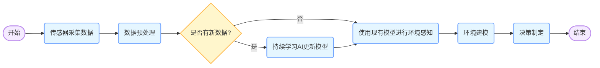

# 持续学习AI在动态环境感知中的应用

> 关键词：持续学习AI、动态环境感知、机器学习、环境建模、实时决策

> 摘要：本文聚焦于持续学习AI在动态环境感知中的应用。首先介绍了相关背景，包括目的范围、预期读者等。接着阐述了核心概念与联系，详细讲解了核心算法原理及具体操作步骤，给出了数学模型和公式并举例说明。通过项目实战展示了代码实现和解读。探讨了实际应用场景，推荐了相关工具和资源。最后总结了未来发展趋势与挑战，还提供了常见问题解答和扩展阅读参考资料。旨在帮助读者全面了解持续学习AI在动态环境感知中的应用，为相关领域的研究和实践提供有价值的参考。

## 1. 背景介绍 
### 1.1 目的和范围
在当今复杂多变的现实世界中，许多系统需要对动态环境进行准确感知，以便做出合理决策。例如自动驾驶汽车需要实时感知道路状况、交通信号和其他车辆的动态；智能机器人需要在不断变化的环境中完成任务等。传统的机器学习方法在面对动态环境时往往表现不佳，因为它们通常是基于固定数据集进行训练，无法适应环境的实时变化。持续学习AI则为解决这一问题提供了有效的途径。

本文的目的是深入探讨持续学习AI在动态环境感知中的应用，详细介绍相关的技术原理、算法实现、实际应用场景等内容。范围涵盖从核心概念的阐述到实际项目的代码实现，以及相关工具和资源的推荐，旨在为读者提供一个全面且深入的学习和研究指南。

### 1.2 预期读者
本文预期读者包括计算机科学、人工智能、机器人技术等相关专业的学生和研究人员，他们希望深入了解持续学习AI在动态环境感知领域的最新技术和应用；也适合从事相关领域开发的工程师，能够为他们的实际项目提供技术参考和解决方案；同时，对于对人工智能技术有兴趣的爱好者，也可以通过本文了解该领域的基本概念和应用场景。

### 1.3 文档结构概述
本文将按照以下结构进行组织：首先介绍核心概念与联系，包括持续学习AI和动态环境感知的定义、原理以及它们之间的关系，并通过文本示意图和Mermaid流程图进行直观展示。接着详细讲解核心算法原理和具体操作步骤，使用Python源代码进行说明。然后给出相关的数学模型和公式，并举例进行详细讲解。通过项目实战部分展示代码的实际案例和详细解释。探讨实际应用场景，推荐相关的工具和资源。最后总结未来发展趋势与挑战，提供常见问题解答和扩展阅读参考资料。

### 1.4 术语表
#### 1.4.1 核心术语定义
- **持续学习AI**：也称为终身学习AI，是指人工智能系统能够在不断接收新数据的过程中持续学习和改进，避免灾难性遗忘，即不会因为学习新的知识而忘记之前所学的内容。
- **动态环境感知**：指系统能够实时感知周围环境的变化，包括环境中的物体、事件、状态等信息，并对这些信息进行分析和理解。

#### 1.4.2 相关概念解释
- **灾难性遗忘**：在传统机器学习中，当模型在新的数据上进行训练时，可能会导致之前在旧数据上学习到的知识被遗忘，从而使得模型在旧数据上的性能大幅下降。
- **环境建模**：是指对动态环境进行抽象和表示，将环境中的各种信息转化为计算机可以处理的形式，以便系统能够对环境进行分析和决策。

#### 1.4.3 缩略词列表
- **AI**：Artificial Intelligence，人工智能
- **ML**：Machine Learning，机器学习
- **RL**：Reinforcement Learning，强化学习

## 2. 核心概念与联系 
### 核心概念原理
#### 持续学习AI原理
持续学习AI的核心思想是让模型能够在不断接收新数据的过程中持续学习和进化。传统的机器学习模型通常是在固定的数据集上进行训练，训练完成后模型的参数就固定下来了。而持续学习AI需要解决的关键问题是如何在学习新数据的同时保留之前所学的知识，避免灾难性遗忘。

一种常见的方法是采用记忆回放机制，即模型在学习新数据时，会定期从之前的记忆中随机抽取一部分数据进行回放训练，这样可以让模型不断巩固之前所学的知识。另一种方法是采用正则化技术，通过对模型的参数更新进行约束，使得模型在学习新数据时不会对之前的知识造成过大的破坏。

#### 动态环境感知原理
动态环境感知的核心是实时获取环境中的各种信息，并对这些信息进行处理和分析。这通常涉及到多个传感器的使用，如摄像头、雷达、激光雷达等，这些传感器可以采集到环境中的图像、距离、速度等信息。

采集到的原始数据需要经过预处理，如滤波、降噪、特征提取等，以提高数据的质量和可用性。然后，使用机器学习或深度学习算法对预处理后的数据进行分析，识别环境中的物体、事件和状态等信息。最后，将这些信息整合到一个统一的环境模型中，以便系统能够对环境进行全面的理解和决策。

### 架构的文本示意图
```plaintext
动态环境感知系统
├── 传感器层
│   ├── 摄像头
│   ├── 雷达
│   ├── 激光雷达
│   └── 其他传感器
├── 数据预处理层
│   ├── 滤波
│   ├── 降噪
│   └── 特征提取
├── 持续学习AI层
│   ├── 记忆回放机制
│   ├── 正则化技术
│   └── 模型更新
└── 环境建模与决策层
    ├── 环境模型构建
    └── 决策制定
```

### Mermaid流程图


## 3. 核心算法原理 & 具体操作步骤 
### 核心算法原理
在持续学习AI中，一种常用的算法是弹性权重巩固（Elastic Weight Consolidation，EWC）算法。EWC算法的核心思想是通过对模型的参数更新进行约束，使得模型在学习新数据时不会对之前的知识造成过大的破坏。

具体来说，EWC算法在学习新任务之前，会计算每个参数的重要性得分，这个得分表示该参数对于之前所学任务的重要程度。在学习新任务时，模型的参数更新会受到一个正则化项的约束，这个正则化项会根据参数的重要性得分对参数更新进行加权，使得重要性得分高的参数更新幅度较小，从而保留之前所学的知识。

### 具体操作步骤
#### 步骤1：初始化模型和参数
首先，需要初始化一个神经网络模型，并设置模型的初始参数。可以使用Python的深度学习框架，如PyTorch或TensorFlow来实现。

```python
import torch
import torch.nn as nn

# 定义一个简单的神经网络模型
class SimpleNet(nn.Module):
    def __init__(self):
        super(SimpleNet, self).__init__()
        self.fc1 = nn.Linear(10, 20)
        self.relu = nn.ReLU()
        self.fc2 = nn.Linear(20, 1)

    def forward(self, x):
        x = self.fc1(x)
        x = self.relu(x)
        x = self.fc2(x)
        return x

# 初始化模型
model = SimpleNet()
```

#### 步骤2：计算参数的重要性得分
在学习新任务之前，需要计算每个参数的重要性得分。可以通过计算参数的Fisher信息矩阵来得到参数的重要性得分。

```python
import torch.autograd as autograd

def compute_fisher(model, dataset):
    fisher = {}
    for n, p in model.named_parameters():
        fisher[n] = torch.zeros_like(p.data)
    model.train()
    for inputs, targets in dataset:
        model.zero_grad()
        outputs = model(inputs)
        loss = nn.MSELoss()(outputs, targets)
        loss.backward()
        for n, p in model.named_parameters():
            if p.grad is not None:
                fisher[n] += p.grad.data ** 2
    for n, p in model.named_parameters():
        fisher[n] /= len(dataset)
    return fisher

# 假设dataset是之前任务的数据集
fisher = compute_fisher(model, dataset)
```

#### 步骤3：定义正则化项
在学习新任务时，需要定义一个正则化项，根据参数的重要性得分对参数更新进行约束。

```python
def ewc_loss(model, fisher, prior_params, lambda_ewc):
    loss = 0
    for n, p in model.named_parameters():
        if n in fisher:
            loss += lambda_ewc * (fisher[n] * (p - prior_params[n]) ** 2).sum()
    return loss

# 保存之前的参数
prior_params = {n: p.data.clone() for n, p in model.named_parameters()}
```

#### 步骤4：学习新任务
在学习新任务时，将正则化项加入到损失函数中，一起进行优化。

```python
import torch.optim as optim

# 假设new_dataset是新任务的数据集
lambda_ewc = 100
optimizer = optim.Adam(model.parameters(), lr=0.001)

for epoch in range(10):
    for inputs, targets in new_dataset:
        optimizer.zero_grad()
        outputs = model(inputs)
        task_loss = nn.MSELoss()(outputs, targets)
        ewc_reg = ewc_loss(model, fisher, prior_params, lambda_ewc)
        total_loss = task_loss + ewc_reg
        total_loss.backward()
        optimizer.step()
```

## 4. 数学模型和公式 & 详细讲解 & 举例说明 
### 数学模型和公式
#### 弹性权重巩固（EWC）算法的损失函数
EWC算法的损失函数可以表示为：

$$
L(\theta) = L_{new}(\theta) + \lambda \sum_{i} F_i (\theta_i - \theta_{i}^{*})^2
$$

其中，$L(\theta)$ 是总的损失函数，$L_{new}(\theta)$ 是新任务的损失函数，$\lambda$ 是正则化系数，$F_i$ 是第 $i$ 个参数的Fisher信息矩阵元素，$\theta_i$ 是当前模型的第 $i$ 个参数，$\theta_{i}^{*}$ 是之前模型的第 $i$ 个参数。

#### Fisher信息矩阵的计算
Fisher信息矩阵 $F$ 可以通过以下公式计算：

$$
F_{ij} = \mathbb{E}_{p(x,y|\theta)} \left[ \frac{\partial \log p(y|x,\theta)}{\partial \theta_i} \frac{\partial \log p(y|x,\theta)}{\partial \theta_j} \right]
$$

在实际计算中，可以通过样本近似的方法来计算Fisher信息矩阵：

$$
F_{ij} \approx \frac{1}{N} \sum_{n=1}^{N} \frac{\partial \log p(y_n|x_n,\theta)}{\partial \theta_i} \frac{\partial \log p(y_n|x_n,\theta)}{\partial \theta_j}
$$

其中，$N$ 是样本的数量，$(x_n, y_n)$ 是第 $n$ 个样本。

### 详细讲解
#### 损失函数的含义
总的损失函数 $L(\theta)$ 由两部分组成：新任务的损失函数 $L_{new}(\theta)$ 和正则化项 $\lambda \sum_{i} F_i (\theta_i - \theta_{i}^{*})^2$。新任务的损失函数用于衡量模型在新任务上的性能，而正则化项用于约束模型的参数更新，使得模型在学习新任务时不会对之前的知识造成过大的破坏。

#### Fisher信息矩阵的含义
Fisher信息矩阵 $F$ 表示每个参数对于之前所学任务的重要程度。$F_{ij}$ 越大，表示第 $i$ 个参数和第 $j$ 个参数对于之前所学任务越重要，在学习新任务时，这两个参数的更新幅度应该越小。

### 举例说明
假设我们有一个简单的线性回归模型 $y = \theta_1 x + \theta_2$，之前的任务是学习一组数据 $(x_1, y_1), (x_2, y_2), \cdots, (x_N, y_N)$，新的任务是学习另一组数据 $(x_{N+1}, y_{N+1}), (x_{N+2}, y_{N+2}), \cdots, (x_{M}, y_{M})$。

首先，计算之前任务的Fisher信息矩阵 $F$。假设我们使用均方误差损失函数 $L = \frac{1}{2} \sum_{n=1}^{N} (y_n - (\theta_1 x_n + \theta_2))^2$，则：

$$
\frac{\partial L}{\partial \theta_1} = - \sum_{n=1}^{N} (y_n - (\theta_1 x_n + \theta_2)) x_n
$$

$$
\frac{\partial L}{\partial \theta_2} = - \sum_{n=1}^{N} (y_n - (\theta_1 x_n + \theta_2))
$$

通过样本近似的方法计算Fisher信息矩阵：

$$
F_{11} \approx \frac{1}{N} \sum_{n=1}^{N} \left( \frac{\partial L}{\partial \theta_1} \right)^2
$$

$$
F_{12} \approx \frac{1}{N} \sum_{n=1}^{N} \frac{\partial L}{\partial \theta_1} \frac{\partial L}{\partial \theta_2}
$$

$$
F_{22} \approx \frac{1}{N} \sum_{n=1}^{N} \left( \frac{\partial L}{\partial \theta_2} \right)^2
$$

然后，在学习新任务时，使用EWC算法的损失函数：

$$
L(\theta) = \frac{1}{2} \sum_{n=N+1}^{M} (y_n - (\theta_1 x_n + \theta_2))^2 + \lambda \left[ F_{11} (\theta_1 - \theta_{1}^{*})^2 + 2 F_{12} (\theta_1 - \theta_{1}^{*}) (\theta_2 - \theta_{2}^{*}) + F_{22} (\theta_2 - \theta_{2}^{*})^2 \right]
$$

其中，$\theta_{1}^{*}$ 和 $\theta_{2}^{*}$ 是之前模型的参数。通过优化这个损失函数，可以在学习新任务的同时保留之前所学的知识。

## 5. 项目实战：代码实际案例和详细解释说明 
### 5.1  开发环境搭建
#### 安装Python
首先，需要安装Python环境。建议使用Python 3.7及以上版本，可以从Python官方网站（https://www.python.org/downloads/）下载并安装。

#### 安装深度学习框架
本文使用PyTorch作为深度学习框架，可以使用以下命令进行安装：

```bash
pip install torch torchvision
```

#### 安装其他依赖库
还需要安装一些其他的依赖库，如NumPy、Matplotlib等，可以使用以下命令进行安装：

```bash
pip install numpy matplotlib
```

### 5.2  源代码详细实现和代码解读
#### 数据集准备
我们使用一个简单的模拟数据集来演示持续学习AI在动态环境感知中的应用。假设我们有两个任务，每个任务对应一个数据集。

```python
import numpy as np
import torch
from torch.utils.data import Dataset, DataLoader

# 定义数据集类
class SimpleDataset(Dataset):
    def __init__(self, x, y):
        self.x = torch.tensor(x, dtype=torch.float32)
        self.y = torch.tensor(y, dtype=torch.float32)

    def __len__(self):
        return len(self.x)

    def __getitem__(self, idx):
        return self.x[idx], self.y[idx]

# 生成任务1的数据集
x1 = np.random.randn(100, 10)
y1 = np.sum(x1, axis=1)

# 生成任务2的数据集
x2 = np.random.randn(100, 10)
y2 = np.prod(x2, axis=1)

# 创建数据集对象
dataset1 = SimpleDataset(x1, y1)
dataset2 = SimpleDataset(x2, y2)

# 创建数据加载器
dataloader1 = DataLoader(dataset1, batch_size=10, shuffle=True)
dataloader2 = DataLoader(dataset2, batch_size=10, shuffle=True)
```

#### 模型定义
定义一个简单的神经网络模型。

```python
import torch.nn as nn

class SimpleNet(nn.Module):
    def __init__(self):
        super(SimpleNet, self).__init__()
        self.fc1 = nn.Linear(10, 20)
        self.relu = nn.ReLU()
        self.fc2 = nn.Linear(20, 1)

    def forward(self, x):
        x = self.fc1(x)
        x = self.relu(x)
        x = self.fc2(x)
        return x

model = SimpleNet()
```

#### 计算Fisher信息矩阵
```python
import torch.autograd as autograd

def compute_fisher(model, dataloader):
    fisher = {}
    for n, p in model.named_parameters():
        fisher[n] = torch.zeros_like(p.data)
    model.train()
    for inputs, targets in dataloader:
        model.zero_grad()
        outputs = model(inputs)
        loss = nn.MSELoss()(outputs, targets)
        loss.backward()
        for n, p in model.named_parameters():
            if p.grad is not None:
                fisher[n] += p.grad.data ** 2
    for n, p in model.named_parameters():
        fisher[n] /= len(dataloader)
    return fisher

# 计算任务1的Fisher信息矩阵
fisher = compute_fisher(model, dataloader1)
```

#### 定义正则化项
```python
def ewc_loss(model, fisher, prior_params, lambda_ewc):
    loss = 0
    for n, p in model.named_parameters():
        if n in fisher:
            loss += lambda_ewc * (fisher[n] * (p - prior_params[n]) ** 2).sum()
    return loss

# 保存之前的参数
prior_params = {n: p.data.clone() for n, p in model.named_parameters()}
```

#### 学习新任务
```python
import torch.optim as optim

lambda_ewc = 100
optimizer = optim.Adam(model.parameters(), lr=0.001)

for epoch in range(10):
    for inputs, targets in dataloader2:
        optimizer.zero_grad()
        outputs = model(inputs)
        task_loss = nn.MSELoss()(outputs, targets)
        ewc_reg = ewc_loss(model, fisher, prior_params, lambda_ewc)
        total_loss = task_loss + ewc_reg
        total_loss.backward()
        optimizer.step()
```

### 5.3  代码解读与分析
#### 数据集准备部分
首先，我们定义了一个简单的数据集类 `SimpleDataset`，用于封装数据和标签。然后，生成了两个任务的数据集，并使用 `DataLoader` 对数据集进行批量处理。

#### 模型定义部分
定义了一个简单的两层全连接神经网络模型 `SimpleNet`，包含一个输入层、一个隐藏层和一个输出层。

#### 计算Fisher信息矩阵部分
`compute_fisher` 函数用于计算每个参数的Fisher信息矩阵。通过遍历数据集，计算每个样本的梯度，并将梯度的平方累加到对应的参数上，最后除以数据集的大小得到平均梯度平方。

#### 定义正则化项部分
`ewc_loss` 函数用于定义EWC算法的正则化项。根据参数的Fisher信息矩阵和之前的参数，计算正则化损失。

#### 学习新任务部分
在学习新任务时，将新任务的损失函数和正则化项相加得到总的损失函数，然后使用优化器对总的损失函数进行优化。

通过这种方式，模型在学习新任务的同时，能够保留之前在任务1上学到的知识，避免了灾难性遗忘。

## 6. 实际应用场景 
### 自动驾驶
在自动驾驶领域，车辆需要实时感知周围的动态环境，包括道路状况、交通信号、其他车辆和行人的运动等。持续学习AI可以帮助自动驾驶系统在不断变化的环境中持续学习和适应。例如，当遇到新的道路标志或交通规则时，系统可以通过持续学习来更新自己的知识，提高驾驶的安全性和可靠性。

### 智能机器人
智能机器人在执行任务时，需要在不同的环境中进行导航和操作。持续学习AI可以使机器人在不断变化的环境中持续学习新的技能和知识。例如，当机器人进入一个新的房间时，它可以通过持续学习来识别房间中的物体和布局，从而更好地完成任务。

### 智能家居
智能家居系统需要实时感知家庭环境的变化，如温度、湿度、光照等，并根据用户的需求进行自动调节。持续学习AI可以帮助智能家居系统在不断变化的环境中持续学习用户的习惯和偏好，提供更加个性化的服务。例如，系统可以根据用户的日常作息时间自动调节室内温度和光照。

### 工业监控
在工业生产中，需要对生产设备和环境进行实时监控，以确保生产的安全和高效。持续学习AI可以帮助工业监控系统在不断变化的生产环境中持续学习和识别异常情况。例如，当设备出现新的故障模式时，系统可以通过持续学习来及时发现并报警。

## 7. 工具和资源推荐
### 7.1 学习资源推荐
#### 7.1.1 书籍推荐
- 《深度学习》（Deep Learning）：由Ian Goodfellow、Yoshua Bengio和Aaron Courville所著，是深度学习领域的经典教材，涵盖了深度学习的基本原理、算法和应用。
- 《人工智能：一种现代的方法》（Artificial Intelligence: A Modern Approach）：由Stuart Russell和Peter Norvig所著，是人工智能领域的权威教材，介绍了人工智能的各个方面，包括搜索算法、机器学习、自然语言处理等。
- 《持续学习》（Continual Learning）：由German I. Parisi等人所著，专门介绍了持续学习的理论和方法，是持续学习领域的重要参考书籍。

#### 7.1.2 在线课程
- Coursera上的“深度学习专项课程”（Deep Learning Specialization）：由Andrew Ng教授主讲，包括神经网络和深度学习、改善深层神经网络、结构化机器学习项目、卷积神经网络和序列模型等课程，是学习深度学习的优质在线课程。
- edX上的“人工智能导论”（Introduction to Artificial Intelligence）：由麻省理工学院（MIT）的Patrick Winston教授主讲，介绍了人工智能的基本概念、算法和应用。
- Udemy上的“持续学习AI实战”（Continual Learning AI in Practice）：专门介绍了持续学习AI的实际应用和实现方法。

#### 7.1.3 技术博客和网站
- arXiv（https://arxiv.org/）：是一个预印本平台，提供了大量的学术论文，包括持续学习AI和动态环境感知领域的最新研究成果。
- Medium（https://medium.com/）：有许多技术博客文章，涵盖了人工智能、机器学习等领域的最新技术和应用。
- Towards Data Science（https://towardsdatascience.com/）：专注于数据科学和机器学习领域的技术文章，提供了许多实用的教程和案例。

### 7.2 开发工具框架推荐
#### 7.2.1 IDE和编辑器
- PyCharm：是一款专门为Python开发设计的集成开发环境（IDE），提供了丰富的代码编辑、调试和项目管理功能。
- Jupyter Notebook：是一个交互式的开发环境，适合进行数据分析、模型训练和可视化等工作。
- Visual Studio Code：是一款轻量级的代码编辑器，支持多种编程语言，并且有丰富的扩展插件。

#### 7.2.2 调试和性能分析工具
- TensorBoard：是TensorFlow提供的可视化工具，可以用于可视化模型的训练过程、损失函数变化、参数分布等信息。
- PyTorch Profiler：是PyTorch提供的性能分析工具，可以帮助开发者分析模型的性能瓶颈，优化代码。
- cProfile：是Python标准库中的性能分析工具，可以用于分析Python代码的执行时间和函数调用关系。

#### 7.2.3 相关框架和库
- PyTorch：是一个开源的深度学习框架，提供了丰富的神经网络层、优化器和损失函数等，支持GPU加速。
- TensorFlow：是另一个流行的深度学习框架，具有高度的灵活性和可扩展性，广泛应用于工业界和学术界。
- Scikit-learn：是一个用于机器学习的Python库，提供了各种机器学习算法和工具，如分类、回归、聚类等。

### 7.3 相关论文著作推荐
#### 7.3.1 经典论文
- "Overcoming catastrophic forgetting in neural networks"：由James Kirkpatrick等人发表，提出了弹性权重巩固（EWC）算法，是持续学习领域的经典论文。
- "Learning without forgetting"：由Zhizhong Li和Derek Hoiem发表，提出了一种基于知识蒸馏的持续学习方法。
- "An empirical study of catastrophic forgetting in gradient-based neural networks"：由Ian J. Goodfellow等人发表，对神经网络中的灾难性遗忘问题进行了深入的研究。

#### 7.3.2 最新研究成果
- 可以关注每年的人工智能和机器学习领域的顶级会议，如NeurIPS（神经信息处理系统大会）、ICML（国际机器学习会议）、CVPR（计算机视觉与模式识别会议）等，这些会议上会有持续学习AI和动态环境感知领域的最新研究成果。

#### 7.3.3 应用案例分析
- 可以参考一些实际应用案例的研究报告和论文，了解持续学习AI在自动驾驶、智能机器人、智能家居等领域的具体应用和实现方法。

## 8. 总结：未来发展趋势与挑战
### 未来发展趋势
#### 多模态持续学习
未来的持续学习AI将不仅仅局限于单一模态的数据，如图像、文本或语音，而是会融合多种模态的数据进行学习。例如，在自动驾驶中，系统可以同时利用摄像头的图像数据、雷达的距离数据和麦克风的声音数据进行环境感知和决策。

#### 强化学习与持续学习的结合
强化学习在动态环境中具有很好的决策能力，将强化学习与持续学习相结合，可以使系统在不断变化的环境中持续学习和优化策略。例如，智能机器人可以通过强化学习在不同的环境中探索和学习，同时利用持续学习来保留之前学到的知识。

#### 联邦持续学习
随着数据隐私和安全问题的日益重要，联邦持续学习将成为一个重要的发展方向。联邦持续学习允许在多个设备或节点上进行持续学习，而不需要将数据集中到一个中心节点，从而保护了数据的隐私和安全。

### 挑战
#### 灾难性遗忘问题仍然存在
尽管已经提出了许多方法来解决灾难性遗忘问题，但目前的方法仍然存在一定的局限性。在复杂的动态环境中，模型仍然可能会出现灾难性遗忘的情况，导致性能下降。

#### 计算资源和时间成本
持续学习AI需要不断地处理新数据和更新模型，这会带来较高的计算资源和时间成本。在实际应用中，如何在有限的计算资源和时间内实现高效的持续学习是一个挑战。

#### 数据质量和多样性
持续学习AI需要大量高质量和多样化的数据来进行学习。在动态环境中，数据的质量和多样性可能会受到影响，例如数据中可能存在噪声、缺失值或偏差等问题，这会影响模型的性能。

## 9. 附录：常见问题与解答
### 问题1：持续学习AI和传统机器学习有什么区别？
传统机器学习通常是在固定的数据集上进行训练，训练完成后模型的参数就固定下来了。而持续学习AI可以在不断接收新数据的过程中持续学习和改进，避免灾难性遗忘，能够适应动态变化的环境。

### 问题2：如何选择合适的持续学习算法？
选择合适的持续学习算法需要考虑多个因素，如任务的类型、数据的特点、计算资源的限制等。不同的算法有不同的优缺点，例如弹性权重巩固（EWC）算法适用于保留之前所学的知识，而基于知识蒸馏的方法适用于在新任务上快速学习。可以通过实验比较不同算法在具体任务上的性能，选择最合适的算法。

### 问题3：持续学习AI在实际应用中会遇到哪些问题？
持续学习AI在实际应用中可能会遇到灾难性遗忘问题、计算资源和时间成本高、数据质量和多样性不足等问题。此外，还需要考虑模型的可解释性和安全性等问题。

### 问题4：如何评估持续学习AI模型的性能？
评估持续学习AI模型的性能可以使用多种指标，如准确率、召回率、F1值等。此外，还可以考虑模型在不同任务上的性能变化、灾难性遗忘的程度等指标。可以通过在多个任务上进行实验，比较模型在不同时间点的性能来评估其持续学习能力。

## 10. 扩展阅读 & 参考资料
### 扩展阅读
- 可以阅读一些关于人工智能、机器学习和持续学习的最新研究论文和书籍，了解该领域的最新发展动态。
- 关注一些人工智能和机器学习领域的知名博客和论坛，如AI Stack Exchange、Reddit的r/MachineLearning等，与其他研究者和开发者交流经验和想法。

### 参考资料
- Goodfellow, I., Bengio, Y., & Courville, A. (2016). Deep Learning. MIT Press.
- Russell, S. J., & Norvig, P. (2020). Artificial Intelligence: A Modern Approach. Pearson.
- Parisi, G. I., Kemker, R., Part, J. L., Kanan, C., & Wermter, S. (2019). Continual Learning: A Survey. Neural Networks, 113, 54-71.
- Kirkpatrick, J., Pascanu, R., Rabinowitz, N., Veness, J., Desjardins, G., Rusu, A. A.,... & Hassabis, D. (2017). Overcoming catastrophic forgetting in neural networks. Proceedings of the National Academy of Sciences, 114(13), 3521-3526.
- Li, Z., & Hoiem, D. (2016). Learning without forgetting. IEEE Transactions on Pattern Analysis and Machine Intelligence, 40(12), 2935-2947.
- Goodfellow, I. J., Mirza, M., Xiao, D., Courville, A., & Bengio, Y. (2013). An empirical study of catastrophic forgetting in gradient-based neural networks. arXiv preprint arXiv:1312.6211.

作者：AI天才研究院/AI Genius Institute & 禅与计算机程序设计艺术 /Zen And The Art of Computer Programming