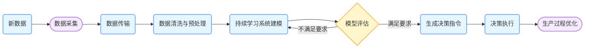

# 持续学习系统在智能制造中的实时优化

> 关键词：持续学习系统、智能制造、实时优化、工业自动化、数据驱动决策

> 摘要：本文聚焦于持续学习系统在智能制造中的实时优化应用。首先介绍了相关背景，包括目的范围、预期读者等。接着阐述了持续学习系统和智能制造的核心概念及其联系，给出了原理和架构的文本示意图与 Mermaid 流程图。详细讲解了核心算法原理，并用 Python 代码进行示例。深入探讨了相关数学模型和公式，并举例说明。通过项目实战，展示了开发环境搭建、源代码实现与解读。分析了持续学习系统在智能制造中的实际应用场景，推荐了学习资源、开发工具框架和相关论文著作。最后总结了未来发展趋势与挑战，还设置了附录解答常见问题，并提供扩展阅读和参考资料，旨在为智能制造领域的从业者和研究者提供全面的技术指导。

## 1. 背景介绍 
### 1.1 目的和范围
在当今智能制造的大背景下，企业面临着提高生产效率、降低成本、提升产品质量等多方面的挑战。持续学习系统作为一种能够不断从新数据中学习并适应变化的技术，为智能制造的实时优化提供了新的途径。本文的目的在于深入探讨持续学习系统如何应用于智能制造中的实时优化，包括其原理、算法、实际应用等方面。范围涵盖了持续学习系统的基本概念、核心算法，以及在智能制造各个环节中的具体应用，如生产调度、质量控制、设备维护等。

### 1.2 预期读者
本文预期读者主要包括智能制造领域的工程师、技术人员、研究人员，以及对人工智能在工业领域应用感兴趣的专业人士。对于那些希望了解如何利用持续学习系统提升智能制造效率和质量的人员，本文将提供有价值的参考。

### 1.3 文档结构概述
本文首先介绍相关背景信息，让读者对主题有初步的了解。接着阐述持续学习系统和智能制造的核心概念及其联系，为后续的深入讨论奠定基础。然后详细讲解核心算法原理和具体操作步骤，并结合 Python 代码进行说明。再介绍相关的数学模型和公式，通过具体例子加深理解。通过项目实战，展示如何将理论应用到实际中。分析持续学习系统在智能制造中的实际应用场景，让读者了解其实际价值。推荐相关的学习资源、开发工具框架和论文著作，方便读者进一步深入学习。最后总结未来发展趋势与挑战，解答常见问题，并提供扩展阅读和参考资料。

### 1.4 术语表
#### 1.4.1 核心术语定义
- **持续学习系统（Continuous Learning System）**：一种能够不断从新数据中学习新知识，并且能够保留之前学习到的知识，以适应环境变化的学习系统。
- **智能制造（Intelligent Manufacturing）**：基于新一代信息技术，贯穿设计、生产、管理、服务等制造活动各个环节，具有信息深度自感知、智慧优化自决策、精准控制自执行等功能的先进制造过程、系统与模式的总称。
- **实时优化（Real-time Optimization）**：在系统运行过程中，根据实时获取的数据，及时调整系统的参数和决策，以实现系统性能的最优。

#### 1.4.2 相关概念解释
- **工业自动化（Industrial Automation）**：利用控制理论、仪器仪表、计算机和其他信息技术，对工业生产过程实现检测、控制、优化、调度、管理和决策，达到增加产量、提高质量、降低消耗、确保安全等目的的综合性技术。
- **数据驱动决策（Data-driven Decision Making）**：基于大量的数据收集、分析和挖掘，做出决策的过程。在智能制造中，通过对生产过程中的各种数据进行分析，为生产调度、质量控制等决策提供依据。

#### 1.4.3 缩略词列表
- **AI（Artificial Intelligence）**：人工智能
- **ML（Machine Learning）**：机器学习
- **DL（Deep Learning）**：深度学习
- **PLC（Programmable Logic Controller）**：可编程逻辑控制器

## 2. 核心概念与联系 

### 持续学习系统原理
持续学习系统的核心思想是在不断接收新数据的过程中，持续更新模型的参数，同时避免灾难性遗忘（Catastrophic Forgetting），即避免模型在学习新数据时丢失之前学习到的重要信息。常见的持续学习方法包括基于正则化的方法、基于记忆的方法和基于架构的方法等。

基于正则化的方法通过在损失函数中添加正则化项，约束模型参数的更新，使得模型在学习新数据时尽量保留之前的知识。例如，弹性权重巩固（Elastic Weight Consolidation，EWC）方法通过计算每个参数的重要性，对重要参数的更新进行约束。

基于记忆的方法通过存储一部分之前的数据，在学习新数据时，将这些存储的数据与新数据一起用于训练模型，以缓解灾难性遗忘问题。例如，经验回放（Experience Replay）方法在训练强化学习模型时，将之前的经验存储在经验池中，随机从经验池中采样数据进行训练。

基于架构的方法通过设计特殊的神经网络架构，使得模型能够更好地适应持续学习的需求。例如，渐进式神经网络（Progressive Neural Networks）通过在网络中添加新的列来学习新任务，同时保留之前列的知识。

### 智能制造原理
智能制造通过将物联网、大数据、人工智能等技术应用于制造过程，实现生产过程的自动化、智能化和柔性化。在智能制造中，各种设备和传感器通过网络连接，实时收集生产过程中的数据，如设备状态、生产进度、产品质量等。这些数据被传输到数据分析平台，通过机器学习、深度学习等算法进行分析和挖掘，提取有价值的信息，为生产调度、质量控制、设备维护等决策提供支持。

### 持续学习系统与智能制造的联系
持续学习系统在智能制造中具有重要的应用价值。在智能制造环境中，生产过程是动态变化的，如原材料质量的波动、设备性能的变化、市场需求的改变等。持续学习系统能够实时学习这些变化，及时调整模型的参数，使得智能制造系统能够更好地适应这些变化，实现实时优化。

例如，在生产调度方面，持续学习系统可以根据实时的生产数据和市场需求，不断优化生产计划，提高生产效率。在质量控制方面，持续学习系统可以实时监测产品质量，根据新的质量数据更新质量预测模型，及时发现质量问题并采取措施进行调整。在设备维护方面，持续学习系统可以通过对设备运行数据的实时分析，预测设备故障的发生概率，提前进行维护，减少设备停机时间。

### 原理和架构的文本示意图
持续学习系统在智能制造中的应用架构可以分为数据采集层、数据传输层、数据分析层和决策执行层。

数据采集层：通过各种传感器和设备，实时采集生产过程中的数据，如温度、压力、振动、转速等。

数据传输层：将采集到的数据通过网络传输到数据分析平台，常见的网络包括工业以太网、无线传感器网络等。

数据分析层：在数据分析平台上，对采集到的数据进行清洗、预处理和分析。使用持续学习系统对数据进行建模和学习，实时更新模型的参数，以适应生产过程的变化。

决策执行层：根据数据分析层的结果，生成决策指令，通过工业控制系统（如 PLC）将决策指令发送到生产设备，实现对生产过程的实时控制和优化。

### Mermaid 流程图


## 3. 核心算法原理 & 具体操作步骤 

### 基于弹性权重巩固（EWC）的持续学习算法原理
弹性权重巩固（EWC）算法是一种基于正则化的持续学习方法，其核心思想是通过计算每个参数的重要性，对重要参数的更新进行约束，以避免灾难性遗忘。

假设我们有一个神经网络模型 $f(\mathbf{x};\mathbf{\theta})$，其中 $\mathbf{x}$ 是输入数据，$\mathbf{\theta}$ 是模型的参数。在学习第 $t$ 个任务时，我们的目标是最小化损失函数 $L_t(\mathbf{\theta})$，同时保留之前学习到的知识。

EWC 算法通过在损失函数中添加一个正则化项来实现这一目标，新的损失函数为：

$$L_{EWC}(\mathbf{\theta}) = L_t(\mathbf{\theta}) + \lambda \sum_i F_i (\theta_i - \theta_i^*)^2$$

其中，$L_t(\mathbf{\theta})$ 是第 $t$ 个任务的损失函数，$\lambda$ 是正则化系数，$F_i$ 是第 $i$ 个参数的重要性得分，$\theta_i^*$ 是之前任务学习到的最优参数。

$F_i$ 的计算方法如下：

1. 对于每个训练样本 $\mathbf{x}$，计算模型在该样本上的对数似然 $l(\mathbf{x};\mathbf{\theta})$。
2. 计算对数似然关于参数 $\theta_i$ 的二阶导数的期望：

$$F_i = \mathbb{E}_{\mathbf{x} \sim \mathcal{D}} \left[ \left( \frac{\partial l(\mathbf{x};\mathbf{\theta})}{\partial \theta_i} \right)^2 \right]$$

其中，$\mathcal{D}$ 是之前任务的训练数据集。

### 具体操作步骤
1. **初始化模型参数**：随机初始化神经网络模型的参数 $\mathbf{\theta}$。
2. **学习第一个任务**：使用第一个任务的训练数据集 $\mathcal{D}_1$ 训练模型，得到最优参数 $\mathbf{\theta}^*_1$。
3. **计算重要性得分**：对于每个参数 $\theta_i$，计算其重要性得分 $F_i$。
4. **学习后续任务**：对于第 $t$ 个任务（$t > 1$），使用第 $t$ 个任务的训练数据集 $\mathcal{D}_t$ 训练模型，最小化损失函数 $L_{EWC}(\mathbf{\theta})$。
5. **重复步骤 3 和 4**：不断学习新的任务，同时保留之前学习到的知识。

### Python 代码实现
```python
import torch
import torch.nn as nn
import torch.optim as optim

# 定义一个简单的神经网络模型
class SimpleNet(nn.Module):
    def __init__(self):
        super(SimpleNet, self).__init__()
        self.fc1 = nn.Linear(10, 20)
        self.fc2 = nn.Linear(20, 1)

    def forward(self, x):
        x = torch.relu(self.fc1(x))
        x = self.fc2(x)
        return x

# 初始化模型
model = SimpleNet()

# 学习第一个任务
criterion = nn.MSELoss()
optimizer = optim.SGD(model.parameters(), lr=0.01)

# 假设第一个任务的训练数据
train_data1 = torch.randn(100, 10)
train_labels1 = torch.randn(100, 1)

for epoch in range(10):
    optimizer.zero_grad()
    outputs = model(train_data1)
    loss = criterion(outputs, train_labels1)
    loss.backward()
    optimizer.step()

# 计算重要性得分
# 这里简化计算，使用每个参数的梯度平方的均值作为重要性得分
F = {}
for name, param in model.named_parameters():
    F[name] = torch.mean(param.grad ** 2)

# 学习第二个任务
# 假设第二个任务的训练数据
train_data2 = torch.randn(100, 10)
train_labels2 = torch.randn(100, 1)

lambda_ewc = 1.0
theta_star = {}
for name, param in model.named_parameters():
    theta_star[name] = param.data.clone()

for epoch in range(10):
    optimizer.zero_grad()
    outputs = model(train_data2)
    loss = criterion(outputs, train_labels2)

    # 添加 EWC 正则化项
    for name, param in model.named_parameters():
        loss += lambda_ewc * F[name] * (param - theta_star[name]).pow(2).sum()

    loss.backward()
    optimizer.step()
```

## 4. 数学模型和公式 & 详细讲解 & 举例说明 

### 持续学习系统的损失函数
在持续学习系统中，为了避免灾难性遗忘，我们通常会在原始损失函数的基础上添加一个正则化项。如前面介绍的 EWC 算法，其损失函数为：

$$L_{EWC}(\mathbf{\theta}) = L_t(\mathbf{\theta}) + \lambda \sum_i F_i (\theta_i - \theta_i^*)^2$$

其中，$L_t(\mathbf{\theta})$ 是第 $t$ 个任务的损失函数，$\lambda$ 是正则化系数，$F_i$ 是第 $i$ 个参数的重要性得分，$\theta_i^*$ 是之前任务学习到的最优参数。

详细讲解：
- $L_t(\mathbf{\theta})$：表示在第 $t$ 个任务上的损失，用于衡量模型在当前任务上的性能。常见的损失函数包括均方误差损失（MSE）、交叉熵损失（Cross Entropy Loss）等。
- $\lambda$：正则化系数，用于控制正则化项的权重。$\lambda$ 越大，模型在学习新任务时越倾向于保留之前的知识；$\lambda$ 越小，模型在学习新任务时对之前知识的保留程度越低。
- $F_i$：参数的重要性得分，用于衡量每个参数在之前任务中的重要程度。$F_i$ 越大，说明该参数在之前任务中越重要，在学习新任务时对其更新的约束就越强。
- $\theta_i^*$：之前任务学习到的最优参数，作为参考值，用于约束当前参数的更新。

举例说明：
假设我们有一个简单的线性回归模型 $y = \theta_1 x_1 + \theta_2 x_2 + b$，其中 $\theta_1$ 和 $\theta_2$ 是权重参数，$b$ 是偏置参数。在第一个任务中，我们使用均方误差损失函数 $L_1(\theta_1, \theta_2, b) = \frac{1}{n} \sum_{i=1}^{n} (y_i - (\theta_1 x_{i1} + \theta_2 x_{i2} + b))^2$ 进行训练，得到最优参数 $\theta_1^*$，$\theta_2^*$ 和 $b^*$。

在学习第二个任务时，我们的目标是最小化 $L_{EWC}(\theta_1, \theta_2, b) = L_2(\theta_1, \theta_2, b) + \lambda \left[ F_1 (\theta_1 - \theta_1^*)^2 + F_2 (\theta_2 - \theta_2^*)^2 + F_b (b - b^*)^2 \right]$，其中 $L_2(\theta_1, \theta_2, b)$ 是第二个任务的损失函数。

### 重要性得分的计算
在 EWC 算法中，重要性得分 $F_i$ 的计算方法为：

$$F_i = \mathbb{E}_{\mathbf{x} \sim \mathcal{D}} \left[ \left( \frac{\partial l(\mathbf{x};\mathbf{\theta})}{\partial \theta_i} \right)^2 \right]$$

详细讲解：
- $\mathbf{x}$：训练样本，$\mathcal{D}$ 是之前任务的训练数据集。
- $l(\mathbf{x};\mathbf{\theta})$：模型在样本 $\mathbf{x}$ 上的对数似然，用于衡量模型对样本的拟合程度。
- $\frac{\partial l(\mathbf{x};\mathbf{\theta})}{\partial \theta_i}$：对数似然关于参数 $\theta_i$ 的一阶导数，表示参数 $\theta_i$ 的微小变化对对数似然的影响程度。
- $\left( \frac{\partial l(\mathbf{x};\mathbf{\theta})}{\partial \theta_i} \right)^2$：一阶导数的平方，用于消除导数的正负影响。
- $\mathbb{E}_{\mathbf{x} \sim \mathcal{D}}$：对训练数据集中所有样本的一阶导数平方求期望，得到参数 $\theta_i$ 的重要性得分。

举例说明：
假设我们有一个逻辑回归模型 $P(y = 1 | \mathbf{x}) = \frac{1}{1 + e^{-\mathbf{w}^T \mathbf{x}}}$，其中 $\mathbf{w}$ 是权重向量。对于一个样本 $\mathbf{x}$，其对数似然为 $l(\mathbf{x};\mathbf{w}) = y \log P(y = 1 | \mathbf{x}) + (1 - y) \log (1 - P(y = 1 | \mathbf{x}))$。

我们可以计算 $\frac{\partial l(\mathbf{x};\mathbf{w})}{\partial w_i}$，然后对训练数据集中所有样本的 $\left( \frac{\partial l(\mathbf{x};\mathbf{w})}{\partial w_i} \right)^2$ 求均值，得到权重参数 $w_i$ 的重要性得分 $F_i$。

## 5. 项目实战：代码实际案例和详细解释说明 

### 5.1  开发环境搭建
#### 硬件环境
- **服务器**：建议使用具有较高计算性能的服务器，如配备 Intel Xeon 处理器、NVIDIA GPU 的服务器，以满足深度学习模型训练的需求。
- **传感器**：根据具体的智能制造场景，选择合适的传感器，如温度传感器、压力传感器、振动传感器等，用于采集生产过程中的数据。

#### 软件环境
- **操作系统**：推荐使用 Linux 操作系统，如 Ubuntu 18.04 或更高版本。
- **编程语言**：使用 Python 作为主要的编程语言，因为 Python 具有丰富的机器学习和深度学习库。
- **深度学习框架**：选择 PyTorch 或 TensorFlow 作为深度学习框架，本文以 PyTorch 为例。

#### 安装步骤
1. 安装 Python：可以从 Python 官方网站（https://www.python.org/downloads/）下载并安装 Python 3.7 或更高版本。
2. 安装 PyTorch：根据自己的 CUDA 版本和操作系统，从 PyTorch 官方网站（https://pytorch.org/get-started/locally/）选择合适的安装命令进行安装。例如，对于 CUDA 11.1 和 Linux 系统，可以使用以下命令安装：

```bash
pip install torch torchvision torchaudio --extra-index-url https://download.pytorch.org/whl/cu111
```

3. 安装其他必要的库：使用以下命令安装其他必要的库，如 NumPy、Pandas、Matplotlib 等。

```bash
pip install numpy pandas matplotlib
```

### 5.2  源代码详细实现和代码解读
#### 数据采集与预处理
```python
import numpy as np
import pandas as pd

# 模拟数据采集
def collect_data():
    # 假设从传感器采集到的数据
    temperature = np.random.normal(25, 2, 100)
    pressure = np.random.normal(100, 5, 100)
    vibration = np.random.normal(0.1, 0.05, 100)

    data = pd.DataFrame({
        'temperature': temperature,
        'pressure': pressure,
        'vibration': vibration
    })
    return data

# 数据预处理
def preprocess_data(data):
    # 归一化处理
    from sklearn.preprocessing import StandardScaler
    scaler = StandardScaler()
    data_scaled = scaler.fit_transform(data)
    return data_scaled

# 采集数据
data = collect_data()
# 预处理数据
data_scaled = preprocess_data(data)
```

代码解读：
- `collect_data` 函数模拟了从传感器采集数据的过程，生成了温度、压力和振动三个特征的随机数据。
- `preprocess_data` 函数使用 `StandardScaler` 对数据进行归一化处理，将数据的均值变为 0，标准差变为 1，以提高模型的训练效果。

#### 持续学习模型训练
```python
import torch
import torch.nn as nn
import torch.optim as optim

# 定义一个简单的神经网络模型
class SimpleNet(nn.Module):
    def __init__(self):
        super(SimpleNet, self).__init__()
        self.fc1 = nn.Linear(3, 10)
        self.fc2 = nn.Linear(10, 1)

    def forward(self, x):
        x = torch.relu(self.fc1(x))
        x = self.fc2(x)
        return x

# 初始化模型
model = SimpleNet()

# 定义损失函数和优化器
criterion = nn.MSELoss()
optimizer = optim.SGD(model.parameters(), lr=0.01)

# 训练模型
def train_model(model, data, labels, epochs):
    for epoch in range(epochs):
        optimizer.zero_grad()
        inputs = torch.tensor(data, dtype=torch.float32)
        targets = torch.tensor(labels, dtype=torch.float32)
        outputs = model(inputs)
        loss = criterion(outputs, targets)
        loss.backward()
        optimizer.step()
        if (epoch + 1) % 10 == 0:
            print(f'Epoch {epoch + 1}/{epochs}, Loss: {loss.item()}')

# 假设标签数据
labels = np.random.normal(0, 1, 100)

# 训练模型
train_model(model, data_scaled, labels, epochs=100)
```

代码解读：
- `SimpleNet` 类定义了一个简单的两层神经网络模型，包含一个输入层、一个隐藏层和一个输出层。
- `train_model` 函数用于训练模型，通过多次迭代更新模型的参数，最小化损失函数。
- 在训练过程中，每 10 个 epoch 打印一次损失值，以便观察模型的训练进度。

### 5.3  代码解读与分析
#### 数据采集与预处理部分
数据采集是整个项目的基础，通过模拟传感器采集数据，我们可以获取生产过程中的相关信息。数据预处理是为了提高模型的训练效果，归一化处理可以使不同特征的数据具有相同的尺度，避免某些特征对模型的影响过大。

#### 持续学习模型训练部分
定义的神经网络模型结构简单，但可以根据实际需求进行扩展。使用均方误差损失函数和随机梯度下降优化器进行模型训练，通过多次迭代更新模型的参数，使模型逐渐收敛。在训练过程中，打印损失值可以帮助我们判断模型的训练效果，如果损失值逐渐减小，说明模型在不断学习和优化。

## 6. 实际应用场景 
### 生产调度优化
在智能制造中，生产调度是一个关键环节，直接影响到生产效率和成本。持续学习系统可以根据实时的生产数据和市场需求，不断优化生产计划。例如，通过对设备状态、订单优先级、原材料供应等数据的实时分析，持续学习系统可以动态调整生产任务的分配，合理安排设备的使用，提高生产效率，降低生产成本。

### 质量控制
产品质量是企业的生命线，持续学习系统可以实时监测产品质量，根据新的质量数据更新质量预测模型。例如，在生产过程中，通过对产品的尺寸、外观、性能等数据的实时采集和分析，持续学习系统可以及时发现质量问题，并采取措施进行调整，如调整生产参数、更换原材料等，以保证产品质量的稳定性。

### 设备维护
设备的正常运行是生产顺利进行的保障，持续学习系统可以通过对设备运行数据的实时分析，预测设备故障的发生概率。例如，通过对设备的温度、振动、电流等数据的监测和分析，持续学习系统可以建立设备故障预测模型，提前发现设备的潜在故障，并进行预防性维护，减少设备停机时间，提高设备的可靠性和使用寿命。

### 供应链管理
在智能制造中，供应链管理涉及到原材料采购、生产计划、物流配送等多个环节。持续学习系统可以根据实时的供应链数据，如原材料库存、供应商交货时间、物流运输状态等，优化供应链决策。例如，通过对市场需求的预测和原材料供应的实时监测，持续学习系统可以动态调整原材料的采购计划，避免库存积压或缺货现象的发生，提高供应链的效率和灵活性。

## 7. 工具和资源推荐
### 7.1 学习资源推荐
#### 7.1.1 书籍推荐
- 《深度学习》（Deep Learning）：由 Ian Goodfellow、Yoshua Bengio 和 Aaron Courville 所著，是深度学习领域的经典教材，全面介绍了深度学习的基本原理、算法和应用。
- 《Python 机器学习》（Python Machine Learning）：由 Sebastian Raschka 所著，以 Python 为工具，详细介绍了机器学习的各种算法和应用，适合初学者入门。
- 《持续学习》（Continual Learning）：专门介绍持续学习的书籍，涵盖了持续学习的基本概念、算法和应用，对于深入了解持续学习系统有很大帮助。

#### 7.1.2 在线课程
- Coursera 上的“深度学习专项课程”（Deep Learning Specialization）：由 Andrew Ng 教授授课，是深度学习领域的经典在线课程，包括神经网络和深度学习、改善深层神经网络、结构化机器学习项目等多个模块。
- edX 上的“人工智能基础”（Introduction to Artificial Intelligence）：介绍了人工智能的基本概念、算法和应用，适合初学者了解人工智能领域。
- Udemy 上的“持续学习实战”（Continual Learning in Practice）：通过实际案例，详细介绍了持续学习系统的实现和应用，对于想要将持续学习应用到实际项目中的开发者有很大帮助。

#### 7.1.3 技术博客和网站
- Medium：是一个技术博客平台，上面有很多关于人工智能、机器学习和持续学习的文章，作者来自世界各地的技术专家和研究者。
- arXiv：是一个预印本平台，上面可以找到最新的人工智能和机器学习研究论文，对于了解最新的技术动态和研究成果有很大帮助。
- Towards Data Science：是一个专注于数据科学和机器学习的技术博客，上面有很多高质量的文章和教程，适合数据科学和机器学习爱好者学习。

### 7.2 开发工具框架推荐
#### 7.2.1 IDE和编辑器
- PyCharm：是一款专门为 Python 开发设计的集成开发环境（IDE），具有代码自动补全、调试、版本控制等功能，适合专业的 Python 开发者使用。
- Jupyter Notebook：是一个交互式的开发环境，支持 Python、R 等多种编程语言，适合数据科学家和研究者进行数据分析和模型开发。
- Visual Studio Code：是一款轻量级的代码编辑器，支持多种编程语言和插件，具有丰富的扩展功能，适合快速开发和调试代码。

#### 7.2.2 调试和性能分析工具
- PyTorch Profiler：是 PyTorch 自带的性能分析工具，可以帮助开发者分析模型的训练时间、内存使用情况等，优化模型的性能。
- TensorBoard：是 TensorFlow 自带的可视化工具，可以帮助开发者可视化模型的训练过程、损失函数变化等，方便调试和优化模型。
- cProfile：是 Python 自带的性能分析模块，可以帮助开发者分析 Python 代码的运行时间和函数调用情况，找出性能瓶颈。

#### 7.2.3 相关框架和库
- PyTorch：是一个开源的深度学习框架，具有动态图、易于使用等优点，广泛应用于计算机视觉、自然语言处理等领域。
- TensorFlow：是另一个开源的深度学习框架，具有强大的分布式训练和部署能力，适合大规模的工业应用。
- Scikit-learn：是一个开源的机器学习库，提供了丰富的机器学习算法和工具，如分类、回归、聚类等，适合初学者入门和快速开发机器学习模型。

### 7.3 相关论文著作推荐
#### 7.3.1 经典论文
- "Overcoming catastrophic forgetting in neural networks"：由 James Kirkpatrick 等人发表的论文，提出了弹性权重巩固（EWC）算法，是持续学习领域的经典论文。
- "Learning without forgetting"：由 Zhizhong Li 和 Derek Hoiem 发表的论文，提出了一种基于正则化的持续学习方法，有效缓解了灾难性遗忘问题。
- "Progressive neural networks"：由 Andrei A. Rusu 等人发表的论文，提出了渐进式神经网络（Progressive Neural Networks）架构，为持续学习提供了一种新的思路。

#### 7.3.2 最新研究成果
- 在 arXiv 上搜索“Continual Learning”可以找到最新的持续学习研究成果，这些研究成果涵盖了持续学习的算法改进、应用拓展等多个方面。
- 参加国际人工智能和机器学习会议，如 NeurIPS、ICML、CVPR 等，这些会议上会有很多关于持续学习的最新研究成果发布。

#### 7.3.3 应用案例分析
- 一些工业界的技术博客和论文会分享持续学习系统在智能制造中的应用案例，如西门子、博世等公司的技术博客，通过这些案例可以了解持续学习系统在实际应用中的效果和挑战。

## 8. 总结：未来发展趋势与挑战
### 未来发展趋势
- **与其他技术的融合**：持续学习系统将与物联网、大数据、区块链等技术深度融合，实现更高效、更智能的智能制造。例如，通过物联网技术实时采集更多的生产数据，为持续学习系统提供更丰富的信息；利用区块链技术保证数据的安全性和可信度。
- **在更多领域的应用**：除了智能制造领域，持续学习系统还将在医疗、金融、交通等领域得到广泛应用。例如，在医疗领域，持续学习系统可以根据患者的实时病情数据，实时调整治疗方案；在金融领域，持续学习系统可以根据市场的实时变化，优化投资策略。
- **模型的轻量化和高效化**：随着边缘计算和移动设备的发展，对持续学习模型的轻量化和高效化提出了更高的要求。未来的持续学习模型将更加注重计算效率和资源占用，以适应不同的应用场景。

### 挑战
- **灾难性遗忘问题**：虽然目前已经提出了很多缓解灾难性遗忘问题的方法，但仍然没有完全解决。在实际应用中，如何更好地保留之前学习到的知识，同时高效地学习新的知识，仍然是一个挑战。
- **数据隐私和安全问题**：在智能制造中，涉及到大量的生产数据和企业机密信息，如何保证数据的隐私和安全是一个重要的问题。持续学习系统需要处理大量的实时数据，如何在数据传输和存储过程中保证数据的安全性，是一个亟待解决的问题。
- **模型的可解释性问题**：深度学习模型通常是黑盒模型，难以解释其决策过程和结果。在智能制造中，对于一些关键决策，如生产调度、质量控制等，需要模型具有可解释性。如何提高持续学习模型的可解释性，是未来研究的一个重要方向。

## 9. 附录：常见问题与解答
### 什么是灾难性遗忘？
灾难性遗忘是指神经网络模型在学习新任务时，会忘记之前学习到的重要信息，导致在之前任务上的性能急剧下降。例如，一个图像分类模型在学习新的图像类别时，可能会忘记之前学习到的图像类别的分类方法。

### 持续学习系统和传统机器学习系统有什么区别？
传统机器学习系统通常是在固定的数据集上进行训练，训练完成后模型的参数就固定下来了。而持续学习系统可以不断从新数据中学习新知识，并且能够保留之前学习到的知识，以适应环境的变化。在智能制造中，生产过程是动态变化的，持续学习系统更适合实时优化的需求。

### 如何选择合适的持续学习算法？
选择合适的持续学习算法需要考虑多个因素，如任务的特点、数据的分布、计算资源等。如果任务之间的相关性较高，可以选择基于正则化的方法；如果数据量较大，可以选择基于记忆的方法；如果需要模型具有较好的可扩展性，可以选择基于架构的方法。

### 持续学习系统在实际应用中会遇到哪些问题？
持续学习系统在实际应用中可能会遇到灾难性遗忘问题、数据隐私和安全问题、模型的可解释性问题等。此外，还可能会遇到数据质量不高、计算资源不足等问题。需要针对这些问题采取相应的措施，如选择合适的持续学习算法、加强数据安全保护、提高模型的可解释性等。

## 10. 扩展阅读 & 参考资料
### 扩展阅读
- 《工业 4.0：即将来袭的第四次工业革命》：介绍了工业 4.0 的概念、技术和应用，对于了解智能制造的发展趋势有很大帮助。
- 《人工智能时代的工业革命》：探讨了人工智能在工业领域的应用和影响，包括智能制造、工业自动化等方面。

### 参考资料
- Goodfellow, I., Bengio, Y., & Courville, A. (2016). Deep Learning. MIT Press.
- Raschka, S. (2015). Python Machine Learning. Packt Publishing.
- Kirkpatrick, J., Pascanu, R., Rabinowitz, N., Veness, J., Desjardins, G., Rusu, A. A.,... & Hassabis, D. (2017). Overcoming catastrophic forgetting in neural networks. Proceedings of the national academy of sciences, 114(13), 3521-3526.

作者：AI天才研究院/AI Genius Institute & 禅与计算机程序设计艺术 /Zen And The Art of Computer Programming