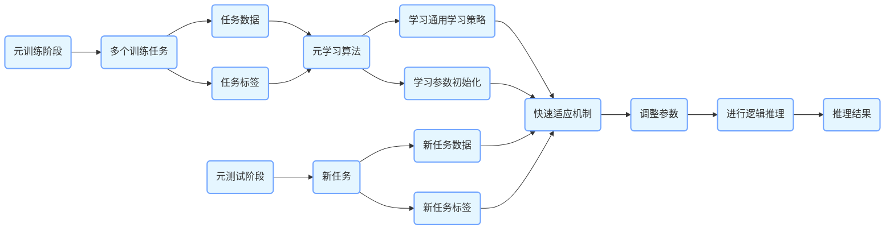

# 持续逻辑推理中元学习技术的长期效果分析

> 关键词：持续逻辑推理、元学习技术、长期效果分析、机器学习、智能系统

> 摘要：本文聚焦于持续逻辑推理中的元学习技术，旨在深入分析其长期效果。首先介绍了研究的背景，包括目的、预期读者、文档结构和相关术语。接着阐述了核心概念与联系，通过文本示意图和Mermaid流程图展示原理和架构。详细讲解了核心算法原理，并给出Python源代码。运用数学模型和公式进一步阐释，辅以具体例子说明。通过项目实战，搭建开发环境，实现并解读源代码。探讨了实际应用场景，推荐了学习资源、开发工具框架和相关论文著作。最后总结了未来发展趋势与挑战，解答常见问题并提供扩展阅读与参考资料，全面剖析了元学习技术在持续逻辑推理中的长期表现。

## 1. 背景介绍 
### 1.1 目的和范围
在当今的人工智能和机器学习领域，持续逻辑推理是一个重要的研究方向。它涉及到系统在不断变化的环境中，持续地进行逻辑思考和决策。元学习技术作为一种能够让模型快速学习新知识和适应新任务的方法，被广泛应用于持续逻辑推理中。本文的目的是深入分析元学习技术在持续逻辑推理中的长期效果，包括其对模型性能、泛化能力、学习效率等方面的影响。研究范围涵盖了元学习技术的基本原理、核心算法，以及在实际项目中的应用案例分析。

### 1.2 预期读者
本文预期读者包括人工智能、机器学习领域的研究人员、工程师和学生。对于正在研究持续逻辑推理或元学习技术的专业人士，本文可以提供深入的理论分析和实践经验；对于初学者，本文可以作为一个系统的学习资料，帮助他们了解元学习技术在持续逻辑推理中的应用和效果。

### 1.3 文档结构概述
本文将按照以下结构进行组织：首先介绍相关背景知识，包括研究目的、预期读者和文档结构。接着阐述核心概念与联系，通过文本示意图和Mermaid流程图展示元学习技术在持续逻辑推理中的原理和架构。然后详细讲解核心算法原理，并给出Python源代码进行说明。运用数学模型和公式进一步解释算法的工作机制，并通过具体例子加深理解。通过项目实战，展示如何在实际中应用元学习技术进行持续逻辑推理，包括开发环境搭建、源代码实现和代码解读。探讨元学习技术在持续逻辑推理中的实际应用场景。推荐相关的学习资源、开发工具框架和论文著作。最后总结未来发展趋势与挑战，解答常见问题并提供扩展阅读与参考资料。

### 1.4 术语表
#### 1.4.1 核心术语定义
- **持续逻辑推理**：指系统在不断变化的环境中，持续地进行逻辑思考和决策的过程。它要求系统能够根据新的信息和任务，动态地调整推理策略和方法。
- **元学习技术**：也称为“学习如何学习”，是一种让模型能够快速学习新知识和适应新任务的方法。元学习通过在多个任务上进行训练，学习到通用的学习策略和参数初始化，从而在面对新任务时能够更快地收敛和达到较好的性能。
- **长期效果**：指元学习技术在持续逻辑推理过程中，随着时间的推移和任务的增加，对模型性能、泛化能力、学习效率等方面产生的综合影响。

#### 1.4.2 相关概念解释
- **机器学习**：是一门多领域交叉学科，涉及概率论、统计学、逼近论、凸分析、算法复杂度理论等多门学科。它专门研究计算机怎样模拟或实现人类的学习行为，以获取新的知识或技能，重新组织已有的知识结构使之不断改善自身的性能。
- **泛化能力**：指模型在未见过的数据上的表现能力。一个具有良好泛化能力的模型能够在不同的数据集和任务上都取得较好的性能。
- **学习效率**：指模型在学习过程中，达到一定性能水平所需的时间和计算资源。学习效率高的模型能够更快地收敛和适应新任务。

#### 1.4.3 缩略词列表
- **ML**：Machine Learning，机器学习
- **Meta - learning**：元学习
- **DL**：Deep Learning，深度学习

## 2. 核心概念与联系 

### 核心概念原理
持续逻辑推理的核心在于系统能够不断地根据新的信息和任务进行逻辑推理。传统的机器学习方法在面对新任务时，往往需要大量的数据和长时间的训练才能达到较好的性能。而元学习技术通过在多个任务上进行训练，学习到通用的学习策略和参数初始化，使得模型能够快速适应新任务。

在持续逻辑推理中，元学习的基本原理是将推理过程分为元训练和元测试两个阶段。在元训练阶段，模型在多个任务上进行训练，学习到通用的学习策略和参数初始化。在元测试阶段，模型面对新的任务时，利用在元训练阶段学习到的知识，快速调整参数，进行逻辑推理。

### 架构的文本示意图
```plaintext
持续逻辑推理系统
|-- 元学习模块
|   |-- 元训练阶段
|   |   |-- 多个训练任务
|   |   |   |-- 任务数据
|   |   |   |-- 任务标签
|   |   |-- 元学习算法
|   |       |-- 学习通用学习策略
|   |       |-- 学习参数初始化
|   |-- 元测试阶段
|       |-- 新任务
|       |   |-- 新任务数据
|       |   |-- 新任务标签
|       |-- 快速适应机制
|           |-- 利用元训练知识调整参数
|           |-- 进行逻辑推理
|-- 逻辑推理模块
|   |-- 推理规则
|   |-- 推理引擎
|   |-- 推理结果
```

### Mermaid流程图


## 3. 核心算法原理 & 具体操作步骤 

### 核心算法原理
在持续逻辑推理中，常用的元学习算法有模型无关元学习（Model - Agnostic Meta - Learning，MAML）。MAML的核心思想是找到一组参数初始化，使得模型在经过少量的梯度更新后，能够在新任务上取得较好的性能。

具体来说，MAML的训练过程分为两个步骤：
1. **内部更新**：对于每个训练任务，使用当前的参数初始化进行一次或多次梯度更新，得到临时参数。
2. **外部更新**：使用所有训练任务的临时参数，计算损失函数的梯度，并更新参数初始化。

### Python源代码实现
```python
import torch
import torch.nn as nn
import torch.optim as optim

# 定义一个简单的神经网络模型
class SimpleNet(nn.Module):
    def __init__(self):
        super(SimpleNet, self).__init__()
        self.fc1 = nn.Linear(10, 20)
        self.fc2 = nn.Linear(20, 1)

    def forward(self, x):
        x = torch.relu(self.fc1(x))
        x = self.fc2(x)
        return x

# 定义MAML算法
def maml(model, tasks, num_inner_steps, inner_lr, outer_lr, num_epochs):
    outer_optimizer = optim.Adam(model.parameters(), lr=outer_lr)

    for epoch in range(num_epochs):
        meta_loss = 0
        for task in tasks:
            # 复制模型参数
            fast_weights = list(model.parameters())

            # 内部更新
            for _ in range(num_inner_steps):
                x, y = task
                logits = model(x)
                loss = nn.MSELoss()(logits, y)
                grads = torch.autograd.grad(loss, fast_weights)
                fast_weights = [w - inner_lr * g for w, g in zip(fast_weights, grads)]

            # 计算外部损失
            x, y = task
            logits = model.forward_with_weights(x, fast_weights)
            task_loss = nn.MSELoss()(logits, y)
            meta_loss += task_loss

        # 外部更新
        outer_optimizer.zero_grad()
        meta_loss.backward()
        outer_optimizer.step()

        if (epoch + 1) % 10 == 0:
            print(f'Epoch {epoch + 1}, Meta Loss: {meta_loss.item()}')

    return model

# 示例使用
model = SimpleNet()
tasks = [(torch.randn(20, 10), torch.randn(20, 1)) for _ in range(5)]
num_inner_steps = 3
inner_lr = 0.01
outer_lr = 0.001
num_epochs = 100

trained_model = maml(model, tasks, num_inner_steps, inner_lr, outer_lr, num_epochs)
```

### 具体操作步骤
1. **定义模型**：定义一个神经网络模型，用于进行逻辑推理。
2. **准备任务数据**：准备多个训练任务，每个任务包含输入数据和标签。
3. **初始化参数**：初始化模型的参数和元学习算法的超参数，如内部学习率、外部学习率、内部更新步数和训练轮数。
4. **进行元训练**：在每个训练轮次中，对于每个训练任务，进行内部更新得到临时参数，然后使用所有任务的临时参数计算外部损失，并更新参数初始化。
5. **元测试**：在面对新任务时，使用训练好的参数初始化，进行少量的梯度更新，然后进行逻辑推理。

## 4. 数学模型和公式 & 详细讲解 & 举例说明 

### 数学模型和公式
在MAML算法中，设 $\theta$ 为模型的参数初始化，对于每个训练任务 $T_i$，其损失函数为 $L_i(\theta)$。

#### 内部更新
在内部更新步骤中，对于每个任务 $T_i$，进行 $k$ 次梯度更新，得到临时参数 $\theta_i'$。每次更新的公式为：
$$\theta_{i}^{(j + 1)}=\theta_{i}^{(j)}-\alpha\nabla_{\theta_{i}^{(j)}}L_i(\theta_{i}^{(j)})$$
其中，$\alpha$ 是内部学习率，$j = 0,1,\cdots,k - 1$，$\theta_{i}^{(0)}=\theta$。

#### 外部更新
在外部更新步骤中，使用所有任务的临时参数 $\theta_i'$ 计算元损失函数 $L_{meta}(\theta)$：
$$L_{meta}(\theta)=\sum_{i = 1}^{N}L_i(\theta_i')$$
然后使用梯度下降法更新参数初始化 $\theta$：
$$\theta\leftarrow\theta-\beta\nabla_{\theta}L_{meta}(\theta)$$
其中，$\beta$ 是外部学习率，$N$ 是训练任务的数量。

### 详细讲解
内部更新的目的是让模型在每个训练任务上快速适应，得到一组针对该任务的临时参数。外部更新的目的是通过调整参数初始化，使得模型在经过内部更新后，能够在多个任务上都取得较好的性能。

### 举例说明
假设我们有两个训练任务 $T_1$ 和 $T_2$，模型的初始参数为 $\theta$。在内部更新步骤中，对于任务 $T_1$，我们进行两次梯度更新：
- 第一次更新：$\theta_{1}^{(1)}=\theta-\alpha\nabla_{\theta}L_1(\theta)$
- 第二次更新：$\theta_{1}^{(2)}=\theta_{1}^{(1)}-\alpha\nabla_{\theta_{1}^{(1)}}L_1(\theta_{1}^{(1)})$

同样，对于任务 $T_2$，我们也进行两次梯度更新得到 $\theta_{2}^{(2)}$。

然后在外部更新步骤中，计算元损失函数：
$$L_{meta}(\theta)=L_1(\theta_{1}^{(2)})+L_2(\theta_{2}^{(2)})$$
最后使用梯度下降法更新参数初始化 $\theta$：
$$\theta\leftarrow\theta-\beta\nabla_{\theta}L_{meta}(\theta)$$

## 5. 项目实战：代码实际案例和详细解释说明 

### 5.1  开发环境搭建
#### 安装Python
首先，确保你已经安装了Python 3.6或更高版本。你可以从Python官方网站（https://www.python.org/downloads/）下载并安装Python。

#### 安装深度学习框架
本文使用PyTorch作为深度学习框架。你可以使用以下命令安装PyTorch：
```bash
pip install torch torchvision
```

#### 安装其他依赖库
还需要安装一些其他的依赖库，如NumPy、Matplotlib等：
```bash
pip install numpy matplotlib
```

### 5.2  源代码详细实现和代码解读
```python
import torch
import torch.nn as nn
import torch.optim as optim
import numpy as np
import matplotlib.pyplot as plt

# 定义一个简单的神经网络模型
class SimpleNet(nn.Module):
    def __init__(self):
        super(SimpleNet, self).__init__()
        self.fc1 = nn.Linear(10, 20)
        self.fc2 = nn.Linear(20, 1)

    def forward(self, x):
        x = torch.relu(self.fc1(x))
        x = self.fc2(x)
        return x

    def forward_with_weights(self, x, weights):
        fc1_weight, fc1_bias, fc2_weight, fc2_bias = weights
        x = torch.relu(torch.matmul(x, fc1_weight) + fc1_bias)
        x = torch.matmul(x, fc2_weight) + fc2_bias
        return x

# 定义MAML算法
def maml(model, tasks, num_inner_steps, inner_lr, outer_lr, num_epochs):
    outer_optimizer = optim.Adam(model.parameters(), lr=outer_lr)

    meta_losses = []

    for epoch in range(num_epochs):
        meta_loss = 0
        for task in tasks:
            # 复制模型参数
            fast_weights = list(model.parameters())

            # 内部更新
            for _ in range(num_inner_steps):
                x, y = task
                logits = model.forward_with_weights(x, fast_weights)
                loss = nn.MSELoss()(logits, y)
                grads = torch.autograd.grad(loss, fast_weights)
                fast_weights = [w - inner_lr * g for w, g in zip(fast_weights, grads)]

            # 计算外部损失
            x, y = task
            logits = model.forward_with_weights(x, fast_weights)
            task_loss = nn.MSELoss()(logits, y)
            meta_loss += task_loss

        # 外部更新
        outer_optimizer.zero_grad()
        meta_loss.backward()
        outer_optimizer.step()

        meta_losses.append(meta_loss.item())

        if (epoch + 1) % 10 == 0:
            print(f'Epoch {epoch + 1}, Meta Loss: {meta_loss.item()}')

    # 绘制元损失曲线
    plt.plot(np.arange(num_epochs), meta_losses)
    plt.xlabel('Epoch')
    plt.ylabel('Meta Loss')
    plt.title('MAML Meta Loss')
    plt.show()

    return model

# 示例使用
model = SimpleNet()
tasks = [(torch.randn(20, 10), torch.randn(20, 1)) for _ in range(5)]
num_inner_steps = 3
inner_lr = 0.01
outer_lr = 0.001
num_epochs = 100

trained_model = maml(model, tasks, num_inner_steps, inner_lr, outer_lr, num_epochs)
```

### 代码解读与分析
#### 模型定义
`SimpleNet` 类定义了一个简单的两层全连接神经网络。`forward` 方法用于前向传播，`forward_with_weights` 方法用于在给定参数的情况下进行前向传播。

#### MAML算法实现
`maml` 函数实现了MAML算法的核心逻辑。在每个训练轮次中，对于每个训练任务，进行内部更新得到临时参数，然后使用所有任务的临时参数计算外部损失，并更新参数初始化。同时，记录每个训练轮次的元损失，并绘制元损失曲线。

#### 示例使用
创建一个 `SimpleNet` 模型实例，生成5个训练任务。设置内部更新步数、内部学习率、外部学习率和训练轮数，调用 `maml` 函数进行训练。

## 6. 实际应用场景 
### 自然语言处理
在自然语言处理中，持续逻辑推理和元学习技术可以用于文本分类、情感分析、问答系统等任务。例如，在文本分类任务中，当出现新的文本类别时，元学习技术可以帮助模型快速适应新的类别，提高分类的准确性。

### 计算机视觉
在计算机视觉中，元学习技术可以用于图像分类、目标检测、图像生成等任务。例如，在图像分类任务中，当遇到新的图像类别时，模型可以利用元学习学到的知识，快速调整参数，实现对新类别的准确分类。

### 机器人控制
在机器人控制中，持续逻辑推理和元学习技术可以帮助机器人快速适应不同的环境和任务。例如，当机器人遇到新的障碍物或任务时，元学习技术可以让机器人快速学习到应对策略，提高机器人的自主性和适应性。

### 医疗诊断
在医疗诊断中，元学习技术可以用于疾病诊断、药物研发等任务。例如，当出现新的疾病类型时，模型可以利用元学习学到的知识，快速分析患者的症状和检查结果，提供准确的诊断建议。

## 7. 工具和资源推荐
### 7.1 学习资源推荐
#### 7.1.1 书籍推荐
- 《深度学习》（Deep Learning）：由Ian Goodfellow、Yoshua Bengio和Aaron Courville所著，是深度学习领域的经典教材，涵盖了深度学习的基本原理、算法和应用。
- 《机器学习》（Machine Learning: A Probabilistic Perspective）：由Kevin P. Murphy所著，从概率的角度介绍了机器学习的基本概念和算法，内容丰富，适合初学者和专业人士阅读。
- 《元学习：理论与实践》（Meta - Learning: Theory and Practice）：专门介绍元学习技术的书籍，详细讲解了元学习的原理、算法和应用。

#### 7.1.2 在线课程
- Coursera上的“深度学习专项课程”（Deep Learning Specialization）：由Andrew Ng教授讲授，包括深度学习的基础、卷积神经网络、循环神经网络等内容，是学习深度学习的经典课程。
- edX上的“人工智能基础”（Introduction to Artificial Intelligence）：介绍了人工智能的基本概念、算法和应用，包括机器学习、自然语言处理、计算机视觉等领域。
- 网易云课堂上的“元学习实战教程”：专门讲解元学习技术的在线课程，通过实际案例让学习者掌握元学习的应用。

#### 7.1.3 技术博客和网站
- Medium：是一个技术博客平台，有很多关于人工智能、机器学习和元学习的优质文章。
- arXiv：是一个预印本平台，提供了大量的学术论文，包括元学习领域的最新研究成果。
- AI开源社区：如GitHub上的一些开源项目，提供了元学习技术的代码实现和案例分析。

### 7.2 开发工具框架推荐
#### 7.2.1 IDE和编辑器
- PyCharm：是一款专门为Python开发设计的集成开发环境，提供了丰富的功能，如代码编辑、调试、版本控制等，适合Python开发者使用。
- Jupyter Notebook：是一个交互式的开发环境，支持Python、R等多种编程语言，适合数据科学和机器学习的开发和实验。
- Visual Studio Code：是一款轻量级的代码编辑器，支持多种编程语言和插件，具有强大的代码编辑和调试功能。

#### 7.2.2 调试和性能分析工具
- PyTorch Profiler：是PyTorch提供的性能分析工具，可以帮助开发者分析模型的训练和推理时间，找出性能瓶颈。
- TensorBoard：是TensorFlow提供的可视化工具，也可以用于PyTorch模型的可视化和调试，支持损失曲线、准确率曲线、模型结构等的可视化。
- cProfile：是Python内置的性能分析工具，可以帮助开发者分析Python代码的执行时间和函数调用关系。

#### 7.2.3 相关框架和库
- PyTorch：是一个开源的深度学习框架，提供了丰富的神经网络层和优化算法，支持GPU加速，适合深度学习的研究和开发。
- TensorFlow：是另一个广泛使用的深度学习框架，具有强大的分布式训练和部署能力，支持多种编程语言。
- scikit - learn：是一个开源的机器学习库，提供了丰富的机器学习算法和工具，如分类、回归、聚类等算法，适合机器学习的入门和实验。

### 7.3 相关论文著作推荐
#### 7.3.1 经典论文
- "Model - Agnostic Meta - Learning for Fast Adaptation of Deep Networks"：提出了模型无关元学习（MAML）算法，是元学习领域的经典论文。
- "Optimization as a Model for Few - Shot Learning"：从优化的角度研究了少样本学习问题，提出了一种基于优化的元学习方法。
- "Meta - Learning with Memory - Augmented Neural Networks"：将记忆增强神经网络应用于元学习，提高了模型的学习能力和泛化能力。

#### 7.3.2 最新研究成果
- 关注arXiv上的最新论文，如关于持续元学习、元强化学习等方面的研究成果。
- 参加人工智能和机器学习领域的顶级会议，如NeurIPS、ICML、CVPR等，了解最新的研究动态。

#### 7.3.3 应用案例分析
- 一些开源项目和技术博客会分享元学习技术在实际应用中的案例分析，如自然语言处理、计算机视觉等领域的应用案例。
- 一些企业和研究机构的官方网站也会发布他们在元学习技术应用方面的成果和经验分享。

## 8. 总结：未来发展趋势与挑战
### 未来发展趋势
- **持续学习能力的提升**：未来的元学习技术将更加注重模型的持续学习能力，能够在不断变化的环境中持续地学习和适应新任务，减少灾难性遗忘的问题。
- **与其他技术的融合**：元学习技术将与强化学习、迁移学习、多模态学习等技术进行深度融合，发挥更大的优势，解决更复杂的问题。
- **应用领域的拓展**：元学习技术将在更多的领域得到应用，如自动驾驶、金融、教育等，为这些领域带来更高效、智能的解决方案。

### 挑战
- **计算资源需求**：元学习算法通常需要大量的计算资源和时间进行训练，如何在有限的计算资源下提高算法的效率是一个挑战。
- **数据隐私和安全**：在元学习中，模型需要在多个任务上进行训练，涉及到大量的数据。如何保护数据的隐私和安全，防止数据泄露是一个重要的问题。
- **理论基础的完善**：目前元学习技术的理论基础还不够完善，需要进一步深入研究其学习机制和性能分析，为算法的设计和优化提供理论支持。

## 9. 附录：常见问题与解答
### 问题1：元学习和传统机器学习有什么区别？
答：传统机器学习在面对新任务时，往往需要大量的数据和长时间的训练才能达到较好的性能。而元学习通过在多个任务上进行训练，学习到通用的学习策略和参数初始化，使得模型能够快速适应新任务，只需要少量的数据和快速的训练就能取得较好的性能。

### 问题2：MAML算法的复杂度如何？
答：MAML算法的复杂度主要取决于内部更新步数、训练任务的数量和模型的复杂度。内部更新步数越多，训练任务数量越多，模型越复杂，算法的复杂度就越高。在实际应用中，需要根据具体情况选择合适的超参数，以平衡算法的性能和复杂度。

### 问题3：元学习技术在实际应用中面临哪些困难？
答：元学习技术在实际应用中面临一些困难，如计算资源需求大、数据隐私和安全问题、理论基础不完善等。此外，元学习算法的性能还受到训练任务的选择、超参数的调整等因素的影响，需要在实际应用中进行仔细的调优。

## 10. 扩展阅读 & 参考资料
### 扩展阅读
- 关于持续学习和灾难性遗忘的相关研究，了解如何提高模型的持续学习能力。
- 关于元强化学习的研究，探索元学习技术在强化学习领域的应用。
- 关于多模态元学习的研究，了解元学习技术在多模态数据处理中的应用。

### 参考资料
- Goodfellow, I., Bengio, Y., & Courville, A. (2016). Deep Learning. MIT Press.
- Murphy, K. P. (2012). Machine Learning: A Probabilistic Perspective. MIT Press.
- Finn, C., Abbeel, P., & Levine, S. (2017). Model - Agnostic Meta - Learning for Fast Adaptation of Deep Networks. arXiv preprint arXiv:1703.03400.

作者：AI天才研究院/AI Genius Institute & 禅与计算机程序设计艺术 /Zen And The Art of Computer Programming