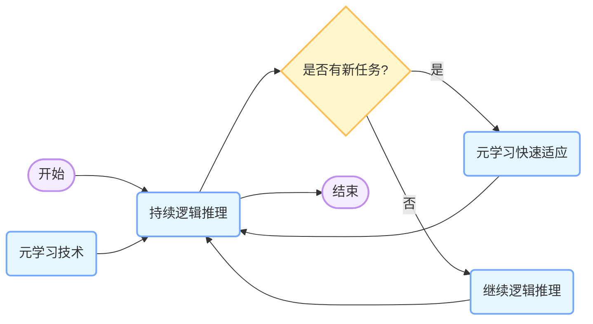

# 持续逻辑推理中元学习技术的长期效果评估

> 关键词：持续逻辑推理、元学习技术、长期效果评估、学习效率、泛化能力

> 摘要：本文聚焦于持续逻辑推理场景下元学习技术的长期效果评估。首先介绍了研究的背景、目的、预期读者等信息，明确了文档的整体结构。接着阐述了持续逻辑推理和元学习技术的核心概念及联系，给出了相应的文本示意图和 Mermaid 流程图。深入分析了核心算法原理，并用 Python 代码进行详细说明。同时，介绍了相关的数学模型和公式，并举例解释。通过项目实战，搭建开发环境，实现源代码并进行解读。探讨了该技术的实际应用场景，推荐了学习资源、开发工具框架以及相关论文著作。最后总结了未来发展趋势与挑战，提供了常见问题解答和扩展阅读参考资料，旨在为研究和应用元学习技术于持续逻辑推理领域提供全面且深入的指导。

## 1. 背景介绍 
### 1.1 目的和范围
在当今复杂多变的环境中，智能系统需要具备持续学习和逻辑推理的能力。元学习技术作为一种能够快速学习新知识、适应新任务的方法，被广泛应用于持续逻辑推理场景。然而，目前对于元学习技术在持续逻辑推理中的长期效果缺乏系统的评估。本研究的目的就是建立一套科学的评估体系，全面评估元学习技术在持续逻辑推理中的长期效果，包括学习效率、泛化能力、稳定性等方面。研究范围涵盖了多种常见的元学习算法和持续逻辑推理任务，旨在为实际应用提供有价值的参考。

### 1.2 预期读者
本文的预期读者包括人工智能领域的研究人员、工程师、研究生等。对于希望深入了解元学习技术在持续逻辑推理中应用的专业人士，本文提供了详细的理论分析和实践指导；对于正在进行相关研究的研究生，本文可以作为研究的参考资料，帮助他们更好地设计实验和分析结果。

### 1.3 文档结构概述
本文共分为十个部分。第一部分为背景介绍，阐述了研究的目的、范围、预期读者和文档结构。第二部分介绍持续逻辑推理和元学习技术的核心概念及联系，给出了相应的示意图和流程图。第三部分详细讲解核心算法原理，并使用 Python 代码进行说明。第四部分介绍相关的数学模型和公式，并举例说明。第五部分通过项目实战，搭建开发环境，实现源代码并进行解读。第六部分探讨实际应用场景。第七部分推荐学习资源、开发工具框架和相关论文著作。第八部分总结未来发展趋势与挑战。第九部分为附录，提供常见问题解答。第十部分列出扩展阅读和参考资料。

### 1.4 术语表
#### 1.4.1 核心术语定义
- **持续逻辑推理**：指智能系统在不断接收新信息的过程中，持续进行逻辑推理以解决各种问题的能力。它要求系统能够随着时间的推移，不断学习和适应新的任务和环境。
- **元学习技术**：也称为“学习如何学习”，是一种让模型在多个任务上进行训练，从而学会快速适应新任务的技术。元学习的目标是提高模型的学习效率和泛化能力。
- **长期效果评估**：对元学习技术在持续逻辑推理过程中的性能进行长时间的监测和分析，评估其在学习效率、泛化能力、稳定性等方面的表现。

#### 1.4.2 相关概念解释
- **学习效率**：指模型在学习新任务时所需的时间和资源，通常用训练步数、收敛速度等指标来衡量。
- **泛化能力**：指模型在未见过的任务上的表现能力，即模型能够将在训练任务上学到的知识迁移到新任务上的能力。
- **稳定性**：指模型在持续学习过程中的性能波动情况，稳定的模型能够在不同的任务和环境下保持较好的性能。

#### 1.4.3 缩略词列表
- **MAML**：Model-Agnostic Meta-Learning，模型无关元学习
- **FOMAML**：First-Order Model-Agnostic Meta-Learning，一阶模型无关元学习
- **Reptile**：一种基于梯度的元学习算法

## 2. 核心概念与联系 
### 持续逻辑推理的概念
持续逻辑推理是智能系统在动态环境中不断进行知识更新和推理的过程。在实际应用中，系统需要面对不断变化的任务和数据，例如机器人在执行任务过程中需要根据新的环境信息进行实时决策，自然语言处理系统需要处理不同主题和风格的文本。持续逻辑推理要求系统能够在不断学习新信息的同时，保持对已有知识的记忆和利用，以实现高效准确的推理。

### 元学习技术的概念
元学习技术的核心思想是让模型学习如何学习。传统的机器学习方法通常是在一个固定的数据集上进行训练，而元学习则是在多个不同的任务上进行训练，让模型学会如何快速适应新的任务。元学习可以分为基于模型的元学习、基于优化的元学习和基于度量的元学习等不同类型。

### 持续逻辑推理与元学习技术的联系
元学习技术为持续逻辑推理提供了有效的解决方案。在持续逻辑推理场景中，元学习可以帮助模型快速适应新的任务和环境，提高学习效率和泛化能力。例如，在多步逻辑推理任务中，元学习可以让模型学会如何根据已有的推理步骤和知识，快速推导出下一步的结果。同时，持续逻辑推理也为元学习技术的研究提供了新的挑战和应用场景，促使元学习技术不断发展和完善。

### 文本示意图
```plaintext
持续逻辑推理
|
|-- 不断接收新信息
|-- 知识更新
|-- 逻辑推理

元学习技术
|
|-- 多任务训练
|-- 快速适应新任务
|-- 学习如何学习

联系：元学习技术帮助持续逻辑推理提高效率和泛化能力，持续逻辑推理为元学习提供应用场景
```

### Mermaid 流程图


## 3. 核心算法原理 & 具体操作步骤 
### 基于优化的元学习算法原理
基于优化的元学习算法是元学习中常用的一类算法，其中最具代表性的是 MAML（Model-Agnostic Meta-Learning）算法。MAML 的核心思想是找到一个初始参数，使得模型在经过少量的梯度更新后，能够在新的任务上取得较好的性能。

#### MAML 算法步骤
1. **初始化模型参数 $\theta$**：随机初始化模型的参数 $\theta$。
2. **采样任务集 $\mathcal{T}$**：从任务分布 $\mathcal{P}(\mathcal{T})$ 中采样一组任务 $\mathcal{T} = \{T_1, T_2, \cdots, T_n\}$。
3. **对于每个任务 $T_i$**：
    - **采样支持集 $S_i$ 和查询集 $Q_i$**：从任务 $T_i$ 中采样支持集 $S_i$ 和查询集 $Q_i$。
    - **在支持集上进行梯度更新**：使用支持集 $S_i$ 计算梯度 $\nabla_{\theta} L_{T_i}(\theta)$，并更新参数 $\theta'_i = \theta - \alpha \nabla_{\theta} L_{T_i}(\theta)$，其中 $\alpha$ 是学习率。
    - **在查询集上计算损失**：使用更新后的参数 $\theta'_i$ 在查询集 $Q_i$ 上计算损失 $L_{T_i}(\theta'_i)$。
4. **计算元损失**：将所有任务的查询集损失相加，得到元损失 $\mathcal{L}(\theta) = \sum_{i=1}^{n} L_{T_i}(\theta'_i)$。
5. **更新模型参数**：使用元损失 $\mathcal{L}(\theta)$ 计算梯度 $\nabla_{\theta} \mathcal{L}(\theta)$，并更新模型参数 $\theta = \theta - \beta \nabla_{\theta} \mathcal{L}(\theta)$，其中 $\beta$ 是元学习率。

### Python 代码实现
```python
import torch
import torch.nn as nn
import torch.optim as optim

# 定义一个简单的神经网络模型
class SimpleModel(nn.Module):
    def __init__(self, input_size, hidden_size, output_size):
        super(SimpleModel, self).__init__()
        self.fc1 = nn.Linear(input_size, hidden_size)
        self.relu = nn.ReLU()
        self.fc2 = nn.Linear(hidden_size, output_size)

    def forward(self, x):
        out = self.fc1(x)
        out = self.relu(out)
        out = self.fc2(out)
        return out

# MAML 算法实现
def maml(model, tasks, alpha, beta, num_inner_steps, num_outer_steps):
    optimizer = optim.Adam(model.parameters(), lr=beta)
    for outer_step in range(num_outer_steps):
        meta_loss = 0
        for task in tasks:
            # 复制模型参数
            fast_weights = list(model.parameters())
            support_set, query_set = task
            for inner_step in range(num_inner_steps):
                # 在支持集上进行梯度更新
                loss = nn.CrossEntropyLoss()(model(torch.tensor(support_set[0])), torch.tensor(support_set[1]))
                grads = torch.autograd.grad(loss, fast_weights)
                fast_weights = [w - alpha * g for w, g in zip(fast_weights, grads)]
            # 在查询集上计算损失
            query_loss = nn.CrossEntropyLoss()(model(torch.tensor(query_set[0], requires_grad=False)), torch.tensor(query_set[1], requires_grad=False))
            meta_loss += query_loss
        # 更新模型参数
        optimizer.zero_grad()
        meta_loss.backward()
        optimizer.step()
    return model

# 示例使用
input_size = 10
hidden_size = 20
output_size = 5
model = SimpleModel(input_size, hidden_size, output_size)
tasks = [([torch.randn(10, input_size), torch.randint(0, output_size, (10,))], [torch.randn(5, input_size), torch.randint(0, output_size, (5,))]) for _ in range(5)]
alpha = 0.01
beta = 0.001
num_inner_steps = 5
num_outer_steps = 10
trained_model = maml(model, tasks, alpha, beta, num_inner_steps, num_outer_steps)
```

### 代码解释
1. **模型定义**：定义了一个简单的两层神经网络模型 `SimpleModel`。
2. **MAML 算法实现**：`maml` 函数实现了 MAML 算法的核心步骤。在每个外层迭代中，遍历所有任务，对于每个任务，先在支持集上进行多次内层迭代的梯度更新，得到快速适应的参数，然后在查询集上计算损失，将所有任务的查询集损失相加得到元损失，最后使用元损失更新模型参数。
3. **示例使用**：创建了一个示例模型和一组示例任务，设置了学习率和迭代次数，调用 `maml` 函数进行训练。

## 4. 数学模型和公式 & 详细讲解 & 举例说明 
### MAML 算法的数学模型
MAML 算法的目标是找到一个初始参数 $\theta$，使得模型在经过少量的梯度更新后，能够在新的任务上取得较好的性能。具体来说，MAML 的目标函数可以表示为：

$$
\min_{\theta} \sum_{T \sim \mathcal{P}(\mathcal{T})} L_T(\theta'_T)
$$

其中，$\mathcal{P}(\mathcal{T})$ 是任务分布，$L_T(\theta'_T)$ 是在任务 $T$ 上使用更新后的参数 $\theta'_T$ 计算的损失。$\theta'_T$ 是通过在任务 $T$ 的支持集上进行一次或多次梯度更新得到的，更新公式为：

$$
\theta'_T = \theta - \alpha \nabla_{\theta} L_T(\theta)
$$

其中，$\alpha$ 是学习率。

### 详细讲解
MAML 算法的核心思想是通过在多个任务上进行训练，让模型学会如何快速适应新的任务。在训练过程中，模型首先在支持集上进行梯度更新，得到快速适应的参数 $\theta'_T$，然后在查询集上计算损失，将所有任务的查询集损失相加得到元损失，最后使用元损失更新模型的初始参数 $\theta$。这样，模型的初始参数 $\theta$ 就能够在不同的任务上快速收敛，提高学习效率和泛化能力。

### 举例说明
假设我们有一个分类任务，输入是一个二维向量，输出是一个类别标签。我们使用 MAML 算法进行训练，模型的初始参数为 $\theta$。在每个外层迭代中，我们从任务分布中采样一组任务，对于每个任务，我们采样支持集和查询集。假设我们有一个任务 $T$，支持集为 $\{(x_1, y_1), (x_2, y_2), \cdots, (x_n, y_n)\}$，查询集为 $\{(x_{n+1}, y_{n+1}), (x_{n+2}, y_{n+2}), \cdots, (x_m, y_m)\}$。

首先，我们在支持集上计算损失 $L_T(\theta)$，并根据梯度更新公式得到更新后的参数 $\theta'_T = \theta - \alpha \nabla_{\theta} L_T(\theta)$。然后，我们在查询集上计算损失 $L_T(\theta'_T)$。将所有任务的查询集损失相加得到元损失 $\mathcal{L}(\theta)$，最后使用元损失更新模型的初始参数 $\theta$。

通过多次迭代，模型的初始参数 $\theta$ 会逐渐优化，使得模型在新的任务上能够快速适应，提高分类准确率。

## 5. 项目实战：代码实际案例和详细解释说明 
### 5.1  开发环境搭建
#### 操作系统
建议使用 Linux 系统，如 Ubuntu 18.04 或更高版本，因为 Linux 系统在机器学习开发中具有较好的稳定性和兼容性。

#### Python 环境
使用 Python 3.7 或更高版本，可以通过 Anaconda 来管理 Python 环境。安装 Anaconda 后，创建一个新的虚拟环境：
```bash
conda create -n meta_learning python=3.8
conda activate meta_learning
```

#### 深度学习框架
使用 PyTorch 作为深度学习框架，可以通过以下命令安装：
```bash
pip install torch torchvision
```

#### 其他依赖库
安装其他必要的依赖库，如 NumPy、Matplotlib 等：
```bash
pip install numpy matplotlib
```

### 5.2  源代码详细实现和代码解读
#### 数据集生成
首先，我们需要生成一个用于元学习的数据集。假设我们要解决的是一个分类问题，我们可以生成多个不同的分类任务，每个任务有自己的训练集和测试集。

```python
import numpy as np

# 生成一个分类任务的数据集
def generate_task(num_classes, num_samples_per_class, input_dim):
    train_X = []
    train_y = []
    test_X = []
    test_y = []
    for class_id in range(num_classes):
        class_mean = np.random.randn(input_dim)
        train_samples = np.random.randn(num_samples_per_class, input_dim) + class_mean
        test_samples = np.random.randn(num_samples_per_class // 2, input_dim) + class_mean
        train_X.extend(train_samples)
        train_y.extend([class_id] * num_samples_per_class)
        test_X.extend(test_samples)
        test_y.extend([class_id] * (num_samples_per_class // 2))
    train_X = np.array(train_X)
    train_y = np.array(train_y)
    test_X = np.array(test_X)
    test_y = np.array(test_y)
    return (train_X, train_y), (test_X, test_y)

# 生成多个任务的数据集
def generate_tasks(num_tasks, num_classes, num_samples_per_class, input_dim):
    tasks = []
    for _ in range(num_tasks):
        train, test = generate_task(num_classes, num_samples_per_class, input_dim)
        tasks.append((train, test))
    return tasks
```

#### 模型定义
我们使用一个简单的全连接神经网络作为模型。

```python
import torch
import torch.nn as nn

class SimpleClassifier(nn.Module):
    def __init__(self, input_dim, hidden_dim, num_classes):
        super(SimpleClassifier, self).__init__()
        self.fc1 = nn.Linear(input_dim, hidden_dim)
        self.relu = nn.ReLU()
        self.fc2 = nn.Linear(hidden_dim, num_classes)

    def forward(self, x):
        x = self.fc1(x)
        x = self.relu(x)
        x = self.fc2(x)
        return x
```

#### MAML 训练代码
```python
import torch.optim as optim

def maml_train(model, tasks, alpha, beta, num_inner_steps, num_outer_steps):
    optimizer = optim.Adam(model.parameters(), lr=beta)
    for outer_step in range(num_outer_steps):
        meta_loss = 0
        for task in tasks:
            (train_X, train_y), (test_X, test_y) = task
            train_X = torch.tensor(train_X, dtype=torch.float32)
            train_y = torch.tensor(train_y, dtype=torch.long)
            test_X = torch.tensor(test_X, dtype=torch.float32)
            test_y = torch.tensor(test_y, dtype=torch.long)
            fast_weights = list(model.parameters())
            for inner_step in range(num_inner_steps):
                logits = model(train_X)
                loss = nn.CrossEntropyLoss()(logits, train_y)
                grads = torch.autograd.grad(loss, fast_weights)
                fast_weights = [w - alpha * g for w, g in zip(fast_weights, grads)]
            test_logits = model(test_X)
            test_loss = nn.CrossEntropyLoss()(test_logits, test_y)
            meta_loss += test_loss
        optimizer.zero_grad()
        meta_loss.backward()
        optimizer.step()
    return model
```

#### 主函数
```python
if __name__ == "__main__":
    num_tasks = 10
    num_classes = 5
    num_samples_per_class = 20
    input_dim = 10
    hidden_dim = 20
    alpha = 0.01
    beta = 0.001
    num_inner_steps = 5
    num_outer_steps = 10

    tasks = generate_tasks(num_tasks, num_classes, num_samples_per_class, input_dim)
    model = SimpleClassifier(input_dim, hidden_dim, num_classes)
    trained_model = maml_train(model, tasks, alpha, beta, num_inner_steps, num_outer_steps)
    print("Training completed!")
```

### 5.3  代码解读与分析
#### 数据集生成
`generate_task` 函数用于生成一个分类任务的数据集，每个类别有一定数量的样本，样本的特征是从高斯分布中采样得到的。`generate_tasks` 函数则用于生成多个任务的数据集。

#### 模型定义
`SimpleClassifier` 是一个简单的全连接神经网络，包含一个隐藏层和一个输出层，使用 ReLU 作为激活函数。

#### MAML 训练代码
`maml_train` 函数实现了 MAML 算法的训练过程。在每个外层迭代中，遍历所有任务，对于每个任务，先在训练集上进行多次内层迭代的梯度更新，得到快速适应的参数，然后在测试集上计算损失，将所有任务的测试集损失相加得到元损失，最后使用元损失更新模型的参数。

#### 主函数
在主函数中，我们设置了一些参数，生成了数据集，创建了模型，并调用 `maml_train` 函数进行训练。

通过这个项目实战，我们可以看到如何使用 MAML 算法进行元学习，以及如何在持续逻辑推理场景中应用元学习技术。

## 6. 实际应用场景 
### 自然语言处理
在自然语言处理中，持续逻辑推理和元学习技术可以应用于多个方面。例如，在问答系统中，系统需要根据用户的问题进行逻辑推理，从大量的文本数据中找到答案。元学习技术可以帮助系统快速适应不同领域和类型的问题，提高问答的准确性和效率。在文本生成任务中，如故事生成、诗歌创作等，元学习可以让模型学习到不同风格和主题的文本生成方式，从而生成更加多样化和高质量的文本。

### 计算机视觉
在计算机视觉领域，持续逻辑推理和元学习技术也有广泛的应用。例如，在目标检测任务中，系统需要不断学习新的目标类别和特征，元学习可以帮助模型快速适应新的目标检测任务，提高检测的准确率和速度。在图像分割任务中，元学习可以让模型学习到不同类型图像的分割模式，从而在不同的图像数据集上取得更好的分割效果。

### 机器人技术
在机器人技术中，持续逻辑推理和元学习技术可以帮助机器人更好地适应复杂多变的环境。例如，机器人在执行任务过程中需要不断感知环境信息，进行逻辑推理和决策。元学习可以让机器人快速学习新的任务和技能，提高机器人的智能水平和适应性。在机器人导航任务中，元学习可以帮助机器人学习到不同环境下的导航策略，从而更加高效地完成导航任务。

### 医疗领域
在医疗领域，持续逻辑推理和元学习技术可以应用于疾病诊断、治疗方案推荐等方面。例如，医生在诊断疾病时需要综合考虑患者的症状、病史、检查结果等信息，进行逻辑推理和判断。元学习可以帮助医疗系统快速学习新的疾病诊断知识和治疗方法，提高诊断的准确性和治疗的效果。在药物研发过程中，元学习可以帮助研究人员快速筛选出有潜力的药物分子，提高药物研发的效率。

## 7. 工具和资源推荐
### 7.1 学习资源推荐
#### 7.1.1 书籍推荐
- 《深度学习》（Deep Learning）：由 Ian Goodfellow、Yoshua Bengio 和 Aaron Courville 所著，是深度学习领域的经典教材，涵盖了深度学习的基本概念、算法和应用。
- 《机器学习》（Machine Learning: A Probabilistic Perspective）：作者是 Kevin P. Murphy，这本书从概率的角度介绍了机器学习的各种算法和模型，对于理解机器学习的原理和方法非常有帮助。
- 《元学习：理论与实践》（Meta-Learning: Theory and Practice）：系统介绍了元学习的基本概念、算法和应用，是学习元学习技术的重要参考书籍。

#### 7.1.2 在线课程
- Coursera 上的“深度学习专项课程”（Deep Learning Specialization）：由 Andrew Ng 教授授课，包括深度学习的基础知识、卷积神经网络、循环神经网络等内容，是学习深度学习的优质在线课程。
- edX 上的“强化学习基础”（Fundamentals of Reinforcement Learning）：介绍了强化学习的基本概念、算法和应用，对于理解持续学习和决策问题有很大帮助。
- 中国大学 MOOC 上的“人工智能：模型与算法”：由清华大学的邓志东教授授课，涵盖了人工智能的多个领域，包括机器学习、深度学习、自然语言处理等，内容丰富全面。

#### 7.1.3 技术博客和网站
- Medium：是一个技术博客平台，上面有很多关于人工智能、机器学习和元学习的优秀文章，作者来自不同的领域和背景，可以提供不同的视角和思路。
- arXiv：是一个预印本数据库，包含了大量的学术论文，其中很多论文涉及到元学习和持续逻辑推理的最新研究成果，可以及时了解该领域的前沿动态。
- OpenAI 博客：OpenAI 是人工智能领域的知名研究机构，其博客上发布了很多关于人工智能技术的研究成果和应用案例，对于学习和了解人工智能技术有很大的帮助。

### 7.2 开发工具框架推荐
#### 7.2.1 IDE和编辑器
- PyCharm：是一款专门为 Python 开发设计的集成开发环境（IDE），具有强大的代码编辑、调试、自动完成等功能，非常适合机器学习和深度学习项目的开发。
- Jupyter Notebook：是一个交互式的开发环境，可以在浏览器中编写和运行代码，同时可以插入文本、图片、公式等内容，方便进行代码演示和数据分析。
- Visual Studio Code：是一款轻量级的代码编辑器，支持多种编程语言和插件，具有丰富的扩展功能，可以满足不同的开发需求。

#### 7.2.2 调试和性能分析工具
- TensorBoard：是 TensorFlow 提供的一个可视化工具，可以用于可视化训练过程中的损失函数、准确率、梯度等信息，帮助开发者更好地理解模型的训练过程和性能。
- PyTorch Profiler：是 PyTorch 提供的一个性能分析工具，可以用于分析模型的运行时间、内存使用情况等，帮助开发者优化模型的性能。
- cProfile：是 Python 标准库中的一个性能分析工具，可以用于分析 Python 代码的运行时间和函数调用情况，帮助开发者找出代码中的性能瓶颈。

#### 7.2.3 相关框架和库
- PyTorch：是一个开源的深度学习框架，具有动态图、易于使用等特点，广泛应用于机器学习和深度学习领域。
- TensorFlow：是另一个知名的开源深度学习框架，具有强大的分布式训练和部署能力，被很多企业和研究机构广泛使用。
- Scikit-learn：是一个用于机器学习的 Python 库，提供了丰富的机器学习算法和工具，如分类、回归、聚类等，非常适合初学者学习和实践。

### 7.3 相关论文著作推荐
#### 7.3.1 经典论文
- "Model-Agnostic Meta-Learning for Fast Adaptation of Deep Networks"：介绍了 MAML 算法，是元学习领域的经典论文之一。
- "Matching Networks for One Shot Learning"：提出了基于度量的元学习方法，为元学习的研究提供了新的思路。
- "Reptile: A Scalable Metalearning Algorithm"：提出了 Reptile 算法，是一种简单高效的元学习算法。

#### 7.3.2 最新研究成果
- 在 arXiv 上搜索“meta learning in continuous logical reasoning”可以找到很多关于持续逻辑推理中元学习技术的最新研究论文，这些论文通常包含了最新的算法和实验结果。
- 参加人工智能领域的顶级会议，如 NeurIPS、ICML、CVPR 等，这些会议上会有很多关于元学习和持续逻辑推理的最新研究成果展示。

#### 7.3.3 应用案例分析
- 一些知名企业和研究机构会发布关于元学习技术在实际应用中的案例分析报告，如 Google、Facebook、OpenAI 等。这些案例分析可以帮助我们了解元学习技术在不同领域的应用场景和效果。

## 8. 总结：未来发展趋势与挑战
### 未来发展趋势
#### 多模态融合
未来，持续逻辑推理中元学习技术将与多模态数据融合，如将图像、文本、语音等多种数据模态结合起来进行学习和推理。这样可以让模型从多个角度获取信息，提高逻辑推理的准确性和泛化能力。例如，在智能客服系统中，结合文本和语音信息可以更好地理解用户的需求，提供更加准确的回答。

#### 强化学习与元学习的结合
强化学习可以让模型在动态环境中进行决策和学习，而元学习可以帮助模型快速适应新的任务和环境。将强化学习与元学习相结合，可以让模型在持续逻辑推理中更加智能和灵活。例如，在机器人导航任务中，结合强化学习和元学习可以让机器人更快地学习到最优的导航策略。

#### 自监督学习与元学习的结合
自监督学习可以从无标签数据中学习到有用的特征和知识，而元学习可以让模型快速适应新的任务。将自监督学习与元学习相结合，可以在数据有限的情况下提高模型的学习效率和泛化能力。例如，在医疗影像诊断中，结合自监督学习和元学习可以让模型从大量的无标签影像数据中学习到有用的特征，从而在有标签数据较少的情况下也能取得较好的诊断效果。

### 挑战
#### 数据质量和数量
在持续逻辑推理场景中，数据的质量和数量对元学习技术的效果有很大影响。高质量的数据可以帮助模型学习到更准确的知识和模式，而足够数量的数据可以保证模型的泛化能力。然而，在实际应用中，获取高质量和足够数量的数据往往是一个挑战。例如，在一些特定领域，如医疗、金融等，数据的获取和标注成本很高，而且数据的隐私和安全问题也需要考虑。

#### 计算资源和时间成本
元学习技术通常需要在多个任务上进行训练，计算量较大，对计算资源的要求较高。同时，训练过程也比较耗时，需要花费大量的时间和精力。如何在有限的计算资源和时间内提高元学习技术的效率是一个亟待解决的问题。例如，通过优化算法、并行计算等方法来减少计算量和训练时间。

#### 模型可解释性
元学习模型通常是复杂的深度学习模型，其决策过程和推理机制往往难以解释。在一些对可解释性要求较高的领域，如医疗、金融等，模型的可解释性是一个重要的问题。如何提高元学习模型的可解释性，让人们更好地理解模型的决策过程和推理机制，是未来研究的一个重要方向。

## 9. 附录：常见问题与解答
### 1. 元学习和传统机器学习有什么区别？
传统机器学习通常是在一个固定的数据集上进行训练，模型学习到的知识和技能是针对该数据集的。而元学习是在多个不同的任务上进行训练，让模型学会如何快速适应新的任务。元学习的目标是提高模型的学习效率和泛化能力，能够在新的任务上快速收敛，而传统机器学习在面对新任务时可能需要重新训练。

### 2. MAML 算法的复杂度如何？
MAML 算法的复杂度主要取决于模型的复杂度、任务的数量和每个任务的样本数量。在每次外层迭代中，需要对每个任务进行内层迭代的梯度更新，因此计算量较大。特别是当任务数量较多或者模型较复杂时，计算复杂度会显著增加。为了降低计算复杂度，可以采用一阶近似的方法，如 FOMAML 算法。

### 3. 如何评估元学习技术在持续逻辑推理中的长期效果？
可以从多个方面评估元学习技术在持续逻辑推理中的长期效果，包括学习效率、泛化能力、稳定性等。学习效率可以用训练步数、收敛速度等指标来衡量；泛化能力可以通过在未见过的任务上的表现来评估；稳定性可以观察模型在持续学习过程中的性能波动情况。此外，还可以通过对比实验，将元学习技术与传统机器学习方法进行比较，来评估其优势和不足。

### 4. 元学习技术在实际应用中有哪些限制？
元学习技术在实际应用中存在一些限制，如数据质量和数量的要求较高、计算资源和时间成本较大、模型可解释性较差等。此外，元学习模型的训练过程比较复杂，需要合理设置参数和调整算法，否则可能会导致模型性能不佳。在实际应用中，需要根据具体的任务和场景，综合考虑这些限制因素，选择合适的方法和技术。

## 10. 扩展阅读 & 参考资料
### 扩展阅读
- "Few-Shot Learning with Meta-Learned Transformers"：介绍了如何将元学习与Transformer 模型相结合，用于少样本学习任务。
- "Meta-Learning with Memory-Augmented Neural Networks"：提出了一种基于记忆增强神经网络的元学习方法，提高了模型的学习能力和泛化能力。
- "Continual Learning in Neural Networks"：探讨了神经网络中的持续学习问题，包括持续学习的挑战和解决方案。

### 参考资料
- Finn, C., Abbeel, P., & Levine, S. (2017). Model-Agnostic Meta-Learning for Fast Adaptation of Deep Networks. Proceedings of the 34th International Conference on Machine Learning-Volume 70.
- Vinyals, O., Blundell, C., Lillicrap, T., Wierstra, D., & others. (2016). Matching Networks for One Shot Learning. Advances in neural information processing systems.
- Nichol, A., Achiam, J., & Schulman, J. (2018). Reptile: A Scalable Metalearning Algorithm. arXiv preprint arXiv:1803.02999.

作者：AI天才研究院/AI Genius Institute & 禅与计算机程序设计艺术 /Zen And The Art of Computer Programming