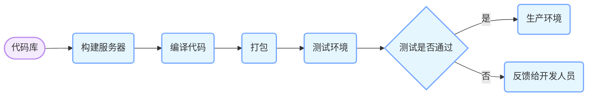

# 持续集成与部署：AI Agent的开发流程优化

> 关键词：持续集成，持续部署，AI Agent，开发流程优化，自动化测试

> 摘要：本文深入探讨了如何利用持续集成与部署（CI/CD）技术来优化AI Agent的开发流程。首先介绍了相关背景知识，包括目的、预期读者等内容。接着详细阐述了持续集成与部署以及AI Agent的核心概念和它们之间的联系，通过文本示意图和Mermaid流程图进行清晰展示。然后讲解了核心算法原理，结合Python代码进行说明，同时给出了相关数学模型和公式，并举例分析。通过项目实战部分，展示了如何搭建开发环境、实现源代码以及对代码进行解读。还探讨了实际应用场景，推荐了相关的工具和资源，最后总结了未来发展趋势与挑战，提供了常见问题解答和扩展阅读参考资料，旨在帮助开发者更好地利用CI/CD提升AI Agent开发效率和质量。

## 1. 背景介绍 
### 1.1 目的和范围
在当今的软件开发领域，AI Agent的应用越来越广泛，从智能客服到自动驾驶等各个领域都有其身影。然而，AI Agent的开发过程往往较为复杂，涉及到大量的数据处理、模型训练和调优等工作。持续集成与部署（CI/CD）作为一种现代软件开发实践，能够有效提高开发效率、保证软件质量。本文的目的就是探讨如何将CI/CD应用到AI Agent的开发流程中，实现开发流程的优化。范围涵盖了从CI/CD和AI Agent的基本概念到具体的算法原理、项目实战、应用场景以及相关工具资源等方面。

### 1.2 预期读者
本文预期读者包括软件开发人员、AI工程师、软件架构师、CTO等对AI Agent开发和CI/CD技术感兴趣的专业人士。无论是初学者想要了解相关基础知识，还是有一定经验的开发者希望进一步优化开发流程，都能从本文中获得有价值的信息。

### 1.3 文档结构概述
本文将按照以下结构进行阐述：首先介绍背景知识，包括目的、预期读者和文档结构等；接着讲解持续集成与部署和AI Agent的核心概念以及它们之间的联系；然后详细说明核心算法原理和具体操作步骤，同时给出相关数学模型和公式；通过项目实战展示如何在实际中应用这些技术；探讨实际应用场景；推荐相关的工具和资源；最后总结未来发展趋势与挑战，提供常见问题解答和扩展阅读参考资料。

### 1.4 术语表
#### 1.4.1 核心术语定义
- **持续集成（Continuous Integration，CI）**：开发团队成员频繁地将代码集成到共享代码库中，每次集成都通过自动化构建和测试来验证，确保代码的正确性和兼容性。
- **持续部署（Continuous Deployment，CD）**：在持续集成的基础上，将通过测试的代码自动部署到生产环境中，实现软件的快速交付。
- **AI Agent**：一种能够感知环境、根据自身的目标和规则进行决策并采取行动的人工智能实体。

#### 1.4.2 相关概念解释
- **自动化测试**：使用自动化工具执行测试用例，对软件的功能、性能等方面进行验证，减少人工测试的工作量和误差。
- **代码库**：用于存储软件开发过程中的代码文件的仓库，常见的有Git仓库。
- **构建工具**：用于将源代码转换为可执行文件或部署包的工具，如Maven、Gradle等。

#### 1.4.3 缩略词列表
- **CI**：Continuous Integration（持续集成）
- **CD**：Continuous Deployment（持续部署）

## 2. 核心概念与联系 

### 持续集成与部署的原理和架构
持续集成与部署的核心思想是将软件开发过程中的各个环节自动化，减少人工干预，提高开发效率和软件质量。其基本架构通常包括代码库、构建服务器、测试环境和生产环境等部分。

#### 文本示意图
代码库（如Git）存储开发人员编写的代码。当开发人员提交代码到代码库后，构建服务器会自动检测到代码的变化，触发构建过程。构建过程包括编译代码、打包等操作。构建完成后，将生成的软件包部署到测试环境中进行自动化测试。如果测试通过，软件包将被自动部署到生产环境中。

#### Mermaid流程图


### AI Agent的原理和架构
AI Agent通常由感知模块、决策模块和行动模块组成。感知模块负责收集环境信息，决策模块根据收集到的信息和自身的目标、规则进行决策，行动模块根据决策结果采取相应的行动。

#### 文本示意图
AI Agent的感知模块通过传感器等设备收集环境数据，如图像、声音、温度等。决策模块将这些数据进行处理和分析，利用机器学习、深度学习等算法进行决策。行动模块根据决策结果控制执行器，如机器人的手臂、车辆的方向盘等，采取相应的行动。

#### Mermaid流程图


### 持续集成与部署和AI Agent的联系
将持续集成与部署应用到AI Agent的开发流程中，可以实现AI Agent代码的快速迭代和部署。通过持续集成，开发人员可以频繁地将新的代码集成到代码库中，及时发现和解决代码中的问题。通过持续部署，训练好的AI Agent模型可以快速部署到生产环境中，提高AI Agent的应用效率。例如，在AI Agent的开发过程中，每次对模型的参数进行调整或添加新的功能后，都可以通过持续集成和部署的流程，快速验证和部署新的模型。

## 3. 核心算法原理 & 具体操作步骤 

### 持续集成的核心算法原理及Python代码实现
持续集成的核心是在每次代码提交后自动进行构建和测试。以下是一个简单的Python脚本示例，用于模拟持续集成的过程。假设我们使用Git作为代码库，使用pytest作为测试框架。

```python
import subprocess

def clone_repository(repo_url, local_path):
    """
    克隆代码仓库
    :param repo_url: 代码仓库的URL
    :param local_path: 本地存储路径
    """
    try:
        subprocess.run(['git', 'clone', repo_url, local_path], check=True)
        print(f"成功克隆代码仓库到 {local_path}")
    except subprocess.CalledProcessError as e:
        print(f"克隆代码仓库失败: {e}")

def build_project(project_path):
    """
    构建项目
    :param project_path: 项目的本地路径
    """
    try:
        # 这里假设项目使用Python的pip进行依赖安装
        subprocess.run(['pip', 'install', '-r', f'{project_path}/requirements.txt'], check=True)
        print("项目依赖安装成功")
    except subprocess.CalledProcessError as e:
        print(f"项目依赖安装失败: {e}")

def run_tests(project_path):
    """
    运行测试
    :param project_path: 项目的本地路径
    """
    try:
        subprocess.run(['pytest', project_path], check=True)
        print("测试通过")
        return True
    except subprocess.CalledProcessError as e:
        print(f"测试失败: {e}")
        return False

# 示例使用
repo_url = "https://github.com/example/repo.git"
local_path = "local_repo"

clone_repository(repo_url, local_path)
build_project(local_path)
test_result = run_tests(local_path)

if test_result:
    print("可以进行持续部署")
else:
    print("需要修复问题后再进行部署")
```

### 具体操作步骤
1. **克隆代码仓库**：使用`git clone`命令将代码仓库克隆到本地。
2. **构建项目**：根据项目的依赖文件（如`requirements.txt`）安装所需的依赖库。
3. **运行测试**：使用测试框架（如pytest）运行项目的测试用例。
4. **判断测试结果**：如果测试通过，则可以进行持续部署；如果测试失败，则需要开发人员修复问题后重新进行持续集成。

### 持续部署的核心算法原理及Python代码实现
持续部署的核心是将通过测试的代码自动部署到生产环境中。以下是一个简单的Python脚本示例，用于模拟持续部署的过程。假设我们使用Docker进行容器化部署。

```python
import subprocess

def build_docker_image(project_path, image_name):
    """
    构建Docker镜像
    :param project_path: 项目的本地路径
    :param image_name: Docker镜像的名称
    """
    try:
        subprocess.run(['docker', 'build', '-t', image_name, project_path], check=True)
        print(f"成功构建Docker镜像 {image_name}")
    except subprocess.CalledProcessError as e:
        print(f"构建Docker镜像失败: {e}")

def deploy_docker_container(image_name, container_name):
    """
    部署Docker容器
    :param image_name: Docker镜像的名称
    :param container_name: Docker容器的名称
    """
    try:
        subprocess.run(['docker', 'run', '-d', '--name', container_name, image_name], check=True)
        print(f"成功部署Docker容器 {container_name}")
    except subprocess.CalledProcessError as e:
        print(f"部署Docker容器失败: {e}")

# 示例使用
project_path = "local_repo"
image_name = "example_ai_agent"
container_name = "ai_agent_container"

build_docker_image(project_path, image_name)
deploy_docker_container(image_name, container_name)
```

### 具体操作步骤
1. **构建Docker镜像**：使用`docker build`命令根据项目的Dockerfile构建Docker镜像。
2. **部署Docker容器**：使用`docker run`命令将构建好的Docker镜像部署为一个容器。

## 4. 数学模型和公式 & 详细讲解 & 举例说明 

### 持续集成中的数学模型和公式
在持续集成中，我们可以使用一些指标来衡量集成的效率和质量。例如，代码变更率（Code Change Rate，CCR）可以用来衡量代码的更新频率。

#### 代码变更率公式
$$CCR = \frac{N_{changes}}{N_{total}}$$

其中，$N_{changes}$ 表示在一定时间内代码的变更数量，$N_{total}$ 表示代码的总数量。

#### 详细讲解
代码变更率反映了代码的活跃程度。较高的代码变更率可能意味着项目处于快速迭代阶段，但也可能增加代码出错的风险。通过监控代码变更率，开发团队可以及时调整开发策略，确保代码的质量。

#### 举例说明
假设一个项目的代码总数量为1000行，在一周内有200行代码发生了变更。则代码变更率为：

$$CCR = \frac{200}{1000} = 0.2$$

这表示在这一周内，代码的变更率为20%。

### AI Agent中的数学模型和公式
在AI Agent中，常用的数学模型有马尔可夫决策过程（Markov Decision Process，MDP）。

#### 马尔可夫决策过程公式
马尔可夫决策过程可以用一个五元组 $(S, A, P, R, \gamma)$ 表示，其中：
- $S$ 是状态集合，表示AI Agent所处的环境状态。
- $A$ 是动作集合，表示AI Agent可以采取的动作。
- $P(s'|s, a)$ 是状态转移概率，表示在状态 $s$ 下采取动作 $a$ 后转移到状态 $s'$ 的概率。
- $R(s, a, s')$ 是奖励函数，表示在状态 $s$ 下采取动作 $a$ 转移到状态 $s'$ 后获得的奖励。
- $\gamma$ 是折扣因子，取值范围为 $[0, 1]$，用于权衡即时奖励和未来奖励。

AI Agent的目标是找到一个最优策略 $\pi: S \to A$，使得累计折扣奖励最大。累计折扣奖励可以表示为：

$$G_t = \sum_{k=0}^{\infty} \gamma^k R_{t+k+1}$$

其中，$R_{t+k+1}$ 表示在时刻 $t + k + 1$ 获得的奖励。

#### 详细讲解
马尔可夫决策过程假设环境的状态转移具有马尔可夫性，即未来的状态只与当前状态和动作有关，而与过去的状态和动作无关。通过定义状态集合、动作集合、状态转移概率、奖励函数和折扣因子，我们可以描述AI Agent在环境中的决策过程。最优策略是指在每个状态下选择能够使累计折扣奖励最大的动作。

#### 举例说明
假设一个简单的机器人导航问题。机器人在一个二维网格世界中移动，状态集合 $S$ 表示机器人在网格中的位置，动作集合 $A$ 包括上下左右四个方向的移动。状态转移概率 $P(s'|s, a)$ 表示机器人在位置 $s$ 执行动作 $a$ 后到达位置 $s'$ 的概率。奖励函数 $R(s, a, s')$ 可以定义为：如果机器人到达目标位置，获得正奖励；如果撞到障碍物，获得负奖励。折扣因子 $\gamma$ 可以设置为0.9，表示更看重即时奖励。机器人的目标是找到一个最优策略，使得在最短的时间内到达目标位置。

## 5. 项目实战：代码实际案例和详细解释说明 

### 5.1  开发环境搭建
#### 安装必要的软件
- **Git**：用于代码版本控制。可以从[Git官方网站](https://git-scm.com/)下载并安装。
- **Python**：用于编写AI Agent和持续集成与部署的脚本。可以从[Python官方网站](https://www.python.org/)下载并安装。
- **Docker**：用于容器化部署。可以从[Docker官方网站](https://www.docker.com/)下载并安装。
- **pytest**：用于自动化测试。可以使用`pip install pytest`命令进行安装。

#### 配置代码仓库
在GitHub或其他代码托管平台上创建一个新的代码仓库，并将其克隆到本地。

### 5.2  源代码详细实现和代码解读
#### AI Agent代码实现
以下是一个简单的基于Python的AI Agent示例，用于解决一个简单的迷宫问题。

```python
import random

# 迷宫地图
maze = [
    [0, 0, 0, 0],
    [0, 1, 1, 0],
    [0, 1, 0, 0],
    [0, 0, 0, 0]
]

# 起点和终点
start = (0, 0)
end = (3, 3)

# 动作集合
actions = [(0, 1), (0, -1), (1, 0), (-1, 0)]

class AI_Agent:
    def __init__(self, start, end):
        self.current_position = start
        self.end = end

    def get_possible_actions(self):
        """
        获取当前位置可以采取的动作
        """
        x, y = self.current_position
        possible_actions = []
        for action in actions:
            new_x = x + action[0]
            new_y = y + action[1]
            if 0 <= new_x < len(maze) and 0 <= new_y < len(maze[0]) and maze[new_x][new_y] == 0:
                possible_actions.append(action)
        return possible_actions

    def take_action(self):
        """
        采取动作
        """
        possible_actions = self.get_possible_actions()
        if possible_actions:
            action = random.choice(possible_actions)
            x, y = self.current_position
            new_x = x + action[0]
            new_y = y + action[1]
            self.current_position = (new_x, new_y)
            if self.current_position == self.end:
                print("到达终点")
            return True
        else:
            print("没有可行的动作")
            return False

# 创建AI Agent实例
agent = AI_Agent(start, end)

# 模拟AI Agent的行动
while True:
    if not agent.take_action():
        break
```

#### 代码解读
- `maze`：表示迷宫的二维数组，0表示可以通行，1表示障碍物。
- `start` 和 `end`：分别表示起点和终点的坐标。
- `actions`：表示AI Agent可以采取的动作，包括上下左右四个方向的移动。
- `AI_Agent` 类：
  - `__init__` 方法：初始化AI Agent的当前位置和终点。
  - `get_possible_actions` 方法：获取当前位置可以采取的动作。
  - `take_action` 方法：随机选择一个可行的动作并执行，如果到达终点则输出提示信息。

#### 持续集成与部署代码实现
结合前面的持续集成和持续部署的Python脚本，我们可以将AI Agent的代码集成到持续集成与部署的流程中。

```python
import subprocess

# 克隆代码仓库
repo_url = "https://github.com/example/ai_agent_repo.git"
local_path = "local_ai_agent_repo"
try:
    subprocess.run(['git', 'clone', repo_url, local_path], check=True)
    print(f"成功克隆代码仓库到 {local_path}")
except subprocess.CalledProcessError as e:
    print(f"克隆代码仓库失败: {e}")

# 构建项目
try:
    subprocess.run(['pip', 'install', '-r', f'{local_path}/requirements.txt'], check=True)
    print("项目依赖安装成功")
except subprocess.CalledProcessError as e:
    print(f"项目依赖安装失败: {e}")

# 运行测试
try:
    subprocess.run(['pytest', local_path], check=True)
    print("测试通过")
    # 构建Docker镜像
    image_name = "ai_agent_image"
    try:
        subprocess.run(['docker', 'build', '-t', image_name, local_path], check=True)
        print(f"成功构建Docker镜像 {image_name}")
        # 部署Docker容器
        container_name = "ai_agent_container"
        try:
            subprocess.run(['docker', 'run', '-d', '--name', container_name, image_name], check=True)
            print(f"成功部署Docker容器 {container_name}")
        except subprocess.CalledProcessError as e:
            print(f"部署Docker容器失败: {e}")
    except subprocess.CalledProcessError as e:
        print(f"构建Docker镜像失败: {e}")
except subprocess.CalledProcessError as e:
    print(f"测试失败: {e}")
```

#### 代码解读
- 首先克隆AI Agent的代码仓库到本地。
- 然后安装项目的依赖库。
- 接着运行自动化测试，如果测试通过，则构建Docker镜像并部署为容器。

### 5.3  代码解读与分析
#### AI Agent代码分析
- **优点**：代码结构简单，易于理解，通过随机选择动作的方式模拟了AI Agent的决策过程。
- **缺点**：缺乏智能性，只是随机选择动作，没有考虑到最优路径。可以通过引入更复杂的算法，如深度优先搜索、广度优先搜索或A*算法来改进。

#### 持续集成与部署代码分析
- **优点**：实现了代码的自动克隆、依赖安装、测试、镜像构建和容器部署，提高了开发效率。
- **缺点**：代码的健壮性有待提高，例如在处理网络错误、容器冲突等问题时没有进行充分的异常处理。可以添加更多的错误处理逻辑来增强代码的稳定性。

## 6. 实际应用场景 
### 智能客服系统
在智能客服系统中，AI Agent用于自动回答用户的问题。通过持续集成与部署，可以快速更新AI Agent的模型和知识库，提高客服的响应速度和准确性。例如，当有新的常见问题出现时，开发人员可以及时更新AI Agent的训练数据，通过持续集成和部署的流程，将新的模型快速部署到生产环境中。

### 自动驾驶汽车
在自动驾驶汽车中，AI Agent负责感知环境、做出决策和控制车辆的行驶。持续集成与部署可以确保AI Agent的软件及时更新，提高自动驾驶的安全性和性能。例如，当发现新的道路场景或交通规则变化时，开发人员可以对AI Agent的算法进行优化，通过持续集成和部署，将新的软件版本快速部署到车辆上。

### 金融风险评估
在金融领域，AI Agent用于评估客户的信用风险和投资风险。持续集成与部署可以保证AI Agent的模型根据最新的市场数据和业务规则进行更新，提高风险评估的准确性。例如，当市场行情发生变化时，开发人员可以调整AI Agent的模型参数，通过持续集成和部署，将新的模型应用到实际的风险评估中。

## 7. 工具和资源推荐
### 7.1 学习资源推荐
#### 7.1.1 书籍推荐
- 《持续交付：发布可靠软件的系统方法》：详细介绍了持续集成、持续部署和持续交付的概念、方法和实践，是持续集成与部署领域的经典著作。
- 《Python人工智能实战》：通过大量的Python代码示例，介绍了人工智能的基本概念和算法，包括AI Agent的开发。
- 《机器学习》：由周志华教授编写，系统地介绍了机器学习的基本原理、算法和应用，对于理解AI Agent中的机器学习算法有很大帮助。

#### 7.1.2 在线课程
- Coursera上的“机器学习”课程：由Andrew Ng教授授课，是机器学习领域的经典在线课程，涵盖了机器学习的基础知识和常用算法。
- edX上的“人工智能基础”课程：介绍了人工智能的基本概念、方法和应用，包括AI Agent的开发。
- Udemy上的“持续集成与持续部署实战”课程：通过实际项目，详细讲解了持续集成与持续部署的流程和工具的使用。

#### 7.1.3 技术博客和网站
- 开源中国（https://www.oschina.net/）：提供了丰富的开源技术资讯和教程，包括持续集成与部署和AI Agent相关的内容。
- 掘金（https://juejin.cn/）：汇聚了众多技术开发者的经验分享和技术文章，有很多关于持续集成与部署和AI Agent的优秀文章。
- Medium（https://medium.com/）：是一个全球性的技术博客平台，有很多国际知名的技术专家分享他们的经验和见解。

### 7.2 开发工具框架推荐
#### 7.2.1 IDE和编辑器
- PyCharm：是一款专门为Python开发设计的集成开发环境，具有强大的代码编辑、调试和自动完成功能，对于开发AI Agent和持续集成与部署脚本非常方便。
- Visual Studio Code：是一款轻量级的代码编辑器，支持多种编程语言和插件扩展，通过安装相关插件可以实现代码版本控制、调试等功能。

#### 7.2.2 调试和性能分析工具
- pytest：是一个功能强大的Python测试框架，支持单元测试、集成测试等多种测试类型，可以帮助开发人员快速发现代码中的问题。
- Docker Desktop：提供了一个可视化的界面，方便开发人员管理Docker镜像和容器，同时可以进行性能分析和调试。
- cProfile：是Python的内置性能分析工具，可以帮助开发人员找出代码中的性能瓶颈。

#### 7.2.3 相关框架和库
- TensorFlow：是一个开源的机器学习框架，提供了丰富的工具和库，用于构建和训练AI Agent的模型。
- PyTorch：也是一个流行的机器学习框架，具有动态图和易于使用的特点，适合快速开发和实验。
- Jenkins：是一个开源的持续集成和持续部署工具，支持多种插件和脚本，可以实现自动化的构建、测试和部署流程。

### 7.3 相关论文著作推荐
#### 7.3.1 经典论文
- “Continuous Integration: Improving Software Quality and Reducing Risk”：详细阐述了持续集成的概念、原理和好处，是持续集成领域的经典论文。
- “Reinforcement Learning: An Introduction”：是强化学习领域的经典著作，对于理解AI Agent中的决策过程和学习算法有很大帮助。
- “Markov Decision Processes: Discrete Stochastic Dynamic Programming”：深入介绍了马尔可夫决策过程的理论和应用，是AI Agent中常用的数学模型的重要参考文献。

#### 7.3.2 最新研究成果
- 可以关注顶级学术会议如NeurIPS（神经信息处理系统大会）、ICML（国际机器学习会议）等的论文，了解持续集成与部署和AI Agent领域的最新研究成果。
- 一些知名的学术期刊如Journal of Artificial Intelligence Research（JAIR）、Artificial Intelligence等也会发表相关的研究论文。

#### 7.3.3 应用案例分析
- 《AI in Practice: How 50 Successful Companies Used Artificial Intelligence to Solve Problems》：通过50个实际案例，介绍了人工智能在不同行业的应用，包括AI Agent的应用案例分析。
- 一些知名科技公司的技术博客，如Google AI Blog、Microsoft AI Blog等，会分享他们在持续集成与部署和AI Agent方面的实践经验和应用案例。

## 8. 总结：未来发展趋势与挑战
### 未来发展趋势
- **自动化程度的提高**：未来，持续集成与部署的自动化程度将进一步提高，不仅能够自动完成代码的构建、测试和部署，还能自动进行代码审查、性能优化等工作。
- **与AI技术的深度融合**：持续集成与部署将与AI技术更加紧密地结合，例如利用AI算法自动分析测试结果、预测代码变更的影响等，提高开发效率和软件质量。
- **多云和混合云环境的支持**：随着云计算的发展，越来越多的企业采用多云和混合云环境。持续集成与部署工具将更好地支持多云和混合云环境，实现跨云的自动化部署。

### 挑战
- **数据安全和隐私问题**：在持续集成与部署过程中，涉及到大量的代码和数据，如何保证数据的安全和隐私是一个重要的挑战。需要采取有效的安全措施，如加密传输、访问控制等。
- **复杂系统的集成和部署**：随着软件系统的日益复杂，不同组件之间的集成和部署变得更加困难。需要开发更加灵活和可扩展的持续集成与部署工具和流程。
- **人才短缺**：持续集成与部署和AI Agent领域需要具备多方面知识和技能的人才，包括软件开发、自动化测试、机器学习等。目前，相关人才短缺，是制约行业发展的一个重要因素。

## 9. 附录：常见问题与解答
### 持续集成与部署中测试失败怎么办？
如果测试失败，首先需要查看测试报告，找出失败的原因。可能的原因包括代码逻辑错误、依赖库版本不兼容、测试环境配置问题等。根据具体原因，开发人员需要修复代码或调整环境配置，然后重新进行持续集成和测试。

### AI Agent的模型训练时间过长怎么办？
可以采取以下措施来缩短模型训练时间：
- **优化算法**：选择更高效的机器学习算法或对现有算法进行优化。
- **使用硬件加速**：如使用GPU或TPU等硬件设备来加速模型训练。
- **减少训练数据**：在保证模型性能的前提下，适当减少训练数据的规模。

### 持续集成与部署工具的选择标准是什么？
选择持续集成与部署工具时，可以考虑以下因素：
- **功能需求**：根据项目的具体需求，选择支持所需功能的工具，如代码版本控制、自动化测试、容器化部署等。
- **易用性**：工具的操作界面和使用方法应该简单易懂，方便开发人员使用。
- **扩展性**：工具应该支持插件扩展，能够与其他开发工具和系统集成。
- **社区支持**：选择有活跃社区支持的工具，这样可以获得更多的帮助和资源。

## 10. 扩展阅读 & 参考资料
- 《敏捷软件开发：原则、模式与实践》
- 《代码整洁之道》
- 《Effective Python: 编写高质量Python代码的59个有效方法》
- https://www.atlassian.com/continuous-delivery
- https://www.ibm.com/cloud/learn/ai-agents

作者：AI天才研究院/AI Genius Institute & 禅与计算机程序设计艺术 /Zen And The Art of Computer Programming