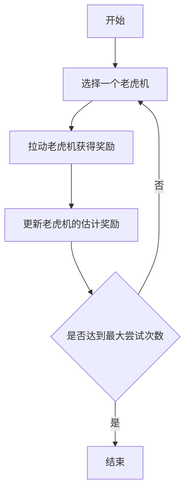

# 探索与利用平衡:AI训练的艺术

> 关键词：探索与利用平衡、AI训练、多臂老虎机问题、强化学习、策略优化

> 摘要：本文深入探讨了AI训练中探索与利用平衡这一核心问题。从其背景意义出发，详细介绍了相关的核心概念、算法原理、数学模型。通过项目实战案例展示了在实际中如何实现探索与利用的平衡，分析了其实际应用场景。同时，推荐了学习该领域所需的工具和资源，最后对其未来发展趋势与挑战进行了总结，并解答了常见问题，为读者全面理解和掌握AI训练中探索与利用平衡的艺术提供了系统的知识体系。

## 1. 背景介绍 
### 1.1 目的和范围
在人工智能训练过程中，探索与利用平衡是一个至关重要的问题。探索意味着尝试新的行为、策略或环境状态，以发现更多的信息和潜在的最优解；而利用则是基于已有的经验和知识，选择当前看起来最优的行为。本文章的目的是深入探讨在AI训练中如何实现探索与利用的有效平衡，涵盖了从基本概念、算法原理到实际应用案例等多个方面。通过对不同场景下的分析和讨论，帮助读者理解这一平衡的重要性，并掌握实现该平衡的方法和技巧。

### 1.2 预期读者
本文预期读者包括人工智能领域的初学者、研究人员、工程师以及对AI训练感兴趣的爱好者。对于初学者，文章将提供基础的概念和易于理解的解释，帮助他们建立起对探索与利用平衡的初步认识；对于研究人员和工程师，文章将深入探讨算法原理、数学模型和实际应用，为他们在相关项目中的研究和开发提供有价值的参考。

### 1.3 文档结构概述
本文将按照以下结构进行组织：首先介绍核心概念与联系，包括探索与利用的定义、相互关系以及相关的经典问题；接着阐述核心算法原理和具体操作步骤，并使用Python代码进行详细说明；然后介绍数学模型和公式，并通过举例进行详细讲解；之后通过项目实战展示代码实际案例和详细解释；再分析实际应用场景；推荐学习所需的工具和资源；最后总结未来发展趋势与挑战，解答常见问题并提供扩展阅读和参考资料。

### 1.4 术语表
#### 1.4.1 核心术语定义
- **探索（Exploration）**：在AI训练中，探索是指尝试新的行为、策略或环境状态，以获取更多关于环境和问题的信息，发现潜在的更优解。
- **利用（Exploitation）**：利用是指基于已有的经验和知识，选择当前被认为是最优的行为，以最大化即时奖励。
- **多臂老虎机问题（Multi - Armed Bandit Problem）**：这是一个经典的用于研究探索与利用平衡的问题，假设有多个老虎机，每个老虎机有不同的奖励分布，玩家需要在有限的尝试次数内决定选择哪个老虎机，以最大化总奖励。
- **强化学习（Reinforcement Learning）**：一种机器学习范式，智能体通过与环境进行交互，根据环境反馈的奖励信号来学习最优的行为策略。

#### 1.4.2 相关概念解释
- **奖励（Reward）**：在强化学习中，奖励是环境对智能体行为的反馈，用于表示该行为的好坏程度。智能体的目标是最大化长期累积奖励。
- **策略（Policy）**：策略是智能体在不同环境状态下选择行为的规则。它可以是确定性的（即对于每个状态，只选择一个固定的行为）或随机性的（即对于每个状态，按照一定的概率分布选择行为）。

#### 1.4.3 缩略词列表
- **RL**：Reinforcement Learning，强化学习
- **MAB**：Multi - Armed Bandit，多臂老虎机

## 2. 核心概念与联系 

### 探索与利用的基本概念
探索与利用是AI训练中两个相互对立又相互依存的概念。探索的目的是为了发现更多的信息，找到可能存在的更优解。例如，在一个游戏中，智能体可能会尝试不同的策略，即使这些策略目前看起来不是最优的，以了解游戏的更多特性和潜在的奖励。而利用则是基于已有的经验，选择那些已经被证明能够带来较高奖励的行为。比如，智能体已经发现了一种在某个场景下能够获得高分的策略，那么它就会持续采用这个策略。

### 多臂老虎机问题与探索利用平衡
多臂老虎机问题是理解探索与利用平衡的一个经典例子。假设有 $N$ 个老虎机，每个老虎机有一个未知的奖励概率分布。玩家每次只能选择一个老虎机进行尝试，目标是在有限的尝试次数内最大化总奖励。在这个问题中，玩家面临着探索与利用的困境。如果玩家总是选择当前估计奖励最高的老虎机（利用），那么可能会错过其他老虎机中潜在的更高奖励；如果玩家总是尝试新的老虎机（探索），则可能会浪费很多机会在低奖励的老虎机上。

以下是多臂老虎机问题的Mermaid流程图：


### 强化学习中的探索与利用
在强化学习中，探索与利用同样是一个关键问题。智能体需要在与环境的交互过程中不断学习最优策略。在训练初期，智能体对环境的了解较少，需要更多地进行探索，以发现环境的规律和潜在的高奖励状态。随着训练的进行，智能体积累了一定的经验，此时就需要更多地利用已有的知识，选择最优的行为。

## 3. 核心算法原理 & 具体操作步骤 

### ε - 贪心算法
ε - 贪心算法是一种简单而常用的解决探索与利用平衡问题的算法。其基本思想是在一定的概率 $\varepsilon$ 下进行探索（随机选择一个行为），在 $1 - \varepsilon$ 的概率下进行利用（选择当前估计奖励最高的行为）。

以下是使用Python实现的ε - 贪心算法代码：
```python
import numpy as np

class EpsilonGreedy:
    def __init__(self, num_arms, epsilon=0.1):
        self.num_arms = num_arms
        self.epsilon = epsilon
        self.reward_estimates = np.zeros(num_arms)
        self.num_pulls = np.zeros(num_arms)

    def select_arm(self):
        if np.random.rand() < self.epsilon:
            # 探索：随机选择一个手臂
            return np.random.randint(self.num_arms)
        else:
            # 利用：选择估计奖励最高的手臂
            return np.argmax(self.reward_estimates)

    def update(self, arm, reward):
        self.num_pulls[arm] += 1
        n = self.num_pulls[arm]
        # 使用增量式更新估计奖励
        self.reward_estimates[arm] = ((n - 1) / n) * self.reward_estimates[arm] + (1 / n) * reward
```

### 具体操作步骤
1. **初始化**：初始化每个手臂的估计奖励为 0，每个手臂的尝试次数为 0。
2. **选择手臂**：根据 ε - 贪心策略选择一个手臂。如果随机数小于 $\varepsilon$，则随机选择一个手臂；否则，选择估计奖励最高的手臂。
3. **获得奖励**：拉动选择的手臂，获得相应的奖励。
4. **更新估计**：根据获得的奖励更新所选手臂的估计奖励。
5. **重复步骤2 - 4**：直到达到最大尝试次数。

### 上置信界（UCB）算法
上置信界算法是另一种解决探索与利用平衡问题的有效算法。它通过计算每个手臂的上置信界，选择上置信界最高的手臂进行尝试。上置信界考虑了估计奖励的不确定性，使得算法在探索和利用之间取得更好的平衡。

以下是使用Python实现的UCB算法代码：
```python
import numpy as np

class UCB:
    def __init__(self, num_arms):
        self.num_arms = num_arms
        self.reward_estimates = np.zeros(num_arms)
        self.num_pulls = np.zeros(num_arms)
        self.total_pulls = 0

    def select_arm(self):
        self.total_pulls += 1
        # 处理未尝试过的手臂
        if np.any(self.num_pulls == 0):
            return np.argmin(self.num_pulls)
        # 计算上置信界
        ucb_values = self.reward_estimates + np.sqrt(2 * np.log(self.total_pulls) / self.num_pulls)
        return np.argmax(ucb_values)

    def update(self, arm, reward):
        self.num_pulls[arm] += 1
        n = self.num_pulls[arm]
        # 使用增量式更新估计奖励
        self.reward_estimates[arm] = ((n - 1) / n) * self.reward_estimates[arm] + (1 / n) * reward
```

### 具体操作步骤
1. **初始化**：初始化每个手臂的估计奖励为 0，每个手臂的尝试次数为 0，总尝试次数为 0。
2. **选择手臂**：如果有未尝试过的手臂，则选择未尝试过的手臂；否则，计算每个手臂的上置信界，选择上置信界最高的手臂。
3. **获得奖励**：拉动选择的手臂，获得相应的奖励。
4. **更新估计**：根据获得的奖励更新所选手臂的估计奖励和尝试次数，同时更新总尝试次数。
5. **重复步骤2 - 4**：直到达到最大尝试次数。

## 4. 数学模型和公式 & 详细讲解 & 举例说明 

### ε - 贪心算法的数学模型
在 ε - 贪心算法中，设 $\varepsilon$ 为探索概率，$Q(a)$ 为行为 $a$ 的估计奖励，$A$ 为所有可能的行为集合。在每次选择行为时，选择行为 $a$ 的概率为：
$$
P(A=a) = 
\begin{cases}
\varepsilon / |A|, & \text{如果进行探索} \\
1 - \varepsilon + \varepsilon / |A|, & \text{如果 } a = \arg\max_{a' \in A} Q(a') \\
\varepsilon / |A|, & \text{如果 } a \neq \arg\max_{a' \in A} Q(a')
\end{cases}
$$
其中 $|A|$ 表示行为集合 $A$ 的大小。

例如，假设有 3 个行为（$|A| = 3$），$\varepsilon = 0.1$。如果当前估计奖励最高的行为是 $a_1$，那么选择 $a_1$ 的概率为 $1 - 0.1+0.1/3 = 0.9 + 0.033\approx0.933$，选择 $a_2$ 和 $a_3$ 的概率均为 $0.1/3\approx0.033$。

### 上置信界（UCB）算法的数学模型
上置信界算法的核心公式是计算每个行为 $a$ 的上置信界 $UCB(a)$：
$$
UCB(a) = Q(a)+\sqrt{\frac{2\ln t}{N(a)}}
$$
其中 $Q(a)$ 是行为 $a$ 的估计奖励，$t$ 是总尝试次数，$N(a)$ 是行为 $a$ 的尝试次数。

例如，假设有 3 个行为 $a_1$，$a_2$，$a_3$，总尝试次数 $t = 10$，$Q(a_1)=0.5$，$N(a_1)=3$；$Q(a_2)=0.6$，$N(a_2)=2$；$Q(a_3)=0.4$，$N(a_3)=5$。

计算 $UCB(a_1)$：
$$
UCB(a_1)=0.5+\sqrt{\frac{2\ln 10}{3}}\approx0.5 + \sqrt{\frac{2\times2.30}{3}}\approx0.5+\sqrt{1.53}\approx0.5 + 1.24 = 1.74
$$

计算 $UCB(a_2)$：
$$
UCB(a_2)=0.6+\sqrt{\frac{2\ln 10}{2}}\approx0.6+\sqrt{2.30}\approx0.6 + 1.52 = 2.12
$$

计算 $UCB(a_3)$：
$$
UCB(a_3)=0.4+\sqrt{\frac{2\ln 10}{5}}\approx0.4+\sqrt{0.92}\approx0.4 + 0.96 = 1.36
$$

由于 $UCB(a_2)$ 最大，所以选择行为 $a_2$。

## 5. 项目实战：代码实际案例和详细解释说明 

### 5.1  开发环境搭建
为了运行上述的 ε - 贪心算法和 UCB 算法，我们需要搭建一个Python开发环境。以下是具体步骤：
1. **安装Python**：从Python官方网站（https://www.python.org/downloads/）下载并安装Python 3.x 版本。
2. **安装必要的库**：我们只需要使用Python的标准库，因此不需要额外安装其他库。

### 5.2  源代码详细实现和代码解读
以下是一个完整的代码示例，展示了如何使用 ε - 贪心算法和 UCB 算法解决多臂老虎机问题：
```python
import numpy as np
import matplotlib.pyplot as plt

# ε - 贪心算法类
class EpsilonGreedy:
    def __init__(self, num_arms, epsilon=0.1):
        self.num_arms = num_arms
        self.epsilon = epsilon
        self.reward_estimates = np.zeros(num_arms)
        self.num_pulls = np.zeros(num_arms)

    def select_arm(self):
        if np.random.rand() < self.epsilon:
            # 探索：随机选择一个手臂
            return np.random.randint(self.num_arms)
        else:
            # 利用：选择估计奖励最高的手臂
            return np.argmax(self.reward_estimates)

    def update(self, arm, reward):
        self.num_pulls[arm] += 1
        n = self.num_pulls[arm]
        # 使用增量式更新估计奖励
        self.reward_estimates[arm] = ((n - 1) / n) * self.reward_estimates[arm] + (1 / n) * reward

# 上置信界（UCB）算法类
class UCB:
    def __init__(self, num_arms):
        self.num_arms = num_arms
        self.reward_estimates = np.zeros(num_arms)
        self.num_pulls = np.zeros(num_arms)
        self.total_pulls = 0

    def select_arm(self):
        self.total_pulls += 1
        # 处理未尝试过的手臂
        if np.any(self.num_pulls == 0):
            return np.argmin(self.num_pulls)
        # 计算上置信界
        ucb_values = self.reward_estimates + np.sqrt(2 * np.log(self.total_pulls) / self.num_pulls)
        return np.argmax(ucb_values)

    def update(self, arm, reward):
        self.num_pulls[arm] += 1
        n = self.num_pulls[arm]
        # 使用增量式更新估计奖励
        self.reward_estimates[arm] = ((n - 1) / n) * self.reward_estimates[arm] + (1 / n) * reward

# 模拟多臂老虎机环境
class MultiArmedBandit:
    def __init__(self, num_arms):
        self.num_arms = num_arms
        # 每个手臂的真实奖励分布
        self.true_rewards = np.random.normal(0, 1, num_arms)

    def pull_arm(self, arm):
        # 获得奖励，奖励服从正态分布
        return np.random.normal(self.true_rewards[arm], 1)

# 运行实验
def run_experiment(bandit, algorithm, num_steps):
    rewards = np.zeros(num_steps)
    for step in range(num_steps):
        arm = algorithm.select_arm()
        reward = bandit.pull_arm(arm)
        algorithm.update(arm, reward)
        rewards[step] = reward
    return rewards

# 参数设置
num_arms = 10
num_steps = 1000
epsilon = 0.1

# 创建多臂老虎机环境
bandit = MultiArmedBandit(num_arms)

# 创建 ε - 贪心算法和 UCB 算法实例
epsilon_greedy = EpsilonGreedy(num_arms, epsilon)
ucb = UCB(num_arms)

# 运行实验
epsilon_greedy_rewards = run_experiment(bandit, epsilon_greedy, num_steps)
ucb_rewards = run_experiment(bandit, ucb, num_steps)

# 绘制平均奖励曲线
plt.plot(np.cumsum(epsilon_greedy_rewards) / np.arange(1, num_steps + 1), label='ε - Greedy')
plt.plot(np.cumsum(ucb_rewards) / np.arange(1, num_steps + 1), label='UCB')
plt.xlabel('Steps')
plt.ylabel('Average Reward')
plt.title('Multi - Armed Bandit Experiment')
plt.legend()
plt.show()
```

### 代码解读与分析
1. **EpsilonGreedy类**：实现了 ε - 贪心算法。`__init__` 方法初始化了算法的参数，包括手臂数量、探索概率、估计奖励和尝试次数。`select_arm` 方法根据 ε - 贪心策略选择一个手臂，`update` 方法根据获得的奖励更新所选手臂的估计奖励。
2. **UCB类**：实现了上置信界算法。`__init__` 方法初始化了算法的参数，包括手臂数量、估计奖励、尝试次数和总尝试次数。`select_arm` 方法根据上置信界选择一个手臂，`update` 方法根据获得的奖励更新所选手臂的估计奖励和尝试次数。
3. **MultiArmedBandit类**：模拟了多臂老虎机环境。`__init__` 方法初始化了每个手臂的真实奖励分布，`pull_arm` 方法根据所选手臂返回相应的奖励。
4. **run_experiment函数**：运行实验，调用算法的 `select_arm` 方法选择手臂，调用环境的 `pull_arm` 方法获得奖励，然后调用算法的 `update` 方法更新估计。
5. **主程序**：设置参数，创建多臂老虎机环境和算法实例，运行实验并绘制平均奖励曲线。

通过比较 ε - 贪心算法和 UCB 算法的平均奖励曲线，我们可以看到 UCB 算法在大多数情况下能够更快地收敛到最优策略，获得更高的平均奖励。

## 6. 实际应用场景 
### 广告推荐系统
在广告推荐系统中，探索与利用平衡非常重要。探索意味着尝试向用户展示不同类型的广告，以了解用户的兴趣和偏好；利用则是根据已有的用户数据，向用户展示最有可能被点击的广告。例如，在一个电商平台的广告推荐中，系统可以使用 ε - 贪心算法或 UCB 算法来平衡探索和利用。在开始阶段，系统可以更多地进行探索，展示各种不同类型的广告，以收集用户的反馈；随着数据的积累，系统可以更多地利用已有的数据，推荐最适合用户的广告。

### 药物试验
在药物试验中，医生需要在不同的药物治疗方案之间进行选择。探索意味着尝试使用不同的药物或治疗方法，以发现更有效的治疗方案；利用则是根据已有的试验数据，选择当前被认为是最有效的治疗方案。例如，在一个临床试验中，研究人员可以使用多臂老虎机算法来决定给患者分配哪种药物。在试验初期，研究人员可以更多地进行探索，让不同的患者尝试不同的药物；随着试验的进行，研究人员可以更多地利用已有的数据，将更多的患者分配到效果更好的药物组。

### 机器人导航
在机器人导航中，机器人需要在未知的环境中探索并找到最优的路径。探索意味着机器人尝试不同的方向和路径，以了解环境的结构和障碍物的分布；利用则是根据已有的地图信息，选择最短或最安全的路径。例如，在一个室内环境中，机器人可以使用强化学习算法来平衡探索和利用。在开始阶段，机器人可以更多地进行探索，随机选择方向进行移动，以构建环境地图；随着地图的逐渐完善，机器人可以更多地利用地图信息，选择最优的路径到达目标位置。

## 7. 工具和资源推荐
### 7.1 学习资源推荐
#### 7.1.1 书籍推荐
- 《Reinforcement Learning: An Introduction》（《强化学习：原理与Python实现》）：这是一本强化学习领域的经典教材，详细介绍了强化学习的基本概念、算法和应用，包括探索与利用平衡的相关内容。
- 《Algorithms for Decision Making》：这本书涵盖了决策制定的各种算法，包括多臂老虎机问题和探索与利用平衡的算法，适合有一定数学基础的读者。

#### 7.1.2 在线课程
- Coursera上的“Reinforcement Learning Specialization”：由知名教授授课，系统地介绍了强化学习的理论和实践，包括探索与利用平衡的相关内容。
- edX上的“Introduction to Artificial Intelligence”：该课程涵盖了人工智能的多个方面，其中包括强化学习和探索与利用平衡的基础知识。

#### 7.1.3 技术博客和网站
- OpenAI Blog：OpenAI发布的技术博客，包含了很多关于人工智能和强化学习的最新研究成果和应用案例。
- Towards Data Science：一个专注于数据科学和机器学习的技术博客平台，有很多关于探索与利用平衡的文章和教程。

### 7.2 开发工具框架推荐
#### 7.2.1 IDE和编辑器
- PyCharm：一个功能强大的Python集成开发环境，提供了代码编辑、调试、版本控制等功能，适合开发Python项目。
- Jupyter Notebook：一个交互式的开发环境，支持Python代码的编写、运行和可视化，非常适合进行数据分析和算法实验。

#### 7.2.2 调试和性能分析工具
- PDB：Python的标准调试器，可以帮助开发者定位和解决代码中的问题。
- cProfile：Python的性能分析工具，可以分析代码的运行时间和函数调用情况，帮助开发者优化代码性能。

#### 7.2.3 相关框架和库
- Gym：OpenAI开发的一个强化学习环境库，提供了各种不同的模拟环境，方便开发者进行强化学习算法的实验和测试。
- Stable Baselines3：一个基于PyTorch的强化学习库，提供了多种预训练的强化学习算法，包括处理探索与利用平衡的算法。

### 7.3 相关论文著作推荐
#### 7.3.1 经典论文
- “A Survey of Online Experiment Design with the Multi - Armed Bandit”：这篇论文对多臂老虎机问题进行了全面的综述，包括各种算法和应用场景。
- “Finite - Time Analysis of the Multiarmed Bandit Problem”：该论文对多臂老虎机问题的有限时间分析进行了深入研究，为算法的性能分析提供了理论基础。

#### 7.3.2 最新研究成果
- 近年来，关于探索与利用平衡的研究主要集中在如何在复杂环境中更有效地实现平衡，以及如何结合深度学习和强化学习来提高算法的性能。可以关注ICML、NeurIPS等顶级机器学习会议上的相关论文。

#### 7.3.3 应用案例分析
- 可以参考一些实际应用案例的论文，如“Bandit - Based Contextual Recommendation for Online Advertising”，该论文介绍了如何使用多臂老虎机算法进行在线广告推荐。

## 8. 总结：未来发展趋势与挑战
### 未来发展趋势
- **与深度学习的结合**：随着深度学习的发展，将探索与利用平衡算法与深度学习模型相结合是一个重要的发展趋势。例如，可以使用深度强化学习算法来处理更复杂的环境和任务，通过深度神经网络来学习更复杂的策略。
- **多智能体系统中的应用**：在多智能体系统中，每个智能体都需要在探索和利用之间进行平衡，同时还要考虑其他智能体的行为。未来的研究将关注如何在多智能体环境中实现有效的探索与利用平衡。
- **自适应探索策略**：传统的探索策略（如 ε - 贪心算法）通常使用固定的探索概率，而自适应探索策略可以根据环境的变化和智能体的学习进度动态调整探索概率，从而更有效地实现探索与利用的平衡。

### 挑战
- **复杂环境下的平衡**：在复杂的环境中，如高维状态空间、连续动作空间和动态环境，实现探索与利用的平衡变得更加困难。需要开发更高效的算法来处理这些复杂情况。
- **样本效率问题**：探索通常需要大量的样本，而在实际应用中，样本的获取可能是昂贵的或有限的。如何提高算法的样本效率，在有限的样本下实现有效的探索与利用平衡是一个重要的挑战。
- **理论分析的困难**：对于一些复杂的探索与利用平衡算法，进行理论分析和性能保证是非常困难的。需要发展更强大的理论工具来分析这些算法的性能。

## 9. 附录：常见问题与解答
### 问题1：为什么在AI训练中需要探索与利用平衡？
答：在AI训练中，如果只进行利用，智能体可能会陷入局部最优解，错过更优的策略；如果只进行探索，智能体可能会浪费大量的资源在无意义的尝试上，无法获得有效的奖励。因此，需要在探索和利用之间找到一个平衡，以最大化长期累积奖励。

### 问题2：ε - 贪心算法和UCB算法哪个更好？
答：这取决于具体的应用场景。ε - 贪心算法简单易懂，实现起来比较容易，但它的探索概率是固定的，可能在某些情况下无法很好地适应环境的变化。UCB算法考虑了估计奖励的不确定性，能够在探索和利用之间取得更好的平衡，通常在大多数情况下能够获得更高的平均奖励。但UCB算法的计算复杂度相对较高，需要更多的计算资源。

### 问题3：如何选择合适的探索策略？
答：选择合适的探索策略需要考虑多个因素，如环境的复杂度、样本的可用性、算法的计算复杂度等。对于简单的环境和有限的样本，可以选择 ε - 贪心算法；对于复杂的环境和需要更高效探索的场景，可以选择UCB算法或其他自适应探索策略。

## 10. 扩展阅读 & 参考资料
- Sutton, R. S., & Barto, A. G. (2018). Reinforcement Learning: An Introduction. MIT press.
- Bubeck, S., & Cesa - Bianchi, N. (2012). Regret analysis of stochastic and nonstochastic multi - armed bandit problems. Foundations and Trends® in Machine Learning, 5(1), 1 - 122.
- OpenAI Gym官方文档：https://gym.openai.com/docs/
- Stable Baselines3官方文档：https://stable - baselines3.readthedocs.io/en/master/

作者：AI天才研究院/AI Genius Institute & 禅与计算机程序设计艺术 /Zen And The Art of Computer Programming