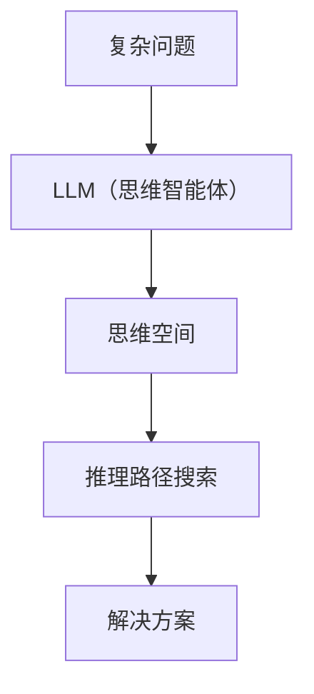

# 探索思维空间:LLM解决复杂问题的新途径

> 关键词：大语言模型（LLM）、思维空间、复杂问题解决、推理路径、语义理解

> 摘要：本文聚焦于大语言模型（LLM）解决复杂问题的新途径——探索思维空间。首先介绍了相关背景，包括目的范围、预期读者等内容。接着阐述了核心概念与联系，如思维空间的定义、其与LLM的关系等，并给出了相应的文本示意图和Mermaid流程图。深入讲解了核心算法原理和具体操作步骤，同时结合Python源代码进行详细阐述。通过数学模型和公式对其进行了理论分析，并举例说明。在项目实战部分，给出了开发环境搭建、源代码实现及解读。探讨了实际应用场景，推荐了相关工具和资源，最后总结了未来发展趋势与挑战，解答了常见问题并提供了扩展阅读和参考资料。旨在为研究和应用LLM解决复杂问题提供全面且深入的指导。

## 1. 背景介绍 
### 1.1 目的和范围
随着人工智能技术的飞速发展，大语言模型（LLM）在自然语言处理等众多领域取得了显著的成果。然而，在面对复杂问题时，LLM的表现仍存在一定的局限性。本文的目的在于探索LLM解决复杂问题的新途径，通过引入思维空间的概念，深入研究如何利用LLM在思维空间中进行有效的推理和决策，以提高其解决复杂问题的能力。

本文的范围涵盖了思维空间的基本概念、与LLM的结合原理、相关算法实现、数学模型分析、项目实战以及实际应用场景等方面。旨在为研究人员、开发者和相关从业者提供一个全面且深入的视角，以便更好地理解和应用这一新兴技术。

### 1.2 预期读者
本文的预期读者包括但不限于人工智能领域的研究人员、机器学习工程师、自然语言处理开发者、对人工智能技术感兴趣的学者和学生等。无论您是刚刚接触LLM的初学者，还是在该领域有一定经验的专业人士，都能从本文中获取有价值的信息和见解。

### 1.3 文档结构概述
本文将按照以下结构进行组织：
1. 背景介绍：阐述本文的目的、范围、预期读者和文档结构概述，并对相关术语进行解释。
2. 核心概念与联系：介绍思维空间和LLM的核心概念，以及它们之间的联系，同时给出文本示意图和Mermaid流程图。
3. 核心算法原理 & 具体操作步骤：详细讲解利用LLM探索思维空间解决复杂问题的核心算法原理，并给出具体的操作步骤，同时结合Python源代码进行说明。
4. 数学模型和公式 & 详细讲解 & 举例说明：建立数学模型，推导相关公式，并通过具体例子进行说明。
5. 项目实战：通过实际项目案例，介绍开发环境搭建、源代码实现和代码解读。
6. 实际应用场景：探讨LLM探索思维空间在不同领域的实际应用场景。
7. 工具和资源推荐：推荐相关的学习资源、开发工具框架和论文著作。
8. 总结：总结未来发展趋势与挑战。
9. 附录：解答常见问题。
10. 扩展阅读 & 参考资料：提供相关的扩展阅读和参考资料。

### 1.4 术语表
#### 1.4.1 核心术语定义
- **大语言模型（LLM）**：是一种基于深度学习的自然语言处理模型，通过在大规模文本数据上进行训练，学习语言的统计规律和语义信息，能够生成自然流畅的文本。
- **思维空间**：是一个抽象的概念，代表了所有可能的思维状态和推理路径的集合。在本文中，思维空间用于描述LLM在解决复杂问题时的推理过程和决策空间。
- **推理路径**：指的是在思维空间中从问题的初始状态到解决方案的一系列思维步骤和决策。

#### 1.4.2 相关概念解释
- **语义理解**：LLM对输入文本的含义进行理解和分析的能力，是其进行推理和决策的基础。
- **上下文信息**：在自然语言处理中，上下文信息指的是文本中与当前处理的部分相关的前后文内容，能够帮助LLM更好地理解和生成文本。

#### 1.4.3 缩略词列表
- **LLM**：大语言模型（Large Language Model）

## 2. 核心概念与联系 

### 思维空间的定义
思维空间可以看作是一个高维的抽象空间，其中每个点代表一种可能的思维状态。这些思维状态可以是对问题的不同理解、不同的推理步骤或不同的解决方案。思维空间的维度取决于问题的复杂度和LLM的能力。

### 思维空间与LLM的关系
LLM可以被看作是一个在思维空间中进行搜索和推理的智能体。当LLM接收到一个复杂问题时，它会在思维空间中寻找合适的推理路径，从问题的初始状态逐步推导到解决方案。LLM的语义理解能力和生成能力决定了它在思维空间中的搜索范围和效率。

### 文本示意图
```plaintext
              +----------------------+
              |      复杂问题       |
              +----------------------+
                       |
                       v
              +----------------------+
              |    LLM（思维智能体）  |
              +----------------------+
                       |
                       v
              +----------------------+
              |      思维空间        |
              | （包含各种思维状态） |
              +----------------------+
                       |
                       v
              +----------------------+
              |     推理路径搜索     |
              +----------------------+
                       |
                       v
              +----------------------+
              |      解决方案        |
              +----------------------+
```

### Mermaid流程图


## 3. 核心算法原理 & 具体操作步骤 

### 核心算法原理
利用LLM探索思维空间解决复杂问题的核心算法可以分为以下几个步骤：
1. **问题编码**：将输入的复杂问题转化为LLM能够理解的格式，通常是文本形式。同时，提取问题的关键信息和上下文信息，作为LLM在思维空间中搜索的起点。
2. **思维空间搜索**：LLM根据问题编码的结果，在思维空间中进行搜索。搜索过程可以采用启发式搜索算法，如A*算法或贪心搜索算法，根据一定的评估函数选择最优的推理路径。
3. **推理步骤生成**：在搜索过程中，LLM根据当前的思维状态生成下一步的推理步骤。推理步骤可以是对问题的进一步分析、假设的提出或解决方案的尝试。
4. **状态更新**：根据生成的推理步骤，更新LLM的思维状态。新的思维状态将作为下一次搜索的起点。
5. **终止条件判断**：在搜索过程中，不断判断是否满足终止条件。终止条件可以是找到解决方案、达到最大搜索步数或评估函数的值达到阈值等。

### 具体操作步骤
以下是利用Python实现上述核心算法的具体操作步骤：

```python
import torch
from transformers import AutoTokenizer, AutoModelForCausalLM

# 加载预训练的LLM模型和分词器
model_name = "gpt2"
tokenizer = AutoTokenizer.from_pretrained(model_name)
model = AutoModelForCausalLM.from_pretrained(model_name)

# 问题编码
def encode_question(question):
    input_ids = tokenizer.encode(question, return_tensors='pt')
    return input_ids

# 思维空间搜索
def search_thinking_space(input_ids, max_steps=10):
    current_state = input_ids
    for step in range(max_steps):
        # 推理步骤生成
        output = model.generate(current_state, max_length=100, num_return_sequences=1)
        new_step = output[:, current_state.shape[1]:]
        # 状态更新
        current_state = output
        # 终止条件判断
        generated_text = tokenizer.decode(current_state[0], skip_special_tokens=True)
        if "解决方案" in generated_text:
            return generated_text
    return None

# 主函数
def solve_complex_problem(question):
    input_ids = encode_question(question)
    solution = search_thinking_space(input_ids)
    return solution

# 示例问题
question = "如何提高机器学习模型的性能？"
solution = solve_complex_problem(question)
if solution:
    print("解决方案：", solution)
else:
    print("未找到解决方案。")
```

### 代码解释
1. **模型和分词器加载**：使用`transformers`库加载预训练的GPT-2模型和分词器。
2. **问题编码**：`encode_question`函数将输入的问题转化为模型能够接受的输入ID。
3. **思维空间搜索**：`search_thinking_space`函数在思维空间中进行搜索，每次生成一个新的推理步骤并更新当前状态。如果生成的文本中包含“解决方案”，则认为找到了解决方案。
4. **主函数**：`solve_complex_problem`函数将问题编码后调用`search_thinking_space`函数进行搜索，并返回解决方案。

## 4. 数学模型和公式 & 详细讲解 & 举例说明 

### 数学模型
假设思维空间可以表示为一个图 $G=(V, E)$，其中 $V$ 是思维状态的集合，$E$ 是思维状态之间的连接边。每个思维状态 $v \in V$ 可以用一个向量 $\mathbf{x}_v$ 表示，向量的维度取决于问题的复杂度和LLM的表示能力。

推理路径可以看作是图 $G$ 中的一条路径 $P=(v_0, v_1, \cdots, v_n)$，其中 $v_0$ 是问题的初始状态，$v_n$ 是解决方案的状态。

### 评估函数
为了在思维空间中选择最优的推理路径，需要定义一个评估函数 $f(P)$。评估函数可以综合考虑推理步骤的合理性、解决方案的可行性和搜索的效率等因素。例如，可以定义评估函数为：

$$f(P) = \alpha \cdot \text{合理性得分}(P) + \beta \cdot \text{可行性得分}(P) - \gamma \cdot \text{搜索步数}(P)$$

其中 $\alpha$、$\beta$ 和 $\gamma$ 是权重系数，用于调整不同因素的重要性。

### 举例说明
假设我们要解决一个数学问题：“求解方程 $x^2 - 5x + 6 = 0$”。问题的初始状态可以表示为向量 $\mathbf{x}_0 = [\text{方程}, x^2 - 5x + 6 = 0]$。

在思维空间中，可能的推理步骤包括：
1. **因式分解**：将方程 $x^2 - 5x + 6 = 0$ 分解为 $(x - 2)(x - 3) = 0$。
2. **求解因式**：得到 $x - 2 = 0$ 或 $x - 3 = 0$。
3. **得出解**：解得 $x = 2$ 或 $x = 3$。

每个推理步骤对应思维空间中的一个新状态，通过不断搜索和选择最优的推理路径，最终可以找到解决方案。

## 5. 项目实战：代码实际案例和详细解释说明 

### 5.1  开发环境搭建
#### 操作系统
建议使用Linux或Windows操作系统，本文以Ubuntu 20.04为例进行说明。

#### 编程语言和环境
使用Python 3.8或更高版本，可以通过以下命令安装Python：
```bash
sudo apt update
sudo apt install python3.8
```

#### 依赖库安装
安装必要的Python依赖库，如`transformers`、`torch`等：
```bash
pip install transformers torch
```

### 5.2  源代码详细实现和代码解读
以下是一个更完整的项目实战代码示例，用于解决复杂的文本推理问题：

```python
import torch
from transformers import AutoTokenizer, AutoModelForCausalLM

# 加载预训练的LLM模型和分词器
model_name = "gpt2"
tokenizer = AutoTokenizer.from_pretrained(model_name)
model = AutoModelForCausalLM.from_pretrained(model_name)

# 问题编码
def encode_question(question):
    input_ids = tokenizer.encode(question, return_tensors='pt')
    return input_ids

# 思维空间搜索
def search_thinking_space(input_ids, max_steps=10, temperature=0.7):
    current_state = input_ids
    history = []
    for step in range(max_steps):
        # 推理步骤生成
        output = model.generate(
            current_state,
            max_length=current_state.shape[1] + 50,
            num_return_sequences=1,
            temperature=temperature
        )
        new_step = output[:, current_state.shape[1]:]
        new_text = tokenizer.decode(new_step[0], skip_special_tokens=True)
        history.append(new_text)
        # 状态更新
        current_state = output
        # 终止条件判断
        if "解决方案" in new_text:
            return history
    return history

# 主函数
def solve_complex_problem(question):
    input_ids = encode_question(question)
    solution_history = search_thinking_space(input_ids)
    return solution_history

# 示例问题
question = "如何提高自然语言处理模型的泛化能力？"
solution_history = solve_complex_problem(question)
print("推理过程：")
for step, text in enumerate(solution_history):
    print(f"步骤 {step + 1}: {text}")
```

### 代码解读与分析
1. **模型和分词器加载**：使用`transformers`库加载预训练的GPT-2模型和分词器。
2. **问题编码**：`encode_question`函数将输入的问题转化为模型能够接受的输入ID。
3. **思维空间搜索**：`search_thinking_space`函数在思维空间中进行搜索，每次生成一个新的推理步骤并更新当前状态。使用`temperature`参数控制生成文本的随机性。
4. **主函数**：`solve_complex_problem`函数将问题编码后调用`search_thinking_space`函数进行搜索，并返回推理过程的历史记录。
5. **示例问题**：定义一个示例问题“如何提高自然语言处理模型的泛化能力？”，并调用`solve_complex_problem`函数进行求解，最后打印推理过程。

## 6. 实际应用场景 
### 科学研究
在科学研究中，LLM探索思维空间可以帮助研究人员解决复杂的理论推导和实验设计问题。例如，在物理学中，LLM可以根据已知的物理定律和实验数据，在思维空间中搜索可能的理论模型和实验方案，为科学研究提供新的思路和方向。

### 医疗诊断
在医疗领域，LLM可以结合患者的症状、病史和检查结果，在思维空间中进行推理和诊断。通过分析大量的医学知识和临床案例，LLM可以提供可能的疾病诊断和治疗建议，辅助医生做出更准确的决策。

### 金融投资
在金融投资领域，LLM可以根据市场数据、经济指标和公司财务报表等信息，在思维空间中进行投资策略的制定和风险评估。通过分析不同的投资组合和市场趋势，LLM可以为投资者提供个性化的投资建议。

### 智能客服
在智能客服领域，LLM可以通过探索思维空间，更好地理解用户的问题，并提供准确和详细的解决方案。对于复杂的问题，LLM可以通过逐步推理和引导，帮助用户找到解决问题的方法。

## 7. 工具和资源推荐
### 7.1 学习资源推荐
#### 7.1.1 书籍推荐
- 《自然语言处理入门》：介绍自然语言处理的基础知识和常用算法，适合初学者。
- 《深度学习》：详细介绍深度学习的原理和应用，包括神经网络、卷积神经网络等。
- 《人工智能：一种现代的方法》：全面介绍人工智能的各个领域，包括知识表示、推理、机器学习等。

#### 7.1.2 在线课程
- Coursera上的“自然语言处理专项课程”：由顶尖高校的教授授课，系统介绍自然语言处理的理论和实践。
- edX上的“深度学习微硕士项目”：提供深度学习的深入学习和实践机会。
- 吴恩达的“机器学习”课程：经典的机器学习入门课程，适合初学者。

#### 7.1.3 技术博客和网站
- Hugging Face博客：提供关于自然语言处理和大语言模型的最新技术和研究成果。
- arXiv：一个预印本平台，包含大量的人工智能和机器学习相关的研究论文。
- Towards Data Science：一个数据科学和机器学习的技术博客，有很多实用的教程和案例。

### 7.2 开发工具框架推荐
#### 7.2.1 IDE和编辑器
- PyCharm：一款功能强大的Python集成开发环境，提供代码编辑、调试、版本控制等功能。
- Visual Studio Code：一款轻量级的代码编辑器，支持多种编程语言和插件扩展。
- Jupyter Notebook：一个交互式的编程环境，适合进行数据探索和模型实验。

#### 7.2.2 调试和性能分析工具
- PyTorch Profiler：用于分析PyTorch模型的性能瓶颈和资源消耗。
- TensorBoard：一个可视化工具，用于监控和分析深度学习模型的训练过程。
- cProfile：Python内置的性能分析工具，用于分析Python代码的执行时间和调用关系。

#### 7.2.3 相关框架和库
- Transformers：Hugging Face开发的一个自然语言处理库，提供了丰富的预训练模型和工具。
- PyTorch：一个开源的深度学习框架，广泛应用于自然语言处理和计算机视觉等领域。
- NLTK：一个自然语言处理工具包，提供了各种文本处理和分析的工具。

### 7.3 相关论文著作推荐
#### 7.3.1 经典论文
- “Attention Is All You Need”：介绍了Transformer模型的原理和应用，是自然语言处理领域的经典论文。
- “BERT: Pre-training of Deep Bidirectional Transformers for Language Understanding”：提出了BERT模型，开启了预训练语言模型的新时代。
- “Generative Adversarial Nets”：提出了生成对抗网络（GAN）的概念，对生成式模型的发展产生了深远影响。

#### 7.3.2 最新研究成果
- 关注顶级学术会议如ACL、NeurIPS、ICML等的最新论文，了解LLM和思维空间相关的最新研究进展。
- 关注知名研究机构如OpenAI、Google Brain等的研究成果，获取最前沿的技术动态。

#### 7.3.3 应用案例分析
- 阅读相关的技术博客和案例分享，了解LLM在不同领域的实际应用案例和经验教训。
- 参考一些知名企业的技术报告，如百度、阿里等在自然语言处理和人工智能领域的应用实践。

## 8. 总结：未来发展趋势与挑战
### 未来发展趋势
- **模型融合**：将LLM与其他类型的模型，如图神经网络、强化学习模型等进行融合，以提高解决复杂问题的能力。
- **多模态融合**：结合文本、图像、语音等多模态信息，在更广泛的思维空间中进行推理和决策。
- **自主学习和进化**：使LLM能够在不断的实践中自主学习和进化，提高其适应不同问题和环境的能力。

### 挑战
- **计算资源需求**：探索思维空间需要大量的计算资源，如何降低计算成本和提高计算效率是一个挑战。
- **可解释性**：LLM在思维空间中的推理过程往往是黑盒的，如何提高其可解释性，让用户理解其决策依据是一个重要问题。
- **伦理和安全问题**：随着LLM的广泛应用，伦理和安全问题日益凸显，如虚假信息传播、隐私泄露等，需要制定相应的规范和措施。

## 9. 附录：常见问题与解答
### 问题1：LLM探索思维空间的方法适用于所有类型的复杂问题吗？
答：不是所有类型的复杂问题都适合使用LLM探索思维空间的方法。这种方法更适用于那些可以通过文本描述和推理解决的问题，如自然语言处理、知识推理等领域的问题。对于一些需要物理实验或实际操作的问题，可能需要结合其他技术和方法。

### 问题2：如何选择合适的评估函数？
答：选择合适的评估函数需要考虑问题的特点和目标。一般来说，评估函数应该综合考虑推理步骤的合理性、解决方案的可行性和搜索的效率等因素。可以通过实验和调优来确定合适的权重系数。

### 问题3：如何提高LLM在思维空间中的搜索效率？
答：可以采用以下方法提高LLM在思维空间中的搜索效率：
- 使用启发式搜索算法，如A*算法，根据问题的特点设计合适的启发函数。
- 对思维空间进行剪枝，去除一些不可能的推理路径，减少搜索空间。
- 并行计算，利用多个计算资源同时进行搜索。

## 10. 扩展阅读 & 参考资料
### 扩展阅读
- 《人工智能哲学》：从哲学的角度探讨人工智能的本质和发展。
- 《超级智能：路线图、危险性与应对策略》：探讨人工智能发展带来的潜在风险和应对措施。

### 参考资料
- Hugging Face官方文档：https://huggingface.co/docs
- PyTorch官方文档：https://pytorch.org/docs/stable/index.html
- 相关学术论文和研究报告

作者：AI天才研究院/AI Genius Institute & 禅与计算机程序设计艺术 /Zen And The Art of Computer Programming