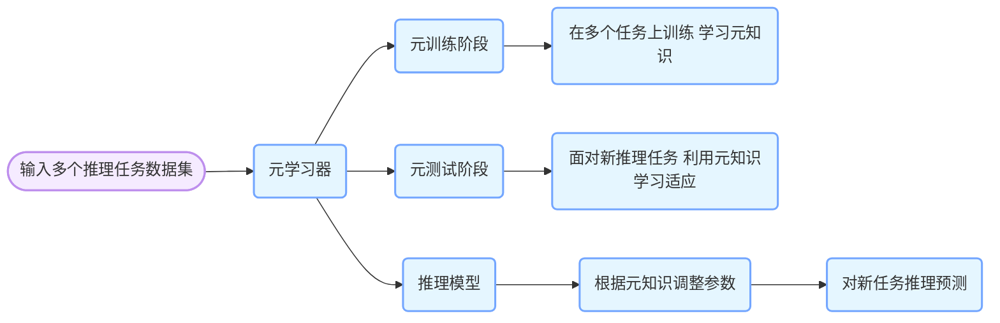

# 推理任务中的元学习技术应用

> 关键词：推理任务、元学习技术、算法原理、数学模型、实际应用

> 摘要：本文深入探讨了推理任务中的元学习技术应用。首先介绍了相关背景，包括目的范围、预期读者等内容。接着阐述了核心概念及其联系，通过文本示意图和Mermaid流程图进行直观展示。详细讲解了核心算法原理，并给出Python源代码示例。对数学模型和公式进行了深入分析并举例说明。通过项目实战，给出代码实际案例并进行详细解释。列举了元学习技术在推理任务中的实际应用场景，推荐了学习资源、开发工具框架以及相关论文著作。最后总结了未来发展趋势与挑战，提供常见问题解答和扩展阅读参考资料，旨在为读者全面呈现推理任务中应用元学习技术的相关知识。

## 1. 背景介绍 
### 1.1 目的和范围
推理任务在众多领域都有着至关重要的作用，如自然语言处理中的文本推理、计算机视觉中的图像推理等。然而，传统的机器学习方法在处理复杂推理任务时往往面临数据稀缺、泛化能力不足等问题。元学习技术的出现为解决这些问题提供了新的思路和方法。本文的目的在于深入研究元学习技术在推理任务中的应用，探讨其原理、算法、数学模型以及实际应用场景等方面，范围涵盖了从理论基础到实际项目实践的多个层面，旨在为读者提供一个全面而深入的了解。

### 1.2 预期读者
本文预期读者包括对机器学习、人工智能领域有一定基础的研究人员、开发者，希望深入了解元学习技术在推理任务中应用的专业人士，以及相关专业的学生。对于想要提升在推理任务中模型性能、解决实际问题的读者也具有参考价值。

### 1.3 文档结构概述
本文首先介绍背景信息，让读者了解研究的目的和范围等。接着阐述核心概念与联系，通过直观的方式展示元学习技术与推理任务的关系。然后详细讲解核心算法原理和具体操作步骤，并给出Python代码示例。之后介绍数学模型和公式，进行详细讲解并举例说明。通过项目实战部分，给出代码实际案例并进行解读分析。列举实际应用场景，为读者展示该技术的应用价值。推荐学习资源、开发工具框架和相关论文著作，帮助读者进一步深入学习。最后总结未来发展趋势与挑战，提供常见问题解答和扩展阅读参考资料。

### 1.4 术语表
#### 1.4.1 核心术语定义
- **推理任务**：根据已知信息，通过一定的规则和方法推导出未知信息的过程。在机器学习和人工智能领域，推理任务通常涉及对数据进行分析和处理，以得出结论或预测结果。
- **元学习技术**：也称为“学习如何学习”，旨在让模型能够快速学习新的任务，通过在多个任务上进行训练，学习到通用的学习策略和知识，从而在面对新任务时能够更高效地进行学习和适应。

#### 1.4.2 相关概念解释
- **元知识**：元学习中所学习到的关于学习过程的知识，包括学习率、优化算法等参数的设置，以及模型结构的选择等，这些知识可以帮助模型在新任务上更快地收敛和取得更好的性能。
- **任务分布**：指多个任务所构成的集合，每个任务都有其特定的输入输出关系和数据分布。元学习通过在任务分布上进行训练，学习到适应不同任务的能力。

#### 1.4.3 缩略词列表
- **MAML**：Model-Agnostic Meta-Learning，模型无关元学习，是一种经典的元学习算法。
- **FOMAML**：First-Order Model-Agnostic Meta-Learning，一阶模型无关元学习，是MAML的简化版本。

## 2. 核心概念与联系 

### 核心概念原理
推理任务的目标是从给定的输入数据中提取有价值的信息，并根据这些信息进行合理的推断。传统的机器学习方法通常针对特定的推理任务进行训练，需要大量的数据来学习任务的特征和规律。然而，在实际应用中，数据往往是稀缺的，而且新的推理任务不断涌现，传统方法难以快速适应。

元学习技术的核心思想是让模型学习到如何学习，通过在多个不同的推理任务上进行训练，模型可以学习到通用的学习策略和知识，从而在面对新的推理任务时能够快速适应和学习。例如，在自然语言推理任务中，元学习模型可以学习到不同类型推理任务的共同特征和推理模式，当遇到新的推理任务时，能够利用这些元知识快速调整模型参数，提高推理性能。

### 架构的文本示意图
以下是推理任务中应用元学习技术的架构文本示意图：

```plaintext
输入：多个推理任务数据集
|
|__ 元学习器
|    |__ 元训练阶段
|    |    |__ 在多个任务上进行训练，学习元知识
|    |__ 元测试阶段
|         |__ 面对新的推理任务，利用元知识快速学习和适应
|
|__ 推理模型
     |__ 根据元学习器提供的元知识进行参数调整
     |__ 对新的推理任务进行推理和预测
```

### Mermaid流程图


## 3. 核心算法原理 & 具体操作步骤 

### 核心算法原理 - MAML
MAML（Model-Agnostic Meta-Learning）是一种经典的元学习算法，其核心思想是找到一组初始参数，使得模型在经过少量的梯度更新后，能够在新的任务上取得较好的性能。

具体来说，MAML的训练过程分为两个阶段：元训练阶段和元测试阶段。

在元训练阶段，对于每个任务，首先使用当前的模型参数在该任务的训练数据上进行一次或多次梯度更新，得到更新后的参数。然后，使用更新后的参数在该任务的测试数据上计算损失。最后，将所有任务的测试损失相加，对初始参数进行梯度更新，使得初始参数能够在多个任务上都具有较好的泛化能力。

在元测试阶段，当遇到新的推理任务时，使用初始参数在该任务的训练数据上进行少量的梯度更新，得到适应新任务的模型参数，然后使用更新后的模型进行推理和预测。

### 具体操作步骤
1. **初始化模型参数**：随机初始化推理模型的参数 $\theta$。
2. **元训练阶段**：
    - 从任务分布中采样一组任务 $\mathcal{T} = \{T_1, T_2, \cdots, T_n\}$。
    - 对于每个任务 $T_i$：
        - 使用当前模型参数 $\theta$ 在任务 $T_i$ 的训练数据 $D_{train}^i$ 上进行一次或多次梯度更新，得到更新后的参数 $\theta_i'$。更新公式为：
            - $\theta_i' = \theta - \alpha \nabla_{\theta} L_{T_i}(\theta)$，其中 $\alpha$ 是内循环的学习率，$L_{T_i}(\theta)$ 是任务 $T_i$ 在参数 $\theta$ 下的损失函数。
        - 使用更新后的参数 $\theta_i'$ 在任务 $T_i$ 的测试数据 $D_{test}^i$ 上计算损失 $L_{T_i}(\theta_i')$。
    - 计算所有任务的测试损失之和 $\mathcal{L} = \sum_{i=1}^{n} L_{T_i}(\theta_i')$。
    - 对初始参数 $\theta$ 进行梯度更新：$\theta = \theta - \beta \nabla_{\theta} \mathcal{L}$，其中 $\beta$ 是外循环的学习率。
3. **元测试阶段**：
    - 当遇到新的推理任务 $T_{new}$ 时，使用初始参数 $\theta$ 在任务 $T_{new}$ 的训练数据 $D_{train}^{new}$ 上进行少量的梯度更新，得到适应新任务的参数 $\theta_{new}'$。
    - 使用更新后的参数 $\theta_{new}'$ 在任务 $T_{new}$ 的测试数据 $D_{test}^{new}$ 上进行推理和预测。

### Python源代码示例
```python
import torch
import torch.nn as nn
import torch.optim as optim

# 定义一个简单的推理模型
class InferenceModel(nn.Module):
    def __init__(self, input_size, output_size):
        super(InferenceModel, self).__init__()
        self.fc = nn.Linear(input_size, output_size)

    def forward(self, x):
        return self.fc(x)

# 初始化模型和优化器
input_size = 10
output_size = 2
model = InferenceModel(input_size, output_size)
meta_optimizer = optim.Adam(model.parameters(), lr=0.001)

# 定义内循环学习率
alpha = 0.01

# 元训练阶段
num_tasks = 10
num_inner_steps = 1
for epoch in range(100):
    meta_loss = 0
    for _ in range(num_tasks):
        # 模拟一个任务的训练和测试数据
        train_data = torch.randn(10, input_size)
        train_labels = torch.randint(0, output_size, (10,))
        test_data = torch.randn(5, input_size)
        test_labels = torch.randint(0, output_size, (5,))

        # 内循环更新
        fast_weights = list(model.parameters())
        for _ in range(num_inner_steps):
            logits = model(train_data)
            loss = nn.CrossEntropyLoss()(logits, train_labels)
            grads = torch.autograd.grad(loss, fast_weights)
            fast_weights = [w - alpha * g for w, g in zip(fast_weights, grads)]

        # 计算外循环损失
        logits = model.forward_with_params(test_data, fast_weights)
        outer_loss = nn.CrossEntropyLoss()(logits, test_labels)
        meta_loss += outer_loss

    # 元更新
    meta_optimizer.zero_grad()
    meta_loss.backward()
    meta_optimizer.step()

    if epoch % 10 == 0:
        print(f'Epoch {epoch}, Meta Loss: {meta_loss.item()}')

# 元测试阶段
new_train_data = torch.randn(10, input_size)
new_train_labels = torch.randint(0, output_size, (10,))
new_test_data = torch.randn(5, input_size)

# 内循环更新适应新任务
fast_weights = list(model.parameters())
for _ in range(num_inner_steps):
    logits = model(new_train_data)
    loss = nn.CrossEntropyLoss()(logits, new_train_labels)
    grads = torch.autograd.grad(loss, fast_weights)
    fast_weights = [w - alpha * g for w, g in zip(fast_weights, grads)]

# 进行推理
logits = model.forward_with_params(new_test_data, fast_weights)
predictions = torch.argmax(logits, dim=1)
print(f'Predictions: {predictions}')
```

## 4. 数学模型和公式 & 详细讲解 & 举例说明 

### 数学模型和公式
#### 损失函数
在元学习中，我们通常使用交叉熵损失函数来衡量模型的预测结果与真实标签之间的差异。对于一个分类任务，假设输入数据为 $x$，真实标签为 $y$，模型的预测概率分布为 $p(y|x;\theta)$，则交叉熵损失函数定义为：
$$
L(x, y; \theta) = - \sum_{i=1}^{C} y_i \log(p(y_i|x;\theta))
$$
其中 $C$ 是类别数，$y_i$ 是真实标签的第 $i$ 个分量，$p(y_i|x;\theta)$ 是模型预测第 $i$ 个类别的概率。

#### MAML的更新公式
在元训练阶段，内循环的参数更新公式为：
$$
\theta_i' = \theta - \alpha \nabla_{\theta} L_{T_i}(\theta)
$$
外循环的参数更新公式为：
$$
\theta = \theta - \beta \nabla_{\theta} \sum_{i=1}^{n} L_{T_i}(\theta_i')
$$
其中 $\alpha$ 是内循环的学习率，$\beta$ 是外循环的学习率，$L_{T_i}(\theta)$ 是任务 $T_i$ 在参数 $\theta$ 下的损失函数，$L_{T_i}(\theta_i')$ 是任务 $T_i$ 在更新后的参数 $\theta_i'$ 下的损失函数。

### 详细讲解
损失函数 $L(x, y; \theta)$ 衡量了模型在输入 $x$ 上预测结果与真实标签 $y$ 的差异。交叉熵损失函数的特点是当模型的预测结果与真实标签越接近时，损失值越小；反之，损失值越大。通过最小化损失函数，我们可以让模型的预测结果尽可能接近真实标签。

MAML的内循环更新公式 $\theta_i' = \theta - \alpha \nabla_{\theta} L_{T_i}(\theta)$ 表示在任务 $T_i$ 上，使用当前参数 $\theta$ 计算损失函数的梯度，并根据梯度对参数进行更新，得到更新后的参数 $\theta_i'$。内循环的目的是让模型在每个任务上进行快速适应。

外循环的更新公式 $\theta = \theta - \beta \nabla_{\theta} \sum_{i=1}^{n} L_{T_i}(\theta_i')$ 表示将所有任务的测试损失之和对初始参数 $\theta$ 求梯度，并根据梯度对初始参数进行更新。外循环的目的是让初始参数 $\theta$ 能够在多个任务上都具有较好的泛化能力。

### 举例说明
假设我们有一个二分类任务，输入数据 $x$ 是一个长度为 10 的向量，真实标签 $y$ 是 0 或 1。模型的预测概率分布为 $p(y|x;\theta)$，通过一个线性层计算得到。

假设当前参数 $\theta$ 下，对于一个输入 $x$，模型的预测概率为 $p(y=1|x;\theta) = 0.7$，真实标签 $y = 1$。则交叉熵损失为：
$$
L(x, y; \theta) = - (1 \times \log(0.7) + 0 \times \log(1 - 0.7)) \approx - \log(0.7) \approx 0.357
$$

假设我们有两个任务 $T_1$ 和 $T_2$，内循环学习率 $\alpha = 0.1$，外循环学习率 $\beta = 0.01$。在元训练阶段，首先在任务 $T_1$ 上进行内循环更新：
- 计算任务 $T_1$ 的损失函数 $L_{T_1}(\theta)$，并求梯度 $\nabla_{\theta} L_{T_1}(\theta)$。
- 更新参数 $\theta_1' = \theta - 0.1 \nabla_{\theta} L_{T_1}(\theta)$。

同样地，在任务 $T_2$ 上进行内循环更新得到 $\theta_2'$。然后计算外循环损失 $\mathcal{L} = L_{T_1}(\theta_1') + L_{T_2}(\theta_2')$，并对初始参数 $\theta$ 进行外循环更新：
$$
\theta = \theta - 0.01 \nabla_{\theta} \mathcal{L}
$$

## 5. 项目实战：代码实际案例和详细解释说明 

### 5.1  开发环境搭建
#### 操作系统
建议使用Linux系统，如Ubuntu 18.04或更高版本，因为Linux系统在机器学习和深度学习开发中具有良好的稳定性和兼容性。

#### 编程语言和版本
使用Python 3.7或更高版本，Python是机器学习和深度学习领域最常用的编程语言，具有丰富的库和工具。

#### 深度学习框架
使用PyTorch 1.7或更高版本，PyTorch是一个开源的深度学习框架，具有动态图和易于使用的特点，非常适合元学习的开发。

#### 安装依赖库
使用以下命令安装所需的依赖库：
```bash
pip install torch torchvision numpy matplotlib
```

### 5.2  源代码详细实现和代码解读
以下是一个基于MAML的元学习推理任务的完整代码示例：

```python
import torch
import torch.nn as nn
import torch.optim as optim
import numpy as np

# 定义一个简单的推理模型
class InferenceModel(nn.Module):
    def __init__(self, input_size, output_size):
        super(InferenceModel, self).__init__()
        self.fc = nn.Linear(input_size, output_size)

    def forward(self, x):
        return self.fc(x)

    def forward_with_params(self, x, params):
        # 使用给定的参数进行前向传播
        weight, bias = params
        return nn.functional.linear(x, weight, bias)

# 初始化模型和优化器
input_size = 10
output_size = 2
model = InferenceModel(input_size, output_size)
meta_optimizer = optim.Adam(model.parameters(), lr=0.001)

# 定义内循环学习率
alpha = 0.01

# 元训练阶段
num_tasks = 10
num_inner_steps = 1
num_epochs = 100
for epoch in range(num_epochs):
    meta_loss = 0
    for _ in range(num_tasks):
        # 模拟一个任务的训练和测试数据
        train_data = torch.randn(10, input_size)
        train_labels = torch.randint(0, output_size, (10,))
        test_data = torch.randn(5, input_size)
        test_labels = torch.randint(0, output_size, (5,))

        # 内循环更新
        fast_weights = list(model.parameters())
        for _ in range(num_inner_steps):
            logits = model(train_data)
            loss = nn.CrossEntropyLoss()(logits, train_labels)
            grads = torch.autograd.grad(loss, fast_weights)
            fast_weights = [w - alpha * g for w, g in zip(fast_weights, grads)]

        # 计算外循环损失
        logits = model.forward_with_params(test_data, fast_weights)
        outer_loss = nn.CrossEntropyLoss()(logits, test_labels)
        meta_loss += outer_loss

    # 元更新
    meta_optimizer.zero_grad()
    meta_loss.backward()
    meta_optimizer.step()

    if epoch % 10 == 0:
        print(f'Epoch {epoch}, Meta Loss: {meta_loss.item()}')

# 元测试阶段
new_train_data = torch.randn(10, input_size)
new_train_labels = torch.randint(0, output_size, (10,))
new_test_data = torch.randn(5, input_size)

# 内循环更新适应新任务
fast_weights = list(model.parameters())
for _ in range(num_inner_steps):
    logits = model(new_train_data)
    loss = nn.CrossEntropyLoss()(logits, new_train_labels)
    grads = torch.autograd.grad(loss, fast_weights)
    fast_weights = [w - alpha * g for w, g in zip(fast_weights, grads)]

# 进行推理
logits = model.forward_with_params(new_test_data, fast_weights)
predictions = torch.argmax(logits, dim=1)
print(f'Predictions: {predictions}')
```

### 代码解读与分析
#### 模型定义
`InferenceModel` 类定义了一个简单的线性推理模型，包含一个全连接层。`forward` 方法用于正常的前向传播，`forward_with_params` 方法用于使用给定的参数进行前向传播。

#### 元训练阶段
- 从任务分布中采样多个任务，每个任务包含训练数据和测试数据。
- 对于每个任务，进行内循环更新，使用当前模型参数在训练数据上计算损失并更新参数，得到更新后的参数 `fast_weights`。
- 使用更新后的参数在测试数据上计算外循环损失，将所有任务的外循环损失相加得到元损失 `meta_loss`。
- 对元损失进行反向传播，更新模型的初始参数。

#### 元测试阶段
- 当遇到新的推理任务时，使用初始参数在新任务的训练数据上进行内循环更新，得到适应新任务的参数。
- 使用适应新任务的参数在新任务的测试数据上进行推理，得到预测结果。

## 6. 实际应用场景 
### 自然语言推理
在自然语言处理中，自然语言推理任务是判断两个句子之间的逻辑关系，如蕴含、矛盾或中立。传统的方法需要大量的标注数据来训练模型，而元学习技术可以让模型在少量标注数据的情况下快速适应新的推理任务。例如，在不同领域的文本推理任务中，元学习模型可以学习到通用的推理模式和语义表示，从而在新的领域中快速取得较好的性能。

### 计算机视觉推理
在计算机视觉中，图像推理任务包括目标检测、图像分类、图像生成等。元学习技术可以应用于这些任务中，帮助模型在不同的视觉任务之间进行快速迁移和适应。例如，在小样本图像分类任务中，元学习模型可以通过学习多个相关任务的特征和分类器，在新的类别上使用少量样本进行快速分类。

### 医疗诊断推理
在医疗领域，医疗诊断推理任务是根据患者的症状、检查结果等信息进行疾病诊断。由于医疗数据的稀缺性和隐私性，传统的机器学习方法在医疗诊断中的应用受到限制。元学习技术可以让模型在少量医疗数据的情况下学习到通用的诊断模式和知识，从而在新的患者数据上进行准确的诊断。

### 金融风险推理
在金融领域，金融风险推理任务是预测金融市场的走势、评估投资风险等。金融数据具有复杂性和动态性，传统的方法难以适应市场的变化。元学习技术可以让模型在不同的金融市场环境下学习到通用的风险评估策略和知识，从而在新的市场情况下进行准确的风险预测。

## 7. 工具和资源推荐
### 7.1 学习资源推荐
#### 7.1.1 书籍推荐
- 《元学习：理论、算法与应用》：全面介绍了元学习的理论、算法和应用，适合对元学习感兴趣的研究人员和开发者阅读。
- 《深度学习》：由Ian Goodfellow、Yoshua Bengio和Aaron Courville所著，是深度学习领域的经典教材，其中包含了机器学习和深度学习的基础知识，对于理解元学习的原理和算法有很大的帮助。

#### 7.1.2 在线课程
- Coursera上的“Deep Learning Specialization”：由Andrew Ng教授授课，涵盖了深度学习的各个方面，包括元学习的基础知识。
- edX上的“Introduction to Artificial Intelligence”：介绍了人工智能的基本概念和算法，对于了解元学习在人工智能中的应用有一定的帮助。

#### 7.1.3 技术博客和网站
- Medium上的“Towards Data Science”：有很多关于机器学习和深度学习的技术文章，包括元学习的最新研究成果和应用案例。
- arXiv.org：是一个预印本数据库，提供了大量的学术论文，包括元学习领域的最新研究成果。

### 7.2 开发工具框架推荐
#### 7.2.1 IDE和编辑器
- PyCharm：是一款专业的Python集成开发环境，具有代码编辑、调试、版本控制等功能，适合开发Python项目，包括元学习项目。
- Jupyter Notebook：是一个交互式的开发环境，支持Python代码的编写和运行，适合进行数据分析和模型实验，对于元学习的研究和开发也非常方便。

#### 7.2.2 调试和性能分析工具
- TensorBoard：是TensorFlow的可视化工具，也可以用于PyTorch项目。它可以帮助我们可视化模型的训练过程、损失曲线、参数分布等信息，方便我们进行调试和性能分析。
- PyTorch Profiler：是PyTorch提供的性能分析工具，可以帮助我们分析模型的计算时间、内存使用等情况，找出性能瓶颈并进行优化。

#### 7.2.3 相关框架和库
- PyTorch：是一个开源的深度学习框架，具有动态图和易于使用的特点，非常适合元学习的开发。
- Higher：是一个基于PyTorch的元学习库，提供了方便的API来实现元学习算法，如MAML、FOMAML等。

### 7.3 相关论文著作推荐
#### 7.3.1 经典论文
- "Model-Agnostic Meta-Learning for Fast Adaptation of Deep Networks"：提出了MAML算法，是元学习领域的经典论文，为后续的研究奠定了基础。
- "Optimization as a Model for Few-Shot Learning"：从优化的角度出发，提出了一种基于优化的元学习方法，对于理解元学习的原理和算法有很大的帮助。

#### 7.3.2 最新研究成果
- "Meta-Learning with Differentiable Closed-Form Solvers"：提出了一种基于可微闭式求解器的元学习方法，在小样本学习任务中取得了较好的性能。
- "Meta-Learning for Semi-Supervised Few-Shot Classification"：将元学习技术应用于半监督小样本分类任务中，提高了模型在少量标注数据下的分类性能。

#### 7.3.3 应用案例分析
- "Meta-Learning for Natural Language Processing: A Survey"：对元学习技术在自然语言处理中的应用进行了全面的综述，包括文本分类、情感分析、机器翻译等任务。
- "Meta-Learning in Computer Vision: A Review"：对元学习技术在计算机视觉中的应用进行了综述，包括图像分类、目标检测、图像生成等任务。

## 8. 总结：未来发展趋势与挑战
### 未来发展趋势
#### 更高效的元学习算法
未来的研究将致力于开发更高效的元学习算法，减少训练时间和计算资源的消耗。例如，通过优化算法结构、采用分布式训练等方法，提高元学习模型的训练效率。

#### 与其他技术的融合
元学习技术将与其他技术如强化学习、迁移学习等进行更深入的融合，以解决更复杂的问题。例如，将元学习与强化学习相结合，让智能体能够在不同的环境中快速学习和适应。

#### 跨领域应用
元学习技术将在更多的领域得到应用，如医疗、金融、交通等。通过在不同领域的应用，元学习技术将不断拓展其应用边界，为解决实际问题提供更有效的方法。

### 挑战
#### 数据稀缺和质量问题
在实际应用中，数据往往是稀缺的，而且数据质量也参差不齐。如何在有限的数据和低质量的数据下进行有效的元学习是一个挑战。

#### 模型可解释性
元学习模型通常是黑盒模型，其决策过程难以解释。在一些对模型可解释性要求较高的领域，如医疗、金融等，如何提高元学习模型的可解释性是一个亟待解决的问题。

#### 计算资源需求
元学习模型的训练通常需要大量的计算资源，这对于一些资源有限的机构和个人来说是一个挑战。如何降低元学习模型的计算资源需求是未来研究的一个方向。

## 9. 附录：常见问题与解答
### 问题1：元学习与传统机器学习有什么区别？
解答：传统机器学习通常针对特定的任务进行训练，需要大量的数据来学习任务的特征和规律。而元学习的目标是让模型学习到如何学习，通过在多个任务上进行训练，学习到通用的学习策略和知识，从而在面对新任务时能够快速适应和学习。

### 问题2：MAML算法的复杂度如何？
解答：MAML算法的复杂度主要取决于内循环和外循环的迭代次数、模型的参数数量以及任务的数量。在实际应用中，MAML算法的计算复杂度较高，尤其是在处理大规模数据集和复杂模型时。

### 问题3：元学习技术在小样本学习中的优势是什么？
解答：元学习技术在小样本学习中具有显著的优势。通过在多个相关任务上进行训练，元学习模型可以学习到通用的特征和模式，从而在新的任务上使用少量样本进行快速学习和适应，提高模型在小样本情况下的性能。

### 问题4：如何选择合适的元学习算法？
解答：选择合适的元学习算法需要考虑多个因素，如任务的类型、数据的规模、计算资源的限制等。对于简单的任务和小规模数据集，可以选择一些简单的元学习算法，如MAML的简化版本FOMAML。对于复杂的任务和大规模数据集，可能需要选择更高效的元学习算法，或者结合其他技术进行优化。

## 10. 扩展阅读 & 参考资料
### 扩展阅读
- "Meta-Learning in Neural Networks: A Survey"：对神经网络中的元学习技术进行了全面的综述，包括元学习的定义、算法、应用等方面。
- "Few-Shot Learning: A Review"：对小样本学习的相关技术进行了综述，其中包括元学习在小样本学习中的应用。

### 参考资料
- Finn, C., Abbeel, P., & Levine, S. (2017). Model-agnostic meta-learning for fast adaptation of deep networks. In Proceedings of the 34th International Conference on Machine Learning-Volume 70 (pp. 1126-1135). JMLR. org.
- Nichol, A., & Schulman, J. (2018). On first-order meta-learning algorithms. arXiv preprint arXiv:1803.02999.

作者：AI天才研究院/AI Genius Institute & 禅与计算机程序设计艺术 /Zen And The Art of Computer Programming