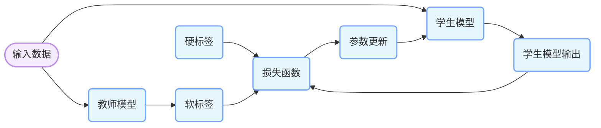

# 推理任务中的知识蒸馏技术应用

> 关键词：推理任务、知识蒸馏技术、模型压缩、教师模型、学生模型、迁移学习

> 摘要：本文围绕推理任务中的知识蒸馏技术应用展开深入探讨。首先介绍了知识蒸馏技术的背景，包括其目的、适用读者群体以及文档结构。接着阐述了核心概念与联系，通过文本示意图和 Mermaid 流程图清晰展示其原理和架构。详细讲解了核心算法原理，并使用 Python 源代码进行具体操作步骤的说明。同时给出了相关的数学模型和公式，并举例说明。通过项目实战，包括开发环境搭建、源代码实现与解读，让读者更直观地了解知识蒸馏技术在推理任务中的应用。还分析了实际应用场景，推荐了学习资源、开发工具框架以及相关论文著作。最后总结了未来发展趋势与挑战，并提供了常见问题解答和扩展阅读参考资料，旨在帮助读者全面掌握推理任务中知识蒸馏技术的应用。

## 1. 背景介绍 
### 1.1 目的和范围
在当今的人工智能和机器学习领域，模型的规模和复杂度不断增加，虽然这些大型模型在各种任务中展现出了卓越的性能，但它们也带来了计算资源消耗大、推理速度慢等问题。尤其是在一些资源受限的场景下，如移动设备、嵌入式系统等，大型模型的应用受到了很大的限制。知识蒸馏技术应运而生，其目的在于将大型复杂模型（教师模型）所学到的知识迁移到小型简单模型（学生模型）中，使得学生模型在保持一定性能的同时，能够显著减少计算资源的需求和推理时间，从而更适合在资源受限的环境中进行推理任务。

本文的范围主要聚焦于知识蒸馏技术在推理任务中的应用。将详细介绍知识蒸馏的核心概念、算法原理、数学模型，通过实际项目案例展示其具体应用，分析其在不同场景下的实际应用情况，并提供相关的学习资源、开发工具和研究论文，帮助读者全面了解和掌握这一技术。

### 1.2 预期读者
本文的预期读者包括但不限于以下几类人群：
- **人工智能和机器学习领域的研究者**：希望深入了解知识蒸馏技术的原理、最新研究进展以及在推理任务中的应用，为其研究工作提供参考和启发。
- **软件开发工程师**：尤其是从事深度学习模型开发和部署的工程师，希望学习如何使用知识蒸馏技术来优化模型，使其能够在资源受限的环境中高效运行。
- **数据科学家**：对模型压缩和优化感兴趣，希望通过知识蒸馏技术提高模型的推理效率，同时保持模型的性能。
- **学生和爱好者**：对人工智能和机器学习有浓厚兴趣，希望通过本文了解知识蒸馏技术的基本概念和应用，拓宽自己的知识面。

### 1.3 文档结构概述
本文将按照以下结构进行组织：
- **核心概念与联系**：介绍知识蒸馏的核心概念，包括教师模型、学生模型、软标签等，并通过文本示意图和 Mermaid 流程图展示其原理和架构。
- **核心算法原理 & 具体操作步骤**：详细讲解知识蒸馏的核心算法原理，并使用 Python 源代码进行具体操作步骤的说明。
- **数学模型和公式 & 详细讲解 & 举例说明**：给出知识蒸馏的数学模型和公式，并通过具体例子进行详细讲解。
- **项目实战：代码实际案例和详细解释说明**：通过一个实际的项目案例，介绍开发环境的搭建、源代码的实现和解读，让读者更直观地了解知识蒸馏技术在推理任务中的应用。
- **实际应用场景**：分析知识蒸馏技术在不同场景下的实际应用情况，如自然语言处理、计算机视觉等。
- **工具和资源推荐**：推荐相关的学习资源、开发工具框架以及研究论文，帮助读者进一步学习和研究知识蒸馏技术。
- **总结：未来发展趋势与挑战**：总结知识蒸馏技术的未来发展趋势和面临的挑战。
- **附录：常见问题与解答**：提供常见问题的解答，帮助读者解决在学习和应用知识蒸馏技术过程中遇到的问题。
- **扩展阅读 & 参考资料**：提供扩展阅读的建议和参考资料，方便读者深入学习和研究。

### 1.4 术语表
#### 1.4.1 核心术语定义
- **知识蒸馏（Knowledge Distillation）**：一种模型压缩和知识迁移技术，通过让学生模型学习教师模型的输出，将教师模型所学到的知识迁移到学生模型中。
- **教师模型（Teacher Model）**：通常是一个大型复杂的模型，具有较高的性能，用于向学生模型传授知识。
- **学生模型（Student Model）**：一个小型简单的模型，通过学习教师模型的输出，在保持一定性能的同时，减少计算资源的需求和推理时间。
- **软标签（Soft Labels）**：教师模型输出的概率分布，包含了比硬标签（类别标签）更多的信息，用于指导学生模型的学习。
- **硬标签（Hard Labels）**：数据集中的真实类别标签。

#### 1.4.2 相关概念解释
- **模型压缩（Model Compression）**：通过各种技术手段减少模型的参数数量和计算复杂度，从而降低模型的存储和计算成本。知识蒸馏是一种常用的模型压缩技术。
- **迁移学习（Transfer Learning）**：将在一个任务上学习到的知识迁移到另一个相关任务上的技术。知识蒸馏可以看作是一种特殊的迁移学习，将教师模型在某个任务上学习到的知识迁移到学生模型上。

#### 1.4.3 缩略词列表
- **DNN（Deep Neural Network）**：深度神经网络
- **CNN（Convolutional Neural Network）**：卷积神经网络
- **RNN（Recurrent Neural Network）**：循环神经网络
- **NLP（Natural Language Processing）**：自然语言处理
- **CV（Computer Vision）**：计算机视觉

## 2. 核心概念与联系 

### 核心概念原理
知识蒸馏的核心思想是让学生模型学习教师模型的输出，从而将教师模型所学到的知识迁移到学生模型中。传统的机器学习训练方法通常使用硬标签（即数据集中的真实类别标签）来训练模型，而知识蒸馏引入了软标签的概念。软标签是教师模型输出的概率分布，它包含了比硬标签更多的信息。例如，在图像分类任务中，对于一张猫的图片，硬标签可能只是简单地标记为“猫”，而软标签则会给出该图片属于不同类别的概率分布，如“猫：0.8，狗：0.1，鸟：0.05，其他：0.05”。通过让学生模型学习软标签，学生模型可以学习到更多关于类别之间的关系和相似性的信息，从而提高其性能。

### 架构的文本示意图
知识蒸馏的基本架构可以描述如下：
- 教师模型：接收输入数据，经过一系列的计算和处理，输出软标签（概率分布）。
- 学生模型：接收相同的输入数据，同时学习硬标签和教师模型输出的软标签。在训练过程中，通过损失函数来衡量学生模型的输出与硬标签和软标签之间的差异，并进行参数更新。
- 损失函数：通常由两部分组成，一部分是学生模型输出与硬标签之间的损失（如交叉熵损失），另一部分是学生模型输出与软标签之间的损失（如 KL 散度损失）。通过调整两部分损失的权重，可以平衡学生模型对硬标签和软标签的学习。

### Mermaid 流程图


该流程图展示了知识蒸馏的基本流程：
1. 输入数据同时进入教师模型和学生模型。
2. 教师模型输出软标签。
3. 学生模型输出预测结果。
4. 损失函数计算学生模型输出与硬标签和软标签之间的差异。
5. 根据损失函数的结果进行参数更新，不断优化学生模型。

## 3. 核心算法原理 & 具体操作步骤 

### 核心算法原理
知识蒸馏的核心算法主要涉及损失函数的设计和优化。常见的损失函数由两部分组成：
- **硬标签损失（$L_{hard}$）**：通常使用交叉熵损失函数来衡量学生模型输出与硬标签之间的差异。交叉熵损失函数的公式为：
$$L_{hard}=-\sum_{i=1}^{C}y_{i}\log(p_{i})$$
其中，$C$ 是类别数，$y_{i}$ 是硬标签的第 $i$ 个分量（通常为 0 或 1），$p_{i}$ 是学生模型输出的第 $i$ 个分量（概率值）。

- **软标签损失（$L_{soft}$）**：通常使用 KL 散度损失函数来衡量学生模型输出与教师模型输出的软标签之间的差异。KL 散度损失函数的公式为：
$$L_{soft}=\sum_{i=1}^{C}q_{i}\log(\frac{q_{i}}{p_{i}})$$
其中，$q_{i}$ 是教师模型输出的软标签的第 $i$ 个分量（概率值），$p_{i}$ 是学生模型输出的第 $i$ 个分量（概率值）。

最终的损失函数 $L$ 是硬标签损失和软标签损失的加权和：
$$L = \alpha L_{hard}+(1 - \alpha)L_{soft}$$
其中，$\alpha$ 是一个权重参数，用于平衡硬标签损失和软标签损失的重要性。

### 具体操作步骤
以下是使用 Python 和 PyTorch 实现知识蒸馏的具体操作步骤：

```python
import torch
import torch.nn as nn
import torch.optim as optim

# 定义教师模型和学生模型
class TeacherModel(nn.Module):
    def __init__(self, input_size, hidden_size, output_size):
        super(TeacherModel, self).__init__()
        self.fc1 = nn.Linear(input_size, hidden_size)
        self.relu = nn.ReLU()
        self.fc2 = nn.Linear(hidden_size, output_size)

    def forward(self, x):
        out = self.fc1(x)
        out = self.relu(out)
        out = self.fc2(out)
        return out

class StudentModel(nn.Module):
    def __init__(self, input_size, output_size):
        super(StudentModel, self).__init__()
        self.fc = nn.Linear(input_size, output_size)

    def forward(self, x):
        out = self.fc(x)
        return out

# 初始化模型
input_size = 10
hidden_size = 20
output_size = 5
teacher_model = TeacherModel(input_size, hidden_size, output_size)
student_model = StudentModel(input_size, output_size)

# 定义损失函数和优化器
criterion_hard = nn.CrossEntropyLoss()
criterion_soft = nn.KLDivLoss(reduction='batchmean')
optimizer = optim.Adam(student_model.parameters(), lr=0.001)

# 模拟训练数据
num_samples = 100
x = torch.randn(num_samples, input_size)
y_hard = torch.randint(0, output_size, (num_samples,))

# 训练学生模型
num_epochs = 100
alpha = 0.3
temperature = 2.0

for epoch in range(num_epochs):
    # 教师模型输出软标签
    with torch.no_grad():
        teacher_output = teacher_model(x)
        teacher_soft_labels = nn.functional.softmax(teacher_output / temperature, dim=1)

    # 学生模型前向传播
    student_output = student_model(x)
    student_soft_output = nn.functional.log_softmax(student_output / temperature, dim=1)

    # 计算硬标签损失
    loss_hard = criterion_hard(student_output, y_hard)

    # 计算软标签损失
    loss_soft = criterion_soft(student_soft_output, teacher_soft_labels)

    # 计算总损失
    loss = alpha * loss_hard + (1 - alpha) * temperature * temperature * loss_soft

    # 反向传播和参数更新
    optimizer.zero_grad()
    loss.backward()
    optimizer.step()

    if (epoch + 1) % 10 == 0:
        print(f'Epoch [{epoch + 1}/{num_epochs}], Loss: {loss.item():.4f}')
```

### 代码解释
1. **模型定义**：定义了教师模型 `TeacherModel` 和学生模型 `StudentModel`，教师模型包含一个隐藏层，学生模型只有一个全连接层。
2. **损失函数和优化器**：使用交叉熵损失函数 `nn.CrossEntropyLoss()` 计算硬标签损失，使用 KL 散度损失函数 `nn.KLDivLoss()` 计算软标签损失。使用 Adam 优化器对学生模型的参数进行更新。
3. **模拟训练数据**：生成了 100 个样本的输入数据 `x` 和对应的硬标签 `y_hard`。
4. **训练过程**：
    - 教师模型输出软标签：通过 `teacher_model(x)` 得到教师模型的输出，然后使用 `nn.functional.softmax()` 函数将其转换为概率分布。
    - 学生模型前向传播：通过 `student_model(x)` 得到学生模型的输出，然后使用 `nn.functional.log_softmax()` 函数将其转换为对数概率分布。
    - 计算损失：分别计算硬标签损失和软标签损失，然后根据权重参数 $\alpha$ 计算总损失。
    - 反向传播和参数更新：使用 `loss.backward()` 进行反向传播，使用 `optimizer.step()` 更新学生模型的参数。

## 4. 数学模型和公式 & 详细讲解 & 举例说明 

### 数学模型和公式
如前面所述，知识蒸馏的损失函数由硬标签损失和软标签损失组成：
- **硬标签损失（$L_{hard}$）**：
$$L_{hard}=-\sum_{i=1}^{C}y_{i}\log(p_{i})$$
其中，$C$ 是类别数，$y_{i}$ 是硬标签的第 $i$ 个分量（通常为 0 或 1），$p_{i}$ 是学生模型输出的第 $i$ 个分量（概率值）。

- **软标签损失（$L_{soft}$）**：
$$L_{soft}=\sum_{i=1}^{C}q_{i}\log(\frac{q_{i}}{p_{i}})$$
其中，$q_{i}$ 是教师模型输出的软标签的第 $i$ 个分量（概率值），$p_{i}$ 是学生模型输出的第 $i$ 个分量（概率值）。

- **总损失（$L$）**：
$$L = \alpha L_{hard}+(1 - \alpha)L_{soft}$$
其中，$\alpha$ 是一个权重参数，用于平衡硬标签损失和软标签损失的重要性。

### 详细讲解
- **硬标签损失**：硬标签损失是传统的交叉熵损失，用于衡量学生模型输出与真实类别标签之间的差异。它鼓励学生模型尽可能准确地预测每个样本的真实类别。
- **软标签损失**：软标签损失使用 KL 散度来衡量学生模型输出与教师模型输出的软标签之间的差异。KL 散度是一种衡量两个概率分布之间差异的指标，它表示从一个概率分布 $p$ 到另一个概率分布 $q$ 的信息损失。通过最小化软标签损失，学生模型可以学习到教师模型所学到的类别之间的关系和相似性。
- **总损失**：总损失是硬标签损失和软标签损失的加权和。权重参数 $\alpha$ 可以根据具体任务和数据集进行调整。当 $\alpha$ 接近 1 时，学生模型更注重学习硬标签；当 $\alpha$ 接近 0 时，学生模型更注重学习软标签。

### 举例说明
假设我们有一个三分类任务，输入一个样本 $x$，教师模型的输出为 $[0.7, 0.2, 0.1]$，学生模型的输出为 $[0.6, 0.3, 0.1]$，真实硬标签为 $[1, 0, 0]$。

- **硬标签损失计算**：
$$L_{hard}=-\sum_{i=1}^{3}y_{i}\log(p_{i})=-1\times\log(0.6)-0\times\log(0.3)-0\times\log(0.1)\approx0.5108$$

- **软标签损失计算**：
$$L_{soft}=\sum_{i=1}^{3}q_{i}\log(\frac{q_{i}}{p_{i}})=0.7\times\log(\frac{0.7}{0.6})+0.2\times\log(\frac{0.2}{0.3})+0.1\times\log(\frac{0.1}{0.1})\approx0.0561$$

假设 $\alpha = 0.3$，则总损失为：
$$L = 0.3\times0.5108+(1 - 0.3)\times0.0561\approx0.1936$$

## 5. 项目实战：代码实际案例和详细解释说明 

### 5.1  开发环境搭建
在进行知识蒸馏的项目实战之前，需要搭建相应的开发环境。以下是具体的步骤：

#### 安装 Python
首先，确保你已经安装了 Python 3.6 或更高版本。可以从 Python 官方网站（https://www.python.org/downloads/）下载并安装 Python。

#### 创建虚拟环境
为了避免不同项目之间的依赖冲突，建议使用虚拟环境。可以使用 `venv` 或 `conda` 来创建虚拟环境。以下是使用 `venv` 创建虚拟环境的示例：
```bash
python -m venv knowledge_distillation_env
source knowledge_distillation_env/bin/activate  # 对于 Linux/Mac
knowledge_distillation_env\Scripts\activate  # 对于 Windows
```

#### 安装必要的库
在虚拟环境中，安装必要的深度学习库，如 PyTorch、NumPy、Matplotlib 等。可以使用 `pip` 来安装这些库：
```bash
pip install torch torchvision numpy matplotlib
```

### 5.2  源代码详细实现和代码解读
以下是一个使用知识蒸馏技术在 MNIST 数据集上进行手写数字分类的完整代码示例：

```python
import torch
import torch.nn as nn
import torch.optim as optim
import torchvision
import torchvision.transforms as transforms

# 定义教师模型
class TeacherModel(nn.Module):
    def __init__(self):
        super(TeacherModel, self).__init__()
        self.conv1 = nn.Conv2d(1, 16, kernel_size=3, padding=1)
        self.relu1 = nn.ReLU()
        self.pool1 = nn.MaxPool2d(2)
        self.conv2 = nn.Conv2d(16, 32, kernel_size=3, padding=1)
        self.relu2 = nn.ReLU()
        self.pool2 = nn.MaxPool2d(2)
        self.fc1 = nn.Linear(32 * 7 * 7, 128)
        self.relu3 = nn.ReLU()
        self.fc2 = nn.Linear(128, 10)

    def forward(self, x):
        out = self.conv1(x)
        out = self.relu1(out)
        out = self.pool1(out)
        out = self.conv2(out)
        out = self.relu2(out)
        out = self.pool2(out)
        out = out.view(-1, 32 * 7 * 7)
        out = self.fc1(out)
        out = self.relu3(out)
        out = self.fc2(out)
        return out

# 定义学生模型
class StudentModel(nn.Module):
    def __init__(self):
        super(StudentModel, self).__init__()
        self.fc1 = nn.Linear(28 * 28, 64)
        self.relu = nn.ReLU()
        self.fc2 = nn.Linear(64, 10)

    def forward(self, x):
        x = x.view(-1, 28 * 28)
        out = self.fc1(x)
        out = self.relu(out)
        out = self.fc2(out)
        return out

# 数据加载
transform = transforms.Compose([
    transforms.ToTensor(),
    transforms.Normalize((0.5,), (0.5,))
])

trainset = torchvision.datasets.MNIST(root='./data', train=True,
                                      download=True, transform=transform)
trainloader = torch.utils.data.DataLoader(trainset, batch_size=64,
                                          shuffle=True)

testset = torchvision.datasets.MNIST(root='./data', train=False,
                                     download=True, transform=transform)
testloader = torch.utils.data.DataLoader(testset, batch_size=64,
                                         shuffle=False)

# 初始化模型
teacher_model = TeacherModel()
student_model = StudentModel()

# 定义损失函数和优化器
criterion_hard = nn.CrossEntropyLoss()
criterion_soft = nn.KLDivLoss(reduction='batchmean')
optimizer = optim.Adam(student_model.parameters(), lr=0.001)

# 训练学生模型
num_epochs = 10
alpha = 0.3
temperature = 2.0

for epoch in range(num_epochs):
    running_loss = 0.0
    for i, data in enumerate(trainloader, 0):
        inputs, labels = data

        # 教师模型输出软标签
        with torch.no_grad():
            teacher_output = teacher_model(inputs)
            teacher_soft_labels = nn.functional.softmax(teacher_output / temperature, dim=1)

        # 学生模型前向传播
        student_output = student_model(inputs)
        student_soft_output = nn.functional.log_softmax(student_output / temperature, dim=1)

        # 计算硬标签损失
        loss_hard = criterion_hard(student_output, labels)

        # 计算软标签损失
        loss_soft = criterion_soft(student_soft_output, teacher_soft_labels)

        # 计算总损失
        loss = alpha * loss_hard + (1 - alpha) * temperature * temperature * loss_soft

        # 反向传播和参数更新
        optimizer.zero_grad()
        loss.backward()
        optimizer.step()

        running_loss += loss.item()

    print(f'Epoch [{epoch + 1}/{num_epochs}], Loss: {running_loss / len(trainloader):.4f}')

# 测试学生模型
correct = 0
total = 0
with torch.no_grad():
    for data in testloader:
        images, labels = data
        outputs = student_model(images)
        _, predicted = torch.max(outputs.data, 1)
        total += labels.size(0)
        correct += (predicted == labels).sum().item()

print(f'Accuracy of the student network on the 10000 test images: {100 * correct / total}%')
```

### 5.3  代码解读与分析
#### 模型定义
- **教师模型（`TeacherModel`）**：是一个简单的卷积神经网络，包含两个卷积层、两个池化层和两个全连接层。用于学习 MNIST 数据集上的手写数字分类任务。
- **学生模型（`StudentModel`）**：是一个简单的全连接神经网络，包含两个全连接层。用于通过知识蒸馏学习教师模型的知识。

#### 数据加载
使用 `torchvision` 库加载 MNIST 数据集，并进行归一化处理。将数据集分为训练集和测试集，并使用 `DataLoader` 进行批量加载。

#### 训练过程
- **教师模型输出软标签**：在每个训练批次中，首先使用教师模型对输入数据进行前向传播，得到教师模型的输出，然后使用 `nn.functional.softmax()` 函数将其转换为软标签。
- **学生模型前向传播**：学生模型对相同的输入数据进行前向传播，得到学生模型的输出，然后使用 `nn.functional.log_softmax()` 函数将其转换为对数概率分布。
- **损失计算**：分别计算硬标签损失和软标签损失，然后根据权重参数 $\alpha$ 计算总损失。
- **反向传播和参数更新**：使用 `loss.backward()` 进行反向传播，使用 `optimizer.step()` 更新学生模型的参数。

#### 测试过程
在训练完成后，使用测试集对学生模型进行测试，计算学生模型在测试集上的准确率。

通过这个项目实战，我们可以看到知识蒸馏技术可以帮助小型的学生模型在保持一定准确率的同时，减少模型的复杂度和计算资源的需求。

## 6. 实际应用场景 
知识蒸馏技术在多个领域都有广泛的应用，以下是一些常见的实际应用场景：

### 自然语言处理（NLP）
- **问答系统**：在问答系统中，通常需要处理大量的文本数据，对模型的推理速度和计算资源有较高的要求。知识蒸馏技术可以将大型的预训练语言模型（如 BERT、GPT 等）的知识迁移到小型模型中，从而提高问答系统的推理效率。
- **文本分类**：对于文本分类任务，如情感分析、新闻分类等，知识蒸馏可以帮助小型模型学习大型模型的分类策略，提高分类的准确率和效率。
- **机器翻译**：在机器翻译中，知识蒸馏可以将大型的翻译模型的知识迁移到小型模型中，使得翻译模型能够在资源受限的设备上快速运行。

### 计算机视觉（CV）
- **图像分类**：在图像分类任务中，知识蒸馏可以将大型的卷积神经网络（如 ResNet、VGG 等）的知识迁移到小型模型中，提高小型模型的分类性能。
- **目标检测**：目标检测任务需要对图像中的目标进行定位和分类，计算量较大。知识蒸馏可以帮助小型的目标检测模型学习大型模型的检测策略，提高检测的速度和准确率。
- **人脸识别**：在人脸识别系统中，知识蒸馏可以将大型的人脸识别模型的知识迁移到小型模型中，使得人脸识别系统能够在移动设备等资源受限的环境中运行。

### 语音识别
- **实时语音识别**：在实时语音识别场景中，对模型的推理速度要求较高。知识蒸馏技术可以将大型的语音识别模型的知识迁移到小型模型中，提高语音识别的实时性。
- **语音唤醒**：语音唤醒功能需要在低功耗的设备上运行，知识蒸馏可以帮助小型的语音唤醒模型学习大型模型的唤醒策略，提高唤醒的准确率和效率。

### 物联网（IoT）
- **智能传感器**：在物联网设备中，智能传感器需要对采集到的数据进行实时处理和分析。知识蒸馏技术可以将大型的数据分析模型的知识迁移到小型模型中，使得智能传感器能够在资源受限的情况下高效运行。
- **智能家居**：智能家居系统需要对各种传感器数据进行处理和决策，知识蒸馏可以帮助小型的智能家居模型学习大型模型的决策策略，提高智能家居系统的智能化水平。

## 7. 工具和资源推荐
### 7.1 学习资源推荐
#### 7.1.1 书籍推荐
- 《深度学习》（Deep Learning）：由 Ian Goodfellow、Yoshua Bengio 和 Aaron Courville 撰写，是深度学习领域的经典教材，涵盖了深度学习的基本概念、算法和应用。
- 《动手学深度学习》（Dive into Deep Learning）：由 Aston Zhang、Zack C. Lipton、Mu Li 和 Alexander J. Smola 撰写，以代码和实践为导向，介绍了深度学习的基本原理和应用。
- 《人工智能：一种现代的方法》（Artificial Intelligence: A Modern Approach）：由 Stuart Russell 和 Peter Norvig 撰写，是人工智能领域的经典教材，涵盖了人工智能的各个方面，包括知识蒸馏等技术。

#### 7.1.2 在线课程
- Coursera 上的“深度学习专项课程”（Deep Learning Specialization）：由 Andrew Ng 教授授课，包括深度学习的基础、卷积神经网络、循环神经网络等内容。
- edX 上的“使用 PyTorch 进行深度学习”（Introduction to Deep Learning with PyTorch）：介绍了使用 PyTorch 进行深度学习开发的基本方法和技巧。
- 哔哩哔哩（B 站）上有许多关于深度学习和知识蒸馏的教学视频，可以根据自己的需求进行搜索和学习。

#### 7.1.3 技术博客和网站
- Medium：是一个技术博客平台，有许多关于深度学习和知识蒸馏的文章，可以关注一些知名的博主和技术团队。
- arXiv：是一个预印本论文平台，提供了大量关于深度学习和知识蒸馏的最新研究成果。
- GitHub：是一个代码托管平台，有许多关于知识蒸馏的开源项目，可以参考和学习。

### 7.2 开发工具框架推荐
#### 7.2.1 IDE和编辑器
- PyCharm：是一款专门为 Python 开发设计的集成开发环境（IDE），提供了丰富的功能和工具，如代码调试、代码分析、版本控制等。
- Jupyter Notebook：是一个交互式的开发环境，适合进行数据分析、模型训练和实验。可以通过浏览器访问，方便分享和展示代码和结果。
- Visual Studio Code：是一款轻量级的代码编辑器，支持多种编程语言和插件扩展。可以安装 Python 相关的插件，进行 Python 开发。

#### 7.2.2 调试和性能分析工具
- PyTorch Profiler：是 PyTorch 提供的性能分析工具，可以帮助开发者分析模型的性能瓶颈，优化模型的训练和推理速度。
- TensorBoard：是 TensorFlow 提供的可视化工具，也可以与 PyTorch 结合使用。可以用于可视化模型的训练过程、损失曲线、准确率等指标。
- cProfile：是 Python 内置的性能分析工具，可以帮助开发者分析代码的性能瓶颈，找出耗时较长的函数和代码段。

#### 7.2.3 相关框架和库
- PyTorch：是一个开源的深度学习框架，提供了丰富的神经网络层和优化算法，支持 GPU 加速。是知识蒸馏技术开发的常用框架之一。
- TensorFlow：是另一个开源的深度学习框架，具有广泛的应用和社区支持。也可以用于知识蒸馏技术的开发。
- Scikit-learn：是一个开源的机器学习库，提供了各种机器学习算法和工具，如分类、回归、聚类等。可以用于数据预处理和模型评估。

### 7.3 相关论文著作推荐
#### 7.3.1 经典论文
- “Distilling the Knowledge in a Neural Network”：由 Geoffrey Hinton、Oriol Vinyals 和 Jeff Dean 撰写，是知识蒸馏领域的经典论文，首次提出了知识蒸馏的概念和方法。
- “MobileNetV2: Inverted Residuals and Linear Bottlenecks”：介绍了 MobileNetV2 模型，该模型采用了知识蒸馏等技术，在保持较高准确率的同时，显著减少了模型的参数数量和计算量。
- “BERT: Pre-training of Deep Bidirectional Transformers for Language Understanding”：介绍了 BERT 模型，该模型在自然语言处理领域取得了巨大的成功。后续有许多关于 BERT 模型知识蒸馏的研究。

#### 7.3.2 最新研究成果
- 可以关注 arXiv 上关于知识蒸馏的最新论文，了解该领域的最新研究进展和技术创新。
- 参加相关的学术会议，如 NeurIPS、ICML、CVPR 等，听取最新的研究报告和成果分享。

#### 7.3.3 应用案例分析
- 许多科技公司和研究机构会发布关于知识蒸馏技术在实际应用中的案例分析，可以关注这些案例，学习如何将知识蒸馏技术应用到实际项目中。
- 可以在 GitHub 上搜索相关的开源项目，了解他人是如何实现知识蒸馏技术的，并参考其代码和实现思路。

## 8. 总结：未来发展趋势与挑战
### 未来发展趋势
- **多模态知识蒸馏**：随着人工智能技术的发展，多模态数据（如图像、文本、语音等）的处理变得越来越重要。未来，知识蒸馏技术可能会向多模态方向发展，将不同模态的知识进行融合和迁移，提高模型在多模态任务中的性能。
- **自适应知识蒸馏**：现有的知识蒸馏方法通常使用固定的权重参数来平衡硬标签损失和软标签损失。未来，可能会研究自适应的知识蒸馏方法，根据不同的数据集、任务和模型动态调整权重参数，提高知识蒸馏的效果。
- **知识蒸馏与其他技术的结合**：知识蒸馏技术可以与其他技术（如迁移学习、强化学习等）相结合，发挥更大的作用。例如，将知识蒸馏与迁移学习相结合，可以在不同领域和任务之间更高效地迁移知识。
- **硬件友好型知识蒸馏**：随着硬件技术的发展，如边缘计算、物联网设备等，对模型的计算资源和能耗要求越来越高。未来，知识蒸馏技术可能会更加注重硬件友好型设计，开发出适合不同硬件平台的知识蒸馏方法和模型。

### 挑战
- **知识表示和迁移的有效性**：如何有效地表示和迁移教师模型的知识是知识蒸馏技术面临的一个挑战。不同的模型和任务可能需要不同的知识表示方法，如何选择合适的方法并确保知识的有效迁移是需要进一步研究的问题。
- **教师模型的选择和训练**：教师模型的性能和质量对知识蒸馏的效果有很大的影响。如何选择合适的教师模型，并对其进行有效的训练，是知识蒸馏技术需要解决的问题之一。
- **学生模型的设计和优化**：学生模型的设计和优化也是知识蒸馏技术的关键。如何设计出小型高效的学生模型，并通过知识蒸馏使其达到较好的性能，是需要不断探索和研究的方向。
- **可解释性和公平性**：随着人工智能技术的广泛应用，模型的可解释性和公平性变得越来越重要。知识蒸馏技术如何保证模型的可解释性和公平性，避免出现偏见和歧视，是需要关注的问题。

## 9. 附录：常见问题与解答
### 问题 1：知识蒸馏技术一定能提高学生模型的性能吗？
答：知识蒸馏技术并不一定能保证提高学生模型的性能。其效果受到多种因素的影响，如教师模型的质量、学生模型的设计、损失函数的选择、权重参数的设置等。在某些情况下，如果教师模型的性能不佳，或者知识蒸馏的方法不当，学生模型的性能可能不会得到提升，甚至可能会下降。因此，在使用知识蒸馏技术时，需要根据具体情况进行实验和调整，以获得最佳的效果。

### 问题 2：如何选择合适的教师模型和学生模型？
答：选择合适的教师模型和学生模型需要考虑多个因素：
- **教师模型**：通常选择性能较好、复杂度较高的模型作为教师模型。例如，在图像分类任务中，可以选择 ResNet、VGG 等经典的卷积神经网络；在自然语言处理任务中，可以选择 BERT、GPT 等预训练语言模型。
- **学生模型**：学生模型应该在保证一定性能的前提下，尽可能地简单和轻量级。可以根据具体任务和应用场景选择合适的模型结构，如全连接神经网络、简单的卷积神经网络等。

### 问题 3：如何调整硬标签损失和软标签损失的权重参数 $\alpha$？
答：权重参数 $\alpha$ 的调整需要根据具体任务和数据集进行实验和优化。一般来说，可以从一些经验值开始尝试，如 $\alpha = 0.3$ 或 $\alpha = 0.5$。然后，通过在验证集上进行实验，观察不同 $\alpha$ 值下学生模型的性能变化，选择性能最佳的 $\alpha$ 值。在实际应用中，也可以使用一些自动调整的方法，如自适应权重调整策略，根据训练过程中的损失变化动态调整 $\alpha$ 值。

### 问题 4：知识蒸馏技术可以应用于无监督学习任务吗？
答：可以。知识蒸馏技术不仅可以应用于有监督学习任务，也可以应用于无监督学习任务。在无监督学习中，教师模型可以学习到数据的一些潜在特征和分布信息，然后通过知识蒸馏将这些信息传递给学生模型。例如，在自编码器、生成对抗网络等无监督学习模型中，可以使用知识蒸馏技术来提高模型的性能和效率。

### 问题 5：知识蒸馏技术与模型量化有什么区别和联系？
答：知识蒸馏技术和模型量化都是模型压缩的方法，但它们的侧重点不同：
- **区别**：知识蒸馏技术主要是通过让学生模型学习教师模型的知识，来提高学生模型的性能和效率；而模型量化主要是通过减少模型参数的表示精度，来降低模型的存储和计算成本。
- **联系**：知识蒸馏技术和模型量化可以结合使用，进一步提高模型的压缩效果。例如，可以先使用知识蒸馏技术将教师模型的知识迁移到学生模型中，然后再对学生模型进行量化处理，以获得更小、更快的模型。

## 10. 扩展阅读 & 参考资料
### 扩展阅读
- 深入研究知识蒸馏技术的变体和改进方法，如 FitNets、Attention Transfer 等。
- 学习其他模型压缩技术，如剪枝、量化等，并了解它们与知识蒸馏技术的结合应用。
- 关注知识蒸馏技术在新兴领域的应用，如医疗影像分析、自动驾驶等。

### 参考资料
- Hinton, G., Vinyals, O., & Dean, J. (2015). Distilling the Knowledge in a Neural Network. arXiv preprint arXiv:1503.02531.
- Sandler, M., Howard, A., Zhu, M., Zhmoginov, A., & Chen, L. C. (2018). MobileNetV2: Inverted Residuals and Linear Bottlenecks. In Proceedings of the IEEE conference on computer vision and pattern recognition (pp. 4510-4520).
- Devlin, J., Chang, M. W., Lee, K., & Toutanova, K. (2018). BERT: Pre-training of Deep Bidirectional Transformers for Language Understanding. arXiv preprint arXiv:1810.04805.
- PyTorch 官方文档：https://pytorch.org/docs/stable/index.html
- TensorFlow 官方文档：https://www.tensorflow.org/api_docs

作者：AI天才研究院/AI Genius Institute & 禅与计算机程序设计艺术 /Zen And The Art of Computer Programming