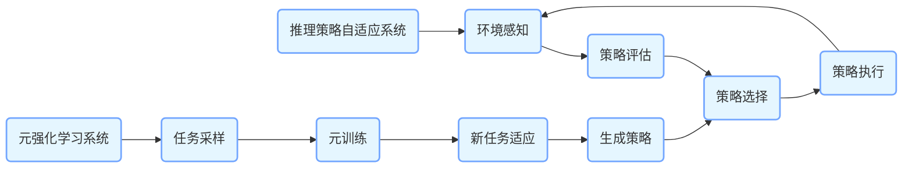

# 推理策略自适应中元强化学习的优化方法

> 关键词：推理策略自适应、元强化学习、优化方法、策略调整、智能决策

> 摘要：本文聚焦于推理策略自适应中元强化学习的优化方法。首先介绍了相关背景，包括研究目的、预期读者等内容。接着阐述了核心概念及联系，详细说明了推理策略自适应和元强化学习的原理与架构，并给出相应的示意图和流程图。深入讲解了核心算法原理及具体操作步骤，用 Python 代码进行详细阐释。同时，介绍了相关的数学模型和公式，并举例说明。通过项目实战部分，展示了代码实际案例及详细解释。探讨了实际应用场景，推荐了学习资源、开发工具框架以及相关论文著作。最后总结了未来发展趋势与挑战，并提供了常见问题解答和扩展阅读参考资料，旨在为该领域的研究和实践提供全面而深入的指导。

## 1. 背景介绍 
### 1.1 目的和范围
推理策略自适应是指智能系统能够根据不同的任务和环境动态地调整其推理策略，以实现更高效、准确的决策。元强化学习则是强化学习的一个扩展，旨在让智能体能够快速适应新的任务或环境变化。本研究的目的在于探索如何优化推理策略自适应中的元强化学习方法，提高智能体在复杂动态环境下的学习和决策能力。研究范围涵盖了从理论算法到实际应用的多个层面，包括核心算法原理、数学模型、项目实战以及实际应用场景等。

### 1.2 预期读者
本文预期读者包括人工智能、机器学习领域的研究人员、开发者，对强化学习和推理策略优化感兴趣的学生，以及从事智能决策系统开发的工程师等。这些读者具备一定的机器学习和编程基础，希望深入了解推理策略自适应中元强化学习的优化方法。

### 1.3 文档结构概述
本文将按照以下结构进行组织：首先介绍背景信息，让读者了解研究的目的和范围。接着阐述核心概念与联系，包括推理策略自适应和元强化学习的原理及架构。然后详细讲解核心算法原理和具体操作步骤，并用 Python 代码进行说明。之后介绍相关的数学模型和公式，并举例说明。通过项目实战部分展示代码实际案例和详细解释。探讨实际应用场景，为读者提供应用思路。推荐学习资源、开发工具框架以及相关论文著作，帮助读者进一步深入学习。最后总结未来发展趋势与挑战，提供常见问题解答和扩展阅读参考资料。

### 1.4 术语表
#### 1.4.1 核心术语定义
- **推理策略自适应**：智能系统根据不同任务和环境动态调整推理策略的能力。
- **元强化学习**：一种强化学习方法，旨在让智能体能够快速适应新任务或环境变化，通过学习如何学习来提高学习效率。
- **策略网络**：在强化学习中，用于生成智能体行动策略的神经网络。
- **价值网络**：用于估计智能体在不同状态下的价值的神经网络。

#### 1.4.2 相关概念解释
- **强化学习**：一种机器学习范式，智能体通过与环境进行交互，根据环境反馈的奖励信号来学习最优策略。
- **元学习**：学习如何学习的过程，通过在多个任务上进行训练，使模型能够快速适应新任务。
- **自适应推理**：根据环境变化和任务需求，自动调整推理过程和策略。

#### 1.4.3 缩略词列表
- **RL**：强化学习（Reinforcement Learning）
- **MRL**：元强化学习（Meta Reinforcement Learning）
- **DNN**：深度神经网络（Deep Neural Network）

## 2. 核心概念与联系 

### 推理策略自适应原理
推理策略自适应的核心在于智能系统能够感知环境变化和任务需求，并根据这些信息动态地调整推理策略。例如，在一个智能诊断系统中，当面对不同类型的疾病时，系统需要采用不同的推理方法来进行准确诊断。推理策略自适应可以通过以下几个步骤实现：
1. **环境感知**：系统通过传感器或其他手段获取环境信息，包括任务类型、数据特征等。
2. **策略评估**：根据感知到的环境信息，对不同的推理策略进行评估，判断其在当前环境下的有效性。
3. **策略选择**：从候选的推理策略中选择最适合当前环境的策略。
4. **策略执行**：执行选择的推理策略，并根据执行结果进行反馈和调整。

### 元强化学习原理
元强化学习是在传统强化学习的基础上，引入了元学习的思想。传统强化学习通常需要在每个新任务上进行大量的训练才能学习到有效的策略，而元强化学习则通过在多个相关任务上进行训练，学习到如何快速适应新任务。元强化学习的核心是元策略网络，它可以根据当前任务的特征生成适合该任务的策略。具体来说，元强化学习的过程如下：
1. **任务采样**：从任务分布中采样多个任务。
2. **元训练**：在采样的任务上进行训练，优化元策略网络的参数，使其能够快速适应不同的任务。
3. **新任务适应**：当遇到新任务时，元策略网络根据任务特征生成初始策略，并在新任务上进行少量的训练来进一步优化策略。

### 推理策略自适应与元强化学习的联系
推理策略自适应和元强化学习之间存在着紧密的联系。推理策略自适应可以看作是元强化学习在推理任务中的具体应用。元强化学习提供了一种有效的方法来学习如何快速适应不同的推理任务，而推理策略自适应则强调了在实际推理过程中根据环境变化动态调整策略的重要性。通过结合推理策略自适应和元强化学习，可以实现智能系统在复杂动态环境下的高效推理和决策。

### 核心概念架构的文本示意图
```plaintext
+----------------------+
|  推理策略自适应系统  |
|                      |
|  +----------------+  |
|  |  环境感知模块  |  |
|  +----------------+  |
|  |  策略评估模块  |  |
|  +----------------+  |
|  |  策略选择模块  |  |
|  +----------------+  |
|  |  策略执行模块  |  |
|  +----------------+  |
|                      |
+----------------------+
        ^
        |
+----------------------+
|    元强化学习系统    |
|                      |
|  +----------------+  |
|  |  任务采样模块  |  |
|  +----------------+  |
|  |  元训练模块    |  |
|  +----------------+  |
|  |  新任务适应模块|  |
|  +----------------+  |
|                      |
+----------------------+
```

### Mermaid 流程图


## 3. 核心算法原理 & 具体操作步骤 

### 元强化学习算法原理
元强化学习的核心算法通常基于策略梯度方法，如 A2C（Advantage Actor - Critic）或 PPO（Proximal Policy Optimization）。下面以 A2C 为例介绍元强化学习的算法原理。

A2C 算法结合了策略网络（Actor）和价值网络（Critic）。策略网络用于生成智能体的行动策略，而价值网络用于估计智能体在不同状态下的价值。在元强化学习中，我们需要在多个任务上进行训练，以学习到一个通用的元策略网络。

### 具体操作步骤
#### 步骤 1：定义策略网络和价值网络
```python
import torch
import torch.nn as nn

# 定义策略网络
class PolicyNetwork(nn.Module):
    def __init__(self, input_dim, output_dim):
        super(PolicyNetwork, self).__init__()
        self.fc1 = nn.Linear(input_dim, 64)
        self.fc2 = nn.Linear(64, output_dim)

    def forward(self, x):
        x = torch.relu(self.fc1(x))
        action_probs = torch.softmax(self.fc2(x), dim=-1)
        return action_probs

# 定义价值网络
class ValueNetwork(nn.Module):
    def __init__(self, input_dim):
        super(ValueNetwork, self).__init__()
        self.fc1 = nn.Linear(input_dim, 64)
        self.fc2 = nn.Linear(64, 1)

    def forward(self, x):
        x = torch.relu(self.fc1(x))
        value = self.fc2(x)
        return value
```

#### 步骤 2：初始化网络参数
```python
input_dim = 10  # 输入维度
output_dim = 4  # 输出维度

policy_network = PolicyNetwork(input_dim, output_dim)
value_network = ValueNetwork(input_dim)

policy_optimizer = torch.optim.Adam(policy_network.parameters(), lr=0.001)
value_optimizer = torch.optim.Adam(value_network.parameters(), lr=0.001)
```

#### 步骤 3：任务采样
```python
import numpy as np

# 假设任务分布为一个简单的高斯分布
def sample_task():
    mean = np.random.normal(0, 1, input_dim)
    std = np.random.uniform(0.1, 1, input_dim)
    return mean, std
```

#### 步骤 4：元训练
```python
num_tasks = 100
num_episodes_per_task = 10

for task in range(num_tasks):
    mean, std = sample_task()
    for episode in range(num_episodes_per_task):
        state = torch.tensor(np.random.normal(mean, std), dtype=torch.float32)
        action_probs = policy_network(state)
        action = torch.multinomial(action_probs, 1).item()

        # 模拟环境反馈
        reward = np.random.normal(0, 1)

        value = value_network(state)
        advantage = reward - value.item()

        # 策略梯度更新
        log_prob = torch.log(action_probs[action])
        policy_loss = -log_prob * advantage
        policy_optimizer.zero_grad()
        policy_loss.backward()
        policy_optimizer.step()

        # 价值网络更新
        value_loss = nn.MSELoss()(value, torch.tensor([reward], dtype=torch.float32))
        value_optimizer.zero_grad()
        value_loss.backward()
        value_optimizer.step()
```

#### 步骤 5：新任务适应
```python
# 新任务采样
new_mean, new_std = sample_task()

# 在新任务上进行少量训练
num_adaptation_episodes = 5
for episode in range(num_adaptation_episodes):
    state = torch.tensor(np.random.normal(new_mean, new_std), dtype=torch.float32)
    action_probs = policy_network(state)
    action = torch.multinomial(action_probs, 1).item()

    reward = np.random.normal(0, 1)

    value = value_network(state)
    advantage = reward - value.item()

    log_prob = torch.log(action_probs[action])
    policy_loss = -log_prob * advantage
    policy_optimizer.zero_grad()
    policy_loss.backward()
    policy_optimizer.step()

    value_loss = nn.MSELoss()(value, torch.tensor([reward], dtype=torch.float32))
    value_optimizer.zero_grad()
    value_loss.backward()
    value_optimizer.step()
```

## 4. 数学模型和公式 & 详细讲解 & 举例说明 

### 策略梯度公式
在策略梯度方法中，我们的目标是最大化智能体在环境中获得的累积奖励。策略梯度定理表明，策略网络参数 $\theta$ 的梯度可以表示为：

$$\nabla_{\theta} J(\theta) = \mathbb{E}_{\tau \sim \pi_{\theta}} \left[ \sum_{t=0}^{T} \nabla_{\theta} \log \pi_{\theta}(a_t | s_t) A^{\pi_{\theta}}(s_t, a_t) \right]$$

其中，$J(\theta)$ 是策略网络的目标函数，$\tau$ 是一个轨迹，$\pi_{\theta}(a_t | s_t)$ 是策略网络在状态 $s_t$ 下选择动作 $a_t$ 的概率，$A^{\pi_{\theta}}(s_t, a_t)$ 是优势函数，表示在状态 $s_t$ 下选择动作 $a_t$ 相对于平均动作的优势。

### 优势函数
优势函数可以定义为：

$$A^{\pi_{\theta}}(s_t, a_t) = Q^{\pi_{\theta}}(s_t, a_t) - V^{\pi_{\theta}}(s_t)$$

其中，$Q^{\pi_{\theta}}(s_t, a_t)$ 是状态 - 动作价值函数，表示在状态 $s_t$ 下选择动作 $a_t$ 并遵循策略 $\pi_{\theta}$ 所能获得的期望累积奖励，$V^{\pi_{\theta}}(s_t)$ 是状态价值函数，表示在状态 $s_t$ 下遵循策略 $\pi_{\theta}$ 所能获得的期望累积奖励。

### 举例说明
假设我们有一个简单的环境，状态空间为二维，动作空间为两个离散动作。策略网络 $\pi_{\theta}$ 可以表示为一个神经网络，输入为状态 $s$，输出为两个动作的概率分布。价值网络 $V^{\pi_{\theta}}$ 同样是一个神经网络，输入为状态 $s$，输出为该状态的价值估计。

在某个时间步 $t$，智能体处于状态 $s_t = [0.1, 0.2]$，策略网络输出的动作概率分布为 $\pi_{\theta}(a_1 | s_t) = 0.3$，$\pi_{\theta}(a_2 | s_t) = 0.7$。智能体选择动作 $a_2$，并获得奖励 $r_t = 0.5$。

价值网络估计状态 $s_t$ 的价值为 $V^{\pi_{\theta}}(s_t) = 0.2$。则优势函数为：

$$A^{\pi_{\theta}}(s_t, a_2) = r_t - V^{\pi_{\theta}}(s_t) = 0.5 - 0.2 = 0.3$$

策略梯度为：

$$\nabla_{\theta} J(\theta) \approx \nabla_{\theta} \log \pi_{\theta}(a_2 | s_t) A^{\pi_{\theta}}(s_t, a_2)$$

我们可以使用这个梯度来更新策略网络的参数 $\theta$，以提高智能体在该环境中的性能。

## 5. 项目实战：代码实际案例和详细解释说明 

### 5.1  开发环境搭建
#### 操作系统
本项目可以在 Windows、Linux 或 macOS 操作系统上进行开发。建议使用 Linux 系统，因为它在机器学习开发方面具有更好的兼容性和性能。

#### Python 版本
建议使用 Python 3.7 或更高版本。可以从 Python 官方网站（https://www.python.org/downloads/） 下载并安装 Python。

#### 依赖库安装
本项目需要安装以下依赖库：
- **PyTorch**：用于构建和训练神经网络。可以使用以下命令安装：
```sh
pip install torch torchvision
```
- **NumPy**：用于数值计算。可以使用以下命令安装：
```sh
pip install numpy
```

### 5.2  源代码详细实现和代码解读
```python
import torch
import torch.nn as nn
import numpy as np

# 定义策略网络
class PolicyNetwork(nn.Module):
    def __init__(self, input_dim, output_dim):
        super(PolicyNetwork, self).__init__()
        self.fc1 = nn.Linear(input_dim, 64)
        self.fc2 = nn.Linear(64, output_dim)

    def forward(self, x):
        x = torch.relu(self.fc1(x))
        action_probs = torch.softmax(self.fc2(x), dim=-1)
        return action_probs

# 定义价值网络
class ValueNetwork(nn.Module):
    def __init__(self, input_dim):
        super(ValueNetwork, self).__init__()
        self.fc1 = nn.Linear(input_dim, 64)
        self.fc2 = nn.Linear(64, 1)

    def forward(self, x):
        x = torch.relu(self.fc1(x))
        value = self.fc2(x)
        return value

# 任务采样函数
def sample_task():
    mean = np.random.normal(0, 1, input_dim)
    std = np.random.uniform(0.1, 1, input_dim)
    return mean, std

# 超参数设置
input_dim = 10
output_dim = 4
num_tasks = 100
num_episodes_per_task = 10
num_adaptation_episodes = 5

# 初始化网络和优化器
policy_network = PolicyNetwork(input_dim, output_dim)
value_network = ValueNetwork(input_dim)

policy_optimizer = torch.optim.Adam(policy_network.parameters(), lr=0.001)
value_optimizer = torch.optim.Adam(value_network.parameters(), lr=0.001)

# 元训练
for task in range(num_tasks):
    mean, std = sample_task()
    for episode in range(num_episodes_per_task):
        state = torch.tensor(np.random.normal(mean, std), dtype=torch.float32)
        action_probs = policy_network(state)
        action = torch.multinomial(action_probs, 1).item()

        # 模拟环境反馈
        reward = np.random.normal(0, 1)

        value = value_network(state)
        advantage = reward - value.item()

        # 策略梯度更新
        log_prob = torch.log(action_probs[action])
        policy_loss = -log_prob * advantage
        policy_optimizer.zero_grad()
        policy_loss.backward()
        policy_optimizer.step()

        # 价值网络更新
        value_loss = nn.MSELoss()(value, torch.tensor([reward], dtype=torch.float32))
        value_optimizer.zero_grad()
        value_loss.backward()
        value_optimizer.step()

# 新任务适应
new_mean, new_std = sample_task()
for episode in range(num_adaptation_episodes):
    state = torch.tensor(np.random.normal(new_mean, new_std), dtype=torch.float32)
    action_probs = policy_network(state)
    action = torch.multinomial(action_probs, 1).item()

    reward = np.random.normal(0, 1)

    value = value_network(state)
    advantage = reward - value.item()

    log_prob = torch.log(action_probs[action])
    policy_loss = -log_prob * advantage
    policy_optimizer.zero_grad()
    policy_loss.backward()
    policy_optimizer.step()

    value_loss = nn.MSELoss()(value, torch.tensor([reward], dtype=torch.float32))
    value_optimizer.zero_grad()
    value_loss.backward()
    value_optimizer.step()
```

### 5.3  代码解读与分析
#### 网络定义
- **PolicyNetwork**：策略网络是一个简单的两层全连接神经网络，输入为状态，输出为动作的概率分布。使用 ReLU 激活函数增加网络的非线性，使用 Softmax 函数将输出转换为概率分布。
- **ValueNetwork**：价值网络同样是一个两层全连接神经网络，输入为状态，输出为该状态的价值估计。

#### 任务采样
`sample_task` 函数用于从任务分布中采样一个任务，返回任务的均值和标准差。

#### 元训练
在元训练阶段，我们从任务分布中采样多个任务，并在每个任务上进行多个回合的训练。在每个回合中，智能体根据策略网络选择动作，与环境进行交互并获得奖励。然后计算优势函数和策略梯度，更新策略网络和价值网络的参数。

#### 新任务适应
在遇到新任务时，我们在新任务上进行少量的训练，以进一步优化策略网络和价值网络的参数，使其能够更好地适应新任务。

## 6. 实际应用场景 
### 智能诊断系统
在医疗、工业设备故障诊断等领域，智能诊断系统需要根据不同的症状和故障信息进行准确诊断。推理策略自适应中的元强化学习可以帮助系统快速适应不同类型的疾病或故障，动态调整推理策略，提高诊断的准确性和效率。例如，在医疗诊断中，系统可以根据患者的症状、检查结果等信息，选择最适合的诊断方法进行推理。

### 机器人导航
机器人在不同的环境中需要采用不同的导航策略。元强化学习可以让机器人在多个环境中进行训练，学习到如何快速适应新的环境。当机器人进入一个新的环境时，它可以根据环境特征快速调整导航策略，实现高效导航。例如，在室内和室外环境中，机器人的导航方式可能会有所不同，元强化学习可以帮助机器人快速适应这些变化。

### 金融投资决策
金融市场是一个复杂多变的环境，投资者需要根据市场情况动态调整投资策略。推理策略自适应中的元强化学习可以帮助投资者学习到如何在不同的市场条件下选择最优的投资策略。例如，在牛市和熊市中，投资者的投资策略可能会有所不同，元强化学习可以帮助投资者快速适应市场变化，做出更明智的投资决策。

## 7. 工具和资源推荐
### 7.1 学习资源推荐
#### 7.1.1 书籍推荐
- 《Reinforcement Learning: An Introduction》：这是一本经典的强化学习教材，详细介绍了强化学习的基本概念、算法和应用。
- 《Deep Learning》：由 Ian Goodfellow、Yoshua Bengio 和 Aaron Courville 撰写，全面介绍了深度学习的理论和实践。
- 《Meta-Learning: A Survey》：对元学习进行了系统的综述，包括元学习的概念、算法和应用。

#### 7.1.2 在线课程
- Coursera 上的《Reinforcement Learning Specialization》：由 University of Alberta 提供，深入介绍了强化学习的各个方面。
- edX 上的《Deep Learning Fundamentals》：帮助学习者掌握深度学习的基础知识。
- OpenAI Gym 的官方文档和教程：提供了丰富的强化学习实践资源。

#### 7.1.3 技术博客和网站
- Towards Data Science：发布了大量关于机器学习、深度学习和强化学习的文章。
- ArXiv.org：可以找到最新的研究论文和技术报告。
- OpenAI 的官方博客：分享了 OpenAI 在人工智能领域的最新研究成果和应用案例。

### 7.2 开发工具框架推荐
#### 7.2.1 IDE和编辑器
- PyCharm：一款功能强大的 Python 集成开发环境，提供了代码编辑、调试、版本控制等功能。
- Jupyter Notebook：适合进行交互式编程和数据分析，方便展示代码和结果。
- Visual Studio Code：轻量级的代码编辑器，支持多种编程语言和插件扩展。

#### 7.2.2 调试和性能分析工具
- PyTorch Profiler：用于分析 PyTorch 模型的性能，找出性能瓶颈。
- TensorBoard：可以可视化训练过程中的指标和模型结构，帮助调试和优化模型。
- cProfile：Python 内置的性能分析工具，用于分析代码的执行时间和函数调用关系。

#### 7.2.3 相关框架和库
- PyTorch：一个开源的深度学习框架，提供了丰富的神经网络模块和优化算法。
- TensorFlow：另一个广泛使用的深度学习框架，具有强大的分布式训练和部署能力。
- OpenAI Gym：一个用于开发和比较强化学习算法的工具包，提供了多种标准的环境和评估指标。

### 7.3 相关论文著作推荐
#### 7.3.1 经典论文
- "Asynchronous Methods for Deep Reinforcement Learning"：提出了 A3C 算法，是异步强化学习的经典论文。
- "Proximal Policy Optimization Algorithms"：介绍了 PPO 算法，是一种高效的策略梯度算法。
- "Model-Agnostic Meta-Learning for Fast Adaptation of Deep Networks"：提出了 MAML 算法，是元学习领域的经典论文。

#### 7.3.2 最新研究成果
- 关注 NeurIPS、ICML、CVPR 等顶级机器学习会议，这些会议上会发布最新的研究成果。
- 在 ArXiv.org 上搜索关于推理策略自适应和元强化学习的最新论文。

#### 7.3.3 应用案例分析
- 可以在 IEEE Xplore、ACM Digital Library 等数据库中搜索关于推理策略自适应和元强化学习在不同领域的应用案例分析。

## 8. 总结：未来发展趋势与挑战
### 未来发展趋势
- **多模态融合**：将视觉、听觉、语言等多模态信息融合到推理策略自适应和元强化学习中，提高智能系统的感知和决策能力。例如，在智能机器人中，融合视觉和听觉信息可以让机器人更好地理解环境和任务。
- **跨领域应用**：将推理策略自适应和元强化学习应用到更多的领域，如教育、农业、能源等。通过跨领域应用，可以解决不同领域中的复杂问题，推动各领域的智能化发展。
- **与其他技术结合**：与区块链、量子计算等技术结合，探索新的应用场景和解决方案。例如，区块链技术可以提供安全可靠的数据存储和共享，与元强化学习结合可以提高智能系统的安全性和可信度。

### 挑战
- **数据稀缺性**：在一些实际应用场景中，数据可能非常稀缺，这会影响元强化学习的性能。如何在数据稀缺的情况下进行有效的学习和决策是一个挑战。
- **计算资源需求**：元强化学习通常需要大量的计算资源来进行训练，这对于一些资源受限的设备来说是一个挑战。如何优化算法和模型，减少计算资源需求是一个亟待解决的问题。
- **可解释性**：深度学习模型通常是黑盒模型，缺乏可解释性。在一些对可解释性要求较高的应用场景中，如医疗诊断、金融投资决策等，如何提高推理策略自适应和元强化学习模型的可解释性是一个重要的挑战。

## 9. 附录：常见问题与解答
### 问题 1：元强化学习和传统强化学习有什么区别？
元强化学习在传统强化学习的基础上引入了元学习的思想，旨在让智能体能够快速适应新的任务或环境变化。传统强化学习通常需要在每个新任务上进行大量的训练才能学习到有效的策略，而元强化学习通过在多个相关任务上进行训练，学习到如何快速适应新任务，从而减少了在新任务上的训练时间和数据需求。

### 问题 2：推理策略自适应中的元强化学习需要多少数据进行训练？
数据需求取决于具体的应用场景和任务复杂度。一般来说，元强化学习需要在多个相关任务上进行训练，以学习到通用的元策略。任务数量和每个任务的数据量会影响训练效果。在实际应用中，需要根据具体情况进行调整和优化。

### 问题 3：如何评估推理策略自适应中元强化学习的性能？
可以使用多种指标来评估性能，如累积奖励、任务完成时间、策略收敛速度等。在不同的应用场景中，还可以根据具体的任务需求选择合适的评估指标。例如，在智能诊断系统中，可以使用诊断准确率作为评估指标。

### 问题 4：推理策略自适应中元强化学习可以应用于实时系统吗？
可以，但需要解决计算资源需求和实时性的问题。通过优化算法和模型结构，减少计算量，提高学习和决策的速度。同时，可以采用分布式计算、并行计算等技术来提高系统的处理能力，以满足实时系统的要求。

## 10. 扩展阅读 & 参考资料
- Sutton, R. S., & Barto, A. G. (2018). Reinforcement Learning: An Introduction. MIT press.
- Goodfellow, I., Bengio, Y., & Courville, A. (2016). Deep Learning. MIT press.
- Finn, C., Abbeel, P., & Levine, S. (2017). Model-Agnostic Meta-Learning for Fast Adaptation of Deep Networks. arXiv preprint arXiv:1703.03400.
- Mnih, V., Badia, A. P., Mirza, M., Graves, A., Lillicrap, T., Harley, T.,... & Kavukcuoglu, K. (2016). Asynchronous Methods for Deep Reinforcement Learning. In International Conference on Machine Learning (pp. 1928-1937).
- Schulman, J., Wolski, F., Dhariwal, P., Radford, A., & Klimov, O. (2017). Proximal Policy Optimization Algorithms. arXiv preprint arXiv:1707.06347.

作者：AI天才研究院/AI Genius Institute & 禅与计算机程序设计艺术 /Zen And The Art of Computer Programming