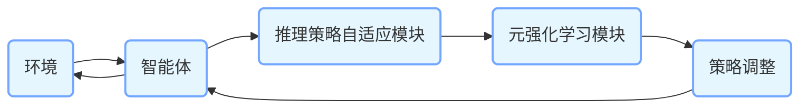

# 推理策略自适应中元强化学习的效果评估

> 关键词：推理策略自适应、元强化学习、效果评估、智能决策、学习效率

> 摘要：本文聚焦于推理策略自适应中的元强化学习效果评估。首先介绍了研究背景，包括目的范围、预期读者等内容。接着阐述了核心概念与联系，分析了推理策略自适应和元强化学习的原理及架构。详细讲解了核心算法原理，给出 Python 源代码示例。通过数学模型和公式深入剖析相关理论，并举例说明。进行了项目实战，涵盖开发环境搭建、源代码实现与解读。探讨了实际应用场景，推荐了相关工具和资源。最后总结未来发展趋势与挑战，解答常见问题并提供扩展阅读和参考资料，旨在为该领域的研究和应用提供全面的技术分析与指导。

## 1. 背景介绍 
### 1.1 目的和范围
在当今复杂多变的环境中，智能系统需要具备高效的推理能力以做出准确决策。推理策略自适应是提升智能系统性能的关键，而元强化学习作为一种强大的学习方法，能够让智能体快速适应新环境和任务。本研究的目的在于对推理策略自适应中的元强化学习效果进行全面评估，明确其在不同场景下的优势和局限性。研究范围涵盖了从理论原理到实际应用的多个层面，包括核心算法分析、数学模型构建、项目实战以及实际场景应用等。

### 1.2 预期读者
本文预期读者包括人工智能领域的研究人员、开发者、学生以及对智能决策和强化学习感兴趣的专业人士。对于希望深入了解推理策略自适应和元强化学习技术，并将其应用于实际项目的读者具有较高的参考价值。

### 1.3 文档结构概述
本文将按照以下结构进行阐述：首先介绍核心概念与联系，明确推理策略自适应和元强化学习的基本原理和架构；接着详细讲解核心算法原理，并给出 Python 源代码示例；通过数学模型和公式进一步深入分析；进行项目实战，展示代码实现和解读；探讨实际应用场景；推荐相关工具和资源；最后总结未来发展趋势与挑战，解答常见问题并提供扩展阅读和参考资料。

### 1.4 术语表
#### 1.4.1 核心术语定义
- **推理策略自适应**：指智能系统能够根据不同的环境和任务需求，自动调整和优化推理策略，以提高推理的准确性和效率。
- **元强化学习**：是一种强化学习的扩展，智能体不仅学习在特定环境中执行任务的策略，还学习如何快速适应新环境和任务，通过学习学习过程来提高学习效率。
- **效果评估**：对推理策略自适应中元强化学习的性能、效率、准确性等方面进行量化和分析的过程。

#### 1.4.2 相关概念解释
- **强化学习**：一种机器学习方法，智能体通过与环境进行交互，根据环境反馈的奖励信号来学习最优策略，以最大化累积奖励。
- **智能决策**：智能系统根据环境信息和自身目标，运用推理和学习能力做出最优决策的过程。

#### 1.4.3 缩略词列表
- **RL**：强化学习（Reinforcement Learning）
- **Meta-RL**：元强化学习（Meta Reinforcement Learning）

## 2. 核心概念与联系 

### 推理策略自适应原理
推理策略自适应的核心在于智能系统能够感知环境的变化，并根据这些变化动态调整推理策略。其基本原理可以概括为以下几个步骤：
1. **环境感知**：智能系统通过传感器或其他信息获取方式，收集环境的相关信息，如任务特征、数据分布等。
2. **策略评估**：根据感知到的环境信息，对当前使用的推理策略进行评估，判断其是否适应当前环境。
3. **策略调整**：如果当前策略不适应环境，智能系统将根据一定的规则或算法，对推理策略进行调整和优化。

### 元强化学习原理
元强化学习的目标是让智能体学会如何快速适应新环境和任务。其基本原理基于以下几个方面：
1. **元知识学习**：智能体在多个不同的任务和环境中进行学习，积累关于学习过程的元知识，如学习率、探索策略等。
2. **快速适应**：当遇到新的任务或环境时，智能体利用已学习到的元知识，快速调整自身的学习策略，以适应新情况。
3. **优化学习过程**：通过不断地与环境交互和学习，智能体持续优化元知识，提高学习效率和性能。

### 架构示意图

该架构展示了推理策略自适应和元强化学习之间的紧密联系。智能体与环境进行交互，获取环境信息后，推理策略自适应模块对当前策略进行评估和调整。元强化学习模块则负责学习元知识，帮助智能体快速适应新环境和任务。通过不断的交互和学习，智能体的推理策略得到持续优化。

## 3. 核心算法原理 & 具体操作步骤 

### 核心算法原理
在推理策略自适应中元强化学习的核心算法通常基于策略梯度方法。策略梯度方法通过直接优化策略参数来最大化累积奖励。以下是一个简单的策略梯度算法的 Python 实现示例：

```python
import numpy as np
import torch
import torch.nn as nn
import torch.optim as optim

# 定义策略网络
class PolicyNetwork(nn.Module):
    def __init__(self, input_dim, output_dim):
        super(PolicyNetwork, self).__init__()
        self.fc1 = nn.Linear(input_dim, 64)
        self.fc2 = nn.Linear(64, output_dim)
        self.softmax = nn.Softmax(dim=-1)

    def forward(self, x):
        x = torch.relu(self.fc1(x))
        x = self.fc2(x)
        x = self.softmax(x)
        return x

# 定义元强化学习智能体
class MetaRLAgent:
    def __init__(self, input_dim, output_dim, learning_rate=0.001):
        self.policy_network = PolicyNetwork(input_dim, output_dim)
        self.optimizer = optim.Adam(self.policy_network.parameters(), lr=learning_rate)

    def select_action(self, state):
        state = torch.FloatTensor(state).unsqueeze(0)
        probs = self.policy_network(state)
        action = torch.multinomial(probs, num_samples=1).item()
        return action

    def update_policy(self, states, actions, rewards):
        states = torch.FloatTensor(states)
        actions = torch.LongTensor(actions)
        rewards = torch.FloatTensor(rewards)

        probs = self.policy_network(states)
        log_probs = torch.log(probs.gather(1, actions.unsqueeze(1)).squeeze(1))
        loss = -(log_probs * rewards).mean()

        self.optimizer.zero_grad()
        loss.backward()
        self.optimizer.step()
```

### 具体操作步骤
1. **初始化智能体**：创建一个 `MetaRLAgent` 实例，指定输入维度、输出维度和学习率。
2. **与环境交互**：在每个时间步，智能体根据当前状态选择一个动作，并执行该动作。环境返回下一个状态和奖励。
3. **记录经验**：将当前状态、动作和奖励记录下来，用于后续的策略更新。
4. **更新策略**：在一定的时间间隔或达到一定的经验数量后，调用 `update_policy` 方法更新策略网络的参数。

```python
# 示例使用
input_dim = 4
output_dim = 2
agent = MetaRLAgent(input_dim, output_dim)

# 模拟环境交互
states = []
actions = []
rewards = []

for _ in range(100):
    state = np.random.rand(input_dim)
    action = agent.select_action(state)
    reward = np.random.rand()
    states.append(state)
    actions.append(action)
    rewards.append(reward)

# 更新策略
agent.update_policy(states, actions, rewards)
```

## 4. 数学模型和公式 & 详细讲解 & 举例说明 

### 策略梯度公式
策略梯度方法的核心是通过计算策略梯度来更新策略网络的参数。策略梯度的计算公式如下：
$$
\nabla_{\theta} J(\theta) = \mathbb{E}_{\tau \sim \pi_{\theta}(\tau)} \left[ \sum_{t=0}^{T} \nabla_{\theta} \log \pi_{\theta}(a_t|s_t) R(\tau) \right]
$$
其中，$\theta$ 是策略网络的参数，$\pi_{\theta}(a_t|s_t)$ 是在状态 $s_t$ 下选择动作 $a_t$ 的概率，$R(\tau)$ 是轨迹 $\tau$ 的累积奖励。

### 详细讲解
- **策略梯度的含义**：策略梯度表示策略参数 $\theta$ 的微小变化对目标函数 $J(\theta)$（通常是累积奖励的期望）的影响。通过沿着策略梯度的方向更新策略参数，可以逐步提高目标函数的值，即最大化累积奖励。
- **蒙特卡罗估计**：由于直接计算策略梯度的期望比较困难，通常采用蒙特卡罗方法进行估计。具体来说，通过采样多个轨迹 $\tau$，计算每个轨迹的策略梯度并求平均，得到策略梯度的估计值。

### 举例说明
假设我们有一个简单的二维状态空间和两个动作选项。策略网络的输出是每个动作的概率分布。在某个状态 $s$ 下，策略网络输出 $[0.3, 0.7]$，表示选择动作 $a_1$ 的概率为 0.3，选择动作 $a_2$ 的概率为 0.7。如果智能体选择了动作 $a_2$，则 $\log \pi_{\theta}(a_2|s) = \log(0.7)$。假设该轨迹的累积奖励 $R(\tau) = 10$，则该轨迹对策略梯度的贡献为 $\nabla_{\theta} \log \pi_{\theta}(a_2|s) \times 10$。通过采样多个轨迹并计算它们的贡献，我们可以得到策略梯度的估计值，并更新策略网络的参数。

## 5. 项目实战：代码实际案例和详细解释说明 

### 5.1  开发环境搭建
- **Python 环境**：建议使用 Python 3.7 及以上版本。可以通过 Anaconda 或官方 Python 安装包进行安装。
- **深度学习框架**：使用 PyTorch 作为深度学习框架。可以通过以下命令进行安装：
```bash
pip install torch torchvision
```
- **其他依赖库**：安装 NumPy 等常用科学计算库：
```bash
pip install numpy
```

### 5.2  源代码详细实现和代码解读
```python
import numpy as np
import torch
import torch.nn as nn
import torch.optim as optim

# 定义策略网络
class PolicyNetwork(nn.Module):
    def __init__(self, input_dim, output_dim):
        super(PolicyNetwork, self).__init__()
        self.fc1 = nn.Linear(input_dim, 64)
        self.fc2 = nn.Linear(64, output_dim)
        self.softmax = nn.Softmax(dim=-1)

    def forward(self, x):
        x = torch.relu(self.fc1(x))
        x = self.fc2(x)
        x = self.softmax(x)
        return x

# 定义元强化学习智能体
class MetaRLAgent:
    def __init__(self, input_dim, output_dim, learning_rate=0.001):
        self.policy_network = PolicyNetwork(input_dim, output_dim)
        self.optimizer = optim.Adam(self.policy_network.parameters(), lr=learning_rate)

    def select_action(self, state):
        state = torch.FloatTensor(state).unsqueeze(0)
        probs = self.policy_network(state)
        action = torch.multinomial(probs, num_samples=1).item()
        return action

    def update_policy(self, states, actions, rewards):
        states = torch.FloatTensor(states)
        actions = torch.LongTensor(actions)
        rewards = torch.FloatTensor(rewards)

        probs = self.policy_network(states)
        log_probs = torch.log(probs.gather(1, actions.unsqueeze(1)).squeeze(1))
        loss = -(log_probs * rewards).mean()

        self.optimizer.zero_grad()
        loss.backward()
        self.optimizer.step()

# 模拟环境
class SimpleEnvironment:
    def __init__(self):
        self.state_dim = 4
        self.action_dim = 2

    def reset(self):
        return np.random.rand(self.state_dim)

    def step(self, action):
        next_state = np.random.rand(self.state_dim)
        reward = np.random.rand()
        done = False
        return next_state, reward, done

# 训练智能体
def train_agent(agent, env, num_episodes=1000):
    for episode in range(num_episodes):
        state = env.reset()
        states = []
        actions = []
        rewards = []
        done = False

        while not done:
            action = agent.select_action(state)
            next_state, reward, done = env.step(action)
            states.append(state)
            actions.append(action)
            rewards.append(reward)
            state = next_state

        agent.update_policy(states, actions, rewards)
        if episode % 100 == 0:
            print(f"Episode {episode}: Total reward = {sum(rewards)}")

# 主函数
if __name__ == "__main__":
    input_dim = 4
    output_dim = 2
    agent = MetaRLAgent(input_dim, output_dim)
    env = SimpleEnvironment()
    train_agent(agent, env)
```

### 代码解读与分析
- **策略网络**：`PolicyNetwork` 类定义了一个简单的两层全连接神经网络，用于输出每个动作的概率分布。输入层的维度为 `input_dim`，输出层的维度为 `output_dim`。
- **元强化学习智能体**：`MetaRLAgent` 类封装了智能体的核心功能，包括动作选择和策略更新。`select_action` 方法根据当前状态选择一个动作，`update_policy` 方法根据收集到的经验更新策略网络的参数。
- **模拟环境**：`SimpleEnvironment` 类模拟了一个简单的环境，包括状态重置和状态转移。每次调用 `step` 方法，环境返回下一个状态、奖励和是否结束的标志。
- **训练过程**：`train_agent` 函数实现了智能体的训练过程。在每个回合中，智能体与环境进行交互，收集经验并更新策略。每隔 100 个回合，打印当前回合的总奖励。

## 6. 实际应用场景 
### 智能游戏
在智能游戏中，推理策略自适应和元强化学习可以帮助智能体快速适应不同的游戏场景和对手策略。例如，在围棋、星际争霸等复杂游戏中，智能体可以通过元强化学习学习到不同的开局策略和应对方法，根据对手的行为动态调整自己的策略，提高游戏胜率。

### 机器人控制
在机器人控制领域，推理策略自适应和元强化学习可以使机器人在不同的环境中快速学习到最优的运动策略。例如，在机器人导航任务中，机器人可以根据环境的变化（如障碍物的出现、地图的更新等）自动调整导航策略，提高导航效率和安全性。

### 金融投资
在金融投资领域，推理策略自适应和元强化学习可以帮助投资者根据市场的变化动态调整投资策略。例如，通过学习历史市场数据和不同的投资场景，智能投资系统可以快速适应新的市场情况，做出最优的投资决策，降低投资风险。

## 7. 工具和资源推荐
### 7.1 学习资源推荐
#### 7.1.1 书籍推荐
- 《强化学习：原理与Python实现》：详细介绍了强化学习的基本原理和算法，并提供了丰富的 Python 代码示例，适合初学者入门。
- 《深度学习》：由 Ian Goodfellow、Yoshua Bengio 和 Aaron Courville 合著，是深度学习领域的经典教材，对理解强化学习的神经网络基础有很大帮助。

#### 7.1.2 在线课程
- Coursera 上的《强化学习专项课程》：由 DeepMind 的研究人员授课，系统地介绍了强化学习的理论和实践，包括策略梯度方法、深度 Q 网络等内容。
- edX 上的《深度学习微硕士项目》：涵盖了深度学习的各个方面，包括强化学习的应用，提供了丰富的案例和实践项目。

#### 7.1.3 技术博客和网站
- OpenAI Blog：OpenAI 官方博客，发布了许多关于强化学习和人工智能的最新研究成果和应用案例。
- Distill.pub：专注于深度学习和机器学习的可视化解释，通过直观的图表和动画帮助读者理解复杂的算法和理论。

### 7.2 开发工具框架推荐
#### 7.2.1 IDE和编辑器
- PyCharm：一款专业的 Python 集成开发环境，提供了丰富的代码编辑、调试和项目管理功能，适合开发强化学习项目。
- Jupyter Notebook：一种交互式的开发环境，支持代码、文本和可视化的混合编写，方便进行算法实验和结果展示。

#### 7.2.2 调试和性能分析工具
- TensorBoard：TensorFlow 提供的可视化工具，可以帮助开发者监控训练过程中的损失函数、准确率等指标，分析模型的性能。
- Py-Spy：一个轻量级的 Python 性能分析工具，可以帮助开发者找出代码中的性能瓶颈。

#### 7.2.3 相关框架和库
- PyTorch：一个开源的深度学习框架，提供了丰富的神经网络层和优化算法，支持 GPU 加速，广泛应用于强化学习领域。
- Stable Baselines3：一个基于 PyTorch 的强化学习库，提供了多种预实现的强化学习算法，方便开发者快速搭建和测试强化学习模型。

### 7.3 相关论文著作推荐
#### 7.3.1 经典论文
- "Policy Gradient Methods for Reinforcement Learning with Function Approximation"：由 Richard S. Sutton 等人发表，介绍了策略梯度方法的基本原理和算法，是强化学习领域的经典论文。
- "Model-Agnostic Meta-Learning for Fast Adaptation of Deep Networks"：由 Chelsea Finn 等人发表，提出了模型无关元学习（MAML）算法，为元强化学习的发展奠定了基础。

#### 7.3.2 最新研究成果
- "Meta-Reinforcement Learning with Latent Variable Models"：提出了一种基于潜变量模型的元强化学习方法，通过学习潜变量来提高智能体的适应能力。
- "Adaptive Inference Strategies in Meta-Reinforcement Learning"：研究了推理策略自适应在元强化学习中的应用，提出了一种自适应推理策略的算法。

#### 7.3.3 应用案例分析
- "Deep Reinforcement Learning in Autonomous Driving"：介绍了深度强化学习在自动驾驶领域的应用案例，分析了强化学习算法在自动驾驶中的优势和挑战。
- "Reinforcement Learning for Portfolio Management"：探讨了强化学习在投资组合管理中的应用，通过实际案例展示了强化学习算法在金融投资中的有效性。

## 8. 总结：未来发展趋势与挑战
### 未来发展趋势
- **多模态融合**：将视觉、语音、文本等多模态信息融合到推理策略自适应和元强化学习中，提高智能体对复杂环境的感知和理解能力。
- **终身学习**：实现智能体的终身学习能力，使其能够在不断变化的环境中持续学习和适应，积累更多的知识和经验。
- **跨领域应用**：将推理策略自适应和元强化学习应用到更多的领域，如医疗、教育、交通等，解决实际问题，创造更大的社会价值。

### 挑战
- **样本效率**：元强化学习通常需要大量的样本进行训练，如何提高样本效率，减少训练时间和资源消耗，是一个亟待解决的问题。
- **可解释性**：强化学习模型通常是黑盒模型，缺乏可解释性。在一些关键领域，如医疗和金融，模型的可解释性至关重要，需要研究有效的方法来提高模型的可解释性。
- **环境复杂性**：实际环境往往非常复杂，存在不确定性和动态变化。如何让智能体在复杂环境中快速适应和做出准确决策，是一个具有挑战性的问题。

## 9. 附录：常见问题与解答
### 问题 1：元强化学习和传统强化学习有什么区别？
传统强化学习通常在固定的环境中学习一个最优策略，而元强化学习不仅学习在特定环境中执行任务的策略，还学习如何快速适应新环境和任务。元强化学习通过学习学习过程来提高学习效率，能够在遇到新任务时更快地收敛到最优策略。

### 问题 2：如何评估推理策略自适应中元强化学习的效果？
可以从多个方面评估推理策略自适应中元强化学习的效果，包括学习效率（如收敛速度）、性能指标（如累积奖励、成功率）、适应能力（如在新环境中的表现）等。可以使用实验对比的方法，将元强化学习与传统强化学习或其他方法进行比较，评估其优势和局限性。

### 问题 3：在实际应用中，如何选择合适的元强化学习算法？
选择合适的元强化学习算法需要考虑多个因素，如任务的复杂度、环境的不确定性、数据的可用性等。一般来说，如果任务的结构比较简单，可以选择一些简单的元强化学习算法；如果任务比较复杂，需要考虑使用更强大的算法，如基于模型的元强化学习算法。此外，还可以参考相关的研究成果和实际应用案例，选择适合自己问题的算法。

## 10. 扩展阅读 & 参考资料
- Silver, D., Huang, A., Maddison, C. J., Guez, A., Sifre, L., Van Den Driessche, G.,... & Dieleman, S. (2016). Mastering the game of Go with deep neural networks and tree search. nature, 529(7587), 484-489.
- Finn, C., Abbeel, P., & Levine, S. (2017). Model-agnostic meta-learning for fast adaptation of deep networks. In Proceedings of the 34th International Conference on Machine Learning-Volume 70 (pp. 1126-1135). JMLR. org.
- Sutton, R. S., & Barto, A. G. (2018). Reinforcement learning: An introduction. MIT press.

作者：AI天才研究院/AI Genius Institute & 禅与计算机程序设计艺术 /Zen And The Art of Computer Programming