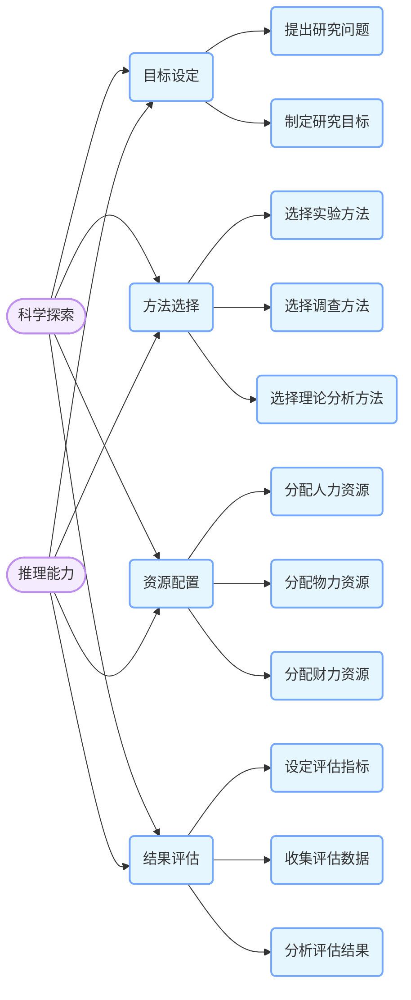

# 推理能力与科学探索效率关系的实证分析

> 关键词：推理能力、科学探索效率、实证分析、逻辑推理、认知发展

> 摘要：本文旨在深入探讨推理能力与科学探索效率之间的关系，通过实证分析的方法揭示两者内在的联系。首先介绍研究的背景、目的、预期读者以及文档结构等内容，接着阐述推理能力和科学探索效率的核心概念与联系，分析核心算法原理及操作步骤，运用数学模型和公式进行详细讲解并举例说明。通过项目实战给出代码实际案例和详细解释，探讨实际应用场景，推荐相关的工具和资源。最后总结未来发展趋势与挑战，解答常见问题并提供扩展阅读和参考资料，为进一步研究和实践提供有价值的参考。

## 1. 背景介绍 
### 1.1 目的和范围
本研究的主要目的是通过实证分析的方式，精确地探究推理能力与科学探索效率之间的关系。在当今科学技术飞速发展的时代，科学探索的效率对于推动各个领域的进步至关重要。而推理能力作为人类认知和解决问题的重要能力之一，其对科学探索效率的影响值得深入研究。研究范围涵盖了不同学科领域的科学探索活动，包括自然科学、社会科学等，以全面考察推理能力在各种科学探索情境中的作用。

### 1.2 预期读者
本文的预期读者包括科研工作者、教育工作者、心理学研究者以及对科学探索和认知能力发展感兴趣的人群。科研工作者可以从本文中获取关于如何提高科学探索效率的启示；教育工作者可以借鉴研究结果改进教学方法，培养学生的推理能力；心理学研究者可以深入了解推理能力在科学探索中的作用机制；而对相关领域感兴趣的人群则可以通过本文了解推理能力与科学探索效率之间的有趣联系。

### 1.3 文档结构概述
本文将按照以下结构进行阐述：首先介绍背景信息，让读者了解研究的出发点和意义；接着阐述推理能力和科学探索效率的核心概念与联系，构建理论基础；然后分析核心算法原理及操作步骤，运用数学模型和公式进行详细讲解并举例说明，使读者对研究方法有深入的理解；通过项目实战给出代码实际案例和详细解释，展示如何在实际中应用相关理论；探讨实际应用场景，说明研究结果的实用性；推荐相关的工具和资源，为读者提供进一步学习和研究的途径；最后总结未来发展趋势与挑战，解答常见问题并提供扩展阅读和参考资料。

### 1.4 术语表
#### 1.4.1 核心术语定义
- **推理能力**：指个体在思维过程中，依据已有的知识和信息，通过逻辑推导得出新结论的能力。它包括演绎推理、归纳推理、类比推理等多种形式。
- **科学探索效率**：在科学研究过程中，单位时间内所取得的有价值的研究成果的数量和质量。它反映了科学研究活动的有效性和生产力。

#### 1.4.2 相关概念解释
- **演绎推理**：从一般性的前提出发，通过推导即“演绎”，得出具体陈述或个别结论的过程。例如，所有的哺乳动物都用肺呼吸，鲸鱼是哺乳动物，所以鲸鱼用肺呼吸。
- **归纳推理**：从个别事例中概括出一般性结论的推理方法。比如，观察到多个苹果从树上掉落，归纳出物体受重力作用会下落的结论。
- **类比推理**：根据两个或两类对象有部分属性相同，从而推出它们的其他属性也相同的推理。例如，由地球和火星都有大气层、水等，推测火星可能也存在生命。

#### 1.4.3 缩略词列表
本文中暂无缩略词。

## 2. 核心概念与联系 

### 推理能力的原理和架构
推理能力是人类认知系统的重要组成部分，其原理基于人类大脑对信息的处理和整合。从架构上看，推理能力可以分为三个层次：底层是感知和记忆，它为推理提供了原始的信息素材；中间层是逻辑规则和策略，包括演绎、归纳、类比等推理方式；顶层是问题解决和决策，通过运用底层和中间层的能力来实现具体的目标。

下面是推理能力架构的文本示意图：

```
推理能力架构
|-- 底层：感知和记忆
|   |-- 感觉器官获取信息
|   |-- 记忆系统存储信息
|-- 中间层：逻辑规则和策略
|   |-- 演绎推理
|   |-- 归纳推理
|   |-- 类比推理
|-- 顶层：问题解决和决策
|   |-- 提出假设
|   |-- 验证假设
|   |-- 得出结论
```

### 科学探索效率的原理和架构
科学探索效率的提高依赖于合理的研究设计、高效的实验操作和准确的数据分析。其架构可以分为四个部分：目标设定，明确科学探索的方向和重点；方法选择，根据研究目标选择合适的研究方法；资源配置，合理分配人力、物力和财力等资源；结果评估，对研究成果进行及时、准确的评估。

下面是科学探索效率架构的文本示意图：

```
科学探索效率架构
|-- 目标设定
|   |-- 确定研究问题
|   |-- 制定研究目标
|-- 方法选择
|   |-- 实验方法
|   |-- 调查方法
|   |-- 理论分析方法
|-- 资源配置
|   |-- 人力资源
|   |-- 物力资源
|   |-- 财力资源
|-- 结果评估
|   |-- 指标设定
|   |-- 数据收集
|   |-- 结果分析
```

### 推理能力与科学探索效率的联系
推理能力在科学探索的各个环节都起着关键作用。在目标设定阶段，推理能力可以帮助研究者从众多的现象中发现有价值的研究问题，提出合理的研究假设。在方法选择阶段，推理能力可以指导研究者根据研究目标和问题的特点，选择最适合的研究方法。在资源配置阶段，推理能力可以帮助研究者合理分配资源，提高资源的利用效率。在结果评估阶段，推理能力可以帮助研究者对研究结果进行深入的分析和解读，判断研究结果的可靠性和有效性。

下面是推理能力与科学探索效率联系的 Mermaid 流程图：



## 3. 核心算法原理 & 具体操作步骤 

### 核心算法原理
为了实证分析推理能力与科学探索效率之间的关系，我们可以采用相关性分析和回归分析的方法。相关性分析用于衡量推理能力和科学探索效率之间的线性相关程度，回归分析则用于建立推理能力与科学探索效率之间的数学模型，预测科学探索效率随推理能力的变化情况。

### 具体操作步骤

#### 数据收集
首先，我们需要收集推理能力和科学探索效率的相关数据。推理能力可以通过标准化的推理测试来衡量，例如瑞文推理测验、韦氏智力量表中的推理分测验等。科学探索效率可以通过科研成果的数量、质量、影响力等指标来衡量，例如发表论文的数量、论文被引用的次数、获得科研奖项的数量等。

#### 数据预处理
对收集到的数据进行预处理，包括数据清洗、数据标准化等操作。数据清洗是去除数据中的异常值和缺失值，确保数据的质量。数据标准化是将不同指标的数据转换为具有相同尺度的数据，便于后续的分析。

#### 相关性分析
使用 Python 中的`pandas`和`scipy`库进行相关性分析。以下是示例代码：

```python
import pandas as pd
from scipy.stats import pearsonr

# 假设 data 是包含推理能力和科学探索效率数据的 DataFrame
data = pd.read_csv('data.csv')
reasoning_ability = data['reasoning_ability']
scientific_exploration_efficiency = data['scientific_exploration_efficiency']

# 计算皮尔逊相关系数和 p 值
corr, p_value = pearsonr(reasoning_ability, scientific_exploration_efficiency)

print(f"皮尔逊相关系数: {corr}")
print(f"p 值: {p_value}")
```

#### 回归分析
使用 Python 中的`statsmodels`库进行回归分析。以下是示例代码：

```python
import pandas as pd
import statsmodels.api as sm

# 假设 data 是包含推理能力和科学探索效率数据的 DataFrame
data = pd.read_csv('data.csv')
X = data['reasoning_ability']
y = data['scientific_exploration_efficiency']

# 添加常数项
X = sm.add_constant(X)

# 拟合线性回归模型
model = sm.OLS(y, X).fit()

# 打印回归结果
print(model.summary())
```

## 4. 数学模型和公式 & 详细讲解 & 举例说明 

### 相关性分析的数学模型和公式
相关性分析常用的方法是皮尔逊相关系数，其计算公式为：

$$
r = \frac{\sum_{i=1}^{n} (x_i - \bar{x})(y_i - \bar{y})}{\sqrt{\sum_{i=1}^{n} (x_i - \bar{x})^2 \sum_{i=1}^{n} (y_i - \bar{y})^2}}
$$

其中，$x_i$ 和 $y_i$ 分别是第 $i$ 个样本的推理能力和科学探索效率值，$\bar{x}$ 和 $\bar{y}$ 分别是推理能力和科学探索效率的均值，$n$ 是样本数量。

皮尔逊相关系数 $r$ 的取值范围是 $[-1, 1]$，$r$ 的绝对值越接近 1，表示两个变量之间的线性相关程度越强；$r$ 的值为正，表示两个变量正相关；$r$ 的值为负，表示两个变量负相关。

### 举例说明
假设我们有以下 5 个样本的数据：

| 推理能力 ($x$) | 科学探索效率 ($y$) |
| --- | --- |
| 80 | 70 |
| 85 | 75 |
| 90 | 80 |
| 95 | 85 |
| 100 | 90 |

首先，计算均值：

$\bar{x} = \frac{80 + 85 + 90 + 95 + 100}{5} = 90$

$\bar{y} = \frac{70 + 75 + 80 + 85 + 90}{5} = 80$

然后，计算分子和分母：

分子：

$\sum_{i=1}^{5} (x_i - \bar{x})(y_i - \bar{y}) = (80 - 90)(70 - 80) + (85 - 90)(75 - 80) + (90 - 90)(80 - 80) + (95 - 90)(85 - 80) + (100 - 90)(90 - 80)$

$= (-10)(-10) + (-5)(-5) + 0 + 5 \times 5 + 10 \times 10$

$= 100 + 25 + 0 + 25 + 100 = 250$

分母：

$\sqrt{\sum_{i=1}^{5} (x_i - \bar{x})^2 \sum_{i=1}^{5} (y_i - \bar{y})^2} = \sqrt{((80 - 90)^2 + (85 - 90)^2 + (90 - 90)^2 + (95 - 90)^2 + (100 - 90)^2) \times ((70 - 80)^2 + (75 - 80)^2 + (80 - 80)^2 + (85 - 80)^2 + (90 - 80)^2)}$

$= \sqrt{(100 + 25 + 0 + 25 + 100) \times (100 + 25 + 0 + 25 + 100)} = \sqrt{250 \times 250} = 250$

最后，计算皮尔逊相关系数：

$r = \frac{250}{250} = 1$

这表明推理能力和科学探索效率之间存在完全正相关关系。

### 回归分析的数学模型和公式
回归分析的线性回归模型可以表示为：

$$
y = \beta_0 + \beta_1 x + \epsilon
$$

其中，$y$ 是科学探索效率，$x$ 是推理能力，$\beta_0$ 是截距，$\beta_1$ 是斜率，$\epsilon$ 是误差项。

通过最小二乘法可以估计 $\beta_0$ 和 $\beta_1$ 的值，使得误差项的平方和最小。最小二乘法的计算公式为：

$$
\hat{\beta}_1 = \frac{\sum_{i=1}^{n} (x_i - \bar{x})(y_i - \bar{y})}{\sum_{i=1}^{n} (x_i - \bar{x})^2}
$$

$$
\hat{\beta}_0 = \bar{y} - \hat{\beta}_1 \bar{x}
$$

### 举例说明
仍然使用上面的 5 个样本的数据，计算 $\hat{\beta}_1$ 和 $\hat{\beta}_0$ 的值：

$\hat{\beta}_1 = \frac{\sum_{i=1}^{5} (x_i - \bar{x})(y_i - \bar{y})}{\sum_{i=1}^{5} (x_i - \bar{x})^2} = \frac{250}{(80 - 90)^2 + (85 - 90)^2 + (90 - 90)^2 + (95 - 90)^2 + (100 - 90)^2} = \frac{250}{250} = 1$

$\hat{\beta}_0 = \bar{y} - \hat{\beta}_1 \bar{x} = 80 - 1 \times 90 = -10$

所以，回归方程为 $y = -10 + x$。这意味着推理能力每增加 1 个单位，科学探索效率预计增加 1 个单位。

## 5. 项目实战：代码实际案例和详细解释说明 

### 5.1  开发环境搭建
为了运行上述的代码，我们需要搭建 Python 开发环境。具体步骤如下：

1. 安装 Python：从 Python 官方网站（https://www.python.org/downloads/）下载并安装 Python 3.x 版本。
2. 安装必要的库：使用`pip`命令安装`pandas`、`scipy`和`statsmodels`库。

```sh
pip install pandas scipy statsmodels
```

### 5.2  源代码详细实现和代码解读
以下是一个完整的 Python 代码示例，用于进行推理能力与科学探索效率关系的实证分析：

```python
import pandas as pd
from scipy.stats import pearsonr
import statsmodels.api as sm

# 读取数据
data = pd.read_csv('data.csv')

# 提取推理能力和科学探索效率数据
reasoning_ability = data['reasoning_ability']
scientific_exploration_efficiency = data['scientific_exploration_efficiency']

# 相关性分析
corr, p_value = pearsonr(reasoning_ability, scientific_exploration_efficiency)
print(f"皮尔逊相关系数: {corr}")
print(f"p 值: {p_value}")

# 回归分析
X = reasoning_ability
y = scientific_exploration_efficiency

# 添加常数项
X = sm.add_constant(X)

# 拟合线性回归模型
model = sm.OLS(y, X).fit()

# 打印回归结果
print(model.summary())
```

### 代码解读与分析
1. **数据读取**：使用`pandas`库的`read_csv`函数读取存储在`data.csv`文件中的数据。
2. **相关性分析**：使用`scipy.stats`库的`pearsonr`函数计算推理能力和科学探索效率之间的皮尔逊相关系数和 p 值。
3. **回归分析**：使用`statsmodels`库的`OLS`函数拟合线性回归模型，并使用`fit`方法进行模型训练。最后，使用`summary`方法打印回归结果，包括回归系数、截距、R 方值等信息。

通过这个代码示例，我们可以直观地看到推理能力与科学探索效率之间的相关性和回归关系。

## 6. 实际应用场景 
### 科研团队建设
在组建科研团队时，可以通过测试成员的推理能力，选拔推理能力较强的成员，以提高团队的科学探索效率。例如，在一个生物医学科研项目中，选择具有较强逻辑推理和归纳推理能力的研究人员，能够更高效地设计实验方案、分析实验数据，从而加快研究进度。

### 教育教学
在教育教学中，可以注重培养学生的推理能力，以提高他们的科学探索能力。例如，在科学课程中，可以通过设计一些探究性实验和问题解决活动，引导学生运用推理能力进行思考和探索，培养他们的科学思维和创新能力。

### 科学决策
在科学决策过程中，推理能力可以帮助决策者从复杂的信息中提取有用的信息，做出合理的决策。例如，在制定科研政策时，决策者可以运用推理能力分析不同政策方案的利弊，选择最有利于科学发展的政策。

## 7. 工具和资源推荐
### 7.1 学习资源推荐
#### 7.1.1 书籍推荐
- 《思考，快与慢》：作者丹尼尔·卡尼曼是诺贝尔经济学奖得主，本书介绍了人类思维的两种模式——快思考和慢思考，以及它们在决策、判断等方面的应用，对于理解推理能力的本质和作用有很大帮助。
- 《逻辑学导论》：这是一本经典的逻辑学教材，系统地介绍了逻辑学的基本概念、原理和方法，对于提高逻辑推理能力有很大的帮助。
- 《科学研究的艺术》：本书介绍了科学研究的方法和技巧，包括如何提出问题、设计实验、分析数据等，对于提高科学探索效率有很大的启示。

#### 7.1.2 在线课程
- Coursera 上的“逻辑学基础”课程：该课程由知名大学的教授授课，系统地介绍了逻辑学的基本概念和方法，通过在线视频、作业和讨论等方式进行学习。
- edX 上的“科学研究方法”课程：该课程介绍了科学研究的流程和方法，包括如何设计实验、收集数据、分析结果等，适合科研工作者和学生学习。

#### 7.1.3 技术博客和网站
- 科学网（https://www.sciencenet.cn/）：这是一个专注于科学研究和学术交流的网站，提供了丰富的科研资讯、学术论文、研究报告等资源。
- 果壳网（https://www.guokr.com/）：这是一个科学传播网站，以有趣、易懂的方式介绍科学知识和科学研究成果，同时也提供了一些科学探索的案例和经验分享。

### 7.2 开发工具框架推荐
#### 7.2.1 IDE和编辑器
- PyCharm：这是一款专业的 Python 集成开发环境，提供了代码编辑、调试、版本控制等功能，适合 Python 开发者使用。
- Jupyter Notebook：这是一个基于网页的交互式开发环境，支持多种编程语言，适合进行数据分析和机器学习等工作。

#### 7.2.2 调试和性能分析工具
- pdb：这是 Python 内置的调试工具，可以帮助开发者在代码中设置断点、查看变量值等，方便调试代码。
- cProfile：这是 Python 内置的性能分析工具，可以帮助开发者分析代码的运行时间和资源消耗情况，优化代码性能。

#### 7.2.3 相关框架和库
- pandas：这是一个强大的数据处理和分析库，提供了 DataFrame 等数据结构，方便进行数据清洗、转换和分析。
- scipy：这是一个科学计算库，提供了丰富的数学算法和工具，包括统计分析、线性代数、优化等。
- statsmodels：这是一个统计建模库，提供了多种统计模型和方法，包括线性回归、逻辑回归、时间序列分析等。

### 7.3 相关论文著作推荐
#### 7.3.1 经典论文
- Kahneman, D., & Tversky, A. (1979). Prospect theory: An analysis of decision under risk. Econometrica: Journal of the Econometric Society, 47(2), 263-291. 这篇论文提出了前景理论，对人类的决策行为进行了深入的研究，对于理解推理能力在决策中的作用有重要意义。
- Popper, K. R. (1934). The logic of scientific discovery. 这本书提出了证伪主义的科学哲学观点，强调科学研究是通过不断尝试证伪理论来推动的，对于理解科学探索的本质和方法有很大的启示。

#### 7.3.2 最新研究成果
- Recent research on the relationship between reasoning ability and scientific creativity. 这篇论文探讨了推理能力与科学创造力之间的关系，为提高科学探索效率提供了新的思路。
- The impact of cognitive training on reasoning ability and scientific exploration efficiency. 这篇论文研究了认知训练对推理能力和科学探索效率的影响，为培养推理能力提供了实证依据。

#### 7.3.3 应用案例分析
- Case studies on the application of reasoning ability in scientific research projects. 这篇文章通过具体的案例分析，展示了推理能力在科学研究项目中的应用和作用，对于实际工作有很大的指导意义。

## 8. 总结：未来发展趋势与挑战
### 未来发展趋势
- **跨学科研究**：推理能力与科学探索效率的研究将越来越多地涉及到多个学科领域，如心理学、认知科学、计算机科学等，通过跨学科的研究方法可以更全面地揭示两者之间的关系。
- **个性化培养**：随着对推理能力和科学探索效率研究的深入，未来将更加注重个性化的培养方案。根据个体的特点和需求，制定针对性的培养计划，提高每个人的推理能力和科学探索效率。
- **技术应用**：人工智能、大数据等技术将在推理能力和科学探索效率的研究中得到更广泛的应用。例如，利用人工智能算法分析大量的科研数据，挖掘推理能力与科学探索效率之间的潜在关系。

### 挑战
- **数据获取**：准确、全面地获取推理能力和科学探索效率的数据是一个挑战。目前，对于科学探索效率的评估指标还不够完善，需要进一步研究和改进。
- **因果关系确定**：虽然可以通过实证分析发现推理能力与科学探索效率之间的相关性，但要确定两者之间的因果关系还需要更深入的研究和实验。
- **培养方法有效性**：如何设计有效的培养方法来提高推理能力和科学探索效率是一个亟待解决的问题。需要不断地进行实践和探索，验证培养方法的有效性。

## 9. 附录：常见问题与解答
### 问：推理能力可以通过训练提高吗？
答：可以。推理能力是一种可以通过训练和学习提高的能力。例如，通过逻辑推理训练、问题解决训练等方式，可以提高个体的演绎推理、归纳推理和类比推理能力。

### 问：科学探索效率的评估指标有哪些？
答：科学探索效率的评估指标可以包括科研成果的数量（如发表论文的数量、申请专利的数量等）、质量（如论文的影响因子、专利的创新性等）、影响力（如论文被引用的次数、科研成果的应用范围等）。

### 问：相关性分析和回归分析有什么区别？
答：相关性分析用于衡量两个变量之间的线性相关程度，只关注变量之间的关联程度，不考虑因果关系。回归分析则用于建立变量之间的数学模型，通过一个或多个自变量来预测因变量的值，可以分析变量之间的因果关系。

## 10. 扩展阅读 & 参考资料
### 扩展阅读
- 《人工智能与人类思维》：探讨了人工智能技术对人类思维方式的影响，以及如何利用人工智能提高人类的推理能力和科学探索效率。
- 《创新思维与科学发现》：介绍了创新思维的方法和技巧，以及如何在科学探索中运用创新思维，提高科学探索的效率和质量。

### 参考资料
- 相关的学术论文和研究报告
- 相关的书籍和教材
- 相关的网站和博客文章

作者：AI天才研究院/AI Genius Institute & 禅与计算机程序设计艺术 /Zen And The Art of Computer Programming