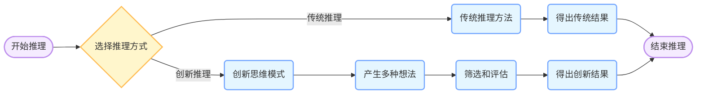

# 推理过程中的创新思维模式识别与增强方法

> 关键词：推理过程、创新思维模式、模式识别、思维增强、人工智能

> 摘要：本文聚焦于推理过程中的创新思维模式识别与增强方法。首先介绍了相关背景，包括目的、预期读者、文档结构和术语表。接着阐述了核心概念与联系，通过文本示意图和 Mermaid 流程图展示其架构。详细讲解了核心算法原理和具体操作步骤，使用 Python 代码进行说明。深入探讨了数学模型和公式，并举例说明。通过项目实战给出代码实际案例和详细解释。分析了实际应用场景，推荐了相关的工具和资源。最后总结了未来发展趋势与挑战，提供了常见问题解答和扩展阅读参考资料，旨在为研究者和开发者在推理过程中创新思维模式的研究与应用提供全面的指导。

## 1. 背景介绍 
### 1.1 目的和范围
在当今快速发展的科技时代，创新能力已成为个人、企业乃至国家竞争力的核心要素。推理过程作为人类认知和解决问题的重要手段，其中蕴含的创新思维模式对于推动科学技术进步、解决复杂问题具有至关重要的意义。本文章的目的在于深入研究推理过程中的创新思维模式，探讨有效的识别方法和增强策略，以提高人们在推理过程中的创新能力。

本文的研究范围涵盖了创新思维模式的基本概念、常见类型，以及用于识别和增强这些模式的各种技术和方法。同时，通过实际案例分析和项目实战，展示这些方法在不同领域的应用效果。

### 1.2 预期读者
本文的预期读者包括但不限于人工智能领域的研究者、程序员、软件架构师，以及对创新思维和问题解决方法感兴趣的专业人士。对于希望提高自身创新能力、优化推理过程的个人，本文也提供了有价值的参考。

### 1.3 文档结构概述
本文将按照以下结构进行组织：
1. 背景介绍：阐述文章的目的、范围、预期读者和文档结构，并给出相关术语的定义和解释。
2. 核心概念与联系：介绍创新思维模式的核心概念，通过文本示意图和 Mermaid 流程图展示其与推理过程的联系。
3. 核心算法原理 & 具体操作步骤：详细讲解用于识别和增强创新思维模式的核心算法原理，并给出具体的操作步骤和 Python 代码示例。
4. 数学模型和公式 & 详细讲解 & 举例说明：建立创新思维模式识别和增强的数学模型，给出相关公式，并通过具体例子进行详细讲解。
5. 项目实战：代码实际案例和详细解释说明：通过一个实际项目案例，展示如何使用本文介绍的方法进行创新思维模式的识别和增强，包括开发环境搭建、源代码实现和代码解读。
6. 实际应用场景：分析创新思维模式识别和增强方法在不同领域的实际应用场景。
7. 工具和资源推荐：推荐用于学习和实践创新思维模式识别和增强的相关工具、资源和论文著作。
8. 总结：未来发展趋势与挑战：总结本文的主要内容，分析创新思维模式识别和增强领域的未来发展趋势和面临的挑战。
9. 附录：常见问题与解答：提供读者在学习和实践过程中常见问题的解答。
10. 扩展阅读 & 参考资料：列出本文参考的相关文献和资料，为读者提供进一步学习的方向。

### 1.4 术语表
#### 1.4.1 核心术语定义
- **创新思维模式**：指在推理过程中，突破传统思维方式，产生新颖、独特且有价值的想法和解决方案的思维方式和规律。
- **模式识别**：是指对事物的特征、规律和模式进行自动或半自动的分析和判断，以确定其所属类别或模式的过程。
- **思维增强**：通过各种技术和方法，提高个体或群体在推理过程中的创新思维能力和效率。
- **推理过程**：是指从已知信息出发，通过逻辑推理、归纳、演绎等方法，得出新的结论或解决方案的过程。

#### 1.4.2 相关概念解释
- **创造性推理**：是创新思维模式在推理过程中的具体体现，强调在推理过程中运用创造性思维，产生新的知识和见解。
- **认知偏差**：指在认知过程中，由于各种因素的影响，导致个体对事物的判断和决策出现偏差的现象。认知偏差可能会阻碍创新思维的产生，因此在创新思维模式识别和增强过程中需要加以考虑。

#### 1.4.3 缩略词列表
- AI：Artificial Intelligence，人工智能
- ML：Machine Learning，机器学习
- DL：Deep Learning，深度学习

## 2. 核心概念与联系 

### 创新思维模式的核心概念
创新思维模式是一个复杂的概念，它包含多种不同的思维方式和策略。常见的创新思维模式包括：
- **发散思维**：从一个问题或主题出发，尽可能多地产生不同的想法和解决方案。
- **收敛思维**：在发散思维产生的众多想法中，筛选出最有价值、最可行的方案。
- **逆向思维**：从问题的相反方向进行思考，寻找新的解决途径。
- **联想思维**：通过将不同的事物或概念联系起来，产生新的想法和创意。

### 创新思维模式与推理过程的联系
在推理过程中，创新思维模式起着至关重要的作用。传统的推理方法往往遵循固定的逻辑规则，而创新思维模式则能够突破这些规则的限制，产生新颖的解决方案。例如，在解决复杂的数学问题时，发散思维可以帮助我们从不同的角度思考问题，提出多种可能的解决方案；收敛思维则可以帮助我们对这些方案进行评估和筛选，找到最优解。

### 文本示意图
```plaintext
推理过程
|
|-- 传统推理方法
|   |-- 逻辑推理
|   |-- 归纳推理
|   |-- 演绎推理
|
|-- 创新思维模式
|   |-- 发散思维
|   |-- 收敛思维
|   |-- 逆向思维
|   |-- 联想思维
|
|-- 创新推理结果
```

### Mermaid 流程图


## 3. 核心算法原理 & 具体操作步骤 

### 创新思维模式识别算法原理
创新思维模式识别的核心目标是从推理过程中提取出与创新思维相关的特征，并根据这些特征判断推理过程中是否存在创新思维模式。常用的方法包括机器学习和自然语言处理技术。

#### 基于机器学习的识别方法
- **特征提取**：从推理过程的文本、语音或图像数据中提取与创新思维相关的特征，例如词汇频率、句子结构、语义相似度等。
- **模型训练**：使用提取的特征训练机器学习模型，例如决策树、支持向量机、神经网络等。
- **模式识别**：使用训练好的模型对新的推理过程进行预测，判断其中是否存在创新思维模式。

#### Python 代码示例
```python
import numpy as np
from sklearn.feature_extraction.text import TfidfVectorizer
from sklearn.tree import DecisionTreeClassifier
from sklearn.model_selection import train_test_split

# 示例数据
corpus = [
    "我们可以从这个角度来解决问题，这是一种新的思路。",
    "按照传统的方法，我们应该这样做。",
    "也许我们可以反过来思考，看看会有什么结果。"
]
labels = [1, 0, 1]  # 1 表示存在创新思维模式，0 表示不存在

# 特征提取
vectorizer = TfidfVectorizer()
X = vectorizer.fit_transform(corpus)

# 划分训练集和测试集
X_train, X_test, y_train, y_test = train_test_split(X, labels, test_size=0.2, random_state=42)

# 模型训练
clf = DecisionTreeClassifier()
clf.fit(X_train, y_train)

# 模型预测
y_pred = clf.predict(X_test)
print("预测结果:", y_pred)
```

### 创新思维模式增强算法原理
创新思维模式增强的主要目的是通过提供相关的信息和提示，引导推理过程向创新方向发展。常用的方法包括知识图谱、启发式算法和交互式界面。

#### 基于知识图谱的增强方法
- **知识图谱构建**：构建包含各种领域知识和创新案例的知识图谱。
- **信息推荐**：根据推理过程的主题和当前状态，从知识图谱中推荐相关的知识和案例，为推理者提供灵感和启示。
- **交互引导**：通过交互式界面，引导推理者对推荐的信息进行思考和应用，促进创新思维的产生。

#### Python 代码示例
```python
import networkx as nx

# 构建简单的知识图谱
G = nx.Graph()
G.add_node("问题 A")
G.add_node("解决方案 1")
G.add_node("解决方案 2")
G.add_edge("问题 A", "解决方案 1")
G.add_edge("问题 A", "解决方案 2")

# 根据问题推荐解决方案
problem = "问题 A"
neighbors = list(G.neighbors(problem))
print("推荐的解决方案:", neighbors)
```

### 具体操作步骤
#### 创新思维模式识别步骤
1. **数据收集**：收集推理过程的相关数据，包括文本、语音、图像等。
2. **数据预处理**：对收集到的数据进行清洗、分词、标注等预处理操作。
3. **特征提取**：从预处理后的数据中提取与创新思维相关的特征。
4. **模型训练**：使用提取的特征训练机器学习模型。
5. **模式识别**：使用训练好的模型对新的推理过程进行预测。

#### 创新思维模式增强步骤
1. **知识图谱构建**：收集和整理各种领域知识和创新案例，构建知识图谱。
2. **推理过程分析**：分析当前推理过程的主题和状态。
3. **信息推荐**：根据推理过程的分析结果，从知识图谱中推荐相关的知识和案例。
4. **交互引导**：通过交互式界面，引导推理者对推荐的信息进行思考和应用。

## 4. 数学模型和公式 & 详细讲解 & 举例说明 

### 创新思维模式识别的数学模型
#### 特征提取模型
假设推理过程的文本数据为 $D = \{d_1, d_2, \cdots, d_n\}$，其中 $d_i$ 表示第 $i$ 个文本样本。我们可以使用词频 - 逆文档频率（TF - IDF）方法提取文本特征。对于文本 $d_i$ 中的词 $w_j$，其 TF - IDF 值计算公式为：

$$TF - IDF(w_j, d_i) = TF(w_j, d_i) \times IDF(w_j)$$

其中，$TF(w_j, d_i)$ 表示词 $w_j$ 在文本 $d_i$ 中的词频，计算公式为：

$$TF(w_j, d_i) = \frac{词 w_j 在 d_i 中出现的次数}{d_i 中词的总数}$$

$IDF(w_j)$ 表示词 $w_j$ 的逆文档频率，计算公式为：

$$IDF(w_j) = \log\frac{n}{包含词 w_j 的文档数 + 1}$$

#### 机器学习模型
假设我们使用决策树模型进行创新思维模式识别。决策树模型通过递归地划分特征空间，构建一个树形结构的分类器。对于一个新的样本 $x$，决策树从根节点开始，根据节点的特征条件进行判断，逐步向下遍历树，直到到达叶子节点，叶子节点的类别即为样本 $x$ 的预测类别。

### 举例说明
假设我们有以下文本数据：
- $d_1$: "我们可以尝试用新的方法来解决这个问题。"
- $d_2$: "按照常规的做法，我们应该这样做。"
- $d_3$: "或许从另一个角度思考会有新的发现。"

首先，我们对这些文本进行分词处理：
- $d_1$: ["我们", "可以", "尝试", "用", "新的", "方法", "来", "解决", "这个", "问题"]
- $d_2$: ["按照", "常规的", "做法", "我们", "应该", "这样", "做"]
- $d_3$: ["或许", "从", "另一个", "角度", "思考", "会", "有", "新的", "发现"]

然后，计算每个词的 TF - IDF 值。以词 "新的" 为例：
- $TF("新的", d_1) = \frac{1}{10} = 0.1$
- $TF("新的", d_2) = 0$
- $TF("新的", d_3) = \frac{1}{8} = 0.125$

包含词 "新的" 的文档数为 2，$n = 3$，则：

$$IDF("新的") = \log\frac{3}{2 + 1} = \log1 = 0$$

所以，$TF - IDF("新的", d_1) = 0.1 \times 0 = 0$，$TF - IDF("新的", d_2) = 0 \times 0 = 0$，$TF - IDF("新的", d_3) = 0.125 \times 0 = 0$。

最后，使用这些特征训练决策树模型，对新的文本进行创新思维模式的预测。

### 创新思维模式增强的数学模型
#### 知识图谱表示模型
知识图谱可以用图 $G = (V, E)$ 表示，其中 $V$ 表示节点集合，$E$ 表示边集合。节点可以表示实体（如问题、解决方案、概念等），边可以表示实体之间的关系（如因果关系、相似关系等）。

#### 信息推荐模型
假设推理过程的主题为 $t$，知识图谱中的节点集合为 $V$。我们可以使用相似度计算方法，从 $V$ 中筛选出与 $t$ 相似度较高的节点作为推荐信息。常用的相似度计算方法包括余弦相似度、欧几里得距离等。

以余弦相似度为例，对于两个节点 $v_1$ 和 $v_2$，其向量表示分别为 $\vec{x}_1$ 和 $\vec{x}_2$，则它们的余弦相似度计算公式为：

$$\cos(\vec{x}_1, \vec{x}_2) = \frac{\vec{x}_1 \cdot \vec{x}_2}{\|\vec{x}_1\| \|\vec{x}_2\|}$$

### 举例说明
假设知识图谱中有以下节点和边：
- 节点："问题 A"，"解决方案 1"，"解决方案 2"，"问题 B"，"解决方案 3"
- 边：("问题 A", "解决方案 1")，("问题 A", "解决方案 2")，("问题 B", "解决方案 3")

当前推理过程的主题为 "问题 A"，我们可以计算 "问题 A" 与其他节点的相似度。由于 "解决方案 1" 和 "解决方案 2" 与 "问题 A" 有直接的边连接，它们的相似度较高，因此可以将它们作为推荐信息提供给推理者。

## 5. 项目实战：代码实际案例和详细解释说明 

### 5.1  开发环境搭建
#### 操作系统
本项目可以在 Windows、Linux 或 macOS 操作系统上进行开发。建议使用 Ubuntu 18.04 或更高版本的 Linux 系统，以确保稳定性和兼容性。

#### 编程语言和环境
- **Python**：建议使用 Python 3.7 或更高版本。可以从 Python 官方网站（https://www.python.org/downloads/）下载并安装。
- **虚拟环境**：为了避免不同项目之间的依赖冲突，建议使用虚拟环境。可以使用 `venv` 或 `conda` 来创建和管理虚拟环境。以下是使用 `venv` 创建虚拟环境的示例命令：

```bash
python3 -m venv myenv
source myenv/bin/activate  # 在 Linux 或 macOS 上
myenv\Scripts\activate  # 在 Windows 上
```

#### 依赖库安装
在虚拟环境中，使用 `pip` 安装项目所需的依赖库：

```bash
pip install numpy scikit-learn networkx
```

### 5.2  源代码详细实现和代码解读
#### 创新思维模式识别代码实现
```python
import numpy as np
from sklearn.feature_extraction.text import TfidfVectorizer
from sklearn.tree import DecisionTreeClassifier
from sklearn.model_selection import train_test_split

# 示例数据
corpus = [
    "我们可以从这个角度来解决问题，这是一种新的思路。",
    "按照传统的方法，我们应该这样做。",
    "也许我们可以反过来思考，看看会有什么结果。",
    "我们还是按照老规矩办吧。",
    "尝试一些新的方法可能会有更好的效果。"
]
labels = [1, 0, 1, 0, 1]  # 1 表示存在创新思维模式，0 表示不存在

# 特征提取
vectorizer = TfidfVectorizer()
X = vectorizer.fit_transform(corpus)

# 划分训练集和测试集
X_train, X_test, y_train, y_test = train_test_split(X, labels, test_size=0.2, random_state=42)

# 模型训练
clf = DecisionTreeClassifier()
clf.fit(X_train, y_train)

# 模型评估
accuracy = clf.score(X_test, y_test)
print("模型准确率:", accuracy)

# 新样本预测
new_samples = [
    "我们可以试试用不同的方式来处理这个问题。",
    "就按以前的办法做吧。"
]
new_X = vectorizer.transform(new_samples)
new_y_pred = clf.predict(new_X)
print("新样本预测结果:", new_y_pred)
```

#### 代码解读
1. **数据准备**：定义了一个包含多个文本样本的列表 `corpus`，以及对应的标签列表 `labels`。
2. **特征提取**：使用 `TfidfVectorizer` 对文本数据进行特征提取，将文本转换为 TF - IDF 特征向量。
3. **数据集划分**：使用 `train_test_split` 函数将数据集划分为训练集和测试集。
4. **模型训练**：使用 `DecisionTreeClassifier` 训练决策树模型。
5. **模型评估**：使用 `score` 方法计算模型在测试集上的准确率。
6. **新样本预测**：对新的文本样本进行特征提取，并使用训练好的模型进行预测。

#### 创新思维模式增强代码实现
```python
import networkx as nx

# 构建知识图谱
G = nx.Graph()
G.add_node("问题 A")
G.add_node("解决方案 1")
G.add_node("解决方案 2")
G.add_node("问题 B")
G.add_node("解决方案 3")
G.add_edge("问题 A", "解决方案 1")
G.add_edge("问题 A", "解决方案 2")
G.add_edge("问题 B", "解决方案 3")

# 根据问题推荐解决方案
problem = "问题 A"
neighbors = list(G.neighbors(problem))
print("针对问题 A 推荐的解决方案:", neighbors)

# 扩展知识图谱
G.add_node("新解决方案")
G.add_edge("问题 A", "新解决方案")
new_neighbors = list(G.neighbors(problem))
print("扩展知识图谱后针对问题 A 推荐的解决方案:", new_neighbors)
```

#### 代码解读
1. **知识图谱构建**：使用 `networkx` 库构建一个简单的知识图谱，包含问题和解决方案节点，以及它们之间的关系。
2. **信息推荐**：根据给定的问题，使用 `neighbors` 方法获取与该问题相关的解决方案节点。
3. **知识图谱扩展**：向知识图谱中添加新的节点和边，然后再次进行信息推荐，展示知识图谱扩展后的效果。

### 5.3  代码解读与分析
#### 创新思维模式识别代码分析
- **优点**：使用 TF - IDF 特征提取方法可以有效地将文本数据转换为数值特征，便于机器学习模型处理。决策树模型具有简单易懂、可解释性强的优点。
- **缺点**：TF - IDF 方法只考虑了词的频率和文档频率，没有考虑词的语义信息。决策树模型容易过拟合，尤其是在数据量较小的情况下。

#### 创新思维模式增强代码分析
- **优点**：使用知识图谱可以直观地表示问题和解决方案之间的关系，便于进行信息推荐。`networkx` 库提供了丰富的图操作方法，方便进行知识图谱的构建和扩展。
- **缺点**：知识图谱的构建需要大量的领域知识和人工标注，成本较高。信息推荐只考虑了节点之间的直接关系，没有考虑更复杂的语义关系。

## 6. 实际应用场景 
### 科研领域
在科研工作中，创新思维模式识别和增强方法可以帮助科研人员发现新的研究方向和解决问题的方法。例如，通过对科研论文的分析，识别其中的创新思维模式，为科研人员提供灵感和启示。同时，利用知识图谱和信息推荐系统，为科研人员推荐相关的研究成果和案例，促进科研创新。

### 产品设计领域
在产品设计过程中，创新思维模式对于开发出具有竞争力的产品至关重要。通过对用户需求和市场趋势的分析，识别其中的创新机会，引导设计师采用创新思维模式进行产品设计。例如，使用逆向思维模式，从用户的痛点出发，设计出具有创新性的解决方案。

### 教育领域
在教育过程中，培养学生的创新思维能力是重要的教学目标之一。创新思维模式识别和增强方法可以应用于教学评估和教学方法改进。例如，通过对学生的作业和考试答案进行分析，识别学生的创新思维模式，为教师提供针对性的教学建议。同时，利用交互式教学工具和知识图谱，引导学生进行创新思维训练。

### 企业管理领域
在企业管理中，创新思维模式可以帮助企业应对市场变化和竞争挑战。通过对企业内部的决策过程和员工的创新行为进行分析，识别企业中的创新思维模式，为企业管理层提供决策支持。例如，使用创新思维模式增强方法，激发员工的创新潜力，提高企业的创新能力和竞争力。

## 7. 工具和资源推荐
### 7.1 学习资源推荐
#### 7.1.1 书籍推荐
- 《创新思维训练》：本书系统地介绍了创新思维的基本理论和方法，提供了大量的案例和训练题，帮助读者提高创新思维能力。
- 《人工智能：一种现代的方法》：这是一本经典的人工智能教材，涵盖了机器学习、自然语言处理等多个领域的知识，对于理解创新思维模式识别和增强的相关技术有很大的帮助。
- 《知识图谱：方法、实践与应用》：详细介绍了知识图谱的构建、表示和应用方法，是学习知识图谱技术的重要参考书籍。

#### 7.1.2 在线课程
- Coursera 上的“机器学习”课程：由斯坦福大学教授 Andrew Ng 授课，是学习机器学习基础知识的经典课程。
- edX 上的“自然语言处理”课程：介绍了自然语言处理的基本概念、方法和应用，对于处理推理过程中的文本数据有很大的帮助。
- Udemy 上的“知识图谱实战”课程：通过实际项目案例，详细讲解了知识图谱的构建和应用过程。

#### 7.1.3 技术博客和网站
- Medium：一个技术博客平台，上面有很多关于人工智能、创新思维等领域的优秀文章。
- arXiv：一个预印本数据库，提供了大量的最新科研论文，对于了解创新思维模式识别和增强领域的最新研究成果很有帮助。
- AI 研习社：专注于人工智能领域的技术社区，提供了丰富的学习资源和案例分享。

### 7.2 开发工具框架推荐
#### 7.2.1 IDE和编辑器
- PyCharm：一款专业的 Python 集成开发环境，提供了代码编辑、调试、版本控制等功能，适合开发 Python 项目。
- Jupyter Notebook：一个交互式的编程环境，支持 Python、R 等多种编程语言，方便进行数据探索和模型实验。
- Visual Studio Code：一款轻量级的代码编辑器，支持多种编程语言和插件扩展，具有良好的用户体验。

#### 7.2.2 调试和性能分析工具
- PDB：Python 自带的调试工具，可以帮助开发者定位和解决代码中的问题。
- cProfile：Python 的性能分析工具，可以分析代码的运行时间和内存使用情况，帮助开发者优化代码性能。
- TensorBoard：一个用于可视化深度学习模型训练过程的工具，可以帮助开发者监控模型的训练进度和性能指标。

#### 7.2.3 相关框架和库
- Scikit - learn：一个简单易用的机器学习库，提供了各种机器学习算法和工具，适合快速开发机器学习模型。
- NetworkX：一个用于图论和网络分析的 Python 库，方便进行知识图谱的构建和分析。
- SpaCy：一个高效的自然语言处理库，提供了分词、词性标注、命名实体识别等功能，适合处理推理过程中的文本数据。

### 7.3 相关论文著作推荐
#### 7.3.1 经典论文
- “A Taxonomy of Creative Thinking Styles”：提出了创新思维风格的分类方法，为创新思维模式的研究提供了理论基础。
- “Machine Learning for Pattern Recognition”：介绍了机器学习在模式识别中的应用，对于理解创新思维模式识别的算法原理有很大的帮助。
- “Knowledge Graph Embedding: A Survey of Approaches and Applications”：对知识图谱嵌入技术进行了全面的综述，是学习知识图谱表示和应用的重要参考文献。

#### 7.3.2 最新研究成果
- 关注 AAAI、IJCAI、NeurIPS 等顶级人工智能会议的最新论文，了解创新思维模式识别和增强领域的最新研究动态。
- 查阅《Journal of Artificial Intelligence Research》、《Artificial Intelligence》等权威期刊上的相关论文，获取高质量的研究成果。

#### 7.3.3 应用案例分析
- 分析 Google、Microsoft 等科技公司在创新思维模式识别和增强方面的应用案例，学习它们的实践经验和技术方案。
- 研究一些创新型企业在产品设计、研发管理等方面的成功案例，了解创新思维模式在实际业务中的应用效果。

## 8. 总结：未来发展趋势与挑战
### 未来发展趋势
#### 多模态融合
未来的创新思维模式识别和增强方法将不仅仅局限于文本数据，还将融合语音、图像、视频等多种模态的数据。通过多模态融合，可以更全面地捕捉推理过程中的创新思维特征，提高识别和增强的准确性。

#### 强化学习与交互
强化学习技术将被更多地应用于创新思维模式增强中。通过与推理者进行交互，根据推理者的反馈动态调整推荐策略，引导推理者不断探索创新思路。

#### 跨领域融合
创新思维模式识别和增强将与其他领域进行更深入的融合，如心理学、认知科学、社会学等。通过借鉴这些领域的理论和方法，更好地理解创新思维的本质和机制，开发出更有效的识别和增强方法。

### 面临的挑战
#### 数据质量和标注问题
创新思维模式的识别需要大量高质量的数据进行训练，但目前相关的数据资源相对匮乏，且数据标注的难度较大。如何获取高质量的数据并进行准确的标注，是一个亟待解决的问题。

#### 模型可解释性
深度学习等复杂模型在创新思维模式识别中取得了较好的效果，但这些模型的可解释性较差。在实际应用中，用户往往需要了解模型的决策依据，因此如何提高模型的可解释性是一个重要的挑战。

#### 伦理和法律问题
创新思维模式识别和增强方法的应用可能会涉及到一些伦理和法律问题，如隐私保护、数据安全等。如何在技术发展的同时，保障用户的合法权益，是需要关注的重要问题。

## 9. 附录：常见问题与解答
### 问题 1：创新思维模式识别的准确率如何提高？
答：可以从以下几个方面提高创新思维模式识别的准确率：
- 增加训练数据的数量和多样性，提高模型的泛化能力。
- 采用更先进的特征提取方法，如词嵌入、语义分析等，提取更丰富的特征信息。
- 尝试不同的机器学习模型，并进行模型融合，综合多个模型的优势。

### 问题 2：知识图谱的构建需要注意哪些问题？
答：构建知识图谱需要注意以下问题：
- 数据的准确性和完整性：确保知识图谱中的数据来源可靠，信息准确完整。
- 实体和关系的定义：明确实体和关系的定义，避免歧义。
- 知识图谱的更新和维护：随着领域知识的不断发展，及时更新和维护知识图谱，保证其时效性。

### 问题 3：创新思维模式增强方法是否会限制推理者的思维？
答：创新思维模式增强方法的目的是为推理者提供相关的信息和提示，启发推理者的思维，而不是限制推理者的思维。在实际应用中，推理者可以根据自己的判断和需求，选择是否参考推荐的信息，因此不会对推理者的思维产生限制。

## 10. 扩展阅读 & 参考资料
### 扩展阅读
- 《创新的艺术》：介绍了创新的本质和方法，通过大量的案例和故事，启发读者的创新思维。
- 《思考，快与慢》：探讨了人类思维的两种模式，即快思考和慢思考，对于理解创新思维的产生机制有很大的帮助。
- 《从 0 到 1》：讲述了创业公司如何从无到有，实现创新和突破，提供了很多关于创新和创业的宝贵经验。

### 参考资料
- 相关的学术论文和研究报告，可从学术数据库如 IEEE Xplore、ACM Digital Library 等获取。
- 开源项目和代码库，如 GitHub 上的相关项目，可参考其实现思路和代码结构。
- 技术论坛和社区，如 Stack Overflow、CSDN 等，可在上面查找相关问题的解决方案和讨论。

作者：AI天才研究院/AI Genius Institute & 禅与计算机程序设计艺术 /Zen And The Art of Computer Programming