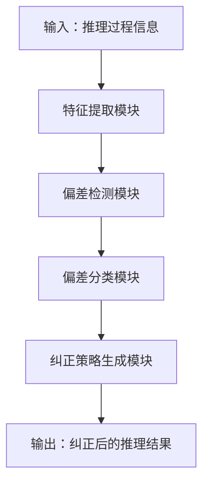

# 推理过程中的认知偏差自动检测与纠正技术

> 关键词：认知偏差、自动检测、自动纠正、推理过程、机器学习

> 摘要：本文聚焦于推理过程中的认知偏差自动检测与纠正技术。详细介绍了认知偏差的相关背景知识，包括目的、预期读者等内容。深入探讨了核心概念、算法原理、数学模型等理论基础，并结合Python代码进行详细阐述。通过项目实战展示了该技术在实际中的应用，分析了实际应用场景。同时推荐了学习该技术所需的工具和资源，最后对未来发展趋势与挑战进行总结，并给出常见问题解答和扩展阅读参考资料，旨在为相关领域的研究和实践提供全面且深入的指导。

## 1. 背景介绍 
### 1.1 目的和范围
在人类的推理过程中，认知偏差是普遍存在的现象。它会影响我们对信息的判断和决策，导致错误的结论。本技术的目的在于开发一套能够自动检测并纠正推理过程中认知偏差的方法和系统。其范围涵盖了各种推理场景，包括但不限于数据分析、问题解决、决策制定等领域。通过自动检测和纠正认知偏差，可以提高推理的准确性和可靠性，为各个领域的决策提供更科学的依据。

### 1.2 预期读者
本文预期读者包括计算机科学领域的研究人员、数据分析师、人工智能开发者、决策制定者以及对认知偏差和推理过程感兴趣的爱好者。对于研究人员来说，本文可以为他们的研究提供新的思路和方法；数据分析师和人工智能开发者可以将这些技术应用到实际项目中，提高数据分析和决策的质量；决策制定者可以了解认知偏差对决策的影响以及如何利用技术进行纠正；爱好者则可以通过本文了解相关领域的前沿知识。

### 1.3 文档结构概述
本文首先介绍了认知偏差自动检测与纠正技术的背景知识，包括目的、预期读者和文档结构。接着阐述了核心概念，包括认知偏差的定义、分类以及与推理过程的联系，并通过文本示意图和Mermaid流程图进行直观展示。然后详细讲解了核心算法原理和具体操作步骤，使用Python代码进行说明。之后介绍了数学模型和公式，并通过举例进行详细讲解。通过项目实战展示了该技术的实际应用，包括开发环境搭建、源代码实现和代码解读。分析了该技术的实际应用场景，推荐了学习所需的工具和资源。最后总结了未来发展趋势与挑战，给出常见问题解答和扩展阅读参考资料。

### 1.4 术语表
#### 1.4.1 核心术语定义
- **认知偏差**：指在认知过程中，由于心理因素、思维习惯等原因导致的对信息的错误判断和处理，从而影响推理和决策的准确性。
- **自动检测**：利用计算机技术和算法，无需人工干预，自动识别推理过程中是否存在认知偏差。
- **自动纠正**：在检测到认知偏差后，通过预设的算法和规则，自动调整推理过程，以消除或减少认知偏差的影响。

#### 1.4.2 相关概念解释
- **推理过程**：指从已知信息出发，通过逻辑思维和判断得出结论的过程。
- **机器学习**：是一门多领域交叉学科，涉及概率论、统计学、逼近论、凸分析、算法复杂度理论等多门学科。它专门研究计算机怎样模拟或实现人类的学习行为，以获取新的知识或技能，重新组织已有的知识结构使之不断改善自身的性能。

#### 1.4.3 缩略词列表
- **ML**：Machine Learning，机器学习
- **AI**：Artificial Intelligence，人工智能

## 2. 核心概念与联系 
### 核心概念原理
认知偏差是人类认知系统中的固有缺陷，它会影响我们对信息的感知、理解和处理。在推理过程中，认知偏差可能导致我们忽略重要信息、过度依赖某些信息或做出不合理的假设。自动检测与纠正技术的核心原理是通过对推理过程中的信息进行分析和建模，识别出可能存在的认知偏差，并采取相应的措施进行纠正。

### 架构的文本示意图
```plaintext
输入：推理过程信息
|
|-- 特征提取模块：从推理过程中提取关键特征
|
|-- 偏差检测模块：利用机器学习模型检测是否存在认知偏差
|
|-- 偏差分类模块：对检测到的认知偏差进行分类
|
|-- 纠正策略生成模块：根据偏差类型生成相应的纠正策略
|
输出：纠正后的推理结果
```

### Mermaid流程图


## 3. 核心算法原理 & 具体操作步骤 
### 算法原理
我们可以使用机器学习中的分类算法来检测认知偏差。具体来说，我们可以将推理过程中的特征作为输入，训练一个分类器来判断是否存在认知偏差。常用的分类算法包括决策树、支持向量机、神经网络等。

### Python源代码详细阐述
以下是一个使用决策树分类器进行认知偏差检测的示例代码：
```python
import numpy as np
from sklearn.tree import DecisionTreeClassifier
from sklearn.model_selection import train_test_split
from sklearn.metrics import accuracy_score

# 生成示例数据
# 假设我们有100个推理过程样本，每个样本有5个特征
X = np.random.rand(100, 5)
# 假设标签为0表示无认知偏差，1表示有认知偏差
y = np.random.randint(0, 2, 100)

# 划分训练集和测试集
X_train, X_test, y_train, y_test = train_test_split(X, y, test_size=0.2, random_state=42)

# 创建决策树分类器
clf = DecisionTreeClassifier()

# 训练模型
clf.fit(X_train, y_train)

# 预测
y_pred = clf.predict(X_test)

# 计算准确率
accuracy = accuracy_score(y_test, y_pred)
print(f"Accuracy: {accuracy}")
```
### 具体操作步骤
1. **数据收集**：收集大量的推理过程数据，并标注是否存在认知偏差。
2. **特征提取**：从推理过程数据中提取关键特征，例如推理的逻辑结构、信息的来源和权重等。
3. **模型训练**：使用收集到的数据和提取的特征训练一个分类器。
4. **偏差检测**：将待检测的推理过程数据输入到训练好的分类器中，判断是否存在认知偏差。
5. **偏差纠正**：如果检测到认知偏差，根据偏差类型生成相应的纠正策略，并应用到推理过程中。

## 4. 数学模型和公式 & 详细讲解 & 举例说明 
### 数学模型
假设我们有一个推理过程 $R$，可以将其表示为一个特征向量 $x=(x_1,x_2,\cdots,x_n)$，其中 $x_i$ 表示第 $i$ 个特征。我们的目标是预测一个二元标签 $y\in\{0,1\}$，其中 $y = 0$ 表示无认知偏差，$y = 1$ 表示有认知偏差。

我们可以使用一个分类函数 $f(x)$ 来进行预测，即：
$$\hat{y}=f(x)$$
其中 $\hat{y}$ 是预测的标签。

### 详细讲解
在机器学习中，我们通常使用损失函数来衡量预测结果与真实标签之间的差异。对于二元分类问题，常用的损失函数是交叉熵损失函数，其定义如下：
$$L(y,\hat{y})=-y\log(\hat{y})-(1 - y)\log(1 - \hat{y})$$
其中 $y$ 是真实标签，$\hat{y}$ 是预测的概率。

我们的目标是最小化损失函数，即：
$$\min_{\theta} \sum_{i=1}^{m} L(y_i,f(x_i;\theta))$$
其中 $\theta$ 是模型的参数，$m$ 是样本数量。

### 举例说明
假设我们有一个简单的推理过程，其特征向量为 $x=(0.2,0.3,0.4,0.5,0.6)$，真实标签为 $y = 1$。我们使用一个逻辑回归模型进行预测，其预测函数为：
$$\hat{y}=\frac{1}{1 + e^{-(w_0+w_1x_1+w_2x_2+w_3x_3+w_4x_4+w_5x_5)}}$$
其中 $w_i$ 是模型的参数。

假设我们已经训练好模型，得到参数 $w=(w_0,w_1,w_2,w_3,w_4,w_5)=(0.1,0.2,0.3,0.4,0.5,0.6)$。则预测的概率为：
$$\hat{y}=\frac{1}{1 + e^{-(0.1+0.2\times0.2+0.3\times0.3+0.4\times0.4+0.5\times0.5+0.6\times0.6)}}\approx0.7$$
则交叉熵损失为：
$$L(y,\hat{y})=-1\times\log(0.7)-(1 - 1)\times\log(1 - 0.7)\approx0.357$$

## 5. 项目实战：代码实际案例和详细解释说明 
### 5.1  开发环境搭建
#### 操作系统
建议使用Linux或Windows操作系统。

#### 编程语言和库
- **Python**：建议使用Python 3.7及以上版本。
- **机器学习库**：安装 `scikit-learn`、`numpy`、`pandas` 等库，可以使用以下命令进行安装：
```bash
pip install scikit-learn numpy pandas
```

### 5.2  源代码详细实现和代码解读
```python
import numpy as np
import pandas as pd
from sklearn.tree import DecisionTreeClassifier
from sklearn.model_selection import train_test_split
from sklearn.metrics import accuracy_score

# 加载数据集
data = pd.read_csv('reasoning_data.csv')

# 提取特征和标签
X = data.drop('bias_label', axis=1).values
y = data['bias_label'].values

# 划分训练集和测试集
X_train, X_test, y_train, y_test = train_test_split(X, y, test_size=0.2, random_state=42)

# 创建决策树分类器
clf = DecisionTreeClassifier()

# 训练模型
clf.fit(X_train, y_train)

# 预测
y_pred = clf.predict(X_test)

# 计算准确率
accuracy = accuracy_score(y_test, y_pred)
print(f"Accuracy: {accuracy}")

# 偏差纠正示例
def correct_bias(reasoning_input):
    prediction = clf.predict([reasoning_input])
    if prediction[0] == 1:
        # 这里可以根据具体的偏差类型实现纠正策略
        print("Detected cognitive bias. Applying correction...")
        # 简单示例：将推理输入的第一个特征值减半
        reasoning_input[0] = reasoning_input[0] / 2
    return reasoning_input

# 测试偏差纠正
test_input = X_test[0]
corrected_input = correct_bias(test_input)
print(f"Original input: {test_input}")
print(f"Corrected input: {corrected_input}")
```
### 代码解读与分析
1. **数据加载**：使用 `pandas` 库加载数据集，假设数据集文件名为 `reasoning_data.csv`，其中包含特征和标签。
2. **特征提取和划分**：从数据集中提取特征和标签，并将其划分为训练集和测试集。
3. **模型训练**：使用决策树分类器进行模型训练。
4. **预测和评估**：对测试集进行预测，并计算准确率。
5. **偏差纠正**：定义一个 `correct_bias` 函数，用于检测和纠正推理过程中的认知偏差。在这个示例中，如果检测到认知偏差，将推理输入的第一个特征值减半。

## 6. 实际应用场景 
### 数据分析领域
在数据分析过程中，认知偏差可能导致分析师忽略重要的数据模式或做出错误的结论。通过自动检测和纠正认知偏差，可以提高数据分析的准确性和可靠性。例如，在市场调研中，分析师可能会受到主观偏见的影响，高估或低估某些市场趋势。使用该技术可以帮助分析师更客观地分析数据，做出更科学的决策。

### 医疗诊断领域
在医疗诊断中，医生的认知偏差可能会影响诊断结果的准确性。例如，医生可能会受到先入为主的观念、经验主义等因素的影响，导致误诊或漏诊。通过自动检测和纠正认知偏差，可以辅助医生做出更准确的诊断。例如，利用机器学习模型对患者的症状和检查结果进行分析，检测医生在诊断过程中是否存在认知偏差，并提供相应的纠正建议。

### 金融投资领域
在金融投资中，投资者的认知偏差可能会导致投资决策的失误。例如，投资者可能会受到羊群效应、过度自信等因素的影响，做出不理性的投资决策。通过自动检测和纠正认知偏差，可以帮助投资者更理性地进行投资。例如，使用智能投资顾问系统，对投资者的投资决策过程进行分析，检测是否存在认知偏差，并提供相应的投资建议。

## 7. 工具和资源推荐
### 7.1 学习资源推荐
#### 7.1.1 书籍推荐
- 《机器学习》（周志华）：全面介绍了机器学习的基本概念、算法和应用，是机器学习领域的经典教材。
- 《Python机器学习》（Sebastian Raschka）：结合Python语言，详细介绍了机器学习的算法和实践，适合初学者。
- 《思考，快与慢》（丹尼尔·卡尼曼）：深入探讨了人类的认知偏差和决策过程，对于理解认知偏差的本质有很大帮助。

#### 7.1.2 在线课程
- Coursera上的“机器学习”课程（Andrew Ng）：由斯坦福大学教授Andrew Ng授课，是机器学习领域最受欢迎的在线课程之一。
- edX上的“人工智能基础”课程：介绍了人工智能的基本概念、算法和应用，适合初学者。

#### 7.1.3 技术博客和网站
- Medium：有很多关于机器学习和人工智能的技术博客，提供了最新的研究成果和实践经验。
- Kaggle：一个数据科学竞赛平台，上面有很多关于机器学习的案例和代码，可以学习和参考。

### 7.2 开发工具框架推荐
#### 7.2.1 IDE和编辑器
- PyCharm：一款专业的Python集成开发环境，提供了丰富的功能和插件，适合Python开发。
- Jupyter Notebook：一个交互式的开发环境，适合进行数据探索和模型实验。

#### 7.2.2 调试和性能分析工具
- Py-Spy：一个Python性能分析工具，可以帮助我们找出代码中的性能瓶颈。
- pdb：Python自带的调试工具，可以帮助我们调试代码。

#### 7.2.3 相关框架和库
- TensorFlow：一个开源的机器学习框架，广泛应用于深度学习领域。
- PyTorch：另一个开源的机器学习框架，具有动态图的特点，适合快速开发和实验。

### 7.3 相关论文著作推荐
#### 7.3.1 经典论文
- 《A Unified Approach to Interpreting Model Predictions》（Scott Lundberg）：提出了一种统一的方法来解释模型的预测结果，对于理解模型的决策过程有很大帮助。
- 《Gradient-Based Learning Applied to Document Recognition》（Yann LeCun）：介绍了卷积神经网络在图像识别中的应用，是深度学习领域的经典论文。

#### 7.3.2 最新研究成果
可以关注顶级学术会议如NeurIPS、ICML、CVPR等的最新研究成果，了解认知偏差自动检测与纠正技术的最新进展。

#### 7.3.3 应用案例分析
可以参考一些实际应用案例的论文，了解该技术在不同领域的应用效果和挑战。例如，在医疗诊断领域的应用案例可以帮助我们了解如何将该技术应用到实际的医疗场景中。

## 8. 总结：未来发展趋势与挑战
### 未来发展趋势
- **多模态数据融合**：未来的研究可能会结合多种模态的数据，如文本、图像、音频等，来更全面地检测和纠正认知偏差。例如，在医疗诊断中，可以结合患者的病历文本、影像图像和语音描述等多模态数据进行分析。
- **个性化纠正策略**：根据不同用户的认知特点和偏好，生成个性化的纠正策略。例如，对于不同性格和思维方式的投资者，提供不同的投资建议和偏差纠正方法。
- **与其他技术的融合**：与区块链、物联网等技术融合，拓展应用场景。例如，在供应链管理中，结合区块链的不可篡改特性和物联网的实时数据采集能力，检测和纠正供应链决策中的认知偏差。

### 挑战
- **数据质量和标注问题**：高质量的数据是训练有效模型的基础，但获取和标注大量的推理过程数据是一项具有挑战性的任务。此外，数据中的噪声和偏差也会影响模型的性能。
- **认知偏差的复杂性**：认知偏差的类型繁多，且相互交织，很难用一种统一的方法进行检测和纠正。例如，一个推理过程中可能同时存在多种认知偏差，需要综合考虑和处理。
- **可解释性问题**：机器学习模型，尤其是深度学习模型，往往是黑盒模型，很难解释其决策过程。在实际应用中，用户需要了解模型是如何检测和纠正认知偏差的，这对模型的可解释性提出了很高的要求。

## 9. 附录：常见问题与解答
### 问题1：如何选择合适的特征来检测认知偏差？
答：选择合适的特征需要结合具体的应用场景和认知偏差的类型。一般来说，可以从推理的逻辑结构、信息的来源和权重、推理者的背景和经验等方面入手。例如，在数据分析中，可以选择数据的统计特征、数据的分布情况等作为特征。同时，可以通过特征选择算法来筛选出最具代表性的特征。

### 问题2：如何评估自动检测和纠正技术的性能？
答：可以使用多种指标来评估性能，如准确率、召回率、F1值等。准确率表示预测正确的样本占总样本的比例；召回率表示实际存在偏差的样本中被正确检测出来的比例；F1值是准确率和召回率的调和平均数。此外，还可以进行实际应用测试，观察该技术在实际场景中的效果。

### 问题3：自动纠正策略的制定有哪些方法？
答：自动纠正策略的制定可以基于规则、机器学习或两者结合。基于规则的方法是根据已知的认知偏差类型和纠正原则，制定相应的规则。例如，如果检测到过度自信偏差，可以降低推理结果的置信度。机器学习方法则是通过训练模型来学习纠正策略。例如，使用强化学习算法来学习在不同情况下的最优纠正策略。

## 10. 扩展阅读 & 参考资料
- 周志华. 机器学习[M]. 清华大学出版社, 2016.
- 丹尼尔·卡尼曼. 思考，快与慢[M]. 中信出版社, 2012.
- Scott Lundberg. A Unified Approach to Interpreting Model Predictions[J]. Advances in Neural Information Processing Systems, 2017.
- Yann LeCun. Gradient-Based Learning Applied to Document Recognition[J]. Proceedings of the IEEE, 1998.

作者：AI天才研究院/AI Genius Institute & 禅与计算机程序设计艺术 /Zen And The Art of Computer Programming