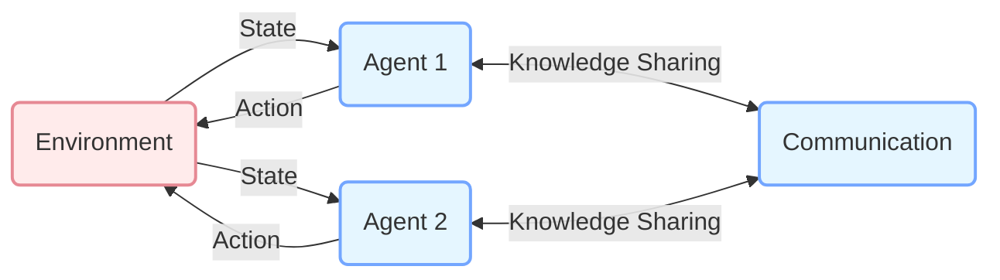

# 提升AI模型在多智能体协作学习任务中的知识共享效率

> 关键词：AI模型、多智能体协作学习、知识共享效率、通信机制、强化学习

> 摘要：本文聚焦于提升AI模型在多智能体协作学习任务中的知识共享效率这一关键问题。首先介绍了相关背景，包括目的范围、预期读者等。接着阐述了核心概念及联系，详细讲解了核心算法原理与操作步骤，并给出了数学模型和公式。通过项目实战展示了具体代码实现和解读，分析了实际应用场景。同时推荐了学习资源、开发工具框架和相关论文著作。最后总结了未来发展趋势与挑战，并提供了常见问题解答和扩展阅读参考资料，旨在为研究和应用多智能体协作学习的人员提供全面的技术指导和深入的思考方向。

## 1. 背景介绍 
### 1.1 目的和范围
在当今复杂的现实世界场景中，许多任务需要多个智能体相互协作来完成，如自动驾驶车队的协同导航、智能物流系统中的多机器人协作等。多智能体协作学习旨在让多个智能体通过交互和学习，共同完成复杂任务。然而，在协作过程中，智能体之间的知识共享效率是影响整体性能的关键因素。本文章的目的是深入探讨如何提升AI模型在多智能体协作学习任务中的知识共享效率，涵盖了从理论原理到实际应用的多个方面，包括核心算法、数学模型、代码实现以及实际场景分析等。

### 1.2 预期读者
本文预期读者包括对人工智能、多智能体系统感兴趣的研究人员、学生，以及从事相关领域开发的工程师。对于希望深入了解多智能体协作学习技术，尤其是关注知识共享效率提升的人群具有较高的参考价值。

### 1.3 文档结构概述
本文将按照以下结构进行阐述：首先介绍核心概念与联系，包括多智能体协作学习和知识共享的基本原理和架构；接着讲解核心算法原理和具体操作步骤，并给出Python代码示例；然后介绍数学模型和公式，并通过举例说明其应用；通过项目实战展示代码的实际案例和详细解释；分析实际应用场景；推荐相关的工具和资源；最后总结未来发展趋势与挑战，提供常见问题解答和扩展阅读参考资料。

### 1.4 术语表
#### 1.4.1 核心术语定义
- **多智能体协作学习（Multi-Agent Cooperative Learning）**：多个智能体通过交互和合作，共同学习以完成特定任务的过程。智能体可以是物理实体（如机器人）或虚拟实体（如软件程序）。
- **知识共享（Knowledge Sharing）**：智能体之间交换和传递所拥有的信息、经验和技能的过程，旨在提高整体协作性能。
- **强化学习（Reinforcement Learning）**：一种机器学习方法，智能体通过与环境进行交互，根据环境反馈的奖励信号来学习最优策略。

#### 1.4.2 相关概念解释
- **智能体（Agent）**：具有感知、决策和行动能力的实体，能够根据自身状态和环境信息做出决策并执行相应的动作。
- **通信机制（Communication Mechanism）**：智能体之间进行信息传递的方式和规则，如消息传递、广播等。
- **策略（Policy）**：智能体在不同状态下选择动作的规则，通常用函数表示。

#### 1.4.3 缩略词列表
- **RL**：Reinforcement Learning（强化学习）
- **MARL**：Multi-Agent Reinforcement Learning（多智能体强化学习）

## 2. 核心概念与联系 
### 核心概念原理
多智能体协作学习的核心在于多个智能体通过协作来完成共同的目标。每个智能体具有自己的感知、决策和行动能力，但在协作过程中需要与其他智能体进行信息交互和共享。知识共享是多智能体协作学习中的关键环节，通过有效的知识共享，智能体可以更快地学习到更优的策略，提高整体协作性能。

例如，在一个多机器人协作搬运任务中，每个机器人可以感知到周围环境和自身状态，但通过知识共享，它们可以了解其他机器人的位置、任务进度等信息，从而更好地协调行动，避免碰撞和重复劳动。

### 架构的文本示意图
多智能体协作学习系统通常由多个智能体、环境和通信机制组成。智能体与环境进行交互，根据环境反馈的奖励信号学习策略。同时，智能体之间通过通信机制进行知识共享。

```plaintext
+---------------------+
|      Environment    |
+---------------------+
        |       ^
        |       |
        v       |
+---------------------+
|    Agent 1          |
|  +---------------+  |
|  |  Perception   |  |
|  +---------------+  |
|  |  Decision     |  |
|  +---------------+  |
|  |  Action       |  |
|  +---------------+  |
+---------------------+
        |       ^
        |       |
        v       |
+---------------------+
|    Agent 2          |
|  +---------------+  |
|  |  Perception   |  |
|  +---------------+  |
|  |  Decision     |  |
|  +---------------+  |
|  |  Action       |  |
|  +---------------+  |
+---------------------+
        |       ^
        |       |
        v       |
+---------------------+
|    Communication    |
|  +---------------+  |
|  |  Knowledge      |  |
|  |  Sharing        |  |
|  +---------------+  |
+---------------------+
```

### Mermaid流程图


## 3. 核心算法原理 & 具体操作步骤 
### 核心算法原理
在多智能体协作学习中，常用的算法是多智能体强化学习（MARL）。其中，基于价值的方法如Q - learning及其扩展是较为常见的。

以经典的Q - learning算法为例，其核心思想是通过不断更新Q值（动作价值函数）来学习最优策略。在多智能体场景中，每个智能体都维护自己的Q表，记录在不同状态下选择不同动作的价值。智能体根据当前状态选择动作，并根据环境反馈的奖励更新Q表。

### Python源代码阐述
以下是一个简单的多智能体Q - learning示例代码：

```python
import numpy as np

# 定义智能体类
class Agent:
    def __init__(self, state_size, action_size, learning_rate=0.1, discount_factor=0.9):
        self.state_size = state_size
        self.action_size = action_size
        self.learning_rate = learning_rate
        self.discount_factor = discount_factor
        self.q_table = np.zeros((state_size, action_size))

    def choose_action(self, state):
        # 简单的贪心策略选择动作
        if np.random.uniform(0, 1) < 0.1:
            action = np.random.choice(self.action_size)
        else:
            action = np.argmax(self.q_table[state, :])
        return action

    def update_q_table(self, state, action, reward, next_state):
        # 更新Q表
        predict = self.q_table[state, action]
        target = reward + self.discount_factor * np.max(self.q_table[next_state, :])
        self.q_table[state, action] = (1 - self.learning_rate) * predict + self.learning_rate * target

# 多智能体协作学习环境模拟
class MultiAgentEnv:
    def __init__(self, num_agents, state_size, action_size):
        self.num_agents = num_agents
        self.state_size = state_size
        self.action_size = action_size
        self.agents = [Agent(state_size, action_size) for _ in range(num_agents)]

    def step(self, actions):
        # 简单模拟环境反馈
        rewards = [np.random.randint(-1, 2) for _ in range(self.num_agents)]
        next_states = [np.random.randint(0, self.state_size) for _ in range(self.num_agents)]
        return rewards, next_states

    def run_episode(self):
        states = [np.random.randint(0, self.state_size) for _ in range(self.num_agents)]
        done = False
        while not done:
            actions = [agent.choose_action(state) for agent, state in zip(self.agents, states)]
            rewards, next_states = self.step(actions)
            for i in range(self.num_agents):
                self.agents[i].update_q_table(states[i], actions[i], rewards[i], next_states[i])
            states = next_states
            # 简单终止条件
            if np.random.rand() < 0.1:
                done = True

# 主程序
if __name__ == "__main__":
    num_agents = 2
    state_size = 10
    action_size = 4
    env = MultiAgentEnv(num_agents, state_size, action_size)
    for episode in range(100):
        env.run_episode()
```

### 具体操作步骤
1. **初始化**：初始化每个智能体的Q表，以及环境的状态和动作空间。
2. **选择动作**：每个智能体根据当前状态和Q表选择动作。可以使用贪心策略或ε - 贪心策略。
3. **执行动作**：智能体执行选择的动作，环境根据动作给出奖励和下一个状态。
4. **更新Q表**：每个智能体根据奖励和下一个状态更新自己的Q表。
5. **重复步骤2 - 4**：直到达到终止条件（如达到最大步数或任务完成）。

## 4. 数学模型和公式 & 详细讲解 & 举例说明 
### 数学模型和公式
在Q - learning算法中，动作价值函数 $Q(s,a)$ 表示在状态 $s$ 下选择动作 $a$ 的期望累积奖励。其更新公式为：

$$Q(s,a) \leftarrow (1 - \alpha)Q(s,a) + \alpha\left[r + \gamma\max_{a'}Q(s',a')\right]$$

其中：
- $\alpha$ 是学习率，控制新信息对旧信息的更新程度。
- $r$ 是当前状态 $s$ 下执行动作 $a$ 后获得的奖励。
- $\gamma$ 是折扣因子，用于权衡当前奖励和未来奖励的重要性。
- $s'$ 是执行动作 $a$ 后转移到的下一个状态。

### 详细讲解
- **学习率 $\alpha$**：$\alpha$ 的取值范围通常在 $[0,1]$ 之间。当 $\alpha$ 接近1时，新的奖励信息对Q值的更新影响较大；当 $\alpha$ 接近0时，Q值的更新较为缓慢，保留了更多的历史信息。
- **折扣因子 $\gamma$**：$\gamma$ 的取值范围也在 $[0,1]$ 之间。$\gamma$ 越接近1，智能体越注重未来的奖励；$\gamma$ 越接近0，智能体更关注当前的奖励。

### 举例说明
假设一个智能体处于状态 $s = 1$，选择动作 $a = 2$，获得奖励 $r = 1$，转移到下一个状态 $s' = 3$。当前 $Q(1,2) = 0.5$，学习率 $\alpha = 0.1$，折扣因子 $\gamma = 0.9$，且 $\max_{a'}Q(3,a') = 0.8$。

根据更新公式可得：

$$
\begin{align*}
Q(1,2) &\leftarrow (1 - 0.1)\times0.5 + 0.1\times(1 + 0.9\times0.8)\\
&= 0.9\times0.5 + 0.1\times(1 + 0.72)\\
&= 0.45 + 0.1\times1.72\\
&= 0.45 + 0.172\\
&= 0.622
\end{align*}
$$

## 5. 项目实战：代码实际案例和详细解释说明 
### 5.1  开发环境搭建
#### 安装Python
首先确保已经安装了Python，建议使用Python 3.6及以上版本。可以从Python官方网站（https://www.python.org/downloads/）下载并安装。

#### 安装必要的库
本项目主要使用了NumPy库，用于数值计算。可以使用以下命令安装：
```sh
pip install numpy
```

### 5.2  源代码详细实现和代码解读
```python
import numpy as np

# 定义智能体类
class Agent:
    def __init__(self, state_size, action_size, learning_rate=0.1, discount_factor=0.9):
        # 初始化状态空间大小、动作空间大小、学习率和折扣因子
        self.state_size = state_size
        self.action_size = action_size
        self.learning_rate = learning_rate
        self.discount_factor = discount_factor
        # 初始化Q表，初始值全为0
        self.q_table = np.zeros((state_size, action_size))

    def choose_action(self, state):
        # 以10%的概率随机选择动作，90%的概率选择Q值最大的动作
        if np.random.uniform(0, 1) < 0.1:
            action = np.random.choice(self.action_size)
        else:
            action = np.argmax(self.q_table[state, :])
        return action

    def update_q_table(self, state, action, reward, next_state):
        # 根据Q - learning更新公式更新Q表
        predict = self.q_table[state, action]
        target = reward + self.discount_factor * np.max(self.q_table[next_state, :])
        self.q_table[state, action] = (1 - self.learning_rate) * predict + self.learning_rate * target

# 多智能体协作学习环境模拟
class MultiAgentEnv:
    def __init__(self, num_agents, state_size, action_size):
        # 初始化智能体数量、状态空间大小和动作空间大小
        self.num_agents = num_agents
        self.state_size = state_size
        self.action_size = action_size
        # 创建多个智能体实例
        self.agents = [Agent(state_size, action_size) for _ in range(num_agents)]

    def step(self, actions):
        # 简单模拟环境反馈，随机生成奖励和下一个状态
        rewards = [np.random.randint(-1, 2) for _ in range(self.num_agents)]
        next_states = [np.random.randint(0, self.state_size) for _ in range(self.num_agents)]
        return rewards, next_states

    def run_episode(self):
        # 初始化每个智能体的状态
        states = [np.random.randint(0, self.state_size) for _ in range(self.num_agents)]
        done = False
        while not done:
            # 每个智能体选择动作
            actions = [agent.choose_action(state) for agent, state in zip(self.agents, states)]
            # 执行动作，获取奖励和下一个状态
            rewards, next_states = self.step(actions)
            # 每个智能体更新Q表
            for i in range(self.num_agents):
                self.agents[i].update_q_table(states[i], actions[i], rewards[i], next_states[i])
            states = next_states
            # 简单终止条件，以10%的概率结束当前回合
            if np.random.rand() < 0.1:
                done = True

# 主程序
if __name__ == "__main__":
    num_agents = 2
    state_size = 10
    action_size = 4
    # 创建多智能体环境实例
    env = MultiAgentEnv(num_agents, state_size, action_size)
    # 运行100个回合
    for episode in range(100):
        env.run_episode()
```

### 5.3  代码解读与分析
- **Agent类**：
  - `__init__` 方法：初始化智能体的状态空间、动作空间、学习率、折扣因子和Q表。
  - `choose_action` 方法：根据ε - 贪心策略选择动作，以一定概率随机选择动作，避免陷入局部最优。
  - `update_q_table` 方法：根据Q - learning更新公式更新Q表。

- **MultiAgentEnv类**：
  - `__init__` 方法：初始化智能体数量、状态空间、动作空间，并创建多个智能体实例。
  - `step` 方法：模拟环境反馈，随机生成奖励和下一个状态。
  - `run_episode` 方法：运行一个回合的学习过程，包括智能体选择动作、执行动作、更新Q表等步骤。

- **主程序**：创建多智能体环境实例，并运行100个回合的学习过程。

## 6. 实际应用场景 
### 自动驾驶
在自动驾驶领域，多辆自动驾驶汽车可以看作多个智能体。它们需要通过协作来实现高效的交通流控制，避免碰撞和拥堵。通过知识共享，每辆车可以了解其他车辆的行驶意图、速度、位置等信息，从而更好地规划自己的行驶路线。例如，当一辆车检测到前方道路拥堵时，可以将该信息共享给其他车辆，其他车辆可以提前调整路线，提高整体交通效率。

### 智能物流
在智能物流系统中，多个机器人可以协作完成货物搬运任务。每个机器人可以感知自己周围的环境和货物信息，通过知识共享，它们可以协调行动，避免冲突和重复劳动。例如，一个机器人发现某个区域的货物较多，可以将该信息共享给其他机器人，其他机器人可以前往该区域协助搬运。

### 电力系统
在电力系统中，多个分布式电源（如太阳能板、风力发电机等）可以看作多个智能体。它们需要协作来实现电力的稳定供应和优化分配。通过知识共享，每个电源可以了解其他电源的发电状态、负载需求等信息，从而调整自己的发电功率，提高电力系统的整体效率和稳定性。

### 游戏领域
在多人在线游戏中，多个玩家角色可以看作多个智能体。它们需要协作来完成游戏任务，如组队打怪、攻城略地等。通过知识共享，玩家可以了解队友的位置、技能状态等信息，从而更好地制定战术，提高游戏胜率。

## 7. 工具和资源推荐
### 7.1 学习资源推荐
#### 7.1.1 书籍推荐
- 《Reinforcement Learning: An Introduction》：这是强化学习领域的经典教材，全面介绍了强化学习的基本概念、算法和应用。
- 《Multi-Agent Systems: Algorithmic, Game-Theoretic, and Logical Foundations》：深入探讨了多智能体系统的理论基础，包括算法、博弈论和逻辑等方面。

#### 7.1.2 在线课程
- Coursera上的“Reinforcement Learning Specialization”：由著名学者Richard Sutton等授课，系统介绍了强化学习的理论和实践。
- edX上的“Artificial Intelligence: Reinforcement Learning”：提供了强化学习的基础知识和实际应用案例。

#### 7.1.3 技术博客和网站
- OpenAI Blog：OpenAI发布的最新研究成果和技术文章，涵盖了人工智能的多个领域，包括多智能体协作学习。
- Medium上的“Towards Data Science”：有许多关于机器学习和人工智能的优质文章，包括多智能体系统的相关内容。

### 7.2 开发工具框架推荐
#### 7.2.1 IDE和编辑器
- PyCharm：一款功能强大的Python集成开发环境，提供了代码编辑、调试、版本控制等功能，适合开发多智能体协作学习项目。
- Jupyter Notebook：一种交互式的开发环境，适合进行代码测试、数据分析和可视化，方便快速验证算法和模型。

#### 7.2.2 调试和性能分析工具
- TensorBoard：TensorFlow提供的可视化工具，可以用于监控训练过程、分析模型性能等。
- Py-Spy：一个轻量级的Python性能分析工具，可以帮助开发者找出代码中的性能瓶颈。

#### 7.2.3 相关框架和库
- OpenAI Gym：一个用于开发和比较强化学习算法的工具包，提供了多种环境和基准测试。
- PettingZoo：一个专门用于多智能体强化学习的环境库，支持多种多智能体游戏和任务。

### 7.3 相关论文著作推荐
#### 7.3.1 经典论文
- “Q-learning”：由Christopher J. C. H. Watkins和Peter Dayan发表的论文，首次提出了Q - learning算法，是强化学习领域的经典之作。
- “Multi-Agent Reinforcement Learning: A Selective Overview of Theories and Algorithms”：对多智能体强化学习的理论和算法进行了全面的综述。

#### 7.3.2 最新研究成果
- 关注顶级人工智能会议（如NeurIPS、ICML、AAAI等）上发表的关于多智能体协作学习的论文，了解最新的研究动态和技术进展。

#### 7.3.3 应用案例分析
- 一些实际应用领域（如自动驾驶、智能物流等）的研究论文和报告，分析多智能体协作学习在这些领域的具体应用和效果。

## 8. 总结：未来发展趋势与挑战
### 未来发展趋势
- **更复杂的协作任务**：随着技术的发展，多智能体协作学习将应用于更复杂的任务，如大规模的城市交通管理、星际探索等。这些任务需要智能体之间进行更高效的知识共享和协作。
- **与其他技术的融合**：多智能体协作学习将与深度学习、计算机视觉、自然语言处理等技术深度融合，提高智能体的感知和决策能力。例如，结合计算机视觉技术，智能体可以更好地感知环境；结合自然语言处理技术，智能体可以进行更复杂的信息交流。
- **分布式和去中心化**：未来的多智能体系统将更加注重分布式和去中心化的设计，减少对中央控制节点的依赖，提高系统的鲁棒性和可扩展性。

### 挑战
- **通信带宽和延迟**：在大规模多智能体系统中，知识共享需要大量的通信带宽，同时通信延迟也会影响智能体之间的协作效率。如何在有限的通信资源下实现高效的知识共享是一个挑战。
- **隐私和安全**：智能体之间的知识共享可能涉及到隐私和安全问题，如敏感信息的泄露、恶意攻击等。如何在知识共享的同时保障隐私和安全是需要解决的问题。
- **智能体间的冲突和协调**：不同智能体可能有不同的目标和策略，在协作过程中可能会产生冲突。如何有效地协调智能体之间的行为，避免冲突，是多智能体协作学习面临的挑战之一。

## 9. 附录：常见问题与解答
### Q1：多智能体协作学习和单智能体学习有什么区别？
A1：单智能体学习是指一个智能体独立地与环境进行交互和学习，而多智能体协作学习涉及多个智能体之间的交互和合作。在多智能体协作学习中，智能体需要考虑其他智能体的行为和状态，通过知识共享来提高整体协作性能。

### Q2：如何选择合适的通信机制？
A2：选择合适的通信机制需要考虑多个因素，如通信带宽、延迟、可靠性、隐私和安全等。对于通信带宽有限的场景，可以选择压缩信息、减少通信频率等方式；对于对延迟敏感的任务，需要选择低延迟的通信方式。同时，还需要根据具体应用场景考虑隐私和安全需求，选择合适的加密和认证机制。

### Q3：多智能体强化学习中的信用分配问题如何解决？
A3：信用分配问题是指在多智能体强化学习中，如何将环境反馈的奖励合理地分配给每个智能体。常见的解决方法包括基于团队奖励的方法、基于个体贡献的方法等。基于团队奖励的方法将整个团队的奖励作为每个智能体的奖励；基于个体贡献的方法则通过评估每个智能体对团队的贡献来分配奖励。

## 10. 扩展阅读 & 参考资料
- Watkins, C. J. C. H., & Dayan, P. (1992). Q - learning. Machine learning, 8(3 - 4), 279 - 292.
- Shoham, Y., & Leyton - Brown, K. (2009). Multi - Agent Systems: Algorithmic, Game - Theoretic, and Logical Foundations. Cambridge University Press.
- OpenAI Gym官方文档：https://gym.openai.com/docs/
- PettingZoo官方文档：https://www.pettingzoo.ml/

作者：AI天才研究院/AI Genius Institute & 禅与计算机程序设计艺术 /Zen And The Art of Computer Programming