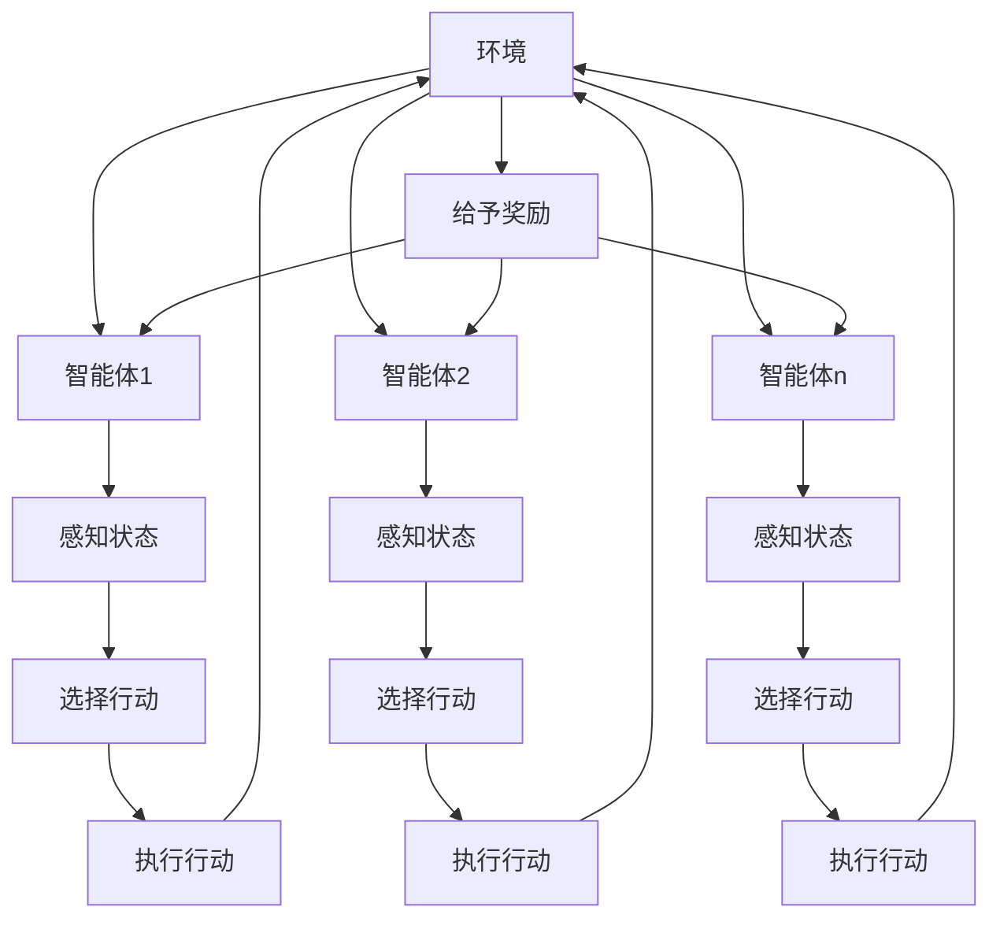

# 提升AI模型在多智能体强化学习任务中的协作效率

> 关键词：多智能体强化学习、协作效率、AI模型、通信机制、策略优化

> 摘要：本文聚焦于提升AI模型在多智能体强化学习任务中的协作效率。首先介绍了多智能体强化学习的背景知识，包括目的范围、预期读者等内容。接着阐述了核心概念及其联系，详细讲解了核心算法原理与具体操作步骤，并给出了相应的Python代码。通过数学模型和公式对相关理论进行深入剖析，结合实际案例进行说明。在项目实战部分，介绍了开发环境搭建、源代码实现及解读。分析了实际应用场景，推荐了学习资源、开发工具框架和相关论文著作。最后总结了未来发展趋势与挑战，提供了常见问题解答和扩展阅读参考资料，旨在为研究者和开发者在提升多智能体强化学习协作效率方面提供全面的指导。

## 1. 背景介绍 
### 1.1 目的和范围
多智能体强化学习（Multi-Agent Reinforcement Learning，MARL）在诸多领域展现出巨大的应用潜力，如自动驾驶、机器人协作、智能电网等。然而，多个智能体在协作完成任务时，往往面临着协作效率低下的问题，例如智能体之间的信息交流不畅、策略冲突等。本文的目的在于深入探讨如何提升AI模型在多智能体强化学习任务中的协作效率，涵盖了从理论原理到实际应用的多个方面，包括核心算法、数学模型、项目实战以及工具资源等内容。

### 1.2 预期读者
本文预期读者包括人工智能领域的研究者、学生，以及从事多智能体强化学习相关项目开发的工程师。对于想要深入了解多智能体强化学习协作机制、提升模型协作效率的人员具有较高的参考价值。

### 1.3 文档结构概述
本文将按照以下结构进行阐述：首先介绍多智能体强化学习的核心概念及其联系，通过文本示意图和Mermaid流程图进行直观展示；接着详细讲解核心算法原理和具体操作步骤，并给出Python代码示例；然后运用数学模型和公式对相关理论进行深入分析，并举例说明；在项目实战部分，介绍开发环境搭建、源代码实现和代码解读；分析实际应用场景；推荐学习资源、开发工具框架和相关论文著作；最后总结未来发展趋势与挑战，提供常见问题解答和扩展阅读参考资料。

### 1.4 术语表
#### 1.4.1 核心术语定义
- **多智能体强化学习（Multi-Agent Reinforcement Learning，MARL）**：是指多个智能体在一个环境中通过与环境交互，学习如何采取最优行动以最大化累积奖励的过程。每个智能体都有自己的目标和策略，需要在协作或竞争的环境中学习。
- **智能体（Agent）**：在多智能体强化学习中，智能体是能够感知环境状态、采取行动并从环境中获得奖励反馈的实体。
- **协作效率（Collaboration Efficiency）**：指多个智能体在完成共同任务时，能够以高效、协调的方式进行合作，实现任务目标的能力。协作效率可以通过任务完成时间、资源利用率等指标来衡量。
- **策略（Policy）**：是智能体根据当前环境状态选择行动的规则。在强化学习中，策略通常用函数表示，例如 $\pi(s)$ 表示在状态 $s$ 下选择行动的概率分布。

#### 1.4.2 相关概念解释
- **环境（Environment）**：是多智能体强化学习系统中的外部世界，智能体在其中进行交互。环境定义了状态空间、行动空间和奖励函数。
- **状态（State）**：是环境在某一时刻的描述，智能体根据当前状态选择行动。状态可以是离散的或连续的。
- **行动（Action）**：是智能体在某一状态下可以采取的操作。行动会影响环境的状态，并获得相应的奖励。
- **奖励（Reward）**：是环境对智能体行动的反馈，用于指导智能体学习。智能体的目标是最大化累积奖励。

#### 1.4.3 缩略词列表
- **MARL**：Multi-Agent Reinforcement Learning，多智能体强化学习
- **DQN**：Deep Q-Network，深度Q网络
- **A2C**：Advantage Actor-Critic，优势演员-评论家算法
- **PPO**：Proximal Policy Optimization，近端策略优化算法

## 2. 核心概念与联系 
### 核心概念原理
在多智能体强化学习中，核心概念包括智能体、环境、状态、行动、奖励和策略。智能体通过感知环境状态，根据自身策略选择行动，环境根据智能体的行动更新状态并给予奖励反馈。智能体的目标是通过不断学习，调整策略以最大化累积奖励。

多个智能体在同一环境中交互，它们的行动相互影响，因此需要考虑协作和协调。协作效率的提升关键在于智能体之间的信息交流和策略优化。信息交流可以帮助智能体了解其他智能体的状态和意图，从而更好地协调行动；策略优化则可以使智能体选择更优的行动，提高整体协作效果。

### 架构的文本示意图
```plaintext
多智能体强化学习系统
|-- 环境
|   |-- 状态空间
|   |-- 行动空间
|   |-- 奖励函数
|-- 智能体1
|   |-- 策略1
|   |-- 感知环境状态
|   |-- 选择行动
|   |-- 接收奖励反馈
|-- 智能体2
|   |-- 策略2
|   |-- 感知环境状态
|   |-- 选择行动
|   |-- 接收奖励反馈
|--...
|-- 智能体n
|   |-- 策略n
|   |-- 感知环境状态
|   |-- 选择行动
|   |-- 接收奖励反馈
```

### Mermaid流程图


## 3. 核心算法原理 & 具体操作步骤 
### 核心算法原理
在多智能体强化学习中，常用的算法包括基于值函数的算法（如DQN）、基于策略梯度的算法（如A2C、PPO）等。这里以A2C算法为例进行讲解。

A2C算法是一种基于策略梯度的算法，它结合了演员-评论家（Actor-Critic）架构。演员网络负责生成行动策略，评论家网络负责评估状态价值。通过不断更新演员和评论家网络的参数，使智能体能够学习到最优策略。

### 具体操作步骤
1. **初始化**：初始化演员网络 $\pi_{\theta}(a|s)$ 和评论家网络 $V_{\phi}(s)$ 的参数 $\theta$ 和 $\phi$。
2. **与环境交互**：智能体根据当前策略 $\pi_{\theta}(a|s)$ 选择行动 $a$，与环境交互，得到下一个状态 $s'$ 和奖励 $r$。
3. **计算优势函数**：优势函数 $A(s,a)$ 表示在状态 $s$ 下采取行动 $a$ 相对于平均价值的优势。可以通过 $A(s,a) = r + \gamma V_{\phi}(s') - V_{\phi}(s)$ 计算，其中 $\gamma$ 是折扣因子。
4. **更新评论家网络**：使用均方误差损失函数 $L_{V} = \frac{1}{2}(r + \gamma V_{\phi}(s') - V_{\phi}(s))^2$ 更新评论家网络的参数 $\phi$。
5. **更新演员网络**：使用策略梯度损失函数 $L_{\pi} = -\log\pi_{\theta}(a|s)A(s,a)$ 更新演员网络的参数 $\theta$。
6. **重复步骤2-5**：直到达到最大训练步数或收敛。

### Python源代码实现
```python
import torch
import torch.nn as nn
import torch.optim as optim
import numpy as np

# 定义演员网络
class Actor(nn.Module):
    def __init__(self, state_dim, action_dim):
        super(Actor, self).__init__()
        self.fc1 = nn.Linear(state_dim, 64)
        self.fc2 = nn.Linear(64, action_dim)
        self.softmax = nn.Softmax(dim=-1)

    def forward(self, state):
        x = torch.relu(self.fc1(state))
        action_probs = self.softmax(self.fc2(x))
        return action_probs

# 定义评论家网络
class Critic(nn.Module):
    def __init__(self, state_dim):
        super(Critic, self).__init__()
        self.fc1 = nn.Linear(state_dim, 64)
        self.fc2 = nn.Linear(64, 1)

    def forward(self, state):
        x = torch.relu(self.fc1(state))
        value = self.fc2(x)
        return value

# A2C算法类
class A2C:
    def __init__(self, state_dim, action_dim, lr_actor=0.001, lr_critic=0.001, gamma=0.99):
        self.actor = Actor(state_dim, action_dim)
        self.critic = Critic(state_dim)
        self.optimizer_actor = optim.Adam(self.actor.parameters(), lr=lr_actor)
        self.optimizer_critic = optim.Adam(self.critic.parameters(), lr=lr_critic)
        self.gamma = gamma

    def select_action(self, state):
        state = torch.FloatTensor(state).unsqueeze(0)
        action_probs = self.actor(state)
        action = torch.multinomial(action_probs, 1).item()
        return action

    def update(self, state, action, reward, next_state, done):
        state = torch.FloatTensor(state).unsqueeze(0)
        next_state = torch.FloatTensor(next_state).unsqueeze(0)
        reward = torch.FloatTensor([reward])
        done = torch.FloatTensor([done])

        # 计算优势函数
        value = self.critic(state)
        next_value = self.critic(next_state)
        advantage = reward + (1 - done) * self.gamma * next_value - value

        # 更新评论家网络
        critic_loss = (advantage ** 2).mean()
        self.optimizer_critic.zero_grad()
        critic_loss.backward()
        self.optimizer_critic.step()

        # 更新演员网络
        action_probs = self.actor(state)
        action_log_prob = torch.log(action_probs.squeeze(0)[action])
        actor_loss = -action_log_prob * advantage.detach()
        self.optimizer_actor.zero_grad()
        actor_loss.backward()
        self.optimizer_actor.step()
```

## 4. 数学模型和公式 & 详细讲解 & 举例说明 
### 数学模型和公式
#### 策略梯度定理
策略梯度定理是基于策略梯度的强化学习算法的理论基础。对于一个策略 $\pi_{\theta}(a|s)$，其目标是最大化累积奖励的期望 $J(\theta) = \mathbb{E}_{\tau \sim \pi_{\theta}}[\sum_{t=0}^{T} \gamma^t r_t]$，其中 $\tau = (s_0, a_0, r_0, s_1, a_1, r_1, \cdots)$ 是一个轨迹，$\gamma$ 是折扣因子。

策略梯度可以表示为：
$$
\nabla_{\theta} J(\theta) = \mathbb{E}_{\tau \sim \pi_{\theta}}[\sum_{t=0}^{T} \nabla_{\theta} \log \pi_{\theta}(a_t|s_t) Q^{\pi_{\theta}}(s_t, a_t)]
$$
其中 $Q^{\pi_{\theta}}(s_t, a_t)$ 是动作价值函数，表示在状态 $s_t$ 下采取行动 $a_t$ 并遵循策略 $\pi_{\theta}$ 后的累积奖励期望。

#### A2C算法中的损失函数
在A2C算法中，演员网络的损失函数为：
$$
L_{\pi} = -\log\pi_{\theta}(a|s)A(s,a)
$$
其中 $A(s,a)$ 是优势函数，表示在状态 $s$ 下采取行动 $a$ 相对于平均价值的优势。

评论家网络的损失函数为：
$$
L_{V} = \frac{1}{2}(r + \gamma V_{\phi}(s') - V_{\phi}(s))^2
$$

### 详细讲解
策略梯度定理表明，通过计算策略的对数概率的梯度与动作价值函数的乘积的期望，可以得到策略的梯度。在A2C算法中，使用优势函数 $A(s,a)$ 代替动作价值函数 $Q^{\pi_{\theta}}(s,a)$，可以减少方差，提高学习效率。

演员网络的损失函数 $L_{\pi}$ 的目标是最大化优势函数与策略对数概率的乘积，从而使策略更倾向于选择具有较高优势的行动。评论家网络的损失函数 $L_{V}$ 的目标是最小化估计值与实际值之间的均方误差，从而提高状态价值的估计准确性。

### 举例说明
假设一个简单的多智能体强化学习任务，智能体在一个二维网格世界中移动，目标是到达指定的目标位置。状态 $s$ 可以表示为智能体的当前位置 $(x, y)$，行动 $a$ 可以表示为上下左右四个方向的移动。奖励 $r$ 可以设置为到达目标位置时为正，否则为负。

在每个时间步，智能体根据当前策略 $\pi_{\theta}(a|s)$ 选择行动 $a$，与环境交互得到下一个状态 $s'$ 和奖励 $r$。然后计算优势函数 $A(s,a)$，更新演员和评论家网络的参数。通过不断迭代，智能体逐渐学习到最优策略，能够高效地到达目标位置。

## 5. 项目实战：代码实际案例和详细解释说明 
### 5.1  开发环境搭建
#### 安装Python
首先需要安装Python，建议使用Python 3.7及以上版本。可以从Python官方网站（https://www.python.org/downloads/）下载并安装。

#### 安装必要的库
使用以下命令安装必要的库：
```sh
pip install torch numpy
```

### 5.2  源代码详细实现和代码解读
以下是一个完整的多智能体强化学习项目示例，使用A2C算法实现两个智能体在一个简单环境中协作完成任务。

```python
import torch
import torch.nn as nn
import torch.optim as optim
import numpy as np

# 定义演员网络
class Actor(nn.Module):
    def __init__(self, state_dim, action_dim):
        super(Actor, self).__init__()
        self.fc1 = nn.Linear(state_dim, 64)
        self.fc2 = nn.Linear(64, action_dim)
        self.softmax = nn.Softmax(dim=-1)

    def forward(self, state):
        x = torch.relu(self.fc1(state))
        action_probs = self.softmax(self.fc2(x))
        return action_probs

# 定义评论家网络
class Critic(nn.Module):
    def __init__(self, state_dim):
        super(Critic, self).__init__()
        self.fc1 = nn.Linear(state_dim, 64)
        self.fc2 = nn.Linear(64, 1)

    def forward(self, state):
        x = torch.relu(self.fc1(state))
        value = self.fc2(x)
        return value

# A2C算法类
class A2C:
    def __init__(self, state_dim, action_dim, lr_actor=0.001, lr_critic=0.001, gamma=0.99):
        self.actor = Actor(state_dim, action_dim)
        self.critic = Critic(state_dim)
        self.optimizer_actor = optim.Adam(self.actor.parameters(), lr=lr_actor)
        self.optimizer_critic = optim.Adam(self.critic.parameters(), lr=lr_critic)
        self.gamma = gamma

    def select_action(self, state):
        state = torch.FloatTensor(state).unsqueeze(0)
        action_probs = self.actor(state)
        action = torch.multinomial(action_probs, 1).item()
        return action

    def update(self, state, action, reward, next_state, done):
        state = torch.FloatTensor(state).unsqueeze(0)
        next_state = torch.FloatTensor(next_state).unsqueeze(0)
        reward = torch.FloatTensor([reward])
        done = torch.FloatTensor([done])

        # 计算优势函数
        value = self.critic(state)
        next_value = self.critic(next_state)
        advantage = reward + (1 - done) * self.gamma * next_value - value

        # 更新评论家网络
        critic_loss = (advantage ** 2).mean()
        self.optimizer_critic.zero_grad()
        critic_loss.backward()
        self.optimizer_critic.step()

        # 更新演员网络
        action_probs = self.actor(state)
        action_log_prob = torch.log(action_probs.squeeze(0)[action])
        actor_loss = -action_log_prob * advantage.detach()
        self.optimizer_actor.zero_grad()
        actor_loss.backward()
        self.optimizer_actor.step()

# 定义简单环境
class SimpleEnv:
    def __init__(self):
        self.state_dim = 2
        self.action_dim = 4
        self.reset()

    def reset(self):
        self.state = np.random.randint(0, 10, size=self.state_dim)
        return self.state

    def step(self, action):
        if action == 0:  # 上
            self.state[1] = min(self.state[1] + 1, 9)
        elif action == 1:  # 下
            self.state[1] = max(self.state[1] - 1, 0)
        elif action == 2:  # 左
            self.state[0] = max(self.state[0] - 1, 0)
        elif action == 3:  # 右
            self.state[0] = min(self.state[0] + 1, 9)

        reward = -1
        done = False
        if np.all(self.state == np.array([9, 9])):
            reward = 100
            done = True

        next_state = self.state.copy()
        return next_state, reward, done

# 主训练循环
if __name__ == "__main__":
    env = SimpleEnv()
    state_dim = env.state_dim
    action_dim = env.action_dim

    agent1 = A2C(state_dim, action_dim)
    agent2 = A2C(state_dim, action_dim)

    num_episodes = 1000
    for episode in range(num_episodes):
        state1 = env.reset()
        state2 = env.reset()
        done = False
        total_reward = 0

        while not done:
            action1 = agent1.select_action(state1)
            action2 = agent2.select_action(state2)

            next_state1, reward1, done1 = env.step(action1)
            next_state2, reward2, done2 = env.step(action2)

            reward = (reward1 + reward2) / 2
            done = done1 or done2

            agent1.update(state1, action1, reward, next_state1, done)
            agent2.update(state2, action2, reward, next_state2, done)

            state1 = next_state1
            state2 = next_state2
            total_reward += reward

        print(f"Episode {episode}: Total Reward = {total_reward}")
```

### 代码解读与分析
#### 演员网络和评论家网络
`Actor` 类和 `Critic` 类分别定义了演员网络和评论家网络。演员网络输出行动的概率分布，评论家网络输出状态的价值估计。

#### A2C算法类
`A2C` 类实现了A2C算法的核心逻辑，包括选择行动和更新网络参数。`select_action` 方法根据当前策略选择行动，`update` 方法根据优势函数更新演员和评论家网络的参数。

#### 简单环境类
`SimpleEnv` 类定义了一个简单的二维网格世界环境，智能体可以在其中上下左右移动。当智能体到达目标位置 $(9, 9)$ 时，获得奖励100，否则获得奖励 -1。

#### 主训练循环
在主训练循环中，创建两个智能体 `agent1` 和 `agent2`，并与环境进行交互。每个智能体根据当前策略选择行动，与环境交互得到下一个状态和奖励，然后更新网络参数。通过不断迭代，智能体逐渐学习到最优策略。

## 6. 实际应用场景 
### 自动驾驶
在自动驾驶领域，多智能体强化学习可以用于车辆之间的协作。例如，多辆自动驾驶汽车在道路上行驶时，需要相互协作以避免碰撞、提高交通效率。通过提升智能体的协作效率，可以使车辆更好地协调速度、车道变更等行为，减少交通事故的发生。

### 机器人协作
在工业生产和物流领域，多个机器人需要协作完成任务，如货物搬运、装配等。多智能体强化学习可以使机器人学习到如何高效地协作，提高生产效率和质量。例如，多个机器人可以通过协作完成复杂的装配任务，减少装配时间和错误率。

### 智能电网
在智能电网中，多个分布式电源（如太阳能板、风力发电机）和负载需要进行协调，以实现电力的稳定供应和优化分配。多智能体强化学习可以用于智能电网的能量管理，使各个智能体（电源和负载）学习到如何根据电网状态和需求进行协作，提高电网的可靠性和效率。

### 游戏
在多人游戏中，多智能体强化学习可以用于玩家之间的协作和竞争。例如，在策略游戏中，多个玩家可以组成团队，通过协作完成任务。通过提升智能体的协作效率，可以使玩家更好地配合，提高游戏胜率。

## 7. 工具和资源推荐
### 7.1 学习资源推荐
#### 7.1.1 书籍推荐
- 《Reinforcement Learning: An Introduction》（第二版）：由Richard S. Sutton和Andrew G. Barto所著，是强化学习领域的经典教材，涵盖了强化学习的基本概念、算法和应用。
- 《Multi-Agent Systems: Algorithmic, Game-Theoretic, and Logical Foundations》：由Yoav Shoham和Kevin Leyton-Brown所著，介绍了多智能体系统的理论基础和算法，包括多智能体强化学习。

#### 7.1.2 在线课程
- Coursera上的“Reinforcement Learning Specialization”：由University of Alberta提供，包括四门课程，系统地介绍了强化学习的理论和实践。
- edX上的“Introduction to Artificial Intelligence”：由UC Berkeley提供，涵盖了人工智能的多个领域，包括多智能体强化学习。

#### 7.1.3 技术博客和网站
- OpenAI博客（https://openai.com/blog/）：OpenAI发布的关于人工智能和强化学习的最新研究成果和技术文章。
- DeepMind博客（https://deepmind.com/blog/）：DeepMind发布的关于人工智能和强化学习的研究进展和应用案例。

### 7.2 开发工具框架推荐
#### 7.2.1 IDE和编辑器
- PyCharm：是一款专业的Python集成开发环境，提供了丰富的代码编辑、调试和项目管理功能。
- Jupyter Notebook：是一个交互式的开发环境，适合进行数据探索、模型训练和可视化。

#### 7.2.2 调试和性能分析工具
- TensorBoard：是TensorFlow提供的可视化工具，可以用于查看模型的训练过程、损失函数曲线等。
- Py-Spy：是一个用于Python代码性能分析的工具，可以帮助找出代码中的性能瓶颈。

#### 7.2.3 相关框架和库
- TensorFlow：是一个开源的机器学习框架，提供了丰富的深度学习模型和工具。
- PyTorch：是一个开源的深度学习框架，具有动态图特性，易于使用和调试。
- Stable Baselines3：是一个基于PyTorch的强化学习库，提供了多种强化学习算法的实现。

### 7.3 相关论文著作推荐
#### 7.3.1 经典论文
- “Policy Gradient Methods for Reinforcement Learning with Function Approximation”：由Richard S. Sutton等人发表，提出了策略梯度算法的理论基础。
- “Asynchronous Methods for Deep Reinforcement Learning”：由Volodymyr Mnih等人发表，提出了异步优势演员-评论家（A3C）算法。

#### 7.3.2 最新研究成果
- “Multi-Agent Actor-Critic for Mixed Cooperative-Competitive Environments”：由Ryan Lowe等人发表，提出了多智能体演员-评论家算法，用于解决混合协作-竞争环境下的多智能体强化学习问题。
- “QMIX: Monotonic Value Function Factorisation for Deep Multi-Agent Reinforcement Learning”：由Tabish Rashid等人发表，提出了QMIX算法，用于解决多智能体强化学习中的值函数分解问题。

#### 7.3.3 应用案例分析
- “Autonomous Vehicle Platooning: A Survey”：对自动驾驶车辆编队技术进行了综述，包括多智能体强化学习在车辆编队中的应用。
- “Multi-Robot Collaboration in Industrial Automation: A Review”：对工业自动化中多机器人协作技术进行了综述，包括多智能体强化学习在机器人协作中的应用。

## 8. 总结：未来发展趋势与挑战
### 未来发展趋势
- **更复杂的环境和任务**：未来多智能体强化学习将应用于更复杂的环境和任务，如复杂的社会系统、生态系统等。需要开发更强大的算法和模型来处理这些复杂情况。
- **与其他技术的融合**：多智能体强化学习将与其他技术，如深度学习、计算机视觉、自然语言处理等进行融合，实现更智能的多智能体系统。例如，结合计算机视觉技术，使智能体能够更好地感知环境；结合自然语言处理技术，使智能体能够进行更有效的通信和协作。
- **分布式和并行计算**：随着智能体数量的增加和任务复杂度的提高，需要采用分布式和并行计算技术来提高训练效率。例如，使用分布式强化学习算法，将训练任务分配到多个计算节点上进行并行计算。

### 挑战
- **通信和协调**：多个智能体之间的通信和协调是提升协作效率的关键，但在实际应用中，通信带宽、延迟等问题会影响通信效果。如何设计高效的通信机制和协调策略是一个挑战。
- **可扩展性**：当智能体数量增加时，算法的可扩展性成为一个问题。传统的强化学习算法在处理大规模多智能体系统时，计算复杂度和训练时间会显著增加。需要开发可扩展的算法和模型来解决这个问题。
- **环境不确定性**：实际环境中存在各种不确定性，如噪声、干扰等。智能体需要能够在不确定环境中学习和决策，提高鲁棒性和适应性。

## 9. 附录：常见问题与解答
### 问题1：多智能体强化学习与单智能体强化学习有什么区别？
解答：单智能体强化学习中只有一个智能体与环境交互，其学习目标是最大化自身的累积奖励。而多智能体强化学习中有多个智能体在同一环境中交互，它们的行动相互影响，需要考虑协作和竞争关系。多智能体强化学习的复杂度更高，需要解决智能体之间的通信、协调等问题。

### 问题2：如何选择合适的多智能体强化学习算法？
解答：选择合适的算法需要考虑任务的特点、环境的复杂度、智能体的数量等因素。如果任务是离散动作空间且状态空间较小，可以考虑使用基于值函数的算法，如DQN；如果任务是连续动作空间或需要处理高维状态空间，可以考虑使用基于策略梯度的算法，如A2C、PPO。对于复杂的多智能体协作任务，可以考虑使用专门的多智能体强化学习算法，如QMIX。

### 问题3：如何提升智能体之间的通信效率？
解答：可以采用以下方法提升智能体之间的通信效率：
- 设计高效的通信协议，减少通信开销。
- 压缩通信数据，只传输必要的信息。
- 采用分布式通信架构，避免单点故障。
- 利用机器学习技术对通信数据进行预处理和特征提取，提高信息传递的准确性。

### 问题4：多智能体强化学习在实际应用中存在哪些困难？
解答：多智能体强化学习在实际应用中存在以下困难：
- 环境建模困难：实际环境往往复杂多变，难以准确建模。
- 数据收集困难：需要大量的交互数据进行训练，但在实际应用中数据收集成本较高。
- 训练时间长：多智能体强化学习的训练过程通常比较耗时，需要高性能的计算资源。
- 策略收敛困难：多个智能体的策略相互影响，可能导致策略收敛困难。

## 10. 扩展阅读 & 参考资料
- 周志华. 《机器学习》. 清华大学出版社, 2016.
- 李航. 《统计学习方法》（第2版）. 清华大学出版社, 2019.
- 顾险峰. 《计算共形几何讲义》. 高等教育出版社, 2018.
- OpenAI官方文档（https://openai.com/docs/）
- PyTorch官方文档（https://pytorch.org/docs/stable/index.html）
- TensorFlow官方文档（https://www.tensorflow.org/api_docs）

作者：AI天才研究院/AI Genius Institute & 禅与计算机程序设计艺术 /Zen And The Art of Computer Programming