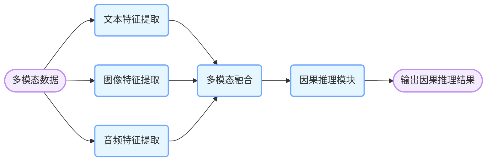

# 提升AI模型在多模态场景理解任务中的因果推理能力

> 关键词：AI模型、多模态场景理解、因果推理能力、多模态融合、深度学习

> 摘要：本文聚焦于提升AI模型在多模态场景理解任务中的因果推理能力。首先介绍了相关背景，包括目的、预期读者等内容。接着阐述了核心概念及联系，分析了核心算法原理并给出具体操作步骤，同时详细讲解了数学模型和公式。通过项目实战展示了代码案例及解读。探讨了实际应用场景，推荐了学习工具和资源。最后总结了未来发展趋势与挑战，还设置了常见问题解答及扩展阅读参考资料，旨在为相关领域的研究和实践提供全面而深入的指导。

## 1. 背景介绍 
### 1.1 目的和范围
在当今的人工智能领域，多模态场景理解任务变得愈发重要。多模态数据（如文本、图像、音频等）包含了丰富的信息，然而现有的AI模型在处理这些多模态数据进行场景理解时，往往缺乏有效的因果推理能力。本文章的目的在于深入探讨如何提升AI模型在多模态场景理解任务中的因果推理能力。我们的研究范围涵盖了从核心概念的剖析、算法原理的讲解，到实际项目的应用以及未来发展趋势的展望等多个方面。

### 1.2 预期读者
本文预期读者包括人工智能领域的研究人员、开发者、相关专业的学生以及对多模态场景理解和因果推理感兴趣的技术爱好者。无论是想要深入研究理论知识，还是希望在实际项目中应用相关技术的读者，都能从本文中获得有价值的信息。

### 1.3 文档结构概述
本文将按照以下结构进行阐述。首先介绍背景知识，包括目的、读者对象和文档结构。接着深入讲解核心概念与联系，包括多模态场景理解和因果推理的原理及架构，并通过文本示意图和Mermaid流程图进行展示。然后详细分析核心算法原理和具体操作步骤，结合Python源代码进行说明。之后介绍数学模型和公式，并举例说明。通过项目实战展示代码实际案例并进行详细解释。探讨实际应用场景，推荐相关的工具和资源。最后总结未来发展趋势与挑战，设置常见问题解答和扩展阅读参考资料。

### 1.4 术语表
#### 1.4.1 核心术语定义
- **多模态场景理解**：指AI模型能够综合处理多种不同模态的数据（如文本、图像、音频等），对特定场景进行全面、准确的理解和分析。
- **因果推理能力**：是指模型能够从数据中识别出因果关系，理解事件之间的因果联系，并基于这种因果关系进行推理和决策的能力。
- **多模态融合**：将不同模态的数据进行整合和处理，以充分利用各模态数据的优势，提高模型的性能。

#### 1.4.2 相关概念解释
- **深度学习**：是一种基于人工神经网络的机器学习方法，通过构建多层神经网络来自动学习数据的特征和模式。在多模态场景理解中，深度学习模型可以用于处理和分析不同模态的数据。
- **注意力机制**：是一种模拟人类注意力分配的机制，在处理多模态数据时，能够自动关注数据中的重要部分，提高模型的性能。

#### 1.4.3 缩略词列表
- **CNN**：Convolutional Neural Network，卷积神经网络，常用于处理图像数据。
- **RNN**：Recurrent Neural Network，循环神经网络，常用于处理序列数据，如文本。
- **Transformer**：一种基于注意力机制的深度学习模型，在自然语言处理等领域取得了很好的效果。

## 2. 核心概念与联系 
### 核心概念原理
#### 多模态场景理解
多模态场景理解的核心在于将不同模态的数据进行整合和分析，以获得对场景的全面理解。例如，在一个智能安防场景中，可能同时有监控摄像头拍摄的视频（图像和视频模态）、传感器采集的环境数据（如温度、湿度等）以及相关的文本描述（如事件报告）。多模态场景理解模型需要将这些不同模态的数据进行融合，提取出有用的信息，从而判断场景中是否发生了异常事件。

#### 因果推理能力
因果推理能力是指模型能够识别出数据中变量之间的因果关系。在多模态场景理解中，因果推理可以帮助模型更好地理解场景中事件的发生原因和影响。例如，在医疗诊断中，结合患者的症状描述（文本模态）、医学影像（图像模态）和检查数据（数值模态），模型可以通过因果推理找出导致患者疾病的原因，从而做出更准确的诊断。

### 架构的文本示意图
多模态场景理解和因果推理的架构可以描述如下：

首先，不同模态的数据（文本、图像、音频等）分别通过各自的特征提取模块进行处理。例如，文本数据可以通过词嵌入和深度学习模型（如Transformer）提取文本特征；图像数据可以通过卷积神经网络（CNN）提取图像特征。

然后，这些不同模态的特征被输入到多模态融合模块中。多模态融合模块可以采用多种方法，如早期融合、晚期融合或混合融合。早期融合是在特征提取之前将不同模态的数据进行融合；晚期融合是在特征提取之后将不同模态的特征进行融合；混合融合则是结合了早期融合和晚期融合的方法。

最后，融合后的特征被输入到因果推理模块中。因果推理模块可以采用因果图模型、结构方程模型等方法，识别出数据中变量之间的因果关系，并进行推理和决策。

### Mermaid流程图


## 3. 核心算法原理 & 具体操作步骤 
### 核心算法原理
为了提升AI模型在多模态场景理解任务中的因果推理能力，我们可以采用基于深度学习的方法，结合多模态融合和因果推理技术。具体来说，我们可以使用Transformer模型进行多模态特征提取和融合，同时使用因果图模型进行因果推理。

#### 多模态特征提取和融合
Transformer模型是一种基于注意力机制的深度学习模型，在自然语言处理和计算机视觉等领域取得了很好的效果。我们可以将不同模态的数据分别输入到Transformer模型中，提取出各自的特征。然后，使用注意力机制将这些不同模态的特征进行融合，得到融合后的特征表示。

#### 因果推理
因果图模型是一种用于表示变量之间因果关系的图模型。我们可以使用因果图模型来识别多模态数据中变量之间的因果关系，并进行推理和决策。具体来说，我们可以使用结构学习算法（如PC算法、GES算法等）来学习因果图的结构，然后使用参数学习算法（如最大似然估计、贝叶斯估计等）来学习因果图的参数。

### 具体操作步骤
#### 步骤1：数据预处理
首先，我们需要对多模态数据进行预处理。对于文本数据，我们可以进行分词、词嵌入等操作；对于图像数据，我们可以进行图像增强、归一化等操作；对于音频数据，我们可以进行特征提取、降噪等操作。

#### 步骤2：多模态特征提取
使用Transformer模型对预处理后的多模态数据进行特征提取。以下是一个使用Python和PyTorch实现的示例代码：

```python
import torch
import torch.nn as nn
from transformers import BertModel

# 定义文本特征提取模型
class TextFeatureExtractor(nn.Module):
    def __init__(self):
        super(TextFeatureExtractor, self).__init__()
        self.bert = BertModel.from_pretrained('bert-base-uncased')

    def forward(self, input_ids, attention_mask):
        outputs = self.bert(input_ids=input_ids, attention_mask=attention_mask)
        pooled_output = outputs.pooler_output
        return pooled_output

# 定义图像特征提取模型
class ImageFeatureExtractor(nn.Module):
    def __init__(self):
        super(ImageFeatureExtractor, self).__init__()
        self.cnn = torchvision.models.resnet18(pretrained=True)
        self.cnn.fc = nn.Identity()

    def forward(self, images):
        features = self.cnn(images)
        return features

# 示例使用
text_feature_extractor = TextFeatureExtractor()
image_feature_extractor = ImageFeatureExtractor()

# 假设我们有文本数据和图像数据
text_input_ids = torch.randint(0, 1000, (1, 128))
text_attention_mask = torch.ones((1, 128))
image_input = torch.randn(1, 3, 224, 224)

text_features = text_feature_extractor(text_input_ids, text_attention_mask)
image_features = image_feature_extractor(image_input)
```

#### 步骤3：多模态特征融合
使用注意力机制将提取的多模态特征进行融合。以下是一个简单的注意力融合示例代码：

```python
class MultiModalFusion(nn.Module):
    def __init__(self, text_dim, image_dim, hidden_dim):
        super(MultiModalFusion, self).__init__()
        self.text_fc = nn.Linear(text_dim, hidden_dim)
        self.image_fc = nn.Linear(image_dim, hidden_dim)
        self.attention = nn.Linear(hidden_dim * 2, 1)
        self.fc = nn.Linear(hidden_dim, hidden_dim)

    def forward(self, text_features, image_features):
        text_proj = self.text_fc(text_features)
        image_proj = self.image_fc(image_features)
        concat_features = torch.cat([text_proj, image_proj], dim=1)
        attention_weights = torch.softmax(self.attention(concat_features), dim=0)
        weighted_text = attention_weights[:, 0].unsqueeze(1) * text_proj
        weighted_image = attention_weights[:, 1].unsqueeze(1) * image_proj
        fused_features = weighted_text + weighted_image
        output = self.fc(fused_features)
        return output

# 示例使用
text_dim = text_features.shape[1]
image_dim = image_features.shape[1]
hidden_dim = 128
fusion_model = MultiModalFusion(text_dim, image_dim, hidden_dim)
fused_features = fusion_model(text_features, image_features)
```

#### 步骤4：因果推理
使用因果图模型进行因果推理。我们可以使用`pgmpy`库来实现因果图模型的学习和推理。以下是一个简单的示例代码：

```python
from pgmpy.models import BayesianNetwork
from pgmpy.estimators import PC

# 假设我们有融合后的特征数据
data = torch.randn(100, hidden_dim)

# 学习因果图的结构
est = PC(data)
model = est.estimate()

# 学习因果图的参数
from pgmpy.estimators import MaximumLikelihoodEstimator
model.fit(data, estimator=MaximumLikelihoodEstimator)

# 进行因果推理
from pgmpy.inference import VariableElimination
infer = VariableElimination(model)
query = infer.query(variables=['target_variable'], evidence={'evidence_variable': 1})
print(query)
```

## 4. 数学模型和公式 & 详细讲解 & 举例说明 
### 多模态特征提取的数学模型
#### 文本特征提取
对于文本数据，我们使用Transformer模型进行特征提取。Transformer模型的核心是多头注意力机制和前馈神经网络。多头注意力机制的计算公式如下：

$$
\text{MultiHead}(Q, K, V) = \text{Concat}(\text{head}_1, \cdots, \text{head}_h)W^O
$$

其中，$\text{head}_i = \text{Attention}(QW_i^Q, KW_i^K, VW_i^V)$，$\text{Attention}(Q, K, V) = \text{softmax}(\frac{QK^T}{\sqrt{d_k}})V$。

$Q$、$K$、$V$分别是查询矩阵、键矩阵和值矩阵，$W_i^Q$、$W_i^K$、$W_i^V$和$W^O$是可学习的权重矩阵，$d_k$是键向量的维度。

#### 图像特征提取
对于图像数据，我们使用卷积神经网络（CNN）进行特征提取。卷积层的计算公式如下：

$$
y_{i,j}^l = \sum_{m=0}^{M-1}\sum_{n=0}^{N-1}x_{i+m,j+n}^{l-1}w_{m,n}^l + b^l
$$

其中，$y_{i,j}^l$是第$l$层卷积层的输出特征图中第$(i,j)$个位置的值，$x_{i+m,j+n}^{l-1}$是第$l-1$层输入特征图中第$(i+m,j+n)$个位置的值，$w_{m,n}^l$是卷积核的权重，$b^l$是偏置。

### 多模态特征融合的数学模型
我们使用注意力机制进行多模态特征融合。注意力机制的计算公式如下：

$$
\text{Attention}(Q, K, V) = \text{softmax}(\frac{QK^T}{\sqrt{d_k}})V
$$

在多模态特征融合中，$Q$、$K$、$V$分别表示不同模态的特征向量。通过计算注意力权重，我们可以将不同模态的特征进行加权融合。

### 因果推理的数学模型
#### 因果图模型
因果图模型可以用有向无环图（DAG）来表示。假设我们有一个变量集合$X = \{X_1, X_2, \cdots, X_n\}$，因果图$G = (V, E)$，其中$V$是节点集合，对应于变量集合$X$，$E$是有向边集合，表示变量之间的因果关系。

#### 结构学习
结构学习的目标是从数据中学习因果图的结构。常用的结构学习算法有PC算法、GES算法等。PC算法的基本思想是通过条件独立性测试来逐步删除不必要的边，从而得到因果图的结构。

#### 参数学习
参数学习的目标是在已知因果图结构的情况下，学习因果图的参数。常用的参数学习算法有最大似然估计、贝叶斯估计等。最大似然估计的计算公式如下：

$$
\hat{\theta} = \arg\max_{\theta} \prod_{i=1}^{N} P(x^{(i)}|\theta)
$$

其中，$\theta$是因果图的参数，$x^{(i)}$是第$i$个样本，$N$是样本数量。

### 举例说明
假设我们有一个多模态数据集，包含文本数据和图像数据。我们使用上述的方法进行多模态特征提取和融合，然后使用因果图模型进行因果推理。

#### 多模态特征提取
对于文本数据，我们使用Bert模型进行特征提取。假设我们有一个文本句子“这是一个测试句子”，经过分词和词嵌入后，输入到Bert模型中，得到文本特征向量。

对于图像数据，我们使用ResNet18模型进行特征提取。假设我们有一张猫的图片，经过图像预处理后，输入到ResNet18模型中，得到图像特征向量。

#### 多模态特征融合
使用注意力机制将文本特征向量和图像特征向量进行融合。通过计算注意力权重，我们可以关注文本和图像中重要的部分，得到融合后的特征向量。

#### 因果推理
假设我们的目标是预测图片中猫的情绪（开心、难过等），我们可以使用因果图模型来分析文本描述和图像特征之间的因果关系。通过学习因果图的结构和参数，我们可以进行因果推理，预测猫的情绪。

## 5. 项目实战：代码实际案例和详细解释说明 
### 5.1  开发环境搭建
#### 安装Python和相关库
首先，确保你已经安装了Python 3.6及以上版本。然后，使用以下命令安装所需的库：

```bash
pip install torch torchvision transformers pgmpy numpy pandas
```

#### 准备数据集
我们可以使用公开的多模态数据集，如MM-IMDB、VQA等。这些数据集包含了文本、图像等多种模态的数据，可以用于多模态场景理解和因果推理任务。

### 5.2  源代码详细实现和代码解读
#### 完整代码示例
```python
import torch
import torch.nn as nn
from transformers import BertModel
import torchvision.models as models
from pgmpy.models import BayesianNetwork
from pgmpy.estimators import PC, MaximumLikelihoodEstimator
from pgmpy.inference import VariableElimination

# 定义文本特征提取模型
class TextFeatureExtractor(nn.Module):
    def __init__(self):
        super(TextFeatureExtractor, self).__init__()
        self.bert = BertModel.from_pretrained('bert-base-uncased')

    def forward(self, input_ids, attention_mask):
        outputs = self.bert(input_ids=input_ids, attention_mask=attention_mask)
        pooled_output = outputs.pooler_output
        return pooled_output

# 定义图像特征提取模型
class ImageFeatureExtractor(nn.Module):
    def __init__(self):
        super(ImageFeatureExtractor, self).__init__()
        self.cnn = models.resnet18(pretrained=True)
        self.cnn.fc = nn.Identity()

    def forward(self, images):
        features = self.cnn(images)
        return features

# 定义多模态融合模型
class MultiModalFusion(nn.Module):
    def __init__(self, text_dim, image_dim, hidden_dim):
        super(MultiModalFusion, self).__init__()
        self.text_fc = nn.Linear(text_dim, hidden_dim)
        self.image_fc = nn.Linear(image_dim, hidden_dim)
        self.attention = nn.Linear(hidden_dim * 2, 1)
        self.fc = nn.Linear(hidden_dim, hidden_dim)

    def forward(self, text_features, image_features):
        text_proj = self.text_fc(text_features)
        image_proj = self.image_fc(image_features)
        concat_features = torch.cat([text_proj, image_proj], dim=1)
        attention_weights = torch.softmax(self.attention(concat_features), dim=0)
        weighted_text = attention_weights[:, 0].unsqueeze(1) * text_proj
        weighted_image = attention_weights[:, 1].unsqueeze(1) * image_proj
        fused_features = weighted_text + weighted_image
        output = self.fc(fused_features)
        return output

# 主函数
def main():
    # 初始化模型
    text_feature_extractor = TextFeatureExtractor()
    image_feature_extractor = ImageFeatureExtractor()

    # 假设我们有文本数据和图像数据
    text_input_ids = torch.randint(0, 1000, (1, 128))
    text_attention_mask = torch.ones((1, 128))
    image_input = torch.randn(1, 3, 224, 224)

    # 提取特征
    text_features = text_feature_extractor(text_input_ids, text_attention_mask)
    image_features = image_feature_extractor(image_input)

    # 多模态融合
    text_dim = text_features.shape[1]
    image_dim = image_features.shape[1]
    hidden_dim = 128
    fusion_model = MultiModalFusion(text_dim, image_dim, hidden_dim)
    fused_features = fusion_model(text_features, image_features)

    # 因果推理
    data = fused_features.detach().numpy()
    est = PC(data)
    model = est.estimate()
    model.fit(data, estimator=MaximumLikelihoodEstimator)
    infer = VariableElimination(model)
    query = infer.query(variables=['target_variable'], evidence={'evidence_variable': 1})
    print(query)

if __name__ == "__main__":
    main()
```

#### 代码解读
- **文本特征提取模型**：`TextFeatureExtractor`类使用Bert模型进行文本特征提取。`forward`方法接受输入的文本ID和注意力掩码，返回文本特征向量。
- **图像特征提取模型**：`ImageFeatureExtractor`类使用ResNet18模型进行图像特征提取。`forward`方法接受输入的图像，返回图像特征向量。
- **多模态融合模型**：`MultiModalFusion`类使用注意力机制将文本特征向量和图像特征向量进行融合。`forward`方法接受文本特征向量和图像特征向量，返回融合后的特征向量。
- **主函数**：`main`函数首先初始化文本特征提取模型、图像特征提取模型和多模态融合模型。然后，生成示例文本数据和图像数据，提取特征并进行融合。最后，使用因果图模型进行因果推理，并输出推理结果。

### 5.3  代码解读与分析
#### 优点
- **模块化设计**：代码采用模块化设计，将文本特征提取、图像特征提取、多模态融合和因果推理等功能封装成不同的类和函数，提高了代码的可维护性和可扩展性。
- **使用预训练模型**：在文本特征提取和图像特征提取中，使用了预训练的Bert模型和ResNet18模型，这些模型在大规模数据集上进行了训练，具有很好的特征提取能力，可以提高模型的性能。
- **注意力机制**：在多模态融合中，使用了注意力机制，可以自动关注文本和图像中重要的部分，提高了多模态特征融合的效果。

#### 缺点
- **计算资源要求高**：使用预训练的Bert模型和ResNet18模型进行特征提取，需要较大的计算资源和内存。
- **因果推理的准确性有待提高**：因果图模型的结构学习和参数学习需要大量的数据，在数据量较小的情况下，因果推理的准确性可能会受到影响。

## 6. 实际应用场景 
### 智能安防
在智能安防场景中，多模态数据包括监控摄像头拍摄的视频、传感器采集的环境数据以及相关的文本描述。通过提升AI模型在多模态场景理解任务中的因果推理能力，模型可以更好地理解场景中事件的发生原因和影响，例如判断是否发生了盗窃、火灾等异常事件，并及时发出警报。

### 医疗诊断
在医疗诊断中，多模态数据包括患者的症状描述、医学影像（如X光、CT等）和检查数据。模型可以通过因果推理找出导致患者疾病的原因，例如判断患者的疾病是由病毒感染、遗传因素还是生活习惯引起的，从而做出更准确的诊断和治疗方案。

### 自动驾驶
在自动驾驶场景中，多模态数据包括摄像头拍摄的图像、雷达和激光雷达采集的点云数据以及车辆的传感器数据。模型可以通过因果推理理解周围环境的变化和车辆的状态，例如判断前方车辆突然刹车的原因，从而做出合理的决策，如减速、避让等。

### 智能客服
在智能客服场景中，多模态数据包括用户的语音提问、文本输入以及历史对话记录。模型可以通过因果推理理解用户的意图和需求，例如判断用户对某个产品不满意的原因，从而提供更准确的解决方案。

## 7. 工具和资源推荐
### 7.1 学习资源推荐
#### 7.1.1 书籍推荐
- 《深度学习》（Deep Learning）：由Ian Goodfellow、Yoshua Bengio和Aaron Courville所著，是深度学习领域的经典教材，涵盖了深度学习的基本概念、算法和应用。
- 《人工智能：一种现代的方法》（Artificial Intelligence: A Modern Approach）：由Stuart Russell和Peter Norvig所著，是人工智能领域的权威教材，介绍了人工智能的各个方面，包括搜索算法、知识表示、机器学习等。
- 《多模态机器学习：基础与应用》（Multimodal Machine Learning: Principles and Applications）：由Shanghang Zhang、Louis-Philippe Morency和Nir A. Oxman所著，专门介绍了多模态机器学习的基本概念、算法和应用。

#### 7.1.2 在线课程
- Coursera上的“深度学习专项课程”（Deep Learning Specialization）：由Andrew Ng教授授课，包括五门课程，涵盖了深度学习的各个方面，如神经网络、卷积神经网络、循环神经网络等。
- edX上的“人工智能基础”（Fundamentals of Artificial Intelligence）：由UC Berkeley教授授课，介绍了人工智能的基本概念、算法和应用。
- Kaggle上的“多模态学习”（Multimodal Learning）：提供了多模态学习的实践项目和教程，帮助学习者提高多模态学习的能力。

#### 7.1.3 技术博客和网站
- Medium上的“Towards Data Science”：是一个专注于数据科学和机器学习的技术博客，提供了大量的技术文章和教程。
- arXiv：是一个预印本服务器，提供了最新的学术论文和研究成果，涵盖了人工智能、机器学习等多个领域。
- OpenAI博客：OpenAI官方博客，提供了OpenAI的最新研究成果和技术进展。

### 7.2 开发工具框架推荐
#### 7.2.1 IDE和编辑器
- PyCharm：是一个专门为Python开发设计的集成开发环境（IDE），提供了代码编辑、调试、版本控制等功能，适合开发Python项目。
- Jupyter Notebook：是一个交互式的开发环境，支持Python、R等多种编程语言，适合进行数据探索、模型训练和可视化等任务。
- Visual Studio Code：是一个轻量级的代码编辑器，支持多种编程语言和插件，适合快速开发和调试代码。

#### 7.2.2 调试和性能分析工具
- PyTorch Profiler：是PyTorch提供的性能分析工具，可以帮助开发者分析模型的性能瓶颈，优化模型的训练和推理速度。
- TensorBoard：是TensorFlow提供的可视化工具，可以帮助开发者可视化模型的训练过程、损失函数、准确率等指标，方便调试和优化模型。
- cProfile：是Python内置的性能分析工具，可以帮助开发者分析Python代码的性能瓶颈，找出耗时较长的函数和代码段。

#### 7.2.3 相关框架和库
- PyTorch：是一个开源的深度学习框架，提供了丰富的深度学习模型和工具，支持GPU加速，适合进行深度学习模型的开发和训练。
- TensorFlow：是另一个开源的深度学习框架，提供了丰富的深度学习模型和工具，支持分布式训练和部署，适合进行大规模深度学习项目的开发。
- pgmpy：是一个用于概率图模型的Python库，提供了因果图模型、贝叶斯网络等模型的学习和推理功能，适合进行因果推理任务。

### 7.3 相关论文著作推荐
#### 7.3.1 经典论文
- “Attention Is All You Need”：提出了Transformer模型，是自然语言处理领域的经典论文，为后续的多模态学习提供了重要的技术基础。
- “Causal Inference in Statistics: A Primer”：介绍了因果推理的基本概念、方法和应用，是因果推理领域的经典著作。
- “Multimodal Deep Learning”：提出了多模态深度学习的基本框架和方法，为多模态学习的研究和应用奠定了基础。

#### 7.3.2 最新研究成果
- “Multimodal Transformer for Unaligned Multimodal Language Sequences”：提出了一种用于处理未对齐多模态语言序列的多模态Transformer模型，提高了多模态语言理解的性能。
- “Causal Discovery from Time Series: Granger Causality and Its Alternatives”：介绍了从时间序列数据中进行因果发现的方法，包括Granger因果关系和其他替代方法。
- “Towards Causal Representation Learning”：探讨了因果表示学习的概念和方法，为提升AI模型的因果推理能力提供了新的思路。

#### 7.3.3 应用案例分析
- “Medical Image Analysis with Deep Learning”：介绍了深度学习在医学图像分析中的应用案例，包括疾病诊断、图像分割等任务。
- “Autonomous Driving: A Survey”：对自动驾驶技术进行了全面的综述，包括传感器技术、感知算法、决策规划等方面的应用案例。
- “Intelligent Customer Service Systems: A Review”：对智能客服系统的发展和应用进行了综述，包括语音识别、自然语言处理、知识图谱等技术的应用案例。

## 8. 总结：未来发展趋势与挑战
### 未来发展趋势
#### 更强大的多模态融合方法
未来，研究人员将不断探索更强大的多模态融合方法，以更好地整合不同模态的数据。例如，结合更多的先验知识和语义信息，提高多模态特征融合的效果。

#### 因果推理与深度学习的深度融合
因果推理与深度学习的深度融合将是未来的一个重要发展方向。通过将因果推理的思想和方法融入到深度学习模型中，可以提高模型的可解释性和泛化能力。

#### 跨领域的多模态场景理解
未来的多模态场景理解任务将不再局限于单一领域，而是会涉及到多个领域的知识和数据。例如，将医疗、教育、金融等领域的多模态数据进行整合，实现更复杂的场景理解和决策。

### 挑战
#### 数据的稀缺性和质量问题
多模态数据的收集和标注是一个具有挑战性的任务，尤其是在一些特定领域，数据的稀缺性和质量问题可能会影响模型的性能。因此，如何有效地收集和标注多模态数据是一个亟待解决的问题。

#### 计算资源的限制
提升AI模型在多模态场景理解任务中的因果推理能力需要大量的计算资源，包括GPU、TPU等。在实际应用中，计算资源的限制可能会影响模型的训练和推理速度。

#### 因果推理的可解释性和可靠性
虽然因果推理可以提高模型的可解释性，但目前的因果推理方法仍然存在一些问题，如因果图的结构学习和参数学习的准确性、因果关系的不确定性等。因此，如何提高因果推理的可解释性和可靠性是一个需要进一步研究的问题。

## 9. 附录：常见问题与解答
### 问题1：多模态数据预处理的步骤有哪些？
答：多模态数据预处理的步骤因数据类型而异。对于文本数据，常见的预处理步骤包括分词、词嵌入、去除停用词等；对于图像数据，常见的预处理步骤包括图像增强、归一化、裁剪等；对于音频数据，常见的预处理步骤包括特征提取、降噪、音频转换等。

### 问题2：如何选择合适的多模态融合方法？
答：选择合适的多模态融合方法需要考虑多个因素，如数据的特点、任务的需求、模型的复杂度等。常见的多模态融合方法包括早期融合、晚期融合和混合融合。早期融合适用于数据维度较低、模态之间相关性较强的情况；晚期融合适用于数据维度较高、模态之间相关性较弱的情况；混合融合则结合了早期融合和晚期融合的优点。

### 问题3：因果图模型的结构学习和参数学习有哪些方法？
答：因果图模型的结构学习方法包括PC算法、GES算法、IC算法等；参数学习方法包括最大似然估计、贝叶斯估计、期望最大化算法等。不同的方法适用于不同的数据和场景，需要根据具体情况进行选择。

### 问题4：如何评估AI模型在多模态场景理解任务中的因果推理能力？
答：评估AI模型在多模态场景理解任务中的因果推理能力可以从多个方面进行，如因果关系的准确性、因果效应的估计、模型的可解释性等。常用的评估指标包括准确率、召回率、F1值、均方误差等。

## 10. 扩展阅读 & 参考资料
### 扩展阅读
- Pearl, J., Glymour, M., & Jewell, N. P. (2016). Causal inference in statistics: A primer. Wiley.
- Goodfellow, I., Bengio, Y., & Courville, A. (2016). Deep learning. MIT press.
- Zhang, S., Morency, L. P., & Oxman, N. A. (2020). Multimodal machine learning: Principles and applications. Synthesis Lectures on Artificial Intelligence and Machine Learning.

### 参考资料
- Vaswani, A., Shazeer, N., Parmar, N., Uszkoreit, J., Jones, L., Gomez, A. N.,... & Polosukhin, I. (2017). Attention is all you need. Advances in neural information processing systems, 5998-6008.
- Petersen, M. L., & van der Laan, M. J. (2014). Causal inference: a mix of algorithms and theory. Statistical science, 29(4), 642-656.
- Baltrušaitis, T., Ahuja, C., & Morency, L. P. (2018). Multimodal machine learning: A survey and taxonomy. IEEE transactions on pattern analysis and machine intelligence, 41(2), 423-443.

作者：AI天才研究院/AI Genius Institute & 禅与计算机程序设计艺术 /Zen And The Art of Computer Programming