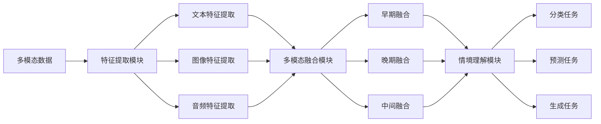

# 提升AI模型在多模态情境理解任务中的性能

> 关键词：AI模型、多模态情境理解、性能提升、多模态融合、特征提取

> 摘要：本文聚焦于如何提升AI模型在多模态情境理解任务中的性能。首先介绍了该研究的背景，包括目的、预期读者、文档结构和相关术语。接着阐述了多模态情境理解的核心概念与联系，给出了原理和架构的文本示意图及Mermaid流程图。详细讲解了核心算法原理和具体操作步骤，并使用Python源代码进行说明。深入分析了数学模型和公式，辅以举例。通过项目实战展示了代码实际案例并进行详细解释。探讨了实际应用场景，推荐了学习、开发工具和相关论文著作。最后总结了未来发展趋势与挑战，提供了常见问题解答和扩展阅读参考资料。

## 1. 背景介绍 
### 1.1 目的和范围
在当今数字化时代，信息呈现出多样化和多模态的特点，包括文本、图像、音频、视频等。多模态情境理解任务旨在让AI模型能够综合处理这些不同模态的信息，从而更准确地理解复杂的现实情境。本文章的目的是深入探讨提升AI模型在多模态情境理解任务中性能的方法和策略，范围涵盖核心概念、算法原理、数学模型、项目实战、应用场景以及相关工具资源等方面。

### 1.2 预期读者
本文预期读者包括人工智能领域的研究人员、开发者、数据科学家、学生以及对多模态情境理解感兴趣的技术爱好者。他们可能希望了解多模态情境理解的基本原理、学习如何提升AI模型在该任务中的性能，或者在实际项目中应用相关技术。

### 1.3 文档结构概述
本文将按照以下结构进行阐述：首先介绍核心概念与联系，帮助读者建立对多模态情境理解的基本认识；接着详细讲解核心算法原理和具体操作步骤，并给出Python源代码示例；然后分析数学模型和公式，通过举例加深理解；之后进行项目实战，展示代码实际案例并进行详细解释；探讨实际应用场景；推荐学习、开发工具和相关论文著作；最后总结未来发展趋势与挑战，提供常见问题解答和扩展阅读参考资料。

### 1.4 术语表
#### 1.4.1 核心术语定义
- **多模态**：指包含多种不同信息形式，如文本、图像、音频、视频等的信息集合。
- **多模态情境理解**：AI模型对多模态信息进行综合分析和处理，以理解现实情境的任务。
- **特征提取**：从原始数据中提取出能够代表数据本质特征的过程。
- **多模态融合**：将不同模态的特征进行整合，以获得更全面和准确的信息表示。

#### 1.4.2 相关概念解释
- **模态互补性**：不同模态的信息具有各自的优势和局限性，通过融合可以相互补充，提高情境理解的准确性。
- **上下文信息**：在多模态情境中，某一信息所处的前后环境和相关信息，有助于更准确地理解该信息的含义。

#### 1.4.3 缩略词列表
- **CNN**：卷积神经网络（Convolutional Neural Network）
- **RNN**：循环神经网络（Recurrent Neural Network）
- **LSTM**：长短期记忆网络（Long Short-Term Memory）
- **Transformer**：一种基于注意力机制的深度学习模型架构

## 2. 核心概念与联系 

### 核心概念原理
多模态情境理解的核心在于对不同模态信息的有效融合和处理。首先，需要对每种模态的数据进行特征提取，将原始数据转换为具有代表性的特征向量。例如，对于图像数据，可以使用卷积神经网络（CNN）提取图像的视觉特征；对于文本数据，可以使用预训练的语言模型（如BERT）提取文本的语义特征。

然后，将不同模态的特征进行融合。融合的方式有多种，如早期融合、晚期融合和中间融合。早期融合是在特征提取之前将不同模态的数据进行合并，然后一起进行特征提取；晚期融合是先分别对不同模态的数据进行特征提取，然后在决策层将这些特征进行融合；中间融合则是在特征提取过程中的某个中间阶段进行融合。

最后，使用融合后的特征进行情境理解任务，如分类、预测、生成等。

### 架构的文本示意图
```plaintext
多模态数据（文本、图像、音频等）
|
|-- 特征提取模块
|   |-- 文本特征提取（如BERT）
|   |-- 图像特征提取（如CNN）
|   |-- 音频特征提取（如MFCC）
|
|-- 多模态融合模块
|   |-- 早期融合
|   |-- 晚期融合
|   |-- 中间融合
|
|-- 情境理解模块
|   |-- 分类任务
|   |-- 预测任务
|   |-- 生成任务
```

### Mermaid流程图


## 3. 核心算法原理 & 具体操作步骤 

### 核心算法原理
在多模态情境理解中，常用的算法包括卷积神经网络（CNN）、循环神经网络（RNN）及其变体（如LSTM）、Transformer等。这些算法在特征提取和多模态融合中发挥着重要作用。

以CNN为例，它通过卷积层、池化层和全连接层对图像数据进行特征提取。卷积层通过卷积核在图像上滑动，提取图像的局部特征；池化层用于减少特征图的尺寸，降低计算复杂度；全连接层将提取的特征进行整合，输出最终的特征向量。

对于文本数据，Transformer模型在预训练语言模型中得到了广泛应用。Transformer模型通过多头注意力机制，能够捕捉文本中的长距离依赖关系，从而提取出更准确的语义特征。

### 具体操作步骤
1. **数据预处理**：对不同模态的数据进行清洗、归一化等预处理操作，以提高数据的质量和可用性。
2. **特征提取**：使用合适的模型对每种模态的数据进行特征提取。例如，使用ResNet对图像数据进行特征提取，使用BERT对文本数据进行特征提取。
3. **多模态融合**：选择合适的融合方式将不同模态的特征进行融合。例如，使用拼接的方式将文本特征和图像特征进行融合。
4. **模型训练**：使用融合后的特征对情境理解模型进行训练，优化模型的参数。
5. **模型评估**：使用测试数据集对训练好的模型进行评估，计算模型的性能指标，如准确率、召回率等。

### Python源代码示例
```python
import torch
import torch.nn as nn
import torchvision.models as models
from transformers import BertModel

# 图像特征提取模型
class ImageFeatureExtractor(nn.Module):
    def __init__(self):
        super(ImageFeatureExtractor, self).__init__()
        self.resnet = models.resnet18(pretrained=True)
        self.resnet.fc = nn.Identity()  # 去掉最后的全连接层

    def forward(self, images):
        features = self.resnet(images)
        return features

# 文本特征提取模型
class TextFeatureExtractor(nn.Module):
    def __init__(self):
        super(TextFeatureExtractor, self).__init__()
        self.bert = BertModel.from_pretrained('bert-base-uncased')

    def forward(self, input_ids, attention_mask):
        outputs = self.bert(input_ids=input_ids, attention_mask=attention_mask)
        pooled_output = outputs.pooler_output
        return pooled_output

# 多模态融合模型
class MultiModalFusionModel(nn.Module):
    def __init__(self, image_feature_dim, text_feature_dim, hidden_dim, num_classes):
        super(MultiModalFusionModel, self).__init__()
        self.image_fc = nn.Linear(image_feature_dim, hidden_dim)
        self.text_fc = nn.Linear(text_feature_dim, hidden_dim)
        self.fc = nn.Linear(hidden_dim * 2, num_classes)

    def forward(self, image_features, text_features):
        image_features = self.image_fc(image_features)
        text_features = self.text_fc(text_features)
        fused_features = torch.cat((image_features, text_features), dim=1)
        logits = self.fc(fused_features)
        return logits

# 初始化模型
image_extractor = ImageFeatureExtractor()
text_extractor = TextFeatureExtractor()
fusion_model = MultiModalFusionModel(image_feature_dim=512, text_feature_dim=768, hidden_dim=256, num_classes=10)

# 示例数据
images = torch.randn(4, 3, 224, 224)
input_ids = torch.randint(0, 1000, (4, 128))
attention_mask = torch.ones((4, 128))

# 特征提取
image_features = image_extractor(images)
text_features = text_extractor(input_ids, attention_mask)

# 多模态融合
logits = fusion_model(image_features, text_features)
print(logits.shape)
```

## 4. 数学模型和公式 & 详细讲解 & 举例说明 

### 卷积神经网络（CNN）
#### 卷积层
卷积层的核心操作是卷积运算。设输入图像为 $X \in \mathbb{R}^{H \times W \times C}$，其中 $H$ 是图像的高度，$W$ 是图像的宽度，$C$ 是图像的通道数。卷积核为 $K \in \mathbb{R}^{h \times w \times C \times F}$，其中 $h$ 和 $w$ 是卷积核的高度和宽度，$F$ 是卷积核的数量。卷积层的输出特征图为 $Y \in \mathbb{R}^{H' \times W' \times F}$，其中 $H'$ 和 $W'$ 是输出特征图的高度和宽度。

卷积运算的公式为：
$$Y_{i,j,k} = \sum_{m=0}^{h-1} \sum_{n=0}^{w-1} \sum_{c=0}^{C-1} X_{i+m,j+n,c} \cdot K_{m,n,c,k} + b_k$$
其中，$i = 0, 1, \cdots, H' - 1$，$j = 0, 1, \cdots, W' - 1$，$k = 0, 1, \cdots, F - 1$，$b_k$ 是偏置项。

#### 池化层
池化层用于减少特征图的尺寸，常用的池化方式有最大池化和平均池化。以最大池化为例，设输入特征图为 $X \in \mathbb{R}^{H \times W \times C}$，池化窗口大小为 $p \times p$，步长为 $s$。输出特征图为 $Y \in \mathbb{R}^{H' \times W' \times C}$，其中 $H' = \lfloor \frac{H - p}{s} \rfloor + 1$，$W' = \lfloor \frac{W - p}{s} \rfloor + 1$。

最大池化的公式为：
$$Y_{i,j,k} = \max_{m=0}^{p-1} \max_{n=0}^{p-1} X_{i \cdot s + m, j \cdot s + n, k}$$

### Transformer模型
#### 多头注意力机制
多头注意力机制是Transformer模型的核心组件之一。设输入的查询向量 $Q \in \mathbb{R}^{n \times d_k}$，键向量 $K \in \mathbb{R}^{m \times d_k}$，值向量 $V \in \mathbb{R}^{m \times d_v}$，其中 $n$ 是查询的数量，$m$ 是键和值的数量，$d_k$ 和 $d_v$ 分别是键和值的维度。

注意力分数的计算公式为：
$$\text{Attention}(Q, K, V) = \text{softmax}(\frac{QK^T}{\sqrt{d_k}})V$$

多头注意力机制将输入的查询、键和值分别投影到多个低维子空间中，然后在每个子空间中计算注意力分数，最后将这些分数拼接起来并进行线性变换。

设头的数量为 $h$，每个头的维度为 $d_{k/h}$ 和 $d_{v/h}$。多头注意力的计算公式为：
$$\text{MultiHead}(Q, K, V) = \text{Concat}(\text{head}_1, \cdots, \text{head}_h)W^O$$
其中，$\text{head}_i = \text{Attention}(QW_i^Q, KW_i^K, VW_i^V)$，$W_i^Q \in \mathbb{R}^{d_k \times d_{k/h}}$，$W_i^K \in \mathbb{R}^{d_k \times d_{k/h}}$，$W_i^V \in \mathbb{R}^{d_v \times d_{v/h}}$，$W^O \in \mathbb{R}^{h \cdot d_{v/h} \times d_v}$。

### 举例说明
假设我们有一张 $224 \times 224$ 的彩色图像（$C = 3$），使用一个 $3 \times 3$ 的卷积核（$h = w = 3$）进行卷积操作，步长为 1，填充为 1。则输出特征图的高度和宽度不变，仍然是 $224 \times 224$。如果使用 64 个卷积核（$F = 64$），则输出特征图的维度为 $224 \times 224 \times 64$。

对于Transformer模型，假设我们有一个长度为 10 的输入序列，每个词的嵌入维度为 512（$d_k = d_v = 512$），头的数量为 8（$h = 8$），则每个头的维度为 $d_{k/h} = d_{v/h} = 64$。

## 5. 项目实战：代码实际案例和详细解释说明 

### 5.1  开发环境搭建
#### 操作系统
推荐使用Ubuntu 18.04或更高版本，或者Windows 10。

#### Python环境
使用Python 3.7或更高版本，可以通过Anaconda来管理Python环境。

#### 安装依赖库
```bash
pip install torch torchvision transformers numpy pandas matplotlib
```

### 5.2  源代码详细实现和代码解读
```python
import torch
import torch.nn as nn
import torch.optim as optim
from torch.utils.data import Dataset, DataLoader
import torchvision.models as models
from transformers import BertTokenizer, BertModel
import pandas as pd
import numpy as np
from PIL import Image
import os

# 自定义数据集类
class MultiModalDataset(Dataset):
    def __init__(self, data_csv, image_dir, tokenizer):
        self.data = pd.read_csv(data_csv)
        self.image_dir = image_dir
        self.tokenizer = tokenizer

    def __len__(self):
        return len(self.data)

    def __getitem__(self, idx):
        row = self.data.iloc[idx]
        image_path = os.path.join(self.image_dir, row['image_file'])
        image = Image.open(image_path).convert('RGB')
        image = torchvision.transforms.ToTensor()(image)
        image = torchvision.transforms.Resize((224, 224))(image)

        text = row['text']
        encoding = self.tokenizer(text, return_tensors='pt', padding='max_length', truncation=True, max_length=128)
        input_ids = encoding['input_ids'].squeeze()
        attention_mask = encoding['attention_mask'].squeeze()

        label = torch.tensor(row['label'], dtype=torch.long)

        return image, input_ids, attention_mask, label

# 图像特征提取模型
class ImageFeatureExtractor(nn.Module):
    def __init__(self):
        super(ImageFeatureExtractor, self).__init__()
        self.resnet = models.resnet18(pretrained=True)
        self.resnet.fc = nn.Identity()  # 去掉最后的全连接层

    def forward(self, images):
        features = self.resnet(images)
        return features

# 文本特征提取模型
class TextFeatureExtractor(nn.Module):
    def __init__(self):
        super(TextFeatureExtractor, self).__init__()
        self.bert = BertModel.from_pretrained('bert-base-uncased')

    def forward(self, input_ids, attention_mask):
        outputs = self.bert(input_ids=input_ids, attention_mask=attention_mask)
        pooled_output = outputs.pooler_output
        return pooled_output

# 多模态融合模型
class MultiModalFusionModel(nn.Module):
    def __init__(self, image_feature_dim, text_feature_dim, hidden_dim, num_classes):
        super(MultiModalFusionModel, self).__init__()
        self.image_fc = nn.Linear(image_feature_dim, hidden_dim)
        self.text_fc = nn.Linear(text_feature_dim, hidden_dim)
        self.fc = nn.Linear(hidden_dim * 2, num_classes)

    def forward(self, image_features, text_features):
        image_features = self.image_fc(image_features)
        text_features = self.text_fc(text_features)
        fused_features = torch.cat((image_features, text_features), dim=1)
        logits = self.fc(fused_features)
        return logits

# 训练模型
def train_model(model, dataloader, criterion, optimizer, device, num_epochs=10):
    model.train()
    for epoch in range(num_epochs):
        running_loss = 0.0
        for images, input_ids, attention_mask, labels in dataloader:
            images = images.to(device)
            input_ids = input_ids.to(device)
            attention_mask = attention_mask.to(device)
            labels = labels.to(device)

            optimizer.zero_grad()

            image_extractor = ImageFeatureExtractor().to(device)
            text_extractor = TextFeatureExtractor().to(device)

            image_features = image_extractor(images)
            text_features = text_extractor(input_ids, attention_mask)

            logits = model(image_features, text_features)
            loss = criterion(logits, labels)
            loss.backward()
            optimizer.step()

            running_loss += loss.item()

        print(f'Epoch {epoch + 1}/{num_epochs}, Loss: {running_loss / len(dataloader)}')

# 主函数
if __name__ == '__main__':
    device = torch.device('cuda' if torch.cuda.is_available() else 'cpu')

    data_csv = 'data.csv'
    image_dir = 'images'
    tokenizer = BertTokenizer.from_pretrained('bert-base-uncased')

    dataset = MultiModalDataset(data_csv, image_dir, tokenizer)
    dataloader = DataLoader(dataset, batch_size=4, shuffle=True)

    image_feature_dim = 512
    text_feature_dim = 768
    hidden_dim = 256
    num_classes = 10

    model = MultiModalFusionModel(image_feature_dim, text_feature_dim, hidden_dim, num_classes).to(device)
    criterion = nn.CrossEntropyLoss()
    optimizer = optim.Adam(model.parameters(), lr=0.001)

    train_model(model, dataloader, criterion, optimizer, device)
```

### 5.3  代码解读与分析
- **MultiModalDataset类**：自定义数据集类，用于加载多模态数据，包括图像、文本和标签。在`__getitem__`方法中，对图像进行预处理，对文本进行分词和编码。
- **ImageFeatureExtractor类**：使用预训练的ResNet18模型提取图像特征，去掉最后的全连接层，只保留特征提取部分。
- **TextFeatureExtractor类**：使用预训练的BERT模型提取文本特征，通过`pooler_output`获取文本的整体表示。
- **MultiModalFusionModel类**：多模态融合模型，将图像特征和文本特征分别通过全连接层进行变换，然后拼接起来，最后通过一个全连接层输出分类结果。
- **train_model函数**：训练模型的函数，在每个epoch中，对每个批次的数据进行前向传播、计算损失、反向传播和参数更新。

## 6. 实际应用场景 
### 智能客服
在智能客服系统中，多模态情境理解可以帮助客服机器人更好地理解用户的问题。用户可以通过文本、语音、图片等多种方式提出问题，客服机器人可以综合这些信息，提供更准确的回答。例如，用户在描述问题时附上一张故障设备的图片，客服机器人可以结合图片和文本信息，快速定位问题并提供解决方案。

### 自动驾驶
在自动驾驶领域，多模态情境理解可以提高车辆对周围环境的感知能力。车辆可以通过摄像头、雷达、激光雷达等多种传感器获取图像、点云等多模态数据，综合分析这些数据可以更准确地识别道路、交通标志、行人等，从而做出更安全的驾驶决策。

### 医疗诊断
在医疗诊断中，多模态情境理解可以帮助医生更全面地了解患者的病情。医生可以结合患者的病历文本、X光片、CT图像等多模态信息，进行更准确的诊断。例如，通过分析病历中的症状描述和X光片的图像特征，判断患者是否患有某种疾病。

### 智能家居
在智能家居系统中，多模态情境理解可以实现更智能的交互。用户可以通过语音、手势等多种方式控制家电设备，智能家居系统可以综合这些信息，理解用户的意图并执行相应的操作。例如，用户说“打开客厅的灯”，同时用手势指向客厅，智能家居系统可以更准确地执行开灯操作。

## 7. 工具和资源推荐
### 7.1 学习资源推荐
#### 7.1.1 书籍推荐
- 《深度学习》（Deep Learning）：由Ian Goodfellow、Yoshua Bengio和Aaron Courville撰写，是深度学习领域的经典教材，涵盖了深度学习的基本原理、算法和应用。
- 《动手学深度学习》（Dive into Deep Learning）：由李沐等人撰写，提供了丰富的代码示例和实践项目，适合初学者快速上手深度学习。
- 《多模态机器学习：原理与应用》（Multimodal Machine Learning: Principles and Applications）：专门介绍多模态机器学习的书籍，深入探讨了多模态数据处理、融合和应用等方面的内容。

#### 7.1.2 在线课程
- Coursera上的“深度学习专项课程”（Deep Learning Specialization）：由Andrew Ng教授授课，系统地介绍了深度学习的各个方面，包括卷积神经网络、循环神经网络、Transformer等。
- edX上的“人工智能基础”（Introduction to Artificial Intelligence）：全面介绍了人工智能的基本概念、算法和应用，适合初学者入门。
- B站的“李沐讲深度学习”：李沐老师以通俗易懂的方式讲解深度学习的知识，同时提供了大量的代码示例和实践项目。

#### 7.1.3 技术博客和网站
- arXiv：是一个预印本服务器，提供了大量的最新研究论文，包括多模态机器学习领域的研究成果。
- Medium：有许多技术博主分享深度学习和多模态机器学习的经验和技巧。
- 机器之心：专注于人工智能领域的资讯和技术文章，提供了丰富的行业动态和技术解读。

### 7.2 开发工具框架推荐
#### 7.2.1 IDE和编辑器
- PyCharm：是一款专业的Python集成开发环境，提供了丰富的代码编辑、调试和项目管理功能。
- Jupyter Notebook：是一个交互式的开发环境，适合进行数据分析、模型训练和可视化等工作。
- Visual Studio Code：是一款轻量级的代码编辑器，支持多种编程语言和插件，可用于Python开发。

#### 7.2.2 调试和性能分析工具
- PyTorch Profiler：是PyTorch提供的性能分析工具，可以帮助开发者分析模型的性能瓶颈，优化代码。
- TensorBoard：是TensorFlow提供的可视化工具，也可以用于PyTorch项目，用于可视化模型的训练过程、损失曲线等。
- VS Code的调试器：可以方便地对Python代码进行调试，设置断点、查看变量值等。

#### 7.2.3 相关框架和库
- PyTorch：是一个开源的深度学习框架，提供了丰富的神经网络模块和工具，支持GPU加速。
- TensorFlow：是另一个广泛使用的深度学习框架，具有强大的分布式训练和部署能力。
- Hugging Face Transformers：提供了大量的预训练语言模型，如BERT、GPT等，方便开发者进行文本处理任务。

### 7.3 相关论文著作推荐
#### 7.3.1 经典论文
- “Attention Is All You Need”：提出了Transformer模型，为自然语言处理领域带来了革命性的变化。
- “Convolutional Neural Networks for Visual Recognition”：介绍了卷积神经网络在图像识别中的应用，是CNN领域的经典论文。
- “Multimodal Deep Learning”：首次提出了多模态深度学习的概念，并探讨了多模态数据融合的方法。

#### 7.3.2 最新研究成果
- 关注arXiv上的最新论文，特别是关于多模态机器学习、多模态情境理解等方面的研究。
- 参加顶级学术会议，如NeurIPS、ICML、CVPR等，了解最新的研究动态。

#### 7.3.3 应用案例分析
- 查看工业界的技术博客和报告，了解多模态情境理解在实际应用中的案例和经验。
- 研究开源项目和竞赛中的优秀解决方案，学习如何将多模态技术应用到实际问题中。

## 8. 总结：未来发展趋势与挑战
### 未来发展趋势
- **更强大的预训练模型**：随着计算资源的不断增加和算法的不断改进，未来将会出现更强大的多模态预训练模型，能够在更多的任务中取得更好的性能。
- **跨模态迁移学习**：通过跨模态迁移学习，可以将在一个模态上学习到的知识迁移到另一个模态上，提高模型的泛化能力和学习效率。
- **多模态生成任务**：多模态生成任务，如生成图像描述、生成视频脚本等，将成为未来的研究热点，为内容创作和交互提供更多的可能性。
- **与其他领域的融合**：多模态情境理解将与计算机视觉、自然语言处理、语音识别等领域进一步融合，推动人工智能技术在更多领域的应用。

### 挑战
- **数据获取和标注**：多模态数据的获取和标注是一个挑战，需要大量的人力和物力。同时，不同模态数据之间的对齐和同步也是一个难题。
- **多模态融合方法**：目前的多模态融合方法还存在一些局限性，如信息丢失、融合效果不佳等。需要进一步研究更有效的多模态融合方法。
- **计算资源需求**：多模态模型通常需要大量的计算资源进行训练和推理，这对硬件设备和计算成本提出了很高的要求。
- **可解释性**：多模态模型的可解释性是一个重要的问题，特别是在一些关键领域，如医疗诊断、自动驾驶等。需要研究如何提高多模态模型的可解释性。

## 9. 附录：常见问题与解答
### 问题1：多模态数据预处理有哪些注意事项？
答：多模态数据预处理需要根据不同模态的数据特点进行处理。对于图像数据，通常需要进行归一化、缩放、裁剪等操作；对于文本数据，需要进行分词、编码、填充等操作；对于音频数据，需要进行特征提取、降噪等操作。同时，要注意不同模态数据之间的对齐和同步。

### 问题2：如何选择合适的多模态融合方式？
答：选择合适的多模态融合方式需要考虑任务的特点、数据的特点和模型的复杂度等因素。早期融合适用于数据量较小、模态之间相关性较强的情况；晚期融合适用于数据量较大、模态之间相关性较弱的情况；中间融合则结合了早期融合和晚期融合的优点。

### 问题3：多模态模型训练过程中出现过拟合怎么办？
答：可以采取以下措施来解决过拟合问题：增加训练数据量、使用正则化方法（如L1、L2正则化）、使用Dropout层、调整模型的复杂度等。

### 问题4：如何评估多模态模型的性能？
答：可以使用多种指标来评估多模态模型的性能，如准确率、召回率、F1值、均方误差等。具体选择哪些指标需要根据任务的类型和需求来确定。

## 10. 扩展阅读 & 参考资料
### 扩展阅读
- 《人工智能：一种现代的方法》（Artificial Intelligence: A Modern Approach）：全面介绍了人工智能的各个方面，包括搜索算法、机器学习、自然语言处理等。
- 《计算机视觉：算法与应用》（Computer Vision: Algorithms and Applications）：详细介绍了计算机视觉的基本算法和应用，如特征提取、目标检测、图像分割等。
- 《自然语言处理入门》（Natural Language Processing with Python）：通过Python代码示例介绍了自然语言处理的基本方法和技术，如分词、词性标注、命名实体识别等。

### 参考资料
- 相关学术论文和研究报告，如在IEEE、ACM等数据库中搜索多模态机器学习、多模态情境理解等相关主题的论文。
- 开源项目和代码库，如GitHub上的多模态机器学习相关项目。
- 官方文档和教程，如PyTorch、TensorFlow、Hugging Face Transformers等框架的官方文档。

作者：AI天才研究院/AI Genius Institute & 禅与计算机程序设计艺术 /Zen And The Art of Computer Programming