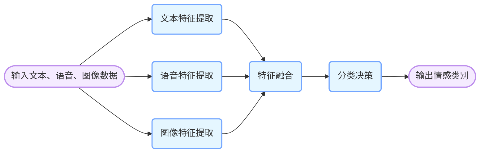

# 提升AI模型在多模态情感计算任务中的表现

> 关键词：AI模型、多模态情感计算、特征融合、深度学习、情感分析

> 摘要：本文围绕提升AI模型在多模态情感计算任务中的表现展开。首先介绍了多模态情感计算的背景，包括目的、预期读者等内容。接着阐述了核心概念及联系，详细讲解了相关算法原理和具体操作步骤，并给出了数学模型和公式。通过项目实战展示了代码的实现和解读，分析了实际应用场景。同时推荐了学习、开发所需的工具和资源，最后总结了未来发展趋势与挑战，解答了常见问题并提供了扩展阅读和参考资料，旨在为研究者和开发者在多模态情感计算领域提供全面的指导和参考。

## 1. 背景介绍 
### 1.1 目的和范围
多模态情感计算是人工智能领域中一个极具挑战性和应用前景的研究方向。其目的在于让计算机能够准确理解和分析人类通过多种模态（如文本、语音、图像等）表达的情感信息。本文章的范围聚焦于如何提升AI模型在多模态情感计算任务中的表现，涵盖了从核心概念的理解、算法原理的分析、数学模型的构建，到实际项目的开发和应用场景的探讨等多个方面。

### 1.2 预期读者
本文的预期读者包括人工智能领域的研究者、开发者、学生以及对多模态情感计算感兴趣的技术爱好者。无论是希望深入研究该领域理论的学术人员，还是想要将相关技术应用到实际项目中的开发者，都能从本文中获得有价值的信息。

### 1.3 文档结构概述
本文将按照以下结构展开：首先介绍多模态情感计算的背景知识，包括相关术语和概念；接着阐述核心概念及其联系，通过文本示意图和Mermaid流程图进行直观展示；然后详细讲解核心算法原理和具体操作步骤，并使用Python源代码进行说明；随后给出数学模型和公式，并进行详细讲解和举例；通过项目实战展示代码的实现和解读；分析多模态情感计算的实际应用场景；推荐学习和开发所需的工具和资源；总结未来发展趋势与挑战；解答常见问题并提供扩展阅读和参考资料。

### 1.4 术语表
#### 1.4.1 核心术语定义
- **多模态情感计算**：利用多种模态（如文本、语音、图像等）的数据来分析和理解人类情感状态的技术。
- **特征融合**：将不同模态的数据特征进行整合，以获取更全面、更具代表性的信息。
- **深度学习模型**：基于神经网络的机器学习模型，具有强大的特征提取和模式识别能力。
- **情感分析**：对文本、语音等数据中表达的情感倾向进行分类和判断。

#### 1.4.2 相关概念解释
- **模态**：指信息的表现形式，如文本、语音、图像等。不同模态的数据包含了不同类型的信息，对于情感分析具有互补性。
- **特征提取**：从原始数据中提取出能够代表数据本质特征的信息，以便后续的分析和处理。
- **模型评估指标**：用于衡量AI模型在多模态情感计算任务中性能的指标，如准确率、召回率、F1值等。

#### 1.4.3 缩略词列表
- **CNN**：Convolutional Neural Network，卷积神经网络
- **RNN**：Recurrent Neural Network，循环神经网络
- **LSTM**：Long Short-Term Memory，长短期记忆网络
- **GRU**：Gated Recurrent Unit，门控循环单元

## 2. 核心概念与联系 

### 核心概念原理
多模态情感计算的核心在于融合多种模态的数据来更准确地理解人类情感。不同模态的数据具有不同的特点和优势，例如文本数据可以提供明确的语义信息，语音数据可以反映语调、语速等情感线索，图像数据可以展示面部表情等情感特征。通过将这些不同模态的数据进行特征提取和融合，可以获得更全面、更丰富的情感信息。

### 架构的文本示意图
```plaintext
多模态情感计算系统架构

输入层：
|-- 文本数据
|-- 语音数据
|-- 图像数据

特征提取层：
|-- 文本特征提取模块（如词嵌入、CNN、RNN等）
|-- 语音特征提取模块（如MFCC、CNN等）
|-- 图像特征提取模块（如卷积神经网络）

特征融合层：
|-- 早期融合：在特征提取前进行数据拼接
|-- 中期融合：在特征提取过程中进行特征组合
|-- 晚期融合：在模型决策阶段进行结果融合

分类决策层：
|-- 全连接层
|-- 分类器（如Softmax、SVM等）

输出层：
|-- 情感类别（如积极、消极、中性等）
```

### Mermaid流程图


## 3. 核心算法原理 & 具体操作步骤 

### 特征提取算法
#### 文本特征提取
使用词嵌入和循环神经网络（RNN）进行文本特征提取。词嵌入将文本中的每个单词转换为低维向量，RNN可以处理序列数据，捕捉文本中的上下文信息。

```python
import torch
import torch.nn as nn
import torch.nn.functional as F

# 定义文本特征提取模型
class TextFeatureExtractor(nn.Module):
    def __init__(self, vocab_size, embedding_dim, hidden_dim):
        super(TextFeatureExtractor, self).__init__()
        self.embedding = nn.Embedding(vocab_size, embedding_dim)
        self.rnn = nn.GRU(embedding_dim, hidden_dim, batch_first=True)

    def forward(self, x):
        embedded = self.embedding(x)
        output, hidden = self.rnn(embedded)
        return hidden.squeeze(0)

# 示例使用
vocab_size = 1000
embedding_dim = 100
hidden_dim = 128
text_model = TextFeatureExtractor(vocab_size, embedding_dim, hidden_dim)
input_text = torch.randint(0, vocab_size, (1, 10))
text_features = text_model(input_text)
print(text_features.shape)
```

#### 语音特征提取
使用梅尔频率倒谱系数（MFCC）和卷积神经网络（CNN）进行语音特征提取。MFCC可以将语音信号转换为特征向量，CNN可以自动提取语音特征。

```python
import librosa
import torch
import torch.nn as nn

# 提取MFCC特征
def extract_mfcc(audio_path):
    audio, sr = librosa.load(audio_path)
    mfccs = librosa.feature.mfcc(y=audio, sr=sr, n_mfcc=13)
    return mfccs

# 定义语音特征提取模型
class AudioFeatureExtractor(nn.Module):
    def __init__(self, in_channels, out_channels):
        super(AudioFeatureExtractor, self).__init__()
        self.conv1 = nn.Conv2d(in_channels, out_channels, kernel_size=3, padding=1)
        self.pool = nn.MaxPool2d(2, 2)

    def forward(self, x):
        x = self.pool(F.relu(self.conv1(x)))
        return x

# 示例使用
audio_path = 'example.wav'
mfccs = extract_mfcc(audio_path)
mfccs = torch.tensor(mfccs).unsqueeze(0).unsqueeze(0)
audio_model = AudioFeatureExtractor(1, 16)
audio_features = audio_model(mfccs)
print(audio_features.shape)
```

#### 图像特征提取
使用预训练的卷积神经网络（如ResNet）进行图像特征提取。预训练的模型在大规模图像数据集上进行了训练，具有强大的特征提取能力。

```python
import torch
import torchvision.models as models

# 加载预训练的ResNet模型
resnet = models.resnet18(pretrained=True)
# 去掉最后一层分类器
feature_extractor = nn.Sequential(*list(resnet.children())[:-1])

# 示例使用
input_image = torch.randn(1, 3, 224, 224)
image_features = feature_extractor(input_image)
image_features = image_features.view(image_features.size(0), -1)
print(image_features.shape)
```

### 特征融合方法
#### 早期融合
早期融合是在特征提取前将不同模态的数据进行拼接。例如，将文本的词向量、语音的MFCC特征和图像的像素值进行拼接，然后输入到一个统一的模型中进行处理。

```python
# 假设已经提取了文本、语音和图像特征
text_features = torch.randn(1, 128)
audio_features = torch.randn(1, 64)
image_features = torch.randn(1, 512)

# 早期融合
early_fused_features = torch.cat((text_features, audio_features, image_features), dim=1)
print(early_fused_features.shape)
```

#### 中期融合
中期融合是在特征提取过程中进行特征组合。例如，将文本、语音和图像的特征分别通过不同的神经网络进行处理，然后在中间层将这些特征进行拼接或加权求和。

```python
# 定义中期融合模型
class MidFusionModel(nn.Module):
    def __init__(self, text_dim, audio_dim, image_dim, hidden_dim):
        super(MidFusionModel, self).__init__()
        self.fc_text = nn.Linear(text_dim, hidden_dim)
        self.fc_audio = nn.Linear(audio_dim, hidden_dim)
        self.fc_image = nn.Linear(image_dim, hidden_dim)

    def forward(self, text_features, audio_features, image_features):
        text_out = F.relu(self.fc_text(text_features))
        audio_out = F.relu(self.fc_audio(audio_features))
        image_out = F.relu(self.fc_image(image_features))
        mid_fused_features = text_out + audio_out + image_out
        return mid_fused_features

# 示例使用
text_dim = 128
audio_dim = 64
image_dim = 512
hidden_dim = 256
mid_fusion_model = MidFusionModel(text_dim, audio_dim, image_dim, hidden_dim)
mid_fused_features = mid_fusion_model(text_features, audio_features, image_features)
print(mid_fused_features.shape)
```

#### 晚期融合
晚期融合是在模型决策阶段进行结果融合。例如，分别训练文本、语音和图像的分类器，然后将这些分类器的输出进行加权求和或投票，得到最终的情感分类结果。

```python
# 假设已经训练了文本、语音和图像分类器
text_classifier = nn.Linear(128, 3)
audio_classifier = nn.Linear(64, 3)
image_classifier = nn.Linear(512, 3)

text_output = text_classifier(text_features)
audio_output = audio_classifier(audio_features)
image_output = image_classifier(image_features)

# 晚期融合
late_fused_output = (text_output + audio_output + image_output) / 3
print(late_fused_output.shape)
```

## 4. 数学模型和公式 & 详细讲解 & 举例说明 

### 特征提取的数学模型
#### 词嵌入
词嵌入将单词映射到低维向量空间，通常使用神经网络进行学习。假设词汇表大小为 $V$，嵌入维度为 $d$，词嵌入矩阵为 $W \in \mathbb{R}^{V \times d}$。对于输入的单词索引 $i$，其对应的词向量为 $w_i = W[i]$。

#### RNN
RNN的核心是循环单元，其状态更新公式为：
$$h_t = \tanh(W_{hh}h_{t-1} + W_{xh}x_t + b_h)$$
其中，$h_t$ 是时刻 $t$ 的隐藏状态，$x_t$ 是时刻 $t$ 的输入，$W_{hh}$ 和 $W_{xh}$ 是权重矩阵，$b_h$ 是偏置向量。

#### CNN
CNN的卷积层通过卷积操作提取特征，卷积操作的公式为：
$$y_{i,j} = \sum_{m=0}^{M-1} \sum_{n=0}^{N-1} x_{i+m,j+n} \cdot k_{m,n} + b$$
其中，$x$ 是输入特征图，$k$ 是卷积核，$b$ 是偏置，$y$ 是输出特征图。

### 特征融合的数学模型
#### 早期融合
早期融合将不同模态的特征向量进行拼接，假设文本特征向量为 $x_t \in \mathbb{R}^{d_t}$，语音特征向量为 $x_a \in \mathbb{R}^{d_a}$，图像特征向量为 $x_i \in \mathbb{R}^{d_i}$，则早期融合后的特征向量为：
$$x_f = [x_t; x_a; x_i] \in \mathbb{R}^{d_t + d_a + d_i}$$

#### 中期融合
中期融合可以通过加权求和的方式进行特征组合，假设文本、语音和图像的特征向量分别为 $x_t$，$x_a$，$x_i$，权重分别为 $\alpha$，$\beta$，$\gamma$，且 $\alpha + \beta + \gamma = 1$，则中期融合后的特征向量为：
$$x_f = \alpha x_t + \beta x_a + \gamma x_i$$

#### 晚期融合
晚期融合可以通过投票或加权平均的方式进行结果融合。假设文本、语音和图像分类器的输出分别为 $y_t$，$y_a$，$y_i$，权重分别为 $\alpha$，$\beta$，$\gamma$，且 $\alpha + \beta + \gamma = 1$，则晚期融合后的输出为：
$$y_f = \alpha y_t + \beta y_a + \gamma y_i$$

### 举例说明
假设文本特征向量 $x_t = [0.1, 0.2, 0.3]$，语音特征向量 $x_a = [0.4, 0.5]$，图像特征向量 $x_i = [0.6, 0.7, 0.8, 0.9]$。

#### 早期融合
$$x_f = [0.1, 0.2, 0.3, 0.4, 0.5, 0.6, 0.7, 0.8, 0.9]$$

#### 中期融合
假设 $\alpha = 0.3$，$\beta = 0.3$，$\gamma = 0.4$，则：
$$x_f = 0.3 \times [0.1, 0.2, 0.3] + 0.3 \times [0.4, 0.5] + 0.4 \times [0.6, 0.7, 0.8, 0.9]$$

#### 晚期融合
假设文本、语音和图像分类器的输出分别为 $y_t = [0.2, 0.3, 0.5]$，$y_a = [0.1, 0.4, 0.5]$，$y_i = [0.3, 0.2, 0.5]$，$\alpha = 0.3$，$\beta = 0.3$，$\gamma = 0.4$，则：
$$y_f = 0.3 \times [0.2, 0.3, 0.5] + 0.3 \times [0.1, 0.4, 0.5] + 0.4 \times [0.3, 0.2, 0.5]$$

## 5. 项目实战：代码实际案例和详细解释说明 

### 5.1  开发环境搭建
#### 操作系统
建议使用Linux系统，如Ubuntu 18.04或更高版本。

#### 编程语言
使用Python 3.7或更高版本。

#### 深度学习框架
使用PyTorch 1.7或更高版本。

#### 安装依赖库
```bash
pip install torch torchvision librosa numpy pandas scikit-learn
```

### 5.2  源代码详细实现和代码解读
```python
import torch
import torch.nn as nn
import torch.optim as optim
from torch.utils.data import Dataset, DataLoader
import pandas as pd
import numpy as np
import librosa
from sklearn.model_selection import train_test_split

# 定义数据集类
class MultiModalDataset(Dataset):
    def __init__(self, text_data, audio_data, image_data, labels):
        self.text_data = text_data
        self.audio_data = audio_data
        self.image_data = image_data
        self.labels = labels

    def __len__(self):
        return len(self.labels)

    def __getitem__(self, idx):
        text = self.text_data[idx]
        audio = self.audio_data[idx]
        image = self.image_data[idx]
        label = self.labels[idx]
        return text, audio, image, label

# 定义多模态情感分析模型
class MultiModalModel(nn.Module):
    def __init__(self, text_dim, audio_dim, image_dim, hidden_dim, num_classes):
        super(MultiModalModel, self).__init__()
        self.fc_text = nn.Linear(text_dim, hidden_dim)
        self.fc_audio = nn.Linear(audio_dim, hidden_dim)
        self.fc_image = nn.Linear(image_dim, hidden_dim)
        self.fc_fusion = nn.Linear(3 * hidden_dim, num_classes)

    def forward(self, text_features, audio_features, image_features):
        text_out = F.relu(self.fc_text(text_features))
        audio_out = F.relu(self.fc_audio(audio_features))
        image_out = F.relu(self.fc_image(image_features))
        fused_features = torch.cat((text_out, audio_out, image_out), dim=1)
        output = self.fc_fusion(fused_features)
        return output

# 加载数据
def load_data():
    # 这里假设已经有处理好的文本、语音和图像数据
    text_data = np.random.randn(100, 128)
    audio_data = np.random.randn(100, 64)
    image_data = np.random.randn(100, 512)
    labels = np.random.randint(0, 3, 100)

    # 划分训练集和测试集
    text_train, text_test, audio_train, audio_test, image_train, image_test, labels_train, labels_test = train_test_split(
        text_data, audio_data, image_data, labels, test_size=0.2, random_state=42)

    return text_train, text_test, audio_train, audio_test, image_train, image_test, labels_train, labels_test

# 训练模型
def train_model(model, train_loader, criterion, optimizer, epochs):
    model.train()
    for epoch in range(epochs):
        running_loss = 0.0
        for text, audio, image, labels in train_loader:
            text = torch.tensor(text, dtype=torch.float32)
            audio = torch.tensor(audio, dtype=torch.float32)
            image = torch.tensor(image, dtype=torch.float32)
            labels = torch.tensor(labels, dtype=torch.long)

            optimizer.zero_grad()
            outputs = model(text, audio, image)
            loss = criterion(outputs, labels)
            loss.backward()
            optimizer.step()

            running_loss += loss.item()

        print(f'Epoch {epoch + 1}, Loss: {running_loss / len(train_loader)}')

# 测试模型
def test_model(model, test_loader):
    model.eval()
    correct = 0
    total = 0
    with torch.no_grad():
        for text, audio, image, labels in test_loader:
            text = torch.tensor(text, dtype=torch.float32)
            audio = torch.tensor(audio, dtype=torch.float32)
            image = torch.tensor(image, dtype=torch.float32)
            labels = torch.tensor(labels, dtype=torch.long)

            outputs = model(text, audio, image)
            _, predicted = torch.max(outputs.data, 1)
            total += labels.size(0)
            correct += (predicted == labels).sum().item()

    print(f'Accuracy: {100 * correct / total}%')

# 主函数
def main():
    text_train, text_test, audio_train, audio_test, image_train, image_test, labels_train, labels_test = load_data()

    train_dataset = MultiModalDataset(text_train, audio_train, image_train, labels_train)
    test_dataset = MultiModalDataset(text_test, audio_test, image_test, labels_test)

    train_loader = DataLoader(train_dataset, batch_size=16, shuffle=True)
    test_loader = DataLoader(test_dataset, batch_size=16, shuffle=False)

    text_dim = 128
    audio_dim = 64
    image_dim = 512
    hidden_dim = 256
    num_classes = 3

    model = MultiModalModel(text_dim, audio_dim, image_dim, hidden_dim, num_classes)
    criterion = nn.CrossEntropyLoss()
    optimizer = optim.Adam(model.parameters(), lr=0.001)

    epochs = 10
    train_model(model, train_loader, criterion, optimizer, epochs)
    test_model(model, test_loader)

if __name__ == '__main__':
    main()
```

### 5.3  代码解读与分析
- **数据集类 `MultiModalDataset`**：继承自 `torch.utils.data.Dataset`，用于封装多模态数据和标签。`__getitem__` 方法返回一个样本的文本、语音、图像数据和标签。
- **多模态情感分析模型 `MultiModalModel`**：定义了一个简单的多模态模型，包含文本、语音和图像的全连接层，以及一个融合层。`forward` 方法将不同模态的特征进行拼接，并通过融合层输出分类结果。
- **数据加载函数 `load_data`**：模拟加载处理好的文本、语音和图像数据，并将其划分为训练集和测试集。
- **训练函数 `train_model`**：使用交叉熵损失函数和Adam优化器对模型进行训练，每个epoch打印一次损失值。
- **测试函数 `test_model`**：在测试集上评估模型的准确率。
- **主函数 `main`**：调用上述函数，完成数据加载、模型训练和测试的整个流程。

## 6. 实际应用场景 
### 智能客服
在智能客服系统中，多模态情感计算可以帮助系统更好地理解用户的情感状态。通过分析用户的文本提问、语音语调以及面部表情（如果使用视频客服），系统可以更准确地判断用户的满意度和需求，从而提供更个性化的服务。例如，当检测到用户情绪激动时，系统可以及时调整回复策略，安抚用户情绪。

### 教育领域
在在线教育中，多模态情感计算可以用于监测学生的学习状态和情绪变化。通过分析学生的文本反馈、语音表达和面部表情，教师可以了解学生的学习兴趣、困惑和压力，及时调整教学方法和内容。例如，当发现学生在某个知识点上表现出困惑或焦虑时，教师可以提供额外的辅导和支持。

### 市场营销
在市场营销中，多模态情感计算可以帮助企业了解消费者对产品或广告的情感反应。通过分析消费者的社交媒体文本、观看广告时的语音评论和面部表情，企业可以评估产品的受欢迎程度和广告的效果，从而优化营销策略。例如，根据消费者的情感反馈，调整广告的内容和形式，提高产品的销量。

### 心理健康监测
多模态情感计算可以用于心理健康监测，通过分析个体的文本交流、语音表达和面部表情，及时发现潜在的心理问题。例如，当检测到个体在一段时间内情绪持续低落或焦虑时，可以提醒其寻求专业的心理帮助。

## 7. 工具和资源推荐
### 7.1 学习资源推荐
#### 7.1.1 书籍推荐
- 《深度学习》（Deep Learning）：由Ian Goodfellow、Yoshua Bengio和Aaron Courville撰写，是深度学习领域的经典教材，涵盖了神经网络、卷积神经网络、循环神经网络等重要内容。
- 《模式识别与机器学习》（Pattern Recognition and Machine Learning）：由Christopher M. Bishop撰写，介绍了机器学习的基本概念和算法，对于理解多模态情感计算中的特征提取和分类算法有很大帮助。
- 《自然语言处理入门》：由何晗撰写，详细介绍了自然语言处理的基本技术和方法，对于文本特征提取和情感分析有深入的讲解。

#### 7.1.2 在线课程
- Coursera上的“深度学习专项课程”（Deep Learning Specialization）：由Andrew Ng教授授课，包括神经网络和深度学习、改善深层神经网络、结构化机器学习项目、卷积神经网络和序列模型等课程，全面介绍了深度学习的理论和实践。
- edX上的“人工智能基础”（Introduction to Artificial Intelligence）：由MIT教授授课，介绍了人工智能的基本概念、算法和应用，对于理解多模态情感计算的整体框架有很大帮助。
- 中国大学MOOC上的“自然语言处理”：由哈工大的车万翔教授授课，详细介绍了自然语言处理的基本技术和方法，对于文本特征提取和情感分析有深入的讲解。

#### 7.1.3 技术博客和网站
- Medium：是一个技术博客平台，有很多关于人工智能、深度学习和多模态情感计算的优秀文章。
- arXiv：是一个预印本数据库，包含了大量的学术论文，对于了解多模态情感计算的最新研究成果非常有帮助。
- GitHub：是一个代码托管平台，有很多开源的多模态情感计算项目，可以参考学习。

### 7.2 开发工具框架推荐
#### 7.2.1 IDE和编辑器
- PyCharm：是一款专门为Python开发设计的集成开发环境，具有代码自动补全、调试、版本控制等功能，非常适合Python项目的开发。
- Jupyter Notebook：是一个交互式的开发环境，可以将代码、文本、图表等内容整合在一起，方便进行数据分析和模型调试。
- Visual Studio Code：是一款轻量级的代码编辑器，支持多种编程语言和插件，具有丰富的扩展功能，适合快速开发和调试。

#### 7.2.2 调试和性能分析工具
- PyTorch Profiler：是PyTorch自带的性能分析工具，可以帮助开发者分析模型的运行时间、内存使用情况等，找出性能瓶颈。
- TensorBoard：是TensorFlow的可视化工具，也可以用于PyTorch项目。它可以可视化模型的训练过程、损失曲线、准确率等信息，方便开发者进行模型调试和优化。
- NVIDIA Nsight Systems：是NVIDIA提供的性能分析工具，专门用于分析GPU加速的深度学习模型。它可以帮助开发者找出GPU使用的瓶颈，优化模型的性能。

#### 7.2.3 相关框架和库
- PyTorch：是一个开源的深度学习框架，具有动态图机制、易于使用和调试等优点，广泛应用于多模态情感计算领域。
- TensorFlow：是另一个开源的深度学习框架，具有强大的分布式训练和部署能力，也有很多关于多模态情感计算的研究和应用。
- scikit-learn：是一个用于机器学习的Python库，提供了丰富的机器学习算法和工具，如分类、回归、聚类等，对于多模态情感计算中的特征处理和模型评估有很大帮助。
- librosa：是一个用于音频处理的Python库，可以提取音频的特征，如MFCC、频谱等，对于语音特征提取非常有用。
- OpenCV：是一个开源的计算机视觉库，提供了丰富的图像处理和计算机视觉算法，对于图像特征提取和处理有很大帮助。

### 7.3 相关论文著作推荐
#### 7.3.1 经典论文
- “Attention Is All You Need”：提出了Transformer模型，是自然语言处理领域的重要突破，对于文本特征提取和多模态融合有很大的启发。
- “Long Short-Term Memory”：介绍了长短期记忆网络（LSTM），解决了传统循环神经网络的梯度消失问题，在序列数据处理中取得了很好的效果。
- “Convolutional Neural Networks for Sentence Classification”：将卷积神经网络应用于文本分类任务，为文本情感分析提供了新的思路。

#### 7.3.2 最新研究成果
- 关注arXiv上关于多模态情感计算的最新论文，了解该领域的最新研究动态和技术进展。
- 参加相关的学术会议，如ACM Multimedia、ICML、NeurIPS等，获取最新的研究成果和学术交流机会。

#### 7.3.3 应用案例分析
- 分析工业界和学术界的多模态情感计算应用案例，了解如何将理论和技术应用到实际项目中。可以参考相关的技术博客、学术论文和开源项目。

## 8. 总结：未来发展趋势与挑战
### 未来发展趋势
#### 更复杂的模态融合
未来的多模态情感计算将不仅仅局限于文本、语音和图像，还将融合更多的模态，如生理信号（心率、血压等）、动作姿态等，以获取更全面、更准确的情感信息。

#### 跨领域应用拓展
多模态情感计算将在更多的领域得到应用，如医疗保健、智能家居、自动驾驶等。例如，在医疗保健领域，通过监测患者的多模态情感信息，帮助医生更好地了解患者的心理状态，提高治疗效果。

#### 端到端学习
未来的多模态情感计算模型将更加注重端到端学习，即直接从原始的多模态数据中学习情感特征和分类结果，减少人工特征工程的工作量，提高模型的性能和泛化能力。

#### 可解释性增强
随着多模态情感计算模型的复杂度不断增加，模型的可解释性变得越来越重要。未来的研究将致力于提高模型的可解释性，让用户更好地理解模型的决策过程和依据。

### 挑战
#### 数据标注困难
多模态数据的标注需要专业的知识和大量的时间精力，而且不同模态的数据标注标准可能不一致，这给数据标注带来了很大的困难。

#### 模态间的异质性
不同模态的数据具有不同的特征和分布，如何有效地融合这些异质数据是一个挑战。例如，文本数据是离散的符号序列，语音数据是连续的时间序列，图像数据是二维的像素矩阵，需要设计合适的融合方法来处理这些差异。

#### 计算资源需求大
多模态情感计算模型通常比较复杂，需要大量的计算资源来训练和推理。如何在有限的计算资源下提高模型的性能是一个亟待解决的问题。

#### 隐私和安全问题
多模态数据中可能包含用户的敏感信息，如语音内容、面部表情等，如何保护用户的隐私和数据安全是一个重要的挑战。

## 9. 附录：常见问题与解答
### 问题1：如何选择合适的特征融合方法？
答：选择合适的特征融合方法需要考虑数据的特点、模型的复杂度和性能要求等因素。早期融合简单直接，但可能会忽略不同模态数据之间的差异；中期融合可以在特征提取过程中进行信息交互，但需要设计合适的融合模块；晚期融合可以充分利用每个模态的信息，但可能会增加模型的复杂度。可以通过实验比较不同融合方法的性能，选择最优的方法。

### 问题2：多模态情感计算模型的训练时间很长，如何优化？
答：可以从以下几个方面优化训练时间：
- 选择合适的硬件设备，如GPU或TPU，加速模型的训练过程。
- 调整模型的复杂度，减少模型的参数数量。
- 优化数据加载和预处理过程，提高数据的读取速度。
- 使用分布式训练技术，并行训练模型。

### 问题3：如何评估多模态情感计算模型的性能？
答：可以使用常见的分类评估指标，如准确率、召回率、F1值等。此外，还可以使用混淆矩阵来分析模型在不同情感类别上的分类情况。在实际应用中，还需要考虑模型的实时性、稳定性等因素。

### 问题4：多模态数据的缺失值如何处理？
答：处理多模态数据的缺失值可以采用以下方法：
- 删除包含缺失值的样本，但这种方法可能会导致数据量减少。
- 填充缺失值，如使用均值、中位数或众数进行填充。
- 设计模型来处理缺失值，如使用自编码器学习数据的潜在表示，然后根据潜在表示来填充缺失值。

## 10. 扩展阅读 & 参考资料
### 扩展阅读
- 《人工智能：现代方法》（Artificial Intelligence: A Modern Approach）：全面介绍了人工智能的基本概念、算法和应用，对于深入理解多模态情感计算的背景和相关技术有很大帮助。
- 《计算机视觉：算法与应用》（Computer Vision: Algorithms and Applications）：详细介绍了计算机视觉的基本算法和应用，对于图像特征提取和处理有深入的讲解。
- 《语音信号处理》（Speech Signal Processing）：介绍了语音信号处理的基本理论和方法，对于语音特征提取和语音情感分析有很大帮助。

### 参考资料
- Goodfellow, I., Bengio, Y., & Courville, A. (2016). Deep Learning. MIT Press.
- Bishop, C. M. (2006). Pattern Recognition and Machine Learning. Springer.
- Vaswani, A., Shazeer, N., Parmar, N., Uszkoreit, J., Jones, L., Gomez, A. N.,... & Polosukhin, I. (2017). Attention is all you need. In Advances in neural information processing systems (pp. 5998-6008).
- Hochreiter, S., & Schmidhuber, J. (1997). Long short-term memory. Neural computation, 9(8), 1735-1780.
- Kim, Y. (2014). Convolutional neural networks for sentence classification. arXiv preprint arXiv:1408.5882.

作者：AI天才研究院/AI Genius Institute & 禅与计算机程序设计艺术 /Zen And The Art of Computer Programming