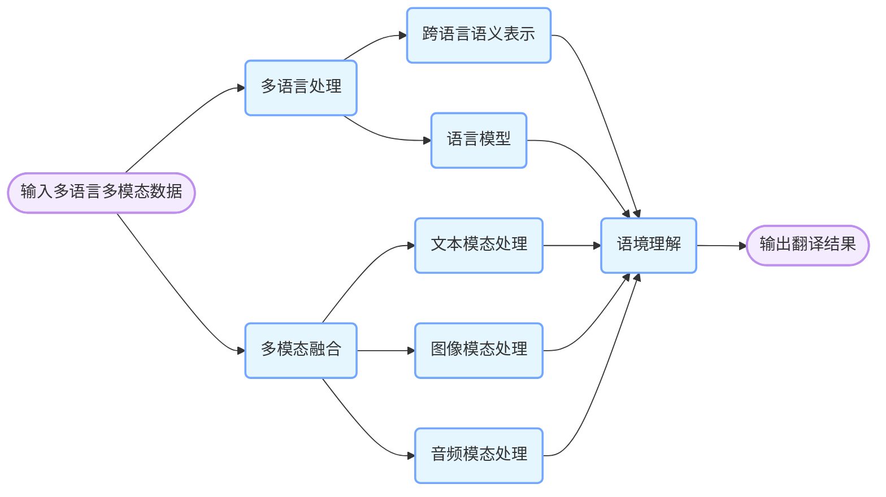

# 提升AI模型在多语言多模态机器翻译中的语境理解能力

> 关键词：AI模型、多语言多模态机器翻译、语境理解能力、跨语言语义、多模态融合

> 摘要：本文聚焦于提升AI模型在多语言多模态机器翻译中的语境理解能力。首先介绍了研究的背景、目的和适用读者群体等内容。接着阐述了多语言多模态机器翻译及语境理解的核心概念和联系，并给出相应的原理架构图与流程图。详细讲解了用于提升语境理解能力的核心算法原理及具体操作步骤，包含Python代码示例。通过数学模型和公式进一步深入剖析该问题，并举例说明。在项目实战部分，展示了开发环境搭建、源代码实现及解读。分析了实际应用场景，推荐了相关的学习资源、开发工具框架以及论文著作。最后总结了未来发展趋势与挑战，解答了常见问题并提供扩展阅读和参考资料，旨在为相关领域的研究和实践提供全面且深入的指导。

## 1. 背景介绍 
### 1.1 目的和范围
随着全球化的加速，信息交流日益频繁，多语言多模态机器翻译的需求急剧增长。多语言翻译要求模型能够处理多种自然语言之间的转换，而多模态则进一步引入了图像、音频等非文本信息。然而，当前的AI模型在处理多语言多模态机器翻译时，往往难以准确理解语境，导致翻译结果在语义、语用等方面出现偏差。

本文的目的在于深入探讨如何提升AI模型在多语言多模态机器翻译中的语境理解能力。具体范围涵盖了从核心概念的阐述、算法原理的分析、数学模型的构建，到实际项目的开发和应用场景的分析，以及相关工具和资源的推荐等多个方面。

### 1.2 预期读者
本文预期读者包括但不限于以下几类人群：
- **研究人员**：从事自然语言处理、机器学习、人工智能等领域研究的学者和科研人员，他们可以从本文中获取关于多语言多模态机器翻译语境理解的最新研究思路和方法。
- **开发者**：正在参与或计划参与多语言多模态机器翻译项目开发的程序员和软件工程师，本文提供的算法原理、代码示例和开发实践经验将对他们的工作有所帮助。
- **学生**：学习计算机科学、人工智能相关专业的本科生和研究生，通过阅读本文可以深入了解多语言多模态机器翻译这一前沿领域的知识和技术。
- **行业从业者**：在翻译、信息传播、跨境电商等行业工作，对多语言多模态机器翻译技术有需求的人员，能够通过本文了解该技术的应用场景和发展趋势。

### 1.3 文档结构概述
本文将按照以下结构展开：
- **核心概念与联系**：介绍多语言多模态机器翻译和语境理解的核心概念，以及它们之间的联系，并通过文本示意图和Mermaid流程图进行直观展示。
- **核心算法原理 & 具体操作步骤**：详细讲解用于提升语境理解能力的核心算法原理，并给出具体的操作步骤，同时使用Python代码进行示例说明。
- **数学模型和公式 & 详细讲解 & 举例说明**：构建数学模型和公式来描述多语言多模态机器翻译中的语境理解问题，并通过具体例子进行详细解释。
- **项目实战：代码实际案例和详细解释说明**：从开发环境搭建开始，逐步实现一个多语言多模态机器翻译项目，并对源代码进行详细解读和分析。
- **实际应用场景**：分析多语言多模态机器翻译在不同领域的实际应用场景。
- **工具和资源推荐**：推荐相关的学习资源、开发工具框架和论文著作，帮助读者进一步深入学习和研究。
- **总结：未来发展趋势与挑战**：总结多语言多模态机器翻译语境理解能力提升的未来发展趋势，并分析可能面临的挑战。
- **附录：常见问题与解答**：解答读者在学习和实践过程中可能遇到的常见问题。
- **扩展阅读 & 参考资料**：提供相关的扩展阅读材料和参考资料，方便读者进一步探索。

### 1.4 术语表
#### 1.4.1 核心术语定义
- **多语言多模态机器翻译**：指的是能够同时处理多种自然语言，并结合文本、图像、音频等多种模态信息进行翻译的机器翻译技术。
- **语境理解**：在机器翻译中，语境理解是指模型能够根据上下文信息、语言使用场景、多模态信息等，准确把握输入内容的语义和语用含义，从而生成更准确、更自然的翻译结果。
- **跨语言语义表示**：将不同语言的文本映射到一个共同的语义空间中，使得不同语言的语义信息可以进行比较和融合。
- **多模态融合**：将文本、图像、音频等不同模态的信息进行整合，以获取更全面、更准确的语义信息。

#### 1.4.2 相关概念解释
- **注意力机制**：在深度学习中，注意力机制用于模拟人类的注意力分配过程，使模型能够自动关注输入序列中的重要部分，从而提高模型的性能。
- **预训练模型**：在大规模数据集上进行无监督学习得到的模型，这些模型可以学习到丰富的语言知识和语义表示，在后续的任务中可以通过微调来适应具体的任务。
- **编码器 - 解码器架构**：一种常见的深度学习架构，编码器将输入序列编码为一个固定长度的向量表示，解码器根据这个向量表示生成输出序列。

#### 1.4.3 缩略词列表
- **NLP**：Natural Language Processing，自然语言处理
- **ML**：Machine Learning，机器学习
- **DL**：Deep Learning，深度学习
- **Transformer**：一种基于注意力机制的深度学习模型架构
- **BERT**：Bidirectional Encoder Representations from Transformers，一种预训练的语言模型

## 2. 核心概念与联系 

### 2.1 多语言多模态机器翻译
多语言多模态机器翻译是自然语言处理领域的一个前沿研究方向。它的目标是实现多种语言之间的翻译，同时融合文本、图像、音频等多种模态的信息。传统的机器翻译主要关注文本到文本的翻译，而多语言多模态机器翻译则进一步考虑了非文本信息对翻译的影响。

例如，在翻译一篇关于旅游景点的文章时，除了文本描述外，可能还会有该景点的图片。图片中的信息，如景点的外观、周边环境等，可以帮助模型更好地理解文本中描述的内容，从而生成更准确的翻译。

### 2.2 语境理解
语境理解是多语言多模态机器翻译中的关键环节。语境可以分为语言语境和非语言语境。语言语境包括上下文信息，如前文提到的词语、句子结构等；非语言语境则包括场景信息、文化背景、说话者的意图等。

在多语言多模态机器翻译中，语境理解的作用在于帮助模型消除歧义、把握语义和语用含义。例如，“bank”这个单词在不同的语境中有不同的含义，既可以表示“银行”，也可以表示“河岸”。通过语境理解，模型可以根据上下文和其他模态信息准确判断其具体含义。

### 2.3 核心概念的联系
多语言多模态机器翻译和语境理解是相互关联、相互促进的。多模态信息的引入可以为语境理解提供更丰富的线索，从而提高模型的语境理解能力。而准确的语境理解又可以帮助模型更好地处理多语言多模态信息，生成更准确的翻译结果。

例如，在翻译一段关于美食的视频时，视频中的画面（图像模态）可以提供食物的外观、制作过程等信息，音频中的讲解（音频模态）可以提供食材、烹饪方法等信息。模型通过融合这些多模态信息，并结合文本描述中的语言语境，能够更准确地理解视频的内容，从而生成高质量的翻译。

### 2.4 文本示意图
```plaintext
多语言多模态机器翻译
|
|-- 多语言处理
|   |-- 跨语言语义表示
|   |-- 语言模型
|
|-- 多模态融合
|   |-- 文本模态
|   |-- 图像模态
|   |-- 音频模态
|
|-- 语境理解
|   |-- 语言语境
|   |-- 非语言语境
```

### 2.5 Mermaid流程图


## 3. 核心算法原理 & 具体操作步骤 

### 3.1 核心算法原理
为了提升AI模型在多语言多模态机器翻译中的语境理解能力，我们可以采用基于Transformer架构的模型，并结合多模态融合和注意力机制。

#### 3.1.1 Transformer架构
Transformer是一种基于注意力机制的深度学习模型架构，它在自然语言处理任务中取得了巨大的成功。Transformer主要由编码器和解码器组成，编码器将输入序列编码为一个固定长度的向量表示，解码器根据这个向量表示生成输出序列。

Transformer的核心是多头注意力机制，它可以让模型在处理输入序列时，自动关注不同位置的信息。多头注意力机制通过多个并行的注意力头来捕捉不同的语义信息，从而提高模型的表达能力。

#### 3.1.2 多模态融合
在多语言多模态机器翻译中，我们需要将文本、图像、音频等不同模态的信息进行融合。一种常见的方法是将不同模态的特征映射到一个共同的语义空间中，然后进行拼接或加权求和。

例如，对于文本模态，我们可以使用预训练的语言模型（如BERT）提取文本特征；对于图像模态，我们可以使用卷积神经网络（如ResNet）提取图像特征；对于音频模态，我们可以使用循环神经网络（如LSTM）提取音频特征。然后将这些特征映射到同一个维度的向量空间中，进行融合。

#### 3.1.3 注意力机制在语境理解中的应用
注意力机制可以帮助模型在处理多模态信息时，自动关注与当前翻译任务相关的信息。在多语言多模态机器翻译中，我们可以使用多头注意力机制来实现跨模态和跨语言的注意力。

例如，在翻译过程中，模型可以根据当前的文本输入，通过注意力机制关注图像和音频中的相关信息，从而更好地理解语境。同时，模型还可以通过跨语言注意力机制，关注不同语言之间的语义关联，提高翻译的准确性。

### 3.2 具体操作步骤

#### 3.2.1 数据预处理
- **文本数据**：对输入的文本数据进行清洗、分词、标注等处理，将文本转换为模型可以处理的格式。例如，使用分词工具将文本分割成单词或子词序列。
- **图像数据**：对输入的图像数据进行预处理，包括图像缩放、归一化等操作。然后使用预训练的图像模型提取图像特征。
- **音频数据**：对输入的音频数据进行特征提取，如梅尔频率倒谱系数（MFCC）等。然后使用循环神经网络对音频特征进行处理。

#### 3.2.2 模型构建
- **编码器**：使用Transformer编码器对文本、图像、音频等多模态特征进行编码，得到多模态表示。
- **解码器**：使用Transformer解码器根据编码器的输出和目标语言的历史信息生成翻译结果。
- **注意力机制**：在编码器和解码器中引入多头注意力机制，实现跨模态和跨语言的注意力。

#### 3.2.3 模型训练
- **损失函数**：使用交叉熵损失函数来衡量模型的预测结果与真实标签之间的差异。
- **优化器**：使用随机梯度下降（SGD）或其变种（如Adam）来更新模型的参数。
- **训练过程**：将预处理后的数据输入到模型中进行训练，通过多次迭代不断调整模型的参数，直到模型的性能达到满意的程度。

#### 3.2.4 模型推理
- **输入数据**：将待翻译的多语言多模态数据输入到训练好的模型中。
- **生成翻译结果**：模型根据输入数据生成翻译结果，并输出到用户界面。

### 3.3 Python代码示例
```python
import torch
import torch.nn as nn
import torch.optim as optim
from torch.utils.data import Dataset, DataLoader
from transformers import BertModel, ResNetModel, LSTM

# 定义多模态数据集类
class MultiModalDataset(Dataset):
    def __init__(self, text_data, image_data, audio_data, labels):
        self.text_data = text_data
        self.image_data = image_data
        self.audio_data = audio_data
        self.labels = labels

    def __len__(self):
        return len(self.labels)

    def __getitem__(self, idx):
        text = self.text_data[idx]
        image = self.image_data[idx]
        audio = self.audio_data[idx]
        label = self.labels[idx]
        return text, image, audio, label

# 定义多模态机器翻译模型
class MultiModalTranslationModel(nn.Module):
    def __init__(self):
        super(MultiModalTranslationModel, self).__init__()
        self.text_encoder = BertModel.from_pretrained('bert-base-multilingual-cased')
        self.image_encoder = ResNetModel.from_pretrained('resnet50')
        self.audio_encoder = LSTM(input_size=13, hidden_size=256, num_layers=2, batch_first=True)
        self.fc = nn.Linear(768 + 2048 + 256, 1000)  # 假设输出维度为1000
        self.decoder = nn.TransformerDecoder(
            nn.TransformerDecoderLayer(d_model=1000, nhead=8),
            num_layers=6
        )

    def forward(self, text, image, audio):
        text_output = self.text_encoder(text).pooler_output
        image_output = self.image_encoder(image).pooler_output
        audio_output, _ = self.audio_encoder(audio)
        audio_output = audio_output[:, -1, :]  # 取最后一个时间步的输出
        multi_modal_output = torch.cat((text_output, image_output, audio_output), dim=1)
        multi_modal_output = self.fc(multi_modal_output)
        # 这里假设已经有目标语言的历史信息 target_history
        target_history = torch.randn(text.size(0), 10, 1000)  # 示例数据
        output = self.decoder(target_history, multi_modal_output.unsqueeze(1))
        return output

# 训练模型
def train_model(model, dataloader, criterion, optimizer, epochs):
    model.train()
    for epoch in range(epochs):
        total_loss = 0
        for text, image, audio, label in dataloader:
            optimizer.zero_grad()
            output = model(text, image, audio)
            loss = criterion(output, label)
            loss.backward()
            optimizer.step()
            total_loss += loss.item()
        print(f'Epoch {epoch + 1}/{epochs}, Loss: {total_loss / len(dataloader)}')

# 示例数据
text_data = torch.randn(100, 128)  # 假设文本数据维度为128
image_data = torch.randn(100, 3, 224, 224)  # 假设图像数据维度为3x224x224
audio_data = torch.randn(100, 100, 13)  # 假设音频数据维度为100x13
labels = torch.randn(100, 10, 1000)  # 假设标签维度为10x1000

# 创建数据集和数据加载器
dataset = MultiModalDataset(text_data, image_data, audio_data, labels)
dataloader = DataLoader(dataset, batch_size=16, shuffle=True)

# 创建模型、损失函数和优化器
model = MultiModalTranslationModel()
criterion = nn.CrossEntropyLoss()
optimizer = optim.Adam(model.parameters(), lr=0.001)

# 训练模型
train_model(model, dataloader, criterion, optimizer, epochs=10)
```

## 4. 数学模型和公式 & 详细讲解 & 举例说明 

### 4.1 跨语言语义表示模型
在多语言多模态机器翻译中，跨语言语义表示是将不同语言的文本映射到一个共同的语义空间中，使得不同语言的语义信息可以进行比较和融合。一种常见的跨语言语义表示模型是基于神经网络的模型，如基于Transformer的模型。

#### 4.1.1 数学模型
假设我们有两种语言 $L_1$ 和 $L_2$，输入的文本分别为 $x_1 \in \mathbb{R}^{n_1}$ 和 $x_2 \in \mathbb{R}^{n_2}$，其中 $n_1$ 和 $n_2$ 分别是两种语言文本的长度。我们希望通过一个跨语言语义表示模型 $f$ 将 $x_1$ 和 $x_2$ 映射到一个共同的语义空间 $\mathbb{R}^d$ 中，得到语义表示 $z_1 = f(x_1)$ 和 $z_2 = f(x_2)$。

#### 4.1.2 公式
跨语言语义表示模型 $f$ 可以表示为：
$$
z = f(x; \theta)
$$
其中，$x$ 是输入的文本，$\theta$ 是模型的参数。在基于Transformer的模型中，$f$ 通常由多个Transformer层组成，每个Transformer层包含多头注意力机制和前馈神经网络。

#### 4.1.3 举例说明
假设我们有一个英文句子 “The cat is on the mat.” 和一个中文句子 “猫在垫子上。”，我们可以使用基于Transformer的跨语言语义表示模型将这两个句子映射到一个共同的语义空间中。具体步骤如下：
1. 对英文句子和中文句子进行分词处理，得到单词序列。
2. 将单词序列转换为词向量表示。
3. 将词向量输入到跨语言语义表示模型中，得到语义表示。

### 4.2 多模态融合模型
多模态融合是将文本、图像、音频等不同模态的信息进行整合，以获取更全面、更准确的语义信息。一种常见的多模态融合方法是将不同模态的特征映射到一个共同的语义空间中，然后进行拼接或加权求和。

#### 4.2.1 数学模型
假设我们有三种模态的信息：文本模态 $x_t \in \mathbb{R}^{n_t}$、图像模态 $x_i \in \mathbb{R}^{n_i}$ 和音频模态 $x_a \in \mathbb{R}^{n_a}$。我们希望通过一个多模态融合模型 $g$ 将这三种模态的信息融合成一个综合的语义表示 $z \in \mathbb{R}^d$。

#### 4.2.2 公式
多模态融合模型 $g$ 可以表示为：
$$
z = g(x_t, x_i, x_a; \theta)
$$
其中，$\theta$ 是模型的参数。常见的融合方法包括拼接和加权求和：
- **拼接**：$z = [f_t(x_t); f_i(x_i); f_a(x_a)]$，其中 $f_t$、$f_i$ 和 $f_a$ 分别是文本、图像和音频的特征提取函数。
- **加权求和**：$z = w_t f_t(x_t) + w_i f_i(x_i) + w_a f_a(x_a)$，其中 $w_t$、$w_i$ 和 $w_a$ 是权重系数，可以通过训练得到。

#### 4.2.3 举例说明
假设我们有一段关于美食的文本描述、一张美食的图片和一段美食制作过程的音频。我们可以使用多模态融合模型将这三种模态的信息融合成一个综合的语义表示。具体步骤如下：
1. 使用预训练的语言模型提取文本特征，使用卷积神经网络提取图像特征，使用循环神经网络提取音频特征。
2. 将这些特征映射到同一个维度的向量空间中。
3. 使用拼接或加权求和的方法将这些特征融合成一个综合的语义表示。

### 4.3 注意力机制模型
注意力机制可以帮助模型在处理多模态信息时，自动关注与当前翻译任务相关的信息。在多语言多模态机器翻译中，我们可以使用多头注意力机制来实现跨模态和跨语言的注意力。

#### 4.3.1 数学模型
多头注意力机制由多个并行的注意力头组成，每个注意力头可以独立地计算注意力分数。假设我们有输入序列 $x = [x_1, x_2, \cdots, x_n]$，其中 $x_i \in \mathbb{R}^d$。多头注意力机制的输出可以表示为：
$$
\text{MultiHead}(Q, K, V) = \text{Concat}(\text{head}_1, \cdots, \text{head}_h) W^O
$$
其中，$Q$、$K$ 和 $V$ 分别是查询矩阵、键矩阵和值矩阵，$h$ 是注意力头的数量，$W^O$ 是输出权重矩阵。每个注意力头的计算方式如下：
$$
\text{head}_i = \text{Attention}(Q W_i^Q, K W_i^K, V W_i^V)
$$
其中，$W_i^Q$、$W_i^K$ 和 $W_i^V$ 分别是第 $i$ 个注意力头的查询、键和值的权重矩阵。

#### 4.3.2 公式
注意力分数的计算方式如下：
$$
\text{Attention}(Q, K, V) = \text{softmax}\left(\frac{QK^T}{\sqrt{d_k}}\right) V
$$
其中，$d_k$ 是键向量的维度。

#### 4.3.3 举例说明
假设我们在翻译一段关于旅游景点的文本时，同时有该景点的图片和相关的音频。我们可以使用多头注意力机制来关注文本、图像和音频中与当前翻译任务相关的信息。具体步骤如下：
1. 将文本、图像和音频的特征分别作为查询、键和值矩阵。
2. 计算注意力分数，得到每个特征的重要性权重。
3. 根据注意力分数对特征进行加权求和，得到综合的语义表示。

## 5. 项目实战：代码实际案例和详细解释说明 

### 5.1  开发环境搭建
#### 5.1.1 操作系统
建议使用Linux系统，如Ubuntu 18.04或更高版本。Linux系统在深度学习开发中具有较好的稳定性和兼容性。

#### 5.1.2 Python环境
安装Python 3.7或更高版本。可以使用Anaconda来管理Python环境，具体步骤如下：
1. 下载并安装Anaconda：从Anaconda官方网站（https://www.anaconda.com/products/individual）下载适合自己操作系统的Anaconda安装包，并按照安装向导进行安装。
2. 创建虚拟环境：打开终端，运行以下命令创建一个名为 `multi_modal_translation` 的虚拟环境：
```bash
conda create -n multi_modal_translation python=3.8
```
3. 激活虚拟环境：运行以下命令激活虚拟环境：
```bash
conda activate multi_modal_translation
```

#### 5.1.3 安装依赖库
在激活的虚拟环境中，安装以下依赖库：
- **PyTorch**：深度学习框架，用于构建和训练模型。可以根据自己的CUDA版本选择合适的PyTorch版本进行安装，例如：
```bash
pip install torch torchvision torchaudio
```
- **Transformers**：用于加载预训练的语言模型，如BERT。
```bash
pip install transformers
```
- **torchvision**：用于处理图像数据。
```bash
pip install torchvision
```
- **torchaudio**：用于处理音频数据。
```bash
pip install torchaudio
```

### 5.2  源代码详细实现和代码解读
```python
import torch
import torch.nn as nn
import torch.optim as optim
from torch.utils.data import Dataset, DataLoader
from transformers import BertModel, ResNetModel, LSTM

# 定义多模态数据集类
class MultiModalDataset(Dataset):
    def __init__(self, text_data, image_data, audio_data, labels):
        """
        初始化多模态数据集类
        :param text_data: 文本数据
        :param image_data: 图像数据
        :param audio_data: 音频数据
        :param labels: 标签数据
        """
        self.text_data = text_data
        self.image_data = image_data
        self.audio_data = audio_data
        self.labels = labels

    def __len__(self):
        """
        返回数据集的长度
        :return: 数据集的长度
        """
        return len(self.labels)

    def __getitem__(self, idx):
        """
        根据索引获取数据集中的一个样本
        :param idx: 索引
        :return: 文本、图像、音频和标签数据
        """
        text = self.text_data[idx]
        image = self.image_data[idx]
        audio = self.audio_data[idx]
        label = self.labels[idx]
        return text, image, audio, label

# 定义多模态机器翻译模型
class MultiModalTranslationModel(nn.Module):
    def __init__(self):
        """
        初始化多模态机器翻译模型
        """
        super(MultiModalTranslationModel, self).__init__()
        # 文本编码器，使用预训练的BERT模型
        self.text_encoder = BertModel.from_pretrained('bert-base-multilingual-cased')
        # 图像编码器，使用预训练的ResNet模型
        self.image_encoder = ResNetModel.from_pretrained('resnet50')
        # 音频编码器，使用LSTM模型
        self.audio_encoder = LSTM(input_size=13, hidden_size=256, num_layers=2, batch_first=True)
        # 全连接层，用于将多模态特征进行融合
        self.fc = nn.Linear(768 + 2048 + 256, 1000)  # 假设输出维度为1000
        # 解码器，使用Transformer解码器
        self.decoder = nn.TransformerDecoder(
            nn.TransformerDecoderLayer(d_model=1000, nhead=8),
            num_layers=6
        )

    def forward(self, text, image, audio):
        """
        前向传播函数
        :param text: 文本数据
        :param image: 图像数据
        :param audio: 音频数据
        :return: 模型的输出
        """
        # 对文本数据进行编码
        text_output = self.text_encoder(text).pooler_output
        # 对图像数据进行编码
        image_output = self.image_encoder(image).pooler_output
        # 对音频数据进行编码
        audio_output, _ = self.audio_encoder(audio)
        audio_output = audio_output[:, -1, :]  # 取最后一个时间步的输出
        # 将多模态特征进行拼接
        multi_modal_output = torch.cat((text_output, image_output, audio_output), dim=1)
        # 通过全连接层进行特征融合
        multi_modal_output = self.fc(multi_modal_output)
        # 这里假设已经有目标语言的历史信息 target_history
        target_history = torch.randn(text.size(0), 10, 1000)  # 示例数据
        # 解码器根据多模态特征和目标语言的历史信息生成输出
        output = self.decoder(target_history, multi_modal_output.unsqueeze(1))
        return output

# 训练模型
def train_model(model, dataloader, criterion, optimizer, epochs):
    """
    训练模型
    :param model: 模型
    :param dataloader: 数据加载器
    :param criterion: 损失函数
    :param optimizer: 优化器
    :param epochs: 训练轮数
    """
    model.train()
    for epoch in range(epochs):
        total_loss = 0
        for text, image, audio, label in dataloader:
            optimizer.zero_grad()
            output = model(text, image, audio)
            loss = criterion(output, label)
            loss.backward()
            optimizer.step()
            total_loss += loss.item()
        print(f'Epoch {epoch + 1}/{epochs}, Loss: {total_loss / len(dataloader)}')

# 示例数据
text_data = torch.randn(100, 128)  # 假设文本数据维度为128
image_data = torch.randn(100, 3, 224, 224)  # 假设图像数据维度为3x224x224
audio_data = torch.randn(100, 100, 13)  # 假设音频数据维度为100x13
labels = torch.randn(100, 10, 1000)  # 假设标签维度为10x1000

# 创建数据集和数据加载器
dataset = MultiModalDataset(text_data, image_data, audio_data, labels)
dataloader = DataLoader(dataset, batch_size=16, shuffle=True)

# 创建模型、损失函数和优化器
model = MultiModalTranslationModel()
criterion = nn.CrossEntropyLoss()
optimizer = optim.Adam(model.parameters(), lr=0.001)

# 训练模型
train_model(model, dataloader, criterion, optimizer, epochs=10)
```

### 5.3  代码解读与分析
#### 5.3.1 数据集类 `MultiModalDataset`
该类继承自 `torch.utils.data.Dataset`，用于封装多模态数据。在 `__init__` 方法中，我们初始化了文本、图像、音频和标签数据。`__len__` 方法返回数据集的长度，`__getitem__` 方法根据索引返回一个样本。

#### 5.3.2 模型类 `MultiModalTranslationModel`
该类继承自 `nn.Module`，用于构建多模态机器翻译模型。在 `__init__` 方法中，我们初始化了文本编码器、图像编码器、音频编码器、全连接层和解码器。`forward` 方法实现了模型的前向传播过程，包括对多模态数据的编码、特征融合和解码。

#### 5.3.3 训练函数 `train_model`
该函数用于训练模型。在训练过程中，我们将数据输入到模型中，计算损失函数，然后使用反向传播算法更新模型的参数。

#### 5.3.4 示例数据和训练过程
我们使用随机生成的示例数据来演示模型的训练过程。首先创建数据集和数据加载器，然后创建模型、损失函数和优化器，最后调用 `train_model` 函数进行训练。

## 6. 实际应用场景 
### 6.1 跨境电商
在跨境电商领域，多语言多模态机器翻译可以帮助商家将商品信息、产品描述等内容翻译成不同语言，以便更好地服务全球客户。同时，结合商品图片和视频等多模态信息，可以让客户更直观地了解商品的特点和优势，提高购买转化率。

例如，一家中国的电商平台想要将商品信息推广到欧洲市场，使用多语言多模态机器翻译技术可以将商品的中文描述翻译成英语、法语、德语等多种语言，并结合商品图片和视频，为欧洲客户提供更全面、更准确的商品信息。

### 6.2 国际会议和交流
在国际会议和交流中，多语言多模态机器翻译可以实现实时的语言翻译，打破语言障碍，促进不同国家和地区之间的交流与合作。同时，结合会议现场的图片、视频和音频等多模态信息，可以让参会者更好地理解会议内容。

例如，在一次国际学术会议上，使用多语言多模态机器翻译系统可以将演讲者的发言实时翻译成多种语言，并通过大屏幕展示相关的图片和视频，让来自不同国家的参会者都能准确理解演讲内容。

### 6.3 旅游和文化交流
在旅游和文化交流领域，多语言多模态机器翻译可以帮助游客更好地了解当地的文化、历史和风俗习惯。通过翻译旅游景点的介绍、导游的讲解等内容，并结合景点的图片和视频等多模态信息，可以让游客获得更丰富、更真实的旅游体验。

例如，一位中国游客在法国旅游时，使用多语言多模态机器翻译应用程序可以将法语的景点介绍翻译成中文，并查看景点的图片和视频，更好地了解法国的文化和历史。

### 6.4 教育领域
在教育领域，多语言多模态机器翻译可以用于翻译教材、课件、教学视频等内容，为不同语言背景的学生提供更优质的教育资源。同时，结合教学过程中的图片、音频等多模态信息，可以提高学生的学习兴趣和学习效果。

例如，一所国际学校使用多语言多模态机器翻译系统将英语教材翻译成多种语言，并结合教学视频和图片，为来自不同国家的学生提供了统一的教学资源，促进了学生的学习和交流。

## 7. 工具和资源推荐
### 7.1 学习资源推荐
#### 7.1.1 书籍推荐
- 《深度学习》（Deep Learning）：由Ian Goodfellow、Yoshua Bengio和Aaron Courville所著，是深度学习领域的经典教材，涵盖了深度学习的基本概念、算法和应用。
- 《自然语言处理入门》（Natural Language Processing with Python）：由Steven Bird、Ewan Klein和Edward Loper所著，介绍了使用Python进行自然语言处理的基本方法和技术。
- 《计算机视觉：算法与应用》（Computer Vision: Algorithms and Applications）：由Richard Szeliski所著，是计算机视觉领域的权威教材，涵盖了计算机视觉的基本算法和应用。

#### 7.1.2 在线课程
- Coursera上的“深度学习专项课程”（Deep Learning Specialization）：由Andrew Ng教授讲授，包括深度学习的基础、卷积神经网络、循环神经网络等内容。
- edX上的“自然语言处理”（Natural Language Processing）：由哥伦比亚大学的教授讲授，介绍了自然语言处理的基本概念、算法和应用。
- Udemy上的“计算机视觉实战课程”（Computer Vision A-Z: Hands-On Artificial Intelligence in Python）：通过实际项目介绍了计算机视觉的基本算法和应用。

#### 7.1.3 技术博客和网站
- Medium：是一个技术博客平台，上面有很多关于深度学习、自然语言处理和计算机视觉的优秀文章。
- arXiv：是一个预印本平台，上面可以找到最新的学术研究成果，包括多语言多模态机器翻译的相关论文。
- Hugging Face：是一个专注于自然语言处理的开源社区，提供了很多预训练的模型和工具。

### 7.2 开发工具框架推荐
#### 7.2.1 IDE和编辑器
- PyCharm：是一款专门为Python开发设计的集成开发环境，具有代码编辑、调试、版本控制等功能。
- Jupyter Notebook：是一个交互式的开发环境，适合进行数据分析、模型训练和可视化等工作。
- Visual Studio Code：是一款轻量级的代码编辑器，支持多种编程语言，具有丰富的插件生态系统。

#### 7.2.2 调试和性能分析工具
- TensorBoard：是TensorFlow提供的一个可视化工具，可以用于监控模型的训练过程、可视化模型的结构和性能等。
- PyTorch Profiler：是PyTorch提供的一个性能分析工具，可以用于分析模型的运行时间、内存使用等情况。
- NVIDIA Nsight Systems：是NVIDIA提供的一个性能分析工具，专门用于分析GPU程序的性能。

#### 7.2.3 相关框架和库
- PyTorch：是一个开源的深度学习框架，具有动态图、易于使用等特点，广泛应用于自然语言处理、计算机视觉等领域。
- TensorFlow：是一个开源的深度学习框架，具有静态图、分布式训练等特点，也被广泛应用于各种深度学习任务中。
- Transformers：是Hugging Face开发的一个自然语言处理库，提供了很多预训练的语言模型，如BERT、GPT等。

### 7.3 相关论文著作推荐
#### 7.3.1 经典论文
- “Attention Is All You Need”：介绍了Transformer架构，是自然语言处理领域的经典论文之一。
- “BERT: Pre-training of Deep Bidirectional Transformers for Language Understanding”：提出了BERT模型，开启了预训练语言模型的时代。
- “Show, Attend and Tell: Neural Image Caption Generation with Visual Attention”：提出了基于注意力机制的图像描述生成模型。

#### 7.3.2 最新研究成果
- 可以关注ACL（Association for Computational Linguistics）、EMNLP（Conference on Empirical Methods in Natural Language Processing）、CVPR（IEEE Conference on Computer Vision and Pattern Recognition）等顶级学术会议上的最新研究成果。
- 也可以在arXiv上搜索关于多语言多模态机器翻译的最新论文。

#### 7.3.3 应用案例分析
- 可以参考一些实际应用案例的论文，了解多语言多模态机器翻译在不同领域的应用场景和效果。例如，一些关于跨境电商、国际会议等领域的应用案例分析。

## 8. 总结：未来发展趋势与挑战
### 8.1 未来发展趋势
#### 8.1.1 更强的跨语言和跨模态理解能力
未来的AI模型将具备更强的跨语言和跨模态理解能力，能够更好地处理不同语言和模态之间的语义关联。例如，模型可以更准确地理解不同语言中相同概念的表达，以及不同模态信息之间的相互补充和印证。

#### 8.1.2 更高效的训练和推理方法
随着硬件技术的不断发展和算法的不断优化，未来的多语言多模态机器翻译模型将采用更高效的训练和推理方法。例如，使用分布式训练、量化技术等可以提高模型的训练速度和推理效率。

#### 8.1.3 更广泛的应用场景
多语言多模态机器翻译技术将在更多的领域得到应用，如智能客服、智能家居、智能医疗等。这些应用场景将进一步推动技术的发展和创新。

### 8.2 挑战
#### 8.2.1 数据获取和标注
多语言多模态数据的获取和标注是一个挑战。不同语言和模态的数据来源广泛，数据的质量和一致性难以保证。同时，标注多模态数据需要耗费大量的人力和时间。

#### 8.2.2 模型复杂度和计算资源
多语言多模态机器翻译模型通常比较复杂，需要大量的计算资源进行训练和推理。这对于一些资源有限的机构和个人来说是一个挑战。

#### 8.2.3 语义理解和文化差异
不同语言和文化之间存在着丰富的语义和文化差异，这给模型的语境理解带来了挑战。模型需要更好地处理这些差异，才能生成更准确、更自然的翻译结果。

## 9. 附录：常见问题与解答
### 9.1 如何选择合适的预训练模型？
选择合适的预训练模型需要考虑以下几个因素：
- **任务类型**：不同的预训练模型适用于不同的任务类型。例如，BERT适用于自然语言处理任务，ResNet适用于计算机视觉任务。
- **语言支持**：如果需要处理多种语言，应选择支持多语言的预训练模型，如bert-base-multilingual-cased。
- **模型大小**：模型大小会影响训练和推理的速度和资源消耗。应根据自己的计算资源选择合适大小的模型。

### 9.2 如何处理多模态数据的缺失问题？
处理多模态数据的缺失问题可以采用以下方法：
- **数据填充**：对于缺失的文本数据，可以使用占位符或默认值进行填充；对于缺失的图像或音频数据，可以使用生成模型生成相应的替代数据。
- **模型设计**：在模型设计中，可以采用多模态融合的方法，让模型能够根据已有的模态信息进行推理，减少对缺失模态的依赖。

### 9.3 如何评估多语言多模态机器翻译模型的性能？
评估多语言多模态机器翻译模型的性能可以采用以下指标：
- **翻译质量指标**：如BLEU、ROUGE等，用于评估翻译结果的质量。
- **语境理解指标**：可以设计一些专门的指标来评估模型的语境理解能力，如语义相似度、语用合理性等。
- **用户体验指标**：通过用户调查和反馈来评估模型的用户体验，如翻译的准确性、流畅性等。

## 10. 扩展阅读 & 参考资料
### 10.1 扩展阅读
- 《人工智能：现代方法》（Artificial Intelligence: A Modern Approach）：介绍了人工智能的基本概念、算法和应用，是人工智能领域的经典教材。
- 《深度学习实战》（Deep Learning in Practice）：通过实际项目介绍了深度学习的应用和开发技巧。
- 《多模态机器学习：原理与应用》（Multimodal Machine Learning: Principles and Applications）：专门介绍了多模态机器学习的原理和应用。

### 10.2 参考资料
- 相关学术论文和研究报告，可以在学术数据库（如IEEE Xplore、ACM Digital Library等）中查找。
- 开源项目和代码库，如GitHub上的多语言多模态机器翻译相关项目。
- 官方文档和教程，如PyTorch、TensorFlow、Transformers等框架的官方文档和教程。

作者：AI天才研究院/AI Genius Institute & 禅与计算机程序设计艺术 /Zen And The Art of Computer Programming