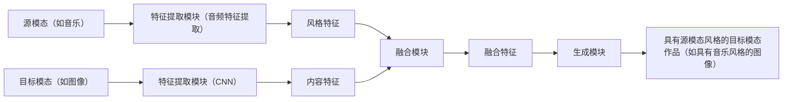

# 提升AI模型在跨模态艺术风格迁移任务中的创造性

> 关键词：AI模型、跨模态艺术风格迁移、创造性提升、深度学习、艺术创作

> 摘要：本文聚焦于提升AI模型在跨模态艺术风格迁移任务中的创造性。首先介绍了跨模态艺术风格迁移的背景知识，包括目的、预期读者和文档结构等。接着阐述了核心概念与联系，分析了相关算法原理并给出Python代码示例。通过数学模型和公式进一步深入理解该任务。然后结合项目实战，详细介绍了开发环境搭建、源代码实现与解读。探讨了实际应用场景，推荐了相关的学习资源、开发工具和论文著作。最后总结了未来发展趋势与挑战，并对常见问题进行了解答。旨在为研究者和开发者提供全面且深入的指导，推动跨模态艺术风格迁移领域的发展。

## 1. 背景介绍 
### 1.1 目的和范围
跨模态艺术风格迁移是将一种模态（如绘画、音乐等）的艺术风格应用到另一种模态（如文本、图像等）的创作中，其目的在于突破传统艺术创作的界限，创造出新颖独特的艺术作品。本文章的范围涵盖了从核心概念的理解到实际项目的开发，旨在深入探讨如何提升AI模型在这一任务中的创造性，为相关领域的研究者和开发者提供全面的技术指导和思路。

### 1.2 预期读者
本文预期读者包括人工智能领域的研究者、开发者、艺术创作者以及对跨模态艺术风格迁移感兴趣的爱好者。对于研究者，文章提供了深入的理论分析和最新的研究方向；对于开发者，详细的代码示例和开发流程有助于实际项目的开展；对于艺术创作者，能帮助他们了解如何借助AI技术拓展创作思路；而爱好者则可以通过本文对该领域有一个全面的认识。

### 1.3 文档结构概述
本文将按照以下结构展开：首先介绍跨模态艺术风格迁移的核心概念与联系，包括原理和架构的示意图；接着阐述核心算法原理并给出Python代码示例；通过数学模型和公式进一步深入分析；结合项目实战，详细介绍开发环境搭建、源代码实现与解读；探讨实际应用场景；推荐相关的学习资源、开发工具和论文著作；最后总结未来发展趋势与挑战，并对常见问题进行解答。

### 1.4 术语表
#### 1.4.1 核心术语定义
- **跨模态艺术风格迁移**：将一种艺术模态的风格特征提取并应用到另一种模态的创作中，实现不同模态之间的风格转换。
- **创造性**：在艺术风格迁移过程中，模型能够产生新颖、独特且具有艺术价值的作品的能力。
- **AI模型**：用于执行跨模态艺术风格迁移任务的人工智能算法模型，如深度学习中的神经网络模型。

#### 1.4.2 相关概念解释
- **模态**：指信息的不同表现形式，如视觉（图像、视频）、听觉（音乐、语音）、文本等。
- **艺术风格**：是艺术家在创作过程中所表现出的独特的表现手法、审美观念和创作风格，如印象派、抽象派等。

#### 1.4.3 缩略词列表
- **GAN**：生成对抗网络（Generative Adversarial Networks）
- **CNN**：卷积神经网络（Convolutional Neural Networks）
- **RNN**：循环神经网络（Recurrent Neural Networks）

## 2. 核心概念与联系 

### 核心概念原理
跨模态艺术风格迁移的核心在于从源模态中提取艺术风格特征，并将这些特征融合到目标模态的内容中。以图像到图像的风格迁移为例，源图像的风格特征可以通过卷积神经网络（CNN）提取，如VGG网络。这些特征包括纹理、颜色分布、笔触等。目标图像的内容特征也通过CNN提取。然后，通过特定的算法将风格特征和内容特征进行融合，生成具有源图像风格的目标图像。

对于跨模态的情况，如将音乐风格迁移到图像中，需要先将音乐信号转换为可处理的特征表示，例如使用音频特征提取算法提取节奏、音高、音色等特征。然后将这些音乐特征与图像的内容特征进行融合，实现风格迁移。

### 架构的文本示意图
```plaintext
源模态（如音乐） -- 特征提取模块（音频特征提取） --> 风格特征
目标模态（如图像） -- 特征提取模块（CNN） --> 内容特征
风格特征 + 内容特征 -- 融合模块 --> 融合特征
融合特征 -- 生成模块 --> 具有源模态风格的目标模态作品（如具有音乐风格的图像）
```

### Mermaid 流程图


## 3. 核心算法原理 & 具体操作步骤 

### 核心算法原理
在跨模态艺术风格迁移中，生成对抗网络（GAN）是一种常用的算法。GAN由生成器（Generator）和判别器（Discriminator）组成。生成器的任务是根据输入的风格特征和内容特征生成具有特定风格的目标模态作品，而判别器的任务是判断生成的作品是真实的还是由生成器生成的。通过不断的对抗训练，生成器逐渐学会生成更加逼真和具有创造性的作品。

### 具体操作步骤
1. **数据准备**：收集源模态和目标模态的数据，并进行预处理，如归一化、裁剪等。
2. **特征提取**：使用合适的特征提取算法从源模态中提取风格特征，从目标模态中提取内容特征。
3. **模型构建**：构建生成器和判别器网络。生成器可以采用卷积神经网络（CNN）或循环神经网络（RNN），判别器通常也采用CNN。
4. **训练模型**：将风格特征和内容特征输入到生成器中生成作品，将生成的作品和真实作品输入到判别器中进行判断。根据判别器的输出更新生成器和判别器的参数，不断进行对抗训练。
5. **生成作品**：训练完成后，将新的风格特征和内容特征输入到生成器中，生成具有创造性的跨模态艺术作品。

### Python源代码示例
```python
import torch
import torch.nn as nn
import torch.optim as optim

# 定义生成器网络
class Generator(nn.Module):
    def __init__(self):
        super(Generator, self).__init__()
        self.fc1 = nn.Linear(100, 256)
        self.fc2 = nn.Linear(256, 512)
        self.fc3 = nn.Linear(512, 1024)
        self.fc4 = nn.Linear(1024, 784)
        self.relu = nn.ReLU()
        self.tanh = nn.Tanh()

    def forward(self, x):
        x = self.relu(self.fc1(x))
        x = self.relu(self.fc2(x))
        x = self.relu(self.fc3(x))
        x = self.tanh(self.fc4(x))
        return x

# 定义判别器网络
class Discriminator(nn.Module):
    def __init__(self):
        super(Discriminator, self).__init__()
        self.fc1 = nn.Linear(784, 512)
        self.fc2 = nn.Linear(512, 256)
        self.fc3 = nn.Linear(256, 1)
        self.relu = nn.ReLU()
        self.sigmoid = nn.Sigmoid()

    def forward(self, x):
        x = self.relu(self.fc1(x))
        x = self.relu(self.fc2(x))
        x = self.sigmoid(self.fc3(x))
        return x

# 初始化生成器和判别器
generator = Generator()
discriminator = Discriminator()

# 定义损失函数和优化器
criterion = nn.BCELoss()
g_optimizer = optim.Adam(generator.parameters(), lr=0.0002)
d_optimizer = optim.Adam(discriminator.parameters(), lr=0.0002)

# 训练模型
num_epochs = 100
for epoch in range(num_epochs):
    # 训练判别器
    d_optimizer.zero_grad()
    real_labels = torch.ones((batch_size, 1))
    fake_labels = torch.zeros((batch_size, 1))

    # 真实数据
    real_data = get_real_data()  # 自定义函数获取真实数据
    real_output = discriminator(real_data)
    d_real_loss = criterion(real_output, real_labels)

    # 生成数据
    noise = torch.randn((batch_size, 100))
    fake_data = generator(noise)
    fake_output = discriminator(fake_data.detach())
    d_fake_loss = criterion(fake_output, fake_labels)

    # 判别器总损失
    d_loss = d_real_loss + d_fake_loss
    d_loss.backward()
    d_optimizer.step()

    # 训练生成器
    g_optimizer.zero_grad()
    fake_output = discriminator(fake_data)
    g_loss = criterion(fake_output, real_labels)
    g_loss.backward()
    g_optimizer.step()

    print(f'Epoch [{epoch+1}/{num_epochs}], D_loss: {d_loss.item():.4f}, G_loss: {g_loss.item():.4f}')
```

## 4. 数学模型和公式 & 详细讲解 & 举例说明 

### 数学模型
在GAN中，生成器和判别器的目标可以用以下数学模型表示：

生成器的目标是最大化判别器将生成的作品判断为真实作品的概率，即：

$$\max_G V(D, G) = \mathbb{E}_{z \sim p_z(z)}[\log D(G(z))]$$

判别器的目标是最大化正确区分真实作品和生成作品的概率，即：

$$\min_D V(D, G) = \mathbb{E}_{x \sim p_{data}(x)}[\log D(x)] + \mathbb{E}_{z \sim p_z(z)}[\log(1 - D(G(z)))]$$

其中，$G$ 表示生成器，$D$ 表示判别器，$z$ 是随机噪声，$x$ 是真实数据，$p_z(z)$ 是噪声的概率分布，$p_{data}(x)$ 是真实数据的概率分布。

### 详细讲解
生成器的目标是让判别器难以区分生成的作品和真实作品，因此要最大化判别器对生成作品的判断概率。判别器的目标是尽可能准确地判断作品的真实性，因此要最大化对真实作品的判断概率，同时最小化对生成作品的判断概率。

在训练过程中，通过交替更新生成器和判别器的参数，使两者不断对抗，最终达到一个平衡状态，此时生成器能够生成高质量的作品。

### 举例说明
假设我们要生成手写数字图像。真实数据是从MNIST数据集中获取的手写数字图像，噪声是随机生成的向量。生成器根据噪声生成手写数字图像，判别器判断生成的图像是真实的还是生成的。通过不断的训练，生成器逐渐学会生成更加逼真的手写数字图像。

## 5. 项目实战：代码实际案例和详细解释说明 

### 5.1  开发环境搭建
1. **安装Python**：建议使用Python 3.7及以上版本。可以从Python官方网站（https://www.python.org/downloads/）下载并安装。
2. **安装深度学习框架**：本文使用PyTorch作为深度学习框架。可以使用以下命令安装：
```sh
pip install torch torchvision
```
3. **安装其他依赖库**：如NumPy、Matplotlib等，可以使用以下命令安装：
```sh
pip install numpy matplotlib
```

### 5.2  源代码详细实现和代码解读
```python
import torch
import torch.nn as nn
import torch.optim as optim
import torchvision
import torchvision.datasets as datasets
import torchvision.transforms as transforms
import matplotlib.pyplot as plt
import numpy as np

# 定义生成器网络
class Generator(nn.Module):
    def __init__(self):
        super(Generator, self).__init__()
        self.fc1 = nn.Linear(100, 256)
        self.fc2 = nn.Linear(256, 512)
        self.fc3 = nn.Linear(512, 1024)
        self.fc4 = nn.Linear(1024, 784)
        self.relu = nn.ReLU()
        self.tanh = nn.Tanh()

    def forward(self, x):
        x = self.relu(self.fc1(x))
        x = self.relu(self.fc2(x))
        x = self.relu(self.fc3(x))
        x = self.tanh(self.fc4(x))
        return x

# 定义判别器网络
class Discriminator(nn.Module):
    def __init__(self):
        super(Discriminator, self).__init__()
        self.fc1 = nn.Linear(784, 512)
        self.fc2 = nn.Linear(512, 256)
        self.fc3 = nn.Linear(256, 1)
        self.relu = nn.ReLU()
        self.sigmoid = nn.Sigmoid()

    def forward(self, x):
        x = self.relu(self.fc1(x))
        x = self.relu(self.fc2(x))
        x = self.sigmoid(self.fc3(x))
        return x

# 数据加载和预处理
transform = transforms.Compose([
    transforms.ToTensor(),
    transforms.Normalize((0.5,), (0.5,))
])

train_dataset = datasets.MNIST(root='./data', train=True, transform=transform, download=True)
train_loader = torch.utils.data.DataLoader(train_dataset, batch_size=64, shuffle=True)

# 初始化生成器和判别器
generator = Generator()
discriminator = Discriminator()

# 定义损失函数和优化器
criterion = nn.BCELoss()
g_optimizer = optim.Adam(generator.parameters(), lr=0.0002)
d_optimizer = optim.Adam(discriminator.parameters(), lr=0.0002)

# 训练模型
num_epochs = 100
for epoch in range(num_epochs):
    for i, (images, _) in enumerate(train_loader):
        batch_size = images.size(0)
        images = images.view(batch_size, -1)

        # 训练判别器
        d_optimizer.zero_grad()
        real_labels = torch.ones((batch_size, 1))
        fake_labels = torch.zeros((batch_size, 1))

        # 真实数据
        real_output = discriminator(images)
        d_real_loss = criterion(real_output, real_labels)

        # 生成数据
        noise = torch.randn((batch_size, 100))
        fake_data = generator(noise)
        fake_output = discriminator(fake_data.detach())
        d_fake_loss = criterion(fake_output, fake_labels)

        # 判别器总损失
        d_loss = d_real_loss + d_fake_loss
        d_loss.backward()
        d_optimizer.step()

        # 训练生成器
        g_optimizer.zero_grad()
        fake_output = discriminator(fake_data)
        g_loss = criterion(fake_output, real_labels)
        g_loss.backward()
        g_optimizer.step()

    print(f'Epoch [{epoch+1}/{num_epochs}], D_loss: {d_loss.item():.4f}, G_loss: {g_loss.item():.4f}')

# 生成图像
noise = torch.randn((16, 100))
generated_images = generator(noise).detach().numpy()
generated_images = generated_images.reshape(16, 28, 28)

# 显示生成的图像
fig, axes = plt.subplots(4, 4, figsize=(4, 4))
axes = axes.flatten()
for i in range(16):
    axes[i].imshow(generated_images[i], cmap='gray')
    axes[i].axis('off')
plt.show()
```

### 代码解读与分析
1. **数据加载和预处理**：使用`torchvision.datasets.MNIST`加载MNIST数据集，并使用`transforms.Compose`进行数据预处理，包括将图像转换为张量和归一化。
2. **生成器和判别器网络**：生成器和判别器都是全连接神经网络，生成器将随机噪声转换为手写数字图像，判别器判断图像的真实性。
3. **损失函数和优化器**：使用二元交叉熵损失函数（`nn.BCELoss`）和Adam优化器。
4. **训练过程**：交替训练判别器和生成器，通过不断更新参数使两者达到平衡。
5. **生成图像**：训练完成后，使用生成器生成16张手写数字图像，并使用`matplotlib`显示。

## 6. 实际应用场景 
### 艺术创作
艺术家可以利用跨模态艺术风格迁移技术，将不同艺术形式的风格融合到自己的作品中，创造出新颖独特的艺术作品。例如，将绘画的风格迁移到音乐作品中，或者将音乐的情感和节奏融入到绘画中。

### 广告设计
在广告设计中，可以使用跨模态艺术风格迁移技术为产品添加独特的艺术风格，吸引消费者的注意力。例如，将流行的艺术风格应用到产品图片上，或者将音乐的氛围融入到广告视频中。

### 游戏开发
在游戏开发中，跨模态艺术风格迁移可以用于创建独特的游戏场景和角色。例如，将传统绘画的风格应用到游戏中的场景和角色设计上，为玩家带来全新的视觉体验。

### 文化遗产保护
对于文化遗产的保护和传承，跨模态艺术风格迁移可以将古老的艺术风格重新应用到现代的艺术创作中，让更多的人了解和欣赏传统文化。例如，将古代壁画的风格迁移到现代的数字艺术作品中。

## 7. 工具和资源推荐
### 7.1 学习资源推荐
#### 7.1.1 书籍推荐
- 《深度学习》（Deep Learning）：由Ian Goodfellow、Yoshua Bengio和Aaron Courville所著，是深度学习领域的经典教材，涵盖了神经网络、卷积神经网络、循环神经网络等重要内容。
- 《Python深度学习》（Deep Learning with Python）：由Francois Chollet所著，介绍了如何使用Python和Keras进行深度学习模型的开发，适合初学者入门。

#### 7.1.2 在线课程
- Coursera上的“深度学习专项课程”（Deep Learning Specialization）：由Andrew Ng教授授课，系统地介绍了深度学习的各个方面，包括神经网络、卷积神经网络、循环神经网络等。
- edX上的“强化学习基础”（Foundations of Reinforcement Learning）：介绍了强化学习的基本概念和算法，对于理解GAN的训练过程有很大帮助。

#### 7.1.3 技术博客和网站
- Medium：上面有很多关于人工智能和深度学习的技术博客文章，涵盖了最新的研究成果和实践经验。
- arXiv：是一个预印本平台，提供了大量的学术论文，包括跨模态艺术风格迁移领域的最新研究。

### 7.2 开发工具框架推荐
#### 7.2.1 IDE和编辑器
- PyCharm：是一款专业的Python集成开发环境，提供了丰富的代码编辑、调试和项目管理功能。
- Jupyter Notebook：是一个交互式的开发环境，适合进行数据探索、模型训练和可视化。

#### 7.2.2 调试和性能分析工具
- TensorBoard：是TensorFlow提供的可视化工具，可以用于监控模型的训练过程、查看模型的结构和性能指标。
- PyTorch Profiler：是PyTorch提供的性能分析工具，可以帮助开发者找出模型中的性能瓶颈。

#### 7.2.3 相关框架和库
- PyTorch：是一个开源的深度学习框架，提供了丰富的神经网络模块和优化算法，适合进行跨模态艺术风格迁移任务的开发。
- TensorFlow：是另一个流行的深度学习框架，具有广泛的应用和丰富的文档资源。

### 7.3 相关论文著作推荐
#### 7.3.1 经典论文
- “Generative Adversarial Networks”：由Ian Goodfellow等人发表，首次提出了生成对抗网络的概念。
- “A Neural Algorithm of Artistic Style”：由Leon A. Gatys等人发表，介绍了一种基于卷积神经网络的图像风格迁移算法。

#### 7.3.2 最新研究成果
- 关注顶级学术会议如NeurIPS、ICML、CVPR等上发表的关于跨模态艺术风格迁移的论文，了解最新的研究进展。

#### 7.3.3 应用案例分析
- 可以在ACM Digital Library、IEEE Xplore等数据库中查找跨模态艺术风格迁移在实际应用中的案例分析，学习他人的经验和方法。

## 8. 总结：未来发展趋势与挑战
### 未来发展趋势
- **多模态融合的深度和广度不断拓展**：未来的跨模态艺术风格迁移将不仅仅局限于两种模态之间的迁移，而是会涉及到更多模态的融合，如视觉、听觉、触觉等，创造出更加丰富和真实的艺术体验。
- **与其他技术的结合更加紧密**：跨模态艺术风格迁移将与虚拟现实（VR）、增强现实（AR）、人工智能生成内容（AIGC）等技术相结合，为用户带来更加沉浸式和个性化的艺术创作和体验。
- **个性化和智能化程度不断提高**：模型将能够根据用户的个性化需求和偏好，自动生成具有独特风格的艺术作品，并且能够在创作过程中不断学习和优化，提高创作的质量和效率。

### 挑战
- **数据的获取和标注难度大**：跨模态数据的获取和标注需要耗费大量的时间和精力，而且不同模态的数据具有不同的特点和格式，如何有效地整合和利用这些数据是一个挑战。
- **模型的可解释性和可控性不足**：目前的AI模型大多是黑盒模型，难以解释其决策过程和生成结果，这在艺术创作中可能会导致一些不可控的因素。如何提高模型的可解释性和可控性，让艺术家能够更好地掌控创作过程，是一个亟待解决的问题。
- **艺术创意和审美标准的把握**：AI模型虽然能够生成具有一定风格的艺术作品，但如何在创作中融入真正的艺术创意和审美标准，使作品具有更高的艺术价值，仍然是一个挑战。

## 9. 附录：常见问题与解答
### 问题1：跨模态艺术风格迁移与传统艺术风格迁移有什么区别？
传统艺术风格迁移通常是在同一模态内进行，如将一幅绘画的风格迁移到另一幅绘画上。而跨模态艺术风格迁移则是在不同模态之间进行，如将音乐的风格迁移到图像上，或者将文本的情感迁移到视频中。跨模态艺术风格迁移需要解决不同模态之间的特征表示和融合问题，具有更大的挑战性。

### 问题2：如何评估AI模型在跨模态艺术风格迁移任务中的创造性？
评估AI模型的创造性是一个复杂的问题，目前还没有统一的标准。可以从以下几个方面进行评估：
- **新颖性**：生成的作品是否具有新颖的风格和表现形式。
- **艺术价值**：作品是否符合一定的艺术审美标准，是否能够引起观众的情感共鸣。
- **多样性**：模型是否能够生成多种不同风格的作品。

### 问题3：跨模态艺术风格迁移需要大量的计算资源吗？
是的，跨模态艺术风格迁移通常需要大量的计算资源，尤其是在训练深度神经网络模型时。可以使用GPU或云计算平台来加速训练过程。

## 10. 扩展阅读 & 参考资料
- Goodfellow, I. J., Bengio, Y., & Courville, A. (2016). Deep Learning. MIT Press.
- Chollet, F. (2017). Deep Learning with Python. Manning Publications.
- Gatys, L. A., Ecker, A. S., & Bethge, M. (2015). A Neural Algorithm of Artistic Style. arXiv preprint arXiv:1508.06576.
- Goodfellow, I. J., et al. (2014). Generative Adversarial Networks. arXiv preprint arXiv:1406.2661.

作者：AI天才研究院/AI Genius Institute & 禅与计算机程序设计艺术 /Zen And The Art of Computer Programming