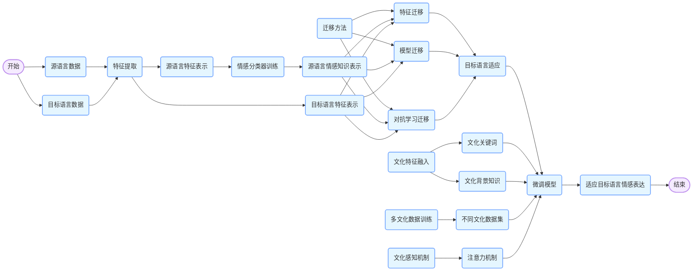

# 提升AI模型在跨语言情感知识迁移任务中的文化适应性

> 关键词：AI模型、跨语言情感知识迁移、文化适应性、情感分析、迁移学习

> 摘要：本文聚焦于提升AI模型在跨语言情感知识迁移任务中的文化适应性这一核心问题。首先介绍了该研究的背景、目的、预期读者和文档结构，明确相关术语。接着阐述核心概念与联系，包括跨语言情感知识迁移和文化适应性的原理及架构，并给出相应的文本示意图和Mermaid流程图。详细讲解核心算法原理，结合Python源代码进行说明，同时介绍相关数学模型和公式并举例。通过项目实战，从开发环境搭建、源代码实现与解读等方面进行分析。探讨实际应用场景，推荐学习资源、开发工具框架和相关论文著作。最后总结未来发展趋势与挑战，提供常见问题解答和扩展阅读参考资料，旨在为研究者和开发者提供全面深入的指导。

## 1. 背景介绍 
### 1.1 目的和范围
在全球化的背景下，信息传播跨越了语言和文化的界限。AI模型在情感分析任务中已经取得了显著进展，但在跨语言场景下，由于不同语言和文化之间的差异，模型的性能往往受到限制。本研究的目的是提升AI模型在跨语言情感知识迁移任务中的文化适应性，使得模型能够在不同语言和文化环境中准确地进行情感分析。

本研究的范围涵盖了跨语言情感知识迁移的主要方法、文化适应性的影响因素、相关算法和模型的研究与实践。通过对这些方面的深入探讨，为提高AI模型在跨语言情感分析中的性能提供理论和实践支持。

### 1.2 预期读者
本文的预期读者包括AI领域的研究者、机器学习工程师、自然语言处理开发者以及对跨语言情感分析和文化适应性感兴趣的技术爱好者。对于正在从事相关研究或开发工作的专业人员，本文可以提供有价值的技术思路和实践经验；对于初学者，本文可以作为了解该领域的入门指南。

### 1.3 文档结构概述
本文将按照以下结构进行组织：
1. **背景介绍**：阐述研究的目的、范围、预期读者和文档结构，明确相关术语。
2. **核心概念与联系**：解释跨语言情感知识迁移和文化适应性的核心概念，给出原理和架构的文本示意图和Mermaid流程图。
3. **核心算法原理 & 具体操作步骤**：详细讲解用于提升文化适应性的核心算法原理，结合Python源代码进行说明。
4. **数学模型和公式 & 详细讲解 & 举例说明**：介绍相关的数学模型和公式，并通过具体例子进行详细讲解。
5. **项目实战：代码实际案例和详细解释说明**：通过一个实际项目，展示如何搭建开发环境、实现源代码并进行代码解读。
6. **实际应用场景**：探讨提升文化适应性的AI模型在不同领域的实际应用场景。
7. **工具和资源推荐**：推荐学习资源、开发工具框架和相关论文著作。
8. **总结：未来发展趋势与挑战**：总结研究成果，分析未来发展趋势和面临的挑战。
9. **附录：常见问题与解答**：提供常见问题的解答，帮助读者更好地理解和应用相关技术。
10. **扩展阅读 & 参考资料**：列出扩展阅读的资料和参考文献，方便读者进一步深入研究。

### 1.4 术语表
#### 1.4.1 核心术语定义
- **跨语言情感知识迁移**：指将在一种语言上学习到的情感知识应用到其他语言上的过程，旨在提高模型在不同语言下的情感分析能力。
- **文化适应性**：指AI模型能够考虑到不同文化背景下的语言表达和情感理解差异，从而更准确地进行情感分析的能力。
- **情感分析**：对文本中表达的情感倾向（如积极、消极、中性）进行识别和分类的任务。
- **迁移学习**：一种机器学习技术，通过利用已有的知识和经验来加速在新任务上的学习过程。

#### 1.4.2 相关概念解释
- **语言模型**：一种基于大量文本数据训练得到的模型，用于预测下一个词或生成文本。在跨语言情感知识迁移中，语言模型可以作为基础模型提供语言表示。
- **多语言嵌入**：将不同语言的词汇或句子映射到同一个向量空间中的技术，使得不同语言之间可以进行比较和计算。
- **文化特征**：反映不同文化背景下的价值观、信仰、习俗等方面的特征，这些特征会影响语言表达和情感理解。

#### 1.4.3 缩略词列表
- **NLP**：Natural Language Processing，自然语言处理
- **ML**：Machine Learning，机器学习
- **DL**：Deep Learning，深度学习
- **BERT**：Bidirectional Encoder Representations from Transformers，一种基于Transformer的预训练语言模型
- **XLM**：Cross - Lingual Language Model，跨语言语言模型

## 2. 核心概念与联系 
### 2.1 跨语言情感知识迁移原理
跨语言情感知识迁移的核心思想是利用源语言（通常是数据丰富的语言）上学习到的情感知识，帮助模型在目标语言（数据相对较少的语言）上进行情感分析。其基本原理可以分为以下几个步骤：

1. **特征提取**：使用预训练的语言模型（如BERT、XLM等）对源语言和目标语言的文本进行特征提取，将文本转换为向量表示。
2. **知识表示**：在源语言上训练情感分类器，学习情感知识的表示。这些表示可以是情感标签的概率分布、情感特征向量等。
3. **迁移方法**：通过不同的迁移方法将源语言的情感知识迁移到目标语言上。常见的方法包括基于特征的迁移、基于模型的迁移和基于对抗学习的迁移等。
4. **目标语言适应**：在目标语言上对迁移后的模型进行微调，使其适应目标语言的特点和情感表达。

### 2.2 文化适应性原理
文化适应性要求AI模型能够理解不同文化背景下的语言表达和情感含义。不同文化在情感表达上存在差异，例如某些文化更倾向于含蓄表达情感，而另一些文化则更直接。为了实现文化适应性，可以从以下几个方面入手：

1. **文化特征融入**：在模型训练过程中，融入反映不同文化特征的信息，如文化关键词、文化背景知识等。
2. **多文化数据训练**：使用来自不同文化背景的数据集进行训练，让模型学习到不同文化下的情感表达模式。
3. **文化感知机制**：设计具有文化感知能力的模型结构，例如引入注意力机制来关注与文化相关的信息。

### 2.3 核心概念架构的文本示意图
```plaintext
跨语言情感知识迁移
|-- 源语言数据
|   |-- 特征提取（预训练语言模型）
|   |   |-- 源语言特征表示
|   |-- 情感分类器训练
|       |-- 源语言情感知识表示
|-- 目标语言数据
|   |-- 特征提取（预训练语言模型）
|   |   |-- 目标语言特征表示
|-- 迁移方法
|   |-- 特征迁移
|   |-- 模型迁移
|   |-- 对抗学习迁移
|-- 目标语言适应
|   |-- 微调模型
|   |   |-- 适应目标语言情感表达

文化适应性
|-- 文化特征融入
|   |-- 文化关键词
|   |-- 文化背景知识
|-- 多文化数据训练
|   |-- 不同文化数据集
|-- 文化感知机制
|   |-- 注意力机制
```

### 2.4 Mermaid流程图


## 3. 核心算法原理 & 具体操作步骤 
### 3.1 基于对抗学习的跨语言情感知识迁移算法原理
基于对抗学习的跨语言情感知识迁移算法的核心思想是通过一个对抗训练的过程，使得模型能够学习到与语言无关的情感特征，从而实现跨语言的情感知识迁移。具体原理如下：

1. **特征提取器**：使用预训练的语言模型（如BERT）作为特征提取器，将源语言和目标语言的文本转换为特征向量。
2. **情感分类器**：在源语言上训练一个情感分类器，用于对文本的情感进行分类。
3. **领域判别器**：引入一个领域判别器，用于判断特征向量是来自源语言还是目标语言。
4. **对抗训练**：在训练过程中，特征提取器和情感分类器试图欺骗领域判别器，使得领域判别器无法准确区分特征向量的来源；而领域判别器则试图准确区分特征向量的来源。通过这种对抗训练的过程，特征提取器能够学习到与语言无关的情感特征。

### 3.2 具体操作步骤
#### 步骤1：数据准备
准备源语言和目标语言的情感数据集，每个数据集包含文本和对应的情感标签。对数据进行预处理，如分词、去除停用词等。

#### 步骤2：模型初始化
初始化特征提取器、情感分类器和领域判别器。可以使用预训练的BERT模型作为特征提取器，情感分类器和领域判别器可以使用全连接神经网络。

#### 步骤3：训练过程
- **前向传播**：将源语言和目标语言的文本输入到特征提取器中，得到特征向量。将源语言的特征向量输入到情感分类器中，计算情感分类损失；将源语言和目标语言的特征向量输入到领域判别器中，计算领域判别损失。
- **反向传播**：根据情感分类损失和领域判别损失，更新特征提取器、情感分类器和领域判别器的参数。在更新特征提取器的参数时，需要对领域判别损失取负，以实现对抗训练的目的。

#### 步骤4：模型评估
在目标语言的测试集上评估迁移后的模型的性能，使用准确率、召回率、F1值等指标进行评估。

### 3.3 Python源代码实现
```python
import torch
import torch.nn as nn
import torch.optim as optim
from transformers import BertTokenizer, BertModel

# 定义特征提取器
class FeatureExtractor(nn.Module):
    def __init__(self):
        super(FeatureExtractor, self).__init__()
        self.bert = BertModel.from_pretrained('bert-base-multilingual-cased')

    def forward(self, input_ids, attention_mask):
        outputs = self.bert(input_ids=input_ids, attention_mask=attention_mask)
        pooled_output = outputs.pooler_output
        return pooled_output

# 定义情感分类器
class SentimentClassifier(nn.Module):
    def __init__(self, input_dim, num_classes):
        super(SentimentClassifier, self).__init__()
        self.fc = nn.Linear(input_dim, num_classes)

    def forward(self, x):
        logits = self.fc(x)
        return logits

# 定义领域判别器
class DomainDiscriminator(nn.Module):
    def __init__(self, input_dim):
        super(DomainDiscriminator, self).__init__()
        self.fc = nn.Linear(input_dim, 1)
        self.sigmoid = nn.Sigmoid()

    def forward(self, x):
        logits = self.fc(x)
        domain_pred = self.sigmoid(logits)
        return domain_pred

# 训练函数
def train_model(feature_extractor, sentiment_classifier, domain_discriminator,
                source_dataloader, target_dataloader, num_epochs, lr):
    criterion_sentiment = nn.CrossEntropyLoss()
    criterion_domain = nn.BCELoss()
    optimizer = optim.Adam(list(feature_extractor.parameters()) +
                           list(sentiment_classifier.parameters()) +
                           list(domain_discriminator.parameters()), lr=lr)

    for epoch in range(num_epochs):
        feature_extractor.train()
        sentiment_classifier.train()
        domain_discriminator.train()

        for (source_inputs, source_labels), (target_inputs, _) in zip(source_dataloader, target_dataloader):
            source_input_ids = source_inputs['input_ids']
            source_attention_mask = source_inputs['attention_mask']
            target_input_ids = target_inputs['input_ids']
            target_attention_mask = target_inputs['attention_mask']

            # 前向传播
            source_features = feature_extractor(source_input_ids, source_attention_mask)
            target_features = feature_extractor(target_input_ids, target_attention_mask)

            # 情感分类损失
            sentiment_logits = sentiment_classifier(source_features)
            sentiment_loss = criterion_sentiment(sentiment_logits, source_labels)

            # 领域判别损失
            source_domain_labels = torch.ones(source_features.size(0), 1)
            target_domain_labels = torch.zeros(target_features.size(0), 1)
            source_domain_pred = domain_discriminator(source_features)
            target_domain_pred = domain_discriminator(target_features)
            domain_loss = criterion_domain(source_domain_pred, source_domain_labels) + \
                          criterion_domain(target_domain_pred, target_domain_labels)

            # 总损失
            total_loss = sentiment_loss + domain_loss

            # 反向传播
            optimizer.zero_grad()
            total_loss.backward()
            optimizer.step()

        print(f'Epoch {epoch + 1}/{num_epochs}, Loss: {total_loss.item()}')

    return feature_extractor, sentiment_classifier
```

## 4. 数学模型和公式 & 详细讲解 & 举例说明 
### 4.1 情感分类损失函数
情感分类损失函数用于衡量情感分类器的预测结果与真实标签之间的差异。常用的损失函数是交叉熵损失函数，其数学公式如下：

$$L_{s} = -\frac{1}{N}\sum_{i=1}^{N}\sum_{j=1}^{C}y_{ij}\log(p_{ij})$$

其中，$N$ 是样本数量，$C$ 是情感类别数量，$y_{ij}$ 是第 $i$ 个样本属于第 $j$ 类的真实标签（$y_{ij} \in \{0, 1\}$），$p_{ij}$ 是情感分类器对第 $i$ 个样本属于第 $j$ 类的预测概率。

例如，假设有一个情感分类任务，情感类别有3类（积极、消极、中性），有2个样本，其真实标签分别为 $[1, 0, 0]$ 和 $[0, 1, 0]$，情感分类器的预测概率分别为 $[0.8, 0.1, 0.1]$ 和 $[0.2, 0.7, 0.1]$。则情感分类损失为：

$$L_{s} = -\frac{1}{2}[(1\times\log(0.8) + 0\times\log(0.1) + 0\times\log(0.1)) + (0\times\log(0.2) + 1\times\log(0.7) + 0\times\log(0.1))]$$

### 4.2 领域判别损失函数
领域判别损失函数用于衡量领域判别器的预测结果与真实领域标签之间的差异。常用的损失函数是二元交叉熵损失函数，其数学公式如下：

$$L_{d} = -\frac{1}{N_{s}+N_{t}}[\sum_{i=1}^{N_{s}}y_{s_{i}}\log(p_{s_{i}}) + \sum_{i=1}^{N_{t}}(1 - y_{t_{i}})\log(1 - p_{t_{i}})]$$

其中，$N_{s}$ 和 $N_{t}$ 分别是源语言和目标语言的样本数量，$y_{s_{i}}$ 和 $y_{t_{i}}$ 分别是源语言和目标语言样本的真实领域标签（源语言为1，目标语言为0），$p_{s_{i}}$ 和 $p_{t_{i}}$ 分别是领域判别器对源语言和目标语言样本属于源领域的预测概率。

例如，假设有3个源语言样本和2个目标语言样本，源语言样本的真实领域标签为 $[1, 1, 1]$，目标语言样本的真实领域标签为 $[0, 0]$，领域判别器的预测概率分别为 $[0.9, 0.8, 0.7]$ 和 $[0.2, 0.3]$。则领域判别损失为：

$$L_{d} = -\frac{1}{3 + 2}[(1\times\log(0.9) + 1\times\log(0.8) + 1\times\log(0.7)) + (1 - 0)\log(1 - 0.2) + (1 - 0)\log(1 - 0.3)]$$

### 4.3 总损失函数
总损失函数是情感分类损失和领域判别损失的加权和，其数学公式如下：

$$L = L_{s} + \lambda L_{d}$$

其中，$\lambda$ 是领域判别损失的权重系数，用于控制领域判别损失在总损失中的重要程度。

## 5. 项目实战：代码实际案例和详细解释说明 
### 5.1  开发环境搭建
#### 步骤1：安装Python
确保已经安装了Python 3.6或更高版本。可以从Python官方网站（https://www.python.org/downloads/）下载并安装。

#### 步骤2：创建虚拟环境
建议使用虚拟环境来管理项目的依赖。可以使用 `venv` 或 `conda` 来创建虚拟环境。以下是使用 `venv` 创建虚拟环境的示例：

```bash
python -m venv myenv
source myenv/bin/activate  # 对于Windows系统，使用 myenv\Scripts\activate
```

#### 步骤3：安装依赖库
在虚拟环境中安装项目所需的依赖库，包括 `torch`、`transformers` 等。可以使用 `pip` 进行安装：

```bash
pip install torch transformers
```

### 5.2  源代码详细实现和代码解读
```python
import torch
import torch.nn as nn
import torch.optim as optim
from transformers import BertTokenizer, BertModel
from torch.utils.data import DataLoader, Dataset

# 定义数据集类
class SentimentDataset(Dataset):
    def __init__(self, texts, labels, tokenizer, max_length):
        self.texts = texts
        self.labels = labels
        self.tokenizer = tokenizer
        self.max_length = max_length

    def __len__(self):
        return len(self.texts)

    def __getitem__(self, idx):
        text = self.texts[idx]
        label = self.labels[idx]
        encoding = self.tokenizer.encode_plus(
            text,
            add_special_tokens=True,
            max_length=self.max_length,
            padding='max_length',
            truncation=True,
            return_tensors='pt'
        )
        input_ids = encoding['input_ids'].flatten()
        attention_mask = encoding['attention_mask'].flatten()
        return {'input_ids': input_ids, 'attention_mask': attention_mask}, torch.tensor(label, dtype=torch.long)

# 定义特征提取器
class FeatureExtractor(nn.Module):
    def __init__(self):
        super(FeatureExtractor, self).__init__()
        self.bert = BertModel.from_pretrained('bert-base-multilingual-cased')

    def forward(self, input_ids, attention_mask):
        outputs = self.bert(input_ids=input_ids, attention_mask=attention_mask)
        pooled_output = outputs.pooler_output
        return pooled_output

# 定义情感分类器
class SentimentClassifier(nn.Module):
    def __init__(self, input_dim, num_classes):
        super(SentimentClassifier, self).__init__()
        self.fc = nn.Linear(input_dim, num_classes)

    def forward(self, x):
        logits = self.fc(x)
        return logits

# 定义领域判别器
class DomainDiscriminator(nn.Module):
    def __init__(self, input_dim):
        super(DomainDiscriminator, self).__init__()
        self.fc = nn.Linear(input_dim, 1)
        self.sigmoid = nn.Sigmoid()

    def forward(self, x):
        logits = self.fc(x)
        domain_pred = self.sigmoid(logits)
        return domain_pred

# 训练函数
def train_model(feature_extractor, sentiment_classifier, domain_discriminator,
                source_dataloader, target_dataloader, num_epochs, lr):
    criterion_sentiment = nn.CrossEntropyLoss()
    criterion_domain = nn.BCELoss()
    optimizer = optim.Adam(list(feature_extractor.parameters()) +
                           list(sentiment_classifier.parameters()) +
                           list(domain_discriminator.parameters()), lr=lr)

    for epoch in range(num_epochs):
        feature_extractor.train()
        sentiment_classifier.train()
        domain_discriminator.train()

        for (source_inputs, source_labels), (target_inputs, _) in zip(source_dataloader, target_dataloader):
            source_input_ids = source_inputs['input_ids']
            source_attention_mask = source_inputs['attention_mask']
            target_input_ids = target_inputs['input_ids']
            target_attention_mask = target_inputs['attention_mask']

            # 前向传播
            source_features = feature_extractor(source_input_ids, source_attention_mask)
            target_features = feature_extractor(target_input_ids, target_attention_mask)

            # 情感分类损失
            sentiment_logits = sentiment_classifier(source_features)
            sentiment_loss = criterion_sentiment(sentiment_logits, source_labels)

            # 领域判别损失
            source_domain_labels = torch.ones(source_features.size(0), 1)
            target_domain_labels = torch.zeros(target_features.size(0), 1)
            source_domain_pred = domain_discriminator(source_features)
            target_domain_pred = domain_discriminator(target_features)
            domain_loss = criterion_domain(source_domain_pred, source_domain_labels) + \
                          criterion_domain(target_domain_pred, target_domain_labels)

            # 总损失
            total_loss = sentiment_loss + domain_loss

            # 反向传播
            optimizer.zero_grad()
            total_loss.backward()
            optimizer.step()

        print(f'Epoch {epoch + 1}/{num_epochs}, Loss: {total_loss.item()}')

    return feature_extractor, sentiment_classifier

# 主函数
if __name__ == '__main__':
    # 数据准备
    source_texts = ['This is a great movie', 'The food is terrible']
    source_labels = [1, 0]
    target_texts = ['Este es un gran partido', 'La comida es asquerosa']
    target_labels = [1, 0]

    tokenizer = BertTokenizer.from_pretrained('bert-base-multilingual-cased')
    max_length = 128

    source_dataset = SentimentDataset(source_texts, source_labels, tokenizer, max_length)
    target_dataset = SentimentDataset(target_texts, target_labels, tokenizer, max_length)

    source_dataloader = DataLoader(source_dataset, batch_size=2, shuffle=True)
    target_dataloader = DataLoader(target_dataset, batch_size=2, shuffle=True)

    # 模型初始化
    feature_extractor = FeatureExtractor()
    sentiment_classifier = SentimentClassifier(input_dim=768, num_classes=2)
    domain_discriminator = DomainDiscriminator(input_dim=768)

    # 训练模型
    num_epochs = 5
    lr = 1e-5
    trained_feature_extractor, trained_sentiment_classifier = train_model(
        feature_extractor, sentiment_classifier, domain_discriminator,
        source_dataloader, target_dataloader, num_epochs, lr
    )
```

### 5.3  代码解读与分析
#### 数据集类 `SentimentDataset`
该类继承自 `torch.utils.data.Dataset`，用于封装文本数据和对应的标签。在 `__getitem__` 方法中，使用 `BertTokenizer` 对文本进行编码，将文本转换为输入ID和注意力掩码。

#### 特征提取器 `FeatureExtractor`
使用预训练的 `BertModel` 作为特征提取器，将输入的文本转换为特征向量。

#### 情感分类器 `SentimentClassifier`
使用一个全连接层将特征向量映射到情感类别上，输出情感分类的对数概率。

#### 领域判别器 `DomainDiscriminator`
使用一个全连接层和一个Sigmoid激活函数，将特征向量映射到一个概率值，表示该特征向量来自源语言的概率。

#### 训练函数 `train_model`
在训练过程中，通过前向传播计算情感分类损失和领域判别损失，然后通过反向传播更新模型的参数。

#### 主函数
准备源语言和目标语言的数据集，创建数据加载器，初始化模型，调用训练函数进行模型训练。

## 6. 实际应用场景 
### 6.1 跨境电商
在跨境电商平台上，用户来自不同的国家和地区，使用不同的语言进行商品评价和交流。提升AI模型在跨语言情感知识迁移任务中的文化适应性，可以帮助平台更好地理解用户的情感和需求，例如对商品的满意度、对服务的评价等。平台可以根据用户的情感反馈，优化商品推荐、改进服务质量，提高用户满意度和忠诚度。

### 6.2 国际新闻分析
国际新闻涉及到不同国家和地区的事件和观点，语言和文化背景差异较大。通过提升AI模型的文化适应性，可以更准确地分析国际新闻中的情感倾向，例如对某个国家政策的态度、对国际事件的评价等。这有助于媒体机构、政府部门和企业了解国际舆论动态，做出更明智的决策。

### 6.3 跨国社交媒体分析
社交媒体是人们交流和表达情感的重要平台，跨国社交媒体上的用户使用不同的语言和文化进行互动。提升AI模型的文化适应性，可以帮助企业和品牌了解不同国家和地区用户的情感和需求，进行精准的市场推广和品牌建设。例如，分析用户对某个品牌的评价和反馈，及时调整营销策略。

### 6.4 跨文化教育
在跨文化教育中，学生来自不同的文化背景，使用不同的语言进行学习和交流。提升AI模型的文化适应性，可以帮助教育机构和教师更好地理解学生的情感和需求，例如学习的积极性、对课程的满意度等。教师可以根据学生的情感反馈，调整教学方法和内容，提高教学效果。

## 7. 工具和资源推荐
### 7.1 学习资源推荐
#### 7.1.1 书籍推荐
- 《自然语言处理入门》：这本书系统地介绍了自然语言处理的基本概念、方法和技术，适合初学者入门。
- 《深度学习》：由Ian Goodfellow、Yoshua Bengio和Aaron Courville所著，是深度学习领域的经典教材，涵盖了深度学习的理论和实践。
- 《跨语言自然语言处理》：详细介绍了跨语言自然语言处理的相关技术和方法，对于跨语言情感知识迁移的研究有很大的帮助。

#### 7.1.2 在线课程
- Coursera上的“Natural Language Processing Specialization”：由斯坦福大学的教授授课，系统地介绍了自然语言处理的各个方面。
- edX上的“Deep Learning for Natural Language Processing”：介绍了深度学习在自然语言处理中的应用，包括情感分析、机器翻译等。
- 哔哩哔哩上的一些自然语言处理相关的视频教程，例如“NLP从入门到实践”等，适合初学者快速入门。

#### 7.1.3 技术博客和网站
- Medium：上面有很多关于自然语言处理和机器学习的技术博客，例如Towards Data Science、The AI Blog等。
- arXiv：是一个预印本数据库，上面有很多最新的自然语言处理和机器学习的研究论文。
- Hugging Face：提供了丰富的自然语言处理模型和工具，同时也有很多相关的技术文档和教程。

### 7.2 开发工具框架推荐
#### 7.2.1 IDE和编辑器
- PyCharm：是一款专业的Python集成开发环境，提供了丰富的代码编辑、调试和项目管理功能。
- Visual Studio Code：是一款轻量级的代码编辑器，支持多种编程语言，有很多实用的插件可以扩展功能。
- Jupyter Notebook：是一个交互式的开发环境，适合进行数据分析和模型实验。

#### 7.2.2 调试和性能分析工具
- PyTorch Profiler：是PyTorch自带的性能分析工具，可以帮助开发者分析模型的运行时间、内存使用等情况。
- TensorBoard：是TensorFlow的可视化工具，也可以用于PyTorch模型的可视化和性能分析。
- PDB：是Python自带的调试工具，可以帮助开发者调试代码。

#### 7.2.3 相关框架和库
- PyTorch：是一个开源的深度学习框架，提供了丰富的神经网络层和优化算法，方便开发者进行模型开发和训练。
- Transformers：是Hugging Face开发的一个自然语言处理库，提供了很多预训练的语言模型，如BERT、GPT等，方便开发者进行跨语言情感知识迁移任务。
- Scikit-learn：是一个开源的机器学习库，提供了很多常用的机器学习算法和工具，如分类、回归、聚类等。

### 7.3 相关论文著作推荐
#### 7.3.1 经典论文
- “BERT: Pre-training of Deep Bidirectional Transformers for Language Understanding”：介绍了BERT模型的预训练和微调方法，是自然语言处理领域的经典论文。
- “Unsupervised Cross-lingual Representation Learning at Scale”：提出了一种大规模无监督跨语言表示学习的方法，对于跨语言情感知识迁移有重要的启示。
- “Domain-Adversarial Training of Neural Networks”：介绍了基于对抗学习的领域自适应方法，是跨语言情感知识迁移中常用的技术。

#### 7.3.2 最新研究成果
- 在ACL（Association for Computational Linguistics）、EMNLP（Conference on Empirical Methods in Natural Language Processing）等自然语言处理顶级会议上发表的最新研究成果，关注跨语言情感知识迁移和文化适应性的相关论文。
- arXiv上的最新预印本论文，及时了解该领域的最新研究动态。

#### 7.3.3 应用案例分析
- 一些知名企业和研究机构发布的关于跨语言情感分析和文化适应性的应用案例分析报告，例如Google、Facebook等公司的相关研究报告，可以了解实际应用中的问题和解决方案。

## 8. 总结：未来发展趋势与挑战
### 8.1 未来发展趋势
#### 多模态融合
未来的AI模型可能会融合文本、图像、语音等多种模态的信息，以更全面地理解不同文化背景下的情感表达。例如，在分析社交媒体上的用户情感时，结合用户发布的图片和文字信息，提高情感分析的准确性。

#### 知识图谱的应用
知识图谱可以提供丰富的常识和文化知识，将知识图谱与跨语言情感知识迁移模型相结合，可以帮助模型更好地理解文本中的语义和文化背景，提升文化适应性。

#### 强化学习的引入
强化学习可以通过与环境的交互不断优化模型的决策，将强化学习引入跨语言情感知识迁移任务中，可以让模型在不同的文化环境中自动调整策略，提高情感分析的性能。

### 8.2 挑战
#### 文化数据的稀缺性
不同文化背景下的数据收集和标注是一项具有挑战性的任务，尤其是一些小众文化的数据更为稀缺。缺乏足够的文化数据会影响模型的训练效果和文化适应性。

#### 文化差异的复杂性
文化差异不仅体现在语言表达上，还涉及到价值观、信仰、习俗等多个方面，这些差异非常复杂，难以用简单的模型和方法来表示和处理。

#### 模型的可解释性
随着模型的复杂度不断增加，模型的可解释性变得越来越重要。在跨语言情感知识迁移任务中，如何解释模型的决策过程和结果，尤其是在考虑文化适应性的情况下，是一个亟待解决的问题。

## 9. 附录：常见问题与解答
### 9.1 问题1：如何选择合适的预训练语言模型？
解答：选择预训练语言模型时，需要考虑以下几个因素：
- 语言覆盖范围：如果需要处理多种语言，选择支持多语言的预训练模型，如Bert - base - multilingual - cased。
- 模型大小和性能：较大的模型通常具有更好的性能，但也需要更多的计算资源和时间。根据实际需求选择合适大小的模型。
- 任务类型：不同的预训练模型在不同的任务上可能表现不同。可以参考相关的研究论文和实验结果，选择在情感分析任务上表现较好的模型。

### 9.2 问题2：如何处理不同文化背景下的词汇差异？
解答：可以采用以下方法处理不同文化背景下的词汇差异：
- 多语言嵌入：使用多语言嵌入技术将不同语言的词汇映射到同一个向量空间中，使得模型能够学习到不同语言词汇之间的语义关系。
- 文化特征编码：在模型中引入文化特征编码，将文化信息融入到词汇表示中，帮助模型更好地理解不同文化背景下的词汇含义。
- 数据增强：通过数据增强的方法，增加不同文化背景下的词汇和表达方式，让模型学习到更丰富的语言知识。

### 9.3 问题3：如何评估模型的文化适应性？
解答：可以从以下几个方面评估模型的文化适应性：
- 准确率：在不同文化背景的测试集上评估模型的情感分类准确率，准确率越高说明模型的文化适应性越好。
- 文化敏感性：设计一些具有文化敏感性的测试样本，评估模型对不同文化背景下情感表达的理解能力。
- 用户反馈：收集用户的反馈意见，了解模型在实际应用中的表现和文化适应性。

## 10. 扩展阅读 & 参考资料
### 10.1 扩展阅读
- 《文化语言学》：深入探讨语言与文化之间的关系，对于理解不同文化背景下的语言表达和情感分析有很大的帮助。
- 《情感计算》：介绍了情感计算的基本概念、方法和应用，为跨语言情感知识迁移提供了更广阔的视角。
- 《人工智能与文化》：探讨了人工智能在文化领域的应用和挑战，对于思考AI模型的文化适应性有重要的启示。

### 10.2 参考资料
- Devlin, J., Chang, M. - W., Lee, K., & Toutanova, K. (2018). BERT: Pre - training of Deep Bidirectional Transformers for Language Understanding. arXiv preprint arXiv:1810.04805.
- Conneau, A., Khandelwal, K., Goyal, N., Chaudhary, V., Wenzek, G., Guzmán, F.,... & Stoyanov, V. (2019). Unsupervised Cross - lingual Representation Learning at Scale. arXiv preprint arXiv:1911.02116.
- Ganin, Y., & Lempitsky, V. (2015). Domain - Adversarial Training of Neural Networks. The Journal of Machine Learning Research, 17(1), 2096 - 2030.

作者：AI天才研究院/AI Genius Institute & 禅与计算机程序设计艺术 /Zen And The Art of Computer Programming