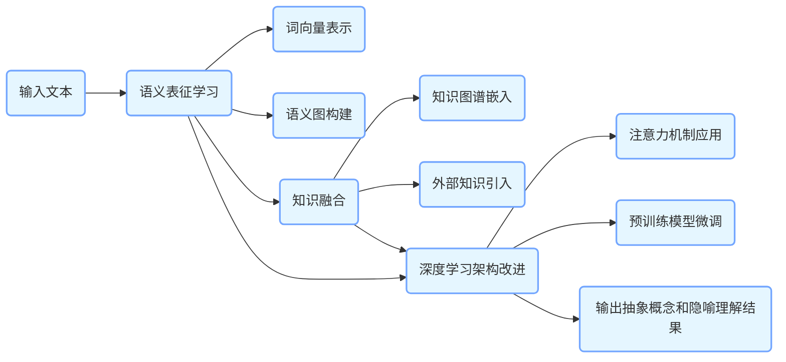

# 提升AI模型对抽象概念和隐喻理解能力的方法

> 关键词：AI模型、抽象概念理解、隐喻理解、提升方法、语义表征

> 摘要：本文聚焦于提升AI模型对抽象概念和隐喻理解能力的方法。首先介绍了研究该问题的背景、目的、预期读者等信息。接着阐述了抽象概念和隐喻理解的核心概念及它们之间的联系，并给出了相应的原理和架构示意图与流程图。详细讲解了用于提升理解能力的核心算法原理，通过Python代码进行了说明，同时给出了相关的数学模型和公式并举例。通过项目实战，展示了具体的代码实现和解读。探讨了这些能力在实际中的应用场景，推荐了学习资源、开发工具框架以及相关论文著作。最后总结了未来发展趋势与挑战，解答了常见问题，并提供了扩展阅读和参考资料，旨在为提升AI模型对抽象概念和隐喻的理解能力提供全面且深入的指导。

## 1. 背景介绍 
### 1.1 目的和范围
随着人工智能技术的不断发展，AI模型在自然语言处理、图像识别等众多领域取得了显著的成果。然而，目前的AI模型在理解抽象概念和隐喻方面仍存在较大的局限性。抽象概念和隐喻是人类语言和思维中非常重要的组成部分，它们往往蕴含着丰富的语义信息和文化内涵。提升AI模型对抽象概念和隐喻的理解能力，有助于提高AI系统在自然语言交互、文本分析、智能写作等方面的性能，使其能够更好地模拟人类的思维和语言理解能力。

本文的范围主要涵盖了提升AI模型对抽象概念和隐喻理解能力的各种方法，包括基于语义表征、知识融合、深度学习架构改进等方面的技术。同时，通过项目实战展示这些方法的实际应用，并探讨其在不同领域的应用场景。

### 1.2 预期读者
本文预期读者包括人工智能领域的研究人员、开发者、学生以及对AI技术感兴趣的专业人士。对于研究人员，本文可以提供关于提升AI模型理解能力的最新研究思路和方法；对于开发者，能够为他们在实际项目中应用相关技术提供具体的实现指导；对于学生，有助于他们深入了解AI模型的相关知识和技术原理。

### 1.3 文档结构概述
本文将按照以下结构进行阐述：
1. 背景介绍：说明研究目的、预期读者和文档结构。
2. 核心概念与联系：解释抽象概念和隐喻的核心概念，以及它们之间的联系，并给出相应的原理和架构示意图与流程图。
3. 核心算法原理 & 具体操作步骤：介绍提升理解能力的核心算法原理，通过Python代码详细阐述具体操作步骤。
4. 数学模型和公式 & 详细讲解 & 举例说明：给出相关的数学模型和公式，并进行详细讲解和举例。
5. 项目实战：代码实际案例和详细解释说明：通过实际项目展示代码实现和解读。
6. 实际应用场景：探讨提升理解能力在不同领域的实际应用场景。
7. 工具和资源推荐：推荐学习资源、开发工具框架以及相关论文著作。
8. 总结：未来发展趋势与挑战：总结提升AI模型理解能力的未来发展趋势和面临的挑战。
9. 附录：常见问题与解答：解答读者可能遇到的常见问题。
10. 扩展阅读 & 参考资料：提供扩展阅读的建议和参考资料。

### 1.4 术语表
#### 1.4.1 核心术语定义
- **抽象概念**：是指从具体事物中抽象出来的、具有普遍意义的概念，如“爱”“自由”“正义”等，它们不对应具体的物理实体，而是反映了人类对世界的认知和思考。
- **隐喻**：是一种修辞手法，通过将一个概念（源域）的特征映射到另一个概念（目标域）上，来表达一种隐含的意义。例如，“时间就是金钱”，将“时间”和“金钱”两个概念建立了隐喻关系。
- **语义表征**：是指将语言或其他信息转化为计算机能够处理的表示形式，以便进行语义分析和推理。
- **知识图谱**：是一种结构化的知识表示方式，它将实体、概念及其之间的关系以图的形式表示出来，用于存储和管理大量的知识。

#### 1.4.2 相关概念解释
- **词向量**：是一种将词语表示为向量的方法，通过将词语映射到低维向量空间中，使得语义相近的词语在向量空间中距离较近，从而可以进行语义计算。
- **注意力机制**：是一种在深度学习中广泛应用的机制，它可以自动地关注输入序列中的重要部分，从而提高模型的性能。
- **预训练模型**：是指在大规模语料上进行无监督学习训练得到的模型，这些模型可以学习到丰富的语言知识和语义信息，然后在具体任务上进行微调，以提高任务的性能。

#### 1.4.3 缩略词列表
- **NLP**：Natural Language Processing，自然语言处理
- **BERT**：Bidirectional Encoder Representations from Transformers，基于Transformer的双向编码器表征
- **GPT**：Generative Pretrained Transformer，生成式预训练Transformer

## 2. 核心概念与联系 

### 抽象概念的本质
抽象概念是人类认知世界的高级形式，它超越了具体的感知经验，是对一类事物或现象的共同特征和本质属性的概括和提炼。抽象概念的形成依赖于人类的思维能力和语言表达能力，通过对具体事物的观察、比较、分析和归纳，人们逐渐形成了各种抽象概念。例如，“美”这个抽象概念，它没有具体的形态和特征，但是人们可以通过对各种美的事物（如美丽的风景、优美的音乐、高尚的品德等）的感知和体验，来理解和把握“美”的含义。

### 隐喻的工作机制
隐喻是一种基于人类认知和思维的语言现象，它的工作机制主要基于概念映射和认知推理。在隐喻表达中，源域和目标域之间存在着某种相似性或相关性，通过将源域的结构、特征和知识映射到目标域上，人们可以借助对源域的理解来更好地理解目标域。例如，在“人生是一场旅行”这个隐喻中，“旅行”是源域，“人生”是目标域。旅行具有起点、终点、路线、风景等特征，通过将这些特征映射到人生中，人们可以将人生看作是一个有起点和终点、充满各种经历和挑战的过程，从而更好地理解人生的意义和价值。

### 抽象概念与隐喻的联系
抽象概念和隐喻之间存在着密切的联系。一方面，隐喻是表达和理解抽象概念的重要手段。由于抽象概念本身比较抽象和难以直接理解，人们常常借助隐喻来将抽象概念转化为具体、形象的表达方式，从而更容易理解和把握。例如，通过“时间就是金钱”这个隐喻，人们可以将抽象的“时间”概念与具体的“金钱”概念联系起来，从而更好地理解时间的宝贵和有限性。另一方面，抽象概念的形成和发展也受到隐喻的影响。隐喻可以为抽象概念提供新的视角和理解方式，促进抽象概念的不断丰富和深化。

### 核心概念原理和架构的文本示意图
```plaintext
+----------------------+
|  抽象概念和隐喻理解  |
+----------------------+
|  语义表征学习        |
|  | 词向量表示         |
|  | 语义图构建         |
+----------------------+
|  知识融合            |
|  | 知识图谱嵌入       |
|  | 外部知识引入       |
+----------------------+
|  深度学习架构改进    |
|  | 注意力机制应用     |
|  | 预训练模型微调     |
+----------------------+
```

### Mermaid 流程图


## 3. 核心算法原理 & 具体操作步骤 

### 语义表征学习算法
#### 词向量表示
词向量表示是将词语映射到低维向量空间中的一种方法，常见的词向量模型有Word2Vec、GloVe等。下面以Word2Vec为例，介绍其算法原理和Python代码实现。

Word2Vec的核心思想是通过神经网络来学习词语的上下文信息，从而得到词语的向量表示。它有两种训练模式：Skip-gram和CBOW（Continuous Bag-of-Words）。Skip-gram模型的目标是根据中心词预测其上下文词语，而CBOW模型的目标是根据上下文词语预测中心词。

以下是使用Python和`gensim`库实现Word2Vec训练的代码：
```python
from gensim.models import Word2Vec
import nltk
from nltk.tokenize import word_tokenize
nltk.download('punkt')

# 示例文本数据
sentences = [
    "I love programming in Python",
    "Python is a powerful programming language",
    "Data science is an exciting field"
]

# 分词
tokenized_sentences = [word_tokenize(sentence.lower()) for sentence in sentences]

# 训练Word2Vec模型
model = Word2Vec(sentences=tokenized_sentences, vector_size=100, window=5, min_count=1, workers=4)

# 获取词语的向量表示
vector = model.wv['python']
print("Word vector for 'python':", vector)
```
在上述代码中，首先对文本数据进行分词处理，然后使用`Word2Vec`类进行模型训练。`vector_size`参数指定了词向量的维度，`window`参数表示上下文窗口的大小，`min_count`参数表示词语出现的最小次数，`workers`参数指定了训练时使用的线程数。最后，通过`model.wv['python']`获取“python”这个词语的向量表示。

#### 语义图构建
语义图是一种用于表示词语之间语义关系的图结构，节点表示词语，边表示词语之间的语义关联。构建语义图的一种常见方法是基于词语的共现信息。以下是一个简单的Python代码示例：
```python
import networkx as nx
import nltk
from nltk.tokenize import word_tokenize
nltk.download('punkt')

# 示例文本数据
sentences = [
    "I love programming in Python",
    "Python is a powerful programming language",
    "Data science is an exciting field"
]

# 分词
tokenized_sentences = [word_tokenize(sentence.lower()) for sentence in sentences]

# 构建共现矩阵
word_cooccurrence = {}
for sentence in tokenized_sentences:
    for i in range(len(sentence)):
        for j in range(i + 1, len(sentence)):
            word1 = sentence[i]
            word2 = sentence[j]
            if word1 not in word_cooccurrence:
                word_cooccurrence[word1] = {}
            if word2 not in word_cooccurrence[word1]:
                word_cooccurrence[word1][word2] = 0
            word_cooccurrence[word1][word2] += 1
            if word2 not in word_cooccurrence:
                word_cooccurrence[word2] = {}
            if word1 not in word_cooccurrence[word2]:
                word_cooccurrence[word2][word1] = 0
            word_cooccurrence[word2][word1] += 1

# 构建语义图
G = nx.Graph()
for word1 in word_cooccurrence:
    for word2 in word_cooccurrence[word1]:
        weight = word_cooccurrence[word1][word2]
        G.add_edge(word1, word2, weight=weight)

# 可视化语义图
import matplotlib.pyplot as plt
pos = nx.spring_layout(G)
nx.draw_networkx(G, pos)
labels = nx.get_edge_attributes(G, 'weight')
nx.draw_networkx_edge_labels(G, pos, edge_labels=labels)
plt.show()
```
在上述代码中，首先对文本数据进行分词处理，然后统计词语之间的共现次数，构建共现矩阵。接着，使用`networkx`库构建语义图，节点表示词语，边的权重表示词语之间的共现次数。最后，使用`matplotlib`库可视化语义图。

### 知识融合算法
#### 知识图谱嵌入
知识图谱嵌入是将知识图谱中的实体和关系映射到低维向量空间中的一种方法，常见的知识图谱嵌入模型有TransE、DistMult等。下面以TransE为例，介绍其算法原理和Python代码实现。

TransE的核心思想是将实体和关系表示为向量，使得对于知识图谱中的三元组 $(h, r, t)$（其中 $h$ 表示头实体，$r$ 表示关系，$t$ 表示尾实体），满足 $h + r \approx t$。通过最小化这个近似误差来学习实体和关系的向量表示。

以下是使用Python和`torch`库实现TransE训练的代码：
```python
import torch
import torch.nn as nn
import torch.optim as optim

# 示例知识图谱三元组
triples = [
    ("apple", "is_a", "fruit"),
    ("banana", "is_a", "fruit"),
    ("dog", "is_a", "animal")
]

# 构建实体和关系的索引
entities = set()
relations = set()
for h, r, t in triples:
    entities.add(h)
    entities.add(t)
    relations.add(r)

entity2id = {entity: idx for idx, entity in enumerate(entities)}
relation2id = {relation: idx for idx, relation in enumerate(relations)}

# 将三元组转换为索引形式
triple_ids = []
for h, r, t in triples:
    h_id = entity2id[h]
    r_id = relation2id[r]
    t_id = entity2id[t]
    triple_ids.append((h_id, r_id, t_id))

# 定义TransE模型
class TransE(nn.Module):
    def __init__(self, num_entities, num_relations, embedding_dim):
        super(TransE, self).__init__()
        self.entity_embeddings = nn.Embedding(num_entities, embedding_dim)
        self.relation_embeddings = nn.Embedding(num_relations, embedding_dim)

    def forward(self, h, r, t):
        h_emb = self.entity_embeddings(h)
        r_emb = self.relation_embeddings(r)
        t_emb = self.entity_embeddings(t)
        score = torch.norm(h_emb + r_emb - t_emb, p=1, dim=1)
        return score

# 初始化模型、损失函数和优化器
num_entities = len(entities)
num_relations = len(relations)
embedding_dim = 50
model = TransE(num_entities, num_relations, embedding_dim)
criterion = nn.MarginRankingLoss(margin=1.0)
optimizer = optim.SGD(model.parameters(), lr=0.01)

# 训练模型
num_epochs = 100
for epoch in range(num_epochs):
    total_loss = 0
    for h_id, r_id, t_id in triple_ids:
        h = torch.tensor([h_id])
        r = torch.tensor([r_id])
        t = torch.tensor([t_id])

        # 生成负样本
        import random
        neg_t_id = random.choice(list(entity2id.values()))
        neg_t = torch.tensor([neg_t_id])

        pos_score = model(h, r, t)
        neg_score = model(h, r, neg_t)

        target = torch.tensor([-1.0])
        loss = criterion(pos_score, neg_score, target)

        optimizer.zero_grad()
        loss.backward()
        optimizer.step()

        total_loss += loss.item()

    if (epoch + 1) % 10 == 0:
        print(f'Epoch {epoch + 1}/{num_epochs}, Loss: {total_loss / len(triple_ids)}')
```
在上述代码中，首先构建了实体和关系的索引，将知识图谱三元组转换为索引形式。然后定义了TransE模型，使用`MarginRankingLoss`作为损失函数，`SGD`作为优化器。在训练过程中，对于每个正样本三元组，生成一个负样本三元组，通过最小化正样本和负样本的得分差异来更新模型参数。

#### 外部知识引入
外部知识引入是指将外部的知识源（如百科知识、领域知识等）融入到AI模型中，以增强模型对抽象概念和隐喻的理解能力。一种常见的方法是将外部知识表示为文本形式，然后与输入文本一起进行处理。以下是一个简单的示例代码：
```python
from transformers import BertTokenizer, BertForSequenceClassification
import torch

# 加载预训练模型和分词器
tokenizer = BertTokenizer.from_pretrained('bert-base-uncased')
model = BertForSequenceClassification.from_pretrained('bert-base-uncased', num_labels=2)

# 输入文本
input_text = "Time is money"
# 外部知识
external_knowledge = "Money is a valuable resource that can be used to exchange for goods and services. Time is also a limited and valuable resource."

# 合并输入文本和外部知识
combined_text = input_text + " " + external_knowledge

# 分词
inputs = tokenizer(combined_text, return_tensors='pt')

# 模型推理
outputs = model(**inputs)
logits = outputs.logits
predicted_class_id = logits.argmax().item()
print("Predicted class:", predicted_class_id)
```
在上述代码中，使用了`transformers`库中的`BertTokenizer`和`BertForSequenceClassification`模型。将输入文本和外部知识合并后进行分词处理，然后输入到模型中进行推理，得到预测结果。

### 深度学习架构改进算法
#### 注意力机制应用
注意力机制可以让模型自动地关注输入序列中的重要部分，从而提高模型对抽象概念和隐喻的理解能力。下面是一个使用注意力机制的简单示例代码：
```python
import torch
import torch.nn as nn

class Attention(nn.Module):
    def __init__(self, input_dim):
        super(Attention, self).__init__()
        self.linear = nn.Linear(input_dim, 1)
        self.softmax = nn.Softmax(dim=1)

    def forward(self, x):
        scores = self.linear(x)
        attention_weights = self.softmax(scores)
        weighted_sum = torch.sum(attention_weights * x, dim=1)
        return weighted_sum

# 示例输入
input_dim = 10
batch_size = 3
sequence_length = 5
x = torch.randn(batch_size, sequence_length, input_dim)

# 初始化注意力模块
attention = Attention(input_dim)

# 计算注意力输出
output = attention(x)
print("Attention output shape:", output.shape)
```
在上述代码中，定义了一个简单的注意力模块`Attention`，它通过线性变换和softmax函数计算注意力权重，然后对输入序列进行加权求和。

#### 预训练模型微调
预训练模型（如BERT、GPT等）在大规模语料上进行了无监督学习，学习到了丰富的语言知识和语义信息。可以在具体任务上对预训练模型进行微调，以提高模型对抽象概念和隐喻的理解能力。以下是一个使用`transformers`库对BERT模型进行微调的示例代码：
```python
from transformers import BertTokenizer, BertForSequenceClassification
import torch
from torch.utils.data import Dataset, DataLoader

# 自定义数据集类
class CustomDataset(Dataset):
    def __init__(self, texts, labels, tokenizer, max_length):
        self.texts = texts
        self.labels = labels
        self.tokenizer = tokenizer
        self.max_length = max_length

    def __len__(self):
        return len(self.texts)

    def __getitem__(self, idx):
        text = self.texts[idx]
        label = self.labels[idx]
        inputs = self.tokenizer(text, return_tensors='pt', padding='max_length', truncation=True, max_length=self.max_length)
        input_ids = inputs['input_ids'].squeeze()
        attention_mask = inputs['attention_mask'].squeeze()
        return {
            'input_ids': input_ids,
            'attention_mask': attention_mask,
            'labels': torch.tensor(label, dtype=torch.long)
        }

# 示例数据
texts = [
    "Time is money",
    "Life is a journey"
]
labels = [1, 1]

# 加载预训练模型和分词器
tokenizer = BertTokenizer.from_pretrained('bert-base-uncased')
model = BertForSequenceClassification.from_pretrained('bert-base-uncased', num_labels=2)

# 创建数据集和数据加载器
max_length = 128
dataset = CustomDataset(texts, labels, tokenizer, max_length)
dataloader = DataLoader(dataset, batch_size=2, shuffle=True)

# 定义优化器和损失函数
optimizer = torch.optim.Adam(model.parameters(), lr=2e-5)
criterion = nn.CrossEntropyLoss()

# 微调模型
num_epochs = 3
device = torch.device('cuda' if torch.cuda.is_available() else 'cpu')
model.to(device)

for epoch in range(num_epochs):
    total_loss = 0
    for batch in dataloader:
        input_ids = batch['input_ids'].to(device)
        attention_mask = batch['attention_mask'].to(device)
        labels = batch['labels'].to(device)

        optimizer.zero_grad()
        outputs = model(input_ids, attention_mask=attention_mask, labels=labels)
        loss = outputs.loss
        loss.backward()
        optimizer.step()

        total_loss += loss.item()

    print(f'Epoch {epoch + 1}/{num_epochs}, Loss: {total_loss / len(dataloader)}')
```
在上述代码中，首先定义了一个自定义数据集类`CustomDataset`，用于处理输入文本和标签。然后加载预训练的BERT模型和分词器，创建数据集和数据加载器。定义了优化器和损失函数，在具体任务上对模型进行微调。

## 4. 数学模型和公式 & 详细讲解 & 举例说明 

### 词向量表示的数学模型
#### Word2Vec的Skip-gram模型
Skip-gram模型的目标是根据中心词 $w_c$ 预测其上下文词语 $w_o$。假设词向量的维度为 $d$，中心词 $w_c$ 的词向量表示为 $\mathbf{v}_c \in \mathbb{R}^d$，上下文词语 $w_o$ 的词向量表示为 $\mathbf{u}_o \in \mathbb{R}^d$。

Skip-gram模型的目标函数是最大化给定中心词 $w_c$ 时，其上下文词语 $w_o$ 的条件概率：
$$
\max_{\mathbf{v},\mathbf{u}} \prod_{c=1}^{C} \prod_{o \in \text{Context}(c)} P(w_o | w_c)
$$
其中 $C$ 是语料库中词语的总数，$\text{Context}(c)$ 表示中心词 $w_c$ 的上下文词语集合。

条件概率 $P(w_o | w_c)$ 可以通过softmax函数定义：
$$
P(w_o | w_c) = \frac{\exp(\mathbf{u}_o^T \mathbf{v}_c)}{\sum_{w=1}^{V} \exp(\mathbf{u}_w^T \mathbf{v}_c)}
$$
其中 $V$ 是语料库中词语的词汇表大小。

为了简化计算，通常使用负采样（Negative Sampling）方法。负采样的思想是从词汇表中随机采样一些负样本词语，然后通过二元逻辑回归来区分正样本（上下文词语）和负样本。

#### 举例说明
假设我们有一个简单的语料库：["I", "love", "programming", "in", "Python"]，词汇表大小 $V = 5$，词向量维度 $d = 3$。中心词为 "programming"，其上下文词语为 "love" 和 "in"。

中心词 "programming" 的词向量 $\mathbf{v}_{programming} = [0.1, 0.2, 0.3]$，上下文词语 "love" 的词向量 $\mathbf{u}_{love} = [0.4, 0.5, 0.6]$，上下文词语 "in" 的词向量 $\mathbf{u}_{in} = [0.7, 0.8, 0.9]$。

根据上述公式，$P(\text{love} | \text{programming})$ 的计算如下：
$$
\mathbf{u}_{love}^T \mathbf{v}_{programming} = 0.4 \times 0.1 + 0.5 \times 0.2 + 0.6 \times 0.3 = 0.32
$$
假设 $\sum_{w=1}^{V} \exp(\mathbf{u}_w^T \mathbf{v}_{programming}) = 10$，则
$$
P(\text{love} | \text{programming}) = \frac{\exp(0.32)}{10} \approx 0.138
$$

### 知识图谱嵌入的数学模型
#### TransE模型
对于知识图谱中的三元组 $(h, r, t)$，其中 $h$ 表示头实体，$r$ 表示关系，$t$ 表示尾实体。实体和关系的向量表示分别为 $\mathbf{h} \in \mathbb{R}^d$，$\mathbf{r} \in \mathbb{R}^d$，$\mathbf{t} \in \mathbb{R}^d$。

TransE模型的目标是最小化以下损失函数：
$$
L = \sum_{(h, r, t) \in S} \sum_{(h', r, t') \in S'} \max(0, d(\mathbf{h} + \mathbf{r}, \mathbf{t}) - d(\mathbf{h}' + \mathbf{r}, \mathbf{t}') + \gamma)
$$
其中 $S$ 是正样本三元组集合，$S'$ 是负样本三元组集合，$\gamma$ 是一个正的边界值，$d(\mathbf{x}, \mathbf{y})$ 是向量 $\mathbf{x}$ 和 $\mathbf{y}$ 之间的距离，通常使用 $L_1$ 或 $L_2$ 距离。

#### 举例说明
假设我们有一个知识图谱三元组 ("apple", "is_a", "fruit")，实体和关系的向量维度 $d = 2$。头实体 "apple" 的向量 $\mathbf{h} = [0.1, 0.2]$，关系 "is_a" 的向量 $\mathbf{r} = [0.3, 0.4]$，尾实体 "fruit" 的向量 $\mathbf{t} = [0.4, 0.6]$。

正样本的距离 $d(\mathbf{h} + \mathbf{r}, \mathbf{t})$ 使用 $L_1$ 距离计算：
$$
\mathbf{h} + \mathbf{r} = [0.1 + 0.3, 0.2 + 0.4] = [0.4, 0.6]
$$
$$
d(\mathbf{h} + \mathbf{r}, \mathbf{t}) = |0.4 - 0.4| + |0.6 - 0.6| = 0
$$

假设负样本三元组为 ("apple", "is_a", "animal")，尾实体 "animal" 的向量 $\mathbf{t}' = [0.7, 0.8]$。

负样本的距离 $d(\mathbf{h} + \mathbf{r}, \mathbf{t}')$ 计算：
$$
d(\mathbf{h} + \mathbf{r}, \mathbf{t}') = |0.4 - 0.7| + |0.6 - 0.8| = 0.5
$$

假设边界值 $\gamma = 1$，则损失函数的值为：
$$
L = \max(0, 0 - 0.5 + 1) = 0.5
$$

### 注意力机制的数学模型
#### 简单注意力机制
假设输入序列为 $\mathbf{X} = [\mathbf{x}_1, \mathbf{x}_2, \cdots, \mathbf{x}_n]$，其中 $\mathbf{x}_i \in \mathbb{R}^d$ 是第 $i$ 个输入向量，$n$ 是序列长度。

首先通过线性变换计算注意力得分：
$$
\mathbf{s}_i = \mathbf{W} \mathbf{x}_i + \mathbf{b}
$$
其中 $\mathbf{W} \in \mathbb{R}^{1 \times d}$ 是权重矩阵，$\mathbf{b} \in \mathbb{R}$ 是偏置项。

然后通过softmax函数计算注意力权重：
$$
\alpha_i = \frac{\exp(\mathbf{s}_i)}{\sum_{j=1}^{n} \exp(\mathbf{s}_j)}
$$

最后计算注意力输出：
$$
\mathbf{y} = \sum_{i=1}^{n} \alpha_i \mathbf{x}_i
$$

#### 举例说明
假设输入序列 $\mathbf{X} = [[0.1, 0.2], [0.3, 0.4], [0.5, 0.6]]$，$d = 2$，$n = 3$。

权重矩阵 $\mathbf{W} = [0.1, 0.2]$，偏置项 $\mathbf{b} = 0$。

计算注意力得分：
$$
\mathbf{s}_1 = \mathbf{W} \mathbf{x}_1 + \mathbf{b} = 0.1 \times 0.1 + 0.2 \times 0.2 = 0.05
$$
$$
\mathbf{s}_2 = \mathbf{W} \mathbf{x}_2 + \mathbf{b} = 0.1 \times 0.3 + 0.2 \times 0.4 = 0.11
$$
$$
\mathbf{s}_3 = \mathbf{W} \mathbf{x}_3 + \mathbf{b} = 0.1 \times 0.5 + 0.2 \times 0.6 = 0.17
$$

计算注意力权重：
$$
\alpha_1 = \frac{\exp(0.05)}{\exp(0.05) + \exp(0.11) + \exp(0.17)} \approx 0.28
$$
$$
\alpha_2 = \frac{\exp(0.11)}{\exp(0.05) + \exp(0.11) + \exp(0.17)} \approx 0.33
$$
$$
\alpha_3 = \frac{\exp(0.17)}{\exp(0.05) + \exp(0.11) + \exp(0.17)} \approx 0.39
$$

计算注意力输出：
$$
\mathbf{y} = \alpha_1 \mathbf{x}_1 + \alpha_2 \mathbf{x}_2 + \alpha_3 \mathbf{x}_3
$$
$$
= 0.28 \times [0.1, 0.2] + 0.33 \times [0.3, 0.4] + 0.39 \times [0.5, 0.6]
$$
$$
= [0.35, 0.46]
$$

## 5. 项目实战：代码实际案例和详细解释说明 

### 5.1  开发环境搭建
#### 操作系统
建议使用Linux或macOS操作系统，因为它们对Python和深度学习框架的支持较好。Windows操作系统也可以使用，但可能会遇到一些兼容性问题。

#### Python环境
安装Python 3.7及以上版本。可以使用Anaconda来管理Python环境，它可以方便地安装和管理各种Python包。

#### 深度学习框架
本文使用`torch`和`transformers`库，它们是深度学习领域中非常流行的库。可以使用以下命令安装：
```sh
pip install torch
pip install transformers
```

#### 其他依赖库
还需要安装一些其他的依赖库，如`gensim`、`networkx`、`nltk`等。可以使用以下命令安装：
```sh
pip install gensim networkx nltk matplotlib
```

### 5.2  源代码详细实现和代码解读
以下是一个完整的项目实战代码示例，用于提升AI模型对抽象概念和隐喻的理解能力。该项目使用预训练的BERT模型进行微调，同时引入外部知识。

```python
import torch
from torch.utils.data import Dataset, DataLoader
from transformers import BertTokenizer, BertForSequenceClassification
import nltk
from nltk.tokenize import word_tokenize
nltk.download('punkt')

# 自定义数据集类
class CustomDataset(Dataset):
    def __init__(self, texts, labels, external_knowledge, tokenizer, max_length):
        self.texts = texts
        self.labels = labels
        self.external_knowledge = external_knowledge
        self.tokenizer = tokenizer
        self.max_length = max_length

    def __len__(self):
        return len(self.texts)

    def __getitem__(self, idx):
        text = self.texts[idx]
        label = self.labels[idx]
        # 合并输入文本和外部知识
        combined_text = text + " " + self.external_knowledge
        inputs = self.tokenizer(combined_text, return_tensors='pt', padding='max_length', truncation=True, max_length=self.max_length)
        input_ids = inputs['input_ids'].squeeze()
        attention_mask = inputs['attention_mask'].squeeze()
        return {
            'input_ids': input_ids,
            'attention_mask': attention_mask,
            'labels': torch.tensor(label, dtype=torch.long)
        }

# 示例数据
texts = [
    "Time is money",
    "Life is a journey"
]
labels = [1, 1]
# 外部知识
external_knowledge = "Money is a valuable resource that can be used to exchange for goods and services. Time is also a limited and valuable resource. A journey is an experience of traveling from one place to another, which may involve various challenges and discoveries. Life is full of experiences and challenges."

# 加载预训练模型和分词器
tokenizer = BertTokenizer.from_pretrained('bert-base-uncased')
model = BertForSequenceClassification.from_pretrained('bert-base-uncased', num_labels=2)

# 创建数据集和数据加载器
max_length = 128
dataset = CustomDataset(texts, labels, external_knowledge, tokenizer, max_length)
dataloader = DataLoader(dataset, batch_size=2, shuffle=True)

# 定义优化器和损失函数
optimizer = torch.optim.Adam(model.parameters(), lr=2e-5)
criterion = nn.CrossEntropyLoss()

# 微调模型
num_epochs = 3
device = torch.device('cuda' if torch.cuda.is_available() else 'cpu')
model.to(device)

for epoch in range(num_epochs):
    total_loss = 0
    for batch in dataloader:
        input_ids = batch['input_ids'].to(device)
        attention_mask = batch['attention_mask'].to(device)
        labels = batch['labels'].to(device)

        optimizer.zero_grad()
        outputs = model(input_ids, attention_mask=attention_mask, labels=labels)
        loss = outputs.loss
        loss.backward()
        optimizer.step()

        total_loss += loss.item()

    print(f'Epoch {epoch + 1}/{num_epochs}, Loss: {total_loss / len(dataloader)}')

# 模型推理
test_text = "Time is money"
combined_test_text = test_text + " " + external_knowledge
test_inputs = tokenizer(combined_test_text, return_tensors='pt', padding='max_length', truncation=True, max_length=max_length)
test_input_ids = test_inputs['input_ids'].to(device)
test_attention_mask = test_inputs['attention_mask'].to(device)

with torch.no_grad():
    test_outputs = model(test_input_ids, attention_mask=test_attention_mask)
    logits = test_outputs.logits
    predicted_class_id = logits.argmax().item()
    print("Predicted class:", predicted_class_id)
```

### 5.3  代码解读与分析
#### 自定义数据集类
`CustomDataset`类继承自`torch.utils.data.Dataset`，用于处理输入文本、标签和外部知识。在`__getitem__`方法中，将输入文本和外部知识合并，然后使用`BertTokenizer`进行分词处理，返回输入ID、注意力掩码和标签。

#### 数据加载
使用`DataLoader`将数据集封装成可迭代的数据加载器，设置批次大小为2，并开启数据打乱功能。

#### 模型加载
使用`transformers`库加载预训练的BERT模型和分词器，设置分类标签的数量为2。

#### 训练过程
定义优化器`Adam`和损失函数`CrossEntropyLoss`，在每个epoch中，遍历数据加载器，将输入数据移动到设备（GPU或CPU）上，前向传播计算损失，反向传播更新模型参数。

#### 模型推理
在训练完成后，使用训练好的模型对测试文本进行推理，将测试文本和外部知识合并后进行分词处理，输入到模型中得到预测结果。

## 6. 实际应用场景 
### 自然语言处理
- **智能问答系统**：提升AI模型对抽象概念和隐喻的理解能力，可以使智能问答系统更好地理解用户的问题，特别是包含抽象概念和隐喻的问题。例如，当用户询问“爱情像什么”时，系统可以更好地理解问题的含义，并给出更准确的回答。
- **文本摘要**：在文本摘要任务中，理解抽象概念和隐喻可以帮助模型更好地提取文本的关键信息，生成更准确、更有意义的摘要。例如，对于一篇关于人生哲理的文章，模型可以更好地理解其中的抽象概念和隐喻，从而提取出核心观点进行摘要。
- **机器翻译**：在机器翻译中，理解抽象概念和隐喻可以帮助模型更准确地翻译原文的含义，避免出现直译导致的语义偏差。例如，对于一些包含隐喻的句子，模型可以根据上下文和隐喻的含义进行更合适的翻译。

### 信息检索
- **语义搜索**：提升模型对抽象概念和隐喻的理解能力，可以使搜索引擎更好地理解用户的查询意图，提供更相关的搜索结果。例如，当用户搜索“寻找心灵的港湾”时，搜索引擎可以理解“心灵的港湾”这个隐喻的含义，提供与心理安慰、宁静等相关的搜索结果。
- **图像检索**：在图像检索中，结合文本描述和图像内容，理解抽象概念和隐喻可以帮助模型更好地匹配用户的需求。例如，用户搜索“象征自由的图像”，模型可以理解“自由”这个抽象概念，并检索出与自由相关的图像，如飞翔的鸟儿、广阔的天空等。

### 智能写作
- **诗歌创作**：理解抽象概念和隐喻是诗歌创作的重要基础。提升AI模型的相关理解能力，可以使其创作出更富有诗意和内涵的诗歌。例如，模型可以运用隐喻来表达情感和思想，使诗歌更具感染力。
- **故事编写**：在故事编写中，抽象概念和隐喻可以丰富故事的情节和主题。模型可以更好地运用这些元素，创作出更精彩、更有深度的故事。例如，通过隐喻来塑造人物形象、表达主题思想，使故事更具可读性和思考性。

### 情感分析
在情感分析中，抽象概念和隐喻常常用于表达情感和态度。提升模型对它们的理解能力，可以更准确地分析文本中的情感倾向。例如，对于一些使用隐喻表达不满的文本，模型可以更好地识别其中的负面情感。

## 7. 工具和资源推荐
### 7.1 学习资源推荐
#### 7.1.1 书籍推荐
- 《深度学习》（Deep Learning）：由Ian Goodfellow、Yoshua Bengio和Aaron Courville所著，是深度学习领域的经典教材，涵盖了深度学习的基本原理、算法和应用。
- 《自然语言处理入门》（Natural Language Processing with Python）：由Steven Bird、Ewan Klein和Edward Loper所著，介绍了使用Python进行自然语言处理的基本方法和技术。
- 《知识图谱：方法、实践与应用》：由陈华钧所著，详细介绍了知识图谱的构建、表示、推理和应用等方面的内容。

#### 7.1.2 在线课程
- Coursera上的“深度学习专项课程”（Deep Learning Specialization）：由Andrew Ng教授授课，包括深度学习的基础知识、卷积神经网络、循环神经网络等内容。
- edX上的“自然语言处理”（Natural Language Processing）：由哥伦比亚大学的教授授课，介绍了自然语言处理的各种技术和应用。
- 哔哩哔哩（Bilibili）上有很多关于人工智能和深度学习的免费教程，适合初学者入门学习。

#### 7.1.3 技术博客和网站
- Medium：是一个技术博客平台，上面有很多关于人工智能、深度学习、自然语言处理等领域的优质文章。
- arXiv：是一个预印本论文平台，提供了最新的学术研究成果，包括AI模型对抽象概念和隐喻理解的相关研究。
- 机器之心：是一个专注于人工智能领域的科技媒体，提供了大量的技术文章、研究报告和行业动态。

### 7.2 开发工具框架推荐
#### 7.2.1 IDE和编辑器
- PyCharm：是一款专门为Python开发设计的集成开发环境（IDE），提供了丰富的代码编辑、调试、版本控制等功能。
- Jupyter Notebook：是一个交互式的开发环境，适合进行数据分析、模型训练和实验验证。可以方便地将代码、文本和可视化结果整合在一起。
- Visual Studio Code：是一款轻量级的代码编辑器，支持多种编程语言和插件扩展，对于Python开发也有很好的支持。

#### 7.2.2 调试和性能分析工具
- PyTorch Profiler：是PyTorch官方提供的性能分析工具，可以帮助开发者分析模型的训练和推理过程中的性能瓶颈，如GPU利用率、内存使用情况等。
- TensorBoard：是TensorFlow官方提供的可视化工具，也可以用于PyTorch模型的可视化。可以监控模型的训练过程、可视化模型结构和参数等。
- PDB：是Python自带的调试器，可以在代码中设置断点，逐行调试代码，帮助开发者查找和解决问题。

#### 7.2.3 相关框架和库
- PyTorch：是一个开源的深度学习框架，具有动态图计算、易于使用和高效的特点，广泛应用于自然语言处理、计算机视觉等领域。
- TensorFlow：是另一个流行的深度学习框架，提供了丰富的工具和库，支持分布式训练和模型部署。
- Transformers：是Hugging Face开发的一个开源库，提供了各种预训练模型（如BERT、GPT等）和工具，方便开发者进行自然语言处理任务的开发。

### 7.3 相关论文著作推荐
#### 7.3.1 经典论文
- “Attention Is All You Need”：提出了Transformer架构，是自然语言处理领域的重要突破，为后续的预训练模型发展奠定了基础。
- “BERT: Pre-training of Deep Bidirectional Transformers for Language Understanding”：介绍了BERT模型的预训练和微调方法，在自然语言处理的多个任务上取得了显著的性能提升。
- “Translating Embeddings for Modeling Multi-relational Data”：提出了TransE模型，是知识图谱嵌入领域的经典论文。

#### 7.3.2 最新研究成果
可以关注每年的顶级学术会议，如ACL（Association for Computational Linguistics）、EMNLP（Conference on Empirical Methods