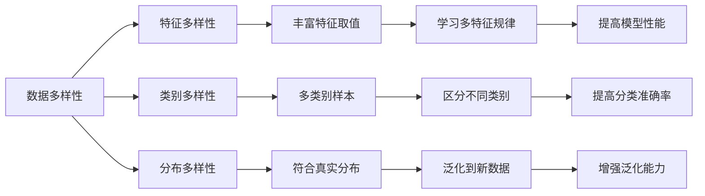

# 提升AI训练质量:数据多样性的重要性

> 关键词：AI训练质量、数据多样性、机器学习、泛化能力、过拟合

> 摘要：本文深入探讨了数据多样性在提升AI训练质量方面的重要性。首先介绍了文章的背景信息，包括目的、预期读者、文档结构和相关术语。接着阐述了核心概念，如数据多样性与AI训练质量的联系，并通过示意图和流程图进行直观展示。详细讲解了核心算法原理及操作步骤，结合Python代码进行说明。同时给出了相关的数学模型和公式，并举例分析。通过项目实战案例，包括开发环境搭建、代码实现与解读，进一步说明数据多样性的实际应用。还探讨了数据多样性在不同场景下的应用，推荐了学习资源、开发工具和相关论文著作。最后总结了未来发展趋势与挑战，解答了常见问题，并提供了扩展阅读和参考资料，旨在让读者全面了解数据多样性对提升AI训练质量的关键作用。

## 1. 背景介绍 
### 1.1 目的和范围
随着人工智能技术的飞速发展，AI系统在各个领域的应用越来越广泛。然而，要使AI模型具有良好的性能和泛化能力，高质量的训练数据至关重要。本文章的目的是深入探讨数据多样性对提升AI训练质量的重要性，通过理论分析、代码示例和实际案例，详细阐述数据多样性在AI训练中的作用机制。文章的范围涵盖了数据多样性的基本概念、相关算法原理、数学模型、实际应用场景以及未来发展趋势等方面。

### 1.2 预期读者
本文的预期读者包括人工智能领域的研究者、开发者、数据科学家、机器学习工程师，以及对人工智能技术感兴趣的学生和爱好者。无论是初学者想要了解数据多样性的基础知识，还是专业人士希望深入研究数据多样性对AI训练的影响，都能从本文中获得有价值的信息。

### 1.3 文档结构概述
本文将按照以下结构进行组织：首先介绍背景信息，包括目的、预期读者、文档结构和术语表；接着阐述核心概念，展示数据多样性与AI训练质量的联系；然后详细讲解核心算法原理和具体操作步骤，并给出Python代码示例；随后介绍相关的数学模型和公式，并举例说明；通过项目实战案例，展示数据多样性在实际开发中的应用；探讨数据多样性的实际应用场景；推荐学习资源、开发工具和相关论文著作；最后总结未来发展趋势与挑战，解答常见问题，并提供扩展阅读和参考资料。

### 1.4 术语表
#### 1.4.1 核心术语定义
- **AI训练质量**：指人工智能模型在训练过程中达到的性能水平，包括模型的准确性、泛化能力、鲁棒性等方面。
- **数据多样性**：指训练数据在特征、类别、分布等方面具有丰富的变化和差异，能够代表现实世界中的各种情况。
- **泛化能力**：指模型在未见过的数据上能够准确预测和分类的能力，是衡量模型性能的重要指标之一。
- **过拟合**：指模型在训练数据上表现良好，但在未见过的数据上表现不佳的现象，通常是由于模型过于复杂或训练数据缺乏多样性导致的。

#### 1.4.2 相关概念解释
- **特征多样性**：指训练数据中各个特征的取值范围和分布具有多样性，能够涵盖不同的情况和场景。
- **类别多样性**：指训练数据中包含多个不同的类别，每个类别都有足够的样本数量，以保证模型能够学习到不同类别的特征和规律。
- **分布多样性**：指训练数据的分布能够代表现实世界中的真实分布，避免出现数据偏差或不平衡的情况。

#### 1.4.3 缩略词列表
- **AI**：Artificial Intelligence，人工智能
- **ML**：Machine Learning，机器学习
- **DL**：Deep Learning，深度学习

## 2. 核心概念与联系 
### 核心概念原理
数据多样性是提升AI训练质量的关键因素之一。在AI训练过程中，模型通过学习训练数据中的特征和规律来进行预测和分类。如果训练数据缺乏多样性，模型可能会过度拟合训练数据，只学习到特定数据的特征，而无法泛化到未见过的数据上。相反，具有丰富多样性的训练数据能够让模型学习到更广泛的特征和规律，从而提高模型的泛化能力和鲁棒性。

例如，在图像识别任务中，如果训练数据只包含正面、清晰的人脸图像，那么模型在遇到侧面、模糊或有遮挡的人脸图像时，可能会出现识别错误。而如果训练数据中包含各种不同角度、表情、光照条件下的人脸图像，模型就能够学习到更全面的人脸特征，提高在各种情况下的识别准确率。

### 架构的文本示意图
```plaintext
             数据多样性
           /       |       \
    特征多样性  类别多样性  分布多样性
       |           |           |
  丰富特征取值  多类别样本  符合真实分布
       |           |           |
  学习多特征规律  区分不同类别  泛化到新数据
       |           |           |
  提高模型性能  提高分类准确率  增强泛化能力
```

### Mermaid流程图


## 3. 核心算法原理 & 具体操作步骤 
### 算法原理
在AI训练中，为了提高数据多样性，常用的方法包括数据增强、采样策略和数据合成等。下面以数据增强为例，介绍其算法原理。

数据增强是指通过对原始数据进行一系列的变换操作，生成新的训练数据，从而增加数据的多样性。常见的数据增强操作包括图像的旋转、翻转、缩放、裁剪、亮度调整等，以及文本的同义词替换、插入、删除等。

以图像数据增强为例，假设原始图像为 $I$，我们可以定义一系列的变换函数 $T_1, T_2, \cdots, T_n$，通过对原始图像应用这些变换函数，得到新的图像 $I_1 = T_1(I), I_2 = T_2(I), \cdots, I_n = T_n(I)$。这些新图像与原始图像具有一定的差异，但仍然属于同一类别，从而增加了训练数据的多样性。

### 具体操作步骤
以下是使用Python和`torchvision`库进行图像数据增强的具体操作步骤：

```python
import torchvision.transforms as transforms
from PIL import Image

# 定义数据增强变换
transform = transforms.Compose([
    transforms.RandomRotation(degrees=15),  # 随机旋转图像
    transforms.RandomHorizontalFlip(),  # 随机水平翻转图像
    transforms.RandomResizedCrop(size=(224, 224)),  # 随机裁剪并调整大小
    transforms.ColorJitter(brightness=0.2, contrast=0.2, saturation=0.2, hue=0.1),  # 随机调整颜色
    transforms.ToTensor()  # 将图像转换为张量
])

# 加载原始图像
image = Image.open('example.jpg')

# 应用数据增强变换
augmented_image = transform(image)

# 显示原始图像和增强后的图像
import matplotlib.pyplot as plt
import numpy as np

plt.subplot(1, 2, 1)
plt.imshow(np.array(image))
plt.title('Original Image')

plt.subplot(1, 2, 2)
plt.imshow(np.transpose(augmented_image.numpy(), (1, 2, 0)))
plt.title('Augmented Image')

plt.show()
```

### 代码解释
1. **导入必要的库**：导入`torchvision.transforms`库用于定义数据增强变换，`PIL.Image`库用于加载图像。
2. **定义数据增强变换**：使用`transforms.Compose`函数将多个变换操作组合在一起，包括随机旋转、随机水平翻转、随机裁剪并调整大小、随机调整颜色和将图像转换为张量。
3. **加载原始图像**：使用`Image.open`函数加载原始图像。
4. **应用数据增强变换**：将原始图像传入定义好的变换函数中，得到增强后的图像。
5. **显示图像**：使用`matplotlib.pyplot`库显示原始图像和增强后的图像。

## 4. 数学模型和公式 & 详细讲解 & 举例说明 
### 泛化误差与数据多样性的关系
在机器学习中，泛化误差是衡量模型在未见过的数据上的性能指标。泛化误差可以表示为：

$$E_{gen} = E_{train} + Bias + Variance$$

其中，$E_{gen}$ 是泛化误差，$E_{train}$ 是训练误差，$Bias$ 是偏差，$Variance$ 是方差。

偏差表示模型的预测值与真实值之间的平均差异，反映了模型的拟合能力。方差表示模型在不同训练数据集上的预测值的变化程度，反映了模型的稳定性。

数据多样性对泛化误差的影响主要体现在降低方差上。当训练数据缺乏多样性时，模型可能会过度拟合训练数据，导致方差增大，泛化误差也随之增大。而具有丰富多样性的训练数据能够让模型学习到更广泛的特征和规律，减少对特定训练数据的依赖，从而降低方差，提高泛化能力。

### 举例说明
假设我们要训练一个线性回归模型来预测房价。训练数据包含了不同面积、不同地理位置的房屋信息。如果训练数据只包含了某个特定区域的房屋信息，那么模型可能会过度拟合这个区域的房屋特征，而无法准确预测其他区域的房价。此时，模型的方差较大，泛化误差也较高。

如果我们增加训练数据的多样性，包含更多不同区域、不同类型的房屋信息，模型就能够学习到更广泛的房屋特征和规律，减少对特定区域的依赖，从而降低方差，提高泛化能力。

### 数据增强的数学表示
在数据增强中，假设原始数据为 $x$，变换函数为 $T$，则增强后的数据为 $x' = T(x)$。变换函数 $T$ 可以是一个随机函数，例如在图像数据增强中，随机旋转、随机翻转等操作都是随机函数。

通过多次应用不同的变换函数 $T_1, T_2, \cdots, T_n$，可以得到多个增强后的数据 $x_1' = T_1(x), x_2' = T_2(x), \cdots, x_n' = T_n(x)$。这些增强后的数据与原始数据具有一定的差异，但仍然属于同一类别，从而增加了训练数据的多样性。

## 5. 项目实战：代码实际案例和详细解释说明 
### 5.1  开发环境搭建
为了实现一个基于数据多样性提升AI训练质量的项目，我们需要搭建相应的开发环境。以下是具体的搭建步骤：

1. **安装Python**：建议安装Python 3.7及以上版本，可以从Python官方网站（https://www.python.org/downloads/）下载并安装。
2. **安装深度学习框架**：我们选择使用PyTorch作为深度学习框架，可以通过以下命令进行安装：
```bash
pip install torch torchvision
```
3. **安装其他必要的库**：还需要安装一些其他的库，如`numpy`、`matplotlib`、`scikit-learn`等，可以通过以下命令进行安装：
```bash
pip install numpy matplotlib scikit-learn
```

### 5.2  源代码详细实现和代码解读
以下是一个基于MNIST手写数字数据集的分类项目，通过数据增强来提高模型的训练质量：

```python
import torch
import torch.nn as nn
import torch.optim as optim
import torchvision
import torchvision.transforms as transforms
import matplotlib.pyplot as plt
import numpy as np

# 定义数据增强变换
transform_train = transforms.Compose([
    transforms.RandomRotation(degrees=15),
    transforms.RandomAffine(degrees=0, translate=(0.1, 0.1)),
    transforms.ToTensor(),
    transforms.Normalize((0.1307,), (0.3081,))
])

transform_test = transforms.Compose([
    transforms.ToTensor(),
    transforms.Normalize((0.1307,), (0.3081,))
])

# 加载MNIST数据集
trainset = torchvision.datasets.MNIST(root='./data', train=True,
                                      download=True, transform=transform_train)
trainloader = torch.utils.data.DataLoader(trainset, batch_size=64,
                                          shuffle=True, num_workers=2)

testset = torchvision.datasets.MNIST(root='./data', train=False,
                                     download=True, transform=transform_test)
testloader = torch.utils.data.DataLoader(testset, batch_size=64,
                                         shuffle=False, num_workers=2)

# 定义简单的卷积神经网络模型
class Net(nn.Module):
    def __init__(self):
        super(Net, self).__init__()
        self.conv1 = nn.Conv2d(1, 10, kernel_size=5)
        self.conv2 = nn.Conv2d(10, 20, kernel_size=5)
        self.pool = nn.MaxPool2d(2)
        self.fc1 = nn.Linear(320, 50)
        self.fc2 = nn.Linear(50, 10)

    def forward(self, x):
        x = self.pool(torch.relu(self.conv1(x)))
        x = self.pool(torch.relu(self.conv2(x)))
        x = x.view(-1, 320)
        x = torch.relu(self.fc1(x))
        x = self.fc2(x)
        return x

net = Net()

# 定义损失函数和优化器
criterion = nn.CrossEntropyLoss()
optimizer = optim.SGD(net.parameters(), lr=0.01, momentum=0.5)

# 训练模型
train_losses = []
test_losses = []
test_accuracies = []

for epoch in range(10):
    running_loss = 0.0
    net.train()
    for i, data in enumerate(trainloader, 0):
        inputs, labels = data
        optimizer.zero_grad()

        outputs = net(inputs)
        loss = criterion(outputs, labels)
        loss.backward()
        optimizer.step()

        running_loss += loss.item()

    train_loss = running_loss / len(trainloader)
    train_losses.append(train_loss)

    net.eval()
    test_loss = 0.0
    correct = 0
    total = 0
    with torch.no_grad():
        for data in testloader:
            images, labels = data
            outputs = net(images)
            loss = criterion(outputs, labels)
            test_loss += loss.item()
            _, predicted = torch.max(outputs.data, 1)
            total += labels.size(0)
            correct += (predicted == labels).sum().item()

    test_loss = test_loss / len(testloader)
    test_losses.append(test_loss)
    test_accuracy = 100 * correct / total
    test_accuracies.append(test_accuracy)

    print(f'Epoch {epoch + 1}, Train Loss: {train_loss:.3f}, Test Loss: {test_loss:.3f}, Test Accuracy: {test_accuracy:.2f}%')

# 绘制训练损失和测试准确率曲线
plt.figure(figsize=(12, 4))
plt.subplot(1, 2, 1)
plt.plot(train_losses, label='Train Loss')
plt.plot(test_losses, label='Test Loss')
plt.xlabel('Epoch')
plt.ylabel('Loss')
plt.legend()

plt.subplot(1, 2, 2)
plt.plot(test_accuracies, label='Test Accuracy')
plt.xlabel('Epoch')
plt.ylabel('Accuracy (%)')
plt.legend()

plt.show()
```

### 5.3  代码解读与分析
1. **数据增强变换定义**：定义了训练集和测试集的数据变换。训练集使用了随机旋转、随机仿射变换等数据增强操作，以增加数据的多样性。测试集只进行了归一化操作。
2. **数据集加载**：使用`torchvision.datasets.MNIST`加载MNIST手写数字数据集，并使用`torch.utils.data.DataLoader`创建数据加载器。
3. **模型定义**：定义了一个简单的卷积神经网络模型，包含两个卷积层、两个全连接层和一个池化层。
4. **损失函数和优化器定义**：使用交叉熵损失函数和随机梯度下降优化器。
5. **模型训练**：在每个epoch中，遍历训练集进行前向传播、计算损失、反向传播和参数更新。同时，在每个epoch结束后，在测试集上评估模型的性能。
6. **结果可视化**：绘制训练损失和测试准确率曲线，直观展示模型的训练过程和性能变化。

通过数据增强，模型能够学习到更多不同角度、位置的手写数字特征，从而提高了在测试集上的准确率和泛化能力。

## 6. 实际应用场景 
### 图像识别领域
在图像识别领域，数据多样性对于提高模型的性能至关重要。例如，在人脸识别系统中，训练数据需要包含不同年龄、性别、种族、表情、光照条件下的人脸图像，以确保模型能够在各种实际场景中准确识别人脸。在自动驾驶领域，图像识别模型需要处理不同天气、道路状况、交通标志等情况下的图像，因此训练数据需要具有丰富的多样性，以提高模型的泛化能力和安全性。

### 自然语言处理领域
在自然语言处理领域，数据多样性也起着重要作用。例如，在文本分类任务中，训练数据需要包含不同主题、风格、语言表达的文本，以确保模型能够准确分类各种类型的文本。在机器翻译任务中，训练数据需要包含不同语言对、不同领域的文本，以提高翻译的准确性和流畅性。

### 医疗领域
在医疗领域，AI技术被广泛应用于疾病诊断、医学影像分析等方面。为了提高模型的准确性和可靠性，训练数据需要包含不同患者、不同疾病类型、不同影像模态的样本。例如，在肺癌诊断中，训练数据需要包含不同阶段、不同类型的肺癌影像，以及正常肺部影像，以帮助模型学习到肺癌的特征和规律，提高诊断的准确性。

### 金融领域
在金融领域，AI技术被用于风险评估、信用评分、股票预测等方面。训练数据需要包含不同行业、不同企业、不同市场环境下的金融数据，以确保模型能够准确评估风险和预测市场趋势。例如，在信用评分模型中，训练数据需要包含不同信用等级、不同收入水平、不同职业的客户信息，以提高信用评分的准确性和公正性。

## 7. 工具和资源推荐
### 7.1 学习资源推荐
#### 7.1.1 书籍推荐
- 《深度学习》（Deep Learning）：由Ian Goodfellow、Yoshua Bengio和Aaron Courville撰写，是深度学习领域的经典教材，详细介绍了深度学习的基本概念、算法和应用。
- 《Python机器学习》（Python Machine Learning）：由Sebastian Raschka和Vahid Mirjalili撰写，介绍了使用Python进行机器学习的方法和技巧，包括数据预处理、模型选择、评估和优化等方面。
- 《动手学深度学习》（Dive into Deep Learning）：由李沐、Aston Zhang等撰写，提供了丰富的代码示例和实践项目，适合初学者快速上手深度学习。

#### 7.1.2 在线课程
- Coursera上的“深度学习专项课程”（Deep Learning Specialization）：由Andrew Ng教授讲授，包括神经网络和深度学习、改善深层神经网络、结构化机器学习项目、卷积神经网络、序列模型等课程，全面介绍了深度学习的理论和实践。
- edX上的“人工智能导论”（Introduction to Artificial Intelligence）：由MIT的Patrick Winston教授讲授，介绍了人工智能的基本概念、算法和应用，适合初学者了解人工智能的全貌。
- Kaggle上的“微课程”（Microcourses）：提供了一系列关于数据科学、机器学习和深度学习的微课程，包括数据预处理、模型选择、评估和优化等方面，适合快速学习和实践。

#### 7.1.3 技术博客和网站
- Medium上的Towards Data Science：是一个专注于数据科学和机器学习的技术博客平台，提供了大量的技术文章和案例分析。
- AI Stack Exchange：是一个关于人工智能的问答社区，用户可以在这里提出问题、分享经验和解决方案。
- arXiv：是一个预印本平台，提供了大量的学术论文，包括人工智能、机器学习、深度学习等领域的最新研究成果。

### 7.2 开发工具框架推荐
#### 7.2.1 IDE和编辑器
- PyCharm：是一款专业的Python集成开发环境，提供了丰富的代码编辑、调试、版本控制等功能，适合Python开发者使用。
- Jupyter Notebook：是一个交互式的笔记本环境，支持多种编程语言，适合数据科学家和机器学习工程师进行数据探索、模型开发和可视化。
- Visual Studio Code：是一款轻量级的代码编辑器，支持多种编程语言和插件扩展，适合快速开发和调试。

#### 7.2.2 调试和性能分析工具
- PyTorch Profiler：是PyTorch提供的性能分析工具，可以帮助开发者分析模型的性能瓶颈，优化代码性能。
- TensorBoard：是TensorFlow提供的可视化工具，可以帮助开发者可视化模型的训练过程、性能指标和网络结构。
- NVIDIA Nsight Systems：是NVIDIA提供的性能分析工具，适合对GPU加速的深度学习模型进行性能分析和优化。

#### 7.2.3 相关框架和库
- PyTorch：是一个开源的深度学习框架，提供了丰富的神经网络层、优化器和数据加载器等工具，易于使用和扩展。
- TensorFlow：是另一个广泛使用的开源深度学习框架，提供了高级的深度学习API和分布式训练功能。
- Scikit-learn：是一个用于机器学习的Python库，提供了丰富的机器学习算法和工具，包括数据预处理、模型选择、评估和优化等方面。

### 7.3 相关论文著作推荐
#### 7.3.1 经典论文
- “ImageNet Classification with Deep Convolutional Neural Networks”：由Alex Krizhevsky、Ilya Sutskever和Geoffrey E. Hinton撰写，介绍了AlexNet卷积神经网络，开创了深度学习在图像识别领域的先河。
- “Long Short-Term Memory”：由Sepp Hochreiter和Jürgen Schmidhuber撰写，介绍了长短期记忆网络（LSTM），解决了循环神经网络中的梯度消失问题。
- “Attention Is All You Need”：由Ashish Vaswani等人撰写，介绍了Transformer模型，提出了注意力机制，在自然语言处理领域取得了巨大成功。

#### 7.3.2 最新研究成果
- 在arXiv上搜索“data diversity in AI training”，可以找到关于数据多样性在AI训练中的最新研究成果。
- 关注顶级学术会议，如NeurIPS、ICML、CVPR、ACL等，这些会议上会发表关于人工智能、机器学习、深度学习等领域的最新研究成果。

#### 7.3.3 应用案例分析
- Kaggle上有许多关于数据多样性在不同领域应用的竞赛和案例分析，可以学习到实际项目中的经验和技巧。
- 一些科技公司的博客，如Google AI Blog、Facebook AI Research Blog等，会分享他们在AI领域的应用案例和研究成果。

## 8. 总结：未来发展趋势与挑战
### 未来发展趋势
- **数据多样性的重要性将进一步凸显**：随着AI技术在更多领域的应用，对模型的泛化能力和鲁棒性要求越来越高，数据多样性将成为提升AI训练质量的关键因素。
- **数据合成技术将得到更广泛的应用**：为了获取更多样化的训练数据，数据合成技术将得到更广泛的应用，如生成对抗网络（GAN）、变分自编码器（VAE）等。
- **跨领域数据融合将成为趋势**：不同领域的数据具有不同的特征和规律，跨领域数据融合可以为AI模型提供更丰富的信息，提高模型的性能和泛化能力。

### 挑战
- **数据收集和标注的成本高**：获取具有丰富多样性的训练数据需要大量的时间和精力，同时数据标注也需要专业的知识和技能，成本较高。
- **数据隐私和安全问题**：在收集和使用数据的过程中，需要保护数据的隐私和安全，避免数据泄露和滥用。
- **数据多样性的度量和评估方法有待完善**：目前还缺乏有效的数据多样性度量和评估方法，难以准确衡量数据的多样性对AI训练质量的影响。

## 9. 附录：常见问题与解答
### 问题1：如何判断训练数据是否具有足够的多样性？
答：可以从特征多样性、类别多样性和分布多样性等方面进行判断。例如，检查训练数据中各个特征的取值范围和分布是否广泛，是否包含多个不同的类别，以及数据的分布是否符合真实世界的分布。还可以通过模型的泛化能力来间接判断，如果模型在未见过的数据上表现良好，说明训练数据可能具有足够的多样性。

### 问题2：数据增强是否会引入噪声或错误信息？
答：在一定程度上，数据增强可能会引入一些噪声或错误信息。例如，在图像数据增强中，过度的旋转或裁剪可能会导致图像信息的丢失或变形。但是，只要数据增强的参数设置合理，这些噪声和错误信息通常不会对模型的训练产生太大的影响，反而可以增加数据的多样性，提高模型的泛化能力。

### 问题3：如何处理数据不平衡的问题？
答：数据不平衡是指训练数据中不同类别的样本数量差异较大的问题。可以采用以下方法来处理数据不平衡问题：
- **采样策略**：包括过采样（如SMOTE算法）和欠采样，通过增加少数类样本或减少多数类样本的数量，使不同类别的样本数量更加平衡。
- **调整损失函数**：通过调整损失函数的权重，使模型更加关注少数类样本的分类错误。
- **数据合成**：使用数据合成技术生成少数类样本，增加少数类样本的数量。

## 10. 扩展阅读 & 参考资料
### 扩展阅读
- 《人工智能时代的算法伦理》：探讨了人工智能算法在应用过程中可能面临的伦理问题，以及如何确保算法的公平性和可靠性。
- 《智能时代》：介绍了人工智能技术对社会、经济和生活的影响，以及未来的发展趋势。

### 参考资料
- Goodfellow, I., Bengio, Y., & Courville, A. (2016). Deep Learning. MIT Press.
- Raschka, S., & Mirjalili, V. (2017). Python Machine Learning. Packt Publishing.
- Zhang, A., Lipton, Z. C., Li, M., & Smola, A. J. (2020). Dive into Deep Learning.
- Krizhevsky, A., Sutskever, I., & Hinton, G. E. (2012). ImageNet Classification with Deep Convolutional Neural Networks. Advances in Neural Information Processing Systems.
- Hochreiter, S., & Schmidhuber, J. (1997). Long Short-Term Memory. Neural Computation.
- Vaswani, A., Shazeer, N., Parmar, N., Uszkoreit, J., Jones, L., Gomez, A. N.,... & Polosukhin, I. (2017). Attention Is All You Need. Advances in Neural Information Processing Systems.

作者：AI天才研究院/AI Genius Institute & 禅与计算机程序设计艺术 /Zen And The Art of Computer Programming