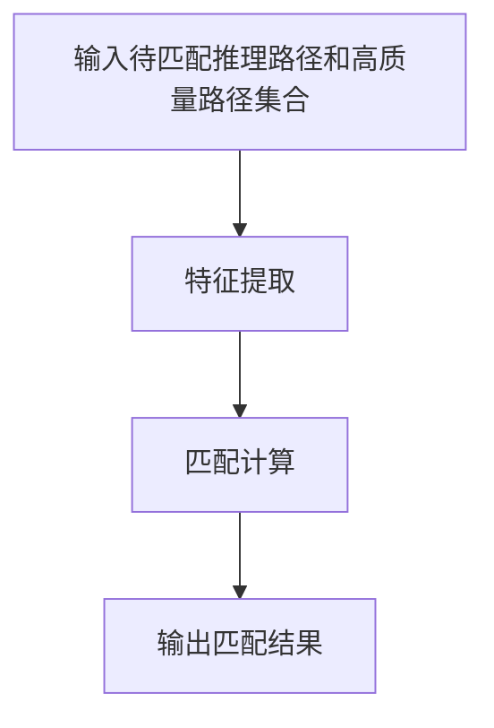

# 提升与已知高质量推理路径匹配概率的方法

> 关键词：高质量推理路径、匹配概率、推理算法、机器学习、自然语言处理

> 摘要：本文旨在深入探讨提升与已知高质量推理路径匹配概率的方法。首先介绍了该研究的背景、目的、预期读者等内容。接着阐述了核心概念及其联系，详细讲解了核心算法原理并给出具体操作步骤，通过Python代码进行说明。同时，对相关数学模型和公式进行了推导与举例。然后通过项目实战展示代码实现及解读。还分析了实际应用场景，推荐了学习资源、开发工具框架和相关论文著作。最后总结了未来发展趋势与挑战，并给出常见问题解答和扩展阅读参考资料，为提升推理路径匹配概率提供全面且深入的技术指导。

## 1. 背景介绍 
### 1.1 目的和范围
在当今信息爆炸的时代，大量的数据和信息需要进行有效的处理和分析。推理路径匹配在许多领域都有着重要的应用，如智能问答系统、知识图谱推理、法律案例分析等。已知高质量推理路径通常代表着经过验证和优化的推理方式，能够得出准确可靠的结论。提升与这些高质量推理路径的匹配概率，有助于提高系统的推理准确性、效率和可靠性，减少错误推理的发生。

本文章的范围涵盖了从理论原理到实际应用的多个方面，包括核心概念的解释、算法原理的阐述、数学模型的推导、实际项目的实现以及相关工具和资源的推荐等。

### 1.2 预期读者
本文预期读者包括人工智能领域的研究人员、软件开发工程师、数据科学家、对推理算法和知识图谱有兴趣的爱好者等。对于希望提升推理系统性能、优化推理路径匹配的专业人士，以及想要深入了解相关技术原理的学习者都具有一定的参考价值。

### 1.3 文档结构概述
本文将按照以下结构进行组织：首先介绍核心概念及其联系，帮助读者建立起对推理路径匹配的基本认识；接着详细讲解核心算法原理，并给出具体的操作步骤和Python代码实现；然后推导相关的数学模型和公式，并通过具体例子进行说明；之后通过项目实战展示如何在实际中应用这些方法；分析实际应用场景，探讨其应用价值；推荐相关的学习资源、开发工具框架和论文著作；最后总结未来发展趋势与挑战，给出常见问题解答和扩展阅读参考资料。

### 1.4 术语表
#### 1.4.1 核心术语定义
- **推理路径**：从初始条件到最终结论所经过的一系列推理步骤和中间结果的序列。
- **高质量推理路径**：经过验证和优化，能够得出准确可靠结论的推理路径，通常具有较高的逻辑性和合理性。
- **匹配概率**：指待匹配的推理路径与已知高质量推理路径相似的可能性大小。

#### 1.4.2 相关概念解释
- **知识图谱**：一种以图的形式表示知识的结构化数据模型，由实体、关系和属性组成，可用于存储和表示领域知识，为推理提供基础。
- **机器学习**：一门多领域交叉学科，涉及概率论、统计学、逼近论、凸分析、算法复杂度理论等多门学科。它专门研究计算机怎样模拟或实现人类的学习行为，以获取新的知识或技能，重新组织已有的知识结构使之不断改善自身的性能。

#### 1.4.3 缩略词列表
- **NLP**：Natural Language Processing，自然语言处理，是计算机科学领域与人工智能领域中的一个重要方向，研究能实现人与计算机之间用自然语言进行有效通信的各种理论和方法。
- **ML**：Machine Learning，机器学习。

## 2. 核心概念与联系 

### 核心概念原理
推理路径匹配的核心目标是找到待匹配推理路径与已知高质量推理路径之间的相似性。这涉及到对推理路径的表示和比较。推理路径可以用图的形式表示，其中节点表示推理过程中的实体或状态，边表示实体之间的关系或推理步骤。

高质量推理路径通常是在大量的实验和验证基础上得到的，具有较高的可信度和有效性。通过将待匹配的推理路径与这些高质量路径进行比较，可以评估其匹配程度。

### 架构的文本示意图
我们可以将推理路径匹配系统的架构描述如下：

输入层：接收待匹配的推理路径和已知高质量推理路径集合。

特征提取层：对待匹配路径和高质量路径进行特征提取，将其转换为向量表示，以便进行后续的比较。

匹配计算层：计算待匹配路径与每个高质量路径的匹配得分，常用的方法包括余弦相似度、编辑距离等。

输出层：根据匹配得分，输出匹配概率最高的高质量推理路径或匹配概率列表。

### Mermaid 流程图


## 3. 核心算法原理 & 具体操作步骤 

### 算法原理
我们可以使用基于机器学习的方法来提升推理路径匹配概率。具体来说，我们可以训练一个分类器，将待匹配的推理路径和高质量推理路径作为输入，输出它们是否匹配的概率。

以下是一个简单的基于余弦相似度的匹配算法原理：

1. 将推理路径表示为向量。可以使用词嵌入（如Word2Vec、GloVe）将推理路径中的文本信息转换为向量表示。
2. 计算待匹配路径向量与每个高质量路径向量的余弦相似度。余弦相似度的计算公式为：
   $$\text{cosine similarity} = \frac{\vec{a} \cdot \vec{b}}{\|\vec{a}\| \|\vec{b}\|}$$
   其中 $\vec{a}$ 和 $\vec{b}$ 分别是待匹配路径向量和高质量路径向量。
3. 根据余弦相似度确定匹配概率。相似度越高，匹配概率越大。

### 具体操作步骤
1. **数据预处理**：对推理路径数据进行清洗和预处理，去除噪声和无用信息。
2. **特征提取**：使用词嵌入模型将推理路径转换为向量表示。
3. **计算相似度**：计算待匹配路径向量与高质量路径向量的余弦相似度。
4. **确定匹配概率**：根据相似度得分，确定匹配概率。

### Python源代码
```python
import numpy as np
from sklearn.feature_extraction.text import TfidfVectorizer
from sklearn.metrics.pairwise import cosine_similarity

# 示例数据
high_quality_paths = [
    "A -> B -> C",
    "D -> E -> F",
    "G -> H -> I"
]

待匹配路径 = "A -> B -> C"

# 数据预处理
def preprocess(paths):
    return [path.replace(" -> ", " ") for path in paths]

preprocessed_high_quality_paths = preprocess(high_quality_paths)
preprocessed待匹配路径 = preprocess([待匹配路径])

# 特征提取
vectorizer = TfidfVectorizer()
high_quality_vectors = vectorizer.fit_transform(preprocessed_high_quality_paths)
待匹配_vector = vectorizer.transform(preprocessed待匹配路径)

# 计算相似度
similarities = cosine_similarity(待匹配_vector, high_quality_vectors)

# 确定匹配概率
matching_probabilities = similarities.flatten()

# 输出结果
for i, prob in enumerate(matching_probabilities):
    print(f"与高质量路径 {high_quality_paths[i]} 的匹配概率: {prob}")
```

## 4. 数学模型和公式 & 详细讲解 & 举例说明 

### 数学模型
我们可以将推理路径匹配问题建模为一个分类问题。设 $x$ 为待匹配的推理路径向量，$y$ 为已知高质量推理路径向量集合，$p$ 为匹配概率。我们的目标是找到一个函数 $f(x, y)$ 来计算 $p$。

在基于余弦相似度的方法中，$f(x, y)$ 可以表示为：
$$p = \frac{\vec{x} \cdot \vec{y}_i}{\|\vec{x}\| \|\vec{y}_i\|}$$
其中 $\vec{y}_i$ 是高质量路径向量集合中的第 $i$ 个向量。

### 详细讲解
余弦相似度是一种常用的向量相似度度量方法，它衡量的是两个向量之间的夹角余弦值。当两个向量的方向相同时，余弦值为 1，表示完全匹配；当两个向量的方向相反时，余弦值为 -1，表示完全不匹配；当两个向量垂直时，余弦值为 0，表示没有相关性。

在推理路径匹配中，我们将推理路径转换为向量表示，通过计算向量之间的余弦相似度来评估它们的匹配程度。

### 举例说明
假设我们有两个推理路径：
路径 1: "A -> B -> C"
路径 2: "A -> B -> D"

我们使用词嵌入将它们转换为向量：
$\vec{x} = [0.2, 0.3, 0.5]$
$\vec{y} = [0.2, 0.3, 0.1]$

计算它们的余弦相似度：
$$\text{cosine similarity} = \frac{\vec{x} \cdot \vec{y}}{\|\vec{x}\| \|\vec{y}\|} = \frac{0.2\times0.2 + 0.3\times0.3 + 0.5\times0.1}{\sqrt{0.2^2 + 0.3^2 + 0.5^2} \sqrt{0.2^2 + 0.3^2 + 0.1^2}} \approx 0.83$$

这表明路径 1 和路径 2 有较高的匹配概率。

## 5. 项目实战：代码实际案例和详细解释说明 

### 5.1  开发环境搭建
- **Python环境**：建议使用Python 3.7及以上版本。可以通过Anaconda或官方Python网站进行安装。
- **依赖库安装**：使用以下命令安装所需的依赖库：
```sh
pip install numpy scikit-learn
```

### 5.2  源代码详细实现和代码解读
```python
import numpy as np
from sklearn.feature_extraction.text import TfidfVectorizer
from sklearn.metrics.pairwise import cosine_similarity

# 示例数据
high_quality_paths = [
    "A -> B -> C",
    "D -> E -> F",
    "G -> H -> I"
]

待匹配路径 = "A -> B -> C"

# 数据预处理
def preprocess(paths):
    """
    对推理路径数据进行预处理，将 " -> " 替换为空格
    :param paths: 推理路径列表
    :return: 预处理后的推理路径列表
    """
    return [path.replace(" -> ", " ") for path in paths]

preprocessed_high_quality_paths = preprocess(high_quality_paths)
preprocessed待匹配路径 = preprocess([待匹配路径])

# 特征提取
vectorizer = TfidfVectorizer()
"""
TfidfVectorizer 是一个用于将文本数据转换为 TF-IDF 特征向量的工具。
TF-IDF（Term Frequency-Inverse Document Frequency）是一种常用的文本特征表示方法，
它考虑了词在文档中的出现频率和在整个语料库中的稀有程度。
"""
high_quality_vectors = vectorizer.fit_transform(preprocessed_high_quality_paths)
待匹配_vector = vectorizer.transform(preprocessed待匹配路径)

# 计算相似度
similarities = cosine_similarity(待匹配_vector, high_quality_vectors)

# 确定匹配概率
matching_probabilities = similarities.flatten()

# 输出结果
for i, prob in enumerate(matching_probabilities):
    print(f"与高质量路径 {high_quality_paths[i]} 的匹配概率: {prob}")
```

### 5.3  代码解读与分析
1. **数据预处理**：将推理路径中的 " -> " 替换为空格，以便后续进行文本处理。
2. **特征提取**：使用 `TfidfVectorizer` 将推理路径转换为 TF-IDF 特征向量。`fit_transform` 方法用于训练并转换高质量路径数据，`transform` 方法用于转换待匹配路径数据。
3. **相似度计算**：使用 `cosine_similarity` 函数计算待匹配路径向量与高质量路径向量的余弦相似度。
4. **匹配概率确定**：将相似度结果展平为一维数组，得到匹配概率。
5. **结果输出**：遍历匹配概率数组，输出与每个高质量路径的匹配概率。

## 6. 实际应用场景 
### 智能问答系统
在智能问答系统中，用户的问题可以看作是一个待匹配的推理路径，而知识库中的标准答案推理路径则是高质量推理路径。通过提升与高质量推理路径的匹配概率，可以更准确地回答用户的问题，提高问答系统的性能。

### 知识图谱推理
知识图谱是一种用于表示知识的结构化数据模型，其中包含了大量的实体和关系。在知识图谱推理中，需要根据已知的事实和规则进行推理，找到可能的推理路径。通过与已知的高质量推理路径进行匹配，可以提高推理的准确性和效率。

### 法律案例分析
在法律领域，律师和法官需要对大量的法律案例进行分析和推理。已知的高质量法律案例推理路径可以作为参考，通过提升与这些路径的匹配概率，可以更准确地分析新的法律案例，为决策提供支持。

### 医疗诊断辅助
在医疗诊断中，医生需要根据患者的症状、检查结果等信息进行推理，做出诊断。已知的高质量医疗诊断推理路径可以帮助医生更准确地判断病情，提高诊断的准确性和效率。

## 7. 工具和资源推荐
### 7.1 学习资源推荐
#### 7.1.1 书籍推荐
- 《人工智能：一种现代的方法》：这是一本经典的人工智能教材，涵盖了人工智能的各个方面，包括机器学习、自然语言处理、知识表示与推理等内容。
- 《Python机器学习》：详细介绍了使用Python进行机器学习的方法和技巧，对于实现推理路径匹配算法有很大的帮助。
- 《自然语言处理入门》：适合初学者入门自然语言处理领域，介绍了自然语言处理的基本概念、方法和应用。

#### 7.1.2 在线课程
- Coursera上的“机器学习”课程：由斯坦福大学教授Andrew Ng讲授，是机器学习领域的经典课程。
- edX上的“自然语言处理基础”课程：系统地介绍了自然语言处理的基础知识和技术。
- 中国大学MOOC上的“人工智能基础”课程：国内高校开设的人工智能入门课程，内容丰富易懂。

#### 7.1.3 技术博客和网站
- Medium：上面有很多人工智能领域的技术文章和经验分享。
- 博客园：国内的技术博客平台，有很多人工智能相关的文章。
- 机器之心：专注于人工智能领域的资讯和技术解读。

### 7.2 开发工具框架推荐
#### 7.2.1 IDE和编辑器
- PyCharm：一款专业的Python集成开发环境，提供了丰富的功能和插件，方便进行代码开发和调试。
- Jupyter Notebook：一种交互式的开发环境，适合进行数据探索和模型实验。
- Visual Studio Code：一款轻量级的代码编辑器，支持多种编程语言和插件扩展。

#### 7.2.2 调试和性能分析工具
- pdb：Python自带的调试工具，可以帮助开发者定位和解决代码中的问题。
- cProfile：Python的性能分析工具，可以分析代码的运行时间和内存使用情况。
- TensorBoard：用于可视化深度学习模型训练过程和结果的工具。

#### 7.2.3 相关框架和库
- Scikit-learn：一个简单易用的机器学习库，提供了丰富的机器学习算法和工具。
- TensorFlow：谷歌开发的深度学习框架，广泛应用于自然语言处理、图像识别等领域。
- PyTorch：一个开源的深度学习框架，具有动态图和易于使用的特点。

### 7.3 相关论文著作推荐
#### 7.3.1 经典论文
- 《Long Short-Term Memory》：介绍了长短时记忆网络（LSTM）的原理和应用，LSTM在处理序列数据方面具有很好的效果。
- 《Attention Is All You Need》：提出了Transformer模型，是自然语言处理领域的重要突破。
- 《Word2Vec Explained: Deriving Mikolov et al.'s Negative-Sampling Word-Embedding Method》：详细解释了Word2Vec模型的原理和实现方法。

#### 7.3.2 最新研究成果
可以通过学术搜索引擎（如Google Scholar、IEEE Xplore等）搜索最新的关于推理路径匹配、知识图谱推理等方面的研究论文。

#### 7.3.3 应用案例分析
可以关注相关领域的学术会议（如AAAI、IJCAI、ACL等）和期刊（如Journal of Artificial Intelligence Research、Artificial Intelligence等）上的应用案例分析文章，了解推理路径匹配在实际中的应用情况。

## 8. 总结：未来发展趋势与挑战
### 未来发展趋势
- **多模态融合**：将文本、图像、语音等多种模态的信息融合到推理路径匹配中，提高匹配的准确性和可靠性。
- **深度学习的应用**：深度学习技术在自然语言处理和机器学习领域取得了很大的进展，未来将更多地应用于推理路径匹配，如使用预训练模型进行特征提取和匹配计算。
- **知识图谱的发展**：知识图谱作为推理的基础，将不断完善和扩展，为推理路径匹配提供更丰富的知识支持。

### 挑战
- **数据质量和数量**：高质量的推理路径数据是提升匹配概率的关键，但数据的收集、标注和清洗工作具有一定的难度。同时，数据的数量也可能影响模型的性能。
- **模型复杂度和效率**：随着深度学习模型的不断发展，模型的复杂度也在增加，这可能导致训练和推理的效率降低。如何在保证匹配准确性的前提下，提高模型的效率是一个挑战。
- **语义理解**：推理路径匹配需要对文本的语义进行理解，但目前自然语言处理技术在语义理解方面还存在一定的局限性，如何更好地理解文本的语义是一个需要解决的问题。

## 9. 附录：常见问题与解答
### 问题1：如何选择合适的特征提取方法？
答：选择合适的特征提取方法需要考虑数据的特点和任务的需求。对于文本数据，可以使用词嵌入（如Word2Vec、GloVe）、TF-IDF等方法。如果数据包含图像或语音等多模态信息，可以使用相应的特征提取方法（如图像的卷积神经网络特征、语音的梅尔频率倒谱系数等）。

### 问题2：如何处理数据中的噪声和缺失值？
答：对于噪声数据，可以使用数据清洗和预处理方法，如去除停用词、正则表达式匹配等。对于缺失值，可以使用填充方法（如均值填充、中位数填充）或删除包含缺失值的数据。

### 问题3：如何评估推理路径匹配的性能？
答：可以使用准确率、召回率、F1值等指标来评估推理路径匹配的性能。准确率表示匹配正确的样本数占总样本数的比例，召回率表示匹配正确的正样本数占实际正样本数的比例，F1值是准确率和召回率的调和平均数。

## 10. 扩展阅读 & 参考资料
### 扩展阅读
- 《深度学习》：详细介绍了深度学习的原理、方法和应用。
- 《知识图谱：方法、实践与应用》：深入探讨了知识图谱的构建、推理和应用。
- 《自然语言处理实战：基于Python和深度学习》：通过实际案例介绍了自然语言处理的应用和实现方法。

### 参考资料
- [Scikit-learn官方文档](https://scikit-learn.org/stable/)
- [TensorFlow官方文档](https://www.tensorflow.org/)
- [PyTorch官方文档](https://pytorch.org/)

作者：AI天才研究院/AI Genius Institute & 禅与计算机程序设计艺术 /Zen And The Art of Computer Programming