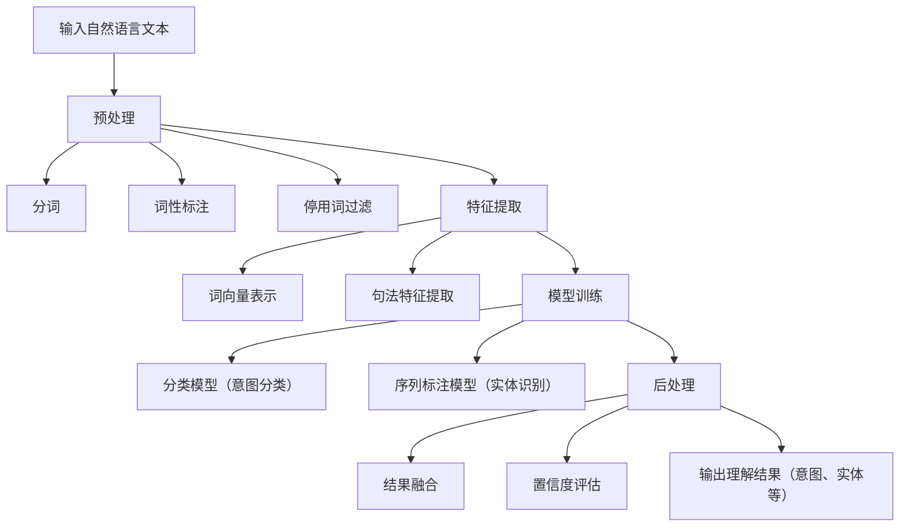

# 提升客户服务质量：NLU技术的应用

> 关键词：客户服务质量、NLU技术、自然语言理解、智能客服、语义分析

> 摘要：本文围绕NLU技术在提升客户服务质量方面的应用展开。首先介绍了相关背景知识，包括目的、预期读者等内容。接着阐述了NLU的核心概念与联系，通过文本示意图和Mermaid流程图进行了清晰展示。详细讲解了核心算法原理，并用Python代码进行了说明，同时给出了相关数学模型和公式。通过项目实战，展示了如何使用NLU技术提升客户服务，包括开发环境搭建、代码实现与解读。探讨了NLU技术在客户服务中的实际应用场景，推荐了学习资源、开发工具框架以及相关论文著作。最后总结了未来发展趋势与挑战，并提供了常见问题解答和扩展阅读参考资料，旨在帮助读者全面了解NLU技术在客户服务领域的应用。

## 1. 背景介绍 
### 1.1 目的和范围
在当今竞争激烈的商业环境中，客户服务质量已成为企业取得成功的关键因素之一。优质的客户服务能够提高客户满意度和忠诚度，从而为企业带来更多的业务和收益。随着互联网和移动技术的快速发展，客户与企业之间的交互方式越来越多样化，对客户服务的效率和质量也提出了更高的要求。

自然语言理解（Natural Language Understanding，简称NLU）技术作为人工智能领域的重要分支，为提升客户服务质量提供了强大的工具和手段。NLU技术能够使计算机理解人类语言的语义和意图，从而实现更加智能、高效的客户服务。

本文的目的在于深入探讨NLU技术在提升客户服务质量方面的应用，详细介绍NLU技术的核心概念、算法原理、数学模型，并通过项目实战展示其具体应用。同时，分析NLU技术在客户服务中的实际应用场景，推荐相关的学习资源、开发工具和论文著作，为读者提供全面、系统的指导。

### 1.2 预期读者
本文的预期读者包括但不限于以下几类人群：
- **企业管理人员**：希望了解如何利用NLU技术提升企业客户服务质量，制定相关的战略和决策。
- **客户服务从业人员**：对提高客户服务效率和质量有强烈需求，希望学习NLU技术在客户服务中的应用方法和技巧。
- **人工智能开发者**：对NLU技术感兴趣，希望深入了解其算法原理和实现细节，开发相关的客户服务应用程序。
- **科研人员**：从事自然语言处理、人工智能等领域的研究工作，希望了解NLU技术在客户服务领域的最新应用和研究成果。

### 1.3 文档结构概述
本文将按照以下结构进行组织：
- **核心概念与联系**：介绍NLU技术的基本概念、原理和架构，通过文本示意图和Mermaid流程图展示其核心概念之间的联系。
- **核心算法原理 & 具体操作步骤**：详细讲解NLU技术的核心算法原理，并用Python代码进行具体实现和解释。
- **数学模型和公式 & 详细讲解 & 举例说明**：介绍NLU技术中涉及的数学模型和公式，并通过具体例子进行详细讲解。
- **项目实战：代码实际案例和详细解释说明**：通过一个实际的项目案例，展示如何使用NLU技术提升客户服务质量，包括开发环境搭建、源代码实现和代码解读。
- **实际应用场景**：分析NLU技术在客户服务中的实际应用场景，如智能客服、客户反馈分析等。
- **工具和资源推荐**：推荐相关的学习资源、开发工具框架和论文著作，帮助读者深入学习和应用NLU技术。
- **总结：未来发展趋势与挑战**：总结NLU技术在提升客户服务质量方面的应用现状，分析其未来发展趋势和面临的挑战。
- **附录：常见问题与解答**：提供一些常见问题的解答，帮助读者解决在学习和应用NLU技术过程中遇到的问题。
- **扩展阅读 & 参考资料**：列出相关的扩展阅读材料和参考资料，供读者进一步深入学习。

### 1.4 术语表
#### 1.4.1 核心术语定义
- **自然语言理解（Natural Language Understanding，NLU）**：是人工智能领域的一个重要分支，旨在让计算机理解人类语言的语义和意图，能够处理和分析自然语言文本，从中提取有用的信息。
- **语义分析**：是NLU技术的核心任务之一，主要是对自然语言文本的语义进行理解和分析，包括词汇语义、句子语义和篇章语义等方面。
- **实体识别**：是指从自然语言文本中识别出具有特定意义的实体，如人名、地名、组织机构名等。
- **意图分类**：是指将自然语言文本的意图进行分类，例如将客户的咨询分为产品咨询、服务投诉等不同类型。
- **智能客服**：是利用NLU技术实现的自动化客户服务系统，能够自动回答客户的问题，处理客户的请求，提高客户服务效率。

#### 1.4.2 相关概念解释
- **自然语言处理（Natural Language Processing，NLP）**：是一个更广泛的领域，包括自然语言理解、自然语言生成等多个方面。NLU是NLP的一个重要组成部分，主要关注对自然语言的理解。
- **机器学习**：是一种让计算机通过数据学习模式和规律的技术，在NLU技术中，机器学习算法被广泛应用于语义分析、意图分类等任务。
- **深度学习**：是机器学习的一个分支，通过构建深度神经网络模型，能够自动从大量数据中学习特征和模式，在NLU技术中取得了很好的效果。

#### 1.4.3 缩略词列表
- **NLU**：Natural Language Understanding，自然语言理解
- **NLP**：Natural Language Processing，自然语言处理
- **API**：Application Programming Interface，应用程序编程接口
- **SDK**：Software Development Kit，软件开发工具包

## 2. 核心概念与联系 

### 核心概念原理
自然语言理解（NLU）技术的核心目标是让计算机能够理解人类语言的语义和意图。其原理基于多个方面的知识和技术，主要包括语言学知识、机器学习和深度学习算法等。

从语言学角度来看，NLU需要对自然语言的语法、语义和语用进行分析。语法分析主要是分析句子的结构，确定单词之间的关系；语义分析则是理解句子的含义，包括词汇的语义、句子的逻辑关系等；语用分析则考虑语言使用的上下文和背景信息，以更准确地理解说话者的意图。

在机器学习和深度学习方面，NLU技术通常使用大量的标注数据进行训练，以学习自然语言的模式和规律。常见的机器学习算法包括决策树、支持向量机等，而深度学习算法如卷积神经网络（CNN）、循环神经网络（RNN）及其变体（如LSTM、GRU）在NLU中得到了广泛应用。这些算法能够自动从数据中学习特征，从而实现对自然语言的分类、识别和生成等任务。

### 架构示意图
下面是一个简单的NLU架构文本示意图：

```plaintext
输入：自然语言文本
|
|-- 预处理
|   |-- 分词
|   |-- 词性标注
|   |-- 停用词过滤
|
|-- 特征提取
|   |-- 词向量表示
|   |-- 句法特征提取
|
|-- 模型训练
|   |-- 机器学习/深度学习模型
|   |   |-- 分类模型（意图分类）
|   |   |-- 序列标注模型（实体识别）
|
|-- 后处理
|   |-- 结果融合
|   |-- 置信度评估
|
输出：理解结果（意图、实体等）
```

### Mermaid流程图


## 3. 核心算法原理 & 具体操作步骤 

### 意图分类算法原理
意图分类是NLU中的一个重要任务，其目的是将用户输入的自然语言文本分类到预定义的意图类别中。常见的意图分类算法包括朴素贝叶斯、支持向量机和深度学习模型等。

这里我们以朴素贝叶斯算法为例进行讲解。朴素贝叶斯算法基于贝叶斯定理，假设特征之间相互独立。对于一个文本 $x$ 和一个意图类别 $c$，朴素贝叶斯算法计算 $P(c|x)$ 的概率，即给定文本 $x$ 属于类别 $c$ 的概率，然后选择概率最大的类别作为预测结果。

根据贝叶斯定理，$P(c|x)=\frac{P(x|c)P(c)}{P(x)}$，由于 $P(x)$ 对于所有类别都是相同的，因此我们只需要比较 $P(x|c)P(c)$ 的大小。

### Python代码实现
```python
import numpy as np
from sklearn.feature_extraction.text import CountVectorizer
from sklearn.naive_bayes import MultinomialNB

# 示例数据
corpus = [
    "我想咨询一下这款产品的价格",
    "我要投诉你们的服务",
    "这款产品的功能怎么样",
    "我要退款"
]
labels = ["产品咨询", "服务投诉", "产品咨询", "退款请求"]

# 特征提取
vectorizer = CountVectorizer()
X = vectorizer.fit_transform(corpus)

# 模型训练
clf = MultinomialNB()
clf.fit(X, labels)

# 预测
new_text = ["这款产品的售后怎么样"]
new_X = vectorizer.transform(new_text)
predicted_label = clf.predict(new_X)
print("预测结果:", predicted_label[0])
```

### 代码解释
1. **数据准备**：定义了一个文本语料库 `corpus` 和对应的意图标签 `labels`。
2. **特征提取**：使用 `CountVectorizer` 将文本转换为词频矩阵，每个文本被表示为一个向量。
3. **模型训练**：使用 `MultinomialNB` 训练一个朴素贝叶斯分类器。
4. **预测**：对于新的文本，先将其转换为特征向量，然后使用训练好的模型进行预测。

### 实体识别算法原理
实体识别是指从自然语言文本中识别出具有特定意义的实体，如人名、地名、组织机构名等。常见的实体识别算法包括隐马尔可夫模型（HMM）、条件随机场（CRF）和深度学习模型等。

这里我们以条件随机场（CRF）为例进行讲解。CRF是一种判别式概率图模型，用于对序列数据进行建模。在实体识别任务中，输入是一个单词序列，输出是每个单词对应的实体标签序列。CRF通过学习特征函数和标签之间的关系，来预测最优的标签序列。

### Python代码实现
```python
import sklearn_crfsuite
from sklearn_crfsuite import metrics

# 示例数据
train_sents = [
    [("我", "O"), ("想", "O"), ("咨询", "O"), ("一下", "O"), ("这款", "O"), ("产品", "O"), ("的", "O"), ("价格", "O")],
    [("我", "O"), ("要", "O"), ("投诉", "O"), ("你们", "O"), ("的", "O"), ("服务", "O")]
]

def word2features(sent, i):
    word = sent[i][0]
    features = {
        'bias': 1.0,
        'word.lower()': word.lower(),
        'word.isupper()': word.isupper(),
        'word.istitle()': word.istitle(),
        'word.isdigit()': word.isdigit()
    }
    if i > 0:
        word1 = sent[i-1][0]
        features.update({
            '-1:word.lower()': word1.lower(),
            '-1:word.istitle()': word1.istitle(),
            '-1:word.isupper()': word1.isupper()
        })
    else:
        features['BOS'] = True
    if i < len(sent)-1:
        word1 = sent[i+1][0]
        features.update({
            '+1:word.lower()': word1.lower(),
            '+1:word.istitle()': word1.istitle(),
            '+1:word.isupper()': word1.isupper()
        })
    else:
        features['EOS'] = True
    return features

def sent2features(sent):
    return [word2features(sent, i) for i in range(len(sent))]

def sent2labels(sent):
    return [label for token, label in sent]

X_train = [sent2features(s) for s in train_sents]
y_train = [sent2labels(s) for s in train_sents]

# 模型训练
crf = sklearn_crfsuite.CRF(
    algorithm='lbfgs',
    c1=0.1,
    c2=0.1,
    max_iterations=100,
    all_possible_transitions=True
)
crf.fit(X_train, y_train)

# 预测
test_sents = [
    [("我", "O"), ("想", "O"), ("了解", "O"), ("一下", "O"), ("这款", "O"), ("产品", "O"), ("的", "O"), ("功能", "O")]
]
X_test = [sent2features(s) for s in test_sents]
y_pred = crf.predict(X_test)
print("预测结果:", y_pred[0])
```

### 代码解释
1. **数据准备**：定义了训练数据 `train_sents`，每个句子是一个由单词和标签组成的元组列表。
2. **特征提取**：定义了 `word2features` 函数，用于提取每个单词的特征，包括单词本身的属性以及前后单词的属性。
3. **模型训练**：使用 `sklearn_crfsuite.CRF` 训练一个条件随机场模型。
4. **预测**：对于测试数据，先提取特征，然后使用训练好的模型进行预测。

## 4. 数学模型和公式 & 详细讲解 & 举例说明 

### 朴素贝叶斯算法数学模型
在朴素贝叶斯算法中，对于一个文本 $x=(x_1,x_2,\cdots,x_n)$，其中 $x_i$ 表示文本中的第 $i$ 个单词，以及一个意图类别 $c$，我们需要计算 $P(c|x)$ 的概率。

根据贝叶斯定理：
$$P(c|x)=\frac{P(x|c)P(c)}{P(x)}$$

由于 $P(x)$ 对于所有类别都是相同的，因此我们只需要比较 $P(x|c)P(c)$ 的大小。

假设特征之间相互独立，则 $P(x|c)=\prod_{i=1}^{n}P(x_i|c)$。

$P(c)$ 表示类别 $c$ 的先验概率，可以通过训练数据中类别 $c$ 的样本数占总样本数的比例来估计。

$P(x_i|c)$ 表示在类别 $c$ 下单词 $x_i$ 出现的概率，可以通过训练数据中类别 $c$ 下单词 $x_i$ 出现的次数占类别 $c$ 下所有单词出现次数的比例来估计。

### 举例说明
假设有一个文本分类任务，训练数据如下：

| 文本 | 类别 |
| --- | --- |
| 我喜欢苹果 | 水果 |
| 我喜欢香蕉 | 水果 |
| 我喜欢足球 | 运动 |
| 我喜欢篮球 | 运动 |

我们要预测文本 “我喜欢橙子” 的类别。

首先计算先验概率：
$P(水果)=\frac{2}{4}=0.5$
$P(运动)=\frac{2}{4}=0.5$

然后计算条件概率：
对于 “我”：
$P(我|水果)=\frac{2}{2 + 2}=0.5$
$P(我|运动)=\frac{2}{2 + 2}=0.5$

对于 “喜欢”：
$P(喜欢|水果)=\frac{2}{2 + 2}=0.5$
$P(喜欢|运动)=\frac{2}{2 + 2}=0.5$

对于 “橙子”：
$P(橙子|水果)=\frac{0 + 1}{2 + 4}= \frac{1}{6}$
$P(橙子|运动)=\frac{0 + 1}{2 + 4}= \frac{1}{6}$

计算 $P(x|c)P(c)$：
$P(x|水果)P(水果)=0.5\times0.5\times\frac{1}{6}\times0.5=\frac{1}{48}$
$P(x|运动)P(运动)=0.5\times0.5\times\frac{1}{6}\times0.5=\frac{1}{48}$

由于两者相等，在实际应用中可以根据其他规则进行分类。

### 条件随机场（CRF）数学模型
条件随机场（CRF）是一种判别式概率图模型，用于对序列数据进行建模。在实体识别任务中，设输入序列为 $x=(x_1,x_2,\cdots,x_n)$，输出序列为 $y=(y_1,y_2,\cdots,y_n)$。

CRF通过定义一个特征函数集合 $\{f_k(x,y,i)\}$ 来表示输入序列和输出序列之间的关系，其中 $k$ 表示特征函数的编号，$i$ 表示序列的位置。

CRF的条件概率分布为：
$$P(y|x)=\frac{1}{Z(x)}\exp\left(\sum_{k=1}^{K}\sum_{i=1}^{n}\lambda_kf_k(x,y,i)\right)$$

其中 $Z(x)=\sum_{y'}\exp\left(\sum_{k=1}^{K}\sum_{i=1}^{n}\lambda_kf_k(x,y',i)\right)$ 是归一化因子，$\lambda_k$ 是特征函数 $f_k$ 的权重。

### 举例说明
假设我们有一个简单的实体识别任务，输入序列为 $x=(我,爱,北京)$，输出序列的标签集合为 $\{O, LOC\}$（$O$ 表示非实体，$LOC$ 表示地点）。

我们定义一些特征函数，例如：
- $f_1(x,y,i)=1$，如果 $x_i =$ “北京” 且 $y_i =$ “LOC”，否则为 0。
- $f_2(x,y,i)=1$，如果 $y_{i-1} =$ “O” 且 $y_i =$ “LOC”，否则为 0。

假设我们已经学习到了特征函数的权重 $\lambda_1 = 1$，$\lambda_2 = 0.5$。

对于一个可能的输出序列 $y=(O, O, LOC)$：
$\sum_{k=1}^{2}\sum_{i=1}^{3}\lambda_kf_k(x,y,i)=\lambda_1f_1(x,y,3)+\lambda_2f_2(x,y,3)=1\times1 + 0.5\times1 = 1.5$

通过计算不同输出序列的得分，选择得分最高的序列作为预测结果。

## 5. 项目实战：代码实际案例和详细解释说明 

### 5.1  开发环境搭建
#### 安装Python
首先需要安装Python，建议使用Python 3.6及以上版本。可以从Python官方网站（https://www.python.org/downloads/）下载并安装。

#### 创建虚拟环境
为了避免不同项目之间的依赖冲突，建议使用虚拟环境。可以使用 `venv` 模块创建虚拟环境：
```sh
python -m venv myenv
```
激活虚拟环境：
- 在Windows上：
```sh
myenv\Scripts\activate
```
- 在Linux和Mac上：
```sh
source myenv/bin/activate
```

#### 安装必要的库
安装项目所需的库，如 `sklearn`、`sklearn_crfsuite` 等：
```sh
pip install scikit-learn sklearn-crfsuite
```

### 5.2  源代码详细实现和代码解读
以下是一个完整的使用NLU技术实现简单智能客服的代码示例：

```python
import numpy as np
from sklearn.feature_extraction.text import CountVectorizer
from sklearn.naive_bayes import MultinomialNB

# 训练数据
corpus = [
    "我想咨询一下这款产品的价格",
    "我要投诉你们的服务",
    "这款产品的功能怎么样",
    "我要退款"
]
labels = ["产品咨询", "服务投诉", "产品咨询", "退款请求"]

# 特征提取
vectorizer = CountVectorizer()
X = vectorizer.fit_transform(corpus)

# 模型训练
clf = MultinomialNB()
clf.fit(X, labels)

def handle_user_input(user_input):
    """
    处理用户输入
    """
    new_X = vectorizer.transform([user_input])
    predicted_label = clf.predict(new_X)[0]
    if predicted_label == "产品咨询":
        response = "您好，关于产品的咨询，我们会有专业的客服人员与您联系，请您保持电话畅通。"
    elif predicted_label == "服务投诉":
        response = "非常抱歉给您带来了不好的体验，我们会立即调查处理您的投诉。"
    elif predicted_label == "退款请求":
        response = "请您提供订单编号，我们会尽快为您办理退款手续。"
    else:
        response = "很抱歉，我不太理解您的意思，请您详细描述一下您的问题。"
    return response

# 模拟用户输入
user_input = "这款产品的售后怎么样"
response = handle_user_input(user_input)
print("用户输入:", user_input)
print("客服回复:", response)
```

### 代码解读
1. **数据准备**：定义了训练数据 `corpus` 和对应的意图标签 `labels`。
2. **特征提取**：使用 `CountVectorizer` 将文本转换为词频矩阵，每个文本被表示为一个向量。
3. **模型训练**：使用 `MultinomialNB` 训练一个朴素贝叶斯分类器。
4. **处理用户输入**：定义了 `handle_user_input` 函数，用于处理用户输入。首先将用户输入转换为特征向量，然后使用训练好的模型进行预测，根据预测结果生成相应的回复。
5. **模拟用户输入**：模拟用户输入一个问题，调用 `handle_user_input` 函数得到客服回复并打印输出。

### 5.3  代码解读与分析
#### 优点
- **简单易懂**：使用了简单的朴素贝叶斯算法和词频特征，代码实现简单，易于理解和维护。
- **可扩展性**：可以通过增加训练数据和改进特征提取方法来提高模型的性能。

#### 缺点
- **特征表达能力有限**：词频特征只能表示文本中单词的出现频率，不能很好地表达单词之间的语义关系。
- **缺乏上下文理解**：模型只能对单个句子进行分类，不能考虑上下文信息，对于一些需要上下文理解的问题处理能力较弱。

## 6. 实际应用场景 
### 智能客服
智能客服是NLU技术在客户服务中最常见的应用场景之一。通过NLU技术，智能客服能够自动理解客户的问题意图，提供准确的回答和解决方案。例如，当客户咨询产品的价格、功能等信息时，智能客服可以快速识别问题意图，并提供相应的信息；当客户进行服务投诉时，智能客服可以自动记录投诉信息，并将其转交给相关部门处理。

智能客服可以通过多种渠道与客户进行交互，如网站在线客服、APP客服、电话客服等。它可以24小时不间断地为客户提供服务，提高客户服务效率，降低企业的人力成本。

### 客户反馈分析
NLU技术可以用于对客户反馈进行分析，帮助企业了解客户的需求和意见。通过对客户的文本反馈进行语义分析、情感分析等，可以提取出客户的核心需求、对产品或服务的满意度等信息。

例如，企业可以收集客户在社交媒体、在线评论等渠道的反馈，使用NLU技术进行分析，找出客户普遍关注的问题和痛点，从而有针对性地改进产品和服务。同时，通过情感分析可以了解客户的情绪状态，及时采取措施解决客户的不满，提高客户满意度。

### 个性化推荐
在客户服务中，NLU技术可以结合用户的历史行为和当前输入，实现个性化推荐。例如，当客户咨询某款产品时，智能客服可以根据客户的历史购买记录、浏览记录等信息，为客户推荐相关的产品或服务。

通过NLU技术对客户的语言进行理解，可以更准确地把握客户的需求和兴趣，从而提供更加个性化、精准的推荐，提高客户的购买转化率和满意度。

### 自动问答系统
自动问答系统是一种基于NLU技术的系统，能够自动回答用户的问题。它可以应用于企业的知识库系统、常见问题解答等场景。用户可以通过输入自然语言问题，自动问答系统能够快速检索知识库，找到相关的答案并返回给用户。

自动问答系统可以大大提高信息检索的效率，减少用户查找信息的时间和成本。同时，它可以不断学习和更新知识库，提高回答的准确性和完整性。

## 7. 工具和资源推荐
### 7.1 学习资源推荐
#### 7.1.1 书籍推荐
- 《自然语言处理入门》：作者何晗，本书以入门为宗旨，系统介绍自然语言处理的基础概念和常用技术，适合初学者阅读。
- 《Python自然语言处理》：作者Steven Bird、Ewan Klein和Edward Loper，本书详细介绍了使用Python进行自然语言处理的方法和技巧，提供了丰富的代码示例。
- 《深度学习》：作者Ian Goodfellow、Yoshua Bengio和Aaron Courville，本书是深度学习领域的经典著作，对于理解NLU中的深度学习算法有很大帮助。

#### 7.1.2 在线课程
- Coursera上的“Natural Language Processing Specialization”：由斯坦福大学的教授授课，系统介绍了自然语言处理的各个方面，包括NLU技术。
- edX上的“Introduction to Natural Language Processing”：课程内容涵盖了自然语言处理的基础知识和常用算法，适合初学者学习。
- 网易云课堂上的“Python自然语言处理实战”：通过实际项目案例，介绍了如何使用Python进行自然语言处理，包括NLU技术的应用。

#### 7.1.3 技术博客和网站
- Medium上的自然语言处理相关博客：许多自然语言处理领域的专家和研究者会在Medium上分享他们的最新研究成果和实践经验。
- 机器之心：提供了大量的人工智能和自然语言处理领域的技术文章和资讯，有助于了解行业动态和最新技术。
- 开源中国：有很多开发者在上面分享自然语言处理的开源项目和技术经验，对于学习和实践有很大帮助。

### 7.2 开发工具框架推荐
#### 7.2.1 IDE和编辑器
- PyCharm：是一款专门为Python开发设计的集成开发环境，提供了丰富的代码编辑、调试、版本控制等功能，非常适合开发NLU相关项目。
- Jupyter Notebook：是一个交互式的开发环境，支持Python代码的编写、运行和可视化，方便进行数据探索和模型实验。
- Visual Studio Code：是一款轻量级的代码编辑器，支持多种编程语言和插件扩展，对于开发NLU项目也非常方便。

#### 7.2.2 调试和性能分析工具
- Py-Spy：是一个用于分析Python程序性能的工具，可以帮助开发者找出程序中的性能瓶颈。
- cProfile：是Python标准库中的一个性能分析工具，可以统计程序中各个函数的调用时间和次数，帮助开发者优化代码性能。
- TensorBoard：是TensorFlow提供的一个可视化工具，用于监控和分析深度学习模型的训练过程，对于调试和优化NLU中的深度学习模型非常有用。

#### 7.2.3 相关框架和库
- NLTK（Natural Language Toolkit）：是一个广泛使用的Python自然语言处理库，提供了丰富的工具和数据集，用于文本处理、词性标注、命名实体识别等任务。
- SpaCy：是一个快速、高效的Python自然语言处理库，提供了预训练的模型和简单易用的API，适合处理大规模的文本数据。
- AllenNLP：是一个用于自然语言处理的深度学习框架，提供了许多预训练的模型和工具，方便开发者快速构建和训练NLU模型。

### 7.3 相关论文著作推荐
#### 7.3.1 经典论文
- “A Neural Probabilistic Language Model”：提出了神经网络语言模型，为深度学习在自然语言处理中的应用奠定了基础。
- “Convolutional Neural Networks for Sentence Classification”：介绍了使用卷积神经网络进行句子分类的方法，在文本分类任务中取得了很好的效果。
- “Bidirectional LSTM-CRF Models for Sequence Tagging”：提出了双向LSTM-CRF模型，在命名实体识别等序列标注任务中得到了广泛应用。

#### 7.3.2 最新研究成果
- 关注ACL（Association for Computational Linguistics）、EMNLP（Conference on Empirical Methods in Natural Language Processing）等自然语言处理领域的顶级会议，这些会议上会发表很多最新的研究成果。
- 阅读相关的学术期刊，如“Journal of Artificial Intelligence Research”、“Computational Linguistics”等，了解自然语言处理领域的前沿研究。

#### 7.3.3 应用案例分析
- 一些科技公司会在自己的官方博客上分享NLU技术在客户服务中的应用案例，如谷歌、亚马逊等公司的博客。
- 相关的行业报告和白皮书也会介绍NLU技术在不同行业的应用案例和实践经验，可以通过行业协会、咨询公司等渠道获取。

## 8. 总结：未来发展趋势与挑战
### 未来发展趋势
#### 多模态融合
未来的NLU技术将不仅仅局限于文本处理，还会与图像、语音等多模态信息进行融合。例如，在客户服务中，客户可以通过语音和图像等方式表达问题，智能客服需要同时理解这些多模态信息，提供更加准确和全面的服务。

#### 知识增强
将知识图谱等知识表示方法与NLU技术相结合，使模型能够利用外部知识来更好地理解自然语言。例如，在回答客户问题时，模型可以参考知识图谱中的信息，提供更加准确和详细的答案。

#### 个性化和自适应
随着用户数据的不断积累，NLU技术将能够更好地实现个性化和自适应服务。智能客服可以根据用户的历史行为、偏好等信息，提供更加个性化的回答和推荐，并且能够根据用户的反馈不断调整和优化服务策略。

#### 跨语言和跨文化应用
随着全球化的发展，NLU技术需要支持更多的语言和文化。未来的NLU系统将能够处理不同语言和文化背景下的自然语言，为全球用户提供服务。

### 面临的挑战
#### 语义理解的复杂性
自然语言的语义非常复杂，存在歧义、隐喻、上下文依赖等问题，这给NLU技术的语义理解带来了很大的挑战。如何准确地理解自然语言的语义，仍然是NLU领域需要解决的关键问题。

#### 数据质量和标注成本
NLU技术通常需要大量的标注数据进行训练，但是数据的质量和标注成本是一个难题。高质量的标注数据需要专业的知识和大量的人力，而且标注过程容易出现误差。如何提高数据质量，降低标注成本，是NLU技术发展需要解决的问题。

#### 模型可解释性
深度学习模型在NLU技术中取得了很好的效果，但是这些模型通常是黑盒模型，缺乏可解释性。在客户服务等领域，模型的可解释性非常重要，因为需要向客户解释决策的依据。如何提高模型的可解释性，是NLU技术面临的挑战之一。

#### 安全和隐私问题
在处理客户的自然语言数据时，需要考虑安全和隐私问题。客户的语言数据可能包含敏感信息，如个人身份信息、财务信息等。如何保护客户的数据安全和隐私，是NLU技术应用中需要重视的问题。

## 9. 附录：常见问题与解答
### 问题1：NLU技术和NLP技术有什么区别？
NLU技术是NLP技术的一个重要组成部分，NLP技术是一个更广泛的领域，包括自然语言理解、自然语言生成等多个方面。NLU技术主要关注对自然语言的理解，而NLP技术还包括如何生成自然语言文本等任务。

### 问题2：如何选择适合的NLU算法？
选择适合的NLU算法需要考虑多个因素，如数据规模、任务类型、模型复杂度等。对于小规模数据和简单任务，可以选择传统的机器学习算法，如朴素贝叶斯、支持向量机等；对于大规模数据和复杂任务，深度学习算法如卷积神经网络、循环神经网络等可能更合适。

### 问题3：如何评估NLU模型的性能？
评估NLU模型的性能可以使用多种指标，如准确率、召回率、F1值等。对于分类任务，可以使用这些指标来评估模型的分类准确性；对于序列标注任务，可以使用准确率、召回率等指标来评估实体识别的性能。此外，还可以使用人工评估的方法，让专业人员对模型的输出进行评估。

### 问题4：NLU技术在客户服务中的应用有哪些局限性？
NLU技术在客户服务中的应用存在一些局限性，如语义理解的准确性有限、缺乏上下文理解能力、对于一些复杂问题的处理能力较弱等。此外，NLU模型的性能还受到数据质量和标注成本的影响。

## 10. 扩展阅读 & 参考资料
### 扩展阅读
- 《人工智能：现代方法》：全面介绍了人工智能领域的各个方面，包括自然语言处理和NLU技术。
- 《自然语言处理：基于预训练模型的方法》：介绍了基于预训练模型的自然语言处理方法，是NLU技术的最新发展方向。
- 《深度学习实战：基于Python的理论与实现》：通过实际项目案例，介绍了如何使用Python和深度学习框架实现自然语言处理任务。

### 参考资料
- 相关的学术论文和研究报告，可以从ACM Digital Library、IEEE Xplore等学术数据库中获取。
- 开源的NLU项目和代码库，如GitHub上的自然语言处理相关项目。
- 行业协会和研究机构发布的报告和白皮书，如Gartner、Forrester等机构的报告。

作者：AI天才研究院/AI Genius Institute & 禅与计算机程序设计艺术 /Zen And The Art of Computer Programming