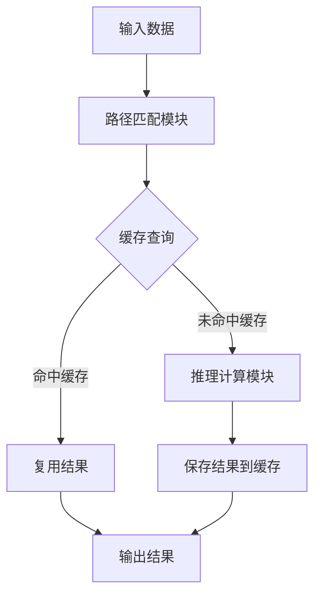

# 提高AI效率:推理路径复用技术

> 关键词：AI效率、推理路径复用、人工智能、算法优化、数学模型、项目实战、应用场景

> 摘要：本文聚焦于提高AI效率的推理路径复用技术。详细介绍了该技术的背景，包括目的、预期读者、文档结构和相关术语。深入探讨了核心概念与联系，给出了原理和架构的示意图与流程图。阐述了核心算法原理并使用Python代码进行详细说明，分析了其数学模型和公式。通过项目实战展示了代码的实际案例与解读，介绍了实际应用场景。同时推荐了学习资源、开发工具框架以及相关论文著作。最后总结了未来发展趋势与挑战，并提供常见问题解答和扩展阅读参考资料，旨在帮助读者全面了解和掌握推理路径复用技术以提升AI效率。

## 1. 背景介绍 
### 1.1 目的和范围
在人工智能领域，随着模型规模的不断增大和应用场景的日益复杂，推理效率成为了一个关键问题。推理路径复用技术旨在通过对已有的推理路径进行复用，减少不必要的重复计算，从而显著提高AI系统的推理效率。本文的范围涵盖了推理路径复用技术的基本概念、核心算法原理、数学模型、实际应用案例以及相关的工具和资源推荐等方面，旨在为读者提供一个全面而深入的技术视角。

### 1.2 预期读者
本文预期读者包括人工智能领域的研究人员、开发者、软件架构师以及对AI效率提升技术感兴趣的技术爱好者。对于正在从事AI项目开发的人员，本文可以为他们提供实用的技术思路和解决方案；对于研究人员，本文可以启发他们在该领域进行更深入的研究和探索。

### 1.3 文档结构概述
本文将按照以下结构进行组织：首先介绍推理路径复用技术的背景信息，包括目的、预期读者和文档结构等；接着阐述核心概念与联系，通过文本示意图和Mermaid流程图展示其原理和架构；然后详细讲解核心算法原理，并使用Python代码进行具体实现；随后分析数学模型和公式，并给出举例说明；通过项目实战展示代码的实际应用和详细解释；介绍该技术的实际应用场景；推荐相关的学习资源、开发工具框架和论文著作；最后总结未来发展趋势与挑战，提供常见问题解答和扩展阅读参考资料。

### 1.4 术语表
#### 1.4.1 核心术语定义
- **推理路径**：在AI推理过程中，从输入数据到输出结果所经过的一系列计算步骤和节点的序列。
- **推理路径复用**：将已经计算过的推理路径的结果进行保存，并在后续的推理过程中直接复用这些结果，避免重复计算。
- **AI效率**：指AI系统在处理任务时的性能表现，包括推理速度、计算资源利用率等方面。

#### 1.4.2 相关概念解释
- **计算图**：一种用于表示计算过程的有向无环图，节点表示计算操作，边表示数据流动。推理路径可以看作是计算图中的一条或多条路径。
- **缓存机制**：一种用于临时存储数据的机制，在推理路径复用中，缓存用于保存已经计算过的推理路径的结果。

#### 1.4.3 缩略词列表
- **AI**：Artificial Intelligence，人工智能
- **GPU**：Graphics Processing Unit，图形处理单元
- **CPU**：Central Processing Unit，中央处理单元

## 2. 核心概念与联系 
### 核心概念原理
推理路径复用技术的核心思想是利用计算的重复性，将已经计算过的推理路径的结果进行保存，并在后续的推理过程中直接复用这些结果。在AI系统中，很多推理任务可能会涉及到相同的中间计算步骤，通过复用这些中间结果，可以避免大量的重复计算，从而提高推理效率。

例如，在一个图像分类任务中，对于不同的图像，可能会有一些共同的特征提取步骤。如果每次都重新计算这些特征提取步骤，会浪费大量的计算资源。而推理路径复用技术可以将这些特征提取步骤的结果进行保存，当遇到需要相同特征的图像时，直接复用这些结果，从而减少计算量。

### 架构的文本示意图
以下是推理路径复用技术的架构示意图：

```plaintext
输入数据 -> 路径匹配模块 -> 缓存查询 -> 
|           |                |
|           |                |- 命中缓存 -> 复用结果 -> 输出结果
|           |
|           |- 未命中缓存 -> 推理计算模块 -> 保存结果到缓存 -> 输出结果
```

在这个架构中，输入数据首先进入路径匹配模块，该模块负责判断当前的推理路径是否已经存在于缓存中。如果命中缓存，则直接从缓存中获取结果并输出；如果未命中缓存，则将数据传递给推理计算模块进行计算，并将计算结果保存到缓存中，最后输出结果。

### Mermaid流程图


这个流程图清晰地展示了推理路径复用技术的工作流程，从输入数据开始，经过路径匹配和缓存查询，根据是否命中缓存采取不同的处理方式，最终输出结果。

## 3. 核心算法原理 & 具体操作步骤 
### 核心算法原理
推理路径复用技术的核心算法主要包括路径匹配和缓存管理两个部分。

#### 路径匹配
路径匹配的目的是判断当前的推理路径是否已经存在于缓存中。可以通过对推理路径进行哈希编码，将其转换为一个唯一的哈希值，然后在缓存中查找该哈希值是否存在。如果存在，则表示命中缓存；如果不存在，则表示未命中缓存。

#### 缓存管理
缓存管理主要负责缓存的存储和更新。当未命中缓存时，需要将计算结果保存到缓存中；当缓存达到一定容量时，需要采用一定的缓存替换策略，如最近最少使用（LRU）策略，来删除一些不常用的缓存项，以保证缓存的有效性。

### 具体操作步骤
以下是推理路径复用技术的具体操作步骤：

1. **输入数据**：接收待推理的输入数据。
2. **路径编码**：对当前的推理路径进行哈希编码，得到一个唯一的哈希值。
3. **缓存查询**：在缓存中查找该哈希值是否存在。
    - 如果命中缓存，直接从缓存中获取结果并输出。
    - 如果未命中缓存，进入下一步。
4. **推理计算**：使用推理计算模块对输入数据进行计算，得到推理结果。
5. **保存结果**：将推理结果和对应的哈希值保存到缓存中。
6. **输出结果**：输出推理结果。

### Python源代码实现
```python
import hashlib
from collections import OrderedDict

# 定义缓存类，使用OrderedDict实现LRU缓存
class LRUCache:
    def __init__(self, capacity):
        self.capacity = capacity
        self.cache = OrderedDict()

    def get(self, key):
        if key in self.cache:
            # 如果键存在，将其移动到有序字典的末尾
            self.cache.move_to_end(key)
            return self.cache[key]
        return None

    def put(self, key, value):
        if key in self.cache:
            # 如果键已经存在，将其移动到末尾
            self.cache.move_to_end(key)
        self.cache[key] = value
        if len(self.cache) > self.capacity:
            # 如果缓存超过容量，删除最旧的项
            self.cache.popitem(last=False)

# 定义推理路径复用类
class InferencePathReuse:
    def __init__(self, cache_capacity):
        self.cache = LRUCache(cache_capacity)

    def hash_path(self, path):
        # 对推理路径进行哈希编码
        path_str = str(path)
        hash_object = hashlib.sha256(path_str.encode())
        return hash_object.hexdigest()

    def inference(self, input_data, path):
        # 对推理路径进行哈希编码
        hash_key = self.hash_path(path)
        # 从缓存中查询结果
        result = self.cache.get(hash_key)
        if result is not None:
            print("命中缓存，复用结果")
            return result
        else:
            print("未命中缓存，进行推理计算")
            # 模拟推理计算
            result = self._compute(input_data)
            # 将结果保存到缓存中
            self.cache.put(hash_key, result)
            return result

    def _compute(self, input_data):
        # 模拟推理计算过程
        return input_data * 2

# 示例使用
if __name__ == "__main__":
    reuse = InferencePathReuse(cache_capacity=2)
    input_data1 = 5
    path1 = [1, 2, 3]
    result1 = reuse.inference(input_data1, path1)
    print("结果1:", result1)

    input_data2 = 5
    path2 = [1, 2, 3]
    result2 = reuse.inference(input_data2, path2)
    print("结果2:", result2)
```

### 代码解释
- `LRUCache`类实现了一个基于`OrderedDict`的LRU缓存，提供了`get`和`put`方法用于查询和插入缓存项。
- `InferencePathReuse`类实现了推理路径复用的核心逻辑，包括路径哈希编码、缓存查询和推理计算等功能。
- `hash_path`方法用于对推理路径进行哈希编码，生成一个唯一的哈希值。
- `inference`方法是主要的推理方法，首先对推理路径进行哈希编码，然后在缓存中查询结果。如果命中缓存，直接复用结果；如果未命中缓存，进行推理计算并将结果保存到缓存中。
- `_compute`方法模拟了推理计算过程，这里简单地将输入数据乘以2。

## 4. 数学模型和公式 & 详细讲解 & 举例说明 
### 数学模型
推理路径复用技术的数学模型可以从计算复杂度和缓存命中率两个方面进行分析。

#### 计算复杂度
假设每次推理计算的复杂度为 $O(f(n))$，其中 $n$ 是输入数据的规模。在没有推理路径复用的情况下，进行 $m$ 次推理的总计算复杂度为 $O(m \times f(n))$。

在使用推理路径复用技术的情况下，假设缓存命中率为 $h$，则命中缓存的次数为 $m \times h$，未命中缓存的次数为 $m \times (1 - h)$。命中缓存时，不需要进行推理计算，只需要进行缓存查询操作，其复杂度通常为 $O(1)$；未命中缓存时，需要进行推理计算，复杂度为 $O(f(n))$。因此，使用推理路径复用技术进行 $m$ 次推理的总计算复杂度为：

$$O(m \times h \times 1 + m \times (1 - h) \times f(n)) = O(mh + m(1 - h)f(n))$$

#### 缓存命中率
缓存命中率 $h$ 表示在所有的推理请求中，命中缓存的请求所占的比例。它受到多种因素的影响，如缓存容量、推理路径的重复性、缓存替换策略等。

### 详细讲解
从计算复杂度的公式可以看出，当缓存命中率 $h$ 较高时，$m \times h$ 这一项的比重会增加，而 $m \times (1 - h) \times f(n)$ 这一项的比重会减小，从而使总计算复杂度降低。因此，提高缓存命中率是提高推理路径复用技术效率的关键。

缓存命中率的提高可以通过合理设置缓存容量、优化缓存替换策略和提高推理路径的重复性等方式来实现。例如，增加缓存容量可以存储更多的推理路径结果，从而提高命中的概率；采用更有效的缓存替换策略可以保证缓存中始终保存着最常用的推理路径结果。

### 举例说明
假设每次推理计算的复杂度为 $O(n^2)$，进行 $m = 100$ 次推理，输入数据的规模 $n = 10$。

在没有推理路径复用的情况下，总计算复杂度为：

$$O(m \times f(n)) = O(100 \times 10^2) = O(10000)$$

假设使用推理路径复用技术，缓存命中率 $h = 0.8$。则总计算复杂度为：

$$O(mh + m(1 - h)f(n)) = O(100 \times 0.8 \times 1 + 100 \times (1 - 0.8) \times 10^2)$$
$$= O(80 + 20 \times 100) = O(80 + 2000) = O(2080)$$

可以看到，使用推理路径复用技术后，总计算复杂度显著降低，提高了推理效率。

## 5. 项目实战：代码实际案例和详细解释说明 
### 5.1  开发环境搭建
为了实现推理路径复用技术的项目实战，我们需要搭建以下开发环境：

- **操作系统**：可以选择Linux（如Ubuntu）、Windows或macOS。
- **编程语言**：Python 3.x
- **开发工具**：推荐使用PyCharm或Jupyter Notebook作为开发工具。
- **依赖库**：需要安装`hashlib`和`collections`库，这些库是Python的标准库，无需额外安装。

### 5.2  源代码详细实现和代码解读
以下是一个更完整的项目实战代码示例，结合了一个简单的神经网络推理任务：

```python
import hashlib
from collections import OrderedDict
import torch
import torch.nn as nn

# 定义LRU缓存类
class LRUCache:
    def __init__(self, capacity):
        self.capacity = capacity
        self.cache = OrderedDict()

    def get(self, key):
        if key in self.cache:
            self.cache.move_to_end(key)
            return self.cache[key]
        return None

    def put(self, key, value):
        if key in self.cache:
            self.cache.move_to_end(key)
        self.cache[key] = value
        if len(self.cache) > self.capacity:
            self.cache.popitem(last=False)

# 定义一个简单的神经网络模型
class SimpleNet(nn.Module):
    def __init__(self):
        super(SimpleNet, self).__init__()
        self.fc1 = nn.Linear(10, 20)
        self.fc2 = nn.Linear(20, 1)

    def forward(self, x):
        x = torch.relu(self.fc1(x))
        x = self.fc2(x)
        return x

# 定义推理路径复用类
class InferencePathReuse:
    def __init__(self, cache_capacity):
        self.cache = LRUCache(cache_capacity)
        self.model = SimpleNet()

    def hash_path(self, input_data):
        input_str = str(input_data.detach().numpy())
        hash_object = hashlib.sha256(input_str.encode())
        return hash_object.hexdigest()

    def inference(self, input_data):
        hash_key = self.hash_path(input_data)
        result = self.cache.get(hash_key)
        if result is not None:
            print("命中缓存，复用结果")
            return result
        else:
            print("未命中缓存，进行推理计算")
            result = self.model(input_data)
            self.cache.put(hash_key, result)
            return result

# 示例使用
if __name__ == "__main__":
    reuse = InferencePathReuse(cache_capacity=2)
    input_data1 = torch.randn(1, 10)
    result1 = reuse.inference(input_data1)
    print("结果1:", result1)

    input_data2 = torch.randn(1, 10)
    result2 = reuse.inference(input_data2)
    print("结果2:", result2)

    input_data3 = input_data1
    result3 = reuse.inference(input_data3)
    print("结果3:", result3)
```

### 代码解读
- **LRUCache类**：实现了LRU缓存机制，用于存储推理结果。
- **SimpleNet类**：定义了一个简单的神经网络模型，包含两个全连接层。
- **InferencePathReuse类**：实现了推理路径复用的核心逻辑。
    - `hash_path`方法：对输入数据进行哈希编码，生成唯一的哈希值。
    - `inference`方法：首先对输入数据进行哈希编码，然后在缓存中查询结果。如果命中缓存，直接复用结果；如果未命中缓存，使用神经网络模型进行推理计算，并将结果保存到缓存中。

### 5.3  代码解读与分析
通过这个项目实战代码，我们可以看到推理路径复用技术的实际应用。在第一次输入数据进行推理时，由于缓存中没有相应的结果，会进行实际的推理计算，并将结果保存到缓存中。当再次输入相同的数据时，会命中缓存，直接复用之前的结果，避免了重复计算，从而提高了推理效率。

需要注意的是，在实际应用中，推理路径的定义可能更加复杂，不仅仅取决于输入数据，还可能与模型的参数、计算图的结构等因素有关。因此，在实现推理路径复用技术时，需要根据具体的应用场景进行合理的设计和优化。

## 6. 实际应用场景 
推理路径复用技术在很多实际应用场景中都具有重要的价值，以下是一些常见的应用场景：

### 图像识别
在图像识别任务中，对于大量的图像数据，可能会有很多图像具有相似的特征。通过推理路径复用技术，可以将已经计算过的特征提取步骤的结果进行保存，当遇到具有相似特征的图像时，直接复用这些结果，从而减少计算量，提高识别速度。

例如，在一个人脸识别系统中，对于不同的人脸图像，可能会有一些共同的面部特征，如眼睛、鼻子、嘴巴等。通过复用这些特征提取步骤的结果，可以加快人脸识别的速度。

### 自然语言处理
在自然语言处理任务中，如文本分类、情感分析等，对于大量的文本数据，可能会有很多文本具有相似的语义结构。通过推理路径复用技术，可以将已经计算过的语义分析步骤的结果进行保存，当遇到具有相似语义结构的文本时，直接复用这些结果，从而提高处理效率。

例如，在一个新闻分类系统中，对于不同的新闻文章，可能会有一些共同的主题和关键词。通过复用这些主题和关键词的分析结果，可以加快新闻分类的速度。

### 智能客服
在智能客服系统中，对于用户的常见问题，可能会有一些固定的回答模式。通过推理路径复用技术，可以将已经计算过的问题解答步骤的结果进行保存，当遇到相同或相似的问题时，直接复用这些结果，从而提高客服响应速度。

例如，在一个电商平台的智能客服系统中，对于用户关于商品价格、库存等常见问题，通过复用已经计算过的解答结果，可以快速响应用户的问题。

### 自动驾驶
在自动驾驶系统中，对于不同的驾驶场景，可能会有一些共同的决策步骤。通过推理路径复用技术，可以将已经计算过的决策步骤的结果进行保存，当遇到相似的驾驶场景时，直接复用这些结果，从而提高决策速度，增强系统的实时性和安全性。

例如，在一个自动驾驶汽车的路径规划系统中，对于一些常见的道路场景，如十字路口、弯道等，通过复用已经计算过的路径规划结果，可以快速做出决策，避免因重复计算而导致的延迟。

## 7. 工具和资源推荐
### 7.1 学习资源推荐
#### 7.1.1 书籍推荐
- 《人工智能：一种现代的方法》：这本书是人工智能领域的经典教材，涵盖了人工智能的各个方面，包括搜索算法、机器学习、自然语言处理等，对于理解推理路径复用技术的背景和相关知识有很大的帮助。
- 《深度学习》：由Ian Goodfellow、Yoshua Bengio和Aaron Courville合著，这本书系统地介绍了深度学习的基本原理、算法和应用，对于深入理解神经网络推理和优化有重要的参考价值。

#### 7.1.2 在线课程
- Coursera上的“人工智能基础”课程：该课程由知名高校的教授授课，内容涵盖了人工智能的基本概念、算法和应用，通过视频讲解、作业和项目实践等方式，帮助学习者快速掌握人工智能的基础知识。
- edX上的“深度学习微硕士项目”：该项目包含多个深度学习相关的课程，如卷积神经网络、循环神经网络等，适合有一定编程基础的学习者深入学习深度学习技术。

#### 7.1.3 技术博客和网站
- Medium上的人工智能相关博客：Medium上有很多人工智能领域的专业博主，他们会分享最新的技术动态、研究成果和实践经验，通过阅读这些博客可以及时了解推理路径复用技术的最新发展。
- arXiv.org：这是一个预印本服务器，提供了大量的学术论文，包括人工智能领域的最新研究成果。可以通过搜索关键词“推理路径复用”等，获取相关的研究论文和技术报告。

### 7.2 开发工具框架推荐
#### 7.2.1 IDE和编辑器
- PyCharm：这是一款专业的Python集成开发环境，提供了丰富的代码编辑、调试、测试等功能，对于开发基于Python的推理路径复用项目非常方便。
- Jupyter Notebook：这是一个交互式的开发环境，支持Python、R等多种编程语言，适合进行数据探索、模型训练和代码演示等工作。

#### 7.2.2 调试和性能分析工具
- TensorBoard：这是TensorFlow提供的一个可视化工具，可以用于监控模型的训练过程、分析模型的性能指标等。在推理路径复用项目中，可以使用TensorBoard来分析缓存命中率、推理时间等性能指标。
- Py-Spy：这是一个用于Python代码性能分析的工具，可以实时监测Python程序的CPU使用率、函数调用时间等信息，帮助开发者找出代码中的性能瓶颈。

#### 7.2.3 相关框架和库
- PyTorch：这是一个开源的深度学习框架，提供了丰富的神经网络层和优化算法，支持GPU加速计算。在推理路径复用项目中，可以使用PyTorch来构建和训练神经网络模型。
- TensorFlow：这是另一个广泛使用的深度学习框架，具有强大的分布式训练和部署能力。可以使用TensorFlow来实现推理路径复用技术，并将模型部署到不同的硬件平台上。

### 7.3 相关论文著作推荐
#### 7.3.1 经典论文
- “Deep Compression: Compressing Deep Neural Networks with Pruning, Trained Quantization and Huffman Coding”：这篇论文提出了一种深度压缩技术，通过剪枝、量化和霍夫曼编码等方法，减少神经网络的参数数量和计算量，提高推理效率。虽然没有直接涉及推理路径复用技术，但对于理解神经网络的优化有重要的启示作用。
- “Efficient Inference Engine on Compressed Deep Neural Networks”：该论文研究了在压缩后的深度神经网络上进行高效推理的方法，提出了一种基于硬件的推理引擎，通过复用中间计算结果来提高推理效率，与推理路径复用技术有一定的关联。

#### 7.3.2 最新研究成果
- 可以通过关注顶级人工智能会议，如NeurIPS、ICML、CVPR等，获取推理路径复用技术的最新研究成果。这些会议上会有很多关于人工智能效率提升的研究论文，其中可能会涉及到推理路径复用技术的新方法和新思路。

#### 7.3.3 应用案例分析
- 一些科技公司的技术博客会分享他们在实际项目中应用推理路径复用技术的案例分析。例如，Google、Facebook等公司的技术博客，通过阅读这些案例分析，可以了解推理路径复用技术在实际应用中的具体实现和效果。

## 8. 总结：未来发展趋势与挑战
### 未来发展趋势
#### 与硬件的深度融合
随着硬件技术的不断发展，如GPU、TPU等专用计算芯片的性能不断提升，推理路径复用技术将与硬件进行更深度的融合。硬件可以提供更高效的缓存机制和计算能力，进一步提高推理效率。例如，一些新型的硬件架构可以直接支持推理路径的复用，减少数据传输和计算开销。

#### 自适应推理路径复用
未来的推理路径复用技术将更加智能化，能够根据不同的输入数据和任务需求，自适应地选择合适的推理路径进行复用。例如，在面对复杂的输入数据时，系统可以自动分析数据的特征，选择最相关的推理路径进行复用，从而提高复用的准确性和效率。

#### 跨模型和跨领域的复用
目前的推理路径复用技术主要集中在单个模型内部，未来将向跨模型和跨领域的复用方向发展。例如，不同的神经网络模型可能会有一些共同的计算步骤，通过跨模型的推理路径复用，可以进一步减少计算量。同时，在不同的领域，如计算机视觉、自然语言处理等，也可以探索跨领域的推理路径复用，实现资源的更高效利用。

### 挑战
#### 缓存管理的复杂性
随着模型规模的不断增大和推理路径的日益复杂，缓存管理的难度也会增加。如何合理地设置缓存容量、选择合适的缓存替换策略以及处理缓存一致性问题等，都是需要解决的挑战。例如，在分布式环境下，多个节点的缓存之间需要保持一致性，避免出现数据不一致的问题。

#### 推理路径的准确表示
准确地表示推理路径是实现推理路径复用的关键。然而，在实际应用中，推理路径可能受到多种因素的影响，如模型的参数、输入数据的特征等，如何准确地表示推理路径并进行有效的匹配是一个挑战。例如，对于一些复杂的神经网络模型，其推理路径可能非常复杂，难以用简单的方式进行表示和匹配。

#### 兼容性和可扩展性
在不同的深度学习框架和硬件平台上实现推理路径复用技术，需要考虑兼容性和可扩展性问题。不同的框架和平台可能有不同的接口和实现方式，如何确保推理路径复用技术能够在多种环境下正常工作，并具有良好的可扩展性，是一个需要解决的问题。

## 9. 附录：常见问题与解答
### 问题1：推理路径复用技术是否适用于所有的AI模型？
解答：推理路径复用技术并不适用于所有的AI模型。它主要适用于那些存在重复计算步骤的模型，如神经网络模型。对于一些简单的模型，可能不存在明显的重复计算，使用推理路径复用技术的效果可能不明显。

### 问题2：如何提高缓存命中率？
解答：可以通过以下几种方式提高缓存命中率：
- 增加缓存容量：可以存储更多的推理路径结果，提高命中的概率。
- 优化缓存替换策略：选择合适的缓存替换策略，如LRU、LFU等，保证缓存中始终保存着最常用的推理路径结果。
- 提高推理路径的重复性：通过对输入数据进行预处理，使得更多的推理任务具有相似的推理路径，从而提高复用的可能性。

### 问题3：推理路径复用技术会增加系统的内存开销吗？
解答：推理路径复用技术会增加一定的内存开销，主要用于缓存推理路径的结果。但是，通过合理设置缓存容量和采用有效的缓存替换策略，可以控制内存开销在可接受的范围内。同时，由于减少了重复计算，整体的计算资源利用率会提高，可能会在一定程度上弥补内存开销的增加。

### 问题4：如何判断推理路径是否可以复用？
解答：可以通过对推理路径进行哈希编码，将其转换为一个唯一的哈希值，然后在缓存中查找该哈希值是否存在。如果存在，则表示推理路径可以复用；如果不存在，则需要进行实际的推理计算。

## 10. 扩展阅读 & 参考资料
### 扩展阅读
- 《人工智能中的不确定性推理》：这本书深入探讨了人工智能中的不确定性推理方法，对于理解推理过程中的复杂性和多样性有很大的帮助，与推理路径复用技术的研究有一定的关联。
- 《高性能计算与并行编程》：了解高性能计算和并行编程的知识，可以帮助开发者更好地实现推理路径复用技术，提高系统的并行计算能力和效率。

### 参考资料
- 相关的学术论文和研究报告，可以通过学术数据库，如IEEE Xplore、ACM Digital Library等进行查找。
- 深度学习框架的官方文档，如PyTorch、TensorFlow等的官方文档，对于理解框架的使用和实现推理路径复用技术有重要的参考价值。

作者：AI天才研究院/AI Genius Institute & 禅与计算机程序设计艺术 /Zen And The Art of Computer Programming