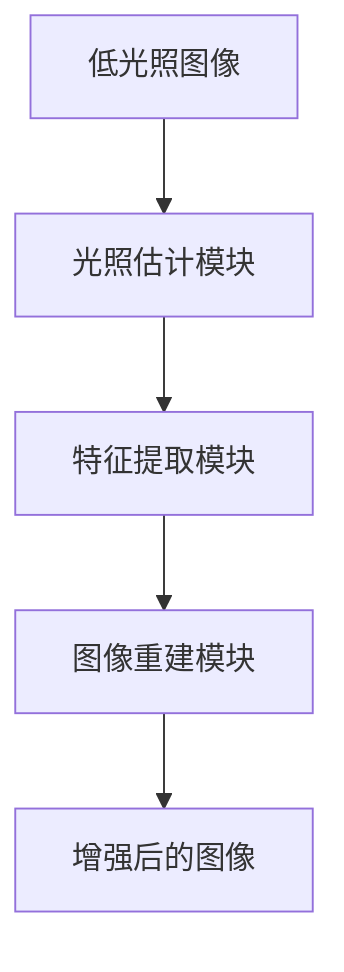

# 提高AI模型在低光照环境下的图像增强效果

> 关键词：AI模型、低光照环境、图像增强、深度学习、光照处理

> 摘要：本文聚焦于如何提高AI模型在低光照环境下的图像增强效果。首先介绍了相关背景知识，包括研究目的、预期读者等内容。接着阐述了核心概念及联系，详细讲解了核心算法原理和具体操作步骤，同时给出了对应的数学模型和公式。通过项目实战，展示了代码的实际案例和详细解释。分析了实际应用场景，并推荐了相关的工具和资源。最后总结了未来发展趋势与挑战，还提供了常见问题解答和扩展阅读参考资料，旨在为相关领域的研究者和开发者提供全面的技术指导。

## 1. 背景介绍 
### 1.1 目的和范围
在许多实际应用场景中，如安防监控、夜间拍摄、水下探测等，常常会遇到低光照环境下获取图像的情况。低光照图像通常存在对比度低、细节模糊、噪声明显等问题，这严重影响了图像的视觉效果和后续处理的准确性，如目标检测、图像识别等任务的性能会大幅下降。本研究的目的就是探索如何利用AI模型有效提高低光照环境下的图像增强效果，以提升图像质量，为后续的图像处理和分析提供更好的基础。

研究范围涵盖了多种基于深度学习的图像增强方法，包括卷积神经网络（CNN）、生成对抗网络（GAN）等在低光照图像增强中的应用。同时，会分析不同方法的优缺点和适用场景，以及探讨如何优化模型以获得更好的增强效果。

### 1.2 预期读者
本文预期读者包括计算机视觉领域的研究者、AI模型开发者、图像处理工程师等。对于正在从事低光照图像增强相关项目的人员，本文可以提供技术思路和方法参考；对于对该领域感兴趣的初学者，也能帮助他们了解基本概念和主要技术手段。

### 1.3 文档结构概述
本文首先介绍了背景信息，让读者了解研究的目的和意义。接着阐述核心概念与联系，使读者对低光照图像增强的基本原理有清晰的认识。核心算法原理和具体操作步骤部分详细讲解了如何实现图像增强模型。数学模型和公式的介绍则从理论层面进一步深入剖析。项目实战环节通过实际代码案例展示了如何将理论应用到实践中。然后分析了实际应用场景，让读者了解该技术的实际用途。工具和资源推荐为读者提供了学习和开发的相关资料。最后总结未来发展趋势与挑战，并解答常见问题，提供扩展阅读参考资料。

### 1.4 术语表
#### 1.4.1 核心术语定义
- **低光照图像**：指在光照条件不足的情况下拍摄得到的图像，通常表现为整体亮度低、对比度差、细节不清晰。
- **图像增强**：通过特定的算法和技术，改善图像的视觉效果，提高图像的质量，如增强对比度、提高亮度、减少噪声等。
- **卷积神经网络（CNN）**：一种专门用于处理具有网格结构数据（如图像）的深度学习模型，通过卷积层、池化层等组件自动提取图像特征。
- **生成对抗网络（GAN）**：由生成器和判别器组成的深度学习模型，通过两者的对抗训练来生成逼真的数据，在图像增强中可用于生成高质量的增强图像。

#### 1.4.2 相关概念解释
- **光照估计**：在图像增强中，光照估计是指估计图像中光照的分布和强度，以便对图像进行针对性的光照调整。
- **对比度拉伸**：一种简单的图像增强方法，通过扩展图像的灰度范围来提高图像的对比度。
- **去噪**：去除图像中包含的噪声，使图像更加清晰，常见的噪声类型有高斯噪声、椒盐噪声等。

#### 1.4.3 缩略词列表
- **CNN**：Convolutional Neural Network（卷积神经网络）
- **GAN**：Generative Adversarial Network（生成对抗网络）
- **ReLU**：Rectified Linear Unit（修正线性单元）

## 2. 核心概念与联系 

### 核心概念原理
在低光照图像增强中，主要涉及到光照估计、图像特征提取和图像重建三个核心概念。

光照估计的原理是分析图像中不同区域的光照强度，确定图像整体的光照分布情况。例如，可以通过统计图像的灰度值分布，找到图像中最亮和最暗的区域，以此为基础估计光照的强度和方向。

图像特征提取则是利用深度学习模型（如CNN）从图像中提取有意义的特征。CNN通过卷积层对图像进行卷积操作，提取不同尺度和层次的特征，如边缘、纹理等。这些特征可以帮助模型更好地理解图像的内容。

图像重建是根据光照估计和特征提取的结果，对低光照图像进行增强处理，生成高质量的图像。可以通过神经网络学习低光照图像到正常光照图像的映射关系，从而实现图像的重建。

### 架构的文本示意图
```plaintext
低光照图像 -> 光照估计模块 -> 特征提取模块 -> 图像重建模块 -> 增强后的图像
```
光照估计模块接收低光照图像，分析其光照分布；特征提取模块从图像中提取特征；图像重建模块根据光照估计和特征提取的结果，生成增强后的图像。

### Mermaid流程图


## 3. 核心算法原理 & 具体操作步骤 

### 基于CNN的低光照图像增强算法原理
基于CNN的低光照图像增强算法主要通过卷积层、激活层和池化层来提取图像特征，并通过全连接层或反卷积层进行图像重建。

以下是一个简单的基于CNN的低光照图像增强模型的Python代码示例：
```python
import torch
import torch.nn as nn

class LowLightEnhancementCNN(nn.Module):
    def __init__(self):
        super(LowLightEnhancementCNN, self).__init__()
        self.conv1 = nn.Conv2d(3, 64, kernel_size=3, padding=1)
        self.relu1 = nn.ReLU()
        self.conv2 = nn.Conv2d(64, 64, kernel_size=3, padding=1)
        self.relu2 = nn.ReLU()
        self.conv3 = nn.Conv2d(64, 3, kernel_size=3, padding=1)

    def forward(self, x):
        x = self.relu1(self.conv1(x))
        x = self.relu2(self.conv2(x))
        x = self.conv3(x)
        return x

# 初始化模型
model = LowLightEnhancementCNN()

# 定义输入图像（示例）
input_image = torch.randn(1, 3, 256, 256)

# 前向传播
output_image = model(input_image)
print(output_image.shape)
```
### 具体操作步骤
1. **数据准备**：收集低光照图像和对应的正常光照图像作为训练数据，将数据进行预处理，如归一化、裁剪等。
2. **模型构建**：构建CNN模型，确定模型的层数、卷积核大小等参数。
3. **损失函数定义**：选择合适的损失函数，如均方误差损失（MSE），用于衡量增强后的图像与正常光照图像之间的差异。
```python
criterion = nn.MSELoss()
```
4. **优化器选择**：选择优化器，如随机梯度下降（SGD）或Adam优化器，用于更新模型的参数。
```python
optimizer = torch.optim.Adam(model.parameters(), lr=0.001)
```
5. **训练模型**：将训练数据输入模型，进行多次迭代训练，不断更新模型的参数，使损失函数的值逐渐减小。
```python
num_epochs = 10
for epoch in range(num_epochs):
    # 前向传播
    outputs = model(input_image)
    loss = criterion(outputs, target_image)

    # 反向传播和优化
    optimizer.zero_grad()
    loss.backward()
    optimizer.step()

    print(f'Epoch [{epoch+1}/{num_epochs}], Loss: {loss.item():.4f}')
```
6. **模型评估**：使用测试数据对训练好的模型进行评估，计算评估指标，如峰值信噪比（PSNR）、结构相似性指数（SSIM）等。
7. **图像增强**：将低光照图像输入训练好的模型，得到增强后的图像。

## 4. 数学模型和公式 & 详细讲解 & 举例说明 

### 均方误差损失（MSE）
均方误差损失用于衡量增强后的图像 $I_{enhanced}$ 与正常光照图像 $I_{normal}$ 之间的差异，其数学公式为：
$$
MSE = \frac{1}{N} \sum_{i=1}^{N} (I_{enhanced}(i) - I_{normal}(i))^2
$$
其中，$N$ 是图像中像素的总数，$I_{enhanced}(i)$ 和 $I_{normal}(i)$ 分别表示增强后的图像和正常光照图像中第 $i$ 个像素的值。

详细讲解：MSE 计算了每个像素值的差值的平方的平均值。差值越大，MSE 的值就越大，说明增强后的图像与正常光照图像之间的差异越大。在训练模型时，我们的目标是最小化 MSE，从而使增强后的图像尽可能接近正常光照图像。

举例说明：假设我们有两个 2x2 的图像，增强后的图像 $I_{enhanced} = \begin{bmatrix} 1 & 2 \\ 3 & 4 \end{bmatrix}$，正常光照图像 $I_{normal} = \begin{bmatrix} 2 & 3 \\ 4 & 5 \end{bmatrix}$。
首先计算每个像素的差值：
$$
\begin{bmatrix} 1 - 2 & 2 - 3 \\ 3 - 4 & 4 - 5 \end{bmatrix} = \begin{bmatrix} -1 & -1 \\ -1 & -1 \end{bmatrix}
$$
然后计算差值的平方：
$$
\begin{bmatrix} (-1)^2 & (-1)^2 \\ (-1)^2 & (-1)^2 \end{bmatrix} = \begin{bmatrix} 1 & 1 \\ 1 & 1 \end{bmatrix}
$$
接着计算平方和：$1 + 1 + 1 + 1 = 4$。
最后计算 MSE：$MSE = \frac{4}{4} = 1$。

### 峰值信噪比（PSNR）
峰值信噪比用于衡量图像的质量，其数学公式为：
$$
PSNR = 20 \log_{10} \left( \frac{MAX_I}{\sqrt{MSE}} \right)
$$
其中，$MAX_I$ 是图像像素值的最大可能值，对于 8 位图像，$MAX_I = 255$。

详细讲解：PSNR 的值越高，说明图像的质量越好。它通过比较图像的最大可能像素值和 MSE 来衡量图像的失真程度。

举例说明：假设 $MSE = 1$，$MAX_I = 255$，则：
$$
PSNR = 20 \log_{10} \left( \frac{255}{\sqrt{1}} \right) \approx 48.13 \text{dB}
$$

### 结构相似性指数（SSIM）
结构相似性指数用于衡量两幅图像的结构相似性，其数学公式为：
$$
SSIM(x,y) = \frac{(2\mu_x\mu_y + C_1)(2\sigma_{xy} + C_2)}{(\mu_x^2 + \mu_y^2 + C_1)(\sigma_x^2 + \sigma_y^2 + C_2)}
$$
其中，$\mu_x$ 和 $\mu_y$ 分别是图像 $x$ 和 $y$ 的均值，$\sigma_x^2$ 和 $\sigma_y^2$ 分别是图像 $x$ 和 $y$ 的方差，$\sigma_{xy}$ 是图像 $x$ 和 $y$ 的协方差，$C_1$ 和 $C_2$ 是为了避免分母为零而设置的常数。

详细讲解：SSIM 的值范围在 -1 到 1 之间，值越接近 1 表示两幅图像的结构越相似。它综合考虑了图像的亮度、对比度和结构信息。

举例说明：计算 SSIM 需要对图像进行分块处理，这里简单说明其原理。假设我们有两个简单的 1D 信号 $x = [1, 2, 3]$ 和 $y = [1.1, 2.1, 3.1]$，可以按照上述公式计算它们的 SSIM 值。

## 5. 项目实战：代码实际案例和详细解释说明 

### 5.1  开发环境搭建
1. **安装 Python**：建议使用 Python 3.7 及以上版本，可以从 Python 官方网站（https://www.python.org/downloads/）下载并安装。
2. **安装深度学习框架**：本文使用 PyTorch 作为深度学习框架，可以根据自己的 CUDA 版本选择合适的 PyTorch 版本进行安装，安装命令如下：
```sh
pip install torch torchvision
```
3. **安装其他依赖库**：安装 numpy、opencv-python 等常用库，用于数据处理和图像操作。
```sh
pip install numpy opencv-python
```

### 5.2  源代码详细实现和代码解读
```python
import torch
import torch.nn as nn
import torch.optim as optim
import cv2
import numpy as np

# 定义低光照图像增强模型
class LowLightEnhancementCNN(nn.Module):
    def __init__(self):
        super(LowLightEnhancementCNN, self).__init__()
        self.conv1 = nn.Conv2d(3, 64, kernel_size=3, padding=1)
        self.relu1 = nn.ReLU()
        self.conv2 = nn.Conv2d(64, 64, kernel_size=3, padding=1)
        self.relu2 = nn.ReLU()
        self.conv3 = nn.Conv2d(64, 3, kernel_size=3, padding=1)

    def forward(self, x):
        x = self.relu1(self.conv1(x))
        x = self.relu2(self.conv2(x))
        x = self.conv3(x)
        return x

# 数据加载和预处理
def load_image(image_path):
    image = cv2.imread(image_path)
    image = cv2.cvtColor(image, cv2.COLOR_BGR2RGB)
    image = image / 255.0  # 归一化
    image = np.transpose(image, (2, 0, 1))  # 调整维度
    image = torch.from_numpy(image).float().unsqueeze(0)
    return image

# 训练模型
def train_model(model, train_images, target_images, num_epochs=10, lr=0.001):
    criterion = nn.MSELoss()
    optimizer = optim.Adam(model.parameters(), lr=lr)

    for epoch in range(num_epochs):
        for i in range(len(train_images)):
            input_image = train_images[i]
            target_image = target_images[i]

            # 前向传播
            outputs = model(input_image)
            loss = criterion(outputs, target_image)

            # 反向传播和优化
            optimizer.zero_grad()
            loss.backward()
            optimizer.step()

        print(f'Epoch [{epoch+1}/{num_epochs}], Loss: {loss.item():.4f}')

    return model

# 图像增强
def enhance_image(model, input_image):
    model.eval()
    with torch.no_grad():
        output_image = model(input_image)
    output_image = output_image.squeeze(0).cpu().numpy()
    output_image = np.transpose(output_image, (1, 2, 0))
    output_image = np.clip(output_image, 0, 1) * 255
    output_image = output_image.astype(np.uint8)
    output_image = cv2.cvtColor(output_image, cv2.COLOR_RGB2BGR)
    return output_image

# 主函数
if __name__ == "__main__":
    # 加载数据
    train_image_path = 'low_light_image.jpg'
    target_image_path = 'normal_light_image.jpg'
    train_image = load_image(train_image_path)
    target_image = load_image(target_image_path)

    # 初始化模型
    model = LowLightEnhancementCNN()

    # 训练模型
    model = train_model(model, [train_image], [target_image], num_epochs=10)

    # 图像增强
    enhanced_image = enhance_image(model, train_image)

    # 保存增强后的图像
    cv2.imwrite('enhanced_image.jpg', enhanced_image)
```

### 5.3  代码解读与分析
1. **模型定义**：`LowLightEnhancementCNN` 类定义了一个简单的 CNN 模型，包含三个卷积层和两个 ReLU 激活层。
2. **数据加载和预处理**：`load_image` 函数用于加载图像，并进行归一化和维度调整，将图像转换为 PyTorch 张量。
3. **训练模型**：`train_model` 函数定义了训练过程，使用 MSE 损失函数和 Adam 优化器进行模型训练。
4. **图像增强**：`enhance_image` 函数将低光照图像输入训练好的模型，得到增强后的图像，并进行后处理，如反归一化、调整维度等。
5. **主函数**：在主函数中，加载数据，初始化模型，训练模型，进行图像增强，并保存增强后的图像。

## 6. 实际应用场景 
### 安防监控
在安防监控领域，很多监控摄像头需要在夜间或低光照环境下工作。低光照图像增强技术可以提高监控图像的质量，使监控人员能够更清晰地观察到监控区域的情况，有助于发现潜在的安全隐患，如人员活动、物体移动等。

### 夜间拍摄
在摄影和摄像领域，夜间拍摄常常会遇到低光照问题。通过使用低光照图像增强技术，可以改善夜间拍摄的照片和视频的质量，使画面更加清晰、明亮，色彩更加鲜艳，提升拍摄作品的艺术效果。

### 水下探测
在水下探测中，由于水下光线较弱，拍摄到的图像往往对比度低、细节模糊。低光照图像增强技术可以增强水下图像的质量，帮助科研人员更好地观察水下生物、地质结构等情况，为水下科研提供有力支持。

### 医学影像
在医学影像领域，某些成像设备在拍摄过程中可能会受到光照条件的影响，导致图像质量不佳。低光照图像增强技术可以提高医学影像的清晰度，有助于医生更准确地诊断疾病。

## 7. 工具和资源推荐
### 7.1 学习资源推荐
#### 7.1.1 书籍推荐
- 《深度学习》（Deep Learning）：由 Ian Goodfellow、Yoshua Bengio 和 Aaron Courville 撰写，是深度学习领域的经典教材，涵盖了深度学习的基本概念、算法和应用。
- 《计算机视觉：算法与应用》（Computer Vision: Algorithms and Applications）：全面介绍了计算机视觉的各种算法和应用，包括图像增强、目标检测等内容。

#### 7.1.2 在线课程
- Coursera 上的“深度学习专项课程”（Deep Learning Specialization）：由 Andrew Ng 教授授课，系统地介绍了深度学习的各个方面，包括卷积神经网络、生成对抗网络等。
- edX 上的“计算机视觉基础”（Foundations of Computer Vision）：提供了计算机视觉的基础知识和实践项目，有助于学习者深入理解图像增强等技术。

#### 7.1.3 技术博客和网站
- Medium：有许多关于深度学习和计算机视觉的优秀博客文章，如 Towards Data Science 板块，经常分享最新的研究成果和实践经验。
- arXiv：提供了大量的学术论文，涵盖了低光照图像增强等领域的最新研究动态。

### 7.2 开发工具框架推荐
#### 7.2.1 IDE和编辑器
- PyCharm：是一款专业的 Python 集成开发环境，提供了代码编辑、调试、版本控制等功能，适合深度学习项目的开发。
- Jupyter Notebook：以交互式的方式编写和运行代码，方便进行数据探索和模型调试，常用于深度学习的实验和演示。

#### 7.2.2 调试和性能分析工具
- TensorBoard：是 TensorFlow 提供的可视化工具，也可以与 PyTorch 结合使用，用于可视化模型的训练过程、损失曲线、参数分布等。
- Py-Spy：可以对 Python 程序进行性能分析，找出程序中的性能瓶颈，帮助优化代码。

#### 7.2.3 相关框架和库
- PyTorch：是一个开源的深度学习框架，具有动态图的特点，易于使用和调试，广泛应用于图像增强等计算机视觉任务。
- OpenCV：是一个强大的计算机视觉库，提供了各种图像处理和计算机视觉算法，如图像滤波、特征提取等。

### 7.3 相关论文著作推荐
#### 7.3.1 经典论文
- "Deep Retinex Decomposition for Low-Light Enhancement"：提出了一种基于深度 Retinex 分解的低光照图像增强方法，通过学习图像的光照和反射分量来实现图像增强。
- "EnhanceNet: Single Image Super-Resolution Through Automated Texture Synthesis"：虽然主要关注图像超分辨率，但其中的一些思想和方法也可以应用于低光照图像增强。

#### 7.3.2 最新研究成果
可以关注 CVPR（计算机视觉与模式识别会议）、ICCV（国际计算机视觉会议）等顶级计算机视觉会议上的最新研究成果，了解低光照图像增强领域的前沿技术。

#### 7.3.3 应用案例分析
一些知名的科技公司和研究机构会发布低光照图像增强技术在实际应用中的案例分析，如华为、谷歌等公司的技术博客，这些案例可以帮助我们更好地理解技术的实际应用效果。

## 8. 总结：未来发展趋势与挑战
### 未来发展趋势
- **多模态融合**：将低光照图像增强与其他模态的数据（如红外图像、深度图像等）进行融合，以获得更丰富的信息，提高图像增强的效果。
- **实时处理**：随着硬件技术的不断发展，低光照图像增强技术将朝着实时处理的方向发展，满足更多实时应用场景的需求，如自动驾驶、实时监控等。
- **无监督学习和自监督学习**：传统的图像增强方法通常需要大量的标注数据，而无监督学习和自监督学习可以减少对标注数据的依赖，提高模型的泛化能力和适应性。

### 挑战
- **复杂光照环境适应**：实际应用中，光照环境往往非常复杂，如存在阴影、反光等情况，如何让 AI 模型在这些复杂光照环境下仍然能够取得良好的增强效果是一个挑战。
- **模型复杂度和计算资源**：一些先进的图像增强模型往往具有较高的复杂度，需要大量的计算资源和时间进行训练和推理，如何在保证增强效果的前提下降低模型的复杂度和计算成本是一个亟待解决的问题。
- **评价指标的局限性**：现有的图像增强评价指标（如 PSNR、SSIM 等）不能完全反映人类视觉系统对图像质量的感知，需要研究更符合人类视觉感知的评价指标。

## 9. 附录：常见问题与解答
### 问题1：低光照图像增强模型的训练数据从哪里获取？
可以通过以下几种方式获取训练数据：
- 公开数据集：如 LOL 数据集、Exclusively Dark 数据集等，这些数据集包含了低光照图像和对应的正常光照图像。
- 自行采集：使用相机在不同的低光照环境下拍摄图像，并进行人工标注，得到训练数据。

### 问题2：如何选择合适的损失函数？
选择损失函数需要考虑具体的应用场景和模型需求。常见的损失函数有均方误差损失（MSE）、均方根误差损失（RMSE）、结构相似性损失（SSIM Loss）等。MSE 适用于注重像素级差异的场景；SSIM Loss 更符合人类视觉感知，适用于需要保持图像结构信息的场景。

### 问题3：如何提高模型的泛化能力？
可以通过以下方法提高模型的泛化能力：
- 数据增强：对训练数据进行随机裁剪、翻转、旋转等操作，增加数据的多样性。
- 正则化：在模型训练过程中使用 L1 或 L2 正则化，防止模型过拟合。
- 增加训练数据：收集更多的训练数据，让模型学习到更多的特征和模式。

## 10. 扩展阅读 & 参考资料
- Goodfellow, I., Bengio, Y., & Courville, A. (2016). Deep Learning. MIT Press.
- Szeliski, R. (2010). Computer Vision: Algorithms and Applications. Springer.
- Chen, W., & Koltun, V. (2016). Deep Retinex Decomposition for Low-Light Enhancement. arXiv preprint arXiv:1612.02446.
- Ledig, C., et al. (2017). Photo-Realistic Single Image Super-Resolution Using a Generative Adversarial Network. arXiv preprint arXiv:1609.04802.

作者：AI天才研究院/AI Genius Institute & 禅与计算机程序设计艺术 /Zen And The Art of Computer Programming