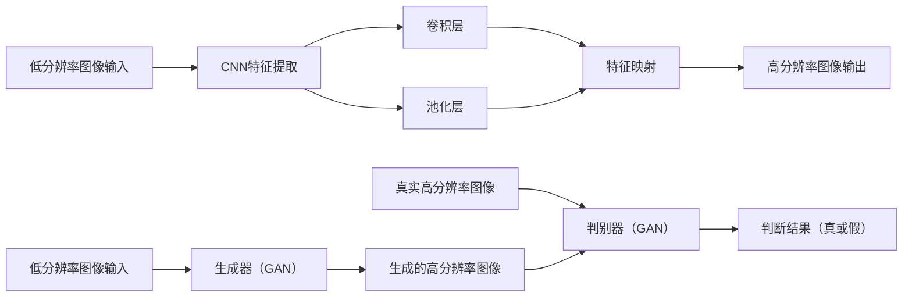

# 提高AI模型在低分辨率图像超分辨率重建中的效果

> 关键词：AI模型、低分辨率图像、超分辨率重建、图像质量提升、深度学习算法

> 摘要：本文聚焦于如何提高AI模型在低分辨率图像超分辨率重建中的效果。随着数字图像技术的发展，超分辨率重建在众多领域有着广泛应用，但低分辨率图像重建效果的提升仍面临诸多挑战。文章将深入探讨相关核心概念、算法原理、数学模型，并通过项目实战展示具体实现过程，分析实际应用场景，同时推荐学习资源、开发工具和相关论文，最后总结未来发展趋势与挑战，旨在为研究者和开发者提供全面的技术指导，以推动该领域的发展。

## 1. 背景介绍 
### 1.1 目的和范围
本文章的目的在于深入研究并探讨如何提高AI模型在低分辨率图像超分辨率重建中的效果。低分辨率图像超分辨率重建是计算机视觉领域的一个重要研究方向，在监控安防、医学影像、卫星遥感等众多领域有着广泛的应用需求。我们将涵盖从基础概念到实际应用的各个方面，包括核心算法原理、数学模型的分析、项目实战案例以及未来发展趋势的探讨等。通过全面的研究，为相关领域的研究者和开发者提供有价值的参考和技术支持。

### 1.2 预期读者
本文预期读者主要包括计算机视觉、图像处理领域的研究者、开发者，以及对AI技术在图像领域应用感兴趣的专业人士。无论是从事学术研究，希望在低分辨率图像超分辨率重建领域取得突破的科研人员，还是致力于开发相关商业应用的工程师，都能从本文中获取到有用的信息和技术思路。

### 1.3 文档结构概述
本文将按照以下结构进行组织：首先介绍核心概念与联系，明确相关术语和概念的定义，通过文本示意图和Mermaid流程图展示核心原理和架构；接着详细阐述核心算法原理，并使用Python源代码进行具体操作步骤的说明；然后给出数学模型和公式，并结合实际例子进行详细讲解；之后通过项目实战展示代码实际案例，并进行详细解释和分析；再探讨实际应用场景；推荐学习资源、开发工具和相关论文；最后总结未来发展趋势与挑战，并提供常见问题与解答以及扩展阅读和参考资料。

### 1.4 术语表
#### 1.4.1 核心术语定义
- **低分辨率图像**：指图像的像素数量较少，图像细节信息相对匮乏，清晰度较低的图像。通常表现为图像模糊、边缘不清晰等特征。
- **超分辨率重建**：通过特定的算法和技术，将低分辨率图像转换为高分辨率图像的过程，旨在恢复图像中丢失的细节信息，提高图像的质量和清晰度。
- **AI模型**：利用人工智能技术构建的模型，在本文章中主要指用于图像超分辨率重建的深度学习模型，如卷积神经网络（CNN）等。
- **图像质量评估指标**：用于衡量超分辨率重建后图像质量的量化指标，常见的有峰值信噪比（PSNR）、结构相似性指数（SSIM）等。

#### 1.4.2 相关概念解释
- **卷积神经网络（CNN）**：一种专门为处理具有网格结构数据（如图像）而设计的深度学习模型。它通过卷积层、池化层和全连接层等组件，自动提取图像的特征信息，在图像分类、目标检测、超分辨率重建等领域取得了显著的成果。
- **残差学习**：一种深度学习中的训练策略，通过引入残差块，让网络学习输入与输出之间的残差信息，而不是直接学习输入到输出的映射关系。这种方法可以有效缓解深度神经网络中的梯度消失和梯度爆炸问题，提高网络的训练效率和性能。
- **生成对抗网络（GAN）**：由生成器和判别器两个部分组成的深度学习模型。生成器负责生成数据，判别器负责判断输入数据是真实数据还是生成器生成的假数据。通过两者之间的对抗训练，生成器可以逐渐学习到真实数据的分布，生成高质量的数据。在图像超分辨率重建中，GAN可以用于生成更逼真的高分辨率图像。

#### 1.4.3 缩略词列表
- **PSNR**：Peak Signal-to-Noise Ratio，峰值信噪比
- **SSIM**：Structural Similarity Index，结构相似性指数
- **CNN**：Convolutional Neural Network，卷积神经网络
- **GAN**：Generative Adversarial Network，生成对抗网络

## 2. 核心概念与联系 

### 核心概念原理
在低分辨率图像超分辨率重建中，核心的概念是利用AI模型学习低分辨率图像到高分辨率图像的映射关系。传统的超分辨率方法主要基于插值算法，如双线性插值、双三次插值等，这些方法虽然计算简单，但只能对图像进行简单的放大，无法恢复图像中丢失的细节信息。而基于AI的超分辨率方法则通过深度学习模型，从大量的低分辨率 - 高分辨率图像对中学习到更复杂的映射关系，从而能够生成具有更高质量和更多细节的高分辨率图像。

以卷积神经网络（CNN）为例，它通过卷积层对输入的低分辨率图像进行特征提取，将图像的局部特征信息转化为特征图。不同的卷积层可以提取不同层次的特征，从底层的边缘、纹理特征到高层的语义特征。池化层则用于减少特征图的尺寸，降低计算量，同时保留重要的特征信息。最后，通过全连接层或反卷积层将提取的特征映射到高分辨率图像空间，得到重建后的高分辨率图像。

生成对抗网络（GAN）在超分辨率重建中的应用则引入了对抗训练的思想。生成器负责生成高分辨率图像，判别器则负责判断生成的图像是真实的高分辨率图像还是生成器生成的假图像。通过不断的对抗训练，生成器可以逐渐生成更逼真、更接近真实高分辨率图像的结果。

### 架构的文本示意图
```plaintext
低分辨率图像输入 -> CNN特征提取（卷积层、池化层） -> 特征映射（全连接层或反卷积层） -> 高分辨率图像输出

低分辨率图像输入 -> 生成器（GAN） -> 生成的高分辨率图像
                                  |
                                  v
真实高分辨率图像  -> 判别器（GAN） -> 判断结果（真或假）
```

### Mermaid流程图


## 3. 核心算法原理 & 具体操作步骤 

### 核心算法原理 - 基于CNN的超分辨率重建
基于CNN的超分辨率重建算法的核心思想是通过卷积神经网络学习低分辨率图像到高分辨率图像的映射关系。下面我们以经典的SRCNN（Super-Resolution Convolutional Neural Network）算法为例进行详细讲解。

SRCNN算法主要由三个卷积层组成：
1. **特征提取层**：该层使用一组卷积核（滤波器）对输入的低分辨率图像进行卷积操作，提取图像的局部特征信息。每个卷积核可以看作是一个小的模板，用于检测图像中的特定特征，如边缘、纹理等。
2. **非线性映射层**：该层将特征提取层输出的特征图进行非线性变换，进一步增强特征的表达能力。通常使用ReLU（Rectified Linear Unit）激活函数来引入非线性。
3. **重建层**：该层将非线性映射层输出的特征图进行卷积操作，将特征映射回高分辨率图像空间，得到重建后的高分辨率图像。

### 具体操作步骤及Python源代码实现
以下是使用Python和PyTorch库实现SRCNN算法的示例代码：

```python
import torch
import torch.nn as nn

# 定义SRCNN模型
class SRCNN(nn.Module):
    def __init__(self):
        super(SRCNN, self).__init__()
        # 特征提取层
        self.conv1 = nn.Conv2d(1, 64, kernel_size=9, padding=4)
        # 非线性映射层
        self.conv2 = nn.Conv2d(64, 32, kernel_size=1, padding=0)
        # 重建层
        self.conv3 = nn.Conv2d(32, 1, kernel_size=5, padding=2)
        self.relu = nn.ReLU()

    def forward(self, x):
        x = self.relu(self.conv1(x))
        x = self.relu(self.conv2(x))
        x = self.conv3(x)
        return x

# 初始化模型
model = SRCNN()

# 定义损失函数和优化器
criterion = nn.MSELoss()
optimizer = torch.optim.Adam(model.parameters(), lr=0.001)

# 模拟训练数据
input_image = torch.randn(1, 1, 32, 32)  # 输入低分辨率图像
target_image = torch.randn(1, 1, 96, 96)  # 目标高分辨率图像

# 训练模型
num_epochs = 10
for epoch in range(num_epochs):
    # 前向传播
    output = model(input_image)
    loss = criterion(output, target_image)

    # 反向传播和优化
    optimizer.zero_grad()
    loss.backward()
    optimizer.step()

    print(f'Epoch [{epoch+1}/{num_epochs}], Loss: {loss.item():.4f}')
```

### 代码解释
1. **模型定义**：在`SRCNN`类中，我们定义了三个卷积层和一个ReLU激活函数。`conv1`是特征提取层，输入通道数为1（单通道图像），输出通道数为64，卷积核大小为9x9；`conv2`是非线性映射层，输入通道数为64，输出通道数为32，卷积核大小为1x1；`conv3`是重建层，输入通道数为32，输出通道数为1，卷积核大小为5x5。
2. **前向传播**：在`forward`方法中，我们依次对输入图像进行卷积和ReLU激活操作，最后输出重建后的高分辨率图像。
3. **损失函数和优化器**：使用均方误差损失函数（MSE）来衡量重建图像与目标图像之间的差异，使用Adam优化器来更新模型的参数。
4. **训练过程**：在训练循环中，我们首先进行前向传播计算输出图像，然后计算损失值。接着进行反向传播，计算梯度并更新模型的参数。最后打印每个epoch的损失值。

## 4. 数学模型和公式 & 详细讲解 & 举例说明 

### 数学模型和公式
在超分辨率重建中，我们的目标是找到一个映射函数 $f$，将低分辨率图像 $I_{LR}$ 映射到高分辨率图像 $I_{HR}$，即：

$$I_{HR} = f(I_{LR})$$

基于CNN的超分辨率重建方法通常通过最小化重建图像与真实高分辨率图像之间的损失函数来学习这个映射函数。以均方误差损失函数为例，其数学表达式为：

$$L(\theta) = \frac{1}{N} \sum_{i=1}^{N} \left\| f(I_{LR}^i; \theta) - I_{HR}^i \right\|_2^2$$

其中，$N$ 是训练样本的数量，$\theta$ 是模型的参数，$I_{LR}^i$ 和 $I_{HR}^i$ 分别是第 $i$ 个训练样本的低分辨率图像和高分辨率图像。

### 详细讲解
均方误差损失函数衡量了重建图像与真实高分辨率图像之间像素值的平均平方误差。通过最小化这个损失函数，模型可以学习到使重建图像尽可能接近真实高分辨率图像的映射函数。在训练过程中，我们使用优化算法（如随机梯度下降、Adam等）来更新模型的参数 $\theta$，使得损失函数 $L(\theta)$ 逐渐减小。

### 举例说明
假设我们有一个训练样本，低分辨率图像 $I_{LR}$ 是一个 32x32 的单通道图像，高分辨率图像 $I_{HR}$ 是一个 96x96 的单通道图像。我们使用上述的SRCNN模型进行超分辨率重建。在训练过程中，模型的输出是重建后的高分辨率图像 $f(I_{LR}; \theta)$。我们计算重建图像与真实高分辨率图像之间的均方误差：

$$L(\theta) = \frac{1}{96 \times 96} \sum_{x=1}^{96} \sum_{y=1}^{96} \left( f(I_{LR}; \theta)_{x,y} - I_{HR}_{x,y} \right)^2$$

其中，$f(I_{LR}; \theta)_{x,y}$ 和 $I_{HR}_{x,y}$ 分别是重建图像和真实高分辨率图像在位置 $(x,y)$ 处的像素值。通过不断更新模型的参数 $\theta$，使得 $L(\theta)$ 逐渐减小，最终得到一个能够较好地将低分辨率图像映射到高分辨率图像的模型。

## 5. 项目实战：代码实际案例和详细解释说明 

### 5.1  开发环境搭建
为了实现低分辨率图像超分辨率重建项目，我们需要搭建以下开发环境：
1. **操作系统**：推荐使用Linux系统（如Ubuntu），也可以使用Windows或macOS系统。
2. **Python环境**：安装Python 3.6及以上版本。可以使用Anaconda来管理Python环境，方便安装和管理各种依赖库。
3. **深度学习框架**：使用PyTorch深度学习框架，它提供了丰富的神经网络模块和优化算法，方便我们实现超分辨率重建模型。可以通过以下命令安装PyTorch：
```bash
pip install torch torchvision
```
4. **图像处理库**：安装OpenCV库，用于图像的读取、处理和显示。可以通过以下命令安装：
```bash
pip install opencv-python
```

### 5.2  源代码详细实现和代码解读
以下是一个完整的低分辨率图像超分辨率重建项目的源代码：

```python
import torch
import torch.nn as nn
import torch.optim as optim
import cv2
import numpy as np

# 定义SRCNN模型
class SRCNN(nn.Module):
    def __init__(self):
        super(SRCNN, self).__init__()
        self.conv1 = nn.Conv2d(1, 64, kernel_size=9, padding=4)
        self.conv2 = nn.Conv2d(64, 32, kernel_size=1, padding=0)
        self.conv3 = nn.Conv2d(32, 1, kernel_size=5, padding=2)
        self.relu = nn.ReLU()

    def forward(self, x):
        x = self.relu(self.conv1(x))
        x = self.relu(self.conv2(x))
        x = self.conv3(x)
        return x

# 加载图像并进行预处理
def load_image(image_path):
    image = cv2.imread(image_path, cv2.IMREAD_GRAYSCALE)
    image = cv2.resize(image, (32, 32))  # 调整为低分辨率图像
    image = image.astype(np.float32) / 255.0  # 归一化处理
    image = torch.from_numpy(image).unsqueeze(0).unsqueeze(0)  # 转换为PyTorch张量
    return image

# 训练模型
def train_model(model, train_images, target_images, num_epochs=10, lr=0.001):
    criterion = nn.MSELoss()
    optimizer = optim.Adam(model.parameters(), lr=lr)

    for epoch in range(num_epochs):
        total_loss = 0
        for i in range(len(train_images)):
            input_image = train_images[i]
            target_image = target_images[i]

            # 前向传播
            output = model(input_image)
            loss = criterion(output, target_image)

            # 反向传播和优化
            optimizer.zero_grad()
            loss.backward()
            optimizer.step()

            total_loss += loss.item()

        print(f'Epoch [{epoch+1}/{num_epochs}], Loss: {total_loss/len(train_images):.4f}')

# 进行超分辨率重建
def super_resolve(model, input_image):
    model.eval()
    with torch.no_grad():
        output = model(input_image)
    output = output.squeeze(0).squeeze(0).cpu().numpy()
    output = (output * 255.0).astype(np.uint8)
    return output

# 主函数
if __name__ == '__main__':
    # 初始化模型
    model = SRCNN()

    # 加载训练数据
    train_images = []
    target_images = []
    for i in range(10):
        image_path = f'train_image_{i}.png'
        input_image = load_image(image_path)
        target_image = cv2.imread(image_path, cv2.IMREAD_GRAYSCALE)
        target_image = target_image.astype(np.float32) / 255.0
        target_image = torch.from_numpy(target_image).unsqueeze(0).unsqueeze(0)
        train_images.append(input_image)
        target_images.append(target_image)

    # 训练模型
    train_model(model, train_images, target_images)

    # 进行超分辨率重建
    test_image_path = 'test_image.png'
    test_image = load_image(test_image_path)
    output_image = super_resolve(model, test_image)

    # 显示结果
    cv2.imshow('Low Resolution Image', (test_image.squeeze(0).squeeze(0).cpu().numpy() * 255.0).astype(np.uint8))
    cv2.imshow('Super Resolved Image', output_image)
    cv2.waitKey(0)
    cv2.destroyAllWindows()
```

### 5.3  代码解读与分析
1. **模型定义**：`SRCNN`类定义了SRCNN模型的结构，包括三个卷积层和一个ReLU激活函数。
2. **图像加载和预处理**：`load_image`函数用于加载图像并进行预处理，包括调整图像大小、归一化处理和转换为PyTorch张量。
3. **训练模型**：`train_model`函数用于训练模型，使用均方误差损失函数和Adam优化器进行训练。在每个epoch中，遍历所有训练样本，进行前向传播、反向传播和参数更新。
4. **超分辨率重建**：`super_resolve`函数用于对输入的低分辨率图像进行超分辨率重建，返回重建后的高分辨率图像。
5. **主函数**：在主函数中，我们首先初始化模型，然后加载训练数据并进行训练。最后，选择一个测试图像进行超分辨率重建，并显示低分辨率图像和重建后的高分辨率图像。

## 6. 实际应用场景 
### 监控安防领域
在监控安防领域，由于摄像头的分辨率有限或拍摄环境的影响，获取的监控图像往往是低分辨率的。通过超分辨率重建技术，可以将低分辨率的监控图像转换为高分辨率图像，从而更清晰地识别目标对象的特征，如人脸、车牌等。这对于案件侦破、安全防范等具有重要意义。

### 医学影像领域
医学影像（如X光、CT、MRI等）的分辨率对于疾病的诊断和治疗至关重要。然而，在实际应用中，由于设备成本、扫描时间等因素的限制，获取的医学影像可能存在分辨率不足的问题。超分辨率重建技术可以帮助提高医学影像的分辨率，增强图像的细节信息，辅助医生更准确地诊断疾病。

### 卫星遥感领域
卫星遥感图像在地理信息系统、资源勘探、环境监测等领域有着广泛的应用。但由于卫星传感器的分辨率限制，获取的遥感图像可能无法满足高精度的分析需求。通过超分辨率重建技术，可以提高卫星遥感图像的分辨率，更清晰地观察地表特征，为相关领域的研究和决策提供更准确的数据支持。

### 视频娱乐领域
在视频娱乐领域，超分辨率重建技术可以用于提升视频的画质。对于一些老电影、低分辨率视频等，可以通过超分辨率重建将其转换为高分辨率视频，提供更好的观看体验。同时，在视频直播、在线视频等应用中，也可以实时对低分辨率视频进行超分辨率处理，提高视频的质量。

## 7. 工具和资源推荐
### 7.1 学习资源推荐
#### 7.1.1 书籍推荐
- 《深度学习》（Deep Learning）：由Ian Goodfellow、Yoshua Bengio和Aaron Courville合著，是深度学习领域的经典教材，涵盖了深度学习的基本概念、算法和应用，对于理解超分辨率重建的相关理论和技术有很大帮助。
- 《计算机视觉：算法与应用》（Computer Vision: Algorithms and Applications）：由Richard Szeliski编写，介绍了计算机视觉领域的各种算法和应用，包括图像超分辨率重建的相关内容，适合对计算机视觉有一定基础的读者深入学习。

#### 7.1.2 在线课程
- Coursera上的“深度学习专项课程”（Deep Learning Specialization）：由Andrew Ng教授主讲，包括五门课程，全面介绍了深度学习的各个方面，如神经网络、卷积神经网络、循环神经网络等，对于学习超分辨率重建的深度学习模型非常有帮助。
- edX上的“计算机视觉基础”（Foundations of Computer Vision）：由华盛顿大学的教授主讲，系统地介绍了计算机视觉的基本概念、算法和应用，其中包括图像超分辨率重建的相关内容。

#### 7.1.3 技术博客和网站
- Medium：上面有很多关于深度学习、计算机视觉的技术博客文章，其中不乏关于图像超分辨率重建的最新研究成果和实践经验分享。
- arXiv：是一个预印本论文平台，提供了大量的计算机科学领域的研究论文，包括超分辨率重建领域的最新研究成果。

### 7.2 开发工具框架推荐
#### 7.2.1 IDE和编辑器
- PyCharm：是一款专门为Python开发设计的集成开发环境（IDE），提供了丰富的代码编辑、调试、版本控制等功能，非常适合开发基于Python和PyTorch的超分辨率重建项目。
- Jupyter Notebook：是一个交互式的开发环境，支持Python、R等多种编程语言。它以笔记本的形式组织代码和文档，方便进行代码的编写、调试和结果的可视化展示，适合进行实验和研究。

#### 7.2.2 调试和性能分析工具
- PyTorch Profiler：是PyTorch提供的性能分析工具，可以帮助我们分析模型的计算时间、内存使用情况等，找出性能瓶颈，优化模型的性能。
- TensorBoard：是TensorFlow提供的可视化工具，也可以与PyTorch集成使用。它可以帮助我们可视化模型的训练过程、损失函数的变化、模型的结构等，方便我们监控和调试模型。

#### 7.2.3 相关框架和库
- PyTorch：是一个开源的深度学习框架，提供了丰富的神经网络模块和优化算法，方便我们实现超分辨率重建模型。
- OpenCV：是一个开源的计算机视觉库，提供了丰富的图像处理函数和工具，如图像读取、处理、显示等，对于超分辨率重建项目中的图像预处理和结果可视化非常有用。

### 7.3 相关论文著作推荐
#### 7.3.1 经典论文
- “Image Super-Resolution Using Deep Convolutional Networks”（SRCNN）：提出了基于卷积神经网络的超分辨率重建方法，是超分辨率重建领域的经典论文之一。
- “Photo-Realistic Single Image Super-Resolution Using a Generative Adversarial Network”（SRGAN）：将生成对抗网络应用于超分辨率重建，提出了SRGAN模型，能够生成具有更逼真视觉效果的高分辨率图像。

#### 7.3.2 最新研究成果
- 关注arXiv上关于超分辨率重建的最新论文，了解该领域的最新研究动态和技术进展。
- 参加计算机视觉领域的顶级会议，如CVPR、ICCV、ECCV等，获取最新的研究成果和学术交流机会。

#### 7.3.3 应用案例分析
- 一些学术期刊和会议论文集中会有关于超分辨率重建在实际应用场景中的案例分析，如在监控安防、医学影像等领域的应用。通过阅读这些案例分析，可以了解超分辨率重建技术在实际应用中的挑战和解决方案。

## 8. 总结：未来发展趋势与挑战
### 未来发展趋势
1. **多模态融合**：未来的超分辨率重建技术可能会融合多种模态的数据，如结合图像的光谱信息、深度信息等，以更全面地恢复图像的细节信息，提高重建图像的质量。
2. **实时处理**：随着硬件技术的不断发展，超分辨率重建技术将朝着实时处理的方向发展。例如，在视频监控、自动驾驶等领域，需要实时对低分辨率图像进行超分辨率处理，以满足实际应用的需求。
3. **跨领域应用**：超分辨率重建技术将在更多的领域得到应用，如文化遗产保护、虚拟现实、增强现实等。通过提高图像的分辨率，可以为这些领域提供更丰富、更真实的视觉体验。
4. **自监督学习**：自监督学习是近年来深度学习领域的研究热点之一。未来的超分辨率重建模型可能会采用自监督学习的方法，通过挖掘数据自身的信息进行训练，减少对标注数据的依赖。

### 挑战
1. **数据获取和标注**：高质量的训练数据是提高超分辨率重建效果的关键。然而，获取大量的低分辨率 - 高分辨率图像对并进行准确的标注是一项具有挑战性的任务。特别是在一些特定领域，如医学影像、卫星遥感等，数据的获取和标注更加困难。
2. **计算资源需求**：超分辨率重建模型通常需要大量的计算资源进行训练和推理。随着模型的不断复杂和数据量的增加，对计算资源的需求也越来越高。如何在有限的计算资源下提高模型的性能是一个亟待解决的问题。
3. **模型泛化能力**：目前的超分辨率重建模型在特定的数据集上可能取得较好的效果，但在不同的数据集或实际应用场景中，模型的泛化能力可能会受到挑战。如何提高模型的泛化能力，使其能够适应不同的图像特征和场景是一个重要的研究方向。
4. **评估指标的局限性**：现有的图像质量评估指标（如PSNR、SSIM等）虽然能够在一定程度上衡量重建图像的质量，但它们并不能完全反映人类视觉系统对图像质量的感知。如何设计更符合人类视觉感知的评估指标是超分辨率重建领域的一个研究难点。

## 9. 附录：常见问题与解答
### 问题1：超分辨率重建后的图像质量是否能够达到真实高分辨率图像的水平？
解答：目前的超分辨率重建技术虽然取得了很大的进展，但重建后的图像质量仍然难以完全达到真实高分辨率图像的水平。这是因为低分辨率图像中丢失了大量的细节信息，模型只能通过学习到的映射关系进行一定程度的恢复。不过，随着技术的不断发展，重建图像的质量在不断提高，在一些特定的应用场景中已经能够满足实际需求。

### 问题2：如何选择合适的超分辨率重建模型？
解答：选择合适的超分辨率重建模型需要考虑多个因素，如应用场景、数据特点、计算资源等。如果对重建图像的视觉效果要求较高，可以选择基于生成对抗网络的模型，如SRGAN；如果对计算效率要求较高，可以选择结构相对简单的模型，如SRCNN。同时，还可以通过实验比较不同模型在自己数据集上的性能，选择最适合的模型。

### 问题3：超分辨率重建技术是否可以应用于彩色图像？
解答：可以。超分辨率重建技术不仅可以应用于灰度图像，也可以应用于彩色图像。对于彩色图像，可以将其分解为多个通道（如RGB通道），分别对每个通道进行超分辨率重建，然后再将重建后的通道合并成彩色图像。或者直接使用能够处理彩色图像的超分辨率重建模型。

### 问题4：如何提高超分辨率重建模型的训练效率？
解答：可以从以下几个方面提高超分辨率重建模型的训练效率：
1. **优化数据加载**：使用高效的数据加载方式，如多线程数据加载、数据预取等，减少数据加载的时间开销。
2. **调整模型结构**：选择合适的模型结构，避免使用过于复杂的模型，减少计算量。
3. **使用分布式训练**：利用多个GPU或多个计算节点进行分布式训练，加速模型的训练过程。
4. **调整学习率**：使用合适的学习率策略，如学习率衰减，使模型在训练过程中能够更快地收敛。

## 10. 扩展阅读 & 参考资料
### 扩展阅读
- 关于深度学习的其他应用领域，如自然语言处理、语音识别等，可以阅读相关的书籍和论文，了解深度学习技术的广泛应用。
- 关注计算机视觉领域的最新研究动态，如目标检测、语义分割等，这些技术与超分辨率重建技术有一定的关联，可以相互借鉴和启发。

### 参考资料
- Goodfellow, I., Bengio, Y., & Courville, A. (2016). Deep Learning. MIT Press.
- Szeliski, R. (2010). Computer Vision: Algorithms and Applications. Springer.
- Dong, C., Loy, C. C., He, K., & Tang, X. (2014). Image Super-Resolution Using Deep Convolutional Networks. IEEE Transactions on Pattern Analysis and Machine Intelligence, 38(2), 295-307.
- Ledig, C., Theis, L., Huszár, F., Caballero, J., Cunningham, A., Acosta, A.,... & Shi, W. (2017). Photo-Realistic Single Image Super-Resolution Using a Generative Adversarial Network. Proceedings of the IEEE conference on computer vision and pattern recognition.

作者：AI天才研究院/AI Genius Institute & 禅与计算机程序设计艺术 /Zen And The Art of Computer Programming