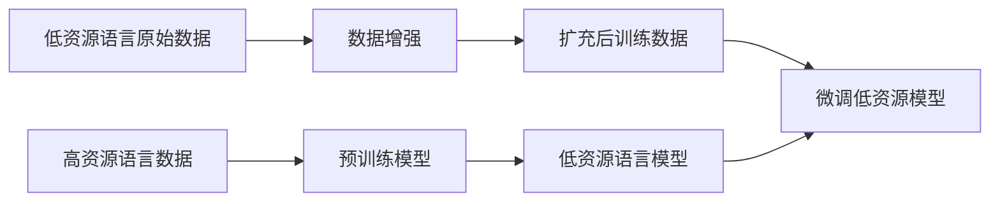

# 提高AI模型在低资源语言自然语言处理任务中的性能

> 关键词：低资源语言、自然语言处理、AI模型性能、迁移学习、数据增强

> 摘要：本文聚焦于提高AI模型在低资源语言自然语言处理任务中的性能这一核心问题。首先介绍了低资源语言在自然语言处理领域面临的挑战以及研究的目的和范围，明确预期读者和文档结构。接着阐述了与低资源语言自然语言处理相关的核心概念及其联系，通过文本示意图和Mermaid流程图进行直观展示。详细讲解了用于提升性能的核心算法原理，并用Python源代码进行说明。同时给出了相关的数学模型和公式，并举例说明。在项目实战部分，从开发环境搭建、源代码实现到代码解读与分析，全面展示了如何在实际中应用这些方法。还探讨了实际应用场景，推荐了学习资源、开发工具框架以及相关论文著作。最后总结了未来发展趋势与挑战，提供了常见问题解答和扩展阅读参考资料，旨在为研究者和开发者提供全面而深入的指导。

## 1. 背景介绍 
### 1.1 目的和范围
在自然语言处理（NLP）领域，大部分的研究和应用都集中在高资源语言，如英语、中文等。然而，世界上存在着数千种低资源语言，这些语言缺乏足够的标注数据、计算资源和研究投入。低资源语言的自然语言处理面临着巨大的挑战，例如在机器翻译、文本分类、命名实体识别等任务中，AI模型的性能往往不尽人意。本研究的目的就是探索有效的方法来提高AI模型在低资源语言自然语言处理任务中的性能，范围涵盖了多种低资源语言和常见的自然语言处理任务。

### 1.2 预期读者
本文的预期读者包括自然语言处理领域的研究者、AI开发者、对低资源语言研究感兴趣的学者以及相关专业的学生。这些读者希望了解如何在资源有限的情况下，提升AI模型在低资源语言处理任务中的表现。

### 1.3 文档结构概述
本文将按照以下结构进行阐述：首先介绍核心概念与联系，让读者对低资源语言自然语言处理有一个清晰的认识；接着详细讲解核心算法原理和具体操作步骤，并用Python代码进行说明；然后给出相关的数学模型和公式，并举例说明；在项目实战部分，展示如何搭建开发环境、实现源代码并进行代码解读；之后探讨实际应用场景；再推荐学习资源、开发工具框架和相关论文著作；最后总结未来发展趋势与挑战，提供常见问题解答和扩展阅读参考资料。

### 1.4 术语表
#### 1.4.1 核心术语定义
- **低资源语言**：指缺乏足够的标注数据、计算资源和研究投入的语言。这些语言在自然语言处理领域的研究和应用相对较少。
- **自然语言处理（NLP）**：是一门涉及计算机科学、人工智能和语言学的交叉学科，旨在让计算机理解、处理和生成人类语言。
- **AI模型**：是指基于人工智能技术构建的模型，用于解决各种自然语言处理任务，如神经网络模型、决策树模型等。
- **迁移学习**：是一种机器学习技术，通过将在一个任务或领域中学习到的知识迁移到另一个相关的任务或领域中，以提高模型在新任务上的性能。
- **数据增强**：是指通过对原始数据进行变换、扩充等操作，生成更多的训练数据，从而提高模型的泛化能力。

#### 1.4.2 相关概念解释
- **标注数据**：是指对文本数据进行人工标注，为每个文本样本赋予相应的标签，例如在文本分类任务中，为每个文本标注所属的类别。
- **计算资源**：包括计算机的硬件资源，如CPU、GPU、内存等，以及软件资源，如操作系统、编程语言等。
- **泛化能力**：是指模型在未见过的数据上的表现能力，即模型能够从训练数据中学习到通用的模式，并应用到新的数据上。

#### 1.4.3 缩略词列表
- **NLP**：Natural Language Processing（自然语言处理）
- **AI**：Artificial Intelligence（人工智能）
- **CNN**：Convolutional Neural Network（卷积神经网络）
- **RNN**：Recurrent Neural Network（循环神经网络）
- **LSTM**：Long Short-Term Memory（长短期记忆网络）
- **GRU**：Gated Recurrent Unit（门控循环单元）

## 2. 核心概念与联系 
### 核心概念原理
在低资源语言自然语言处理中，有几个核心概念起着关键作用。

#### 迁移学习
迁移学习的基本思想是利用在高资源语言或相关任务上学习到的知识，来帮助低资源语言的模型训练。例如，可以先在英语语料上预训练一个语言模型，然后将其参数迁移到低资源语言的任务中进行微调。这样可以减少对低资源语言标注数据的依赖，提高模型的性能。

#### 数据增强
数据增强通过对现有数据进行变换和扩充，生成更多的训练数据。对于低资源语言，可以采用回译、同义词替换、插入噪声等方法来增加数据量。例如，将低资源语言的文本翻译成高资源语言，再翻译回低资源语言，得到新的文本数据。

#### 多语言模型
多语言模型可以同时处理多种语言，通过共享参数和特征表示，提高低资源语言的处理能力。例如，mBERT（Multilingual Bidirectional Encoder Representations from Transformers）是一个预训练的多语言语言模型，它可以在多种语言上进行微调，用于各种自然语言处理任务。

### 架构的文本示意图
```plaintext
+-------------------+
| 高资源语言数据    |
+-------------------+
        |
        v
+-------------------+
| 预训练模型        |
+-------------------+
        |
        | 迁移学习
        v
+-------------------+
| 低资源语言模型    |
+-------------------+
        |
        | 数据增强
        v
+-------------------+
| 扩充后训练数据    |
+-------------------+
        |
        v
+-------------------+
| 微调低资源模型    |
+-------------------+
```

### Mermaid流程图


## 3. 核心算法原理 & 具体操作步骤 
### 迁移学习算法原理
迁移学习主要有两种方式：基于特征的迁移和基于模型参数的迁移。这里我们以基于模型参数的迁移为例进行说明。

假设我们有一个在高资源语言上预训练好的模型 $M_{high}$，其参数为 $\theta_{high}$。我们要将其迁移到低资源语言的任务中，构建一个新的模型 $M_{low}$。首先，我们将 $M_{high}$ 的部分或全部参数复制到 $M_{low}$ 中，得到初始参数 $\theta_{low}^0$。然后，使用低资源语言的标注数据 $D_{low}$ 对 $M_{low}$ 进行微调，通过最小化损失函数 $L(\theta_{low})$ 来更新参数：

```python
import torch
import torch.nn as nn
import torch.optim as optim

# 加载预训练模型
pretrained_model = torch.load('pretrained_model.pth')

# 定义低资源语言模型，继承自预训练模型的结构
class LowResourceModel(nn.Module):
    def __init__(self, pretrained_model):
        super(LowResourceModel, self).__init__()
        self.pretrained = pretrained_model
        # 可以根据需要添加或修改部分层
        self.fc = nn.Linear(pretrained_model.output_size, num_classes)

    def forward(self, x):
        x = self.pretrained(x)
        x = self.fc(x)
        return x

# 初始化低资源语言模型
low_resource_model = LowResourceModel(pretrained_model)

# 定义损失函数和优化器
criterion = nn.CrossEntropyLoss()
optimizer = optim.Adam(low_resource_model.parameters(), lr=0.001)

# 加载低资源语言数据
low_resource_data =...

# 微调低资源语言模型
for epoch in range(num_epochs):
    for inputs, labels in low_resource_data:
        optimizer.zero_grad()
        outputs = low_resource_model(inputs)
        loss = criterion(outputs, labels)
        loss.backward()
        optimizer.step()
```

### 数据增强算法原理
数据增强的一种常见方法是回译。以下是一个简单的回译示例，使用 `transformers` 库中的翻译模型：

```python
from transformers import AutoTokenizer, AutoModelForSeq2SeqLM

# 加载翻译模型和分词器
tokenizer = AutoTokenizer.from_pretrained("Helsinki-NLP/opus-mt-{low}-{high}")
model = AutoModelForSeq2SeqLM.from_pretrained("Helsinki-NLP/opus-mt-{low}-{high}")

def back_translate(text):
    # 翻译成高资源语言
    inputs = tokenizer(text, return_tensors="pt")
    outputs = model.generate(**inputs)
    translated_text = tokenizer.decode(outputs[0], skip_special_tokens=True)

    # 再翻译回低资源语言
    reverse_tokenizer = AutoTokenizer.from_pretrained("Helsinki-NLP/opus-mt-{high}-{low}")
    reverse_model = AutoModelForSeq2SeqLM.from_pretrained("Helsinki-NLP/opus-mt-{high}-{low}")
    reverse_inputs = reverse_tokenizer(translated_text, return_tensors="pt")
    reverse_outputs = reverse_model.generate(**reverse_inputs)
    back_translated_text = reverse_tokenizer.decode(reverse_outputs[0], skip_special_tokens=True)

    return back_translated_text

# 示例文本
text = "这是一个低资源语言的句子。"
back_translated = back_translate(text)
print(back_translated)
```

## 4. 数学模型和公式 & 详细讲解 & 举例说明 
### 迁移学习的数学模型
在迁移学习中，我们的目标是在低资源语言数据上微调模型，使得模型在低资源语言任务上的损失最小化。假设我们有低资源语言的标注数据 $D_{low} = \{(x_i, y_i)\}_{i=1}^N$，其中 $x_i$ 是输入文本，$y_i$ 是对应的标签。模型的预测输出为 $\hat{y}_i = f(x_i; \theta_{low})$，其中 $f$ 是模型的映射函数，$\theta_{low}$ 是低资源语言模型的参数。

我们使用交叉熵损失函数来衡量预测输出和真实标签之间的差异：

$$
L(\theta_{low}) = -\frac{1}{N} \sum_{i=1}^N \sum_{j=1}^C y_{ij} \log(\hat{y}_{ij})
$$

其中 $C$ 是类别数，$y_{ij}$ 是第 $i$ 个样本属于第 $j$ 类的真实概率（通常为 0 或 1），$\hat{y}_{ij}$ 是模型预测第 $i$ 个样本属于第 $j$ 类的概率。

在微调过程中，我们使用梯度下降法来更新参数：

$$
\theta_{low}^{t+1} = \theta_{low}^t - \alpha \frac{\partial L(\theta_{low}^t)}{\partial \theta_{low}^t}
$$

其中 $\alpha$ 是学习率，$t$ 是迭代次数。

### 举例说明
假设我们有一个二分类任务，低资源语言数据有 100 个样本。模型的预测输出 $\hat{y}$ 和真实标签 $y$ 如下：

| 样本编号 | $\hat{y}_1$ | $\hat{y}_2$ | $y_1$ | $y_2$ |
|----------|-------------|-------------|-------|-------|
| 1        | 0.8         | 0.2         | 1     | 0     |
| 2        | 0.3         | 0.7         | 0     | 1     |
|...      |...         |...         |...   |...   |
| 100      | 0.6         | 0.4         | 1     | 0     |

则交叉熵损失为：

$$
L(\theta_{low}) = -\frac{1}{100} \left( \sum_{i=1}^{100} \left( y_{i1} \log(\hat{y}_{i1}) + y_{i2} \log(\hat{y}_{i2}) \right) \right)
$$

### 数据增强的数学模型
在数据增强中，我们可以将数据增强看作是对原始数据分布的一种扰动。假设原始数据的分布为 $P(X)$，经过数据增强后的数据分布为 $P'(X)$。我们希望通过数据增强，使得模型能够学习到更鲁棒的特征，从而提高泛化能力。

例如，在回译中，我们可以将回译过程看作是一个随机变换 $T$，使得 $X' = T(X)$。则增强后的数据分布为：

$$
P'(X') = \int P(X) \delta(X' - T(X)) dX
$$

其中 $\delta$ 是狄拉克函数。

## 5. 项目实战：代码实际案例和详细解释说明 
### 5.1  开发环境搭建
#### 安装Python和相关库
首先，确保你已经安装了Python 3.6或更高版本。然后，使用以下命令安装必要的库：

```bash
pip install torch transformers numpy pandas scikit-learn
```

#### 下载预训练模型
可以从 Hugging Face 的模型库中下载预训练模型，例如 mBERT：

```python
from transformers import AutoTokenizer, AutoModel

tokenizer = AutoTokenizer.from_pretrained('bert-base-multilingual-cased')
model = AutoModel.from_pretrained('bert-base-multilingual-cased')
```

### 5.2  源代码详细实现和代码解读
以下是一个基于 mBERT 进行低资源语言文本分类的示例代码：

```python
import torch
import torch.nn as nn
import torch.optim as optim
from torch.utils.data import Dataset, DataLoader
from transformers import AutoTokenizer, AutoModel
import pandas as pd
from sklearn.model_selection import train_test_split

# 定义数据集类
class LowResourceDataset(Dataset):
    def __init__(self, texts, labels, tokenizer, max_length):
        self.texts = texts
        self.labels = labels
        self.tokenizer = tokenizer
        self.max_length = max_length

    def __len__(self):
        return len(self.texts)

    def __getitem__(self, idx):
        text = str(self.texts[idx])
        label = self.labels[idx]
        encoding = self.tokenizer.encode_plus(
            text,
            add_special_tokens=True,
            max_length=self.max_length,
            padding='max_length',
            truncation=True,
            return_tensors='pt'
        )
        return {
            'input_ids': encoding['input_ids'].flatten(),
            'attention_mask': encoding['attention_mask'].flatten(),
            'labels': torch.tensor(label, dtype=torch.long)
        }

# 定义模型类
class LowResourceClassifier(nn.Module):
    def __init__(self, pretrained_model_name, num_classes):
        super(LowResourceClassifier, self).__init__()
        self.bert = AutoModel.from_pretrained(pretrained_model_name)
        self.dropout = nn.Dropout(0.1)
        self.fc = nn.Linear(self.bert.config.hidden_size, num_classes)

    def forward(self, input_ids, attention_mask):
        outputs = self.bert(input_ids=input_ids, attention_mask=attention_mask)
        pooled_output = outputs.pooler_output
        pooled_output = self.dropout(pooled_output)
        logits = self.fc(pooled_output)
        return logits

# 加载数据
data = pd.read_csv('low_resource_data.csv')
texts = data['text'].tolist()
labels = data['label'].tolist()

# 划分训练集和测试集
train_texts, test_texts, train_labels, test_labels = train_test_split(texts, labels, test_size=0.2, random_state=42)

# 初始化分词器和数据集
tokenizer = AutoTokenizer.from_pretrained('bert-base-multilingual-cased')
train_dataset = LowResourceDataset(train_texts, train_labels, tokenizer, max_length=128)
test_dataset = LowResourceDataset(test_texts, test_labels, tokenizer, max_length=128)

# 初始化数据加载器
train_dataloader = DataLoader(train_dataset, batch_size=16, shuffle=True)
test_dataloader = DataLoader(test_dataset, batch_size=16, shuffle=False)

# 初始化模型、损失函数和优化器
model = LowResourceClassifier('bert-base-multilingual-cased', num_classes=2)
criterion = nn.CrossEntropyLoss()
optimizer = optim.Adam(model.parameters(), lr=2e-5)

# 训练模型
device = torch.device('cuda' if torch.cuda.is_available() else 'cpu')
model.to(device)

num_epochs = 5
for epoch in range(num_epochs):
    model.train()
    total_loss = 0
    for batch in train_dataloader:
        input_ids = batch['input_ids'].to(device)
        attention_mask = batch['attention_mask'].to(device)
        labels = batch['labels'].to(device)

        optimizer.zero_grad()
        outputs = model(input_ids, attention_mask)
        loss = criterion(outputs, labels)
        loss.backward()
        optimizer.step()

        total_loss += loss.item()

    print(f'Epoch {epoch+1}/{num_epochs}, Loss: {total_loss/len(train_dataloader)}')

# 评估模型
model.eval()
correct = 0
total = 0
with torch.no_grad():
    for batch in test_dataloader:
        input_ids = batch['input_ids'].to(device)
        attention_mask = batch['attention_mask'].to(device)
        labels = batch['labels'].to(device)

        outputs = model(input_ids, attention_mask)
        _, predicted = torch.max(outputs.data, 1)
        total += labels.size(0)
        correct += (predicted == labels).sum().item()

print(f'Accuracy: {correct/total}')
```

### 5.3  代码解读与分析
#### 数据集类 `LowResourceDataset`
这个类继承自 `torch.utils.data.Dataset`，用于封装低资源语言的文本数据和标签。在 `__getitem__` 方法中，使用 `tokenizer.encode_plus` 对文本进行分词和编码，将其转换为模型可以接受的输入格式。

#### 模型类 `LowResourceClassifier`
这个类继承自 `nn.Module`，基于 mBERT 构建了一个文本分类模型。在 `forward` 方法中，将输入的 `input_ids` 和 `attention_mask` 传入 mBERT 模型，得到 `pooler_output`，然后经过一个 dropout 层和一个全连接层，输出分类的 logits。

#### 训练和评估过程
在训练过程中，使用交叉熵损失函数和 Adam 优化器对模型进行训练。在评估过程中，计算模型在测试集上的准确率。

## 6. 实际应用场景 
### 机器翻译
在低资源语言的机器翻译中，由于缺乏足够的平行语料，传统的翻译模型性能往往较差。通过迁移学习和数据增强技术，可以利用高资源语言的翻译知识和生成更多的训练数据，提高低资源语言的机器翻译质量。

### 文本分类
在低资源语言的文本分类任务中，如新闻分类、情感分析等，标注数据的不足会导致模型的准确率较低。使用迁移学习和多语言模型，可以借助高资源语言的分类知识和特征表示，提升低资源语言文本分类的性能。

### 命名实体识别
低资源语言的命名实体识别面临着标注数据稀缺的问题。通过迁移学习和数据增强，可以利用高资源语言的命名实体识别模型和生成更多的训练数据，提高低资源语言命名实体识别的效果。

## 7. 工具和资源推荐
### 7.1 学习资源推荐
#### 7.1.1 书籍推荐
- 《自然语言处理入门》：介绍了自然语言处理的基本概念、算法和应用，适合初学者。
- 《深度学习》：全面介绍了深度学习的理论和方法，包括神经网络、卷积神经网络、循环神经网络等。
- 《Python自然语言处理实战》：通过实际案例介绍了如何使用Python进行自然语言处理，包括文本预处理、特征提取、模型训练等。

#### 7.1.2 在线课程
- Coursera上的“Natural Language Processing Specialization”：由斯坦福大学的教授授课，系统介绍了自然语言处理的各个方面。
- edX上的“Introduction to Artificial Intelligence”：涵盖了人工智能的基本概念和方法，包括自然语言处理。
- 网易云课堂上的“深度学习与自然语言处理”：结合实际案例介绍了深度学习在自然语言处理中的应用。

#### 7.1.3 技术博客和网站
- Hugging Face Blog：提供了关于自然语言处理模型和技术的最新进展和应用案例。
- Towards Data Science：有许多关于自然语言处理的技术文章和实践经验分享。
- ACL Anthology：收录了自然语言处理领域的学术论文和研究成果。

### 7.2 开发工具框架推荐
#### 7.2.1 IDE和编辑器
- PyCharm：功能强大的Python集成开发环境，提供了代码编辑、调试、版本控制等功能。
- Jupyter Notebook：交互式的编程环境，适合进行数据探索和模型实验。
- Visual Studio Code：轻量级的代码编辑器，支持多种编程语言和插件扩展。

#### 7.2.2 调试和性能分析工具
- PyTorch Profiler：用于分析PyTorch模型的性能瓶颈，如计算时间、内存使用等。
- TensorBoard：可视化工具，可用于监控模型的训练过程和性能指标。
- cProfile：Python内置的性能分析工具，可用于分析Python代码的运行时间和函数调用次数。

#### 7.2.3 相关框架和库
- PyTorch：深度学习框架，提供了丰富的神经网络层和优化算法，支持GPU加速。
- TensorFlow：另一个流行的深度学习框架，具有高度的灵活性和可扩展性。
- Transformers：Hugging Face开发的自然语言处理库，提供了大量的预训练模型和工具，方便进行模型的加载、微调等操作。

### 7.3 相关论文著作推荐
#### 7.3.1 经典论文
- “Attention Is All You Need”：提出了Transformer架构，为自然语言处理领域带来了革命性的变化。
- “BERT: Pre-training of Deep Bidirectional Transformers for Language Understanding”：介绍了BERT模型，开启了预训练语言模型的时代。
- “Universal Language Model Fine-tuning for Text Classification”：提出了基于迁移学习的文本分类方法，提高了模型在低资源语言任务上的性能。

#### 7.3.2 最新研究成果
- 关注ACL（Association for Computational Linguistics）、EMNLP（Conference on Empirical Methods in Natural Language Processing）等自然语言处理领域的顶级会议，获取最新的研究成果。
- 在arXiv上搜索关于低资源语言自然语言处理的最新论文，了解该领域的前沿动态。

#### 7.3.3 应用案例分析
- 查看各大科技公司的技术博客，如Google AI Blog、Microsoft Research Blog等，了解他们在低资源语言自然语言处理方面的应用案例和实践经验。

## 8. 总结：未来发展趋势与挑战
### 未来发展趋势
- **多模态融合**：将文本与图像、语音等多模态信息相结合，提高低资源语言自然语言处理的性能和应用范围。
- **元学习**：通过元学习技术，让模型能够快速适应新的低资源语言任务，减少对大量标注数据的依赖。
- **无监督和自监督学习**：进一步探索无监督和自监督学习方法，利用大规模的无标注数据学习语言的通用特征，提高低资源语言模型的性能。

### 挑战
- **数据质量和标注**：低资源语言的标注数据往往质量不高，且缺乏专业的标注人员。如何提高数据质量和标注效率是一个重要的挑战。
- **计算资源限制**：低资源语言的研究往往受到计算资源的限制，如何在有限的计算资源下训练高效的模型是一个亟待解决的问题。
- **语言多样性**：低资源语言具有丰富的语言多样性，不同语言的语法、词汇和语义差异较大。如何处理这种语言多样性，提高模型的泛化能力是一个挑战。

## 9. 附录：常见问题与解答
### 问题1：迁移学习是否适用于所有低资源语言任务？
迁移学习在大多数低资源语言任务中都能取得一定的效果，但并不是适用于所有任务。对于一些与高资源语言差异较大的任务，迁移学习的效果可能会受到限制。在实际应用中，需要根据具体任务和数据情况进行评估和调整。

### 问题2：数据增强会引入噪声吗？
数据增强方法，如回译、同义词替换等，可能会引入一定的噪声。但在大多数情况下，这些噪声可以被模型学习到的通用特征所容忍，并且通过增加数据量可以提高模型的泛化能力。在使用数据增强时，可以通过调整增强的强度和方法来平衡噪声和数据量的关系。

### 问题3：如何选择合适的预训练模型进行迁移学习？
选择合适的预训练模型需要考虑多个因素，如任务类型、低资源语言与预训练语言的相似度、模型的大小和计算资源等。一般来说，可以选择与任务相关的预训练模型，如用于文本分类的BERT模型，用于机器翻译的Transformer模型等。同时，也可以尝试不同的预训练模型，比较它们在低资源语言任务上的性能。

## 10. 扩展阅读 & 参考资料
### 扩展阅读
- 《神经机器翻译：基础与前沿》：深入介绍了神经机器翻译的原理和技术，包括注意力机制、Transformer架构等。
- 《自然语言处理中的深度学习》：详细介绍了深度学习在自然语言处理中的应用，如词嵌入、语言模型、文本生成等。

### 参考资料
- Hugging Face官方文档：https://huggingface.co/docs
- PyTorch官方文档：https://pytorch.org/docs/stable/index.html
- TensorFlow官方文档：https://www.tensorflow.org/api_docs

作者：AI天才研究院/AI Genius Institute & 禅与计算机程序设计艺术 /Zen And The Art of Computer Programming