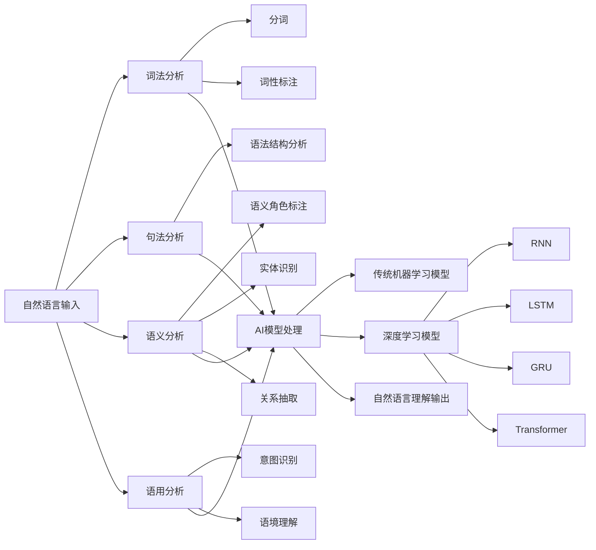

# 提高AI模型在复杂人机交互场景中的自然语言理解

> 关键词：AI模型、复杂人机交互场景、自然语言理解、语言模型、交互技术

> 摘要：本文聚焦于提高AI模型在复杂人机交互场景中的自然语言理解能力。随着人机交互的日益频繁和场景的复杂化，提升AI对自然语言的理解至关重要。文章将从背景介绍入手，阐述相关核心概念及联系，深入探讨核心算法原理和具体操作步骤，结合数学模型和公式进行详细讲解，并通过项目实战给出代码实际案例及解释。同时，分析实际应用场景，推荐相关工具和资源，最后总结未来发展趋势与挑战，解答常见问题并提供扩展阅读和参考资料。

## 1. 背景介绍 
### 1.1 目的和范围
在当今数字化时代，人机交互无处不在，从智能客服到智能家居，从自动驾驶到虚拟助手等。复杂人机交互场景包含了各种不同的语境、语义和用户意图，而自然语言是人机交互的重要方式之一。提高AI模型在这些复杂场景中的自然语言理解能力，旨在让AI能够更准确、更高效地理解用户的自然语言表达，从而提供更优质、更智能的交互服务。本文的范围涵盖了相关技术的原理、算法、实践应用以及未来发展等方面。

### 1.2 预期读者
本文预期读者包括AI领域的研究人员、开发人员、技术爱好者，以及对人机交互技术感兴趣的企业决策者和产品经理等。对于初学者，可以帮助他们了解该领域的基础知识和核心概念；对于有一定经验的专业人士，能为他们提供深入的技术分析和实践案例参考。

### 1.3 文档结构概述
本文首先介绍背景知识，包括目的、预期读者和文档结构等。接着阐述核心概念及联系，通过文本示意图和Mermaid流程图进行清晰展示。然后详细讲解核心算法原理和具体操作步骤，结合Python源代码进行说明。之后给出数学模型和公式，并举例讲解。再通过项目实战，介绍开发环境搭建、源代码实现和代码解读。随后分析实际应用场景，推荐相关工具和资源。最后总结未来发展趋势与挑战，解答常见问题并提供扩展阅读和参考资料。

### 1.4 术语表
#### 1.4.1 核心术语定义
- **自然语言理解（Natural Language Understanding，NLU）**：是指让计算机能够理解人类自然语言的含义，包括语义分析、语法分析、语用分析等，从而实现对文本的准确理解和处理。
- **AI模型（Artificial Intelligence Model）**：是一种基于人工智能技术构建的数学模型，用于模拟人类的智能行为，如语言理解、图像识别、决策制定等。
- **复杂人机交互场景（Complex Human - Machine Interaction Scenarios）**：指的是在人机交互过程中，包含多种因素（如不同的语境、领域知识、用户意图的模糊性等），使得交互过程具有较高的复杂性和不确定性。
- **语言模型（Language Model）**：是一种对自然语言文本进行概率建模的模型，用于预测下一个词或句子的概率分布，从而实现对语言的生成和理解。

#### 1.4.2 相关概念解释
- **语境（Context）**：在自然语言理解中，语境是指文本所处的环境信息，包括上下文、场景信息、用户的历史交互记录等。语境对于准确理解自然语言的含义至关重要，因为同一个词或句子在不同的语境中可能有不同的含义。
- **语义（Semantics）**：语义是指自然语言中词语、句子所表达的意义。语义分析是自然语言理解的核心任务之一，旨在确定文本的语义内容，包括实体识别、关系抽取、事件提取等。
- **语用（Pragmatics）**：语用是指语言在实际使用中的意义和效果，关注的是说话者的意图、目的以及语言在特定语境中的使用方式。语用分析有助于理解用户的隐含意图和言外之意。

#### 1.4.3 缩略词列表
- **NLU**：Natural Language Understanding（自然语言理解）
- **AI**：Artificial Intelligence（人工智能）
- **RNN**：Recurrent Neural Network（循环神经网络）
- **LSTM**：Long Short - Term Memory（长短期记忆网络）
- **GRU**：Gated Recurrent Unit（门控循环单元）
- **Transformer**：一种基于注意力机制的深度学习模型架构

## 2. 核心概念与联系 
### 核心概念原理
自然语言理解的核心目标是让计算机能够理解人类自然语言的含义，这涉及到多个层面的处理。首先是词法分析，将文本分割成单词或词组，并进行词性标注等处理。例如，“我爱北京天安门”，通过词法分析可以将其分割为“我”“爱”“北京”“天安门”，并标注出“我”是代词，“爱”是动词等。

接着是句法分析，分析句子的语法结构，确定各个词语之间的关系。例如，上述句子的句法结构可以表示为主谓宾结构，“我”是主语，“爱”是谓语，“北京天安门”是宾语。

语义分析是自然语言理解的关键环节，它旨在确定文本的语义内容。可以通过语义角色标注，确定句子中各个成分的语义角色，如施事、受事等。同时，还可以进行实体识别，识别出文本中的实体，如人名、地名、组织机构名等。

语用分析则关注用户的意图和语言在实际语境中的使用。例如，当用户说“今天天气真好啊”，可能不仅仅是在陈述天气情况，还可能有想出去游玩等隐含意图。

AI模型在自然语言理解中起着核心作用。常见的AI模型包括基于传统机器学习的模型和深度学习模型。传统机器学习模型如支持向量机、决策树等，需要手动提取特征，在处理复杂的自然语言任务时效果有限。深度学习模型如循环神经网络（RNN）及其变体长短期记忆网络（LSTM）、门控循环单元（GRU），以及Transformer模型等，能够自动学习文本的特征表示，在自然语言理解任务中取得了很好的效果。

### 架构的文本示意图
```plaintext
自然语言输入
|
|-- 词法分析
|   |-- 分词
|   |-- 词性标注
|
|-- 句法分析
|   |-- 语法结构分析
|
|-- 语义分析
|   |-- 语义角色标注
|   |-- 实体识别
|   |-- 关系抽取
|
|-- 语用分析
|   |-- 意图识别
|   |-- 语境理解
|
|-- AI模型处理
|   |-- 传统机器学习模型
|   |-- 深度学习模型（RNN、LSTM、GRU、Transformer等）
|
|-- 自然语言理解输出
```

### Mermaid流程图


## 3. 核心算法原理 & 具体操作步骤 
### 核心算法原理
#### 循环神经网络（RNN）
RNN是一种能够处理序列数据的神经网络，它的核心思想是通过隐藏状态来保存序列中的历史信息。在自然语言处理中，输入的文本可以看作是一个词序列，RNN可以依次处理每个词，并更新隐藏状态。

RNN的计算公式如下：
$$h_t = \tanh(W_{hh}h_{t - 1}+W_{xh}x_t + b_h)$$
其中，$x_t$ 是第 $t$ 时刻的输入向量，$h_{t - 1}$ 是上一时刻的隐藏状态向量，$W_{hh}$ 和 $W_{xh}$ 是权重矩阵，$b_h$ 是偏置向量，$\tanh$ 是激活函数。

#### 长短期记忆网络（LSTM）
LSTM是RNN的一种变体，它解决了RNN在处理长序列时的梯度消失问题。LSTM通过引入门控机制，能够更好地控制信息的流动。

LSTM的核心门控包括输入门 $i_t$、遗忘门 $f_t$、输出门 $o_t$ 和细胞状态 $C_t$，其计算公式如下：
$$i_t=\sigma(W_{xi}x_t + W_{hi}h_{t - 1}+b_i)$$
$$f_t=\sigma(W_{xf}x_t + W_{hf}h_{t - 1}+b_f)$$
$$o_t=\sigma(W_{xo}x_t + W_{ho}h_{t - 1}+b_o)$$
$$\tilde{C}_t=\tanh(W_{xc}x_t + W_{hc}h_{t - 1}+b_c)$$
$$C_t = f_t\odot C_{t - 1}+i_t\odot\tilde{C}_t$$
$$h_t = o_t\odot\tanh(C_t)$$
其中，$\sigma$ 是 sigmoid 激活函数，$\odot$ 表示逐元素相乘。

#### Transformer模型
Transformer模型是一种基于注意力机制的深度学习模型，它摒弃了传统的循环结构，能够并行处理序列数据。Transformer主要由编码器和解码器组成，编码器用于对输入序列进行编码，解码器用于生成输出序列。

注意力机制的核心公式为：
$$Attention(Q, K, V)=\text{softmax}(\frac{QK^T}{\sqrt{d_k}})V$$
其中，$Q$ 是查询矩阵，$K$ 是键矩阵，$V$ 是值矩阵，$d_k$ 是键的维度。

### 具体操作步骤
#### 数据预处理
- **分词**：将输入的文本分割成单词或词组。在Python中，可以使用 `jieba` 库进行中文分词，示例代码如下：
```python
import jieba

text = "我爱北京天安门"
words = jieba.lcut(text)
print(words)
```
- **构建词典**：将分词后的单词映射为整数索引，方便输入到模型中。示例代码如下：
```python
word_list = ['我', '爱', '北京', '天安门']
word2idx = {word: idx for idx, word in enumerate(word_list)}
idx2word = {idx: word for idx, word in enumerate(word_list)}
print(word2idx)
print(idx2word)
```
- **填充和截断**：将输入序列的长度统一，过长的序列进行截断，过短的序列进行填充。示例代码如下：
```python
import numpy as np

sequences = [[1, 2, 3], [4, 5], [6, 7, 8, 9]]
max_length = 4
padded_sequences = []
for seq in sequences:
    if len(seq) < max_length:
        seq = seq + [0] * (max_length - len(seq))
    else:
        seq = seq[:max_length]
    padded_sequences.append(seq)
padded_sequences = np.array(padded_sequences)
print(padded_sequences)
```

#### 模型训练
以简单的RNN模型为例，使用 `PyTorch` 进行模型训练的示例代码如下：
```python
import torch
import torch.nn as nn
import torch.optim as optim

# 定义RNN模型
class SimpleRNN(nn.Module):
    def __init__(self, input_size, hidden_size, output_size):
        super(SimpleRNN, self).__init__()
        self.rnn = nn.RNN(input_size, hidden_size, batch_first=True)
        self.fc = nn.Linear(hidden_size, output_size)

    def forward(self, x):
        out, _ = self.rnn(x)
        out = self.fc(out[:, -1, :])
        return out

# 超参数设置
input_size = 10
hidden_size = 20
output_size = 2
batch_size = 32
num_epochs = 10

# 初始化模型、损失函数和优化器
model = SimpleRNN(input_size, hidden_size, output_size)
criterion = nn.CrossEntropyLoss()
optimizer = optim.Adam(model.parameters(), lr=0.001)

# 模拟训练数据
inputs = torch.randn(batch_size, 5, input_size)
labels = torch.randint(0, output_size, (batch_size,))

# 训练模型
for epoch in range(num_epochs):
    optimizer.zero_grad()
    outputs = model(inputs)
    loss = criterion(outputs, labels)
    loss.backward()
    optimizer.step()
    print(f'Epoch {epoch + 1}/{num_epochs}, Loss: {loss.item()}')
```

#### 模型评估
使用测试数据对训练好的模型进行评估，计算准确率等指标。示例代码如下：
```python
# 模拟测试数据
test_inputs = torch.randn(batch_size, 5, input_size)
test_labels = torch.randint(0, output_size, (batch_size,))

# 评估模型
with torch.no_grad():
    test_outputs = model(test_inputs)
    _, predicted = torch.max(test_outputs, 1)
    accuracy = (predicted == test_labels).sum().item() / batch_size
    print(f'Test Accuracy: {accuracy}')
```

## 4. 数学模型和公式 & 详细讲解 & 举例说明 
### 循环神经网络（RNN）
#### 数学模型和公式
RNN的核心公式为：
$$h_t = \tanh(W_{hh}h_{t - 1}+W_{xh}x_t + b_h)$$
其中，$x_t$ 是第 $t$ 时刻的输入向量，维度为 $d_x$；$h_{t - 1}$ 是上一时刻的隐藏状态向量，维度为 $d_h$；$W_{hh}$ 是隐藏状态到隐藏状态的权重矩阵，维度为 $d_h\times d_h$；$W_{xh}$ 是输入到隐藏状态的权重矩阵，维度为 $d_x\times d_h$；$b_h$ 是偏置向量，维度为 $d_h$；$\tanh$ 是激活函数，用于将输出限制在 $[-1, 1]$ 范围内。

#### 详细讲解
RNN通过不断更新隐藏状态来处理序列数据。在每个时间步 $t$，模型接收当前输入 $x_t$ 和上一时刻的隐藏状态 $h_{t - 1}$，通过线性变换和激活函数得到当前时刻的隐藏状态 $h_t$。隐藏状态 $h_t$ 包含了之前所有时间步的信息，因此可以用于预测下一时刻的输出。

#### 举例说明
假设输入向量 $x_t$ 的维度为 3，隐藏状态向量 $h_{t - 1}$ 的维度为 2，即 $d_x = 3$，$d_h = 2$。则 $W_{xh}$ 是一个 $3\times2$ 的矩阵，$W_{hh}$ 是一个 $2\times2$ 的矩阵，$b_h$ 是一个维度为 2 的向量。

设 $x_t = [0.1, 0.2, 0.3]^T$，$h_{t - 1} = [0.4, 0.5]^T$，$W_{xh}=\begin{bmatrix}0.1 & 0.2\\0.3 & 0.4\\0.5 & 0.6\end{bmatrix}$，$W_{hh}=\begin{bmatrix}0.7 & 0.8\\0.9 & 1.0\end{bmatrix}$，$b_h = [0.1, 0.2]^T$。

首先计算 $W_{xh}x_t$ 和 $W_{hh}h_{t - 1}$：
$$W_{xh}x_t=\begin{bmatrix}0.1 & 0.2\\0.3 & 0.4\\0.5 & 0.6\end{bmatrix}\begin{bmatrix}0.1\\0.2\\0.3\end{bmatrix}=\begin{bmatrix}0.1\times0.1 + 0.2\times0.2+0.3\times0.5\\0.3\times0.1 + 0.4\times0.2+0.6\times0.3\end{bmatrix}=\begin{bmatrix}0.2\\0.31\end{bmatrix}$$
$$W_{hh}h_{t - 1}=\begin{bmatrix}0.7 & 0.8\\0.9 & 1.0\end{bmatrix}\begin{bmatrix}0.4\\0.5\end{bmatrix}=\begin{bmatrix}0.7\times0.4 + 0.8\times0.5\\0.9\times0.4 + 1.0\times0.5\end{bmatrix}=\begin{bmatrix}0.68\\0.86\end{bmatrix}$$

然后计算 $W_{hh}h_{t - 1}+W_{xh}x_t + b_h$：
$$W_{hh}h_{t - 1}+W_{xh}x_t + b_h=\begin{bmatrix}0.68\\0.86\end{bmatrix}+\begin{bmatrix}0.2\\0.31\end{bmatrix}+\begin{bmatrix}0.1\\0.2\end{bmatrix}=\begin{bmatrix}0.98\\1.37\end{bmatrix}$$

最后计算 $h_t$：
$$h_t=\tanh\begin{bmatrix}0.98\\1.37\end{bmatrix}=\begin{bmatrix}\tanh(0.98)\\\tanh(1.37)\end{bmatrix}\approx\begin{bmatrix}0.75\\0.88\end{bmatrix}$$

### 长短期记忆网络（LSTM）
#### 数学模型和公式
LSTM的核心公式如下：
$$i_t=\sigma(W_{xi}x_t + W_{hi}h_{t - 1}+b_i)$$
$$f_t=\sigma(W_{xf}x_t + W_{hf}h_{t - 1}+b_f)$$
$$o_t=\sigma(W_{xo}x_t + W_{ho}h_{t - 1}+b_o)$$
$$\tilde{C}_t=\tanh(W_{xc}x_t + W_{hc}h_{t - 1}+b_c)$$
$$C_t = f_t\odot C_{t - 1}+i_t\odot\tilde{C}_t$$
$$h_t = o_t\odot\tanh(C_t)$$
其中，$i_t$ 是输入门，$f_t$ 是遗忘门，$o_t$ 是输出门，$\tilde{C}_t$ 是候选细胞状态，$C_t$ 是细胞状态，$h_t$ 是隐藏状态；$\sigma$ 是 sigmoid 激活函数，将输出限制在 $[0, 1]$ 范围内；$\odot$ 表示逐元素相乘。

#### 详细讲解
- **遗忘门**：决定上一时刻的细胞状态 $C_{t - 1}$ 中有多少信息需要被遗忘。$f_t$ 的值越接近 0，表示遗忘的信息越多；越接近 1，表示保留的信息越多。
- **输入门**：决定当前输入 $x_t$ 中有多少信息需要被添加到细胞状态中。$i_t$ 控制了 $\tilde{C}_t$ 中哪些信息可以进入细胞状态。
- **细胞状态更新**：通过遗忘门和输入门的控制，更新细胞状态 $C_t$。
- **输出门**：决定当前细胞状态 $C_t$ 中有多少信息需要输出到隐藏状态 $h_t$。

#### 举例说明
假设输入向量 $x_t$ 的维度为 3，隐藏状态向量 $h_{t - 1}$ 的维度为 2，细胞状态向量 $C_{t - 1}$ 的维度为 2。设 $W_{xi}$、$W_{hi}$ 等权重矩阵和偏置向量的值如下：
$W_{xi}=\begin{bmatrix}0.1 & 0.2\\0.3 & 0.4\\0.5 & 0.6\end{bmatrix}$，$W_{hi}=\begin{bmatrix}0.7 & 0.8\\0.9 & 1.0\end{bmatrix}$，$b_i = [0.1, 0.2]^T$
$W_{xf}=\begin{bmatrix}0.2 & 0.3\\0.4 & 0.5\\0.6 & 0.7\end{bmatrix}$，$W_{hf}=\begin{bmatrix}0.8 & 0.9\\1.0 & 1.1\end{bmatrix}$，$b_f = [0.2, 0.3]^T$
$W_{xo}=\begin{bmatrix}0.3 & 0.4\\0.5 & 0.6\\0.7 & 0.8\end{bmatrix}$，$W_{ho}=\begin{bmatrix}0.9 & 1.0\\1.1 & 1.2\end{bmatrix}$，$b_o = [0.3, 0.4]^T$
$W_{xc}=\begin{bmatrix}0.4 & 0.5\\0.6 & 0.7\\0.8 & 0.9\end{bmatrix}$，$W_{hc}=\begin{bmatrix}1.0 & 1.1\\1.2 & 1.3\end{bmatrix}$，$b_c = [0.4, 0.5]^T$
$x_t = [0.1, 0.2, 0.3]^T$，$h_{t - 1} = [0.4, 0.5]^T$，$C_{t - 1} = [0.6, 0.7]^T$

首先计算输入门 $i_t$：
$$W_{xi}x_t=\begin{bmatrix}0.1 & 0.2\\0.3 & 0.4\\0.5 & 0.6\end{bmatrix}\begin{bmatrix}0.1\\0.2\\0.3\end{bmatrix}=\begin{bmatrix}0.2\\0.31\end{bmatrix}$$
$$W_{hi}h_{t - 1}=\begin{bmatrix}0.7 & 0.8\\0.9 & 1.0\end{bmatrix}\begin{bmatrix}0.4\\0.5\end{bmatrix}=\begin{bmatrix}0.68\\0.86\end{bmatrix}$$
$$W_{xi}x_t + W_{hi}h_{t - 1}+b_i=\begin{bmatrix}0.2\\0.31\end{bmatrix}+\begin{bmatrix}0.68\\0.86\end{bmatrix}+\begin{bmatrix}0.1\\0.2\end{bmatrix}=\begin{bmatrix}0.98\\1.37\end{bmatrix}$$
$$i_t=\sigma\begin{bmatrix}0.98\\1.37\end{bmatrix}=\begin{bmatrix}\frac{1}{1 + e^{-0.98}}\\\frac{1}{1 + e^{-1.37}}\end{bmatrix}\approx\begin{bmatrix}0.73\\0.81\end{bmatrix}$$

同理计算遗忘门 $f_t$、输出门 $o_t$ 和候选细胞状态 $\tilde{C}_t$，然后更新细胞状态 $C_t$ 和隐藏状态 $h_t$。

### Transformer模型
#### 数学模型和公式
注意力机制的核心公式为：
$$Attention(Q, K, V)=\text{softmax}(\frac{QK^T}{\sqrt{d_k}})V$$
其中，$Q$ 是查询矩阵，维度为 $n\times d_k$；$K$ 是键矩阵，维度为 $m\times d_k$；$V$ 是值矩阵，维度为 $m\times d_v$；$d_k$ 是键的维度；$\text{softmax}$ 函数用于将输入转换为概率分布。

#### 详细讲解
注意力机制通过计算查询 $Q$ 与键 $K$ 之间的相似度，来确定每个值 $V$ 的权重。具体来说，首先计算 $QK^T$，得到一个 $n\times m$ 的相似度矩阵，然后除以 $\sqrt{d_k}$ 进行缩放，以避免点积过大。接着使用 $\text{softmax}$ 函数将相似度矩阵转换为权重矩阵，最后将权重矩阵与值矩阵 $V$ 相乘，得到注意力输出。

#### 举例说明
假设 $Q=\begin{bmatrix}0.1 & 0.2\\0.3 & 0.4\end{bmatrix}$，$K=\begin{bmatrix}0.5 & 0.6\\0.7 & 0.8\end{bmatrix}$，$V=\begin{bmatrix}0.9 & 1.0\\1.1 & 1.2\end{bmatrix}$，$d_k = 2$。

首先计算 $QK^T$：
$$QK^T=\begin{bmatrix}0.1 & 0.2\\0.3 & 0.4\end{bmatrix}\begin{bmatrix}0.5 & 0.7\\0.6 & 0.8\end{bmatrix}=\begin{bmatrix}0.1\times0.5 + 0.2\times0.6 & 0.1\times0.7 + 0.2\times0.8\\0.3\times0.5 + 0.4\times0.6 & 0.3\times0.7 + 0.4\times0.8\end{bmatrix}=\begin{bmatrix}0.17 & 0.23\\0.39 & 0.53\end{bmatrix}$$

然后除以 $\sqrt{d_k}$：
$$\frac{QK^T}{\sqrt{d_k}}=\frac{1}{\sqrt{2}}\begin{bmatrix}0.17 & 0.23\\0.39 & 0.53\end{bmatrix}\approx\begin{bmatrix}0.12 & 0.16\\0.28 & 0.37\end{bmatrix}$$

接着计算 $\text{softmax}$：
$$\text{softmax}(\frac{QK^T}{\sqrt{d_k}})=\begin{bmatrix}\frac{e^{0.12}}{e^{0.12}+e^{0.16}} & \frac{e^{0.16}}{e^{0.12}+e^{0.16}}\\\frac{e^{0.28}}{e^{0.28}+e^{0.37}} & \frac{e^{0.37}}{e^{0.28}+e^{0.37}}\end{bmatrix}\approx\begin{bmatrix}0.48 & 0.52\\0.46 & 0.54\end{bmatrix}$$

最后计算注意力输出：
$$Attention(Q, K, V)=\text{softmax}(\frac{QK^T}{\sqrt{d_k}})V=\begin{bmatrix}0.48 & 0.52\\0.46 & 0.54\end{bmatrix}\begin{bmatrix}0.9 & 1.0\\1.1 & 1.2\end{bmatrix}\approx\begin{bmatrix}1.01 & 1.1\\1.05 & 1.15\end{bmatrix}$$

## 5. 项目实战：代码实际案例和详细解释说明 
### 5.1  开发环境搭建
#### 操作系统
建议使用 Linux 或 macOS 系统，因为它们对深度学习开发的支持较好。Windows 系统也可以使用，但可能会遇到一些兼容性问题。

#### Python环境
安装 Python 3.7 及以上版本。可以使用 Anaconda 来管理 Python 环境，以下是安装步骤：
1. 从 Anaconda 官方网站（https://www.anaconda.com/products/individual）下载适合自己操作系统的 Anaconda 安装包。
2. 运行安装包，按照提示进行安装。
3. 安装完成后，打开终端或命令提示符，创建一个新的 Python 环境：
```bash
conda create -n nlu_env python=3.8
conda activate nlu_env
```

#### 深度学习框架
安装 PyTorch 深度学习框架，根据自己的 CUDA 版本选择合适的安装命令。如果没有 GPU，可以安装 CPU 版本：
```bash
pip install torch torchvision
```

#### 其他依赖库
安装其他必要的依赖库，如 `numpy`、`pandas`、`jieba` 等：
```bash
pip install numpy pandas jieba
```

### 5.2  源代码详细实现和代码解读
#### 数据加载和预处理
以下是一个简单的文本分类任务的数据加载和预处理代码示例：
```python
import torch
from torch.utils.data import Dataset, DataLoader
import jieba
import numpy as np

# 定义数据集类
class TextDataset(Dataset):
    def __init__(self, texts, labels, word2idx, max_length):
        self.texts = texts
        self.labels = labels
        self.word2idx = word2idx
        self.max_length = max_length

    def __len__(self):
        return len(self.texts)

    def __getitem__(self, idx):
        text = self.texts[idx]
        label = self.labels[idx]
        # 分词
        words = jieba.lcut(text)
        # 将单词转换为索引
        indices = [self.word2idx.get(word, 0) for word in words]
        # 填充和截断
        if len(indices) < self.max_length:
            indices = indices + [0] * (self.max_length - len(indices))
        else:
            indices = indices[:self.max_length]
        indices = torch.tensor(indices, dtype=torch.long)
        label = torch.tensor(label, dtype=torch.long)
        return indices, label

# 示例数据
texts = ["这是一个测试句子", "另一个测试句子"]
labels = [0, 1]

# 构建词典
word_list = []
for text in texts:
    words = jieba.lcut(text)
    word_list.extend(words)
word_list = list(set(word_list))
word2idx = {word: idx for idx, word in enumerate(word_list, start=1)}
word2idx['<PAD>'] = 0

# 创建数据集和数据加载器
max_length = 10
dataset = TextDataset(texts, labels, word2idx, max_length)
dataloader = DataLoader(dataset, batch_size=2, shuffle=True)

# 遍历数据加载器
for inputs, labels in dataloader:
    print("Inputs:", inputs)
    print("Labels:", labels)
```
代码解读：
- `TextDataset` 类继承自 `torch.utils.data.Dataset`，用于封装数据集。`__init__` 方法初始化数据集的文本、标签、词典和最大长度；`__len__` 方法返回数据集的长度；`__getitem__` 方法根据索引返回对应的输入和标签。
- 首先对文本进行分词，然后将单词转换为索引，再进行填充和截断操作，最后将输入和标签转换为 `torch.Tensor` 类型。
- 使用 `DataLoader` 类将数据集封装为可迭代的数据加载器，方便批量加载数据。

#### 模型定义
以下是一个简单的 LSTM 文本分类模型的定义代码：
```python
import torch.nn as nn

class LSTMClassifier(nn.Module):
    def __init__(self, vocab_size, embedding_dim, hidden_dim, output_dim):
        super(LSTMClassifier, self).__init__()
        self.embedding = nn.Embedding(vocab_size, embedding_dim)
        self.lstm = nn.LSTM(embedding_dim, hidden_dim, batch_first=True)
        self.fc = nn.Linear(hidden_dim, output_dim)

    def forward(self, x):
        embedded = self.embedding(x)
        out, _ = self.lstm(embedded)
        out = out[:, -1, :]
        out = self.fc(out)
        return out

# 模型参数设置
vocab_size = len(word2idx)
embedding_dim = 100
hidden_dim = 200
output_dim = 2

# 初始化模型
model = LSTMClassifier(vocab_size, embedding_dim, hidden_dim, output_dim)
print(model)
```
代码解读：
- `LSTMClassifier` 类继承自 `nn.Module`，用于定义 LSTM 文本分类模型。`__init__` 方法初始化模型的嵌入层、LSTM 层和全连接层；`forward` 方法定义了模型的前向传播过程。
- 嵌入层将输入的单词索引转换为词向量，LSTM 层对词向量序列进行处理，最后通过全连接层输出分类结果。

#### 模型训练
以下是模型训练的代码示例：
```python
import torch.optim as optim

# 超参数设置
num_epochs = 10
learning_rate = 0.001

# 定义损失函数和优化器
criterion = nn.CrossEntropyLoss()
optimizer = optim.Adam(model.parameters(), lr=learning_rate)

# 训练模型
for epoch in range(num_epochs):
    running_loss = 0.0
    for inputs, labels in dataloader:
        optimizer.zero_grad()
        outputs = model(inputs)
        loss = criterion(outputs, labels)
        loss.backward()
        optimizer.step()
        running_loss += loss.item()
    print(f'Epoch {epoch + 1}/{num_epochs}, Loss: {running_loss / len(dataloader)}')
```
代码解读：
- 定义了训练的轮数和学习率，使用交叉熵损失函数和 Adam 优化器。
- 在每个训练轮次中，遍历数据加载器，计算损失并进行反向传播和参数更新。

### 5.3  代码解读与分析
#### 数据预处理
数据预处理是自然语言处理任务中的重要步骤，它直接影响模型的性能。在上述代码中，我们对文本进行了分词、构建词典、将单词转换为索引以及填充和截断等操作。分词可以将文本分割成有意义的单词或词组，方便后续处理；构建词典将单词映射为整数索引，使得文本可以输入到模型中；填充和截断操作可以将输入序列的长度统一，便于批量处理。

#### 模型定义
LSTM 模型在处理序列数据方面具有很好的效果，它通过门控机制能够有效地捕捉序列中的长期依赖关系。在上述代码中，我们定义了一个简单的 LSTM 文本分类模型，包括嵌入层、LSTM 层和全连接层。嵌入层将单词索引转换为词向量，LSTM 层对词向量序列进行处理，全连接层将 LSTM 层的输出映射到分类结果。

#### 模型训练
模型训练过程中，我们使用交叉熵损失函数来衡量模型的预测结果与真实标签之间的差异，使用 Adam 优化器来更新模型的参数。在每个训练轮次中，我们遍历数据加载器，计算损失并进行反向传播和参数更新。通过多次迭代训练，模型的性能会逐渐提高。

## 6. 实际应用场景 
### 智能客服
在智能客服场景中，用户会以自然语言的方式提出各种问题和需求，如咨询产品信息、投诉问题等。AI模型需要准确理解用户的意图，然后提供相应的解决方案。例如，用户说“我想了解一下你们这款手机的电池续航能力”，AI模型需要识别出用户的意图是询问手机电池续航信息，并从知识库中查找相关内容进行回复。

### 智能家居控制
在智能家居系统中，用户可以通过语音指令来控制各种智能设备，如打开灯光、调节温度等。AI模型需要理解用户的语音指令，将其转换为相应的控制信号发送给智能设备。例如，用户说“把客厅的灯打开”，AI模型需要识别出用户的意图是打开客厅的灯光，并向智能灯光设备发送打开指令。

### 自动驾驶
在自动驾驶场景中，车辆需要与乘客进行交互，理解乘客的语音指令。例如，乘客说“导航到最近的加油站”，AI模型需要识别出用户的意图是进行导航到最近的加油站，并调用地图导航系统进行路线规划。

### 虚拟助手
虚拟助手如 Siri、小爱同学等，能够与用户进行自然语言交互，回答用户的问题、提供信息和执行任务。例如，用户问“今天天气怎么样”，AI模型需要理解用户的问题，调用天气查询接口获取天气信息并回复用户。

## 7. 工具和资源推荐
### 7.1 学习资源推荐
#### 7.1.1 书籍推荐
- 《深度学习》（Deep Learning）：由 Ian Goodfellow、Yoshua Bengio 和 Aaron Courville 所著，是深度学习领域的经典教材，涵盖了深度学习的基本概念、算法和应用。
- 《自然语言处理入门》：何晗著，适合初学者，详细介绍了自然语言处理的基础知识和常用技术。
- 《动手学深度学习》（Dive into Deep Learning）：由 Aston Zhang 等所著，提供了丰富的代码示例和实践项目，帮助读者快速上手深度学习。

#### 7.1.2 在线课程
- Coursera 上的“深度学习专项课程”（Deep Learning Specialization）：由 Andrew Ng 教授授课，包括神经网络和深度学习、改善深层神经网络、结构化机器学习项目等多个课程，系统地介绍了深度学习的知识。
- 网易云课堂上的“自然语言处理实战”课程：结合实际项目，讲解自然语言处理的核心技术和应用。

#### 7.1.3 技术博客和网站
- Medium：有很多 AI 和自然语言处理领域的优秀博客文章，涵盖了最新的研究成果和技术应用。
- arXiv：是一个预印本服务器，提供了大量的学术论文，包括自然语言处理领域的最新研究。
- 机器之心：专注于人工智能领域的资讯和技术解读，提供了很多有价值的文章和案例分析。

### 7.2 开发工具框架推荐
#### 7.2.1 IDE和编辑器
- PyCharm：是一款专业的 Python 集成开发环境，提供了丰富的代码编辑、调试和项目管理功能。
- Jupyter Notebook：是一个交互式的开发环境，适合进行数据分析和模型实验，方便代码的编写、运行和展示。

#### 7.2.2 调试和性能分析工具
- TensorBoard：是 TensorFlow 提供的可视化工具，可以用于监控模型的训练过程、可视化模型结构和分析性能指标。
- PyTorch Profiler：是 PyTorch 提供的性能分析工具，可以帮助开发者找出代码中的性能瓶颈。

#### 7.2.3 相关框架和库
- PyTorch：是一个开源的深度学习框架，具有动态图特性，方便模型的开发和调试。
- TensorFlow：是另一个广泛使用的深度学习框架，提供了丰富的工具和资源，支持分布式训练。
- Transformers：是 Hugging Face 开发的一个自然语言处理库，提供了多种预训练模型，如 BERT、GPT 等，方便快速开发自然语言处理应用。

### 7.3 相关论文著作推荐
#### 7.3.1 经典论文
- “Attention Is All You Need”：提出了 Transformer 模型，是自然语言处理领域的重要突破。
- “Long Short-Term Memory”：介绍了 LSTM 模型，解决了 RNN 在处理长序列时的梯度消失问题。
- “BERT: Pre-training of Deep Bidirectional Transformers for Language Understanding”：提出了 BERT 模型，在多个自然语言处理任务上取得了优异的成绩。

#### 7.3.2 最新研究成果
可以关注每年的自然语言处理顶级会议，如 ACL（Association for Computational Linguistics）、EMNLP（Conference on Empirical Methods in Natural Language Processing）等，这些会议上会发表很多最新的研究成果。

#### 7.3.3 应用案例分析
可以参考一些企业的技术博客和开源项目，了解自然语言处理技术在实际应用中的案例和经验。例如，谷歌、微软、百度等公司的技术博客会分享他们在自然语言处理领域的应用实践。

## 8. 总结：未来发展趋势与挑战
### 未来发展趋势
#### 多模态融合
未来的AI模型将不仅仅局限于处理自然语言，还会融合图像、音频等多种模态的信息。例如，在智能客服场景中，用户可能会同时发送文字描述和图片来表达问题，AI模型需要综合处理这些信息，提供更准确的解决方案。

#### 个性化交互
随着用户数据的积累和分析技术的发展，AI模型将能够实现个性化的人机交互。根据用户的历史交互记录、偏好和行为模式，为用户提供更加个性化的服务和建议。

#### 常识推理
提高AI模型的常识推理能力是未来的一个重要发展方向。常识推理可以帮助AI模型更好地理解自然语言的含义和语境，处理复杂的语义和语用问题。例如，当用户说“我要去银行取点钱”，AI模型需要知道银行是可以取钱的地方，并且在合适的时间和地点提供相关的信息。

#### 低资源语言处理
目前的自然语言处理技术主要集中在英语等少数高资源语言上，未来将更加关注低资源语言的处理。通过迁移学习、少样本学习等技术，提高AI模型在低资源语言上的自然语言理解能力。

### 挑战
#### 数据质量和标注
高质量的数据是训练AI模型的基础，但自然语言数据往往存在噪声、歧义等问题。同时，数据标注的成本较高，且标注的准确性也会影响模型的性能。因此，如何获取高质量的数据并进行有效的标注是一个挑战。

#### 计算资源和效率
深度学习模型通常需要大量的计算资源进行训练和推理，尤其是在处理大规模数据和复杂模型时。如何提高模型的训练和推理效率，降低计算成本，是一个亟待解决的问题。

#### 语义和语用理解
虽然目前的AI模型在自然语言理解方面取得了很大的进展，但在语义和语用理解方面仍然存在不足。例如，理解隐喻、幽默、讽刺等复杂的语言表达，以及处理上下文依赖和隐含意图等问题，仍然是一个挑战。

#### 伦理和安全问题
随着AI技术的广泛应用，伦理和安全问题也日益凸显。例如，AI模型可能会生成虚假信息、进行偏见性的决策等。如何确保AI模型的安全性和可靠性，避免其对社会造成负面影响，是一个重要的挑战。

## 9. 附录：常见问题与解答
### 问题1：如何选择合适的AI模型来提高自然语言理解能力？
解答：选择合适的AI模型需要考虑多个因素，如任务类型、数据规模、计算资源等。如果是处理简单的文本分类任务，传统的机器学习模型如逻辑回归、支持向量机等可能就足够了。如果是处理复杂的序列数据，如文本生成、机器翻译等，深度学习模型如 LSTM、Transformer 等会更合适。同时，还可以根据数据规模选择是否使用预训练模型，如果数据规模较小，可以使用预训练模型进行微调；如果数据规模较大，可以从头开始训练模型。

### 问题2：如何处理自然语言中的歧义问题？
解答：处理自然语言中的歧义问题可以从多个方面入手。首先，可以利用语境信息来消除歧义，通过分析上下文、用户的历史交互记录等，确定词语或句子的具体含义。其次，可以使用语义知识库，如 WordNet 等，来获取词语的语义信息，帮助理解歧义表达。此外，还可以使用机器学习和深度学习模型，通过大量的数据训练来学习歧义表达的不同含义和使用场景。

### 问题3：如何评估AI模型在自然语言理解任务中的性能？
解答：评估AI模型在自然语言理解任务中的性能可以使用多种指标，具体取决于任务类型。例如，在文本分类任务中，可以使用准确率、精确率、召回率、F1 值等指标；在机器翻译任务中，可以使用 BLEU 分数、ROUGE 分数等指标；在语义相似度任务中，可以使用余弦相似度、欧氏距离等指标。此外，还可以进行人工评估，通过人工判断模型的输出是否符合预期来评估模型的性能。

### 问题4：如何提高AI模型在低资源语言上的自然语言理解能力？
解答：提高AI模型在低资源语言上的自然语言理解能力可以采用以下方法。首先，可以使用迁移学习，将在高资源语言上训练好的模型迁移到低资源语言上进行微调。其次，可以使用少样本学习技术，通过少量的标注数据来训练模型。此外，还可以利用无监督学习方法，从大量的无标注数据中学习语言的特征和模式。

## 10. 扩展阅读 & 参考资料
### 扩展阅读
- 《自然