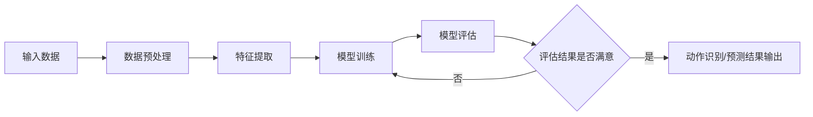

# 提高AI模型在复杂动作识别与预测中的准确性

> 关键词：AI模型、复杂动作识别、复杂动作预测、准确性提升、深度学习

> 摘要：本文围绕提高AI模型在复杂动作识别与预测中的准确性展开。首先介绍了相关背景知识，包括目的范围、预期读者等。接着阐述了核心概念与联系，详细讲解了核心算法原理及具体操作步骤，结合Python代码进行说明。同时给出了数学模型和公式，并举例解释。通过项目实战，展示了代码实际案例及详细解读。探讨了实际应用场景，推荐了学习资源、开发工具框架和相关论文著作。最后总结了未来发展趋势与挑战，提供了常见问题解答和扩展阅读参考资料，旨在为相关领域研究者和开发者提供全面且深入的技术指导。

## 1. 背景介绍 
### 1.1 目的和范围
在当今科技飞速发展的时代，AI技术在众多领域都得到了广泛应用，其中复杂动作识别与预测是一个极具挑战性和应用前景的方向。提高AI模型在复杂动作识别与预测中的准确性具有重要的现实意义。其目的在于能够更精准地理解和分析人类或物体的复杂动作，为诸如智能安防、体育训练、医疗康复等领域提供更可靠的技术支持。本文章的范围涵盖了从基础概念到实际应用的多个方面，包括核心算法原理、数学模型、项目实战以及相关工具资源等，旨在为读者提供一个全面且深入的技术指导。

### 1.2 预期读者
本文预期读者主要包括AI领域的研究者、开发者，尤其是专注于计算机视觉、深度学习方向的专业人士。同时，对于体育科学、医学康复等领域中希望运用AI技术进行动作分析的科研人员和从业者也具有一定的参考价值。此外，对AI技术有浓厚兴趣，想要深入了解复杂动作识别与预测相关知识的爱好者也能从本文中获取有益的信息。

### 1.3 文档结构概述
本文将按照以下结构进行阐述：首先介绍核心概念与联系，让读者对复杂动作识别与预测有一个基本的认识；接着详细讲解核心算法原理和具体操作步骤，并结合Python代码进行说明；随后给出数学模型和公式，并举例进行详细解释；通过项目实战展示代码实际案例及详细解读；探讨实际应用场景，分析该技术在不同领域的应用价值；推荐学习资源、开发工具框架和相关论文著作，为读者提供进一步学习和研究的方向；最后总结未来发展趋势与挑战，解答常见问题，并提供扩展阅读参考资料。

### 1.4 术语表
#### 1.4.1 核心术语定义
- **复杂动作识别**：指AI模型对具有较高难度、包含多个连续或同时发生的动作元素的动作进行准确分类和判断的过程。例如，在体育比赛中识别运动员的复杂战术动作，或者在安防监控中识别嫌疑人的异常行为动作。
- **复杂动作预测**：基于历史动作数据和当前动作状态，AI模型对未来一段时间内动作的发展和变化进行预估和判断的能力。比如，在自动驾驶中预测行人或其他车辆的未来动作轨迹。
- **准确性**：在复杂动作识别与预测任务中，准确性是指模型正确识别或预测动作的比例。它是衡量模型性能的重要指标之一。

#### 1.4.2 相关概念解释
- **深度学习**：是一种基于人工神经网络的机器学习方法，通过构建多层神经网络来自动学习数据中的复杂特征和模式。在复杂动作识别与预测中，深度学习模型能够处理高维度、复杂的动作数据，具有较强的特征提取和表达能力。
- **特征提取**：从原始动作数据中提取出能够代表动作本质特征的过程。例如，在视频动作识别中，可以提取人体关节点的位置、速度等特征，用于后续的模型训练和分析。
- **模型评估**：使用特定的评估指标和方法对训练好的AI模型进行性能评估的过程。常见的评估指标包括准确率、召回率、F1值等，用于衡量模型在复杂动作识别与预测任务中的表现。

#### 1.4.3 缩略词列表
- **CNN**：Convolutional Neural Network，卷积神经网络，是一种常用于图像和视频处理的深度学习模型，能够自动提取数据中的空间特征。
- **RNN**：Recurrent Neural Network，循环神经网络，适用于处理序列数据，在动作预测等任务中能够捕捉数据的时间依赖关系。
- **LSTM**：Long Short-Term Memory，长短期记忆网络，是一种特殊的RNN，能够有效解决传统RNN在处理长序列数据时的梯度消失问题，更适合处理复杂的动作序列。

## 2. 核心概念与联系 
### 核心概念原理
复杂动作识别与预测主要涉及到计算机视觉、机器学习和深度学习等多个领域的知识。其基本原理是通过对输入的动作数据进行特征提取和分析，利用训练好的模型对动作进行分类或预测。

在复杂动作识别中，首先需要对原始数据（如视频、传感器数据等）进行预处理，包括数据清洗、归一化等操作。然后，使用特征提取方法从预处理后的数据中提取出能够代表动作特征的信息，如人体姿态、运动轨迹等。最后，将提取的特征输入到分类模型中，模型根据特征进行分类判断，输出动作的类别标签。

在复杂动作预测中，除了特征提取外，还需要考虑动作的时间序列信息。通常使用循环神经网络等模型来捕捉动作的时间依赖关系，根据历史动作数据预测未来动作的发展趋势。

### 架构的文本示意图
```plaintext
输入数据（视频、传感器数据等）
|
|-- 数据预处理（清洗、归一化等）
|
|-- 特征提取（人体姿态、运动轨迹等）
|
|-- 模型训练（分类模型、预测模型）
|
|-- 模型评估（准确率、召回率等）
|
|-- 动作识别/预测结果输出
```

### Mermaid流程图


## 3. 核心算法原理 & 具体操作步骤 
### 核心算法原理
在复杂动作识别与预测中，常用的算法包括卷积神经网络（CNN）、循环神经网络（RNN）及其变体长短期记忆网络（LSTM）等。

#### 卷积神经网络（CNN）
CNN是一种专门用于处理具有网格结构数据（如图像、视频）的深度学习模型。其核心思想是通过卷积层自动提取数据中的局部特征，池化层对特征进行降维和抽象，全连接层将提取的特征映射到输出类别。

以下是一个简单的CNN模型的Python代码示例：
```python
import torch
import torch.nn as nn

class SimpleCNN(nn.Module):
    def __init__(self):
        super(SimpleCNN, self).__init__()
        self.conv1 = nn.Conv2d(3, 16, kernel_size=3, padding=1)
        self.relu1 = nn.ReLU()
        self.pool1 = nn.MaxPool2d(2)
        self.conv2 = nn.Conv2d(16, 32, kernel_size=3, padding=1)
        self.relu2 = nn.ReLU()
        self.pool2 = nn.MaxPool2d(2)
        self.fc1 = nn.Linear(32 * 8 * 8, 128)
        self.relu3 = nn.ReLU()
        self.fc2 = nn.Linear(128, 10)

    def forward(self, x):
        x = self.pool1(self.relu1(self.conv1(x)))
        x = self.pool2(self.relu2(self.conv2(x)))
        x = x.view(-1, 32 * 8 * 8)
        x = self.relu3(self.fc1(x))
        x = self.fc2(x)
        return x

# 初始化模型
model = SimpleCNN()
print(model)
```
在上述代码中，定义了一个简单的CNN模型，包含两个卷积层、两个池化层和两个全连接层。通过`forward`方法定义了模型的前向传播过程。

#### 循环神经网络（RNN）
RNN是一种用于处理序列数据的神经网络，其特点是具有循环结构，能够利用历史信息来处理当前输入。然而，传统RNN在处理长序列数据时容易出现梯度消失或梯度爆炸问题。

以下是一个简单的RNN模型的Python代码示例：
```python
import torch
import torch.nn as nn

class SimpleRNN(nn.Module):
    def __init__(self, input_size, hidden_size, output_size):
        super(SimpleRNN, self).__init__()
        self.rnn = nn.RNN(input_size, hidden_size, batch_first=True)
        self.fc = nn.Linear(hidden_size, output_size)

    def forward(self, x):
        out, _ = self.rnn(x)
        out = self.fc(out[:, -1, :])
        return out

# 初始化模型
input_size = 10
hidden_size = 20
output_size = 5
model = SimpleRNN(input_size, hidden_size, output_size)
print(model)
```
在上述代码中，定义了一个简单的RNN模型，包含一个RNN层和一个全连接层。通过`forward`方法定义了模型的前向传播过程。

#### 长短期记忆网络（LSTM）
LSTM是一种特殊的RNN，通过引入门控机制来解决传统RNN的梯度消失问题，能够更好地处理长序列数据。

以下是一个简单的LSTM模型的Python代码示例：
```python
import torch
import torch.nn as nn

class SimpleLSTM(nn.Module):
    def __init__(self, input_size, hidden_size, output_size):
        super(SimpleLSTM, self).__init__()
        self.lstm = nn.LSTM(input_size, hidden_size, batch_first=True)
        self.fc = nn.Linear(hidden_size, output_size)

    def forward(self, x):
        out, _ = self.lstm(x)
        out = self.fc(out[:, -1, :])
        return out

# 初始化模型
input_size = 10
hidden_size = 20
output_size = 5
model = SimpleLSTM(input_size, hidden_size, output_size)
print(model)
```
在上述代码中，定义了一个简单的LSTM模型，包含一个LSTM层和一个全连接层。通过`forward`方法定义了模型的前向传播过程。

### 具体操作步骤
#### 数据准备
首先需要收集和整理复杂动作的相关数据，如视频、传感器数据等。然后对数据进行预处理，包括数据清洗、归一化、划分训练集和测试集等操作。

#### 特征提取
使用合适的特征提取方法从预处理后的数据中提取出能够代表动作特征的信息。对于视频数据，可以使用OpenCV等工具提取人体关节点的位置、速度等特征；对于传感器数据，可以直接使用传感器采集到的数值作为特征。

#### 模型训练
选择合适的模型（如CNN、RNN、LSTM等），使用训练集数据对模型进行训练。在训练过程中，需要定义损失函数和优化器，通过不断迭代更新模型的参数，使模型的损失函数逐渐减小。

#### 模型评估
使用测试集数据对训练好的模型进行评估，计算模型的准确率、召回率、F1值等评估指标。根据评估结果调整模型的参数或选择更合适的模型。

#### 动作识别与预测
使用训练好的模型对新的动作数据进行识别和预测，输出动作的类别标签或未来动作的预测结果。

## 4. 数学模型和公式 & 详细讲解 & 举例说明 
### 卷积神经网络（CNN）
#### 卷积操作
卷积操作是CNN的核心操作之一，其数学公式为：
$$
y_{i,j}^l = \sum_{m=0}^{M-1} \sum_{n=0}^{N-1} x_{i+m,j+n}^{l-1} \cdot w_{m,n}^l + b^l
$$
其中，$y_{i,j}^l$ 是第 $l$ 层卷积层输出特征图中第 $(i,j)$ 位置的元素，$x_{i+m,j+n}^{l-1}$ 是第 $l-1$ 层输入特征图中第 $(i+m,j+n)$ 位置的元素，$w_{m,n}^l$ 是第 $l$ 层卷积核中第 $(m,n)$ 位置的元素，$b^l$ 是第 $l$ 层的偏置项，$M$ 和 $N$ 是卷积核的大小。

#### 池化操作
池化操作通常用于对特征图进行降维和抽象，常见的池化操作有最大池化和平均池化。以最大池化为例，其数学公式为：
$$
y_{i,j}^l = \max_{m=0}^{M-1} \max_{n=0}^{N-1} x_{i \cdot s + m,j \cdot s + n}^{l-1}
$$
其中，$y_{i,j}^l$ 是第 $l$ 层池化层输出特征图中第 $(i,j)$ 位置的元素，$x_{i \cdot s + m,j \cdot s + n}^{l-1}$ 是第 $l-1$ 层输入特征图中第 $(i \cdot s + m,j \cdot s + n)$ 位置的元素，$s$ 是池化窗口的步长，$M$ 和 $N$ 是池化窗口的大小。

#### 全连接层
全连接层将卷积层和池化层提取的特征映射到输出类别，其数学公式为：
$$
y_k = \sum_{i=0}^{N-1} x_i \cdot w_{i,k} + b_k
$$
其中，$y_k$ 是全连接层输出的第 $k$ 个元素，$x_i$ 是输入层的第 $i$ 个元素，$w_{i,k}$ 是连接输入层第 $i$ 个元素和输出层第 $k$ 个元素的权重，$b_k$ 是输出层第 $k$ 个元素的偏置项，$N$ 是输入层的元素个数。

### 循环神经网络（RNN）
#### 隐藏状态更新
RNN的隐藏状态更新公式为：
$$
h_t = \tanh(W_{hh} h_{t-1} + W_{xh} x_t + b_h)
$$
其中，$h_t$ 是时刻 $t$ 的隐藏状态，$h_{t-1}$ 是时刻 $t-1$ 的隐藏状态，$x_t$ 是时刻 $t$ 的输入，$W_{hh}$ 是隐藏状态到隐藏状态的权重矩阵，$W_{xh}$ 是输入到隐藏状态的权重矩阵，$b_h$ 是隐藏状态的偏置项。

#### 输出计算
RNN的输出计算公式为：
$$
y_t = W_{hy} h_t + b_y
$$
其中，$y_t$ 是时刻 $t$ 的输出，$W_{hy}$ 是隐藏状态到输出的权重矩阵，$b_y$ 是输出的偏置项。

### 长短期记忆网络（LSTM）
#### 输入门
输入门的计算公式为：
$$
i_t = \sigma(W_{ii} x_t + W_{hi} h_{t-1} + b_i)
$$
其中，$i_t$ 是时刻 $t$ 的输入门，$\sigma$ 是 sigmoid 函数，$W_{ii}$ 是输入到输入门的权重矩阵，$W_{hi}$ 是隐藏状态到输入门的权重矩阵，$b_i$ 是输入门的偏置项。

#### 遗忘门
遗忘门的计算公式为：
$$
f_t = \sigma(W_{if} x_t + W_{hf} h_{t-1} + b_f)
$$
其中，$f_t$ 是时刻 $t$ 的遗忘门，$W_{if}$ 是输入到遗忘门的权重矩阵，$W_{hf}$ 是隐藏状态到遗忘门的权重矩阵，$b_f$ 是遗忘门的偏置项。

#### 细胞状态更新
细胞状态更新公式为：
$$
\tilde{C}_t = \tanh(W_{ic} x_t + W_{hc} h_{t-1} + b_c)
$$
$$
C_t = f_t \odot C_{t-1} + i_t \odot \tilde{C}_t
$$
其中，$\tilde{C}_t$ 是时刻 $t$ 的候选细胞状态，$C_t$ 是时刻 $t$ 的细胞状态，$\odot$ 表示逐元素相乘。

#### 输出门
输出门的计算公式为：
$$
o_t = \sigma(W_{io} x_t + W_{ho} h_{t-1} + b_o)
$$
其中，$o_t$ 是时刻 $t$ 的输出门，$W_{io}$ 是输入到输出门的权重矩阵，$W_{ho}$ 是隐藏状态到输出门的权重矩阵，$b_o$ 是输出门的偏置项。

#### 隐藏状态更新
隐藏状态更新公式为：
$$
h_t = o_t \odot \tanh(C_t)
$$

### 举例说明
假设我们有一个简单的CNN模型用于图像分类任务，输入图像的大小为 $32 \times 32 \times 3$，第一个卷积层的卷积核大小为 $3 \times 3$，卷积核数量为 16，步长为 1，填充为 1。则第一个卷积层的输出特征图大小为 $32 \times 32 \times 16$。

对于一个简单的RNN模型，假设输入序列的长度为 10，每个时间步的输入维度为 5，隐藏状态的维度为 20，则隐藏状态更新时需要计算 $W_{hh} h_{t-1} + W_{xh} x_t + b_h$，其中 $W_{hh}$ 是一个 $20 \times 20$ 的矩阵，$W_{xh}$ 是一个 $20 \times 5$ 的矩阵，$b_h$ 是一个长度为 20 的向量。

## 5. 项目实战：代码实际案例和详细解释说明 
### 5.1  开发环境搭建
#### 安装Python
首先需要安装Python，建议使用Python 3.7及以上版本。可以从Python官方网站（https://www.python.org/downloads/）下载安装包进行安装。

#### 安装深度学习框架
本文使用PyTorch作为深度学习框架，可以使用以下命令进行安装：
```bash
pip install torch torchvision
```

#### 安装其他依赖库
还需要安装一些其他的依赖库，如NumPy、OpenCV等，可以使用以下命令进行安装：
```bash
pip install numpy opencv-python
```

### 5.2  源代码详细实现和代码解读
以下是一个使用PyTorch实现的简单的复杂动作识别项目的代码示例：
```python
import torch
import torch.nn as nn
import torch.optim as optim
from torch.utils.data import Dataset, DataLoader
import numpy as np

# 定义数据集类
class ActionDataset(Dataset):
    def __init__(self, data, labels):
        self.data = data
        self.labels = labels

    def __len__(self):
        return len(self.data)

    def __getitem__(self, idx):
        x = torch.tensor(self.data[idx], dtype=torch.float32)
        y = torch.tensor(self.labels[idx], dtype=torch.long)
        return x, y

# 定义模型类
class ActionModel(nn.Module):
    def __init__(self, input_size, hidden_size, output_size):
        super(ActionModel, self).__init__()
        self.fc1 = nn.Linear(input_size, hidden_size)
        self.relu = nn.ReLU()
        self.fc2 = nn.Linear(hidden_size, output_size)

    def forward(self, x):
        x = self.relu(self.fc1(x))
        x = self.fc2(x)
        return x

# 生成示例数据
num_samples = 1000
input_size = 10
output_size = 5
data = np.random.randn(num_samples, input_size)
labels = np.random.randint(0, output_size, num_samples)

# 划分训练集和测试集
train_size = int(0.8 * num_samples)
train_data = data[:train_size]
train_labels = labels[:train_size]
test_data = data[train_size:]
test_labels = labels[train_size:]

# 创建数据集和数据加载器
train_dataset = ActionDataset(train_data, train_labels)
train_loader = DataLoader(train_dataset, batch_size=32, shuffle=True)
test_dataset = ActionDataset(test_data, test_labels)
test_loader = DataLoader(test_dataset, batch_size=32, shuffle=False)

# 初始化模型、损失函数和优化器
model = ActionModel(input_size, 20, output_size)
criterion = nn.CrossEntropyLoss()
optimizer = optim.Adam(model.parameters(), lr=0.001)

# 训练模型
num_epochs = 10
for epoch in range(num_epochs):
    model.train()
    running_loss = 0.0
    for inputs, labels in train_loader:
        optimizer.zero_grad()
        outputs = model(inputs)
        loss = criterion(outputs, labels)
        loss.backward()
        optimizer.step()
        running_loss += loss.item()
    print(f'Epoch {epoch+1}/{num_epochs}, Loss: {running_loss/len(train_loader)}')

# 评估模型
model.eval()
correct = 0
total = 0
with torch.no_grad():
    for inputs, labels in test_loader:
        outputs = model(inputs)
        _, predicted = torch.max(outputs.data, 1)
        total += labels.size(0)
        correct += (predicted == labels).sum().item()
print(f'Accuracy: {100 * correct / total}%')
```
### 5.3  代码解读与分析
#### 数据集类（ActionDataset）
`ActionDataset` 类继承自 `torch.utils.data.Dataset`，用于封装数据集。`__init__` 方法初始化数据集的特征数据和标签数据，`__len__` 方法返回数据集的样本数量，`__getitem__` 方法根据索引返回对应的特征数据和标签数据。

#### 模型类（ActionModel）
`ActionModel` 类继承自 `torch.nn.Module`，定义了一个简单的全连接神经网络模型。包含两个全连接层和一个ReLU激活函数。`forward` 方法定义了模型的前向传播过程。

#### 数据生成与划分
使用 `numpy` 生成示例数据，并将其划分为训练集和测试集。

#### 数据集和数据加载器
使用 `ActionDataset` 类创建训练集和测试集对象，使用 `torch.utils.data.DataLoader` 创建数据加载器，用于批量加载数据。

#### 模型训练
初始化模型、损失函数和优化器，使用训练集数据对模型进行训练。在每个epoch中，遍历训练集数据，计算损失并进行反向传播和参数更新。

#### 模型评估
使用测试集数据对训练好的模型进行评估，计算模型的准确率。

## 6. 实际应用场景 
### 智能安防
在智能安防领域，复杂动作识别与预测技术可以用于监控视频中的异常行为检测。例如，识别人员的奔跑、打斗、翻越围栏等异常动作，并及时发出警报。通过对历史监控数据的分析和学习，模型可以预测嫌疑人的未来行动轨迹，为安防人员提供更准确的决策支持。

### 体育训练
在体育训练中，该技术可以用于运动员的动作分析和训练指导。通过对运动员的动作进行识别和预测，教练可以了解运动员的技术特点和不足之处，制定个性化的训练计划。例如，在田径项目中，分析运动员的起跑、加速、冲刺等动作，提高运动员的成绩。

### 医疗康复
在医疗康复领域，复杂动作识别与预测技术可以用于患者的康复训练监测。通过对患者的肢体动作进行识别和分析，医生可以评估患者的康复进展，及时调整康复方案。例如，在中风患者的康复训练中，监测患者的手部动作恢复情况，为康复治疗提供科学依据。

### 自动驾驶
在自动驾驶中，该技术可以用于预测行人、其他车辆的动作和行为。通过对传感器采集到的数据进行分析，模型可以判断行人是否会突然横穿马路、其他车辆是否会突然变道等，为自动驾驶车辆的决策提供重要信息，提高行车安全性。

## 7. 工具和资源推荐
### 7.1 学习资源推荐
#### 7.1.1 书籍推荐
- 《深度学习》（Deep Learning）：由Ian Goodfellow、Yoshua Bengio和Aaron Courville所著，是深度学习领域的经典教材，涵盖了深度学习的基本概念、算法和应用。
- 《Python深度学习》（Deep Learning with Python）：由Francois Chollet所著，结合Keras框架介绍了深度学习的实践方法，适合初学者入门。
- 《计算机视觉：算法与应用》（Computer Vision: Algorithms and Applications）：由Richard Szeliski所著，介绍了计算机视觉的基本算法和应用，包括图像特征提取、目标检测、动作识别等内容。

#### 7.1.2 在线课程
- Coursera上的“深度学习专项课程”（Deep Learning Specialization）：由Andrew Ng教授主讲，包括神经网络和深度学习、改善深层神经网络、结构化机器学习项目等多个课程，系统地介绍了深度学习的理论和实践。
- edX上的“计算机视觉基础”（Introduction to Computer Vision）：由华盛顿大学的教授主讲，介绍了计算机视觉的基本概念和算法，包括图像特征提取、目标检测、动作识别等内容。

#### 7.1.3 技术博客和网站
- Medium：是一个技术博客平台，上面有很多关于深度学习、计算机视觉等领域的优秀文章。
- arXiv：是一个预印本平台，上面可以找到很多最新的学术研究论文，包括复杂动作识别与预测领域的研究成果。

### 7.2 开发工具框架推荐
#### 7.2.1 IDE和编辑器
- PyCharm：是一款专门为Python开发设计的集成开发环境，具有代码编辑、调试、版本控制等功能，适合开发深度学习项目。
- Jupyter Notebook：是一个交互式的开发环境，可以在浏览器中编写和运行代码，支持多种编程语言，适合进行数据探索和模型实验。

#### 7.2.2 调试和性能分析工具
- TensorBoard：是TensorFlow提供的一个可视化工具，可以用于可视化模型的训练过程、损失函数变化、模型结构等信息，帮助开发者调试和优化模型。
- PyTorch Profiler：是PyTorch提供的一个性能分析工具，可以用于分析模型的运行时间、内存使用情况等，帮助开发者找出模型的性能瓶颈。

#### 7.2.3 相关框架和库
- PyTorch：是一个开源的深度学习框架，具有动态图、易于使用等特点，广泛应用于计算机视觉、自然语言处理等领域。
- TensorFlow：是另一个开源的深度学习框架，具有强大的分布式训练能力和丰富的工具库，被广泛应用于工业界和学术界。
- OpenCV：是一个开源的计算机视觉库，提供了丰富的图像处理和计算机视觉算法，如特征提取、目标检测、图像分割等，可用于复杂动作识别与预测项目中的数据预处理和特征提取。

### 7.3 相关论文著作推荐
#### 7.3.1 经典论文
- 《ImageNet Classification with Deep Convolutional Neural Networks》：介绍了AlexNet卷积神经网络，开启了深度学习在计算机视觉领域的应用热潮。
- 《Long Short-Term Memory》：提出了长短期记忆网络（LSTM），解决了传统RNN在处理长序列数据时的梯度消失问题。

#### 7.3.2 最新研究成果
- 关注CVPR（Computer Vision and Pattern Recognition）、ICCV（International Conference on Computer Vision）、ECCV（European Conference on Computer Vision）等计算机视觉领域的顶级会议，这些会议上会有很多关于复杂动作识别与预测的最新研究成果。

#### 7.3.3 应用案例分析
- 可以在IEEE Xplore、ACM Digital Library等学术数据库中搜索复杂动作识别与预测在智能安防、体育训练、医疗康复等领域的应用案例分析论文，了解该技术在实际应用中的效果和挑战。

## 8. 总结：未来发展趋势与挑战
### 未来发展趋势
#### 多模态融合
未来的复杂动作识别与预测模型将不仅仅依赖于单一的数据源（如视频、传感器数据等），而是会融合多种模态的数据，如视觉、听觉、触觉等，以获取更全面、准确的动作信息，提高模型的识别和预测准确性。

#### 强化学习的应用
强化学习可以使模型在动态环境中不断学习和优化，以适应不同的场景和任务。未来，强化学习将更多地应用于复杂动作识别与预测领域，使模型能够根据环境反馈自动调整策略，提高决策的准确性和智能性。

#### 边缘计算与端侧部署
随着物联网和边缘计算技术的发展，未来的复杂动作识别与预测模型将更多地部署在边缘设备上，实现实时、高效的处理和决策。这样可以减少数据传输延迟，提高系统的响应速度和安全性。

### 挑战
#### 数据不足与数据标注困难
复杂动作的数据集通常比较难收集和标注，尤其是一些罕见的、复杂的动作。数据不足会导致模型的泛化能力下降，而数据标注困难则会增加数据收集的成本和时间。

#### 模型复杂度与计算资源需求
为了提高模型的准确性，往往需要构建更复杂的模型，这会导致模型的计算资源需求大幅增加。在实际应用中，如何在保证模型准确性的前提下，降低模型的复杂度和计算资源需求是一个亟待解决的问题。

#### 环境适应性与鲁棒性
复杂动作识别与预测模型在实际应用中需要面对各种复杂的环境和干扰因素，如光照变化、遮挡、噪声等。如何提高模型的环境适应性和鲁棒性，确保模型在不同环境下都能准确地识别和预测动作是一个挑战。

## 9. 附录：常见问题与解答
### 问题1：如何选择合适的特征提取方法？
解答：选择合适的特征提取方法需要考虑数据的类型和特点。对于视频数据，可以使用基于深度学习的方法（如CNN）提取空间特征，使用基于RNN或LSTM的方法提取时间特征；对于传感器数据，可以直接使用传感器采集到的数值作为特征，也可以进行一些特征工程，如计算均值、方差等统计特征。

### 问题2：如何解决模型过拟合的问题？
解答：可以采用以下方法解决模型过拟合的问题：
- 增加训练数据：通过数据增强、收集更多数据等方式增加训练数据的多样性。
- 正则化：使用L1、L2正则化等方法约束模型的参数，防止模型过拟合。
- 早停策略：在模型训练过程中，监控验证集的性能，当验证集的性能不再提升时，停止训练。
- 丢弃法（Dropout）：在模型中随机丢弃一些神经元，减少模型的复杂度。

### 问题3：如何评估复杂动作识别与预测模型的性能？
解答：可以使用以下评估指标来评估复杂动作识别与预测模型的性能：
- 准确率（Accuracy）：模型正确识别或预测的样本数占总样本数的比例。
- 召回率（Recall）：模型正确识别或预测的正样本数占实际正样本数的比例。
- F1值（F1-score）：综合考虑准确率和召回率的指标，是准确率和召回率的调和平均数。
- 均方误差（Mean Squared Error，MSE）：用于评估动作预测模型的性能，衡量预测值与真实值之间的平均误差。

## 10. 扩展阅读 & 参考资料
### 扩展阅读
- 《人工智能：现代方法》（Artificial Intelligence: A Modern Approach）：全面介绍了人工智能的基本概念、算法和应用，适合对人工智能领域有更深入了解的读者。
- 《动手学深度学习》（Dive into Deep Learning）：结合MXNet框架介绍了深度学习的实践方法，通过大量的代码示例帮助读者更好地理解和掌握深度学习技术。

### 参考资料
- Goodfellow, I., Bengio, Y., & Courville, A. (2016). Deep Learning. MIT Press.
- Chollet, F. (2017). Deep Learning with Python. Manning Publications.
- Szeliski, R. (2010). Computer Vision: Algorithms and Applications. Springer.

作者：AI天才研究院/AI Genius Institute & 禅与计算机程序设计艺术 /Zen And The Art of Computer Programming