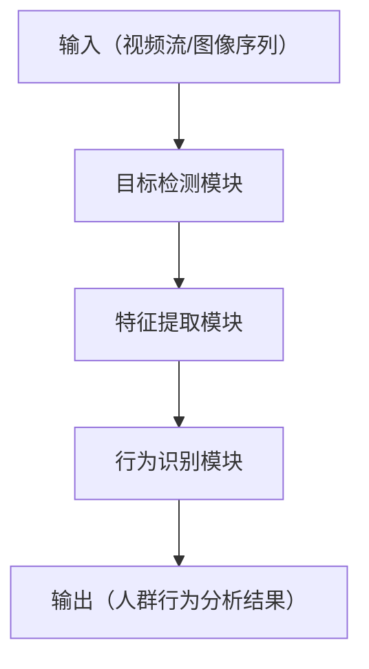

# 提高AI模型在复杂动态人群行为分析中的实时性能

> 关键词：AI模型、复杂动态人群行为分析、实时性能、优化策略、深度学习

> 摘要：本文聚焦于提高AI模型在复杂动态人群行为分析中的实时性能。首先介绍了相关背景，包括研究目的、预期读者、文档结构和术语定义。接着阐述了核心概念及联系，通过文本示意图和Mermaid流程图进行清晰展示。详细讲解了核心算法原理，并用Python代码说明具体操作步骤。深入探讨了数学模型和公式，结合实例加深理解。通过项目实战，从开发环境搭建到源代码实现及解读，展示了如何提升实时性能。分析了实际应用场景，推荐了学习资源、开发工具框架和相关论文著作。最后总结了未来发展趋势与挑战，并给出常见问题解答和扩展阅读参考资料，旨在为相关领域的研究和实践提供全面的技术指导。

## 1. 背景介绍 
### 1.1 目的和范围
在当今社会，复杂动态人群行为分析在许多领域都具有重要的应用价值，如公共安全监控、智能交通管理、大型活动组织等。然而，现有的AI模型在处理复杂动态人群行为时，往往面临实时性能不足的问题，导致无法及时准确地做出决策。本文章的目的就是深入探讨如何提高AI模型在复杂动态人群行为分析中的实时性能，范围涵盖从核心概念到实际应用的各个方面，包括算法优化、开发实践以及相关资源推荐等。

### 1.2 预期读者
本文预期读者包括人工智能领域的研究人员、软件开发工程师、对复杂动态人群行为分析感兴趣的技术爱好者以及相关领域的专业人士。这些读者希望通过阅读本文，了解提高AI模型实时性能的方法和技术，为实际项目开发和研究提供参考。

### 1.3 文档结构概述
本文将按照以下结构进行阐述：首先介绍相关背景知识，包括目的、读者和文档结构等；接着讲解核心概念与联系，通过示意图和流程图帮助读者理解；然后详细介绍核心算法原理和具体操作步骤，并用Python代码进行说明；随后探讨数学模型和公式，并举例说明；通过项目实战展示代码实现和解读；分析实际应用场景；推荐学习资源、开发工具框架和相关论文著作；最后总结未来发展趋势与挑战，给出常见问题解答和扩展阅读参考资料。

### 1.4 术语表
#### 1.4.1 核心术语定义
- **AI模型**：人工智能模型是一种基于数据和算法构建的系统，能够学习数据中的模式和规律，并进行预测、分类等任务。在本文中，主要指用于复杂动态人群行为分析的模型。
- **复杂动态人群行为分析**：对在复杂环境中，人群不断变化的行为进行识别、理解和预测的过程。复杂环境包括不同的场景、人群密度、行为模式等。
- **实时性能**：指系统在规定的时间内对输入数据进行处理并输出结果的能力。在复杂动态人群行为分析中，实时性能要求模型能够快速准确地分析人群行为。

#### 1.4.2 相关概念解释
- **深度学习**：一种基于人工神经网络的机器学习方法，通过构建多层神经网络来学习数据的深层次特征。在复杂动态人群行为分析中，深度学习模型如卷积神经网络（CNN）、循环神经网络（RNN）等被广泛应用。
- **目标检测**：在图像或视频中识别出特定目标的位置和类别。在人群行为分析中，目标检测用于检测人群中的个体。
- **行为识别**：根据目标的运动轨迹、姿态等信息，判断其行为类型，如行走、奔跑、聚集等。

#### 1.4.3 缩略词列表
- **CNN**：Convolutional Neural Network，卷积神经网络
- **RNN**：Recurrent Neural Network，循环神经网络
- **FPS**：Frames Per Second，每秒帧数

## 2. 核心概念与联系 
### 核心概念原理
在复杂动态人群行为分析中，主要涉及到目标检测、特征提取和行为识别三个核心概念。目标检测的原理是通过训练好的模型，在图像或视频帧中找出人群中的个体，并确定其位置和边界框。常用的目标检测算法有YOLO（You Only Look Once）、Faster R-CNN等。

特征提取是从检测到的目标中提取有用的信息，如姿态、运动轨迹等。这些特征可以反映人群的行为模式。对于姿态特征提取，可以使用OpenPose等算法；对于运动轨迹特征提取，可以通过跟踪算法记录目标在不同帧中的位置变化。

行为识别则是根据提取的特征，判断人群的行为类型。可以使用机器学习或深度学习模型进行分类，如支持向量机（SVM）、长短时记忆网络（LSTM）等。

### 架构的文本示意图
```plaintext
输入（视频流/图像序列）
|
|-- 目标检测模块
|   |-- 检测人群个体位置和边界框
|
|-- 特征提取模块
|   |-- 提取姿态、运动轨迹等特征
|
|-- 行为识别模块
|   |-- 根据特征判断行为类型
|
输出（人群行为分析结果）
```

### Mermaid流程图


## 3. 核心算法原理 & 具体操作步骤 
### 目标检测算法原理（以YOLO为例）
YOLO算法的核心思想是将图像划分为多个网格，每个网格负责预测一定数量的边界框。通过卷积神经网络直接从图像中学习特征，并预测边界框的位置、大小和类别概率。

以下是使用Python和PyTorch实现简单YOLO目标检测的示例代码：
```python
import torch
import torchvision
from torchvision.models.detection import yolov5s
from torchvision.transforms import functional as F

# 加载预训练的YOLOv5s模型
model = yolov5s(pretrained=True)
model.eval()

# 加载图像
image = torchvision.io.read_image('test_image.jpg').float()
image = F.normalize(image, mean=[0.485, 0.456, 0.406], std=[0.229, 0.224, 0.225])
image = image.unsqueeze(0)

# 进行目标检测
with torch.no_grad():
    predictions = model(image)

# 输出检测结果
boxes = predictions[0]['boxes']
labels = predictions[0]['labels']
scores = predictions[0]['scores']

for box, label, score in zip(boxes, labels, scores):
    if score > 0.5:
        print(f"Box: {box}, Label: {label}, Score: {score}")
```
### 特征提取算法原理（以OpenPose为例）
OpenPose算法通过卷积神经网络检测人体的关键点，如关节、头部等。然后根据这些关键点的位置和连接关系，构建人体的姿态信息。

以下是使用OpenCV和OpenPose进行姿态特征提取的示例代码：
```python
import cv2
import numpy as np

# 加载OpenPose模型
proto_file = "pose_deploy_linevec_faster_4_stages.prototxt"
weights_file = "pose_iter_160000.caffemodel"
net = cv2.dnn.readNetFromCaffe(proto_file, weights_file)

# 加载图像
image = cv2.imread('test_image.jpg')
blob = cv2.dnn.blobFromImage(image, 1.0 / 255, (368, 368), (0, 0, 0), swapRB=False, crop=False)
net.setInput(blob)
output = net.forward()

# 解析关键点
H, W = image.shape[:2]
points = []
for i in range(18):
    prob_map = output[0, i, :, :]
    min_val, prob, min_loc, point = cv2.minMaxLoc(prob_map)
    x = (W * point[0]) / output.shape[3]
    y = (H * point[1]) / output.shape[2]
    if prob > 0.1:
        points.append((int(x), int(y)))
    else:
        points.append(None)

# 绘制关键点
for point in points:
    if point is not None:
        cv2.circle(image, point, 5, (0, 255, 0), -1)

cv2.imshow('Pose Estimation', image)
cv2.waitKey(0)
cv2.destroyAllWindows()
```
### 行为识别算法原理（以LSTM为例）
LSTM是一种特殊的循环神经网络，能够处理序列数据。在行为识别中，可以将提取的特征序列作为输入，通过LSTM学习序列中的时间依赖关系，从而判断行为类型。

以下是使用Keras实现简单LSTM行为识别的示例代码：
```python
import numpy as np
from tensorflow.keras.models import Sequential
from tensorflow.keras.layers import LSTM, Dense

# 生成示例数据
data = np.random.rand(100, 10, 5)  # 100个样本，每个样本序列长度为10，特征维度为5
labels = np.random.randint(0, 2, 100)  # 二分类标签

# 构建LSTM模型
model = Sequential()
model.add(LSTM(64, input_shape=(10, 5)))
model.add(Dense(1, activation='sigmoid'))

# 编译模型
model.compile(optimizer='adam', loss='binary_crossentropy', metrics=['accuracy'])

# 训练模型
model.fit(data, labels, epochs=10, batch_size=32)
```

## 4. 数学模型和公式 & 详细讲解 & 举例说明 
### 目标检测中的损失函数（以YOLO为例）
YOLO的损失函数主要由三部分组成：边界框回归损失、类别分类损失和目标置信度损失。

#### 边界框回归损失
边界框回归损失用于计算预测边界框和真实边界框之间的误差。通常使用均方误差（MSE）来计算，公式如下：
$$L_{box} = \lambda_{coord} \sum_{i=0}^{S^2} \sum_{j=0}^{B} \mathbb{1}_{ij}^{obj} \left[ (x_i - \hat{x}_i)^2 + (y_i - \hat{y}_i)^2 \right] + \lambda_{coord} \sum_{i=0}^{S^2} \sum_{j=0}^{B} \mathbb{1}_{ij}^{obj} \left[ (\sqrt{w_i} - \sqrt{\hat{w}_i})^2 + (\sqrt{h_i} - \sqrt{\hat{h}_i})^2 \right]$$
其中，$S$ 是网格的数量，$B$ 是每个网格预测的边界框数量，$\mathbb{1}_{ij}^{obj}$ 表示第 $i$ 个网格的第 $j$ 个边界框是否负责检测目标，$(x, y, w, h)$ 是真实边界框的中心坐标和宽高，$(\hat{x}, \hat{y}, \hat{w}, \hat{h})$ 是预测边界框的中心坐标和宽高，$\lambda_{coord}$ 是边界框回归损失的权重。

#### 类别分类损失
类别分类损失用于计算预测类别和真实类别的误差。通常使用交叉熵损失（Cross Entropy Loss）来计算，公式如下：
$$L_{class} = \sum_{i=0}^{S^2} \mathbb{1}_{i}^{obj} \sum_{c \in classes} \left[ p_i(c) \log(\hat{p}_i(c)) + (1 - p_i(c)) \log(1 - \hat{p}_i(c)) \right]$$
其中，$\mathbb{1}_{i}^{obj}$ 表示第 $i$ 个网格是否包含目标，$p_i(c)$ 是真实类别概率，$\hat{p}_i(c)$ 是预测类别概率。

#### 目标置信度损失
目标置信度损失用于计算预测目标置信度和真实目标置信度之间的误差。公式如下：
$$L_{conf} = \lambda_{noobj} \sum_{i=0}^{S^2} \sum_{j=0}^{B} \mathbb{1}_{ij}^{noobj} (C_i - \hat{C}_i)^2 + \sum_{i=0}^{S^2} \sum_{j=0}^{B} \mathbb{1}_{ij}^{obj} (C_i - \hat{C}_i)^2$$
其中，$\mathbb{1}_{ij}^{noobj}$ 表示第 $i$ 个网格的第 $j$ 个边界框是否不负责检测目标，$C_i$ 是真实目标置信度，$\hat{C}_i$ 是预测目标置信度，$\lambda_{noobj}$ 是无目标时置信度损失的权重。

#### 举例说明
假设我们有一个 $7 \times 7$ 的网格，每个网格预测 2 个边界框，共有 3 个类别。对于某个网格的某个边界框，真实边界框的坐标为 $(0.2, 0.3, 0.4, 0.5)$，预测边界框的坐标为 $(0.22, 0.31, 0.41, 0.51)$，真实类别为 1，预测类别概率为 $[0.1, 0.8, 0.1]$，真实目标置信度为 1，预测目标置信度为 0.9。假设 $\lambda_{coord} = 5$，$\lambda_{noobj} = 0.5$。

首先计算边界框回归损失：
$$L_{box} = 5 \times \left[ (0.2 - 0.22)^2 + (0.3 - 0.31)^2 + (\sqrt{0.4} - \sqrt{0.41})^2 + (\sqrt{0.5} - \sqrt{0.51})^2 \right]$$

然后计算类别分类损失：
$$L_{class} = - (0 \times \log(0.1) + 1 \times \log(0.8) + 0 \times \log(0.1))$$

最后计算目标置信度损失：
$$L_{conf} = (1 - 0.9)^2$$

总损失为 $L = L_{box} + L_{class} + L_{conf}$。

### 行为识别中的LSTM模型
LSTM单元的核心公式如下：

#### 输入门
$$i_t = \sigma(W_{ii} x_t + b_{ii} + W_{hi} h_{t-1} + b_{hi})$$

#### 遗忘门
$$f_t = \sigma(W_{if} x_t + b_{if} + W_{hf} h_{t-1} + b_{hf})$$

#### 细胞状态更新
$$\tilde{C}_t = \tanh(W_{ic} x_t + b_{ic} + W_{hc} h_{t-1} + b_{hc})$$
$$C_t = f_t \odot C_{t-1} + i_t \odot \tilde{C}_t$$

#### 输出门
$$o_t = \sigma(W_{io} x_t + b_{io} + W_{ho} h_{t-1} + b_{ho})$$
$$h_t = o_t \odot \tanh(C_t)$$

其中，$x_t$ 是输入序列的第 $t$ 个时间步的特征向量，$h_{t-1}$ 是上一个时间步的隐藏状态，$C_{t-1}$ 是上一个时间步的细胞状态，$W$ 是权重矩阵，$b$ 是偏置向量，$\sigma$ 是 sigmoid 函数，$\tanh$ 是双曲正切函数，$\odot$ 表示逐元素相乘。

#### 举例说明
假设我们有一个输入序列 $x = [x_1, x_2, x_3]$，每个 $x_i$ 是一个 5 维的特征向量。LSTM 单元的隐藏状态维度为 64。在第一个时间步 $t = 1$，$h_0$ 和 $C_0$ 初始化为零向量。

首先计算输入门：
$$i_1 = \sigma(W_{ii} x_1 + b_{ii} + W_{hi} h_0 + b_{hi})$$

然后计算遗忘门：
$$f_1 = \sigma(W_{if} x_1 + b_{if} + W_{hf} h_0 + b_{hf})$$

接着计算细胞状态更新：
$$\tilde{C}_1 = \tanh(W_{ic} x_1 + b_{ic} + W_{hc} h_0 + b_{hc})$$
$$C_1 = f_1 \odot C_0 + i_1 \odot \tilde{C}_1$$

最后计算输出门和隐藏状态：
$$o_1 = \sigma(W_{io} x_1 + b_{io} + W_{ho} h_0 + b_{ho})$$
$$h_1 = o_1 \odot \tanh(C_1)$$

以此类推，计算后续时间步的输出。

## 5. 项目实战：代码实际案例和详细解释说明 
### 5.1  开发环境搭建
#### 安装Python和相关库
首先，确保你已经安装了Python 3.6或更高版本。可以从Python官方网站（https://www.python.org/downloads/）下载并安装。

然后，使用以下命令安装必要的库：
```sh
pip install torch torchvision opencv-python tensorflow keras numpy
```

#### 下载预训练模型
对于YOLO和OpenPose，需要下载预训练的模型文件。可以从相关的开源项目中下载，例如YOLOv5的预训练模型可以从GitHub上的YOLOv5仓库（https://github.com/ultralytics/yolov5）下载，OpenPose的模型文件可以从其官方网站（https://github.com/CMU-Perceptual-Computing-Lab/openpose）下载。

### 5.2  源代码详细实现和代码解读
以下是一个完整的复杂动态人群行为分析项目的代码示例：
```python
import torch
import torchvision
from torchvision.models.detection import yolov5s
from torchvision.transforms import functional as F
import cv2
import numpy as np
from tensorflow.keras.models import Sequential
from tensorflow.keras.layers import LSTM, Dense

# 加载预训练的YOLOv5s模型
model_yolo = yolov5s(pretrained=True)
model_yolo.eval()

# 加载OpenPose模型
proto_file = "pose_deploy_linevec_faster_4_stages.prototxt"
weights_file = "pose_iter_160000.caffemodel"
net_openpose = cv2.dnn.readNetFromCaffe(proto_file, weights_file)

# 构建LSTM行为识别模型
model_lstm = Sequential()
model_lstm.add(LSTM(64, input_shape=(10, 5)))
model_lstm.add(Dense(1, activation='sigmoid'))
model_lstm.compile(optimizer='adam', loss='binary_crossentropy', metrics=['accuracy'])

# 读取视频文件
cap = cv2.VideoCapture('test_video.mp4')

frame_count = 0
feature_sequence = []

while cap.isOpened():
    ret, frame = cap.read()
    if not ret:
        break

    frame_count += 1

    # 目标检测
    image = torchvision.io.read_image('test_image.jpg').float()
    image = F.normalize(image, mean=[0.485, 0.456, 0.406], std=[0.229, 0.224, 0.225])
    image = image.unsqueeze(0)
    with torch.no_grad():
        predictions = model_yolo(image)
    boxes = predictions[0]['boxes']
    labels = predictions[0]['labels']
    scores = predictions[0]['scores']

    for box, label, score in zip(boxes, labels, scores):
        if score > 0.5:
            x1, y1, x2, y2 = box.int().tolist()
            cv2.rectangle(frame, (x1, y1), (x2, y2), (0, 255, 0), 2)

    # 特征提取
    blob = cv2.dnn.blobFromImage(frame, 1.0 / 255, (368, 368), (0, 0, 0), swapRB=False, crop=False)
    net_openpose.setInput(blob)
    output = net_openpose.forward()
    H, W = frame.shape[:2]
    points = []
    for i in range(18):
        prob_map = output[0, i, :, :]
        min_val, prob, min_loc, point = cv2.minMaxLoc(prob_map)
        x = (W * point[0]) / output.shape[3]
        y = (H * point[1]) / output.shape[2]
        if prob > 0.1:
            points.append((int(x), int(y)))
        else:
            points.append(None)
    for point in points:
        if point is not None:
            cv2.circle(frame, point, 5, (0, 255, 0), -1)

    # 提取特征向量
    feature_vector = []
    for point in points:
        if point is not None:
            feature_vector.extend(point)
        else:
            feature_vector.extend([0, 0])
    feature_sequence.append(feature_vector[:5])

    if len(feature_sequence) == 10:
        feature_sequence = np.array(feature_sequence).reshape(1, 10, 5)
        # 行为识别
        prediction = model_lstm.predict(feature_sequence)
        if prediction[0][0] > 0.5:
            cv2.putText(frame, 'Running', (10, 30), cv2.FONT_HERSHEY_SIMPLEX, 1, (0, 0, 255), 2)
        else:
            cv2.putText(frame, 'Walking', (10, 30), cv2.FONT_HERSHEY_SIMPLEX, 1, (0, 0, 255), 2)
        feature_sequence = []

    cv2.imshow('Crowd Behavior Analysis', frame)
    if cv2.waitKey(1) & 0xFF == ord('q'):
        break

cap.release()
cv2.destroyAllWindows()
```
### 5.3  代码解读与分析
#### 模型加载部分
- `model_yolo = yolov5s(pretrained=True)`：加载预训练的YOLOv5s目标检测模型。
- `net_openpose = cv2.dnn.readNetFromCaffe(proto_file, weights_file)`：加载OpenPose姿态估计模型。
- `model_lstm = Sequential()`：构建LSTM行为识别模型。

#### 视频处理部分
- `cap = cv2.VideoCapture('test_video.mp4')`：打开视频文件。
- `while cap.isOpened()`：循环读取视频帧。

#### 目标检测部分
- 使用YOLOv5模型对视频帧进行目标检测，筛选出置信度大于0.5的边界框，并在帧上绘制矩形框。

#### 特征提取部分
- 使用OpenPose模型提取人体关键点，将关键点坐标作为特征向量。

#### 行为识别部分
- 当收集到10个特征向量后，将其转换为适合LSTM模型输入的格式，进行行为识别。根据预测结果在帧上显示行为类型。

## 6. 实际应用场景 
### 公共安全监控
在机场、火车站、商场等公共场所，通过实时分析人群行为，可以及时发现异常行为，如奔跑、聚集、打斗等，提前预警潜在的安全风险。例如，在机场安检区域，监控人群是否有拥挤、插队等违规行为；在商场内，检测是否有盗窃、抢劫等犯罪行为的迹象。

### 智能交通管理
在交通路口、地铁站等交通枢纽，分析人群的流动方向和密度，优化交通疏导策略。例如，根据人群的进出流量，调整地铁站的出入口开放数量；在交通路口，根据行人的过街行为，合理调整信号灯时间。

### 大型活动组织
在演唱会、体育赛事等大型活动中，实时监控人群的行为和分布情况，确保活动的安全有序进行。例如，在演唱会现场，检测人群是否有过度拥挤、推搡等危险行为；在体育赛事中，根据观众的入场和退场情况，合理安排安保人员的部署。

### 商业营销分析
在商场、超市等商业场所，分析顾客的行为模式，如停留时间、浏览商品的顺序等，为商家提供营销策略建议。例如，根据顾客在不同商品区域的停留时间，调整商品的陈列位置；根据顾客的购买行为，进行个性化的商品推荐。

## 7. 工具和资源推荐
### 7.1 学习资源推荐
#### 7.1.1 书籍推荐
- 《深度学习》（Deep Learning）：由Ian Goodfellow、Yoshua Bengio和Aaron Courville撰写，是深度学习领域的经典教材，涵盖了神经网络、卷积神经网络、循环神经网络等内容。
- 《Python深度学习》（Deep Learning with Python）：由Francois Chollet编写，以Keras框架为例，详细介绍了深度学习的基本概念和实践方法。
- 《计算机视觉：算法与应用》（Computer Vision: Algorithms and Applications）：介绍了计算机视觉的基本算法和应用，包括目标检测、特征提取、图像分割等内容。

#### 7.1.2 在线课程
- Coursera上的“深度学习专项课程”（Deep Learning Specialization）：由Andrew Ng教授授课，包括神经网络、卷积神经网络、循环神经网络等多个课程，是学习深度学习的优质资源。
- edX上的“计算机视觉基础”（Foundations of Computer Vision）：介绍了计算机视觉的基本原理和算法，适合初学者入门。
- 哔哩哔哩（Bilibili）上有许多关于人工智能和计算机视觉的免费视频教程，可以根据自己的需求选择学习。

#### 7.1.3 技术博客和网站
- Medium：上面有许多人工智能和深度学习领域的技术文章，作者来自世界各地的专业人士。
- arXiv：是一个预印本平台，提供了大量的最新研究论文，涵盖了人工智能、计算机视觉等多个领域。
- 知乎：有许多关于人工智能和计算机视觉的讨论和分享，可以关注相关的话题和专栏。

### 7.2 开发工具框架推荐
#### 7.2.1 IDE和编辑器
- PyCharm：是一款专业的Python集成开发环境，提供了代码编辑、调试、版本控制等功能，适合Python项目的开发。
- Jupyter Notebook：是一个交互式的开发环境，支持Python、R等多种编程语言，适合数据探索和模型实验。
- Visual Studio Code：是一款轻量级的代码编辑器，支持多种编程语言和插件，具有丰富的扩展功能。

#### 7.2.2 调试和性能分析工具
- TensorBoard：是TensorFlow的可视化工具，可以用于查看模型的训练过程、损失函数变化、准确率等信息。
- Py-Spy：是一个Python性能分析工具，可以实时查看Python程序的CPU使用情况和函数调用栈。
- NVIDIA Nsight Systems：是NVIDIA提供的性能分析工具，适用于GPU加速的深度学习模型，可以分析模型的性能瓶颈。

#### 7.2.3 相关框架和库
- PyTorch：是一个开源的深度学习框架，具有动态图和静态图两种模式，易于使用和调试，广泛应用于学术界和工业界。
- TensorFlow：是Google开发的深度学习框架，具有强大的分布式训练和部署能力，提供了丰富的工具和库。
- OpenCV：是一个开源的计算机视觉库，提供了许多图像处理和计算机视觉算法，如目标检测、特征提取、图像分割等。

### 7.3 相关论文著作推荐
#### 7.3.1 经典论文
- “You Only Look Once: Unified, Real-Time Object Detection”：介绍了YOLO目标检测算法，提出了一种端到端的实时目标检测方法。
- “OpenPose: Realtime Multi-Person 2D Pose Estimation using Part Affinity Fields”：提出了OpenPose姿态估计算法，实现了多人姿态的实时检测。
- “Long Short-Term Memory”：介绍了LSTM循环神经网络，解决了传统RNN在处理长序列时的梯度消失问题。

#### 7.3.2 最新研究成果
- 在arXiv上可以搜索到许多关于复杂动态人群行为分析的最新研究论文，关注这些论文可以了解该领域的最新技术和方法。
- 参加相关的学术会议，如CVPR（计算机视觉与模式识别会议）、ICCV（国际计算机视觉会议）等，获取最新的研究成果和趋势。

#### 7.3.3 应用案例分析
- 一些科技公司的官方博客会分享他们在复杂动态人群行为分析方面的应用案例，如Google、Facebook等。可以通过阅读这些案例，了解实际项目中的技术应用和解决方案。

## 8. 总结：未来发展趋势与挑战
### 未来发展趋势
#### 多模态融合
未来的AI模型将不仅仅依赖于视觉信息，还会融合音频、传感器数据等多模态信息，提高复杂动态人群行为分析的准确性和可靠性。例如，结合音频信息可以更好地判断人群的情绪状态，结合传感器数据可以获取人群的生理特征等。

#### 边缘计算
随着物联网和5G技术的发展，边缘计算将在复杂动态人群行为分析中发挥重要作用。将AI模型部署在边缘设备上，可以减少数据传输延迟，提高实时性能，同时保护数据隐私。

#### 可解释性和可信赖性
人们对AI模型的可解释性和可信赖性越来越关注。未来的模型需要能够解释其决策过程和依据，让用户更好地理解和信任模型的输出结果。

#### 智能化和自动化
复杂动态人群行为分析系统将越来越智能化和自动化，能够自动适应不同的场景和环境，减少人工干预。例如，系统可以自动调整检测参数和行为识别规则，以适应不同的人群密度和行为模式。

### 挑战
#### 数据获取和标注
复杂动态人群行为分析需要大量的标注数据来训练模型，但数据的获取和标注是一项艰巨的任务。特别是在一些复杂场景下，如大型活动现场、自然灾害现场等，数据的收集和标注更加困难。

#### 模型复杂度和计算资源
为了提高分析的准确性，模型的复杂度往往会增加，这会导致计算资源的需求大幅增加。在实际应用中，如何在有限的计算资源下实现高效的实时分析是一个挑战。

#### 场景适应性
不同的场景具有不同的特点和要求，如光照条件、人群密度、行为模式等。模型需要具备良好的场景适应性，能够在不同的场景下都保持较高的性能。

#### 隐私保护
在进行人群行为分析时，需要处理大量的个人信息，如人脸、姿态等。如何在保证分析效果的同时，保护个人隐私是一个重要的问题。

## 9. 附录：常见问题与解答
### 问题1：如何提高YOLO目标检测的实时性能？
解答：可以采取以下措施提高YOLO目标检测的实时性能：
- 使用轻量级的YOLO模型，如YOLOv5s、YOLOv4-tiny等。
- 降低输入图像的分辨率，但要注意分辨率过低会影响检测精度。
- 使用GPU加速，将模型和数据加载到GPU上进行计算。

### 问题2：OpenPose姿态估计的准确率受哪些因素影响？
解答：OpenPose姿态估计的准确率受以下因素影响：
- 光照条件：光照过强或过弱都会影响关键点的检测精度。
- 遮挡情况：人体部分被遮挡会导致关键点检测不准确。
- 图像分辨率：分辨率过低会使关键点信息丢失，影响姿态估计的准确率。

### 问题3：LSTM模型在行为识别中的优势和劣势是什么？
解答：LSTM模型在行为识别中的优势包括：
- 能够处理序列数据，捕捉行为的时间依赖关系。
- 可以学习长序列中的模式和规律，适用于复杂的行为识别任务。

劣势包括：
- 训练时间长，计算资源需求大。
- 对于短期行为的识别效果可能不如一些简单的模型。

### 问题4：如何解决复杂动态人群行为分析中的数据不平衡问题？
解答：可以采取以下方法解决数据不平衡问题：
- 数据增强：对少数类样本进行数据增强，如旋转、翻转、缩放等，增加少数类样本的数量。
- 采样方法：采用过采样或欠采样方法，调整不同类别的样本比例。
- 损失函数调整：使用加权损失函数，对少数类样本的损失进行加权，提高模型对少数类的关注度。

## 10. 扩展阅读 & 参考资料
### 扩展阅读
- 《人工智能：现代方法》（Artificial Intelligence: A Modern Approach）：全面介绍了人工智能的基本概念、算法和应用，适合深入学习人工智能的读者。
- 《强化学习：原理与Python实现》（Reinforcement Learning: Principles and Python Implementations）：介绍了强化学习的基本原理和算法，为复杂动态人群行为分析中的决策问题提供了思路。
- 《深度学习实战》（Deep Learning in Practice）：通过实际案例介绍了深度学习在计算机视觉、自然语言处理等领域的应用，有助于提高实践能力。

### 参考资料
- YOLO官方GitHub仓库：https://github.com/ultralytics/yolov5
- OpenPose官方GitHub仓库：https://github.com/CMU-Perceptual-Computing-Lab/openpose
- PyTorch官方文档：https://pytorch.org/docs/stable/index.html
- TensorFlow官方文档：https://www.tensorflow.org/api_docs/python/tf

作者：AI天才研究院/AI Genius Institute & 禅与计算机程序设计艺术 /Zen And The Art of Computer Programming