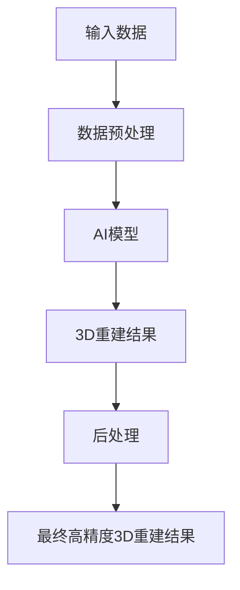

# 提高AI模型在复杂场景3D重建任务中的精度

> 关键词：AI模型、复杂场景、3D重建、精度提升、计算机视觉

> 摘要：本文聚焦于如何提高AI模型在复杂场景3D重建任务中的精度。首先介绍了该研究的背景、目的、预期读者等信息，接着阐述了核心概念与联系，详细讲解了核心算法原理及具体操作步骤，给出了相关数学模型和公式并举例说明。通过项目实战展示了代码实现和解读，分析了实际应用场景。同时推荐了学习资源、开发工具框架以及相关论文著作。最后总结了未来发展趋势与挑战，解答了常见问题并提供了扩展阅读和参考资料，旨在为相关领域的研究和实践提供全面且深入的指导。

## 1. 背景介绍 
### 1.1 目的和范围
随着计算机视觉和人工智能技术的飞速发展，3D重建在诸多领域如虚拟现实、增强现实、自动驾驶、文化遗产保护等展现出巨大的应用潜力。然而，复杂场景（如包含大量遮挡、光照变化剧烈、物体表面材质复杂等情况）下的3D重建任务仍然面临着精度不高的问题。本文章的目的在于深入探讨提高AI模型在复杂场景3D重建任务中精度的方法和策略，涵盖从基础概念、算法原理到实际应用等多个方面，为研究人员和开发者提供全面的技术指导。

### 1.2 预期读者
本文预期读者包括计算机视觉、人工智能领域的研究人员、研究生，从事3D重建相关项目的开发者，以及对3D重建技术感兴趣的技术爱好者。这些读者通常具备一定的编程基础和计算机视觉知识，希望进一步了解如何提升AI模型在复杂场景下3D重建的精度。

### 1.3 文档结构概述
本文将按照以下结构进行组织：首先介绍核心概念与联系，帮助读者建立起对3D重建和相关技术的基本理解；接着详细讲解核心算法原理及具体操作步骤，包括使用Python代码进行阐述；然后给出数学模型和公式，并通过具体例子进行说明；通过项目实战展示代码的实际应用和详细解释；分析实际应用场景；推荐学习资源、开发工具框架和相关论文著作；最后总结未来发展趋势与挑战，解答常见问题并提供扩展阅读和参考资料。

### 1.4 术语表
#### 1.4.1 核心术语定义
- **3D重建**：指从二维图像或传感器数据中恢复出三维物体或场景的几何信息和外观信息的过程。
- **AI模型**：利用人工智能技术构建的模型，在3D重建中通常用于处理和分析数据，以实现更准确的重建结果。
- **复杂场景**：包含大量遮挡、光照变化剧烈、物体表面材质复杂、场景结构不规则等因素，增加了3D重建难度的场景。
- **精度**：在3D重建中，精度指重建结果与真实场景之间的接近程度，通常用误差指标来衡量。

#### 1.4.2 相关概念解释
- **多视图立体视觉（Multi-View Stereo, MVS）**：通过从不同角度拍摄的多张图像来恢复场景的三维结构，是3D重建中常用的方法之一。
- **深度学习**：一种基于人工神经网络的机器学习方法，在图像分析和处理领域取得了显著的成果，被广泛应用于3D重建任务中。
- **点云**：由大量的三维点组成的数据集合，每个点包含三维坐标信息，是3D重建结果的一种常见表示形式。

#### 1.4.3 缩略词列表
- **MVS**：Multi-View Stereo（多视图立体视觉）
- **CNN**：Convolutional Neural Network（卷积神经网络）
- **RGB**：Red, Green, Blue（红、绿、蓝，指彩色图像的颜色通道）
- **RGB-D**：Red, Green, Blue - Depth（彩色图像和深度图像）

## 2. 核心概念与联系 

### 2.1 3D重建的基本原理
3D重建的核心目标是从二维图像或传感器数据中恢复出三维场景的几何结构和外观信息。其基本原理可以基于不同的方法，如基于多视图立体视觉（MVS）、基于结构光、基于激光雷达等。

#### 2.1.1 多视图立体视觉原理
多视图立体视觉通过从不同视角拍摄同一场景的多张图像，利用图像之间的对应关系来计算场景中每个点的三维坐标。具体步骤包括：
1. **特征提取**：在每张图像中提取具有代表性的特征点，如SIFT（尺度不变特征变换）、SURF（加速稳健特征）等。
2. **特征匹配**：在不同图像之间寻找特征点的对应关系，确定哪些特征点代表场景中的同一个点。
3. **三角测量**：根据相机的内外参数和特征点的对应关系，利用三角测量原理计算出每个特征点的三维坐标。

#### 2.1.2 基于深度学习的3D重建原理
近年来，深度学习在3D重建领域取得了显著的进展。基于深度学习的3D重建方法通常使用卷积神经网络（CNN）来学习图像和三维结构之间的映射关系。具体来说，通过大量的训练数据，让CNN学习如何从二维图像中预测出三维物体的形状、姿态等信息。

### 2.2 复杂场景对3D重建的挑战
复杂场景给3D重建带来了诸多挑战，主要包括以下几个方面：
1. **遮挡问题**：场景中的物体相互遮挡，导致部分区域在某些图像中不可见，从而影响特征匹配和三维信息的恢复。
2. **光照变化**：光照强度、方向和颜色的变化会导致图像中物体的外观发生改变，使得特征提取和匹配变得困难。
3. **物体表面材质复杂**：不同的物体表面材质（如反光、透明等）会对光线的反射和折射产生不同的影响，增加了图像分析和三维重建的难度。
4. **场景结构不规则**：复杂场景中的物体形状和布局可能非常不规则，缺乏明显的几何特征，给三维模型的构建带来挑战。

### 2.3 提高精度的关键因素
为了提高AI模型在复杂场景3D重建任务中的精度，需要考虑以下关键因素：
1. **数据质量**：高质量的输入数据是提高重建精度的基础。包括图像的分辨率、清晰度、光照均匀性等，以及传感器数据的准确性和完整性。
2. **算法设计**：选择合适的算法和模型结构对于处理复杂场景至关重要。例如，采用具有更强特征表达能力的深度学习模型，或者结合多种算法进行融合处理。
3. **模型训练**：充分的训练数据和合理的训练策略可以提高模型的泛化能力和适应性。同时，使用数据增强技术可以扩充训练数据，提高模型对不同场景的鲁棒性。
4. **后处理技术**：对重建结果进行后处理，如滤波、平滑、孔洞填充等，可以进一步提高重建精度和模型的质量。

### 2.4 核心概念原理和架构的文本示意图
```plaintext
输入数据（图像、传感器数据）
|
|-- 数据预处理（图像增强、特征提取等）
|
|-- AI模型（深度学习模型、传统算法模型）
|
|-- 3D重建结果（点云、网格模型等）
|
|-- 后处理（滤波、平滑、孔洞填充等）
|
|-- 最终高精度3D重建结果
```

### 2.5 Mermaid流程图


## 3. 核心算法原理 & 具体操作步骤 

### 3.1 基于深度学习的多视图立体视觉算法原理
#### 3.1.1 整体架构
基于深度学习的多视图立体视觉算法通常采用编码器 - 解码器架构。编码器用于提取输入图像的特征，解码器则根据这些特征生成三维重建结果。

#### 3.1.2 编码器部分
编码器通常使用卷积神经网络（CNN）来提取图像的特征。例如，使用ResNet、VGG等经典的CNN架构。在多视图立体视觉中，需要对多个视角的图像分别进行特征提取，然后将这些特征进行融合。

#### 3.1.3 解码器部分
解码器根据编码器提取的特征生成三维重建结果。一种常见的方法是使用体积渲染（Volume Rendering）技术，将特征映射到三维空间中，生成三维体积数据，然后通过体素投票等方法得到最终的点云或网格模型。

### 3.2 具体操作步骤
#### 3.2.1 数据准备
1. 收集不同视角的图像数据，确保图像覆盖整个场景，并且具有足够的重叠区域。
2. 对图像进行预处理，包括图像增强（如直方图均衡化、去噪等）、特征提取（如SIFT、ORB等）。

#### 3.2.2 模型训练
1. 构建深度学习模型，选择合适的编码器和解码器架构。
2. 准备训练数据，包括输入图像和对应的三维标注数据（如点云、网格模型等）。
3. 使用训练数据对模型进行训练，选择合适的损失函数（如均方误差损失、交叉熵损失等）和优化算法（如Adam、SGD等）。

#### 3.2.3 3D重建
1. 将预处理后的图像输入到训练好的模型中，得到三维重建结果。
2. 对重建结果进行后处理，如滤波、平滑、孔洞填充等，以提高重建精度和模型质量。

### 3.3 Python源代码详细阐述
```python
import torch
import torch.nn as nn
import torch.optim as optim
from torch.utils.data import DataLoader, Dataset
import numpy as np

# 定义编码器
class Encoder(nn.Module):
    def __init__(self):
        super(Encoder, self).__init__()
        self.conv1 = nn.Conv2d(3, 64, kernel_size=3, padding=1)
        self.relu1 = nn.ReLU(inplace=True)
        self.conv2 = nn.Conv2d(64, 128, kernel_size=3, padding=1)
        self.relu2 = nn.ReLU(inplace=True)

    def forward(self, x):
        x = self.relu1(self.conv1(x))
        x = self.relu2(self.conv2(x))
        return x

# 定义解码器
class Decoder(nn.Module):
    def __init__(self):
        super(Decoder, self).__init__()
        self.fc1 = nn.Linear(128 * 64 * 64, 1024)
        self.relu = nn.ReLU(inplace=True)
        self.fc2 = nn.Linear(1024, 3 * 1000)  # 假设输出1000个点的三维坐标

    def forward(self, x):
        x = x.view(-1, 128 * 64 * 64)
        x = self.relu(self.fc1(x))
        x = self.fc2(x)
        x = x.view(-1, 1000, 3)
        return x

# 定义数据集类
class CustomDataset(Dataset):
    def __init__(self, images, labels):
        self.images = images
        self.labels = labels

    def __len__(self):
        return len(self.images)

    def __getitem__(self, idx):
        image = self.images[idx]
        label = self.labels[idx]
        return torch.tensor(image, dtype=torch.float32), torch.tensor(label, dtype=torch.float32)

# 训练函数
def train_model(model, dataloader, criterion, optimizer, num_epochs=10):
    for epoch in range(num_epochs):
        running_loss = 0.0
        for images, labels in dataloader:
            optimizer.zero_grad()
            outputs = model(images)
            loss = criterion(outputs, labels)
            loss.backward()
            optimizer.step()
            running_loss += loss.item()
        print(f'Epoch {epoch + 1}, Loss: {running_loss / len(dataloader)}')

# 主函数
if __name__ == '__main__':
    # 模拟数据
    num_samples = 100
    images = np.random.rand(num_samples, 3, 64, 64)
    labels = np.random.rand(num_samples, 1000, 3)

    # 创建数据集和数据加载器
    dataset = CustomDataset(images, labels)
    dataloader = DataLoader(dataset, batch_size=10, shuffle=True)

    # 创建模型
    encoder = Encoder()
    decoder = Decoder()
    model = nn.Sequential(encoder, decoder)

    # 定义损失函数和优化器
    criterion = nn.MSELoss()
    optimizer = optim.Adam(model.parameters(), lr=0.001)

    # 训练模型
    train_model(model, dataloader, criterion, optimizer)
```

## 4. 数学模型和公式 & 详细讲解 & 举例说明 

### 4.1 三角测量原理
#### 4.1.1 数学公式
在多视图立体视觉中，三角测量是计算三维点坐标的基本方法。假设我们有两个相机，其投影矩阵分别为 $P_1$ 和 $P_2$，在两个图像中对应的特征点坐标分别为 $x_1$ 和 $x_2$。则可以通过以下方程求解三维点 $X$ 的坐标：
$$
\begin{cases}
x_1 = P_1X \\
x_2 = P_2X
\end{cases}
$$
其中，$x_1$ 和 $x_2$ 是二维齐次坐标，$X$ 是三维齐次坐标。通常可以使用最小二乘法来求解上述方程组，得到 $X$ 的最优解。

#### 4.1.2 详细讲解
投影矩阵 $P$ 描述了相机的内外参数，将三维空间中的点映射到二维图像平面上。通过两个相机的投影矩阵和对应的特征点坐标，可以建立一个超定方程组，因为有更多的方程（两个图像的投影方程）和较少的未知数（三维点的坐标）。最小二乘法通过最小化误差平方和来求解这个超定方程组，得到三维点的最优估计。

#### 4.1.3 举例说明
假设两个相机的投影矩阵分别为：
$$
P_1 = 
\begin{bmatrix}
1 & 0 & 0 & 0 \\
0 & 1 & 0 & 0 \\
0 & 0 & 1 & 0
\end{bmatrix}
$$
$$
P_2 = 
\begin{bmatrix}
1 & 0 & 0 & -1 \\
0 & 1 & 0 & 0 \\
0 & 0 & 1 & 0
\end{bmatrix}
$$
在两个图像中对应的特征点坐标分别为 $x_1 = [1, 1]^T$ 和 $x_2 = [0, 1]^T$。将这些值代入上述方程组，通过最小二乘法求解得到三维点 $X = [1, 1, 0]^T$。

### 4.2 体积渲染原理
#### 4.2.1 数学公式
体积渲染是一种将三维体积数据转换为二维图像或三维点云的方法。假设我们有一个三维体积数据 $V(x, y, z)$，表示在空间点 $(x, y, z)$ 处的密度值。通过光线追踪的方法，从相机位置发射一条光线，与体积数据相交，计算光线在体积内的积分：
$$
C = \int_{t_0}^{t_1} V(x(t), y(t), z(t)) \cdot T(t) dt
$$
其中，$C$ 是光线的颜色值，$t$ 是光线的参数，$T(t)$ 是光线在 $t$ 位置之前的透明度。

#### 4.2.2 详细讲解
体积渲染的核心思想是模拟光线在三维体积中的传播和吸收过程。通过对光线在体积内的积分，可以得到光线的颜色值，从而生成二维图像或三维点云。透明度 $T(t)$ 用于考虑光线在传播过程中的衰减，确保只有可见的部分对最终结果有贡献。

#### 4.2.3 举例说明
假设我们有一个简单的三维体积数据，其密度值在一个立方体内部为 1，外部为 0。从相机位置发射一条光线，与立方体相交。通过对光线在立方体内的积分，可以得到光线的颜色值，从而确定立方体在图像中的显示效果。

### 4.3 深度学习中的损失函数
#### 4.3.1 均方误差损失（MSE）
均方误差损失是深度学习中常用的损失函数之一，用于衡量模型预测值与真实值之间的误差。其数学公式为：
$$
MSE = \frac{1}{n} \sum_{i=1}^{n} (y_i - \hat{y}_i)^2
$$
其中，$y_i$ 是真实值，$\hat{y}_i$ 是模型预测值，$n$ 是样本数量。

#### 4.3.2 详细讲解
均方误差损失通过计算预测值与真实值之间的平方差的平均值来衡量误差。平方差的作用是放大较大的误差，使得模型更加关注那些预测误差较大的样本。在训练过程中，模型的目标是最小化均方误差损失，从而提高预测的准确性。

#### 4.3.3 举例说明
假设我们有一个简单的回归模型，预测房价。真实房价为 $y = [100, 200, 300]$，模型预测的房价为 $\hat{y} = [110, 190, 310]$。则均方误差损失为：
$$
MSE = \frac{1}{3} ((100 - 110)^2 + (200 - 190)^2 + (300 - 310)^2) = \frac{1}{3} (100 + 100 + 100) = 100
$$

## 5. 项目实战：代码实际案例和详细解释说明 

### 5.1  开发环境搭建
#### 5.1.1 操作系统
推荐使用Ubuntu 18.04或更高版本的Linux系统，或者Windows 10操作系统。

#### 5.1.2 编程语言和库
- **Python**：版本3.6或更高版本。
- **PyTorch**：深度学习框架，用于构建和训练模型。可以根据自己的显卡情况选择合适的版本，如CUDA支持的版本。
- **OpenCV**：计算机视觉库，用于图像预处理和特征提取。
- **NumPy**：用于数值计算和数组操作。

#### 5.1.3 安装步骤
1. 安装Python：可以从Python官方网站下载安装包进行安装，或者使用包管理器（如apt、pip）进行安装。
2. 安装PyTorch：根据自己的显卡情况和操作系统选择合适的安装命令，参考PyTorch官方网站的安装指南。
3. 安装OpenCV和NumPy：使用pip命令进行安装：
```sh
pip install opencv-python numpy
```

### 5.2  源代码详细实现和代码解读
```python
import torch
import torch.nn as nn
import torch.optim as optim
from torch.utils.data import DataLoader, Dataset
import cv2
import numpy as np

# 定义编码器
class Encoder(nn.Module):
    def __init__(self):
        super(Encoder, self).__init__()
        self.conv1 = nn.Conv2d(3, 64, kernel_size=3, padding=1)
        self.relu1 = nn.ReLU(inplace=True)
        self.conv2 = nn.Conv2d(64, 128, kernel_size=3, padding=1)
        self.relu2 = nn.ReLU(inplace=True)

    def forward(self, x):
        x = self.relu1(self.conv1(x))
        x = self.relu2(self.conv2(x))
        return x

# 定义解码器
class Decoder(nn.Module):
    def __init__(self):
        super(Decoder, self).__init__()
        self.fc1 = nn.Linear(128 * 64 * 64, 1024)
        self.relu = nn.ReLU(inplace=True)
        self.fc2 = nn.Linear(1024, 3 * 1000)  # 假设输出1000个点的三维坐标

    def forward(self, x):
        x = x.view(-1, 128 * 64 * 64)
        x = self.relu(self.fc1(x))
        x = self.fc2(x)
        x = x.view(-1, 1000, 3)
        return x

# 定义数据集类
class CustomDataset(Dataset):
    def __init__(self, image_paths, labels):
        self.image_paths = image_paths
        self.labels = labels

    def __len__(self):
        return len(self.image_paths)

    def __getitem__(self, idx):
        image_path = self.image_paths[idx]
        image = cv2.imread(image_path)
        image = cv2.cvtColor(image, cv2.COLOR_BGR2RGB)
        image = cv2.resize(image, (64, 64))
        image = image.transpose(2, 0, 1) / 255.0
        label = self.labels[idx]
        return torch.tensor(image, dtype=torch.float32), torch.tensor(label, dtype=torch.float32)

# 训练函数
def train_model(model, dataloader, criterion, optimizer, num_epochs=10):
    for epoch in range(num_epochs):
        running_loss = 0.0
        for images, labels in dataloader:
            optimizer.zero_grad()
            outputs = model(images)
            loss = criterion(outputs, labels)
            loss.backward()
            optimizer.step()
            running_loss += loss.item()
        print(f'Epoch {epoch + 1}, Loss: {running_loss / len(dataloader)}')

# 主函数
if __name__ == '__main__':
    # 模拟数据
    num_samples = 100
    image_paths = ['image_{}.jpg'.format(i) for i in range(num_samples)]
    labels = np.random.rand(num_samples, 1000, 3)

    # 创建数据集和数据加载器
    dataset = CustomDataset(image_paths, labels)
    dataloader = DataLoader(dataset, batch_size=10, shuffle=True)

    # 创建模型
    encoder = Encoder()
    decoder = Decoder()
    model = nn.Sequential(encoder, decoder)

    # 定义损失函数和优化器
    criterion = nn.MSELoss()
    optimizer = optim.Adam(model.parameters(), lr=0.001)

    # 训练模型
    train_model(model, dataloader, criterion, optimizer)
```

### 5.3  代码解读与分析
#### 5.3.1 编码器部分
`Encoder` 类继承自 `nn.Module`，定义了一个简单的卷积神经网络作为编码器。它包含两个卷积层和两个ReLU激活函数，用于提取输入图像的特征。

#### 5.3.2 解码器部分
`Decoder` 类同样继承自 `nn.Module`，定义了一个全连接神经网络作为解码器。它将编码器提取的特征映射到三维点云的坐标上，输出1000个点的三维坐标。

#### 5.3.3 数据集类
`CustomDataset` 类继承自 `Dataset`，用于加载图像数据和对应的标签。在 `__getitem__` 方法中，读取图像文件，进行预处理（如颜色转换、尺寸调整、归一化等），并将其转换为PyTorch张量。

#### 5.3.4 训练函数
`train_model` 函数用于训练模型。在每个epoch中，遍历数据加载器中的所有样本，计算模型的输出和损失，然后进行反向传播和参数更新。

#### 5.3.5 主函数
在主函数中，首先模拟了图像文件路径和标签数据，然后创建了数据集和数据加载器。接着创建了编码器、解码器和模型，定义了损失函数和优化器，最后调用训练函数进行模型训练。

## 6. 实际应用场景 
### 6.1 虚拟现实和增强现实
在虚拟现实（VR）和增强现实（AR）应用中，需要高精度的3D重建来创建逼真的虚拟场景。例如，在VR游戏中，通过对现实场景进行3D重建，可以将玩家带入一个更加真实的虚拟世界；在AR应用中，将虚拟物体与真实场景进行融合，需要准确的3D重建来确定虚拟物体的位置和姿态。

### 6.2 自动驾驶
自动驾驶车辆需要对周围环境进行实时的3D重建，以识别道路、障碍物、其他车辆等。高精度的3D重建可以提高自动驾驶系统的安全性和可靠性，帮助车辆做出更准确的决策。

### 6.3 文化遗产保护
对于文化遗产的保护和修复，3D重建可以提供详细的三维模型，帮助研究人员更好地了解文物的结构和特征。同时，高精度的3D模型可以用于文物的数字化存档和虚拟展示，让更多的人能够欣赏和研究文化遗产。

### 6.4 工业制造
在工业制造领域，3D重建可以用于产品设计、质量检测和逆向工程等。通过对产品进行3D重建，可以快速获取产品的三维数据，进行设计优化和质量检测；在逆向工程中，通过对现有产品的3D重建，可以复制和改进产品。

## 7. 工具和资源推荐
### 7.1 学习资源推荐
#### 7.1.1 书籍推荐
- 《计算机视觉：算法与应用》：全面介绍了计算机视觉的基本概念、算法和应用，包括3D重建的相关内容。
- 《深度学习》：由Ian Goodfellow、Yoshua Bengio和Aaron Courville撰写，是深度学习领域的经典教材，对理解基于深度学习的3D重建算法有很大帮助。
- 《多视图几何》：详细介绍了多视图立体视觉的原理和算法，是3D重建领域的重要参考书籍。

#### 7.1.2 在线课程
- Coursera上的“计算机视觉基础”课程：由华盛顿大学的教授授课，涵盖了计算机视觉的基础知识和3D重建的相关内容。
- edX上的“深度学习”课程：由麻省理工学院的教授授课，深入介绍了深度学习的原理和应用，包括在3D重建中的应用。
- Udemy上的“3D重建实战”课程：通过实际项目讲解3D重建的方法和技巧，适合初学者快速上手。

#### 7.1.3 技术博客和网站
- OpenCV官方文档和博客：提供了丰富的计算机视觉算法和代码示例，对学习3D重建有很大帮助。
- PyTorch官方文档和论坛：可以了解最新的深度学习技术和模型，以及在3D重建中的应用。
- arXiv.org：是一个预印本平台，提供了大量的最新研究成果和论文，包括3D重建领域的前沿研究。

### 7.2 开发工具框架推荐
#### 7.2.1 IDE和编辑器
- PyCharm：是一款专门为Python开发设计的集成开发环境，具有代码编辑、调试、版本控制等功能，适合开发基于Python的3D重建项目。
- Visual Studio Code：是一款轻量级的代码编辑器，支持多种编程语言和插件，可用于快速开发和调试3D重建代码。

#### 7.2.2 调试和性能分析工具
- PyTorch Profiler：是PyTorch自带的性能分析工具，可以帮助开发者分析模型的运行时间、内存使用等情况，优化模型性能。
- TensorBoard：是TensorFlow的可视化工具，也可以与PyTorch集成，用于可视化模型的训练过程和性能指标。

#### 7.2.3 相关框架和库
- Open3D：是一个开源的3D数据处理库，提供了丰富的3D重建算法和工具，包括点云处理、表面重建等。
- MeshLab：是一个开源的三维网格处理软件，可用于对3D重建结果进行后处理，如滤波、平滑、孔洞填充等。

### 7.3 相关论文著作推荐
#### 7.3.1 经典论文
- "Multiple View Geometry in Computer Vision" by Richard Hartley and Andrew Zisserman：是多视图几何领域的经典论文，详细介绍了多视图立体视觉的原理和算法。
- "DeepSDF: Learning Continuous Signed Distance Functions for Shape Representation" by Jeong Joon Park et al.：提出了一种基于深度学习的形状表示方法，用于3D重建和形状生成。

#### 7.3.2 最新研究成果
- 关注CVPR、ICCV、ECCV等计算机视觉领域的顶级会议，这些会议上的最新研究成果代表了3D重建领域的前沿技术。
- 在arXiv.org上搜索相关关键词，如“3D reconstruction”、“deep learning for 3D reconstruction”等，可以获取最新的预印本论文。

#### 7.3.3 应用案例分析
- 一些知名的科技公司（如Google、Microsoft等）会在其官方博客或研究报告中分享3D重建的应用案例，可以从中学习到实际应用中的经验和技巧。

## 8. 总结：未来发展趋势与挑战
### 8.1 未来发展趋势
#### 8.1.1 融合多种传感器数据
未来的3D重建系统将越来越多地融合多种传感器数据，如RGB相机、深度相机、激光雷达等，以获取更全面、准确的场景信息，提高重建精度。

#### 8.1.2 端到端的深度学习模型
随着深度学习技术的不断发展，端到端的深度学习模型将在3D重建中得到更广泛的应用。这些模型可以直接从原始数据中学习到3D结构，避免了传统方法中复杂的特征提取和匹配步骤。

#### 8.1.3 实时3D重建
在一些应用场景（如自动驾驶、增强现实等）中，需要实时的3D重建结果。未来的研究将致力于提高3D重建的速度，实现实时或接近实时的重建。

### 8.2 挑战
#### 8.2.1 复杂场景的处理
尽管目前已经取得了一些进展，但复杂场景（如大规模场景、动态场景等）下的3D重建仍然是一个挑战。需要进一步研究更有效的算法和模型，提高模型对复杂场景的适应性。

#### 8.2.2 数据标注和训练
高质量的标注数据是训练深度学习模型的关键。然而，3D重建的数据标注非常困难和耗时，需要开发更高效的标注方法和工具。同时，如何利用有限的标注数据训练出更准确的模型也是一个挑战。

#### 8.2.3 计算资源需求
深度学习模型通常需要大量的计算资源来进行训练和推理。在实际应用中，如何在有限的计算资源下实现高精度的3D重建是一个需要解决的问题。

## 9. 附录：常见问题与解答
### 9.1 问：如何选择合适的深度学习模型进行3D重建？
答：选择合适的深度学习模型需要考虑多个因素，如数据类型、场景复杂度、计算资源等。对于简单的场景和少量数据，可以选择一些轻量级的模型；对于复杂场景和大量数据，可以选择具有更强特征表达能力的模型，如ResNet、VGG等。同时，也可以参考相关的研究论文和开源项目，了解不同模型在3D重建中的性能表现。

### 9.2 问：如何处理3D重建中的遮挡问题？
答：处理遮挡问题可以采用多种方法。一种方法是使用多视图数据，通过从不同角度拍摄的图像来获取被遮挡区域的信息；另一种方法是利用深度学习模型学习遮挡模式，对被遮挡区域进行预测和恢复；还可以结合先验知识，如物体的形状和结构信息，来推断被遮挡区域的情况。

### 9.3 问：如何评估3D重建的精度？
答：评估3D重建的精度可以使用多种指标，如均方误差（MSE）、平均绝对误差（MAE）、点云重叠率等。这些指标可以衡量重建结果与真实场景之间的差异。同时，也可以通过可视化的方式直观地评估重建结果的质量。

## 10. 扩展阅读 & 参考资料
### 10.1 扩展阅读
- 《3D计算机视觉：原理、算法及应用》：深入介绍了3D计算机视觉的原理和算法，包括3D重建、目标检测、姿态估计等内容。
- 《计算机图形学基础教程》：对于理解3D模型的表示和渲染有很大帮助，与3D重建密切相关。

### 10.2 参考资料
- OpenCV官方文档：https://docs.opencv.org/
- PyTorch官方文档：https://pytorch.org/docs/stable/
- Open3D官方文档：http://www.open3d.org/docs/release/

作者：AI天才研究院/AI Genius Institute & 禅与计算机程序设计艺术 /Zen And The Art of Computer Programming