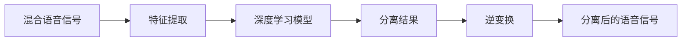

# 提高AI模型在复杂声学环境下的语音分离效果

> 关键词：AI模型、复杂声学环境、语音分离、深度学习、信号处理

> 摘要：本文围绕提高AI模型在复杂声学环境下的语音分离效果展开深入探讨。首先介绍了研究的背景、目的和预期读者等内容，接着阐述了语音分离相关的核心概念与联系，包括原理和架构的示意图及流程图。详细讲解了核心算法原理并给出Python源代码示例，同时介绍了相关的数学模型和公式。通过项目实战，给出代码实际案例及详细解释。分析了语音分离在实际中的应用场景，推荐了学习资源、开发工具框架以及相关论文著作。最后总结了未来发展趋势与挑战，并给出常见问题解答和扩展阅读参考资料，旨在为提高语音分离效果提供全面的技术指导。

## 1. 背景介绍 
### 1.1 目的和范围
在当今的信息时代，语音交互技术正变得越来越重要，广泛应用于智能客服、语音助手、会议记录等众多领域。然而，实际的声学环境往往非常复杂，存在着各种噪声、混响以及多说话人等干扰因素，这给语音分离带来了巨大的挑战。本研究的目的在于探索如何提高AI模型在复杂声学环境下的语音分离效果，通过对现有技术的深入分析和改进，提出有效的解决方案。

研究范围涵盖了多种常见的复杂声学环境，包括嘈杂的街道、多人会议室、充满混响的大厅等。涉及的AI模型包括深度学习中的卷积神经网络（CNN）、循环神经网络（RNN）及其变体如长短时记忆网络（LSTM）、门控循环单元（GRU）等，以及基于传统信号处理方法与深度学习相结合的混合模型。

### 1.2 预期读者
本文的预期读者主要包括从事语音处理、人工智能、信号处理等领域的研究人员和工程师，他们希望深入了解语音分离技术，掌握提高模型在复杂声学环境下性能的方法。同时，对于对语音交互技术感兴趣的学生和爱好者，本文也提供了一个系统的学习资源，帮助他们了解该领域的核心知识和最新进展。

### 1.3 文档结构概述
本文共分为十个部分。第一部分为背景介绍，阐述了研究的目的、范围、预期读者和文档结构。第二部分介绍语音分离的核心概念与联系，包括基本原理和架构的示意图及流程图。第三部分详细讲解核心算法原理，并使用Python源代码进行阐述。第四部分介绍相关的数学模型和公式，并举例说明。第五部分通过项目实战，给出代码实际案例和详细解释。第六部分分析语音分离在实际中的应用场景。第七部分推荐学习资源、开发工具框架以及相关论文著作。第八部分总结未来发展趋势与挑战。第九部分为附录，解答常见问题。第十部分提供扩展阅读和参考资料。

### 1.4 术语表
#### 1.4.1 核心术语定义
- **语音分离**：从混合的语音信号中分离出各个说话人的语音信号的过程。
- **复杂声学环境**：包含噪声、混响、多说话人等多种干扰因素的声学环境。
- **AI模型**：基于人工智能技术构建的模型，用于处理和分析数据，在语音分离中主要用于学习语音信号的特征和模式。
- **深度学习**：一种基于人工神经网络的机器学习方法，通过多层神经网络自动学习数据的特征和模式。
- **信号处理**：对信号进行采集、传输、变换、存储和恢复等操作的技术，在语音分离中用于对语音信号进行预处理和后处理。

#### 1.4.2 相关概念解释
- **噪声**：指在语音信号中存在的不需要的声音，如环境噪声、设备噪声等，会干扰语音信号的识别和分离。
- **混响**：声音在封闭空间中多次反射形成的现象，会使语音信号产生拖尾和模糊，增加语音分离的难度。
- **多说话人**：在同一声学环境中存在多个说话人同时说话的情况，语音信号相互重叠，需要进行分离以获取每个说话人的语音。

#### 1.4.3 缩略词列表
- **CNN**：Convolutional Neural Network，卷积神经网络
- **RNN**：Recurrent Neural Network，循环神经网络
- **LSTM**：Long Short-Term Memory，长短时记忆网络
- **GRU**：Gated Recurrent Unit，门控循环单元
- **STFT**：Short-Time Fourier Transform，短时傅里叶变换
- **ISTFT**：Inverse Short-Time Fourier Transform，逆短时傅里叶变换

## 2. 核心概念与联系 

### 语音分离的基本原理
语音分离的基本目标是从混合的语音信号中分离出各个说话人的语音信号。在复杂声学环境下，语音信号会受到噪声、混响和多说话人的干扰，使得分离任务变得更加困难。

一种常见的语音分离方法是基于深度学习的方法，通过训练一个神经网络模型来学习语音信号的特征和模式，从而实现语音分离。具体来说，首先将混合语音信号转换为特征表示，如频谱特征，然后将这些特征输入到神经网络中进行处理，网络输出每个说话人的语音信号的估计值，最后通过逆变换将估计的频谱特征转换回时域语音信号。

### 语音分离的架构示意图


### 详细解释
1. **特征提取**：将混合语音信号转换为适合神经网络处理的特征表示，常用的特征包括短时傅里叶变换（STFT）得到的频谱特征。
2. **深度学习模型**：可以是卷积神经网络（CNN）、循环神经网络（RNN）及其变体等，用于学习语音信号的特征和模式，从而实现语音分离。
3. **分离结果**：神经网络输出的每个说话人的语音信号的估计值，通常是频谱特征。
4. **逆变换**：将估计的频谱特征转换回时域语音信号，常用的逆变换是逆短时傅里叶变换（ISTFT）。

## 3. 核心算法原理 & 具体操作步骤 

### 基于深度学习的语音分离算法原理
基于深度学习的语音分离算法通常采用端到端的训练方式，即直接从混合语音信号到分离后的语音信号进行训练。下面以一个简单的基于卷积神经网络（CNN）的语音分离模型为例，详细讲解其原理和具体操作步骤。

#### 原理
卷积神经网络（CNN）具有强大的特征提取能力，通过卷积层、池化层和全连接层等结构，可以自动学习语音信号的特征和模式。在语音分离中，CNN的输入是混合语音信号的频谱特征，输出是每个说话人的语音信号的频谱特征估计值。

#### 具体操作步骤
1. **数据准备**：收集大量的混合语音信号和对应的分离后的语音信号作为训练数据。
2. **特征提取**：对混合语音信号进行短时傅里叶变换（STFT），得到频谱特征。
3. **模型构建**：构建一个卷积神经网络模型，包括卷积层、池化层和全连接层等。
4. **模型训练**：将频谱特征输入到模型中进行训练，使用损失函数（如均方误差损失函数）来衡量模型输出与真实分离结果之间的差异，通过反向传播算法更新模型的参数。
5. **模型评估**：使用测试数据对训练好的模型进行评估，计算评估指标（如信号干扰比、信号失真比等）来衡量模型的性能。
6. **语音分离**：将待分离的混合语音信号进行特征提取，输入到训练好的模型中，得到分离后的语音信号的频谱特征估计值，再通过逆短时傅里叶变换（ISTFT）将频谱特征转换回时域语音信号。

### Python源代码示例
```python
import numpy as np
import tensorflow as tf
from tensorflow.keras import layers, models

# 数据准备
# 假设已经有混合语音信号和对应的分离后的语音信号
# 这里简单生成一些随机数据作为示例
num_samples = 1000
input_shape = (256, 128, 1)  # 频谱特征的形状
output_shape = (256, 128, 1)
x_train = np.random.rand(num_samples, *input_shape)
y_train = np.random.rand(num_samples, *output_shape)

# 模型构建
def build_model():
    model = models.Sequential()
    model.add(layers.Conv2D(32, (3, 3), activation='relu', input_shape=input_shape))
    model.add(layers.MaxPooling2D((2, 2)))
    model.add(layers.Conv2D(64, (3, 3), activation='relu'))
    model.add(layers.MaxPooling2D((2, 2)))
    model.add(layers.Conv2D(64, (3, 3), activation='relu'))
    model.add(layers.Flatten())
    model.add(layers.Dense(64, activation='relu'))
    model.add(layers.Dense(np.prod(output_shape), activation='sigmoid'))
    model.add(layers.Reshape(output_shape))
    return model

model = build_model()

# 模型编译
model.compile(optimizer='adam', loss='mse')

# 模型训练
model.fit(x_train, y_train, epochs=10, batch_size=32)

# 语音分离示例
# 假设已经有一个待分离的混合语音信号
test_signal = np.random.rand(1, *input_shape)
separated_signal = model.predict(test_signal)

print("分离后的语音信号形状:", separated_signal.shape)
```

### 代码解释
1. **数据准备**：生成一些随机数据作为训练数据，实际应用中需要使用真实的混合语音信号和对应的分离后的语音信号。
2. **模型构建**：构建一个简单的卷积神经网络模型，包括卷积层、池化层和全连接层等。
3. **模型编译**：使用Adam优化器和均方误差损失函数编译模型。
4. **模型训练**：使用训练数据对模型进行训练，训练10个epoch，每个batch包含32个样本。
5. **语音分离**：使用训练好的模型对一个待分离的混合语音信号进行分离，得到分离后的语音信号的频谱特征估计值。

## 4. 数学模型和公式 & 详细讲解 & 举例说明 

### 短时傅里叶变换（STFT）
短时傅里叶变换（STFT）是一种常用的时频分析方法，用于将时域信号转换为频谱特征。其数学公式如下：

$$
X(m, k) = \sum_{n=0}^{N-1} x(n) w(n - mR) e^{-j2\pi kn/N}
$$

其中，$x(n)$ 是时域信号，$w(n)$ 是窗函数，$R$ 是帧移，$N$ 是窗长，$m$ 是帧索引，$k$ 是频率索引。

#### 详细讲解
STFT的基本思想是将时域信号分成若干个短的时间段，每个时间段内的信号可以近似看作是平稳的，然后对每个时间段内的信号进行傅里叶变换，得到该时间段内的频谱特征。通过不断移动窗函数，可以得到整个信号的时频表示。

#### 举例说明
假设我们有一个长度为 $N$ 的时域信号 $x(n)$，选择一个长度为 $L$ 的窗函数 $w(n)$，帧移为 $R$。首先，将窗函数 $w(n)$ 与信号 $x(n)$ 在第 $m$ 帧处相乘，得到加窗后的信号 $x(n) w(n - mR)$，然后对加窗后的信号进行 $N$ 点傅里叶变换，得到第 $m$ 帧的频谱特征 $X(m, k)$。

### 逆短时傅里叶变换（ISTFT）
逆短时傅里叶变换（ISTFT）是将频谱特征转换回时域信号的过程，其数学公式如下：

$$
x(n) = \frac{\sum_{m=0}^{M-1} w(n - mR) \sum_{k=0}^{N-1} X(m, k) e^{j2\pi kn/N}}{\sum_{m=0}^{M-1} w^2(n - mR)}
$$

其中，$M$ 是帧数。

#### 详细讲解
ISTFT的基本思想是将每个帧的频谱特征进行逆傅里叶变换，得到时域信号，然后将这些时域信号进行重叠相加，得到最终的时域信号。由于窗函数的存在，需要对重叠相加的结果进行归一化处理。

#### 举例说明
假设我们已经得到了一个信号的频谱特征 $X(m, k)$，首先对每个帧的频谱特征进行 $N$ 点逆傅里叶变换，得到时域信号 $x_m(n)$，然后将这些时域信号进行重叠相加，得到最终的时域信号 $x(n)$。

### 均方误差损失函数
均方误差损失函数是一种常用的损失函数，用于衡量模型输出与真实标签之间的差异，其数学公式如下：

$$
L = \frac{1}{N} \sum_{i=1}^{N} (y_i - \hat{y}_i)^2
$$

其中，$y_i$ 是真实标签，$\hat{y}_i$ 是模型输出，$N$ 是样本数量。

#### 详细讲解
均方误差损失函数的基本思想是计算模型输出与真实标签之间的误差的平方和，然后取平均值。通过最小化均方误差损失函数，可以使模型的输出尽可能接近真实标签。

#### 举例说明
假设我们有一个回归模型，输入是一些特征，输出是一个数值。我们有 $N$ 个样本，每个样本的真实标签为 $y_i$，模型输出为 $\hat{y}_i$。则均方误差损失函数为：

$$
L = \frac{1}{N} \sum_{i=1}^{N} (y_i - \hat{y}_i)^2
$$

通过不断调整模型的参数，使得均方误差损失函数 $L$ 最小化，从而提高模型的性能。

## 5. 项目实战：代码实际案例和详细解释说明 

### 5.1  开发环境搭建
#### 安装Python
首先需要安装Python，建议使用Python 3.7及以上版本。可以从Python官方网站（https://www.python.org/downloads/）下载并安装。

#### 安装必要的库
使用以下命令安装必要的库：
```sh
pip install numpy tensorflow librosa
```
- **numpy**：用于数值计算。
- **tensorflow**：用于构建和训练深度学习模型。
- **librosa**：用于音频处理，包括特征提取和逆变换等。

### 5.2  源代码详细实现和代码解读
```python
import numpy as np
import tensorflow as tf
from tensorflow.keras import layers, models
import librosa

# 数据加载和预处理
def load_audio(file_path):
    audio, sr = librosa.load(file_path, sr=16000)
    return audio, sr

def preprocess_audio(audio, sr):
    # 短时傅里叶变换
    stft = librosa.stft(audio, n_fft=512, hop_length=256)
    magnitude = np.abs(stft)
    phase = np.angle(stft)
    return magnitude, phase

# 模型构建
def build_model(input_shape):
    model = models.Sequential()
    model.add(layers.Conv2D(32, (3, 3), activation='relu', input_shape=input_shape))
    model.add(layers.MaxPooling2D((2, 2)))
    model.add(layers.Conv2D(64, (3, 3), activation='relu'))
    model.add(layers.MaxPooling2D((2, 2)))
    model.add(layers.Conv2D(64, (3, 3), activation='relu'))
    model.add(layers.Flatten())
    model.add(layers.Dense(64, activation='relu'))
    model.add(layers.Dense(np.prod(input_shape), activation='sigmoid'))
    model.add(layers.Reshape(input_shape))
    return model

# 语音分离
def separate_speech(model, magnitude, phase):
    input_data = np.expand_dims(magnitude.T, axis=0)
    input_data = np.expand_dims(input_data, axis=-1)
    separated_magnitude = model.predict(input_data)[0, :, :, 0].T
    complex_spec = separated_magnitude * np.exp(1j * phase)
    # 逆短时傅里叶变换
    separated_audio = librosa.istft(complex_spec, hop_length=256)
    return separated_audio

# 主函数
if __name__ == "__main__":
    # 加载混合语音信号
    audio, sr = load_audio("mixed_audio.wav")
    magnitude, phase = preprocess_audio(audio, sr)

    # 构建模型
    input_shape = (magnitude.shape[1], magnitude.shape[0], 1)
    model = build_model(input_shape)

    # 编译模型
    model.compile(optimizer='adam', loss='mse')

    # 这里简单假设已经有训练好的模型
    # 实际应用中需要进行模型训练
    # model.fit(...)

    # 语音分离
    separated_audio = separate_speech(model, magnitude, phase)

    # 保存分离后的语音信号
    librosa.output.write_wav("separated_audio.wav", separated_audio, sr)
    print("语音分离完成，分离后的语音信号已保存为 separated_audio.wav")
```

### 5.3  代码解读与分析
1. **数据加载和预处理**：
    - `load_audio` 函数：使用 `librosa.load` 函数加载音频文件，并将采样率设置为16000Hz。
    - `preprocess_audio` 函数：对音频信号进行短时傅里叶变换（STFT），得到频谱的幅度和相位。

2. **模型构建**：
    - `build_model` 函数：构建一个简单的卷积神经网络模型，包括卷积层、池化层和全连接层等。

3. **语音分离**：
    - `separate_speech` 函数：将频谱的幅度输入到模型中进行预测，得到分离后的频谱幅度，然后结合原始的相位信息，通过逆短时傅里叶变换（ISTFT）得到分离后的语音信号。

4. **主函数**：
    - 加载混合语音信号并进行预处理。
    - 构建和编译模型。
    - 进行语音分离，并将分离后的语音信号保存为WAV文件。

## 6. 实际应用场景 
### 智能客服
在智能客服系统中，客户的语音可能会受到背景噪声的干扰，如办公室的嘈杂声、街道的交通噪声等。通过提高AI模型在复杂声学环境下的语音分离效果，可以更准确地识别客户的语音内容，提高客服系统的服务质量和效率。

### 语音助手
语音助手在各种环境中都需要准确地识别用户的语音指令，如在嘈杂的商场、餐厅等环境中。良好的语音分离能力可以帮助语音助手更好地过滤掉背景噪声，准确地识别用户的语音，提供更准确的服务。

### 会议记录
在会议场景中，可能存在多个说话人同时说话的情况，以及会议室的混响等干扰因素。通过语音分离技术，可以将每个说话人的语音信号分离出来，方便进行会议记录和后续的分析。

### 智能家居
在智能家居系统中，用户可以通过语音指令控制各种设备。但家庭环境中也可能存在各种噪声，如电视声、洗衣机声等。提高语音分离效果可以使智能家居系统更准确地识别用户的语音指令，提高用户体验。

## 7. 工具和资源推荐
### 7.1 学习资源推荐
#### 7.1.1 书籍推荐
- 《深度学习》（Deep Learning）：由Ian Goodfellow、Yoshua Bengio和Aaron Courville所著，是深度学习领域的经典教材，涵盖了神经网络、卷积神经网络、循环神经网络等方面的知识。
- 《语音信号处理》（Speech Signal Processing）：介绍了语音信号处理的基本理论和方法，包括语音特征提取、语音识别、语音合成等方面的内容。

#### 7.1.2 在线课程
- Coursera上的“深度学习专项课程”（Deep Learning Specialization）：由Andrew Ng教授授课，系统地介绍了深度学习的基础知识和应用。
- edX上的“语音处理基础”（Fundamentals of Speech Processing）：提供了语音处理的基本概念和技术的学习。

#### 7.1.3 技术博客和网站
- Medium上的“Towards Data Science”：有许多关于深度学习和语音处理的文章，涵盖了最新的研究成果和实践经验。
- arXiv.org：是一个预印本数据库，包含了大量的学术论文，特别是关于人工智能和语音处理的最新研究。

### 7.2 开发工具框架推荐
#### 7.2.1 IDE和编辑器
- PyCharm：是一款专业的Python集成开发环境，提供了丰富的功能，如代码编辑、调试、版本控制等。
- Jupyter Notebook：是一个交互式的开发环境，适合进行数据探索和模型开发，支持Python、R等多种编程语言。

#### 7.2.2 调试和性能分析工具
- TensorBoard：是TensorFlow提供的可视化工具，可以用于监控模型的训练过程、查看模型的结构和性能指标等。
- PyTorch Profiler：是PyTorch提供的性能分析工具，可以帮助开发者找出代码中的性能瓶颈。

#### 7.2.3 相关框架和库
- TensorFlow：是一个开源的深度学习框架，提供了丰富的工具和库，用于构建和训练各种深度学习模型。
- PyTorch：是另一个流行的深度学习框架，具有动态图的特点，易于使用和调试。
- librosa：是一个用于音频处理的Python库，提供了丰富的音频处理函数，如特征提取、音频加载和保存等。

### 7.3 相关论文著作推荐
#### 7.3.1 经典论文
- “Deep Clustering: Discriminative Embeddings for Segregating Speech”：提出了一种基于深度学习的语音分离方法，通过学习语音信号的判别性嵌入来实现语音分离。
- “Conv-TasNet: Surpassing Ideal Time-Frequency Magnitude Masking for Speech Separation”：提出了一种基于卷积神经网络的语音分离模型，在语音分离任务上取得了很好的效果。

#### 7.3.2 最新研究成果
可以通过arXiv.org等预印本数据库关注最新的研究成果，特别是关于提高语音分离在复杂声学环境下性能的研究。

#### 7.3.3 应用案例分析
可以参考一些实际应用案例的研究论文，了解语音分离技术在不同领域的应用和挑战。

## 8. 总结：未来发展趋势与挑战
### 未来发展趋势
- **多模态融合**：将语音信号与其他模态的信息（如视觉、文本等）进行融合，以提高语音分离的效果。例如，在视频会议场景中，可以结合说话人的面部表情和口型信息来辅助语音分离。
- **无监督学习**：目前的语音分离方法大多依赖于大量的标注数据，未来可以探索无监督学习方法，减少对标注数据的依赖，提高模型的泛化能力。
- **端到端系统**：构建更加高效的端到端语音分离系统，减少中间环节的处理，提高系统的实时性和性能。

### 挑战
- **复杂环境适应性**：尽管目前的方法在一定程度上可以处理复杂声学环境，但对于极端复杂的环境（如强噪声、高混响等），语音分离的效果仍然有待提高。
- **计算资源需求**：深度学习模型通常需要大量的计算资源进行训练和推理，如何在有限的计算资源下提高模型的性能是一个挑战。
- **多说话人场景**：在多说话人场景中，语音信号的相互干扰更加严重，如何准确地分离出每个说话人的语音信号仍然是一个难题。

## 9. 附录：常见问题与解答
### 1. 为什么语音分离在复杂声学环境下这么困难？
在复杂声学环境下，语音信号会受到噪声、混响和多说话人的干扰，这些干扰因素会使语音信号的特征变得复杂，增加了模型学习和分离的难度。例如，噪声会掩盖语音信号的特征，混响会使语音信号产生拖尾和模糊，多说话人会使语音信号相互重叠。

### 2. 如何评估语音分离模型的性能？
常用的评估指标包括信号干扰比（SIR）、信号失真比（SDR）、信号伪像比（SAR）等。这些指标可以衡量分离后的语音信号与真实语音信号之间的差异，评估模型的分离效果。

### 3. 如何选择合适的深度学习模型进行语音分离？
选择合适的深度学习模型需要考虑多个因素，如模型的复杂度、性能、计算资源需求等。对于简单的语音分离任务，可以选择一些轻量级的模型，如卷积神经网络（CNN）；对于复杂的任务，可以选择一些更强大的模型，如循环神经网络（RNN）及其变体。

### 4. 如何处理数据不足的问题？
可以采用数据增强的方法来增加训练数据的数量，如添加噪声、混响等。还可以使用迁移学习的方法，利用在其他相关任务上预训练好的模型，在自己的数据集上进行微调。

## 10. 扩展阅读 & 参考资料
### 扩展阅读
- 阅读更多关于深度学习和语音处理的书籍和论文，深入了解相关的理论和方法。
- 参与相关的学术会议和论坛，了解最新的研究动态和实践经验。

### 参考资料
- Goodfellow, I., Bengio, Y., & Courville, A. (2016). Deep Learning. MIT Press.
- Rabiner, L. R., & Juang, B. H. (1993). Fundamentals of Speech Recognition. Prentice Hall.
- Hershey, J. R., Chen, Z., Le Roux, J., & Watanabe, S. (2016). Deep clustering: Discriminative embeddings for segregating speech. In Acoustics, Speech and Signal Processing (ICASSP), 2016 IEEE International Conference on (pp. 31-35). IEEE.
- Luo, Y., & Mesgarani, N. (2018). Conv-TasNet: Surpassing ideal time-frequency magnitude masking for speech separation. IEEE/ACM Transactions on Audio, Speech, and Language Processing, 26(10), 1705-1718.

作者：AI天才研究院/AI Genius Institute & 禅与计算机程序设计艺术 /Zen And The Art of Computer Programming