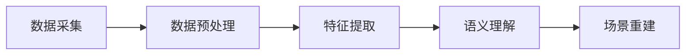

# 提高AI模型在复杂环境下的3D场景理解能力

> 关键词：AI模型、复杂环境、3D场景理解、深度学习、传感器融合

> 摘要：本文旨在探讨如何提高AI模型在复杂环境下的3D场景理解能力。随着人工智能和计算机视觉技术的发展，3D场景理解在自动驾驶、机器人导航、增强现实等领域具有重要应用。然而，复杂环境中的光照变化、遮挡、物体多样性等因素给3D场景理解带来了巨大挑战。文章首先介绍了相关背景知识，包括目的和范围、预期读者等；接着阐述了核心概念与联系，分析了核心算法原理并给出Python代码示例；详细讲解了数学模型和公式，并通过实际案例进行说明；然后进行项目实战，展示代码实现和解读；探讨了实际应用场景；推荐了学习资源、开发工具和相关论文著作；最后总结了未来发展趋势与挑战，并提供了常见问题解答和扩展阅读参考资料。

## 1. 背景介绍 
### 1.1 目的和范围
在当今科技飞速发展的时代，3D场景理解已经成为人工智能领域的一个关键研究方向。提高AI模型在复杂环境下的3D场景理解能力具有重要的现实意义。其目的在于让AI模型能够更准确、更全面地感知和理解复杂3D场景中的物体、结构和语义信息，从而为自动驾驶、智能机器人、虚拟现实等领域提供更可靠的技术支持。

本文的范围主要涵盖了复杂环境下3D场景理解的相关理论、算法、实践应用以及未来发展趋势等方面。将详细介绍如何利用深度学习等技术来提升AI模型的3D场景理解能力，同时探讨传感器融合等方法在处理复杂环境信息时的作用。

### 1.2 预期读者
本文预期读者包括计算机科学、人工智能、机器人技术等相关领域的研究人员、工程师和学生。对于希望深入了解3D场景理解技术，提升AI模型性能的专业人士，本文将提供系统的知识和实践指导。同时，对于对新兴技术感兴趣的爱好者，也可以通过本文初步了解复杂环境下3D场景理解的基本概念和方法。

### 1.3 文档结构概述
本文将按照以下结构进行阐述：首先介绍背景知识，让读者了解研究的目的和范围；接着详细讲解核心概念与联系，包括3D场景理解的基本原理和架构；然后分析核心算法原理，并给出Python代码示例，帮助读者理解算法的具体实现；介绍相关的数学模型和公式，并通过实例进行说明；进行项目实战，展示代码的实际应用和详细解读；探讨3D场景理解在不同领域的实际应用场景；推荐学习资源、开发工具和相关论文著作，为读者提供进一步学习的途径；最后总结未来发展趋势与挑战，并提供常见问题解答和扩展阅读参考资料。

### 1.4 术语表
#### 1.4.1 核心术语定义
- **AI模型**：人工智能模型是一种基于机器学习或深度学习算法构建的程序，能够从数据中学习模式和规律，并用于预测、分类等任务。在3D场景理解中，AI模型用于处理和分析3D数据，以实现对场景的理解。
- **3D场景理解**：指AI模型对三维空间中的场景进行感知、分析和解释的能力，包括识别物体、理解物体之间的关系、推断场景的语义信息等。
- **复杂环境**：指包含多种干扰因素的场景，如光照变化、遮挡、物体多样性等，这些因素会增加3D场景理解的难度。
- **传感器融合**：将来自不同传感器（如激光雷达、摄像头等）的数据进行整合和处理，以获取更全面、准确的场景信息。

#### 1.4.2 相关概念解释
- **深度学习**：是一种基于人工神经网络的机器学习方法，通过构建多层神经网络来自动学习数据的特征和模式。在3D场景理解中，深度学习模型（如卷积神经网络、循环神经网络等）被广泛应用。
- **点云数据**：由大量的三维点组成，每个点包含其在三维空间中的坐标信息，有时还包含颜色、强度等属性。点云数据是3D场景理解中常用的一种数据表示形式。
- **语义分割**：将图像或3D场景中的每个像素或点分配到不同的语义类别中，例如将场景中的物体分为人、车、树等不同类别。

#### 1.4.3 缩略词列表
- **CNN**：Convolutional Neural Network，卷积神经网络
- **RNN**：Recurrent Neural Network，循环神经网络
- **LiDAR**：Light Detection and Ranging，激光雷达
- **RGB**：Red, Green, Blue，红绿蓝，代表彩色图像的三个颜色通道

## 2. 核心概念与联系 
### 核心概念原理
在复杂环境下的3D场景理解中，主要涉及到以下几个核心概念。

首先是数据采集，通过各种传感器（如激光雷达、摄像头等）获取3D场景的原始数据。激光雷达可以直接测量物体到传感器的距离，生成点云数据，而摄像头则可以获取场景的彩色图像。这些数据包含了场景的几何信息和外观信息，但由于复杂环境的影响，数据往往存在噪声、遮挡等问题。

然后是特征提取，从采集到的原始数据中提取具有代表性的特征。在深度学习中，通常使用卷积神经网络（CNN）来提取图像或点云数据的特征。CNN通过卷积层、池化层等操作，自动学习数据中的局部特征和全局特征。对于点云数据，还可以使用一些专门的点云处理网络（如PointNet、PointNet++等）来提取特征。

接着是语义理解，将提取到的特征映射到不同的语义类别中，实现对场景中物体的识别和分类。这可以通过分类器（如全连接层）来完成。同时，还需要考虑物体之间的关系和场景的上下文信息，以提高语义理解的准确性。

最后是场景重建，根据语义理解的结果，重建出完整的3D场景。这可以帮助我们更好地理解场景的结构和布局。

### 架构的文本示意图
```plaintext
+----------------+
|  数据采集       |
|  (激光雷达、摄像头) |
+----------------+
        |
        v
+----------------+
|  数据预处理     |
|  (去噪、归一化等) |
+----------------+
        |
        v
+----------------+
|  特征提取       |
|  (CNN、PointNet等) |
+----------------+
        |
        v
+----------------+
|  语义理解       |
|  (分类、关系推理) |
+----------------+
        |
        v
+----------------+
|  场景重建       |
|  (构建3D模型)   |
+----------------+
```

### Mermaid流程图


## 3. 核心算法原理 & 具体操作步骤 
### 核心算法原理
在提高AI模型在复杂环境下的3D场景理解能力方面，深度学习算法起着关键作用。下面以PointNet为例，介绍其核心算法原理。

PointNet是一种专门用于处理点云数据的深度学习网络。它的主要思想是直接对无序的点云数据进行处理，通过多层感知机（MLP）提取每个点的特征，然后使用对称函数（如最大池化）将所有点的特征聚合为全局特征。

具体来说，PointNet的输入是一个包含 $N$ 个点的点云数据，每个点有 $D$ 个特征（通常 $D = 3$，表示点的三维坐标）。网络首先通过一系列的MLP层对每个点的特征进行变换，得到更高维的特征表示。然后，使用最大池化操作将所有点的特征聚合为一个全局特征向量。最后，将全局特征向量输入到分类器或回归器中，完成相应的任务（如分类、分割等）。

### Python源代码详细阐述
```python
import torch
import torch.nn as nn

class PointNet(nn.Module):
    def __init__(self, num_classes):
        super(PointNet, self).__init__()
        # 第一层MLP
        self.mlp1 = nn.Sequential(
            nn.Conv1d(3, 64, 1),
            nn.BatchNorm1d(64),
            nn.ReLU()
        )
        # 第二层MLP
        self.mlp2 = nn.Sequential(
            nn.Conv1d(64, 128, 1),
            nn.BatchNorm1d(128),
            nn.ReLU()
        )
        # 第三层MLP
        self.mlp3 = nn.Sequential(
            nn.Conv1d(128, 1024, 1),
            nn.BatchNorm1d(1024),
            nn.ReLU()
        )
        # 分类器
        self.classifier = nn.Sequential(
            nn.Linear(1024, 512),
            nn.BatchNorm1d(512),
            nn.ReLU(),
            nn.Linear(512, 256),
            nn.BatchNorm1d(256),
            nn.ReLU(),
            nn.Dropout(p=0.3),
            nn.Linear(256, num_classes)
        )

    def forward(self, x):
        # 输入x的形状为 (batch_size, 3, num_points)
        x = self.mlp1(x)
        x = self.mlp2(x)
        x = self.mlp3(x)
        # 最大池化操作
        x = torch.max(x, dim=2, keepdim=False)[0]
        # 分类
        x = self.classifier(x)
        return x

# 示例使用
num_classes = 10
model = PointNet(num_classes)
input_data = torch.randn(16, 3, 1024)  # 输入数据，batch_size=16，每个点有3个特征，共1024个点
output = model(input_data)
print(output.shape)  # 输出形状为 (16, num_classes)
```

### 具体操作步骤
1. **数据准备**：收集或生成点云数据，并将其划分为训练集、验证集和测试集。对数据进行预处理，如去噪、归一化等。
2. **模型定义**：使用上述代码定义PointNet模型，根据具体任务设置分类的类别数。
3. **模型训练**：选择合适的损失函数（如交叉熵损失）和优化器（如Adam优化器），对模型进行训练。在训练过程中，不断调整模型的参数，以最小化损失函数。
4. **模型评估**：使用验证集和测试集对训练好的模型进行评估，计算准确率、召回率等指标，评估模型的性能。
5. **模型应用**：将训练好的模型应用到实际的3D场景理解任务中，对新的点云数据进行分类或分割。

## 4. 数学模型和公式 & 详细讲解 & 举例说明 
### 数学模型和公式
#### 多层感知机（MLP）
在PointNet中，多层感知机（MLP）用于对每个点的特征进行变换。MLP可以表示为一系列的线性变换和非线性激活函数的组合。

假设输入特征向量为 $\mathbf{x} \in \mathbb{R}^D$，MLP的第 $l$ 层的输出可以表示为：

$$\mathbf{h}^{(l)} = f(\mathbf{W}^{(l)} \mathbf{h}^{(l-1)} + \mathbf{b}^{(l)})$$

其中，$\mathbf{W}^{(l)} \in \mathbb{R}^{D^{(l)} \times D^{(l-1)}}$ 是第 $l$ 层的权重矩阵，$\mathbf{b}^{(l)} \in \mathbb{R}^{D^{(l)}}$ 是第 $l$ 层的偏置向量，$f$ 是非线性激活函数（如ReLU函数），$\mathbf{h}^{(0)} = \mathbf{x}$。

#### 最大池化操作
最大池化操作用于将所有点的特征聚合为全局特征。假设输入特征矩阵为 $\mathbf{X} \in \mathbb{R}^{D \times N}$，其中 $D$ 是特征维度，$N$ 是点的数量。最大池化操作可以表示为：

$$\mathbf{g} = \max_{i=1}^{N} \mathbf{X}_{:,i}$$

其中，$\mathbf{g} \in \mathbb{R}^D$ 是全局特征向量，$\mathbf{X}_{:,i}$ 表示 $\mathbf{X}$ 的第 $i$ 列。

#### 交叉熵损失函数
在分类任务中，常用交叉熵损失函数来衡量模型的预测结果与真实标签之间的差异。假设模型的预测概率分布为 $\mathbf{p} = [p_1, p_2, \cdots, p_C]$，真实标签的概率分布为 $\mathbf{y} = [y_1, y_2, \cdots, y_C]$，其中 $C$ 是分类的类别数。交叉熵损失函数可以表示为：

$$L = - \sum_{i=1}^{C} y_i \log(p_i)$$

### 详细讲解
#### MLP的作用
MLP通过多层的线性变换和非线性激活函数，可以学习到输入特征的复杂表示。在PointNet中，MLP用于对每个点的特征进行变换，将低维的点特征映射到高维的特征空间，从而更好地捕捉点的局部信息。

#### 最大池化操作的意义
最大池化操作是一种对称函数，它对输入点的顺序不敏感，因此可以处理无序的点云数据。通过最大池化操作，可以将所有点的特征聚合为一个全局特征向量，该向量包含了整个点云的全局信息。

#### 交叉熵损失函数的用途
交叉熵损失函数衡量了模型的预测结果与真实标签之间的差异。在训练过程中，我们的目标是最小化交叉熵损失函数，使得模型的预测结果尽可能接近真实标签。

### 举例说明
假设我们有一个包含3个点的点云数据，每个点有2个特征，即输入特征矩阵为：

$$\mathbf{X} = \begin{bmatrix}
1 & 2 \\
3 & 4 \\
5 & 6
\end{bmatrix}$$

首先，使用MLP对每个点的特征进行变换。假设MLP的第一层权重矩阵为：

$$\mathbf{W}^{(1)} = \begin{bmatrix}
1 & 2 \\
3 & 4
\end{bmatrix}$$

偏置向量为 $\mathbf{b}^{(1)} = [1, 1]^T$，激活函数为ReLU函数。则第一层的输出为：

$$\mathbf{h}^{(1)} = \text{ReLU}(\mathbf{W}^{(1)} \mathbf{X} + \mathbf{b}^{(1)}) = \text{ReLU} \left( \begin{bmatrix}
1 & 2 \\
3 & 4
\end{bmatrix} \begin{bmatrix}
1 & 2 \\
3 & 4 \\
5 & 6
\end{bmatrix} + \begin{bmatrix}
1 \\
1
\end{bmatrix} \right) = \text{ReLU} \left( \begin{bmatrix}
7 & 10 \\
15 & 22
\end{bmatrix} \right) = \begin{bmatrix}
7 & 10 \\
15 & 22
\end{bmatrix}$$

然后，使用最大池化操作将所有点的特征聚合为全局特征向量：

$$\mathbf{g} = \max_{i=1}^{3} \mathbf{h}^{(1)}_{:,i} = [15, 22]^T$$

假设我们的分类任务有2个类别，真实标签为 $\mathbf{y} = [1, 0]$，模型的预测概率分布为 $\mathbf{p} = [0.8, 0.2]$。则交叉熵损失为：

$$L = - (1 \times \log(0.8) + 0 \times \log(0.2)) \approx 0.223$$

## 5. 项目实战：代码实际案例和详细解释说明 
### 5.1  开发环境搭建
#### 安装Python和相关库
首先，确保你已经安装了Python 3.x版本。然后，使用pip或conda安装以下必要的库：
- PyTorch：用于构建和训练深度学习模型。可以根据自己的系统和CUDA版本选择合适的安装方式，具体安装方法可以参考PyTorch官方网站。
- NumPy：用于处理数值计算和数组操作。
- Matplotlib：用于可视化数据和结果。

以下是使用pip安装这些库的示例命令：
```bash
pip install torch numpy matplotlib
```

#### 准备数据集
可以使用公开的3D点云数据集，如ModelNet40。下载数据集后，将其解压到指定的目录。数据集通常包含训练集和测试集，每个样本是一个点云文件。

### 5.2  源代码详细实现和代码解读
```python
import torch
import torch.nn as nn
import torch.optim as optim
from torch.utils.data import Dataset, DataLoader
import numpy as np
import os

# 定义数据集类
class PointCloudDataset(Dataset):
    def __init__(self, data_dir, split='train'):
        self.data_dir = data_dir
        self.split = split
        self.classes = sorted(os.listdir(data_dir))
        self.data = []
        for i, cls in enumerate(self.classes):
            cls_dir = os.path.join(data_dir, cls, split)
            for file in os.listdir(cls_dir):
                file_path = os.path.join(cls_dir, file)
                point_cloud = np.loadtxt(file_path, delimiter=',')
                self.data.append((point_cloud, i))

    def __len__(self):
        return len(self.data)

    def __getitem__(self, idx):
        point_cloud, label = self.data[idx]
        point_cloud = torch.tensor(point_cloud, dtype=torch.float32).transpose(0, 1)
        label = torch.tensor(label, dtype=torch.long)
        return point_cloud, label

# 定义PointNet模型
class PointNet(nn.Module):
    def __init__(self, num_classes):
        super(PointNet, self).__init__()
        self.mlp1 = nn.Sequential(
            nn.Conv1d(3, 64, 1),
            nn.BatchNorm1d(64),
            nn.ReLU()
        )
        self.mlp2 = nn.Sequential(
            nn.Conv1d(64, 128, 1),
            nn.BatchNorm1d(128),
            nn.ReLU()
        )
        self.mlp3 = nn.Sequential(
            nn.Conv1d(128, 1024, 1),
            nn.BatchNorm1d(1024),
            nn.ReLU()
        )
        self.classifier = nn.Sequential(
            nn.Linear(1024, 512),
            nn.BatchNorm1d(512),
            nn.ReLU(),
            nn.Linear(512, 256),
            nn.BatchNorm1d(256),
            nn.ReLU(),
            nn.Dropout(p=0.3),
            nn.Linear(256, num_classes)
        )

    def forward(self, x):
        x = self.mlp1(x)
        x = self.mlp2(x)
        x = self.mlp3(x)
        x = torch.max(x, dim=2, keepdim=False)[0]
        x = self.classifier(x)
        return x

# 训练模型
def train_model(model, train_loader, criterion, optimizer, device):
    model.train()
    running_loss = 0.0
    for i, (inputs, labels) in enumerate(train_loader):
        inputs, labels = inputs.to(device), labels.to(device)
        optimizer.zero_grad()
        outputs = model(inputs)
        loss = criterion(outputs, labels)
        loss.backward()
        optimizer.step()
        running_loss += loss.item()
    return running_loss / len(train_loader)

# 测试模型
def test_model(model, test_loader, device):
    model.eval()
    correct = 0
    total = 0
    with torch.no_grad():
        for inputs, labels in test_loader:
            inputs, labels = inputs.to(device), labels.to(device)
            outputs = model(inputs)
            _, predicted = torch.max(outputs.data, 1)
            total += labels.size(0)
            correct += (predicted == labels).sum().item()
    return correct / total

# 主函数
def main():
    data_dir = 'path/to/your/dataset'  # 数据集路径
    num_classes = 40  # 分类的类别数
    batch_size = 32
    num_epochs = 10
    learning_rate = 0.001

    device = torch.device("cuda" if torch.cuda.is_available() else "cpu")

    # 创建数据集和数据加载器
    train_dataset = PointCloudDataset(data_dir, split='train')
    test_dataset = PointCloudDataset(data_dir, split='test')
    train_loader = DataLoader(train_dataset, batch_size=batch_size, shuffle=True)
    test_loader = DataLoader(test_dataset, batch_size=batch_size, shuffle=False)

    # 创建模型、损失函数和优化器
    model = PointNet(num_classes).to(device)
    criterion = nn.CrossEntropyLoss()
    optimizer = optim.Adam(model.parameters(), lr=learning_rate)

    # 训练模型
    for epoch in range(num_epochs):
        train_loss = train_model(model, train_loader, criterion, optimizer, device)
        test_acc = test_model(model, test_loader, device)
        print(f'Epoch {epoch+1}/{num_epochs}, Train Loss: {train_loss:.4f}, Test Acc: {test_acc:.4f}')

if __name__ == '__main__':
    main()
```

### 5.3  代码解读与分析
#### 数据集类 `PointCloudDataset`
该类继承自 `torch.utils.data.Dataset`，用于加载和处理3D点云数据集。在初始化时，它会遍历数据集目录，读取每个点云文件，并将其与对应的类别标签存储在 `self.data` 中。`__getitem__` 方法用于获取指定索引的点云数据和标签，并将其转换为PyTorch张量。

#### PointNet模型
与前面介绍的PointNet模型基本相同，通过多层MLP和最大池化操作对输入的点云数据进行处理，最后通过分类器输出分类结果。

#### 训练函数 `train_model`
该函数用于训练模型。在每个训练步骤中，首先将输入数据和标签移动到指定的设备（GPU或CPU）上，然后将梯度清零，前向传播计算输出，计算损失，反向传播更新模型参数。最后返回平均训练损失。

#### 测试函数 `test_model`
该函数用于测试模型。在测试过程中，不计算梯度，通过比较模型的预测结果和真实标签，计算分类准确率。

#### 主函数 `main`
在主函数中，首先设置数据集路径、分类类别数、批量大小、训练轮数和学习率等参数。然后创建数据集和数据加载器，初始化模型、损失函数和优化器。最后进行模型训练，并在每个训练轮次结束后输出训练损失和测试准确率。

## 6. 实际应用场景 
### 自动驾驶
在自动驾驶领域，AI模型的3D场景理解能力至关重要。通过激光雷达和摄像头等传感器获取车辆周围的3D场景信息，AI模型可以识别道路、交通标志、其他车辆和行人等物体，理解它们的位置、速度和运动方向，从而为自动驾驶决策提供依据。例如，在复杂的城市环境中，模型需要准确识别交通信号灯的状态，判断其他车辆的行驶意图，以确保自动驾驶车辆的安全行驶。

### 智能机器人
智能机器人在执行任务时需要对周围的3D场景进行理解。例如，在仓库物流场景中，机器人需要识别货架上的货物，规划最优的取货路径；在家庭服务场景中，机器人需要识别家具、电器等物体，避免碰撞并完成清洁、送餐等任务。通过提高AI模型在复杂环境下的3D场景理解能力，机器人可以更加智能地适应不同的工作环境。

### 增强现实（AR）和虚拟现实（VR）
在AR和VR应用中，3D场景理解可以提供更加真实和沉浸式的体验。通过对现实场景的3D建模和理解，AR设备可以将虚拟物体准确地叠加到现实场景中，与真实物体进行交互；VR设备可以根据用户的位置和动作，实时更新虚拟场景，提供更加逼真的视觉效果。例如，在AR游戏中，模型可以识别玩家周围的环境，将游戏中的角色和道具合理地放置在现实场景中。

### 工业检测
在工业生产中，3D场景理解可以用于产品质量检测和缺陷分析。通过对产品的3D模型进行扫描和分析，AI模型可以检测出产品表面的瑕疵、尺寸偏差等问题，提高生产效率和产品质量。例如，在汽车制造行业，模型可以检测汽车零部件的装配是否正确，是否存在划痕、裂纹等缺陷。

## 7. 工具和资源推荐
### 7.1 学习资源推荐
#### 7.1.1 书籍推荐
- 《深度学习》（Deep Learning）：由Ian Goodfellow、Yoshua Bengio和Aaron Courville撰写，是深度学习领域的经典教材，涵盖了深度学习的基本原理、算法和应用。
- 《计算机视觉：算法与应用》（Computer Vision: Algorithms and Applications）：介绍了计算机视觉的各种算法和应用，包括3D场景理解、目标检测、图像分割等。
- 《点云数据处理与分析》（Processing and Analysis of Point Cloud Data）：专门针对点云数据的处理和分析进行了详细介绍，适合深入学习3D场景理解的读者。

#### 7.1.2 在线课程
- Coursera上的“深度学习专项课程”（Deep Learning Specialization）：由Andrew Ng教授授课，系统地介绍了深度学习的各个方面，包括卷积神经网络、循环神经网络等。
- edX上的“计算机视觉基础”（Foundations of Computer Vision）：讲解了计算机视觉的基本概念和算法，对3D场景理解有一定的涉及。
- Udemy上的“3D计算机视觉实战”（3D Computer Vision in Practice）：通过实际项目，帮助学员掌握3D计算机视觉的技术和应用。

#### 7.1.3 技术博客和网站
- Medium：有许多关于人工智能和计算机视觉的技术博客，如Towards Data Science，其中包含了大量的3D场景理解相关的文章和教程。
- arXiv：是一个预印本平台，提供了最新的学术研究成果，搜索“3D scene understanding”可以找到很多相关的论文。
- GitHub：可以找到许多开源的3D场景理解项目和代码，学习他人的实现和经验。

### 7.2 开发工具框架推荐
#### 7.2.1 IDE和编辑器
- PyCharm：是一款专门为Python开发设计的集成开发环境，具有强大的代码编辑、调试和项目管理功能。
- Jupyter Notebook：是一个交互式的开发环境，适合进行数据分析、模型训练和实验验证。可以方便地将代码、文本和可视化结果整合在一起。
- Visual Studio Code：是一款轻量级的代码编辑器，支持多种编程语言和插件扩展，可用于快速开发和调试Python代码。

#### 7.2.2 调试和性能分析工具
- PyTorch Profiler：是PyTorch自带的性能分析工具，可以帮助用户分析模型的训练时间、内存使用等情况，找出性能瓶颈。
- TensorBoard：是TensorFlow的可视化工具，也可以与PyTorch集成，用于可视化模型的训练过程、损失曲线、准确率等指标。
- NVIDIA Nsight Systems：是NVIDIA提供的性能分析工具，可用于分析GPU的使用情况和性能瓶颈，优化深度学习模型的性能。

#### 7.2.3 相关框架和库
- PyTorch：是一个开源的深度学习框架，提供了丰富的神经网络层和优化算法，支持GPU加速，方便用户构建和训练3D场景理解模型。
- Open3D：是一个开源的3D数据处理库，提供了点云处理、3D重建、可视化等功能，可用于3D场景理解的前期数据处理和后期结果展示。
- Scikit-learn：是一个常用的机器学习库，提供了多种分类、回归和聚类算法，可用于3D场景理解中的特征选择和模型评估。

### 7.3 相关论文著作推荐
#### 7.3.1 经典论文
- “PointNet: Deep Learning on Point Sets for 3D Classification and Segmentation”：提出了PointNet模型，开创了直接处理点云数据的深度学习方法。
- “PointNet++: Deep Hierarchical Feature Learning on Point Sets in a Metric Space”：在PointNet的基础上进行了改进，提出了PointNet++模型，通过分层特征学习提高了点云处理的性能。
- “Mask R-CNN”：虽然主要用于2D图像的目标检测和分割，但其中的一些思想和方法可以扩展到3D场景理解中。

#### 7.3.2 最新研究成果
- 在arXiv和各大计算机视觉会议（如CVPR、ICCV、ECCV等）上可以找到最新的3D场景理解研究成果。例如，一些研究致力于提高模型在复杂环境下的鲁棒性，采用多传感器融合、对抗训练等方法。

#### 7.3.3 应用案例分析
- 可以参考一些实际应用领域的论文和报告，了解3D场景理解在自动驾驶、机器人等领域的具体应用案例和效果评估。例如，一些自动驾驶公司会发表关于其3D感知系统的技术报告和实验结果。

## 8. 总结：未来发展趋势与挑战
### 未来发展趋势
#### 多传感器融合
未来的3D场景理解将更加注重多传感器融合技术。单一传感器往往存在局限性，如激光雷达在恶劣天气下性能下降，摄像头对光照变化敏感。通过融合激光雷达、摄像头、毫米波雷达等多种传感器的数据，可以获取更全面、准确的场景信息，提高模型在复杂环境下的理解能力。

#### 端到端学习
目前的3D场景理解模型通常是分阶段进行处理的，如先进行特征提取，再进行分类或分割。未来的发展趋势是采用端到端的学习方法，直接从原始传感器数据学习到最终的场景理解结果，减少中间环节的误差积累，提高模型的整体性能。

#### 强化学习与场景理解的结合
强化学习可以用于在复杂环境中进行决策和规划。将强化学习与3D场景理解相结合，可以使AI模型不仅能够理解场景，还能根据场景信息做出智能决策，如自动驾驶车辆的路径规划、机器人的任务执行等。

#### 可解释性和可靠性
随着AI模型在关键领域的应用越来越广泛，模型的可解释性和可靠性变得尤为重要。未来的研究将致力于开发可解释的3D场景理解模型，让人们能够理解模型的决策过程和依据，同时提高模型的可靠性和鲁棒性，减少误判和故障。

### 挑战
#### 数据获取和标注
复杂环境下的3D场景数据获取和标注是一个巨大的挑战。采集高质量的3D数据需要专业的设备和环境，而且数据标注需要耗费大量的人力和时间。此外，由于复杂环境的多样性，数据的覆盖范围和代表性也难以保证。

#### 计算资源需求
深度学习模型在处理3D场景数据时通常需要大量的计算资源，尤其是在训练阶段。随着模型复杂度的增加，计算资源的需求也会不断上升。如何在有限的计算资源下提高模型的训练效率和性能是一个亟待解决的问题。

#### 复杂环境的适应性
复杂环境中的光照变化、遮挡、物体多样性等因素会给3D场景理解带来很大的挑战。模型需要具备更强的鲁棒性和适应性，能够在不同的环境条件下准确地理解场景。目前的模型在处理复杂环境时仍然存在一定的局限性，需要进一步的研究和改进。

#### 模型的泛化能力
模型的泛化能力是指模型在未见过的场景中仍然能够保持良好的性能。由于现实世界的场景千变万化，模型很难在所有场景下都表现出色。如何提高模型的泛化能力，使其能够适应不同的场景和任务，是3D场景理解领域的一个重要挑战。

## 9. 附录：常见问题与解答
### 问题1：如何处理3D点云数据中的噪声？
答：处理3D点云数据中的噪声可以采用以下方法：
- **统计滤波**：计算每个点的邻域内点的统计信息（如均值、标准差），根据这些信息去除离群点。
- **半径滤波**：对于每个点，检查其在一定半径范围内的邻域点数，若点数少于某个阈值，则将该点视为噪声点并去除。
- **双边滤波**：结合了空间域和值域的信息，在保留点云细节的同时去除噪声。

### 问题2：如何提高PointNet模型的性能？
答：可以从以下几个方面提高PointNet模型的性能：
- **增加数据量**：收集更多的训练数据，进行数据增强（如旋转、平移、缩放等），以提高模型的泛化能力。
- **调整模型结构**：尝试增加MLP的层数或神经元数量，或者采用更复杂的网络结构（如PointNet++）。
- **优化训练参数**：调整学习率、批量大小、训练轮数等超参数，使用合适的优化器（如Adam、SGD等）。

### 问题3：多传感器融合有哪些方法？
答：多传感器融合的方法主要有以下几种：
- **早期融合**：在数据层将不同传感器的数据进行融合，然后再进行特征提取和处理。例如，将激光雷达的点云数据和摄像头的图像数据进行配准，然后一起输入到模型中。
- **中期融合**：在特征层将不同传感器提取的特征进行融合。例如，分别对激光雷达数据和图像数据进行特征提取，然后将提取的特征进行拼接或加权融合。
- **晚期融合**：在决策层将不同传感器的决策结果进行融合。例如，分别使用激光雷达和摄像头的模型进行分类，然后根据两个模型的分类结果进行投票或加权平均。

### 问题4：如何评估3D场景理解模型的性能？
答：评估3D场景理解模型的性能可以采用以下指标：
- **准确率**：对于分类任务，准确率是指模型正确分类的样本数占总样本数的比例。
- **召回率**：对于检测和分割任务，召回率是指模型正确检测或分割出的目标数占实际目标数的比例。
- **交并比（IoU）**：用于评估分割任务的性能，是指预测结果和真实标签的交集与并集的比值。
- **平均精度（mAP）**：对于目标检测任务，平均精度是指在不同召回率下的精度的平均值。

## 10. 扩展阅读 & 参考资料
### 扩展阅读
- 《人工智能：现代方法》（Artificial Intelligence: A Modern Approach）：全面介绍了人工智能的各个领域，包括机器学习、计算机视觉、自然语言处理等，对深入理解AI模型和技术有很大帮助。
- 《3D计算机视觉实战》（3D Computer Vision in Practice）：通过实际案例详细介绍了3D计算机视觉的技术和应用，适合有一定基础的读者进一步学习。
- 《深度学习实战》（Deep Learning in Practice）：结合实际项目，介绍了深度学习的应用和实践经验，对3D场景理解模型的开发和应用有参考价值。

### 参考资料
- 相关学术论文和研究报告，如在CVPR、ICCV、ECCV等计算机视觉会议上发表的论文。
- 开源代码库和项目，如GitHub上的3D场景理解相关项目。
- 官方文档和教程，如PyTorch、Open3D等框架和库的官方文档。

作者：AI天才研究院/AI Genius Institute & 禅与计算机程序设计艺术 /Zen And The Art of Computer Programming