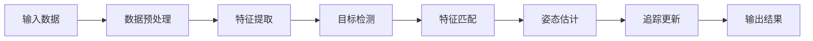

# 提高AI模型在复杂环境下的3D物体追踪能力

> 关键词：AI模型、3D物体追踪、复杂环境、算法原理、项目实战

> 摘要：本文聚焦于提高AI模型在复杂环境下的3D物体追踪能力这一核心问题。首先介绍了相关背景，包括目的范围、预期读者等内容。接着阐述了核心概念与联系，详细讲解了核心算法原理和具体操作步骤，并给出了数学模型和公式。通过项目实战展示了代码的实际案例和详细解释。分析了实际应用场景，推荐了学习资源、开发工具框架以及相关论文著作。最后总结了未来发展趋势与挑战，并提供了常见问题解答和扩展阅读参考资料，旨在为提升AI模型在复杂环境下的3D物体追踪能力提供全面且深入的技术指导。

## 1. 背景介绍 
### 1.1 目的和范围
在当今科技飞速发展的时代，3D物体追踪技术在众多领域展现出了巨大的应用潜力，如增强现实（AR）、虚拟现实（VR）、机器人导航、智能监控等。然而，复杂环境下的3D物体追踪面临着诸多挑战，如光照变化、物体遮挡、背景复杂等，这些因素严重影响了追踪的准确性和稳定性。因此，提高AI模型在复杂环境下的3D物体追踪能力具有重要的现实意义。

本文的范围涵盖了从核心概念的阐述、算法原理的分析、数学模型的构建，到项目实战的实现以及实际应用场景的探讨。旨在为读者提供一套完整的技术方案，帮助其深入理解并掌握提高3D物体追踪能力的方法。

### 1.2 预期读者
本文预期读者包括计算机科学、人工智能、机器人技术等相关领域的研究人员、工程师和学生。对于那些对3D物体追踪技术感兴趣，希望提升自己在复杂环境下处理3D物体追踪问题能力的专业人士，本文将提供有价值的参考。

### 1.3 文档结构概述
本文将按照以下结构进行阐述：
1. 背景介绍：介绍文章的目的、范围、预期读者和文档结构概述。
2. 核心概念与联系：解释3D物体追踪的核心概念，展示相关的原理和架构示意图。
3. 核心算法原理 & 具体操作步骤：详细讲解核心算法原理，并给出Python源代码示例。
4. 数学模型和公式 & 详细讲解 & 举例说明：构建数学模型，给出相关公式，并进行详细讲解和举例。
5. 项目实战：代码实际案例和详细解释说明，包括开发环境搭建、源代码实现和代码解读。
6. 实际应用场景：分析3D物体追踪技术在不同领域的实际应用场景。
7. 工具和资源推荐：推荐学习资源、开发工具框架和相关论文著作。
8. 总结：未来发展趋势与挑战：总结技术的发展趋势和面临的挑战。
9. 附录：常见问题与解答：解答读者可能遇到的常见问题。
10. 扩展阅读 & 参考资料：提供扩展阅读的建议和参考资料。

### 1.4 术语表
#### 1.4.1 核心术语定义
- **3D物体追踪**：在三维空间中对特定物体的位置、姿态等信息进行持续监测和记录的过程。
- **AI模型**：基于人工智能技术构建的模型，用于处理和分析数据，实现特定的任务，如3D物体追踪。
- **复杂环境**：包含光照变化、物体遮挡、背景复杂等因素，对3D物体追踪造成干扰的环境。
- **特征提取**：从图像或视频数据中提取能够代表物体特征的信息，用于后续的识别和追踪。
- **姿态估计**：确定物体在三维空间中的姿态，包括旋转和平移信息。

#### 1.4.2 相关概念解释
- **多传感器融合**：将来自不同传感器（如摄像头、激光雷达等）的数据进行融合，以获取更全面、准确的信息。
- **深度学习**：一种基于人工神经网络的机器学习方法，能够自动从大量数据中学习特征和模式。
- **目标检测**：在图像或视频中识别出特定目标的位置和类别。

#### 1.4.3 缩略词列表
- **AR**：增强现实（Augmented Reality）
- **VR**：虚拟现实（Virtual Reality）
- **CNN**：卷积神经网络（Convolutional Neural Network）
- **RNN**：循环神经网络（Recurrent Neural Network）
- **LIDAR**：激光雷达（Light Detection and Ranging）

## 2. 核心概念与联系 

### 核心概念原理
3D物体追踪的核心目标是在复杂环境下准确、稳定地跟踪目标物体的三维位置和姿态。其基本原理是通过对连续帧的图像或视频数据进行处理，提取目标物体的特征，并根据这些特征建立物体在不同帧之间的对应关系，从而实现物体的追踪。

在复杂环境下，由于光照变化、物体遮挡等因素的影响，目标物体的外观可能会发生显著变化，这给特征提取和匹配带来了很大的挑战。为了应对这些挑战，通常采用多传感器融合、深度学习等技术。

多传感器融合可以综合利用不同传感器的优势，提供更全面、准确的信息。例如，摄像头可以提供丰富的视觉信息，而激光雷达可以提供高精度的三维距离信息。通过将两者的数据进行融合，可以提高3D物体追踪的准确性和鲁棒性。

深度学习技术在特征提取和目标检测方面具有强大的能力。卷积神经网络（CNN）可以自动从图像中学习到具有代表性的特征，循环神经网络（RNN）可以处理序列数据，适用于对连续帧的分析。通过训练深度学习模型，可以提高对复杂环境下目标物体的识别和追踪能力。

### 架构的文本示意图
```plaintext
输入数据（图像、视频、传感器数据）
|
|-- 数据预处理（去噪、归一化等）
|
|-- 特征提取（CNN、手工特征等）
|
|-- 目标检测（确定目标物体位置和类别）
|
|-- 特征匹配（建立不同帧之间目标物体的对应关系）
|
|-- 姿态估计（计算目标物体的三维姿态）
|
|-- 追踪更新（更新目标物体的位置和姿态信息）
|
输出结果（目标物体的三维位置和姿态）
```

### Mermaid流程图


## 3. 核心算法原理 & 具体操作步骤 

### 核心算法原理
在3D物体追踪中，常用的算法包括基于特征的方法、基于深度学习的方法等。这里我们以基于深度学习的方法为例，介绍其核心算法原理。

基于深度学习的3D物体追踪方法通常采用卷积神经网络（CNN）进行特征提取和目标检测。CNN可以自动从图像中学习到具有代表性的特征，这些特征对于目标物体的识别和追踪具有重要作用。

具体来说，首先使用一个预训练的CNN模型对输入的图像进行特征提取，得到一个特征图。然后，在特征图上进行目标检测，确定目标物体的位置和类别。接着，通过比较不同帧之间的特征图，建立目标物体在不同帧之间的对应关系，实现物体的追踪。

### 具体操作步骤
#### 步骤1：数据预处理
对输入的图像或视频数据进行预处理，包括去噪、归一化等操作，以提高数据的质量。

```python
import cv2
import numpy as np

def preprocess_image(image):
    # 去噪
    denoised_image = cv2.fastNlMeansDenoisingColored(image, None, 10, 10, 7, 21)
    # 归一化
    normalized_image = denoised_image / 255.0
    return normalized_image
```

#### 步骤2：特征提取
使用预训练的CNN模型对预处理后的图像进行特征提取。

```python
import torch
import torchvision.models as models

def extract_features(image):
    # 加载预训练的ResNet模型
    model = models.resnet18(pretrained=True)
    # 去除最后一层全连接层
    feature_extractor = torch.nn.Sequential(*list(model.children())[:-1])
    # 将图像转换为Tensor
    image_tensor = torch.from_numpy(image).permute(2, 0, 1).unsqueeze(0).float()
    # 提取特征
    features = feature_extractor(image_tensor)
    return features
```

#### 步骤3：目标检测
在特征图上进行目标检测，确定目标物体的位置和类别。

```python
import torchvision.transforms as transforms
from torchvision.models.detection import fasterrcnn_resnet50_fpn

def detect_objects(image):
    # 加载预训练的Faster R-CNN模型
    model = fasterrcnn_resnet50_fpn(pretrained=True)
    model.eval()
    # 定义图像转换
    transform = transforms.Compose([transforms.ToTensor()])
    # 将图像转换为Tensor
    image_tensor = transform(image).unsqueeze(0)
    # 进行目标检测
    with torch.no_grad():
        predictions = model(image_tensor)
    return predictions
```

#### 步骤4：特征匹配
通过比较不同帧之间的特征图，建立目标物体在不同帧之间的对应关系。

```python
from sklearn.metrics.pairwise import cosine_similarity

def match_features(features1, features2):
    # 将特征图展平
    features1_flat = features1.view(features1.size(0), -1).numpy()
    features2_flat = features2.view(features2.size(0), -1).numpy()
    # 计算余弦相似度
    similarity = cosine_similarity(features1_flat, features2_flat)
    # 找到最大相似度的索引
    match_index = np.argmax(similarity)
    return match_index
```

#### 步骤5：姿态估计
根据目标物体在不同帧之间的对应关系，计算目标物体的三维姿态。

```python
import cv2

def estimate_pose(image_points, object_points, camera_matrix, dist_coeffs):
    # 进行姿态估计
    success, rotation_vector, translation_vector = cv2.solvePnP(object_points, image_points, camera_matrix, dist_coeffs)
    return rotation_vector, translation_vector
```

#### 步骤6：追踪更新
根据姿态估计的结果，更新目标物体的位置和姿态信息。

```python
def update_tracking(rotation_vector, translation_vector):
    # 更新目标物体的位置和姿态信息
    # 这里可以根据具体需求进行实现
    return rotation_vector, translation_vector
```

## 4. 数学模型和公式 & 详细讲解 & 举例说明 

### 数学模型和公式
#### 特征提取
在CNN中，特征提取的过程可以用卷积操作来表示。设输入图像为 $I \in \mathbb{R}^{H \times W \times C}$，其中 $H$、$W$ 和 $C$ 分别表示图像的高度、宽度和通道数。卷积核为 $K \in \mathbb{R}^{h \times w \times C \times N}$，其中 $h$、$w$ 表示卷积核的高度和宽度，$N$ 表示卷积核的数量。则卷积操作的输出特征图 $F \in \mathbb{R}^{H' \times W' \times N}$ 可以表示为：

$$
F_{i,j,k} = \sum_{m=0}^{h-1} \sum_{n=0}^{w-1} \sum_{c=0}^{C-1} K_{m,n,c,k} \cdot I_{i+m,j+n,c} + b_k
$$

其中，$F_{i,j,k}$ 表示特征图 $F$ 在位置 $(i,j)$ 处的第 $k$ 个通道的值，$b_k$ 表示第 $k$ 个卷积核的偏置。

#### 目标检测
在目标检测中，常用的损失函数是交叉熵损失函数。设 $p_i$ 表示预测的目标类别概率，$y_i$ 表示真实的目标类别标签，则交叉熵损失函数可以表示为：

$$
L = - \sum_{i=1}^{N} y_i \log(p_i)
$$

其中，$N$ 表示样本的数量。

#### 特征匹配
在特征匹配中，常用的相似度度量方法是余弦相似度。设 $\mathbf{x}$ 和 $\mathbf{y}$ 分别表示两个特征向量，则余弦相似度可以表示为：

$$
\cos(\theta) = \frac{\mathbf{x} \cdot \mathbf{y}}{\|\mathbf{x}\| \|\mathbf{y}\|}
$$

其中，$\cdot$ 表示向量的点积，$\|\cdot\|$ 表示向量的模。

#### 姿态估计
在姿态估计中，常用的方法是透视n点（PnP）算法。设 $\mathbf{X}_i$ 表示目标物体上第 $i$ 个点的三维坐标，$\mathbf{x}_i$ 表示该点在图像平面上的投影坐标，$\mathbf{R}$ 表示旋转矩阵，$\mathbf{t}$ 表示平移向量，则PnP算法的目标是求解 $\mathbf{R}$ 和 $\mathbf{t}$，使得以下方程成立：

$$
s \mathbf{x}_i = \mathbf{K} [\mathbf{R} \mathbf{X}_i + \mathbf{t}]
$$

其中，$s$ 表示尺度因子，$\mathbf{K}$ 表示相机内参矩阵。

### 详细讲解
#### 特征提取
卷积操作是CNN中最核心的操作之一，它可以自动从图像中提取出具有代表性的特征。通过不同的卷积核，可以提取出不同类型的特征，如边缘、纹理等。在实际应用中，通常会使用多个卷积层和池化层来逐步提取更高级的特征。

#### 目标检测
目标检测的目标是在图像中识别出特定目标的位置和类别。交叉熵损失函数可以衡量预测结果与真实标签之间的差异，通过最小化交叉熵损失函数，可以训练出一个准确的目标检测模型。

#### 特征匹配
余弦相似度是一种常用的相似度度量方法，它可以衡量两个向量之间的夹角大小。在特征匹配中，通过计算不同帧之间特征向量的余弦相似度，可以找到目标物体在不同帧之间的对应关系。

#### 姿态估计
PnP算法是一种经典的姿态估计算法，它可以根据目标物体上多个点的三维坐标和其在图像平面上的投影坐标，求解出目标物体的旋转和平移信息。在实际应用中，通常需要使用多个点来提高姿态估计的准确性。

### 举例说明
假设我们有一张输入图像，其大小为 $224 \times 224 \times 3$。我们使用一个卷积核大小为 $3 \times 3$，数量为 64 的卷积层对其进行特征提取。则卷积操作的输出特征图大小为 $222 \times 222 \times 64$。

在目标检测中，假设我们有一个包含 10 个样本的数据集，其中 5 个样本的真实标签为 0，5 个样本的真实标签为 1。预测的目标类别概率分别为 $[0.2, 0.8, 0.3, 0.7, 0.4, 0.6, 0.1, 0.9, 0.5, 0.5]$。则交叉熵损失函数的值为：

$$
L = - \left( 5 \times \log(0.2) + 5 \times \log(0.8) \right) \approx 0.5004
$$

在特征匹配中，假设我们有两个特征向量 $\mathbf{x} = [1, 2, 3]$ 和 $\mathbf{y} = [4, 5, 6]$。则它们的余弦相似度为：

$$
\cos(\theta) = \frac{1 \times 4 + 2 \times 5 + 3 \times 6}{\sqrt{1^2 + 2^2 + 3^2} \sqrt{4^2 + 5^2 + 6^2}} \approx 0.9747
$$

在姿态估计中，假设我们有一个目标物体上的 4 个点的三维坐标 $\mathbf{X}_1 = [0, 0, 0]$，$\mathbf{X}_2 = [1, 0, 0]$，$\mathbf{X}_3 = [0, 1, 0]$，$\mathbf{X}_4 = [0, 0, 1]$，以及它们在图像平面上的投影坐标 $\mathbf{x}_1 = [100, 100]$，$\mathbf{x}_2 = [200, 100]$，$\mathbf{x}_3 = [100, 200]$，$\mathbf{x}_4 = [100, 100]$。相机内参矩阵为 $\mathbf{K} = \begin{bmatrix} 1000 & 0 & 320 \\ 0 & 1000 & 240 \\ 0 & 0 & 1 \end{bmatrix}$。则通过PnP算法可以求解出目标物体的旋转和平移信息。

## 5. 项目实战：代码实际案例和详细解释说明 

### 5.1  开发环境搭建
#### 安装Python
首先，确保你已经安装了Python 3.x版本。可以从Python官方网站（https://www.python.org/downloads/）下载并安装。

#### 安装依赖库
使用以下命令安装项目所需的依赖库：
```bash
pip install torch torchvision opencv-python numpy scikit-learn
```

### 5.2  源代码详细实现和代码解读
```python
import cv2
import numpy as np
import torch
import torchvision.models as models
import torchvision.transforms as transforms
from torchvision.models.detection import fasterrcnn_resnet50_fpn
from sklearn.metrics.pairwise import cosine_similarity

# 数据预处理
def preprocess_image(image):
    # 去噪
    denoised_image = cv2.fastNlMeansDenoisingColored(image, None, 10, 10, 7, 21)
    # 归一化
    normalized_image = denoised_image / 255.0
    return normalized_image

# 特征提取
def extract_features(image):
    # 加载预训练的ResNet模型
    model = models.resnet18(pretrained=True)
    # 去除最后一层全连接层
    feature_extractor = torch.nn.Sequential(*list(model.children())[:-1])
    # 将图像转换为Tensor
    image_tensor = torch.from_numpy(image).permute(2, 0, 1).unsqueeze(0).float()
    # 提取特征
    features = feature_extractor(image_tensor)
    return features

# 目标检测
def detect_objects(image):
    # 加载预训练的Faster R-CNN模型
    model = fasterrcnn_resnet50_fpn(pretrained=True)
    model.eval()
    # 定义图像转换
    transform = transforms.Compose([transforms.ToTensor()])
    # 将图像转换为Tensor
    image_tensor = transform(image).unsqueeze(0)
    # 进行目标检测
    with torch.no_grad():
        predictions = model(image_tensor)
    return predictions

# 特征匹配
def match_features(features1, features2):
    # 将特征图展平
    features1_flat = features1.view(features1.size(0), -1).numpy()
    features2_flat = features2.view(features2.size(0), -1).numpy()
    # 计算余弦相似度
    similarity = cosine_similarity(features1_flat, features2_flat)
    # 找到最大相似度的索引
    match_index = np.argmax(similarity)
    return match_index

# 姿态估计
def estimate_pose(image_points, object_points, camera_matrix, dist_coeffs):
    # 进行姿态估计
    success, rotation_vector, translation_vector = cv2.solvePnP(object_points, image_points, camera_matrix, dist_coeffs)
    return rotation_vector, translation_vector

# 追踪更新
def update_tracking(rotation_vector, translation_vector):
    # 更新目标物体的位置和姿态信息
    # 这里可以根据具体需求进行实现
    return rotation_vector, translation_vector

# 主函数
def main():
    # 读取视频文件
    cap = cv2.VideoCapture('test_video.mp4')
    # 初始化相机内参矩阵和畸变系数
    camera_matrix = np.array([[1000, 0, 320], [0, 1000, 240], [0, 0, 1]], dtype=np.float32)
    dist_coeffs = np.zeros((4, 1), dtype=np.float32)
    # 初始化目标物体的三维坐标
    object_points = np.array([[0, 0, 0], [1, 0, 0], [0, 1, 0], [0, 0, 1]], dtype=np.float32)
    # 初始化上一帧的特征
    prev_features = None
    while cap.isOpened():
        ret, frame = cap.read()
        if not ret:
            break
        # 数据预处理
        preprocessed_frame = preprocess_image(frame)
        # 特征提取
        features = extract_features(preprocessed_frame)
        if prev_features is not None:
            # 特征匹配
            match_index = match_features(features, prev_features)
            # 目标检测
            predictions = detect_objects(frame)
            # 获取目标物体的图像坐标
            boxes = predictions[0]['boxes'].cpu().numpy()
            if len(boxes) > 0:
                image_points = np.array([[boxes[0][0], boxes[0][1]], [boxes[0][2], boxes[0][1]], [boxes[0][2], boxes[0][3]], [boxes[0][0], boxes[0][3]]], dtype=np.float32)
                # 姿态估计
                rotation_vector, translation_vector = estimate_pose(image_points, object_points, camera_matrix, dist_coeffs)
                # 追踪更新
                rotation_vector, translation_vector = update_tracking(rotation_vector, translation_vector)
                # 在图像上绘制目标物体的边界框
                cv2.rectangle(frame, (int(boxes[0][0]), int(boxes[0][1])), (int(boxes[0][2]), int(boxes[0][3])), (0, 255, 0), 2)
        prev_features = features
        # 显示图像
        cv2.imshow('3D Object Tracking', frame)
        if cv2.waitKey(1) & 0xFF == ord('q'):
            break
    cap.release()
    cv2.destroyAllWindows()

if __name__ == '__main__':
    main()
```

### 5.3  代码解读与分析
#### 数据预处理
`preprocess_image` 函数对输入的图像进行去噪和归一化处理，以提高数据的质量。

#### 特征提取
`extract_features` 函数使用预训练的ResNet模型对预处理后的图像进行特征提取。通过去除最后一层全连接层，只保留特征提取部分。

#### 目标检测
`detect_objects` 函数使用预训练的Faster R-CNN模型对图像进行目标检测，得到目标物体的位置和类别信息。

#### 特征匹配
`match_features` 函数通过计算不同帧之间特征向量的余弦相似度，找到目标物体在不同帧之间的对应关系。

#### 姿态估计
`estimate_pose` 函数使用PnP算法根据目标物体上多个点的三维坐标和其在图像平面上的投影坐标，求解出目标物体的旋转和平移信息。

#### 追踪更新
`update_tracking` 函数根据姿态估计的结果，更新目标物体的位置和姿态信息。

#### 主函数
`main` 函数是程序的入口，它读取视频文件，逐帧处理图像，调用上述函数完成3D物体追踪的任务，并在图像上绘制目标物体的边界框。

## 6. 实际应用场景 
### 增强现实（AR）
在AR应用中，3D物体追踪技术可以将虚拟物体与真实场景进行融合，为用户带来更加沉浸式的体验。例如，在AR游戏中，可以通过追踪玩家的手势或周围的物体，将虚拟角色或道具放置在合适的位置。

### 虚拟现实（VR）
在VR应用中，3D物体追踪技术可以实现对用户头部和手部的追踪，从而实现更加自然的交互。例如，在VR游戏中，玩家可以通过手势操作来控制游戏角色，增强游戏的趣味性和沉浸感。

### 机器人导航
在机器人导航中，3D物体追踪技术可以帮助机器人识别周围的环境和障碍物，从而实现自主导航。例如，在工业生产线上，机器人可以通过追踪零件的位置和姿态，完成自动化的装配任务。

### 智能监控
在智能监控中，3D物体追踪技术可以对监控区域内的目标物体进行实时追踪和分析。例如，在公共场所的监控系统中，可以通过追踪人员的行为和轨迹，及时发现异常情况并发出警报。

## 7. 工具和资源推荐
### 7.1 学习资源推荐
#### 7.1.1 书籍推荐
- 《深度学习》（Deep Learning）：由Ian Goodfellow、Yoshua Bengio和Aaron Courville撰写，是深度学习领域的经典教材。
- 《计算机视觉：算法与应用》（Computer Vision: Algorithms and Applications）：由Richard Szeliski撰写，全面介绍了计算机视觉的算法和应用。
- 《机器人学导论》（Introduction to Robotics: Mechanics and Control）：由John J. Craig撰写，是机器人学领域的经典教材，涵盖了机器人的运动学、动力学、控制等方面的知识。

#### 7.1.2 在线课程
- Coursera上的“深度学习专项课程”（Deep Learning Specialization）：由Andrew Ng教授授课，系统介绍了深度学习的理论和实践。
- edX上的“计算机视觉基础”（Foundations of Computer Vision）：由UC Berkeley的Jitendra Malik教授授课，介绍了计算机视觉的基本概念和算法。
- Udemy上的“机器人编程入门”（Robotics Programming Basics）：介绍了机器人编程的基础知识和实践。

#### 7.1.3 技术博客和网站
- Medium：是一个技术博客平台，上面有很多关于人工智能、计算机视觉等领域的优质文章。
- arXiv：是一个预印本服务器，上面有很多最新的学术研究成果。
- OpenCV官方文档：是OpenCV库的官方文档，提供了详细的使用说明和示例代码。

### 7.2 开发工具框架推荐
#### 7.2.1 IDE和编辑器
- PyCharm：是一款专门为Python开发设计的集成开发环境，提供了丰富的功能和插件。
- Visual Studio Code：是一款轻量级的代码编辑器，支持多种编程语言，具有丰富的插件生态系统。
- Jupyter Notebook：是一个交互式的笔记本环境，适合进行数据探索和模型开发。

#### 7.2.2 调试和性能分析工具
- Py-Spy：是一个Python性能分析工具，可以帮助你找出代码中的性能瓶颈。
- TensorBoard：是TensorFlow的可视化工具，可以帮助你监控模型的训练过程和性能。
- OpenCV的调试工具：OpenCV提供了一些调试工具，如cv2.imshow、cv2.waitKey等，可以帮助你调试图像处理代码。

#### 7.2.3 相关框架和库
- PyTorch：是一个开源的深度学习框架，具有动态图机制，易于使用和调试。
- TensorFlow：是一个广泛使用的深度学习框架，提供了丰富的工具和库。
- OpenCV：是一个开源的计算机视觉库，提供了丰富的图像处理和计算机视觉算法。

### 7.3 相关论文著作推荐
#### 7.3.1 经典论文
- “Faster R-CNN: Towards Real-Time Object Detection with Region Proposal Networks”：提出了Faster R-CNN目标检测算法，是目标检测领域的经典论文。
- “You Only Look Once: Unified, Real-Time Object Detection”：提出了YOLO目标检测算法，实现了实时目标检测。
- “Deep Residual Learning for Image Recognition”：提出了ResNet残差网络，解决了深度神经网络训练中的梯度消失问题。

#### 7.3.2 最新研究成果
- 关注CVPR、ICCV、ECCV等计算机视觉领域的顶级会议，上面有很多最新的研究成果。
- 关注arXiv上的最新预印本论文，了解领域内的最新动态。

#### 7.3.3 应用案例分析
- 可以参考一些知名公司的技术博客，如Google AI Blog、Facebook AI Research等，了解他们在3D物体追踪技术方面的应用案例和实践经验。

## 8. 总结：未来发展趋势与挑战
### 未来发展趋势
#### 多模态融合
未来的3D物体追踪技术将更加注重多模态融合，结合视觉、听觉、触觉等多种传感器的数据，提供更加全面、准确的信息。例如，在智能机器人领域，通过融合视觉和触觉传感器的数据，可以实现更加精细的操作和交互。

#### 实时性和高效性
随着应用场景的不断扩展，对3D物体追踪技术的实时性和高效性提出了更高的要求。未来的算法将更加注重优化和加速，以实现实时的追踪和处理。例如，采用硬件加速技术（如GPU、FPGA）可以显著提高算法的运行速度。

#### 智能化和自适应
未来的3D物体追踪技术将更加智能化和自适应，能够自动适应不同的环境和任务需求。例如，在复杂环境下，算法可以自动调整参数和策略，提高追踪的准确性和稳定性。

### 挑战
#### 复杂环境的适应性
复杂环境下的光照变化、物体遮挡、背景复杂等因素仍然是3D物体追踪技术面临的主要挑战之一。如何提高算法在复杂环境下的适应性，是未来研究的重点方向。

#### 数据的标注和获取
3D物体追踪技术需要大量的标注数据进行训练，但数据的标注和获取是一项非常耗时和昂贵的工作。如何有效地获取和标注数据，是提高算法性能的关键。

#### 计算资源的限制
3D物体追踪技术通常需要大量的计算资源，尤其是在处理大规模数据和复杂场景时。如何在有限的计算资源下实现高效的追踪，是未来需要解决的问题。

## 9. 附录：常见问题与解答
### 问题1：如何选择合适的特征提取方法？
答：选择合适的特征提取方法需要考虑多个因素，如数据类型、任务需求、计算资源等。如果数据是图像或视频，可以考虑使用CNN进行特征提取；如果数据是序列数据，可以考虑使用RNN进行特征提取。此外，还可以结合手工特征和深度学习特征，以提高特征的表达能力。

### 问题2：如何解决目标物体遮挡的问题？
答：解决目标物体遮挡的问题可以采用多种方法，如多传感器融合、基于模型的方法、跟踪器的预测机制等。多传感器融合可以综合利用不同传感器的信息，提高在遮挡情况下的追踪能力；基于模型的方法可以通过建立目标物体的模型，在遮挡情况下进行预测和恢复；跟踪器的预测机制可以根据目标物体的运动轨迹，在遮挡期间进行预测和估计。

### 问题3：如何评估3D物体追踪算法的性能？
答：评估3D物体追踪算法的性能可以使用多种指标，如准确率、召回率、F1值、平均跟踪误差等。准确率和召回率可以衡量算法在目标检测和跟踪方面的性能；F1值是准确率和召回率的调和平均数，可以综合评估算法的性能；平均跟踪误差可以衡量算法在追踪过程中的误差大小。

### 问题4：如何优化3D物体追踪算法的运行速度？
答：优化3D物体追踪算法的运行速度可以采用多种方法，如算法优化、硬件加速、数据并行等。算法优化可以通过减少不必要的计算和内存开销，提高算法的效率；硬件加速可以使用GPU、FPGA等硬件设备，加速算法的运行；数据并行可以将数据分配到多个处理器或设备上进行并行处理，提高处理速度。

## 10. 扩展阅读 & 参考资料
### 扩展阅读
- 《人工智能：一种现代的方法》（Artificial Intelligence: A Modern Approach）：全面介绍了人工智能的理论和方法，是人工智能领域的经典教材。
- 《计算机图形学》（Computer Graphics: Principles and Practice）：介绍了计算机图形学的基本概念和算法，对于理解3D物体的表示和渲染有很大帮助。
- 《模式识别与机器学习》（Pattern Recognition and Machine Learning）：详细介绍了模式识别和机器学习的理论和方法，是相关领域的经典著作。

### 参考资料
- Goodfellow, I., Bengio, Y., & Courville, A. (2016). Deep Learning. MIT Press.
- Szeliski, R. (2010). Computer Vision: Algorithms and Applications. Springer.
- Craig, J. J. (2005). Introduction to Robotics: Mechanics and Control. Pearson Prentice Hall.
- Ren, S., He, K., Girshick, R., & Sun, J. (2015). Faster R-CNN: Towards Real-Time Object Detection with Region Proposal Networks. Neural Information Processing Systems (NIPS).
- Redmon, J., Divvala, S., Girshick, R., & Farhadi, A. (2016). You Only Look Once: Unified, Real-Time Object Detection. IEEE Conference on Computer Vision and Pattern Recognition (CVPR).
- He, K., Zhang, X., Ren, S., & Sun, J. (2016). Deep Residual Learning for Image Recognition. IEEE Conference on Computer Vision and Pattern Recognition (CVPR).

作者：AI天才研究院/AI Genius Institute & 禅与计算机程序设计艺术 /Zen And The Art of Computer Programming