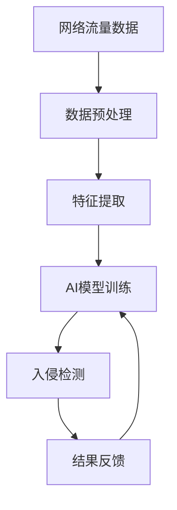

# 提高AI模型在复杂网络入侵检测中的准确性与实时性

> 关键词：AI模型、复杂网络入侵检测、准确性、实时性、机器学习算法

> 摘要：本文围绕提高AI模型在复杂网络入侵检测中的准确性与实时性展开深入探讨。首先介绍了研究的背景、目的和范围等内容，详细阐述了相关核心概念及其联系。接着深入分析了核心算法原理，通过Python代码展示具体操作步骤，给出了相关数学模型和公式并举例说明。在项目实战部分，搭建开发环境，实现并解读源代码。同时探讨了实际应用场景，推荐了相关的学习资源、开发工具框架和论文著作。最后总结了未来发展趋势与挑战，提供了常见问题解答和扩展阅读参考资料，旨在为提升复杂网络入侵检测的效果提供全面的技术支持和理论指导。

## 1. 背景介绍 
### 1.1 目的和范围
随着信息技术的飞速发展，网络已经成为人们生活和工作中不可或缺的一部分。然而，网络安全问题也日益严峻，复杂网络环境下的入侵行为层出不穷，给个人、企业和国家带来了巨大的损失。传统的入侵检测方法在面对复杂多变的网络攻击时，往往显得力不从心。因此，提高AI模型在复杂网络入侵检测中的准确性与实时性具有重要的现实意义。

本研究的范围主要涵盖了常见的AI模型在复杂网络入侵检测中的应用，包括机器学习和深度学习模型。通过对这些模型的优化和改进，旨在提高入侵检测的准确性，能够更精准地识别各种类型的入侵行为，同时提高检测的实时性，及时发现并响应入侵事件，减少损失。

### 1.2 预期读者
本文的预期读者包括网络安全领域的专业人员，如网络安全工程师、入侵检测分析师等，他们可以从本文中获取提高AI模型在入侵检测中性能的方法和技术。同时，对于从事机器学习和深度学习研究的科研人员，也可以从中了解到这些技术在网络安全领域的具体应用和挑战。此外，对网络安全感兴趣的学生和爱好者也可以通过本文深入了解复杂网络入侵检测的相关知识。

### 1.3 文档结构概述
本文将按照以下结构进行组织：首先介绍背景信息，包括研究的目的、预期读者和文档结构。接着阐述核心概念与联系，包括AI模型、复杂网络入侵检测等相关概念及其关系。然后详细讲解核心算法原理和具体操作步骤，并通过Python代码进行演示。之后给出相关的数学模型和公式，并举例说明。在项目实战部分，将搭建开发环境，实现并解读源代码。随后探讨实际应用场景，推荐相关的工具和资源。最后总结未来发展趋势与挑战，提供常见问题解答和扩展阅读参考资料。

### 1.4 术语表
#### 1.4.1 核心术语定义
- **AI模型**：人工智能模型是指基于机器学习、深度学习等技术构建的算法模型，用于处理和分析数据，以实现特定的任务，如分类、预测等。在网络入侵检测中，AI模型可以根据网络流量数据判断是否存在入侵行为。
- **复杂网络入侵检测**：复杂网络环境下，对各种非法入侵行为进行实时监测、识别和响应的过程。复杂网络具有拓扑结构复杂、流量多变、攻击手段多样等特点，给入侵检测带来了很大的挑战。
- **准确性**：在入侵检测中，准确性是指模型正确识别入侵行为和正常行为的能力。通常用准确率、召回率等指标来衡量。
- **实时性**：实时性是指模型能够在短时间内对网络流量进行分析和判断，及时发现入侵行为并采取相应的措施。

#### 1.4.2 相关概念解释
- **机器学习**：是一门多领域交叉学科，涉及概率论、统计学、逼近论、凸分析、算法复杂度理论等多门学科。它专门研究计算机怎样模拟或实现人类的学习行为，以获取新的知识或技能，重新组织已有的知识结构使之不断改善自身的性能。在网络入侵检测中，机器学习算法可以通过对大量网络流量数据的学习，建立入侵检测模型。
- **深度学习**：是机器学习的一个分支领域，它是一种基于对数据进行表征学习的方法。深度学习通过构建具有多个层次的神经网络模型，自动从数据中学习到复杂的特征和模式。在网络入侵检测中，深度学习模型可以处理高维、复杂的网络流量数据，提高检测的准确性。

#### 1.4.3 缩略词列表
- **CNN**：Convolutional Neural Network，卷积神经网络
- **RNN**：Recurrent Neural Network，循环神经网络
- **LSTM**：Long Short-Term Memory，长短期记忆网络
- **SVM**：Support Vector Machine，支持向量机
- **KNN**：K-Nearest Neighbors，K近邻算法

## 2. 核心概念与联系 

### 核心概念原理
#### AI模型
AI模型在网络入侵检测中起着关键作用。机器学习模型如SVM、KNN等，通过对网络流量数据的特征提取和学习，建立分类模型，将网络流量分为正常流量和入侵流量。深度学习模型如CNN、RNN、LSTM等，能够自动从原始的网络流量数据中学习到复杂的特征和模式，具有更强的表达能力和泛化能力。

#### 复杂网络入侵检测
复杂网络入侵检测的原理是通过对网络流量的实时监测和分析，识别出异常的行为模式。网络流量数据包含了丰富的信息，如源IP地址、目的IP地址、端口号、数据包大小、传输时间等。通过对这些数据的分析，可以发现潜在的入侵行为。

### 架构的文本示意图
```plaintext
网络流量数据 -> 数据预处理 -> 特征提取 -> AI模型训练 -> 入侵检测 -> 结果反馈
```
该示意图展示了复杂网络入侵检测的基本架构。首先，收集网络流量数据，然后对数据进行预处理，包括数据清洗、归一化等操作。接着进行特征提取，将原始数据转换为适合AI模型处理的特征向量。之后使用这些特征向量对AI模型进行训练，训练好的模型用于实时的入侵检测。最后，将检测结果进行反馈，以便对模型进行优化和调整。

### Mermaid流程图


该流程图清晰地展示了复杂网络入侵检测的流程，从数据收集到最终的结果反馈，形成了一个闭环系统。不断的结果反馈可以使AI模型不断优化，提高检测的准确性和实时性。

## 3. 核心算法原理 & 具体操作步骤 

### 核心算法原理
#### 支持向量机（SVM）
SVM的基本思想是在特征空间中找到一个最优的超平面，将不同类别的样本分开。对于线性可分的数据，SVM可以找到一个唯一的最优超平面；对于线性不可分的数据，SVM通过引入核函数将数据映射到高维空间，使其在高维空间中线性可分。

#### 卷积神经网络（CNN）
CNN是一种专门用于处理具有网格结构数据的深度学习模型，如图像、音频和时间序列数据。在网络入侵检测中，CNN可以自动从网络流量数据中提取特征。CNN主要由卷积层、池化层和全连接层组成。卷积层通过卷积核在输入数据上滑动，提取局部特征；池化层用于减少特征图的维度，降低计算量；全连接层将提取的特征进行分类。

### 具体操作步骤及Python代码实现
#### 支持向量机（SVM）
```python
import numpy as np
from sklearn import datasets
from sklearn.model_selection import train_test_split
from sklearn.svm import SVC
from sklearn.metrics import accuracy_score

# 加载数据集
iris = datasets.load_iris()
X = iris.data
y = iris.target

# 划分训练集和测试集
X_train, X_test, y_train, y_test = train_test_split(X, y, test_size=0.3, random_state=42)

# 创建SVM模型
svm_model = SVC(kernel='linear')

# 训练模型
svm_model.fit(X_train, y_train)

# 预测
y_pred = svm_model.predict(X_test)

# 计算准确率
accuracy = accuracy_score(y_test, y_pred)
print(f"SVM模型的准确率: {accuracy}")
```
#### 卷积神经网络（CNN）
```python
import numpy as np
import tensorflow as tf
from tensorflow.keras.datasets import mnist
from tensorflow.keras.models import Sequential
from tensorflow.keras.layers import Conv2D, MaxPooling2D, Flatten, Dense

# 加载MNIST数据集
(X_train, y_train), (X_test, y_test) = mnist.load_data()

# 数据预处理
X_train = X_train.reshape(-1, 28, 28, 1).astype('float32') / 255.0
X_test = X_test.reshape(-1, 28, 28, 1).astype('float32') / 255.0

# 构建CNN模型
model = Sequential([
    Conv2D(32, (3, 3), activation='relu', input_shape=(28, 28, 1)),
    MaxPooling2D((2, 2)),
    Conv2D(64, (3, 3), activation='relu'),
    MaxPooling2D((2, 2)),
    Flatten(),
    Dense(64, activation='relu'),
    Dense(10, activation='softmax')
])

# 编译模型
model.compile(optimizer='adam',
              loss='sparse_categorical_crossentropy',
              metrics=['accuracy'])

# 训练模型
model.fit(X_train, y_train, epochs=5, batch_size=64)

# 评估模型
test_loss, test_acc = model.evaluate(X_test, y_test)
print(f"CNN模型的准确率: {test_acc}")
```

## 4. 数学模型和公式 & 详细讲解 & 举例说明 

### 支持向量机（SVM）
#### 数学模型
对于线性可分的二分类问题，假设有训练数据集 $D = \{(x_1, y_1), (x_2, y_2), \cdots, (x_n, y_n)\}$，其中 $x_i \in \mathbb{R}^d$ 是特征向量，$y_i \in \{-1, 1\}$ 是类别标签。SVM的目标是找到一个超平面 $w^T x + b = 0$，使得不同类别的样本能够被正确分开，并且间隔最大。

#### 公式
SVM的优化问题可以表示为：
$$
\begin{aligned}
\min_{w, b} &\quad \frac{1}{2} \|w\|^2 \\
\text{s.t.} &\quad y_i (w^T x_i + b) \geq 1, \quad i = 1, 2, \cdots, n
\end{aligned}
$$
其中，$w$ 是超平面的法向量，$b$ 是偏置项。

#### 详细讲解
这个优化问题的目标是最小化 $\frac{1}{2} \|w\|^2$，也就是最大化间隔。约束条件 $y_i (w^T x_i + b) \geq 1$ 表示所有样本都要被正确分类，并且距离超平面的距离至少为1。

#### 举例说明
假设有两个类别，分别用红色和蓝色表示，数据点分布在二维平面上。SVM的任务就是找到一条直线（在二维空间中，超平面就是直线），将红色和蓝色的数据点分开，并且使这条直线到两类数据点的间隔最大。

### 卷积神经网络（CNN）
#### 数学模型
CNN的核心是卷积操作。对于输入的二维特征图 $X \in \mathbb{R}^{H \times W}$ 和卷积核 $K \in \mathbb{R}^{h \times w}$，卷积操作可以表示为：
$$
Y_{i, j} = \sum_{m=0}^{h-1} \sum_{n=0}^{w-1} K_{m, n} X_{i+m, j+n}
$$
其中，$Y$ 是输出的特征图，$i$ 和 $j$ 是输出特征图的坐标。

#### 公式
在卷积层中，通常会使用激活函数来引入非线性。常用的激活函数是ReLU（Rectified Linear Unit），其定义为：
$$
\text{ReLU}(x) = \max(0, x)
$$

#### 详细讲解
卷积操作通过卷积核在输入特征图上滑动，计算局部区域的加权和，从而提取局部特征。ReLU激活函数可以增强模型的非线性表达能力，使得模型能够学习到更复杂的特征。

#### 举例说明
假设输入的是一张灰度图像，卷积核可以看作是一个小的滤波器。通过卷积操作，滤波器在图像上滑动，提取出图像的边缘、纹理等特征。ReLU激活函数则会将负的特征值置为0，保留正的特征值，从而增强特征的表达能力。

## 5. 项目实战：代码实际案例和详细解释说明 

### 5.1  开发环境搭建
#### 安装Python
首先需要安装Python，建议使用Python 3.7及以上版本。可以从Python官方网站（https://www.python.org/downloads/）下载并安装。

#### 安装必要的库
使用pip安装必要的库，如numpy、pandas、scikit-learn、tensorflow等。可以使用以下命令进行安装：
```sh
pip install numpy pandas scikit-learn tensorflow
```

### 5.2  源代码详细实现和代码解读
#### 数据加载和预处理
```python
import pandas as pd
from sklearn.preprocessing import StandardScaler
from sklearn.model_selection import train_test_split

# 加载数据集
data = pd.read_csv('network_traffic.csv')

# 分离特征和标签
X = data.drop('label', axis=1)
y = data['label']

# 数据标准化
scaler = StandardScaler()
X_scaled = scaler.fit_transform(X)

# 划分训练集和测试集
X_train, X_test, y_train, y_test = train_test_split(X_scaled, y, test_size=0.2, random_state=42)
```
代码解读：首先使用pandas库加载网络流量数据集。然后将特征和标签分离，使用StandardScaler对特征数据进行标准化处理，使得数据具有零均值和单位方差。最后使用train_test_split函数将数据集划分为训练集和测试集。

#### 构建和训练模型
```python
from sklearn.svm import SVC

# 创建SVM模型
svm_model = SVC(kernel='rbf')

# 训练模型
svm_model.fit(X_train, y_train)
```
代码解读：使用sklearn库中的SVC类创建一个SVM模型，指定核函数为径向基函数（RBF）。然后使用训练集数据对模型进行训练。

#### 模型评估
```python
from sklearn.metrics import accuracy_score, precision_score, recall_score, f1_score

# 预测
y_pred = svm_model.predict(X_test)

# 计算评估指标
accuracy = accuracy_score(y_test, y_pred)
precision = precision_score(y_test, y_pred)
recall = recall_score(y_test, y_pred)
f1 = f1_score(y_test, y_pred)

print(f"准确率: {accuracy}")
print(f"精确率: {precision}")
print(f"召回率: {recall}")
print(f"F1分数: {f1}")
```
代码解读：使用训练好的模型对测试集进行预测，然后使用accuracy_score、precision_score、recall_score和f1_score函数计算准确率、精确率、召回率和F1分数等评估指标。

### 5.3  代码解读与分析
#### 数据预处理的重要性
数据预处理是机器学习中非常重要的一步。在网络入侵检测中，不同特征的取值范围可能差异很大，如果不进行标准化处理，会影响模型的训练效果。通过标准化处理，可以使得所有特征具有相同的尺度，提高模型的收敛速度和性能。

#### 模型选择和参数调优
在实际应用中，需要根据数据集的特点选择合适的模型和参数。例如，SVM模型的核函数选择会影响模型的性能。径向基函数（RBF）适用于非线性分类问题，但需要调整参数 $C$ 和 $\gamma$ 来优化模型。可以使用网格搜索等方法来寻找最优的参数组合。

#### 模型评估指标的意义
准确率是指模型正确预测的样本数占总样本数的比例，反映了模型的整体预测能力。精确率是指模型预测为正类的样本中实际为正类的比例，反映了模型预测正类的准确性。召回率是指实际为正类的样本中被模型正确预测为正类的比例，反映了模型发现正类样本的能力。F1分数是精确率和召回率的调和平均数，综合考虑了精确率和召回率。

## 6. 实际应用场景 
### 企业网络安全
在企业网络中，存在大量的敏感信息和业务系统，如财务数据、客户信息等。通过使用AI模型进行入侵检测，可以实时监测网络流量，及时发现并阻止外部黑客的入侵行为，保护企业的信息安全。例如，检测是否有异常的网络连接试图访问企业的数据库服务器，或者是否有恶意软件通过网络传播。

### 云计算环境
云计算环境具有多租户、动态扩展等特点，安全管理难度较大。AI模型可以对云计算平台的网络流量进行分析，识别出潜在的安全威胁，如虚拟机逃逸、DDoS攻击等。同时，还可以根据实时的安全态势，动态调整安全策略，提高云计算环境的安全性。

### 物联网安全
物联网设备数量众多，且很多设备的安全防护能力较弱，容易成为攻击者的目标。AI模型可以对物联网设备的通信流量进行监测，检测是否存在异常的设备行为，如异常的数据传输、设备被控制等。例如，在智能家居系统中，检测是否有非法设备试图连接到家庭网络，或者是否有智能家电被恶意控制。

## 7. 工具和资源推荐
### 7.1 学习资源推荐
#### 7.1.1 书籍推荐
- 《机器学习》（周志华著）：本书全面介绍了机器学习的基本概念、算法和应用，是机器学习领域的经典教材。
- 《深度学习》（Ian Goodfellow、Yoshua Bengio和Aaron Courville著）：由深度学习领域的三位顶级专家撰写，系统地介绍了深度学习的理论和实践。
- 《Python机器学习实战》（Sebastian Raschka著）：通过大量的Python代码示例，介绍了机器学习的各种算法和应用，适合初学者学习。

#### 7.1.2 在线课程
- Coursera上的“机器学习”课程（Andrew Ng教授授课）：该课程是机器学习领域的经典在线课程，由斯坦福大学的Andrew Ng教授授课，内容涵盖了机器学习的基本概念、算法和应用。
- edX上的“深度学习”课程：由知名高校和科研机构的专家授课，系统地介绍了深度学习的理论和实践。
- 中国大学MOOC上的“人工智能基础”课程：适合初学者了解人工智能的基本概念、技术和应用。

#### 7.1.3 技术博客和网站
- Medium：是一个汇聚了众多技术专家和爱好者的博客平台，上面有很多关于机器学习、深度学习和网络安全的优质文章。
- arXiv：是一个预印本平台，提供了大量的学术论文，包括机器学习、深度学习和网络安全领域的最新研究成果。
- 开源中国：是国内知名的开源技术社区，上面有很多关于网络安全和人工智能的技术文章和项目分享。

### 7.2 开发工具框架推荐
#### 7.2.1 IDE和编辑器
- PyCharm：是一款专门用于Python开发的集成开发环境（IDE），具有代码自动补全、调试、版本控制等功能，适合专业的Python开发者使用。
- Jupyter Notebook：是一个基于Web的交互式计算环境，支持Python、R等多种编程语言。可以方便地进行数据探索、模型训练和可视化。
- Visual Studio Code：是一款轻量级的代码编辑器，支持多种编程语言和插件扩展。可以通过安装Python插件来进行Python开发。

#### 7.2.2 调试和性能分析工具
- TensorBoard：是TensorFlow提供的可视化工具，可以用于可视化模型的训练过程、性能指标等。
- Py-Spy：是一个用于分析Python程序性能的工具，可以分析程序的CPU使用率、函数调用时间等。
- cProfile：是Python标准库中的一个性能分析工具，可以分析程序的函数调用时间和次数。

#### 7.2.3 相关框架和库
- TensorFlow：是一个开源的深度学习框架，由Google开发。提供了丰富的工具和接口，支持多种深度学习模型的构建和训练。
- PyTorch：是另一个开源的深度学习框架，由Facebook开发。具有动态图的特点，易于使用和调试。
- Scikit-learn：是一个用于机器学习的Python库，提供了丰富的机器学习算法和工具，如分类、回归、聚类等。

### 7.3 相关论文著作推荐
#### 7.3.1 经典论文
- “Support-Vector Networks”（Cortes和Vapnik著）：该论文首次提出了支持向量机（SVM）的概念，是机器学习领域的经典论文之一。
- “Gradient-based learning applied to document recognition”（LeCun等人著）：该论文介绍了卷积神经网络（CNN）在手写数字识别中的应用，开创了深度学习在计算机视觉领域的先河。
- “Long Short-Term Memory”（Hochreiter和Schmidhuber著）：该论文提出了长短期记忆网络（LSTM），解决了传统循环神经网络（RNN）的梯度消失问题。

#### 7.3.2 最新研究成果
- 在IEEE Transactions on Information Forensics and Security、ACM SIGSAC Conference on Computer and Communications Security等顶级学术期刊和会议上，有很多关于网络入侵检测和AI安全的最新研究成果。

#### 7.3.3 应用案例分析
- 可以关注一些知名企业和研究机构发布的网络安全报告和案例分析，了解AI模型在实际网络入侵检测中的应用情况和效果。

## 8. 总结：未来发展趋势与挑战
### 未来发展趋势
#### 融合多种AI技术
未来的网络入侵检测系统将融合多种AI技术，如机器学习、深度学习、强化学习等。通过不同技术的优势互补，提高检测的准确性和实时性。例如，使用深度学习模型进行特征提取和分类，使用强化学习模型进行实时决策和响应。

#### 智能化和自动化
随着AI技术的不断发展，网络入侵检测系统将越来越智能化和自动化。系统可以自动学习和适应新的攻击模式，自动调整检测策略，减少人工干预。例如，当检测到新的攻击类型时，系统可以自动更新模型，提高检测能力。

#### 与区块链技术结合
区块链技术具有去中心化、不可篡改等特点，可以为网络入侵检测提供更加安全可靠的保障。未来的网络入侵检测系统可能会与区块链技术结合，实现数据的安全存储和共享，提高检测结果的可信度。

### 挑战
#### 数据隐私和安全
在使用AI模型进行网络入侵检测时，需要收集大量的网络流量数据。这些数据可能包含用户的敏感信息，如个人身份信息、通信内容等。因此，如何保护数据的隐私和安全是一个重要的挑战。

#### 对抗攻击
攻击者可能会使用对抗攻击技术来欺骗AI模型，使模型误判入侵行为。例如，攻击者可以在正常的网络流量中添加一些扰动，使得模型将正常流量误判为入侵流量。如何提高AI模型的鲁棒性，抵抗对抗攻击是一个亟待解决的问题。

#### 计算资源和实时性要求
复杂的AI模型通常需要大量的计算资源来进行训练和推理。在实时的网络入侵检测场景中，需要在短时间内对大量的网络流量进行分析和判断，对计算资源和实时性提出了很高的要求。如何优化模型结构，减少计算量，提高实时性是一个重要的挑战。

## 9. 附录：常见问题与解答
### 问题1：如何选择合适的AI模型进行网络入侵检测？
解答：选择合适的AI模型需要考虑多个因素，如数据集的特点、模型的复杂度、计算资源等。如果数据集较小且特征维度较低，可以选择传统的机器学习模型，如SVM、KNN等；如果数据集较大且特征维度较高，可以选择深度学习模型，如CNN、RNN、LSTM等。同时，还可以通过实验比较不同模型的性能，选择最优的模型。

### 问题2：如何提高AI模型在网络入侵检测中的实时性？
解答：可以从以下几个方面提高AI模型的实时性：一是优化模型结构，减少模型的复杂度，降低计算量；二是使用高效的计算硬件，如GPU、TPU等，加速模型的训练和推理；三是采用增量学习的方法，在新数据到来时，只对模型进行局部更新，而不是重新训练整个模型。

### 问题3：如何处理网络入侵检测中的不平衡数据集问题？
解答：不平衡数据集是指不同类别的样本数量差异较大的数据集。在网络入侵检测中，正常流量的样本数量通常远大于入侵流量的样本数量，导致模型容易偏向于正常流量的分类。可以采用以下方法处理不平衡数据集问题：一是过采样，即增加少数类样本的数量；二是欠采样，即减少多数类样本的数量；三是使用代价敏感学习，对不同类别的样本赋予不同的代价。

## 10. 扩展阅读 & 参考资料
### 扩展阅读
- 《网络安全技术与应用》：介绍了网络安全的各种技术和应用，包括入侵检测、防火墙、加密技术等。
- 《人工智能与网络安全》：探讨了人工智能在网络安全领域的应用和挑战，以及如何利用人工智能技术提高网络安全防护能力。

### 参考资料
- 相关的学术论文和研究报告，如IEEE、ACM等学术组织发布的关于网络入侵检测和AI安全的论文。
- 开源项目的文档和代码，如TensorFlow、PyTorch等开源深度学习框架的官方文档和示例代码。

作者：AI天才研究院/AI Genius Institute & 禅与计算机程序设计艺术 /Zen And The Art of Computer Programming