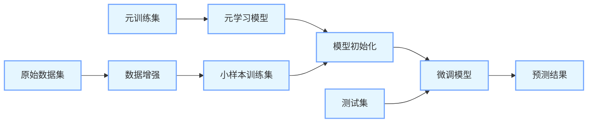

# 提高AI模型在小样本学习任务中的泛化能力

> 关键词：AI模型、小样本学习、泛化能力、元学习、数据增强

> 摘要：本文聚焦于提高AI模型在小样本学习任务中的泛化能力这一核心问题。首先介绍了小样本学习的背景、目的、预期读者和文档结构，阐述了相关术语。接着深入探讨了核心概念，包括小样本学习的原理和架构，并通过Mermaid流程图进行展示。详细讲解了提高泛化能力的核心算法原理，给出Python代码示例。运用数学模型和公式对算法进行理论分析，并举例说明。通过项目实战，展示了代码实现和解读。列举了小样本学习在多个领域的实际应用场景，推荐了学习资源、开发工具框架和相关论文著作。最后总结了未来发展趋势与挑战，提供常见问题解答和扩展阅读参考资料，旨在为研究者和开发者在小样本学习领域提供全面而深入的指导。

## 1. 背景介绍 
### 1.1 目的和范围
在当今的人工智能领域，数据的获取成本往往较高，尤其是在一些特定领域，如医疗、金融等，难以收集到大量有标注的数据。小样本学习应运而生，旨在让AI模型在仅有少量标注样本的情况下，依然能够进行有效的学习和准确的预测。本文的目的就是深入探讨如何提高AI模型在小样本学习任务中的泛化能力，范围涵盖核心概念、算法原理、数学模型、项目实战、实际应用场景以及相关工具和资源推荐等方面。

### 1.2 预期读者
本文预期读者包括人工智能领域的研究者、开发者、高校相关专业的学生以及对小样本学习感兴趣的技术爱好者。对于正在从事小样本学习研究的专业人员，本文可以提供新的思路和方法；对于初学者，能够帮助他们系统地了解小样本学习的相关知识。

### 1.3 文档结构概述
本文首先介绍小样本学习的背景知识，包括目的、预期读者和文档结构。接着阐述核心概念，通过示意图和流程图展示其原理和架构。然后详细讲解核心算法原理，结合Python代码进行说明。运用数学模型和公式对算法进行理论分析，并举例说明。通过项目实战展示代码的实际应用和解读。列举实际应用场景，推荐相关的学习资源、开发工具框架和论文著作。最后总结未来发展趋势与挑战，提供常见问题解答和扩展阅读参考资料。

### 1.4 术语表
#### 1.4.1 核心术语定义
- **小样本学习（Few-Shot Learning）**：指在仅有少量标注样本的情况下，使模型能够学习到有效的知识并进行准确预测的学习方法。
- **泛化能力（Generalization Ability）**：模型对未见过的数据进行准确预测的能力。
- **元学习（Meta-Learning）**：一种学习如何学习的方法，通过在多个任务上进行训练，使模型能够快速适应新的任务。
- **数据增强（Data Augmentation）**：通过对原始数据进行各种变换，生成新的数据样本，以增加数据的多样性。

#### 1.4.2 相关概念解释
- **小样本学习的挑战**：由于样本数量有限，模型容易出现过拟合现象，导致泛化能力下降。
- **元学习的作用**：元学习可以帮助模型学习到任务之间的共性，从而在小样本情况下快速适应新任务。
- **数据增强的原理**：通过对数据进行旋转、翻转、缩放等变换，模拟不同的场景，使模型能够学习到更丰富的特征。

#### 1.4.3 缩略词列表
- **FS-Learning**：Few-Shot Learning（小样本学习）
- **MAML**：Model-Agnostic Meta-Learning（模型无关元学习）

## 2. 核心概念与联系 
### 核心概念原理
小样本学习的核心目标是在有限的标注样本下，让模型具备良好的泛化能力。其原理主要基于两个方面：一是利用先验知识，通过元学习等方法，让模型学习到不同任务之间的共性，从而在新任务上能够快速适应；二是通过数据增强等手段，增加样本的多样性，使模型能够学习到更丰富的特征。

### 架构示意图
以下是小样本学习的基本架构示意图：

该流程图展示了小样本学习的主要流程。首先对原始数据集进行数据增强，得到小样本训练集。同时，使用元训练集进行元学习，得到初始化模型。将小样本训练集用于微调初始化模型，最后使用测试集进行测试，得到预测结果。

## 3. 核心算法原理 & 具体操作步骤 
### 元学习算法原理
元学习的一种经典算法是模型无关元学习（MAML）。其核心思想是通过在多个任务上进行训练，使模型能够快速适应新的任务。具体来说，MAML在元训练阶段，对每个任务进行一次或多次梯度更新，得到每个任务的临时模型参数。然后，使用这些临时模型参数在验证集上计算损失，再根据这个损失对模型的初始参数进行更新。

### Python代码实现
```python
import torch
import torch.nn as nn
import torch.optim as optim

# 定义一个简单的神经网络模型
class SimpleNet(nn.Module):
    def __init__(self):
        super(SimpleNet, self).__init__()
        self.fc1 = nn.Linear(10, 20)
        self.fc2 = nn.Linear(20, 1)

    def forward(self, x):
        x = torch.relu(self.fc1(x))
        x = self.fc2(x)
        return x

# 元训练函数
def meta_train(model, meta_train_tasks, meta_val_tasks, num_epochs=10, alpha=0.01, beta=0.001):
    meta_optimizer = optim.Adam(model.parameters(), lr=beta)
    for epoch in range(num_epochs):
        meta_loss = 0
        for task in meta_train_tasks:
            # 复制模型参数
            fast_weights = list(model.parameters())
            support_x, support_y = task[0]
            query_x, query_y = task[1]
            # 快速适应
            for _ in range(1):
                output = model(support_x)
                loss = nn.MSELoss()(output, support_y)
                grads = torch.autograd.grad(loss, fast_weights)
                fast_weights = [w - alpha * g for w, g in zip(fast_weights, grads)]
            # 计算元损失
            output = model.forward(query_x)
            meta_loss += nn.MSELoss()(output, query_y)
        # 更新元参数
        meta_optimizer.zero_grad()
        meta_loss.backward()
        meta_optimizer.step()
    return model

# 示例数据
meta_train_tasks = [
    [
        (torch.randn(5, 10), torch.randn(5, 1)),
        (torch.randn(3, 10), torch.randn(3, 1))
    ]
]
meta_val_tasks = [
    [
        (torch.randn(5, 10), torch.randn(5, 1)),
        (torch.randn(3, 10), torch.randn(3, 1))
    ]
]

model = SimpleNet()
trained_model = meta_train(model, meta_train_tasks, meta_val_tasks)
```
### 具体操作步骤
1. **定义模型**：定义一个简单的神经网络模型，如上述代码中的`SimpleNet`。
2. **准备数据**：准备元训练任务和元验证任务的数据。每个任务包含支持集和查询集。
3. **元训练**：在元训练阶段，对每个任务进行快速适应，得到临时模型参数。然后计算元损失，更新模型的初始参数。
4. **模型评估**：使用元验证任务对训练好的模型进行评估。

## 4. 数学模型和公式 & 详细讲解 & 举例说明 
### 元学习的数学模型
在MAML中，假设我们有一个模型 $f_{\theta}$，其中 $\theta$ 是模型的参数。对于每个任务 $T_i$，我们有支持集 $S_i = \{(x_{i1}, y_{i1}), (x_{i2}, y_{i2}), \cdots, (x_{im}, y_{im})\}$ 和查询集 $Q_i = \{(x_{i1}', y_{i1}'), (x_{i2}', y_{i2}'), \cdots, (x_{in}', y_{in}')\}$。

在快速适应阶段，我们使用支持集 $S_i$ 对模型进行一次或多次梯度更新，得到临时模型参数 $\theta_i'$：
$$\theta_i' = \theta - \alpha \nabla_{\theta} L_{S_i}(f_{\theta})$$
其中 $\alpha$ 是快速适应的学习率，$L_{S_i}(f_{\theta})$ 是在支持集 $S_i$ 上的损失函数。

在元训练阶段，我们使用查询集 $Q_i$ 计算元损失：
$$L_{meta}(\theta) = \sum_{i=1}^{N} L_{Q_i}(f_{\theta_i'})$$
其中 $N$ 是任务的数量。

最后，我们使用元损失对模型的初始参数 $\theta$ 进行更新：
$$\theta \leftarrow \theta - \beta \nabla_{\theta} L_{meta}(\theta)$$
其中 $\beta$ 是元学习的学习率。

### 举例说明
假设我们有一个简单的线性回归任务，模型为 $f_{\theta}(x) = \theta_1 x + \theta_0$。支持集 $S = \{(1, 2), (2, 4), (3, 6)\}$，查询集 $Q = \{(4, 8), (5, 10)\}$。

首先，我们计算在支持集上的损失函数 $L_{S}(f_{\theta})$：
$$L_{S}(f_{\theta}) = \frac{1}{3} \sum_{i=1}^{3} (f_{\theta}(x_i) - y_i)^2$$

然后，进行快速适应，得到临时模型参数 $\theta'$：
$$\theta' = \theta - \alpha \nabla_{\theta} L_{S}(f_{\theta})$$

接着，计算在查询集上的元损失 $L_{Q}(f_{\theta'})$：
$$L_{Q}(f_{\theta'}) = \frac{1}{2} \sum_{i=1}^{2} (f_{\theta'}(x_i') - y_i')^2$$

最后，更新模型的初始参数 $\theta$：
$$\theta \leftarrow \theta - \beta \nabla_{\theta} L_{Q}(f_{\theta'})$$

## 5. 项目实战：代码实际案例和详细解释说明 
### 5.1  开发环境搭建
- **Python环境**：建议使用Python 3.7及以上版本。
- **深度学习框架**：使用PyTorch，可通过以下命令安装：
```sh
pip install torch torchvision
```
- **其他依赖库**：安装`numpy`、`matplotlib`等常用库：
```sh
pip install numpy matplotlib
```

### 5.2  源代码详细实现和代码解读
```python
import torch
import torch.nn as nn
import torch.optim as optim
import numpy as np
import matplotlib.pyplot as plt

# 定义一个简单的卷积神经网络模型
class ConvNet(nn.Module):
    def __init__(self):
        super(ConvNet, self).__init__()
        self.conv1 = nn.Conv2d(1, 16, kernel_size=3, padding=1)
        self.relu1 = nn.ReLU()
        self.pool1 = nn.MaxPool2d(2)
        self.conv2 = nn.Conv2d(16, 32, kernel_size=3, padding=1)
        self.relu2 = nn.ReLU()
        self.pool2 = nn.MaxPool2d(2)
        self.fc1 = nn.Linear(32 * 7 * 7, 128)
        self.relu3 = nn.ReLU()
        self.fc2 = nn.Linear(128, 10)

    def forward(self, x):
        x = self.pool1(self.relu1(self.conv1(x)))
        x = self.pool2(self.relu2(self.conv2(x)))
        x = x.view(-1, 32 * 7 * 7)
        x = self.relu3(self.fc1(x))
        x = self.fc2(x)
        return x

# 数据增强函数
def data_augmentation(x):
    # 简单的数据增强，随机翻转
    if np.random.rand() > 0.5:
        x = torch.flip(x, dims=[3])
    return x

# 小样本训练函数
def few_shot_train(model, support_x, support_y, query_x, query_y, num_epochs=10, lr=0.001):
    optimizer = optim.Adam(model.parameters(), lr=lr)
    criterion = nn.CrossEntropyLoss()
    for epoch in range(num_epochs):
        # 数据增强
        support_x = data_augmentation(support_x)
        output = model(support_x)
        loss = criterion(output, support_y)
        optimizer.zero_grad()
        loss.backward()
        optimizer.step()
    # 在查询集上评估
    with torch.no_grad():
        output = model(query_x)
        _, predicted = torch.max(output.data, 1)
        accuracy = (predicted == query_y).sum().item() / query_y.size(0)
    return accuracy

# 生成示例数据
support_x = torch.randn(5, 1, 28, 28)
support_y = torch.randint(0, 10, (5,))
query_x = torch.randn(10, 1, 28, 28)
query_y = torch.randint(0, 10, (10,))

model = ConvNet()
accuracy = few_shot_train(model, support_x, support_y, query_x, query_y)
print(f"Few-shot learning accuracy: {accuracy}")
```
### 代码解读与分析
- **模型定义**：定义了一个简单的卷积神经网络`ConvNet`，包含两个卷积层、两个池化层和两个全连接层。
- **数据增强**：定义了一个简单的数据增强函数`data_augmentation`，通过随机翻转来增加数据的多样性。
- **小样本训练**：`few_shot_train`函数用于在小样本数据上进行训练。在训练过程中，对支持集数据进行数据增强，然后计算损失并更新模型参数。最后在查询集上评估模型的准确率。
- **示例数据生成**：生成了支持集和查询集的示例数据，并调用`few_shot_train`函数进行小样本训练，输出训练后的准确率。

## 6. 实际应用场景 
### 医疗领域
在医疗图像诊断中，由于某些疾病的病例较少，很难收集到大量有标注的图像数据。小样本学习可以帮助医生在仅有少量病例的情况下，训练出准确的诊断模型。例如，对于罕见病的影像诊断，通过元学习和数据增强等方法，可以提高模型对新病例的泛化能力。

### 金融领域
在金融风险评估中，某些特殊类型的风险事件可能很少发生，导致相关的历史数据有限。小样本学习可以用于构建风险评估模型，在少量样本的情况下，准确预测潜在的风险。例如，对于新兴金融产品的风险评估，通过小样本学习可以快速适应新的市场情况。

### 自然语言处理领域
在文本分类任务中，对于一些特定领域的文本，可能只有少量的标注样本。小样本学习可以帮助模型在这些小样本数据上进行训练，提高对未见过文本的分类准确率。例如，在法律文本分类中，由于法律条文的专业性和多样性，标注数据较少，小样本学习可以有效地解决这个问题。

## 7. 工具和资源推荐
### 7.1 学习资源推荐
#### 7.1.1 书籍推荐
- 《深度学习》（Deep Learning）：由Ian Goodfellow、Yoshua Bengio和Aaron Courville撰写，是深度学习领域的经典教材，涵盖了深度学习的基本原理和算法。
- 《机器学习》（Machine Learning: A Probabilistic Perspective）：作者是Kevin P. Murphy，从概率的角度介绍了机器学习的各种算法和模型。

#### 7.1.2 在线课程
- Coursera上的“深度学习专项课程”（Deep Learning Specialization）：由Andrew Ng教授授课，包括深度学习的基础知识、卷积神经网络、循环神经网络等内容。
- edX上的“人工智能基础”（Fundamentals of Artificial Intelligence）：全面介绍了人工智能的基本概念、算法和应用。

#### 7.1.3 技术博客和网站
- arXiv：一个预印本平台，提供了大量最新的人工智能研究论文。
- Medium：有很多人工智能领域的技术博客，涵盖了各种最新的研究成果和实践经验。

### 7.2 开发工具框架推荐
#### 7.2.1 IDE和编辑器
- PyCharm：一款专业的Python集成开发环境，提供了丰富的代码编辑、调试和分析功能。
- Jupyter Notebook：一种交互式的开发环境，适合进行数据探索和模型实验。

#### 7.2.2 调试和性能分析工具
- TensorBoard：TensorFlow提供的可视化工具，可以用于可视化模型的训练过程、损失函数变化等。
- PyTorch Profiler：PyTorch提供的性能分析工具，可以帮助开发者找出模型中的性能瓶颈。

#### 7.2.3 相关框架和库
- PyTorch：一个开源的深度学习框架，具有动态图和易于使用的特点。
- Scikit-learn：一个常用的机器学习库，提供了各种机器学习算法和工具。

### 7.3 相关论文著作推荐
#### 7.3.1 经典论文
- "Model-Agnostic Meta-Learning for Fast Adaptation of Deep Networks"：介绍了模型无关元学习（MAML）算法，是元学习领域的经典论文。
- "Matching Networks for One Shot Learning"：提出了匹配网络（Matching Networks），用于解决小样本学习问题。

#### 7.3.2 最新研究成果
- 关注arXiv上关于小样本学习的最新论文，了解该领域的最新研究进展。

#### 7.3.3 应用案例分析
- 可以在ACM、IEEE等学术数据库中搜索小样本学习在各个领域的应用案例，学习实际应用中的经验和技巧。

## 8. 总结：未来发展趋势与挑战
### 未来发展趋势
- **结合多模态数据**：未来的小样本学习可能会结合图像、文本、音频等多模态数据，以提高模型的泛化能力和表达能力。
- **强化学习与小样本学习的融合**：强化学习可以在动态环境中进行学习，与小样本学习相结合，可以更好地解决实际问题，如机器人控制等。
- **自监督学习的应用**：自监督学习可以利用大量的无标注数据进行预训练，然后在小样本数据上进行微调，有望提高小样本学习的效果。

### 挑战
- **数据质量问题**：在小样本学习中，数据质量对模型的性能影响很大。如何获取高质量的小样本数据是一个挑战。
- **模型复杂度与泛化能力的平衡**：为了提高模型的表达能力，往往会增加模型的复杂度，但这可能会导致过拟合，降低泛化能力。如何平衡模型复杂度和泛化能力是一个关键问题。
- **计算资源的限制**：一些复杂的小样本学习算法需要大量的计算资源，如何在有限的计算资源下实现高效的学习是一个挑战。

## 9. 附录：常见问题与解答
### 问题1：小样本学习和传统机器学习有什么区别？
解答：传统机器学习通常需要大量的标注样本进行训练，而小样本学习旨在在仅有少量标注样本的情况下，让模型能够进行有效的学习和准确的预测。小样本学习更注重利用先验知识和元学习等方法来提高模型的泛化能力。

### 问题2：元学习和迁移学习有什么关系？
解答：元学习和迁移学习都旨在利用已有知识来帮助模型在新任务上进行学习。迁移学习通常是将一个预训练模型在源任务上的知识迁移到目标任务上，而元学习是学习如何学习，通过在多个任务上进行训练，使模型能够快速适应新的任务。可以说，元学习是一种更高级的迁移学习方法。

### 问题3：数据增强一定会提高小样本学习的效果吗？
解答：数据增强通常可以增加样本的多样性，有助于提高模型的泛化能力。但并不是所有的数据增强方法都适用于所有的任务，不合适的数据增强方法可能会引入噪声，反而降低模型的性能。因此，需要根据具体的任务和数据特点选择合适的数据增强方法。

## 10. 扩展阅读 & 参考资料
### 扩展阅读
- "Few-Shot Learning: A Review"：对小样本学习的各种方法进行了全面的综述。
- "Meta-Learning: A Survey"：介绍了元学习的各种算法和应用。

### 参考资料
- Goodfellow, I., Bengio, Y., & Courville, A. (2016). Deep Learning. MIT Press.
- Murphy, K. P. (2012). Machine Learning: A Probabilistic Perspective. MIT Press.

作者：AI天才研究院/AI Genius Institute & 禅与计算机程序设计艺术 /Zen And The Art of Computer Programming